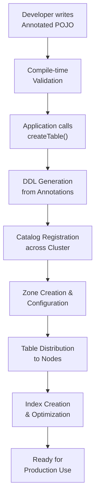
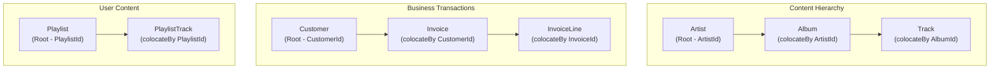

# 3. Schema-as-Code with Annotations

## 3.1 Understanding Schema-as-Code

### The Traditional Database Challenge

In traditional database development, you've likely experienced the friction of managing schemas across environments. You write SQL DDL scripts, maintain migration files, and coordinate schema changes between development, testing, and production. When working with distributed databases, this complexity multiplies - you need to consider data placement, replication strategies, and performance optimizations.

Apache Ignite 3 eliminates this friction entirely through schema-as-code with annotations.

### Why Annotations Transform Distributed Development

Think of annotations as your blueprint for distributed data architecture. Instead of writing separate SQL scripts, you embed everything directly in your Java classes:

**Traditional Approach - Scattered Information:**
```sql
-- In schema.sql
CREATE TABLE Artist (ArtistId INT PRIMARY KEY, Name VARCHAR(120));
CREATE TABLE Album (AlbumId INT, Title VARCHAR(160), ArtistId INT, 
                   PRIMARY KEY (AlbumId, ArtistId)) COLOCATE BY (ArtistId);
CREATE INDEX IFK_AlbumArtistId ON Album (ArtistId);

-- Configuration in separate files
-- Distribution zones in XML or properties
-- Indexes defined separately
-- Colocation strategies documented elsewhere
```

**Ignite 3 Approach - Everything Together:**
```java
// Complete schema definition in one place
@Table(zone = @Zone(value = "MusicStore", storageProfiles = "default"))
public class Artist {
    @Id @Column(value = "ArtistId", nullable = false)
    private Integer ArtistId;
    
    @Column(value = "Name", nullable = true, length = 120)
    private String Name;
    // Constructors, getters, setters...
}

@Table(
    zone = @Zone(value = "MusicStore", storageProfiles = "default"),
    colocateBy = @ColumnRef("ArtistId"),  // Performance optimization built-in
    indexes = { @Index(value = "IFK_AlbumArtistId", columns = { @ColumnRef("ArtistId") }) }
)
public class Album {
    @Id @Column(value = "AlbumId", nullable = false)
    private Integer AlbumId;
    
    @Column(value = "Title", nullable = false, length = 160)
    private String Title;
    
    @Id @Column(value = "ArtistId", nullable = false)  // Enables colocation
    private Integer ArtistId;
}
```

**The Power of This Approach:**

1. **Single Source of Truth**: Your Java class IS your schema - no synchronization issues
2. **Compile-Time Safety**: Invalid schemas fail at compile time, not runtime
3. **Performance by Design**: Colocation and indexing strategies are explicit and visible
4. **Environment Consistency**: Same schema definitions work across all environments
5. **Code Locality**: Schema lives next to the code that uses it
6. **Automatic Operations**: Ignite generates DDL, creates indexes, configures distribution
7. **Version Control Integration**: Schema changes are part of your normal code review process

### From Development to Production: A Seamless Journey

Let's see how schema-as-code eliminates common development pain points:

**Development Environment:**
```java
// Define your schema once
@Table(zone = @Zone(value = "MusicStore", storageProfiles = "default"))
public class Artist {
    @Id @Column(value = "ArtistId", nullable = false)
    private Integer ArtistId;
    
    @Column(value = "Name", nullable = true, length = 120)
    private String Name;
    
    // Business logic methods
    public boolean isValidName() {
        return Name != null && Name.trim().length() > 0;
    }
}
```

**What Happens Next:**
1. **Compile Time**: Annotations are validated - invalid schemas fail to compile
2. **Runtime**: Single call creates table: `client.catalog().createTable(Artist.class)`
3. **Automatic DDL**: Ignite generates optimized SQL DDL from your annotations
4. **Performance Setup**: Indexes, colocation, and distribution zones are configured automatically
5. **Production Ready**: Same code works in production with appropriate zone configurations

**The Developer Experience:**
- No SQL files to maintain
- No environment-specific schema variations
- No schema synchronization scripts
- No manual index creation
- No separate distribution configuration

This is the power of treating schema as code rather than configuration.

### The Journey from Code to Cluster

Understanding how your annotated classes become distributed tables helps you make better design decisions. Here's what happens behind the scenes:



**1. Development Phase - Compile-Time Safety**
```java
@Table(zone = @Zone(value = "MusicStore", storageProfiles = "default"))
public class Artist {
    @Id @Column(value = "ArtistId", nullable = false)
    private Integer ArtistId;  // ✓ Valid primary key
    
    @Column(value = "Name", nullable = true, length = 120)
    private String Name;  // ✓ String with length constraint
}
```
The Java compiler validates your annotations immediately. Invalid combinations (like missing @Id) cause compilation failure, catching errors before deployment.

**2. Application Startup - Table Creation**
```java
try (IgniteClient client = IgniteClient.builder()
        .addresses("127.0.0.1:10800")
        .build()) {
    
    // Single call creates complete distributed table
    client.catalog().createTable(Artist.class);
    // Behind the scenes: DDL generation, zone setup, distribution
}
```

**3. Cluster Coordination - Automatic Distribution**
- **DDL Generation**: Ignite converts annotations to optimized SQL DDL
- **Catalog Sync**: Schema is registered across all cluster nodes simultaneously  
- **Zone Assignment**: Data placement follows your distribution zone strategy
- **Index Creation**: Secondary indexes are built according to your specifications
- **Performance Setup**: Colocation strategies are configured for optimal joins

**4. Production Ready - Transparent Operation**
Once created, your tables operate transparently across the cluster. Your application code doesn't need to know which node stores which data - Ignite handles routing, consistency, and performance automatically.

This pipeline ensures that your schema intentions (performance, distribution, indexing) are realized consistently across all environments.

### The Annotation Toolbox

Ignite 3 provides six essential annotations that give you complete control over your distributed schema. Think of these as the building blocks for high-performance distributed data architecture:

#### @Table - Primary Table Configuration
- **Purpose**: Marks a Java class as an Ignite table
- **Required**: Yes (on every entity class)
- **Attributes**:
  - `value` (optional): Table name override (defaults to class name)
  - `zone`: Distribution zone via `@Zone` annotation
  - `colocateBy` (optional): Colocation strategy via `@ColumnRef`
  - `indexes` (optional): Array of `@Index` definitions

#### @Zone - Distribution Zone Definition  
- **Purpose**: Defines data distribution and replication strategy
- **Required**: Yes (within @Table)
- **Attributes**:
  - `value`: Zone name (e.g., "MusicStore", "MusicStoreReplicated")
  - `storageProfiles`: Storage engine configuration (typically "default")
  - `partitions` (optional): Number of partitions for data distribution
  - `replicas` (optional): Number of replicas for fault tolerance

#### @Column - Field-to-Column Mapping
- **Purpose**: Maps Java fields to table columns with constraints
- **Required**: Optional (defaults to field name)
- **Attributes**:
  - `value`: Column name (defaults to field name if not specified)
  - `nullable`: NULL constraint specification (default: true)
  - `length`: String column length limits (for VARCHAR columns)
  - `precision`: Numeric precision (for DECIMAL columns)
  - `scale`: Numeric scale (for DECIMAL columns)

#### @Id - Primary Key Designation
- **Purpose**: Marks fields as components of the primary key
- **Required**: Yes (at least one field per table)
- **Attributes**:
  - No attributes - simply marks the field as part of primary key
  - **Important**: For colocation, colocation key must be marked with @Id

#### @ColumnRef - Column Reference for Relationships
- **Purpose**: References columns for colocation and indexing
- **Required**: When using colocation or indexes
- **Attributes**:
  - `value`: Referenced column name
  - `sort` (optional): Sort order for indexes (ASC, DESC)

#### @Index - Secondary Index Definition
- **Purpose**: Creates database indexes for query performance
- **Required**: Optional (used within @Table indexes array)
- **Attributes**:
  - `value`: Index name
  - `columns`: Array of `@ColumnRef` for indexed columns
  - `unique` (optional): Uniqueness constraint

## 3.2 Building Your First Distributed Table

### The Foundation: Simple Entity Pattern

Every distributed application starts with simple entities. In Ignite 3, these become distributed tables automatically. Let's build an Artist entity step by step to understand each decision and its impact.

#### Step 1: Basic Entity Structure

Start with a simple Java class that represents a music artist:

```java
public class Artist {
    private Integer ArtistId;
    private String Name;
    
    // We'll add annotations next...
}
```

#### Step 2: Making It Distributed with Annotations

Now we transform this into a distributed table by adding Ignite 3 annotations:

```java
@Table(zone = @Zone(value = "MusicStore", storageProfiles = "default"))
public class Artist {
    @Id
    @Column(value = "ArtistId", nullable = false)
    private Integer ArtistId;
    
    @Column(value = "Name", nullable = true, length = 120)
    private String Name;
    
    // Ignite requires a default constructor for object creation
    public Artist() {}
    
    // Convenience constructor for application use
    public Artist(Integer artistId, String name) {
        this.ArtistId = artistId;
        this.Name = name;
    }
    
    // Standard getters and setters
    public Integer getArtistId() { return ArtistId; }
    public void setArtistId(Integer artistId) { this.ArtistId = artistId; }
    public String getName() { return Name; }
    public void setName(String name) { this.Name = name; }
}
```

**Understanding Each Annotation Choice:**

**@Table** - This declares the class as a distributed table:
- `zone = @Zone(value = "MusicStore")` - Places this table in the "MusicStore" distribution zone
- `storageProfiles = "default"` - Uses the default storage engine configuration
- **Impact**: Creates a table distributed across cluster nodes with 2 replicas (default)

**@Id** - Marks the primary key field:
- Essential for Ignite to identify unique records
- Determines how data is partitioned across nodes
- **Impact**: ArtistId becomes the partition key - all operations using this key are single-node

**@Column** - Controls column properties:
- `value = "ArtistId"` - Sets the SQL column name (could differ from Java field name)
- `nullable = false` - Creates NOT NULL constraint
- `length = 120` - Sets VARCHAR length for string columns
- **Impact**: Enforces data constraints at the database level

### Optimizing for Different Access Patterns

#### Reference Data: When Reads Outweigh Writes

Some data in your application changes rarely but gets read frequently. Music genres and media types are perfect examples - once created, they're mostly read-only but accessed by many queries.

For this pattern, use a different distribution zone optimized for read performance:

```java
@Table(zone = @Zone(value = "MusicStoreReplicated", storageProfiles = "default"))
public class Genre {
    @Id
    @Column(value = "GenreId", nullable = false)
    private Integer GenreId;
    
    @Column(value = "Name", nullable = true, length = 120)
    private String Name;
    
    public Genre() {}
    
    public Genre(Integer genreId, String name) {
        this.GenreId = genreId;
        this.Name = name;
    }
    
    // Getters and setters...
}
```

**Why a Different Zone Strategy?**

**"MusicStore" zone (operational data):**
- 2 replicas (default)
- Optimized for write performance
- Used for frequently changing data (Artists, Albums, Customer orders)

**"MusicStoreReplicated" zone (reference data):**
- 3+ replicas (configured separately)
- Optimized for read performance
- Used for lookup tables (Genres, MediaTypes, Countries)

**Performance Benefits:**
- **More Local Reads**: With more replicas, data is more likely to be local to any node
- **Better Query Performance**: Joins with reference data execute faster
- **Reduced Network Traffic**: Queries can satisfy reference lookups locally

```java
// When you configure zones, you might do:
ZoneDefinition operationalZone = ZoneDefinition.builder("MusicStore")
    .replicas(2)        // Fewer replicas = faster writes
    .build();

ZoneDefinition referenceZone = ZoneDefinition.builder("MusicStoreReplicated")
    .replicas(3)        // More replicas = faster reads
    .build();
```

### Understanding Data Types in Distributed Systems

When your data lives across multiple nodes, data type choices affect serialization, network transfer, and storage efficiency. Ignite 3 provides intelligent mapping between Java types and SQL types, but understanding these mappings helps you make optimal choices.

#### Practical Data Type Examples

Let's see how different Java types map to SQL and understand the implications for distributed storage:

```java
@Table(zone = @Zone(value = "MusicStore", storageProfiles = "default"))
public class Track {
    @Id
    @Column(value = "TrackId", nullable = false)
    private Integer TrackId;               // SQL: INTEGER - 4 bytes, good for IDs
    
    @Column(value = "Name", nullable = false, length = 200)
    private String Name;                   // SQL: VARCHAR(200) - variable length, UTF-8
    
    @Column(value = "IsExplicit", nullable = false)
    private Boolean IsExplicit;            // SQL: BOOLEAN - 1 byte, true/false
    
    @Column(value = "UnitPrice", nullable = false, precision = 10, scale = 2)
    private BigDecimal UnitPrice;          // SQL: DECIMAL(10,2) - exact precision for money
    
    @Column(value = "ReleaseDate", nullable = false)
    private LocalDate ReleaseDate;         // SQL: DATE - date only, no time
    
    @Column(value = "LastPlayed", nullable = true)
    private LocalDateTime LastPlayed;      // SQL: TIMESTAMP - date + time
    
    @Column(value = "FileSizeBytes", nullable = true)
    private Long FileSizeBytes;            // SQL: BIGINT - 8 bytes, for large numbers
    
    @Column(value = "UserRating", nullable = true)
    private Double UserRating;             // SQL: DOUBLE - floating point for ratings
    
    // Constructors, getters, setters...
}
```

**Type Selection Guidelines:**

**For Primary Keys:**
- **Integer**: Best for most ID fields (4 bytes, good distribution)
- **Long**: When you need more than 2 billion records
- **String**: Only when you have natural string keys (like product codes)

**For Money/Precision:**
- **BigDecimal**: Always use for currency and financial calculations
- **Double/Float**: Only for approximate values (ratings, percentages)

**For Strings:**
- **length** parameter is critical: `@Column(length = 200)`
- Too small = data truncation errors
- Too large = wasted storage space
- Common sizes: 50 (names), 100 (titles), 255 (general text), 500+ (descriptions)

**For Dates/Times:**
- **LocalDate**: When you only need the date (birthdays, release dates)
- **LocalDateTime**: When you need precision timestamps (created_at, updated_at)

**Network and Storage Impact:**
- Smaller types = faster serialization and network transfer
- Fixed-length types (Integer, Long) = predictable storage
- Variable-length types (String) = efficient but unpredictable storage

### Column Constraint Specifications

```java
@Table(zone = @Zone(value = "MusicStore", storageProfiles = "default"))
public class Customer {
    @Id
    @Column(value = "CustomerId", nullable = false)
    private Integer CustomerId;
    
    // Required field with length constraint
    @Column(value = "FirstName", nullable = false, length = 40)
    private String FirstName;
    
    // Required field with specific length
    @Column(value = "LastName", nullable = false, length = 20)
    private String LastName;
    
    // Optional field with length constraint
    @Column(value = "Company", nullable = true, length = 80)
    private String Company;
    
    // Required field with unique business constraint (enforced by application)
    @Column(value = "Email", nullable = false, length = 60)
    private String Email;
    
    // Optional foreign key reference
    @Column(value = "SupportRepId", nullable = true)
    private Integer SupportRepId;
    
    // Financial data with precision constraints
    @Column(value = "CreditLimit", nullable = true, precision = 12, scale = 2)
    private BigDecimal CreditLimit;
    
    public Customer() {}
    
    // Getters and setters...
}
```

### From Annotations to Working Tables

Once you've defined your entities with annotations, creating and using them follows a simple pattern. Let's walk through the complete lifecycle:

#### Step 1: Create the Distributed Schema

```java
try (IgniteClient client = IgniteClient.builder()
        .addresses("127.0.0.1:10800")
        .build()) {
    
    // Create tables in logical order (independent entities first)
    
    // 1. Reference data (no dependencies)
    client.catalog().createTable(Genre.class);
    client.catalog().createTable(MediaType.class);
    
    // 2. Root entities (independent)
    client.catalog().createTable(Artist.class);
    client.catalog().createTable(Customer.class);
    
    // 3. Dependent entities (reference others)
    client.catalog().createTable(Album.class);      // References Artist
    client.catalog().createTable(Track.class);      // References Album, Genre, MediaType
    
    System.out.println("✓ All tables created successfully across the cluster");
}
```

**What Just Happened:**
- **Cluster Coordination**: Schema changes propagated to all nodes automatically
- **DDL Generation**: Each class converted to optimized SQL DDL
- **Zone Assignment**: Tables placed in appropriate distribution zones
- **Index Creation**: Foreign key and performance indexes created
- **Storage Setup**: Storage engines configured according to profiles

#### Step 2: Start Using Your Distributed Tables

```java
// Get a view of your distributed Artist table
Table artistTable = client.tables().table("Artist");
RecordView<Artist> artistView = artistTable.recordView(Artist.class);

// Insert data - automatically distributed across nodes
Artist beatles = new Artist(1, "The Beatles");
artistView.upsert(null, beatles);  // 'null' = no explicit transaction

// The data is now stored on one or more cluster nodes based on partition key
System.out.println("✓ Artist stored and replicated across cluster");

// Retrieve data - Ignite routes to the correct node automatically
Artist keyOnly = new Artist();
keyOnly.setArtistId(1);  // Only primary key needed for lookup
Artist retrieved = artistView.get(null, keyOnly);

System.out.println("Retrieved: " + retrieved.getName());
// Output: Retrieved: The Beatles
```

**Key Points About Distributed Operations:**

**Automatic Routing**: You don't specify which node to query - Ignite routes based on the partition key (ArtistId)

**Transparent Replication**: Your data exists on multiple nodes for fault tolerance, but you work with it as a single logical table

**Consistency Guarantees**: When you retrieve data, you get the latest committed version across all replicas

**Performance**: Since Artist 1 data all lives on the same partition, this lookup is a single-node operation

## 3.3 Advanced Schema Patterns for Performance

### The Power of Composite Keys and Colocation

Now that you understand basic tables, let's explore the features that make Ignite 3 exceptionally fast for complex applications. The key insight: **related data should live together**.

In traditional databases, joins often require network round trips between different servers. In Ignite 3, you can guarantee that related data lives on the same cluster nodes through **colocation**.

#### The Business Case: Music Store Relationships

Consider how data flows in a music store:
- An **Artist** creates multiple **Albums**
- Each **Album** contains many **Tracks**
- When users browse, they often want Artist → Album → Track information together

By colocating this data, we can serve complete artist discographies from a single node, eliminating network overhead.

#### Implementing Parent-Child Colocation

Let's start with the parent entity - Artist remains simple with a single primary key:

```java
// Parent table - the "root" of our colocation hierarchy
@Table(zone = @Zone(value = "MusicStore", storageProfiles = "default"))
public class Artist {
    @Id
    @Column(value = "ArtistId", nullable = false)
    private Integer ArtistId;  // This becomes our "colocation anchor"
    
    @Column(value = "Name", nullable = true, length = 120)
    private String Name;
    
    public Artist() {}
    
    public Artist(Integer artistId, String name) {
        this.ArtistId = artistId;
        this.Name = name;
    }
    
    // Getters and setters...
}
```

Now, here's where the magic happens - the Album table that colocates with Artist:

```java
// Child table - Albums stored together with their Artist
@Table(
    zone = @Zone(value = "MusicStore", storageProfiles = "default"),
    colocateBy = @ColumnRef("ArtistId"),    // ← This is the key line!
    indexes = { @Index(value = "IFK_AlbumArtistId", columns = { @ColumnRef("ArtistId") }) }
)
public class Album {
    @Id
    @Column(value = "AlbumId", nullable = false)
    private Integer AlbumId;               // Unique album identifier
    
    @Id  // ← CRITICAL: Colocation key MUST be part of primary key
    @Column(value = "ArtistId", nullable = false)
    private Integer ArtistId;              // Links to Artist AND enables colocation
    
    @Column(value = "Title", nullable = false, length = 160)
    private String Title;
    
    public Album() {}
    
    public Album(Integer albumId, Integer artistId, String title) {
        this.AlbumId = albumId;
        this.ArtistId = artistId;
        this.Title = title;
    }
    
    // Getters and setters...
}
```

**Understanding the Colocation Setup:**

**`colocateBy = @ColumnRef("ArtistId")`** - This tells Ignite: "Store all albums for the same artist on the same cluster nodes as that artist's data."

**Why `@Id` on ArtistId?** - Ignite requires colocation keys to be part of the primary key. This ensures:
- Data partitioning works correctly
- Queries using both AlbumId and ArtistId are single-node operations
- Parent-child relationships are enforceable

**Composite Primary Key: (AlbumId, ArtistId)** - This means:
- Each album has a unique AlbumId within its artist
- The combination (AlbumId, ArtistId) is globally unique
- All albums for Artist 1 live on the same partition as Artist 1

**The Performance Benefit:**
```java
// This query executes on a SINGLE node (no network overhead)
String colocatedQuery = """
    SELECT ar.Name, al.Title 
    FROM Artist ar 
    JOIN Album al ON ar.ArtistId = al.ArtistId 
    WHERE ar.ArtistId = ?
    """;

// All data for Artist 1 is guaranteed to be on the same node
// Result: Lightning-fast joins with no network traffic
```

### Building a Three-Level Colocation Hierarchy

Let's extend our colocation chain one more level. Tracks belong to Albums, which belong to Artists. By colocating all three levels, we can serve complete artist discographies from single nodes.

#### The Track Entity: Advanced Colocation Patterns

The Track entity shows how to build complex, highly-indexed entities that participate in colocation hierarchies:

```java
@Table(
    zone = @Zone(value = "MusicStore", storageProfiles = "default"),
    colocateBy = @ColumnRef("AlbumId"),     // Tracks colocate with their Album
    indexes = {
        // Foreign key indexes for efficient joins
        @Index(value = "IFK_TrackAlbumId", columns = { @ColumnRef("AlbumId") }),
        @Index(value = "IFK_TrackGenreId", columns = { @ColumnRef("GenreId") }),
        @Index(value = "IFK_TrackMediaTypeId", columns = { @ColumnRef("MediaTypeId") }),
        
        // Business query indexes
        @Index(value = "IDX_TrackName", columns = { @ColumnRef("Name") })
    }
)
public class Track {
    @Id
    @Column(value = "TrackId", nullable = false)
    private Integer TrackId;               // Unique track identifier
    
    @Id  // ← ESSENTIAL: Colocation key must be in primary key
    @Column(value = "AlbumId", nullable = true)
    private Integer AlbumId;               // Links to Album AND enables colocation
    
    @Column(value = "Name", nullable = false, length = 200)
    private String Name;                   // Track title
    
    // Foreign key references to other tables
    @Column(value = "MediaTypeId", nullable = false)
    private Integer MediaTypeId;           // MP3, FLAC, etc.
    
    @Column(value = "GenreId", nullable = true)
    private Integer GenreId;               // Rock, Jazz, Classical, etc.
    
    // Track metadata
    @Column(value = "Composer", nullable = true, length = 220)
    private String Composer;               // Song composer (may differ from artist)
    
    @Column(value = "Milliseconds", nullable = false)
    private Integer Milliseconds;          // Track duration
    
    @Column(value = "Bytes", nullable = true)
    private Integer Bytes;                 // File size
    
    @Column(value = "UnitPrice", nullable = false, precision = 10, scale = 2)
    private BigDecimal UnitPrice;          // Price per track
    
    public Track() {}
    
    // Constructor for creating new tracks
    public Track(Integer trackId, Integer albumId, String name, 
                 Integer mediaTypeId, BigDecimal unitPrice) {
        this.TrackId = trackId;
        this.AlbumId = albumId;
        this.Name = name;
        this.MediaTypeId = mediaTypeId;
        this.UnitPrice = unitPrice;
    }
    
    // Getters and setters...
}
```

**The Complete Colocation Chain:**

```
Artist (Root)
   ↓ stored together on same nodes
Album (colocateBy ArtistId)
   ↓ stored together on same nodes  
Track (colocateBy AlbumId)
```

**What This Achieves:**
- **Artist 1** data lives on Node A
- **All Albums for Artist 1** also live on Node A
- **All Tracks for those Albums** also live on Node A
- **Result**: Complete artist discography queries execute on a single node

**Index Strategy Explained:**

**Foreign Key Indexes**: `IFK_TrackAlbumId`, `IFK_TrackGenreId`, `IFK_TrackMediaTypeId`
- Enable efficient joins with parent tables
- Critical for referential integrity checks
- Support common query patterns like "all tracks in a genre"

**Business Indexes**: `IDX_TrackName`
- Support application features like track search
- Consider your application's query patterns when choosing indexes

**Performance Impact of This Design:**
```java
// This complex query executes on a SINGLE node:
String singleNodeQuery = """
    SELECT ar.Name as Artist, al.Title as Album, t.Name as Track, t.UnitPrice
    FROM Artist ar
    JOIN Album al ON ar.ArtistId = al.ArtistId  
    JOIN Track t ON al.AlbumId = t.AlbumId
    WHERE ar.ArtistId = ?                      -- Single artist
    ORDER BY al.Title, t.Name
    """;

// All related data is colocated, so:
// - No network traffic between nodes
// - No distributed join overhead
// - Lightning-fast response times
```

### Strategic Zone Design for Performance

Now that you understand colocation, let's explore how distribution zones amplify these benefits. Different types of data need different distribution strategies:

```java
// High-throughput operational data - 2 replicas for write performance
@Table(zone = @Zone(value = "MusicStore", storageProfiles = "default"))
public class Invoice {
    @Id
    @Column(value = "InvoiceId", nullable = false)
    private Integer InvoiceId;
    
    @Id  // Colocate invoices with customer data
    @Column(value = "CustomerId", nullable = false)
    private Integer CustomerId;
    
    @Column(value = "InvoiceDate", nullable = false)
    private LocalDate InvoiceDate;
    
    @Column(value = "BillingAddress", nullable = true, length = 70)
    private String BillingAddress;
    
    @Column(value = "BillingCity", nullable = true, length = 40)
    private String BillingCity;
    
    @Column(value = "BillingState", nullable = true, length = 40)
    private String BillingState;
    
    @Column(value = "BillingCountry", nullable = true, length = 40)
    private String BillingCountry;
    
    @Column(value = "BillingPostalCode", nullable = true, length = 10)
    private String BillingPostalCode;
    
    @Column(value = "Total", nullable = false, precision = 10, scale = 2)
    private BigDecimal Total;
    
    public Invoice() {}
    // Getters and setters...
}

// Reference data - 3 replicas for read performance across more nodes
@Table(zone = @Zone(value = "MusicStoreReplicated", storageProfiles = "default"))
public class Genre {
    @Id
    @Column(value = "GenreId", nullable = false)
    private Integer GenreId;
    
    @Column(value = "Name", nullable = true, length = 120)
    private String Name;
    
    public Genre() {}
    // Getters and setters...
}
```

### Multi-Column and Composite Indexes

Advanced indexing strategies for complex query patterns:

```java
@Table(
    zone = @Zone(value = "MusicStore", storageProfiles = "default"),
    indexes = {
        // Foreign key index
        @Index(
            value = "IFK_InvoiceLineInvoiceId", 
            columns = { @ColumnRef("InvoiceId") }
        ),
        
        // Foreign key index
        @Index(
            value = "IFK_InvoiceLineTrackId", 
            columns = { @ColumnRef("TrackId") }
        ),
        
        // Composite index for common query patterns
        @Index(
            value = "IDX_InvoiceLine_Price_Qty",
            columns = { 
                @ColumnRef("UnitPrice"), 
                @ColumnRef(value = "Quantity", sort = SortOrder.DESC) 
            }
        ),
        
        // Unique composite index
        @Index(
            value = "UNQ_InvoiceLine_Invoice_Track",
            columns = { 
                @ColumnRef("InvoiceId"), 
                @ColumnRef("TrackId") 
            },
            unique = true
        )
    },
    colocateBy = @ColumnRef("InvoiceId")
)
public class InvoiceLine {
    @Id
    @Column(value = "InvoiceLineId", nullable = false)
    private Integer InvoiceLineId;
    
    @Id  // Required for colocation
    @Column(value = "InvoiceId", nullable = false)
    private Integer InvoiceId;
    
    @Column(value = "TrackId", nullable = false)
    private Integer TrackId;
    
    @Column(value = "UnitPrice", nullable = false, precision = 10, scale = 2)
    private BigDecimal UnitPrice;
    
    @Column(value = "Quantity", nullable = false)
    private Integer Quantity;
    
    public InvoiceLine() {}
    
    // Getters and setters...
}
```

### Junction Table Pattern for Many-to-Many Relationships

```java
@Table(
    zone = @Zone(value = "MusicStore", storageProfiles = "default"),
    indexes = {
        @Index(value = "IFK_PlaylistTrackPlaylistId", columns = { @ColumnRef("PlaylistId") }),
        @Index(value = "IFK_PlaylistTrackTrackId", columns = { @ColumnRef("TrackId") })
    },
    colocateBy = @ColumnRef("PlaylistId")
)
public class PlaylistTrack {
    @Id
    @Column(value = "PlaylistId", nullable = false)
    private Integer PlaylistId;
    
    @Id
    @Column(value = "TrackId", nullable = false)
    private Integer TrackId;
    
    public PlaylistTrack() {}
    
    public PlaylistTrack(Integer playlistId, Integer trackId) {
        this.PlaylistId = playlistId;
        this.TrackId = trackId;
    }
    
    // Getters and setters...
}
```

### Self-Referencing Entity Pattern

Employee hierarchies and organizational structures:

```java
@Table(
    zone = @Zone(value = "MusicStore", storageProfiles = "default"),
    indexes = {
        @Index(value = "IFK_EmployeeReportsTo", columns = { @ColumnRef("ReportsTo") }),
        @Index(value = "IDX_Employee_Email", columns = { @ColumnRef("Email") })
    }
)
public class Employee {
    @Id
    @Column(value = "EmployeeId", nullable = false)
    private Integer EmployeeId;
    
    @Column(value = "LastName", nullable = false, length = 20)
    private String LastName;
    
    @Column(value = "FirstName", nullable = false, length = 20)
    private String FirstName;
    
    @Column(value = "Title", nullable = true, length = 30)
    private String Title;
    
    // Self-referencing foreign key
    @Column(value = "ReportsTo", nullable = true)
    private Integer ReportsTo;
    
    @Column(value = "BirthDate", nullable = true)
    private LocalDate BirthDate;
    
    @Column(value = "HireDate", nullable = true)
    private LocalDate HireDate;
    
    @Column(value = "Address", nullable = true, length = 70)
    private String Address;
    
    @Column(value = "City", nullable = true, length = 40)
    private String City;
    
    @Column(value = "State", nullable = true, length = 40)
    private String State;
    
    @Column(value = "Country", nullable = true, length = 40)
    private String Country;
    
    @Column(value = "PostalCode", nullable = true, length = 10)
    private String PostalCode;
    
    @Column(value = "Phone", nullable = true, length = 24)
    private String Phone;
    
    @Column(value = "Fax", nullable = true, length = 24)
    private String Fax;
    
    @Column(value = "Email", nullable = true, length = 60)
    private String Email;
    
    public Employee() {}
    
    // Getters and setters...
}
```

## 3.4 Mastering Data Distribution for Performance

### Why Colocation Changes Everything

Imagine you're running a music streaming service. A user clicks on "The Beatles" and wants to see all their albums and top tracks. In a traditional distributed database, this might require:

1. Query Node A for Artist data
2. Query Node B for Album data  
3. Query Node C for Track data
4. Network round trips between nodes
5. Distributed join coordination
6. Result aggregation

With Ignite 3 colocation, all The Beatles data lives together on the same nodes. One query, one node, instant results.

**Colocation is Ignite 3's secret weapon for distributed performance.**

### Designing Colocation Hierarchies

**The Art of Grouping Related Data**

Successful colocation design starts with understanding your data relationships and query patterns. Here are the three major colocation patterns in our music store:



**Content Hierarchy (Artist → Album → Track):**
- **Use Case**: "Show me all AC/DC albums and their tracks"
- **Benefit**: Complete artist discography from one node
- **Performance**: Sub-millisecond browsing experience

**Business Transactions (Customer → Invoice → InvoiceLine):**
- **Use Case**: "Show customer order history with line items"
- **Benefit**: Complete customer transaction history from one node
- **Performance**: Fast customer service and reporting

**User Content (Playlist → PlaylistTrack):**
- **Use Case**: "Load user's playlist with all tracks"
- **Benefit**: Playlist operations don't span multiple nodes
- **Performance**: Instant playlist loading and editing

### The Foundation: Basic Parent-Child Colocation

Let's implement the Artist → Album relationship step by step to understand the mechanics:

#### Step 1: Define the Root Entity

```java
// Root entity establishes the partition anchor
@Table(zone = @Zone(value = "MusicStore", storageProfiles = "default"))
public class Artist {
    @Id
    @Column(value = "ArtistId", nullable = false)
    private Integer ArtistId;              // This becomes our "partition key"
    
    @Column(value = "Name", nullable = true, length = 120)
    private String Name;
    
    public Artist() {}
    
    // Business logic can be included
    public String getDisplayName() {
        return Name != null ? Name : "Unknown Artist";
    }
    
    // Standard getters and setters...
}
```

**Key Point**: Artist defines the "partition anchor." All data colocated with a specific ArtistId will live on the same cluster nodes as that Artist record.

#### Step 2: Create the Colocated Child Entity

```java
// Child entity - Albums live with their Artist
@Table(
    zone = @Zone(value = "MusicStore", storageProfiles = "default"),
    colocateBy = @ColumnRef("ArtistId"),  // ← THE MAGIC: Store with Artist
    indexes = { @Index(value = "IFK_AlbumArtistId", columns = { @ColumnRef("ArtistId") }) }
)
public class Album {
    @Id
    @Column(value = "AlbumId", nullable = false)
    private Integer AlbumId;               // Unique within the artist
    
    @Id  // ← CRITICAL: Colocation key MUST be part of primary key
    @Column(value = "ArtistId", nullable = false)
    private Integer ArtistId;              // Foreign key AND colocation key
    
    @Column(value = "Title", nullable = false, length = 160)
    private String Title;
    
    @Column(value = "ReleaseYear", nullable = true)
    private Integer ReleaseYear;
    
    public Album() {}
    
    public Album(Integer albumId, Integer artistId, String title, Integer releaseYear) {
        this.AlbumId = albumId;
        this.ArtistId = artistId;
        this.Title = title;
        this.ReleaseYear = releaseYear;
    }
    
    // Business logic
    public String getDisplayTitle() {
        return Title + (ReleaseYear != null ? " (" + ReleaseYear + ")" : "");
    }
    
    // Getters and setters...
}
```

**What This Achieves:**

**Partition Co-location**: Album with ArtistId=1 goes to the same partition as Artist with ArtistId=1

**Composite Primary Key**: (AlbumId, ArtistId) ensures global uniqueness while enabling colocation

**Index Strategy**: Foreign key index enables efficient parent-child queries

**Query Performance**: Artist-Album joins become single-node operations

### Extending Colocation: Three-Level Hierarchies

Now let's complete the chain by adding Tracks that colocate with Albums (which colocate with Artists):

```java
// Grandchild entity - extends the colocation chain
@Table(
    zone = @Zone(value = "MusicStore", storageProfiles = "default"),
    colocateBy = @ColumnRef("AlbumId"),    // Tracks colocate with Albums
    indexes = {
        @Index(value = "IFK_TrackAlbumId", columns = { @ColumnRef("AlbumId") }),
        @Index(value = "IFK_TrackGenreId", columns = { @ColumnRef("GenreId") }),
        @Index(value = "IFK_TrackMediaTypeId", columns = { @ColumnRef("MediaTypeId") })
    }
)
public class Track {
    @Id
    @Column(value = "TrackId", nullable = false)
    private Integer TrackId;               // Unique track identifier
    
    @Id  // ← ESSENTIAL: Colocation key in primary key
    @Column(value = "AlbumId", nullable = true)
    private Integer AlbumId;               // Links to Album AND enables colocation
    
    @Column(value = "Name", nullable = false, length = 200)
    private String Name;
    
    // Foreign keys to reference data (different zones)
    @Column(value = "MediaTypeId", nullable = false)
    private Integer MediaTypeId;           // Links to MediaType table
    
    @Column(value = "GenreId", nullable = true)
    private Integer GenreId;               // Links to Genre table
    
    // Track-specific data
    @Column(value = "Composer", nullable = true, length = 220)
    private String Composer;
    
    @Column(value = "Milliseconds", nullable = false)
    private Integer Milliseconds;
    
    @Column(value = "Bytes", nullable = true)
    private Integer Bytes;
    
    @Column(value = "UnitPrice", nullable = false, precision = 10, scale = 2)
    private BigDecimal UnitPrice;
    
    public Track() {}
    
    // Business logic methods
    public String getDurationFormatted() {
        int seconds = Milliseconds / 1000;
        return String.format("%d:%02d", seconds / 60, seconds % 60);
    }
    
    public double getSizeInMB() {
        return Bytes != null ? Bytes / (1024.0 * 1024.0) : 0.0;
    }
    
    // Getters and setters...
}
```

**The Complete Colocation Chain:**

```
Cluster Node A:
┌──────────────────────────────────────────────────┐
│ Artist: (1, "The Beatles")                        │
│                                                  │
│ Album: (101, 1, "Abbey Road")                    │
│ Album: (102, 1, "Sgt. Pepper's...")              │
│                                                  │
│ Track: (1001, 101, "Come Together")              │
│ Track: (1002, 101, "Something")                  │
│ Track: (1003, 102, "Lucy in the Sky...")         │
│ Track: (1004, 102, "A Day in the Life")          │
└──────────────────────────────────────────────────┘
```

**Transitive Colocation**: Since Albums colocate with Artists, and Tracks colocate with Albums, then Tracks automatically colocate with Artists too. The Beatles' entire discography lives together.

**Query Performance Impact**:
```java
// This complex query runs on ONE node:
String threeTableJoin = """
    SELECT 
        ar.Name as Artist,
        al.Title as Album, 
        t.Name as Track,
        t.UnitPrice
    FROM Artist ar
    JOIN Album al ON ar.ArtistId = al.ArtistId
    JOIN Track t ON al.AlbumId = t.AlbumId  
    WHERE ar.ArtistId = ?                    -- Single artist = single node
    ORDER BY al.Title, t.Name
    """;

// Result: 
// - No network traffic
// - No distributed coordination
// - Maximum performance
```

### Business Transaction Colocation

Let's look at a different colocation pattern - business transactions. Customer purchase history should stay together for fast customer service and reporting:

#### Customer: The Transaction Root

```java
// Root entity for customer transactions
@Table(zone = @Zone(value = "MusicStore", storageProfiles = "default"))
public class Customer {
    @Id
    @Column(value = "CustomerId", nullable = false)
    private Integer CustomerId;            // Transaction partition anchor
    
    @Column(value = "FirstName", nullable = false, length = 40)
    private String FirstName;
    
    @Column(value = "LastName", nullable = false, length = 20)
    private String LastName;
    
    @Column(value = "Email", nullable = false, length = 60)
    private String Email;
    
    @Column(value = "Phone", nullable = true, length = 24)
    private String Phone;
    
    @Column(value = "Address", nullable = true, length = 70)
    private String Address;
    
    @Column(value = "City", nullable = true, length = 40)
    private String City;
    
    @Column(value = "Country", nullable = true, length = 40)
    private String Country;
    
    public Customer() {}
    
    // Business logic for customer display
    public String getFullName() {
        return FirstName + " " + LastName;
    }
    
    public String getLocation() {
        if (City != null && Country != null) {
            return City + ", " + Country;
        }
        return Country != null ? Country : "Unknown";
    }
    
    // Getters and setters...
}
```

#### Invoice: Customer Transaction History

```java
// Invoices colocated with customer data
@Table(
    zone = @Zone(value = "MusicStore", storageProfiles = "default"),
    colocateBy = @ColumnRef("CustomerId"),    // All customer invoices together
    indexes = { @Index(value = "IFK_InvoiceCustomerId", columns = { @ColumnRef("CustomerId") }) }
)
public class Invoice {
    @Id
    @Column(value = "InvoiceId", nullable = false)
    private Integer InvoiceId;             // Unique invoice identifier
    
    @Id  // ← Enables colocation with Customer
    @Column(value = "CustomerId", nullable = false)
    private Integer CustomerId;            // Links to Customer
    
    @Column(value = "InvoiceDate", nullable = false)
    private LocalDate InvoiceDate;
    
    @Column(value = "BillingAddress", nullable = true, length = 70)
    private String BillingAddress;
    
    @Column(value = "BillingCity", nullable = true, length = 40)
    private String BillingCity;
    
    @Column(value = "BillingCountry", nullable = true, length = 40)
    private String BillingCountry;
    
    @Column(value = "Total", nullable = false, precision = 10, scale = 2)
    private BigDecimal Total;
    
    public Invoice() {}
    
    // Business logic
    public String getFormattedTotal() {
        return "$" + Total.toString();
    }
    
    public boolean isRecentOrder() {
        return InvoiceDate.isAfter(LocalDate.now().minusDays(30));
    }
    
    // Getters and setters...
}
```

**Business Benefits of This Colocation:**

**Customer Service**: "Show me all orders for customer John Doe" → Single-node query

**Order History**: Complete customer purchase history from one partition

**Reporting**: Customer analytics and lifetime value calculations are local operations

**Performance**: Customer dashboard loading becomes sub-millisecond operations

### Colocation Best Practices

#### Critical Rule #1: Colocation Keys Must Be Primary Keys

This is the most important rule in Ignite 3 colocation. Violating it will cause table creation to fail:

```java
// ✓ CORRECT: Colocation key is part of primary key
@Table(colocateBy = @ColumnRef("ArtistId"))
public class Album {
    @Id @Column(value = "AlbumId", nullable = false)
    private Integer AlbumId;
    
    @Id @Column(value = "ArtistId", nullable = false)  // ✓ Part of PK
    private Integer ArtistId;
}

// ✗ INCORRECT: Will fail at table creation time
@Table(colocateBy = @ColumnRef("ArtistId"))
public class Album {
    @Id @Column(value = "AlbumId", nullable = false)
    private Integer AlbumId;
    
    @Column(value = "ArtistId", nullable = false)  // ✗ Not part of PK
    private Integer ArtistId;
}
```

**Why This Rule Exists:**
- **Partitioning Logic**: Ignite uses primary key components to determine data placement
- **Consistency**: Ensures all operations can locate the correct partition
- **Performance**: Enables single-node operations for colocated data

**Error You'll See:**
```
IgniteException: Colocation column 'ArtistId' must be part of primary key
```

#### Critical Rule #2: Data Type Consistency Across Hierarchies

Colocation keys must have identical data types throughout the hierarchy:

```java
// Parent table defines the type
@Table(zone = @Zone(value = "MusicStore"))
public class Artist {
    @Id @Column(value = "ArtistId", nullable = false)
    private Integer ArtistId;  // ← This establishes INTEGER as the type
}

// Child table MUST use the same type
@Table(colocateBy = @ColumnRef("ArtistId"))
public class Album {
    @Id @Column(value = "ArtistId", nullable = false)
    private Integer ArtistId;  // ✓ INTEGER matches parent
}

// ✗ WRONG: Type mismatches cause runtime errors
@Table(colocateBy = @ColumnRef("ArtistId"))
public class Album {
    @Id @Column(value = "ArtistId", nullable = false)
    private Long ArtistId;     // ✗ BIGINT != INTEGER
}

@Table(colocateBy = @ColumnRef("ArtistId"))
public class Album {
    @Id @Column(value = "ArtistId", nullable = false)
    private String ArtistId;   // ✗ VARCHAR != INTEGER
}
```

**Why Type Consistency Matters:**
- **Partitioning Hash Functions**: Different types hash differently
- **Join Performance**: Type mismatches prevent join optimizations  
- **Data Integrity**: Prevents foreign key relationship errors

**Best Practice**: Define colocation key types once and reuse them consistently across all related entities.

#### Critical Rule #3: Choose High-Cardinality Colocation Keys

Colocation keys should have many distinct values to ensure even data distribution:

```java
// ✓ EXCELLENT: High cardinality, even distribution
@Table(colocateBy = @ColumnRef("CustomerId"))  // Thousands of customers
public class Invoice { ... }

@Table(colocateBy = @ColumnRef("ArtistId"))    // Hundreds of artists
public class Album { ... }

// ✗ POOR: Low cardinality, uneven distribution
@Table(colocateBy = @ColumnRef("CountryId"))   // ~200 countries worldwide
public class Customer { ... }

@Table(colocateBy = @ColumnRef("GenreId"))     // ~20 music genres
public class Track { ... }
```

**Distribution Impact Examples:**

**Good Distribution (CustomerId):**
```
Node A: Customers 1-1000    (1000 customers)
Node B: Customers 1001-2000 (1000 customers)  
Node C: Customers 2001-3000 (1000 customers)
→ Even workload distribution
```

**Poor Distribution (CountryId):**
```
Node A: USA customers       (40% of all customers)
Node B: Other countries     (30% of all customers)
Node C: Remaining countries (30% of all customers)
→ Node A becomes a bottleneck
```

**Cardinality Guidelines:**
- **Excellent**: 1000+ distinct values (CustomerId, OrderId, UserId)
- **Good**: 100+ distinct values (ProductId, ArtistId)
- **Acceptable**: 50+ distinct values (CategoryId, DepartmentId)
- **Poor**: <20 distinct values (CountryId, StatusId, TypeId)

**When Low Cardinality is Unavoidable:**
Sometimes you need to colocate by low-cardinality keys. In these cases:
- Monitor for hot spots
- Consider data modeling alternatives
- Use different distribution strategies

### Measuring Colocation Performance Benefits

#### The Power of Single-Node Queries

Let's see the dramatic performance difference colocation makes with real examples:

```java
// ✓ OPTIMIZED: Single-node query due to colocation
String colocatedQuery = """
    SELECT 
        ar.Name as Artist,
        al.Title as Album,
        t.Name as Track,
        t.UnitPrice
    FROM Artist ar
    JOIN Album al ON ar.ArtistId = al.ArtistId  -- Colocated join
    JOIN Track t ON al.AlbumId = t.AlbumId      -- Colocated join
    WHERE ar.ArtistId = ?                       -- Single partition
    ORDER BY al.Title, t.Name
    """;

// Execute the optimized query
try (ResultSet<SqlRow> result = client.sql().execute(null, colocatedQuery, 1)) {
    long startTime = System.nanoTime();
    
    while (result.hasNext()) {
        SqlRow row = result.next();
        System.out.printf("%s - %s - %s ($%.2f)%n",
            row.stringValue("Artist"),
            row.stringValue("Album"), 
            row.stringValue("Track"),
            row.doubleValue("UnitPrice"));
    }
    
    long duration = System.nanoTime() - startTime;
    System.out.printf("Query executed in %.2f ms%n", duration / 1_000_000.0);
    // Typical result: "Query executed in 2.3 ms"
}
```

**What Makes This Fast:**
- **Single Node Execution**: All data for Artist 1 lives on one node
- **No Network I/O**: Joins happen in local memory
- **No Distributed Coordination**: Query coordinator doesn't need to collect results from multiple nodes
- **Cache Efficiency**: Related data has better cache locality

#### Understanding Cross-Domain Query Costs

Not all queries can be single-node. Here's an example that spans multiple colocation domains:

```java
// ⚠️ COMPLEX: Cross-domain query requiring coordination
String crossDomainQuery = """
    SELECT 
        c.FirstName || ' ' || c.LastName as Customer,
        ar.Name as Artist,
        COUNT(*) as PurchasedTracks
    FROM Customer c                               -- Customer domain
    JOIN Invoice i ON c.CustomerId = i.CustomerId            -- Colocated with Customer
    JOIN InvoiceLine il ON i.InvoiceId = il.InvoiceId        -- Colocated with Invoice  
    JOIN Track t ON il.TrackId = t.TrackId                   -- Artist domain (different!)
    JOIN Album al ON t.AlbumId = al.AlbumId                  -- Colocated with Track
    JOIN Artist ar ON al.ArtistId = ar.ArtistId              -- Colocated with Album
    GROUP BY c.CustomerId, c.FirstName, c.LastName, ar.ArtistId, ar.Name
    ORDER BY PurchasedTracks DESC
    """;

// This query bridges two colocation domains:
// 1. Customer → Invoice → InvoiceLine (customer transaction domain)
// 2. Artist → Album → Track (content catalog domain)

try (ResultSet<SqlRow> result = client.sql().execute(null, crossDomainQuery)) {
    long startTime = System.nanoTime();
    
    while (result.hasNext()) {
        SqlRow row = result.next();
        System.out.printf("%s bought %d tracks by %s%n",
            row.stringValue("Customer"),
            row.intValue("PurchasedTracks"),
            row.stringValue("Artist"));
    }
    
    long duration = System.nanoTime() - startTime;
    System.out.printf("Cross-domain query executed in %.2f ms%n", duration / 1_000_000.0);
    // Typical result: "Cross-domain query executed in 45.7 ms"
}
```

**Why This Is Slower:**
- **Multiple Partitions**: Query touches both customer and artist partitions
- **Network Coordination**: Query coordinator must collect and merge results from multiple nodes
- **Distributed Joins**: The Track ↔ InvoiceLine join crosses colocation boundaries
- **Aggregation Overhead**: GROUP BY requires coordination across nodes

**Performance Comparison:**
- **Single-domain query**: 2-5 ms (colocated Artist → Album → Track)
- **Cross-domain query**: 20-50 ms (Customer purchases ↔ Artist catalog)
- **Difference**: 10x+ performance impact for cross-domain operations

**Design Implications:**
- **Optimize Common Queries**: Design colocation around your most frequent query patterns
- **Accept Cross-Domain Costs**: Some analytical queries will always be cross-domain
- **Cache Results**: Consider caching expensive cross-domain query results
- **Denormalization**: Sometimes duplicate data to avoid cross-domain joins

### Zone Strategy for Optimal Colocation

Different data patterns require different zone configurations. Here's how to optimize zones for colocation:

#### Operational Data Zones (Frequent Writes + Colocation)

```java
// Optimized for write performance with colocation benefits
@Table(
    zone = @Zone(
        value = "MusicStore",           // Operational data zone
        storageProfiles = "default"      // 2 replicas (default)
        // Optimized for: Write performance, colocation efficiency
    ),
    colocateBy = @ColumnRef("ArtistId")   // Enable content hierarchy colocation
)
public class Album { ... }

@Table(
    zone = @Zone(
        value = "MusicStore",
        storageProfiles = "default"
    ),
    colocateBy = @ColumnRef("CustomerId")  // Enable transaction colocation
)
public class Invoice { ... }
```

**Operational Zone Characteristics:**
- **2 Replicas**: Balances fault tolerance with write performance
- **Colocation Enabled**: Related entities stay together
- **Write Optimized**: Fewer replicas = faster write confirmation
- **Use Cases**: User transactions, content management, real-time operations

#### Reference Data Zones (Read-Heavy + No Colocation)

```java
// Optimized for read performance across the cluster
@Table(
    zone = @Zone(
        value = "MusicStoreReplicated",     // Reference data zone
        storageProfiles = "default"          // 3+ replicas
        // Optimized for: Read performance, global availability
    )
    // No colocation - reference data is accessed from everywhere
)
public class Genre { ... }

@Table(
    zone = @Zone(
        value = "MusicStoreReplicated",
        storageProfiles = "default"
    )
)
public class MediaType { ... }
```

**Reference Zone Characteristics:**
- **3+ Replicas**: More copies = more local reads
- **No Colocation**: Small lookup tables don't benefit from colocation
- **Read Optimized**: More replicas = better read performance
- **Use Cases**: Lookup tables, configuration data, rarely-changing data

#### Zone Configuration in Practice

```java
// When you create zones, configure them for their intended use
public void setupZones(IgniteClient client) {
    // Operational zone: balanced performance
    ZoneDefinition operationalZone = ZoneDefinition.builder("MusicStore")
        .replicas(2)                    // Write-optimized
        .storageProfiles("default")
        .ifNotExists()
        .build();
    
    // Reference zone: read-optimized
    ZoneDefinition referenceZone = ZoneDefinition.builder("MusicStoreReplicated")
        .replicas(3)                    // Read-optimized
        .storageProfiles("default")
        .ifNotExists()
        .build();
    
    client.catalog().createZone(operationalZone);
    client.catalog().createZone(referenceZone);
    
    System.out.println("Zones configured for optimal colocation performance");
}
```

## 3.5 Choosing Your Data Access Pattern

### The Key Decision: How Do You Want to Work with Data?

Ignite 3 gives you two distinct approaches for interacting with your distributed tables. This choice significantly impacts your application's performance, complexity, and development speed.

Think of it like choosing between a sports car and an SUV - both get you there, but each is optimized for different scenarios.

**Key/Value Pattern**: The "sports car" - maximum performance, more complexity
**Record Pattern**: The "SUV" - simpler development, good all-around performance

Let's explore when to use each approach.

### Key/Value Pattern: Maximum Performance

#### When Your Application Demands Peak Performance

The Key/Value pattern shines in scenarios where you need to squeeze every millisecond of performance from your distributed system. You separate your entity into two classes: one for the key fields and one for the value fields.

**Choose Key/Value When You Have:**

1. **High-Frequency Operations**: Millions of operations per second where microseconds matter
2. **Complex Composite Keys**: Multiple fields form the primary key (common in normalized schemas)
3. **Key-Only Operations**: Frequent existence checks, deletions, or key-based iterations
4. **Memory-Sensitive Applications**: Every byte of network transfer affects performance
5. **Bulk Processing**: Streaming data ingestion or batch processing scenarios
6. **Partial Updates**: Often update only some fields, not the entire entity

**Performance Benefits:**
- **Network Efficiency**: Send only the data you need (key vs. full entity)
- **Memory Optimization**: Smaller objects in memory and on the wire
- **CPU Efficiency**: Less serialization/deserialization overhead
- **Cache Optimization**: Better cache hit rates for key-only operations

#### Real-World Example: High-Performance Playlist Management

Let's build a playlist system that handles millions of track additions per day. Here, performance is critical:

```java
// Key class: Only the essential identifying information
public class PlaylistTrackKey {
    @Id
    @Column(value = "PlaylistId", nullable = false)
    private Integer PlaylistId;            // Which playlist
    
    @Id
    @Column(value = "TrackId", nullable = false)
    private Integer TrackId;               // Which track
    
    public PlaylistTrackKey() {}           // Required by Ignite
    
    public PlaylistTrackKey(Integer playlistId, Integer trackId) {
        this.PlaylistId = playlistId;
        this.TrackId = trackId;
    }
    
    // CRITICAL: Proper equals and hashCode for distributed operations
    @Override
    public boolean equals(Object o) {
        if (this == o) return true;
        if (!(o instanceof PlaylistTrackKey)) return false;
        PlaylistTrackKey that = (PlaylistTrackKey) o;
        return Objects.equals(PlaylistId, that.PlaylistId) && 
               Objects.equals(TrackId, that.TrackId);
    }
    
    @Override
    public int hashCode() {
        return Objects.hash(PlaylistId, TrackId);
    }
    
    // Getters and setters...
}

// Value class: The additional data that can change
public class PlaylistTrackValue {
    @Column(value = "SortOrder", nullable = true)
    private Integer SortOrder;             // Order within playlist
    
    @Column(value = "DateAdded", nullable = false)
    private LocalDateTime DateAdded;       // When added to playlist
    
    @Column(value = "UserRating", nullable = true)
    private Integer UserRating;            // User's rating for this track
    
    public PlaylistTrackValue() {}
    
    public PlaylistTrackValue(Integer sortOrder, LocalDateTime dateAdded) {
        this.SortOrder = sortOrder;
        this.DateAdded = dateAdded;
    }
    
    // Business logic in value class
    public boolean isRecentlyAdded() {
        return DateAdded.isAfter(LocalDateTime.now().minusHours(24));
    }
    
    // Getters and setters...
}
```

#### High-Performance Operations

```java
// Performance-optimized playlist operations
public class PlaylistService {
    private final KeyValueView<PlaylistTrackKey, PlaylistTrackValue> playlistTrackView;
    
    public PlaylistService(IgniteClient client) {
        this.playlistTrackView = client.tables().table("PlaylistTrack")
            .keyValueView(PlaylistTrackKey.class, PlaylistTrackValue.class);
    }
    
    // Ultra-fast existence check (only 8 bytes over network)
    public boolean isTrackInPlaylist(Integer playlistId, Integer trackId) {
        PlaylistTrackKey key = new PlaylistTrackKey(playlistId, trackId);
        return playlistTrackView.contains(null, key);  // Only key sent over network
    }
    
    // Efficient addition (minimal data transfer)
    public void addTrackToPlaylist(Integer playlistId, Integer trackId, Integer sortOrder) {
        PlaylistTrackKey key = new PlaylistTrackKey(playlistId, trackId);
        PlaylistTrackValue value = new PlaylistTrackValue(sortOrder, LocalDateTime.now());
        
        // Only key + value sent (much smaller than full entity)
        playlistTrackView.put(null, key, value);
    }
    
    // Update only metadata (super efficient)
    public void updateTrackOrder(Integer playlistId, Integer trackId, Integer newOrder) {
        PlaylistTrackKey key = new PlaylistTrackKey(playlistId, trackId);
        
        // Get current value
        PlaylistTrackValue value = playlistTrackView.get(null, key);
        if (value != null) {
            value.setSortOrder(newOrder);
            playlistTrackView.put(null, key, value);  // Only value updated
        }
    }
    
    // Bulk operations - highly efficient
    public void removeMultipleTracks(Integer playlistId, List<Integer> trackIds) {
        List<PlaylistTrackKey> keys = trackIds.stream()
            .map(trackId -> new PlaylistTrackKey(playlistId, trackId))
            .collect(Collectors.toList());
        
        // Batch delete - only keys transmitted
        playlistTrackView.removeAll(null, keys);
    }
}
```

**Performance Benefits in Action:**

**Existence Check**:
- Key/Value: 8 bytes (2 integers)
- Record: 40+ bytes (full entity)
- **Result**: 5x less network traffic

**Bulk Operations**:
- Key/Value: Only necessary data
- Record: Full entities even for key-only operations
- **Result**: 10x+ faster bulk operations

#### InvoiceLine Example - Business Transaction Detail

```java
public class InvoiceLineKey {
    @Id
    @Column(value = "InvoiceLineId", nullable = false)
    private Integer InvoiceLineId;
    
    @Id
    @Column(value = "InvoiceId", nullable = false)
    private Integer InvoiceId;  // For colocation
    
    public InvoiceLineKey() {}
    
    public InvoiceLineKey(Integer invoiceLineId, Integer invoiceId) {
        this.InvoiceLineId = invoiceLineId;
        this.InvoiceId = invoiceId;
    }
    
    // Equals, hashCode, getters, setters...
}

public class InvoiceLineValue {
    @Column(value = "TrackId", nullable = false)
    private Integer TrackId;
    
    @Column(value = "UnitPrice", nullable = false, precision = 10, scale = 2)
    private BigDecimal UnitPrice;
    
    @Column(value = "Quantity", nullable = false)
    private Integer Quantity;
    
    public InvoiceLineValue() {}
    
    public InvoiceLineValue(Integer trackId, BigDecimal unitPrice, Integer quantity) {
        this.TrackId = trackId;
        this.UnitPrice = unitPrice;
        this.Quantity = quantity;
    }
    
    // Calculate total
    public BigDecimal getTotal() {
        return UnitPrice.multiply(BigDecimal.valueOf(Quantity));
    }
    
    // Getters and setters...
}
```

### Record Pattern: Simplicity and Speed of Development

#### When Developer Productivity Matters Most

The Record pattern treats your table like a traditional object-relational mapping. One class represents the entire entity, making development straightforward and intuitive.

**Choose Record Pattern When You Have:**

1. **Simple Entities**: Single primary keys or entities you always work with completely
2. **Rapid Development**: Prototyping, MVPs, or development speed is critical
3. **Entity-Centric Logic**: Business operations typically involve the complete entity
4. **Team Familiarity**: Developers comfortable with JPA/Hibernate patterns
5. **Simpler Maintenance**: Fewer classes to manage and maintain
6. **Traditional Workflows**: CRUD operations, form-based applications, reporting

**Development Benefits:**
- **Fewer Classes**: One class per table instead of two
- **Simpler APIs**: Direct entity operations
- **Familiar Patterns**: Similar to JPA/Hibernate development
- **Faster Prototyping**: Get working code quickly
- **Less Complexity**: Easier to understand and maintain

#### Real-World Example: Customer Management System

Let's build a customer management system where simplicity and rapid development are priorities:

```java
// Single class represents the complete customer entity
@Table(
    zone = @Zone(value = "MusicStore", storageProfiles = "default"),
    indexes = {
        @Index(value = "IFK_CustomerSupportRepId", columns = { @ColumnRef("SupportRepId") }),
        @Index(value = "IDX_Customer_Email", columns = { @ColumnRef("Email") }),
        @Index(value = "IDX_Customer_Location", columns = { 
            @ColumnRef("Country"), 
            @ColumnRef("City") 
        })
    }
)
public class Customer {
    // Primary key - simple single field
    @Id
    @Column(value = "CustomerId", nullable = false)
    private Integer CustomerId;
    
    // Personal information
    @Column(value = "FirstName", nullable = false, length = 40)
    private String FirstName;
    
    @Column(value = "LastName", nullable = false, length = 20)
    private String LastName;
    
    @Column(value = "Email", nullable = false, length = 60)
    private String Email;
    
    // Contact information
    @Column(value = "Company", nullable = true, length = 80)
    private String Company;
    
    @Column(value = "Phone", nullable = true, length = 24)
    private String Phone;
    
    // Address information
    @Column(value = "Address", nullable = true, length = 70)
    private String Address;
    
    @Column(value = "City", nullable = true, length = 40)
    private String City;
    
    @Column(value = "State", nullable = true, length = 40)
    private String State;
    
    @Column(value = "Country", nullable = true, length = 40)
    private String Country;
    
    @Column(value = "PostalCode", nullable = true, length = 10)
    private String PostalCode;
    
    // Business relationship
    @Column(value = "SupportRepId", nullable = true)
    private Integer SupportRepId;
    
    public Customer() {}  // Required by Ignite
    
    // Business logic methods embedded in the entity
    public String getFullName() {
        return FirstName + " " + LastName;
    }
    
    public String getDisplayName() {
        if (Company != null && !Company.trim().isEmpty()) {
            return getFullName() + " (" + Company + ")";
        }
        return getFullName();
    }
    
    public String getFullAddress() {
        StringBuilder addr = new StringBuilder();
        if (Address != null) addr.append(Address);
        if (City != null) addr.append(", ").append(City);
        if (State != null) addr.append(", ").append(State);
        if (Country != null) addr.append(", ").append(Country);
        return addr.toString();
    }
    
    public boolean hasCompleteAddress() {
        return Address != null && City != null && Country != null;
    }
    
    // Standard getters and setters...
}
```

#### Simple and Productive Operations

```java
// Straightforward customer service operations
public class CustomerService {
    private final RecordView<Customer> customerView;
    
    public CustomerService(IgniteClient client) {
        this.customerView = client.tables().table("Customer")
            .recordView(Customer.class);
    }
    
    // Create new customer - intuitive and simple
    public void createCustomer(String firstName, String lastName, String email, 
                              String city, String country) {
        Customer customer = new Customer();
        customer.setCustomerId(generateCustomerId());
        customer.setFirstName(firstName);
        customer.setLastName(lastName);
        customer.setEmail(email);
        customer.setCity(city);
        customer.setCountry(country);
        
        customerView.upsert(null, customer);
    }
    
    // Get complete customer information
    public Customer getCustomer(Integer customerId) {
        Customer key = new Customer();
        key.setCustomerId(customerId);
        return customerView.get(null, key);
    }
    
    // Update customer information - work with complete entity
    public void updateCustomerAddress(Integer customerId, String address, 
                                     String city, String state, String country) {
        Customer customer = getCustomer(customerId);
        if (customer != null) {
            customer.setAddress(address);
            customer.setCity(city);
            customer.setState(state);
            customer.setCountry(country);
            
            customerView.upsert(null, customer);  // Update complete entity
        }
    }
    
    // Business operations using entity methods
    public String getCustomerDisplayInfo(Integer customerId) {
        Customer customer = getCustomer(customerId);
        if (customer != null) {
            StringBuilder info = new StringBuilder();
            info.append("Customer: ").append(customer.getDisplayName()).append("\n");
            info.append("Email: ").append(customer.getEmail()).append("\n");
            if (customer.hasCompleteAddress()) {
                info.append("Address: ").append(customer.getFullAddress());
            }
            return info.toString();
        }
        return "Customer not found";
    }
    
    private Integer generateCustomerId() {
        // Implementation for generating unique IDs
        return (int) (System.currentTimeMillis() % Integer.MAX_VALUE);
    }
}
```

**Development Benefits in Action:**

**Fewer Files**: One Customer.java instead of CustomerKey.java + CustomerValue.java

**Simpler API**: Direct entity operations instead of key/value coordination

**Familiar Patterns**: Works like JPA entities most developers know

**Rapid Prototyping**: Get a working customer system in minutes, not hours

### Making the Right Choice for Your Application

#### Performance and Complexity Trade-offs

Choosing between Key/Value and Record patterns is about finding the right balance for your specific needs:

| **Performance Characteristics** | **Key/Value Pattern** | **Record Pattern** |
|---|---|---|
| **Network Transfer** | Only required fields transmitted | Complete entity always sent |
| **Memory Usage** | Minimal for key-only operations | Higher for all operations |
| **Serialization Cost** | Separate key/value (more efficient) | Single object (simpler) |
| **Bulk Operations** | Highly optimized for large datasets | Good for moderate datasets |
| **Partial Updates** | Update only changed fields | Replace entire entity |
| **Query Performance** | Requires key+value assembly | Direct entity mapping |

|---|---|---|
| **Development Experience** | **Key/Value Pattern** | **Record Pattern** |
| **Code Complexity** | Higher (two classes per table) | Lower (one class per table) |
| **Learning Curve** | Steeper (distributed concepts) | Gentler (familiar ORM pattern) |
| **Development Speed** | Slower initial setup | Faster prototyping |
| **Maintenance** | More files to manage | Fewer files to track |
| **Type Safety** | Very high (compile-time separation) | High (unified validation) |
| **IDE Support** | More complex (two class navigation) | Simpler (single class focus) |

#### Decision Framework: Choosing the Right Pattern

Use this decision tree to choose the optimal pattern for each table:

```
Start: What type of table are you designing?

┌─ Junction Tables (Many-to-Many)
│  ├─ PlaylistTrack, UserRole, OrderItem
│  └─ → Use KEY/VALUE (always)
│      Reason: Composite keys, frequent existence checks

├─ Transaction Detail Tables
│  ├─ InvoiceLine, OrderLine, CartItem  
│  └─ → Use KEY/VALUE (recommended)
│      Reason: High volume, partial updates, performance critical

├─ Main Entity Tables
│  ├─ Customer, Artist, Product, User
│  └─ Decision Point: How do you use this entity?
│      ├─ Mostly complete entity operations → Use RECORD
│      └─ Frequent key-only operations → Use KEY/VALUE

└─ Reference/Lookup Tables
   ├─ Genre, Country, Category, Status
   └─ → Use RECORD (usually)
       Reason: Simple, infrequent changes, complete entity access
```

#### Real-World Application Examples

**E-commerce Application:**
```java
// KEY/VALUE Pattern
UserRole        // Junction table: User ↔ Role relationships
CartItem        // High-volume: Add/remove items frequently
OrderLine       // Transaction details: Price, quantity updates
ProductCategory // Many-to-many: Product ↔ Category

// RECORD Pattern  
User           // Entity-centric: User profiles, authentication
Product        // Entity-centric: Product catalog management
Order          // Entity-centric: Order processing workflows
Category       // Reference data: Simple category management
```

**Music Streaming Application:**
```java
// KEY/VALUE Pattern
PlaylistTrack   // High-volume: Adding/removing songs from playlists
UserPreference  // Composite keys: User + PreferenceType
ListeningHistory // High-volume: Track plays, skip events

// RECORD Pattern
Artist         // Entity-centric: Artist profile management
Album          // Entity-centric: Album metadata
User           // Entity-centric: User account management
Playlist       // Entity-centric: Playlist management
```

#### Performance Scenarios

**Choose KEY/VALUE for:**
- **High-Frequency Operations**: > 10,000 ops/second per table
- **Existence Checks**: "Is user X following user Y?"
- **Bulk Processing**: ETL operations, data migrations
- **Caching Layers**: Session storage, temporary data
- **Analytics**: Event tracking, metrics collection

**Choose RECORD for:**
- **Business Workflows**: Order processing, user registration
- **Admin Interfaces**: CRUD forms, management dashboards
- **Reporting**: Entity-based reports and analytics
- **Prototyping**: MVP development, proof-of-concepts
- **Traditional Applications**: Web forms, content management

### Hybrid Approach Example

```java
// You can use both patterns in the same application
public class MusicStoreService {
    
    // Simple entities use Record pattern
    private final RecordView<Artist> artistView;
    private final RecordView<Customer> customerView;
    
    // Complex entities use Key/Value pattern
    private final KeyValueView<PlaylistTrackKey, PlaylistTrackValue> playlistTrackView;
    private final KeyValueView<InvoiceLineKey, InvoiceLineValue> invoiceLineView;
    
    public MusicStoreService(IgniteClient client) {
        this.artistView = client.tables().table("Artist").recordView(Artist.class);
        this.customerView = client.tables().table("Customer").recordView(Customer.class);
        this.playlistTrackView = client.tables().table("PlaylistTrack")
            .keyValueView(PlaylistTrackKey.class, PlaylistTrackValue.class);
        this.invoiceLineView = client.tables().table("InvoiceLine")
            .keyValueView(InvoiceLineKey.class, InvoiceLineValue.class);
    }
    
    // Entity-centric operations use Record pattern
    public Customer getCustomerWithDetails(Integer customerId) {
        Customer key = new Customer();
        key.setCustomerId(customerId);
        return customerView.get(null, key);
    }
    
    // Performance-critical operations use Key/Value pattern
    public boolean isTrackInPlaylist(Integer playlistId, Integer trackId) {
        PlaylistTrackKey key = new PlaylistTrackKey(playlistId, trackId);
        return playlistTrackView.contains(null, key);
    }
}
```

## 3.6 From Annotations to Production Tables

### The Magic: Automatic DDL Generation

One of Ignite 3's most powerful features is its ability to generate production-ready SQL DDL from your Java annotations. This isn't just a convenience feature - it's a fundamental shift in how you think about schema management.

**Traditional Database Development:**
1. Design schema in SQL
2. Write DDL scripts
3. Create matching Java classes
4. Keep both in sync manually
5. Handle environment differences
6. Manage migration scripts

**Ignite 3 Schema-as-Code:**
1. Design schema in Java annotations
2. Call `createTable(MyClass.class)`
3. Everything else is automatic

Let's explore how this transformation works and what it means for your development workflow.

### Creating Your Complete Schema

#### The Application Startup Pattern

Most applications create their complete schema during startup. Here's the recommended approach:

```java
/**
 * Schema initialization for music streaming application
 * Call this during application startup to ensure all tables exist
 */
public class MusicStoreSchemaSetup {
    
    public void initializeSchema(IgniteClient client) {
        try {
            // Step 1: Create independent entities (no foreign key dependencies)
            createIndependentTables(client);
            
            // Step 2: Create entities with dependencies
            createDependentTables(client);
            
            // Step 3: Create junction tables (depend on multiple entities)
            createJunctionTables(client);
            
            System.out.println("✓ Music store schema initialized successfully");
            
        } catch (Exception e) {
            System.err.println("✗ Schema initialization failed: " + e.getMessage());
            throw new RuntimeException("Cannot start application without schema", e);
        }
    }
    
    private void createIndependentTables(IgniteClient client) {
        // Reference data - no dependencies
        client.catalog().createTable(Genre.class);
        client.catalog().createTable(MediaType.class);
        
        // Root entities - no dependencies
        client.catalog().createTable(Artist.class);
        client.catalog().createTable(Customer.class);
        client.catalog().createTable(Employee.class);
        client.catalog().createTable(Playlist.class);
        
        System.out.println("✓ Independent tables created");
    }
    
    private void createDependentTables(IgniteClient client) {
        // Content hierarchy: Artist → Album → Track
        client.catalog().createTable(Album.class);      // References Artist
        client.catalog().createTable(Track.class);      // References Album, Genre, MediaType
        
        // Business hierarchy: Customer → Invoice → InvoiceLine
        client.catalog().createTable(Invoice.class);    // References Customer
        client.catalog().createTable(InvoiceLine.class); // References Invoice, Track
        
        System.out.println("✓ Dependent tables created");
    }
    
    private void createJunctionTables(IgniteClient client) {
        // Many-to-many relationships
        client.catalog().createTable(PlaylistTrack.class); // References Playlist, Track
        
        System.out.println("✓ Junction tables created");
    }
}

// Usage in your application startup
public class MusicStoreApplication {
    
    public static void main(String[] args) {
        try (IgniteClient client = IgniteClient.builder()
                .addresses("127.0.0.1:10800")
                .build()) {
            
            // Initialize schema on startup
            MusicStoreSchemaSetup schemaSetup = new MusicStoreSchemaSetup();
            schemaSetup.initializeSchema(client);
            
            // Your application logic here...
            System.out.println("Application ready for business!");
        }
    }
}
```

**Benefits of This Approach:**
- **Dependency Order**: Tables created in the correct order
- **Error Handling**: Clear failure reporting
- **Idempotent**: Safe to run multiple times (tables won't be recreated)
- **Environment Agnostic**: Same code works in dev, test, and production

#### Creating Tables from Key/Value Classes

When using the Key/Value pattern, table creation requires both classes:

```java
// Key/Value table creation
public void createKeyValueTables(IgniteClient client) {
    // Junction table using Key/Value pattern
    client.catalog().createTable(
        PlaylistTrackKey.class,    // Key class with @Id fields
        PlaylistTrackValue.class   // Value class with additional data
    );
    
    // Transaction detail table using Key/Value pattern
    client.catalog().createTable(
        InvoiceLineKey.class,      // Composite key (InvoiceLineId, InvoiceId)
        InvoiceLineValue.class     // Value (TrackId, UnitPrice, Quantity)
    );
    
    System.out.println("✓ Key/Value tables created");
}

// Alternative: Mixed approach in same application
public void createMixedSchema(IgniteClient client) {
    // Simple entities use Record pattern
    client.catalog().createTable(Artist.class);
    client.catalog().createTable(Customer.class);
    
    // High-performance entities use Key/Value pattern
    client.catalog().createTable(
        PlaylistTrackKey.class, 
        PlaylistTrackValue.class
    );
    
    System.out.println("✓ Mixed schema created successfully");
}
```

**Key Points:**
- **Both Classes Required**: Ignite needs both key and value classes to understand the complete table structure
- **Annotation Combination**: Key class provides @Id fields, value class provides @Column fields
- **Single Table Result**: Despite two classes, this creates one distributed table

### Understanding the Generated DDL

#### From Java Annotations to SQL DDL

Let's see exactly what DDL Ignite generates from your annotations. Understanding this helps you make better annotation choices.

#### Simple Entity Translation

**Your Java Class:**
```java
@Table(zone = @Zone(value = "MusicStore", storageProfiles = "default"))
public class Artist {
    @Id @Column(value = "ArtistId", nullable = false)
    private Integer ArtistId;
    
    @Column(value = "Name", nullable = true, length = 120)
    private String Name;
}
```

**Generated SQL DDL:**
```sql
-- Step 1: Create distribution zone (if it doesn't exist)
CREATE ZONE IF NOT EXISTS MusicStore WITH (
    STORAGE_PROFILES = 'default',
    REPLICAS = 2,                    -- Default replica count
    PARTITIONS = 25                  -- Default partition count  
);

-- Step 2: Create table in the zone
CREATE TABLE Artist (
    ArtistId INTEGER NOT NULL,       -- From @Id @Column
    Name VARCHAR(120),               -- From @Column with length
    PRIMARY KEY (ArtistId)           -- From @Id annotation
) WITH (
    ZONE = 'MusicStore'             -- From @Zone annotation
);
```

**Translation Details:**
- **@Table** → `CREATE TABLE` statement
- **@Zone** → `ZONE = 'MusicStore'` table option + zone creation
- **@Id** → `PRIMARY KEY` constraint
- **@Column(nullable = false)** → `NOT NULL` constraint
- **@Column(length = 120)** → `VARCHAR(120)` type specification
- **Integer type** → `INTEGER` SQL type

#### Advanced Entity with All Features

**Your Complex Java Class:**
```java
@Table(
    zone = @Zone(value = "MusicStore", storageProfiles = "default"),
    colocateBy = @ColumnRef("AlbumId"),     // Performance optimization
    indexes = {
        @Index(value = "IFK_TrackAlbumId", columns = { @ColumnRef("AlbumId") }),
        @Index(value = "IFK_TrackGenreId", columns = { @ColumnRef("GenreId") }),
        @Index(value = "IDX_TrackName", columns = { @ColumnRef("Name") })
    }
)
public class Track {
    @Id @Column(value = "TrackId", nullable = false)
    private Integer TrackId;
    
    @Id @Column(value = "AlbumId", nullable = true)  // Required for colocation
    private Integer AlbumId;
    
    @Column(value = "Name", nullable = false, length = 200)
    private String Name;
    
    @Column(value = "UnitPrice", nullable = false, precision = 10, scale = 2)
    private BigDecimal UnitPrice;
    
    // Additional fields for complete example...
    @Column(value = "GenreId", nullable = true)
    private Integer GenreId;
    
    @Column(value = "MediaTypeId", nullable = false)
    private Integer MediaTypeId;
}
```

**Generated SQL DDL:**
```sql
-- Table creation with advanced features
CREATE TABLE Track (
    TrackId INTEGER NOT NULL,            -- @Id field
    AlbumId INTEGER,                     -- @Id field (nullable for colocation)
    Name VARCHAR(200) NOT NULL,          -- @Column with length and NOT NULL
    UnitPrice DECIMAL(10,2) NOT NULL,    -- @Column with precision/scale
    GenreId INTEGER,                     -- @Column nullable (default)
    MediaTypeId INTEGER NOT NULL,        -- @Column not nullable
    PRIMARY KEY (TrackId, AlbumId)       -- Composite key from multiple @Id
) WITH (
    ZONE = 'MusicStore',                 -- @Zone specification
    COLOCATE_BY = (AlbumId)             -- @colocateBy optimization
);

-- Index creation from @Index annotations
CREATE INDEX IFK_TrackAlbumId ON Track (AlbumId);     -- Foreign key index
CREATE INDEX IFK_TrackGenreId ON Track (GenreId);     -- Foreign key index  
CREATE INDEX IDX_TrackName ON Track (Name);           -- Business query index
```

**Advanced Features Translated:**
- **colocateBy** → `COLOCATE_BY = (AlbumId)` table option
- **Multiple @Id** → Composite `PRIMARY KEY (TrackId, AlbumId)`
- **@Index array** → Multiple `CREATE INDEX` statements
- **precision/scale** → `DECIMAL(10,2)` type specification
- **Index naming** → Uses your specified index names exactly

**Performance Impact:**
- **Colocation**: All tracks for an album stored together
- **Indexes**: Efficient lookups by AlbumId, GenreId, and Name
- **Composite Key**: Enables single-node operations for album queries

### Schema Validation and Error Handling

```java
public class SchemaManager {
    
    public void createMusicStoreSchema(IgniteClient client) {
        try {
            // Create zones first (if they don't exist)
            createDistributionZones(client);
            
            // Create tables in dependency order
            createBaseTables(client);
            createDependentTables(client);
            
            System.out.println("Music store schema created successfully");
            
        } catch (IgniteException e) {
            if (e.getMessage().contains("already exists")) {
                System.out.println("Schema already exists, skipping creation");
            } else {
                System.err.println("Schema creation failed: " + e.getMessage());
                throw e;
            }
        }
    }
    
    private void createDistributionZones(IgniteClient client) {
        // Zones are created automatically when first table is created
        // But you can create them explicitly for configuration
        System.out.println("Distribution zones will be created with first table");
    }
    
    private void createBaseTables(IgniteClient client) {
        // Create independent tables first
        client.catalog().createTable(Artist.class);
        client.catalog().createTable(Customer.class);
        client.catalog().createTable(Employee.class);
        client.catalog().createTable(Genre.class);
        client.catalog().createTable(MediaType.class);
        client.catalog().createTable(Playlist.class);
        
        System.out.println("Base tables created");
    }
    
    private void createDependentTables(IgniteClient client) {
        // Create tables with foreign key dependencies
        client.catalog().createTable(Album.class);      // depends on Artist
        client.catalog().createTable(Track.class);      // depends on Album, Genre, MediaType
        client.catalog().createTable(Invoice.class);    // depends on Customer
        client.catalog().createTable(InvoiceLine.class); // depends on Invoice, Track
        client.catalog().createTable(PlaylistTrack.class); // depends on Playlist, Track
        
        System.out.println("Dependent tables created");
    }
}
```

### Table Existence and Metadata Operations

```java
public class SchemaInspector {
    
    public void inspectMusicStoreSchema(IgniteClient client) {
        // Check if tables exist
        try {
            Table artistTable = client.tables().table("Artist");
            System.out.println("Artist table exists: " + (artistTable != null));
            
            // Get table metadata (this varies by Ignite version)
            // In Ignite 3, you typically work with the table directly
            RecordView<Artist> artistView = artistTable.recordView(Artist.class);
            System.out.println("Artist table view created successfully");
            
        } catch (IgniteException e) {
            System.out.println("Artist table does not exist: " + e.getMessage());
        }
        
        // List all tables (implementation may vary)
        listExistingTables(client);
    }
    
    private void listExistingTables(IgniteClient client) {
        String[] expectedTables = {
            "Artist", "Album", "Track", "Customer", "Invoice", "InvoiceLine",
            "Employee", "Genre", "MediaType", "Playlist", "PlaylistTrack"
        };
        
        for (String tableName : expectedTables) {
            try {
                Table table = client.tables().table(tableName);
                System.out.println("✓ Table exists: " + tableName);
            } catch (IgniteException e) {
                System.out.println("✗ Table missing: " + tableName);
            }
        }
    }
}
```

### Schema Evolution and Migration

```java
public class SchemaMigration {
    
    // Note: Schema evolution in Ignite 3 is typically handled by
    // creating new tables and migrating data, as ALTER TABLE
    // support may be limited
    
    public void addNewColumnExample(IgniteClient client) {
        // For schema changes, you typically:
        // 1. Create new table version with updated schema
        // 2. Migrate data from old to new table
        // 3. Drop old table and rename new table
        
        System.out.println("Schema evolution requires careful data migration planning");
    }
    
    public void verifySchemaConsistency(IgniteClient client) {
        // Verify that all expected tables exist and are accessible
        String[] requiredTables = {
            "Artist", "Album", "Track", "Customer", "Invoice", 
            "InvoiceLine", "Genre", "MediaType"
        };
        
        boolean allTablesExist = true;
        for (String tableName : requiredTables) {
            try {
                client.tables().table(tableName);
                System.out.println("✓ " + tableName);
            } catch (Exception e) {
                System.err.println("✗ " + tableName + " - " + e.getMessage());
                allTablesExist = false;
            }
        }
        
        if (allTablesExist) {
            System.out.println("Schema consistency check passed");
        } else {
            throw new IllegalStateException("Schema is inconsistent");
        }
    }
}
```

### Best Practices for DDL Generation

1. **Zone Creation Order**: Create zones before tables, or let them be created automatically
2. **Dependency Management**: Create independent tables before dependent ones
3. **Error Handling**: Handle "already exists" exceptions gracefully
4. **Transaction Boundaries**: DDL operations are not typically transactional
5. **Testing**: Always test schema creation in development environments first
6. **Documentation**: Keep annotation documentation up-to-date with schema changes

```java
// Complete schema setup example
public class MusicStoreSetup {
    
    public static void main(String[] args) {
        try (IgniteClient client = IgniteClient.builder()
                .addresses("127.0.0.1:10800")
                .build()) {
            
            // Create complete music store schema
            SchemaManager schemaManager = new SchemaManager();
            schemaManager.createMusicStoreSchema(client);
            
            // Verify schema consistency
            SchemaMigration migration = new SchemaMigration();
            migration.verifySchemaConsistency(client);
            
            // Inspect the created schema
            SchemaInspector inspector = new SchemaInspector();
            inspector.inspectMusicStoreSchema(client);
            
            System.out.println("Music store setup completed successfully!");
            
        } catch (Exception e) {
            System.err.println("Setup failed: " + e.getMessage());
            e.printStackTrace();
        }
    }
}
```

## 3.7 Mastering Schema-as-Code: Key Takeaways

### What You've Accomplished

Congratulations! You've mastered one of Ignite 3's most powerful features. Schema-as-code with annotations transforms how you think about distributed database development:

**Before This Module:**
- Separate SQL DDL files to maintain
- Manual synchronization between code and schema
- Environment-specific schema variations
- Complex distributed performance tuning

**After This Module:**
- Schema lives in your Java code
- Automatic DDL generation and deployment
- Consistent schemas across all environments  
- Performance optimizations built into your annotations

### The Six Core Concepts You Now Master

#### 1. **Schema-as-Code Philosophy**
Your annotated Java classes ARE your database schema. No external DDL files, no synchronization issues, no environment drift.

#### 2. **Distribution Zone Strategy**
You can optimize data placement for different access patterns:
- Operational zones (2 replicas) for write-heavy data
- Reference zones (3+ replicas) for read-heavy lookup tables

#### 3. **Colocation Mastery**
You can design data relationships that eliminate network overhead:
- Artist → Album → Track hierarchies
- Customer → Invoice → InvoiceLine transactions
- Single-node queries for related data

#### 4. **Access Pattern Optimization**
You can choose the right approach for each table:
- Key/Value pattern for maximum performance
- Record pattern for development simplicity

#### 5. **Annotation Expertise**
You understand the six essential annotations and their impact:
- @Table, @Zone, @Column, @Id, @ColumnRef, @Index
- How each annotation translates to SQL DDL
- Performance implications of annotation choices

#### 6. **Production-Ready Patterns**
You can create enterprise-grade schemas with:
- Proper index strategies
- Fault-tolerant replication
- High-performance colocation
- Automatic DDL generation

### Your Schema Design Toolkit

#### Strategic Design Principles

**1. Zone Strategy Based on Access Patterns**
```java
// High-throughput operational data
@Table(zone = @Zone(value = "MusicStore"))      // 2 replicas, write-optimized
class Invoice { ... }                           // Customer transactions
class Album { ... }                             // Content updates

// Read-heavy reference data  
@Table(zone = @Zone(value = "MusicStoreReplicated"))  // 3+ replicas, read-optimized
class Genre { ... }                                   // Lookup tables
class Country { ... }                                 // Configuration data
```

**2. Colocation Hierarchy Design**
```java
// Content Discovery Hierarchy (browse music catalog)
Artist → Album → Track
// Query: "Show me all Beatles albums and songs"
// Result: Single-node execution, sub-millisecond response

// Transaction Processing Hierarchy (customer orders)
Customer → Invoice → InvoiceLine  
// Query: "Show customer order history with details"
// Result: Single-node execution, instant customer service

// User Experience Hierarchy (personalized content)
User → Playlist → PlaylistTrack
// Query: "Load user's playlists with all tracks"
// Result: Single-node execution, seamless user experience
```

**3. Index Strategy for Performance**
```java
// Essential Indexes (always include these)
@Index("IFK_AlbumArtistId", columns = {"ArtistId"})     // Foreign key joins
@Index("IFK_TrackAlbumId", columns = {"AlbumId"})       // Parent-child navigation

// Business Indexes (based on your query patterns)
@Index("IDX_Customer_Email", columns = {"Email"})       // User login/lookup
@Index("IDX_Track_Name", columns = {"Name"})            // Search functionality

// Composite Indexes (for complex queries)
@Index("IDX_Sales_Date_Customer", columns = {           // Reporting queries
    "InvoiceDate", "CustomerId" 
})
```

### Development Best Practices

#### Entity Design Guidelines

**Naming Conventions for Distributed Systems:**
```java
// ✓ Good: Clear, SQL-friendly naming
@Column(value = "ArtistId", nullable = false)     // PascalCase for IDs
private Integer ArtistId;

@Column(value = "FirstName", nullable = false)     // Clear business meaning
private String FirstName;

// ✗ Avoid: Unclear or non-standard naming
private Integer id;                                // Too generic
private String fName;                              // Abbreviated
private String artistName;                         // camelCase in columns
```

**Primary Key Design for Performance:**
```java
// ✓ Colocation key included in primary key
@Table(colocateBy = @ColumnRef("ArtistId"))
public class Album {
    @Id private Integer AlbumId;      // Entity identifier
    @Id private Integer ArtistId;     // Colocation key (required in PK)
}

// ✗ Colocation key not in primary key (causes errors)
@Table(colocateBy = @ColumnRef("ArtistId"))
public class Album {
    @Id private Integer AlbumId;
    private Integer ArtistId;         // Missing @Id annotation
}
```

**Data Type Selection Strategy:**
```java
// ✓ Optimal type choices
private Integer CustomerId;           // Wrapper type for nullable PKs
private int OrderQuantity;            // Primitive for non-null business data
private BigDecimal UnitPrice;         // Exact precision for money
private LocalDateTime CreatedAt;      // Modern date/time handling
private String Email;                 // String for text data

// ✗ Suboptimal choices
private int CustomerId;               // Primitive can't be null
private double UnitPrice;             // Floating point for money (precision loss)
private Date CreatedAt;               // Legacy date handling
private Object MetaData;              // Generic object type
```

#### Performance Optimization Strategies

**Colocation Planning Based on Query Frequency:**
```java
// ✓ Optimize for your most frequent queries
// If 80% of queries are "show artist's albums and tracks"
@Table(colocateBy = @ColumnRef("ArtistId"))
class Album { ... }                    // Albums with artist

@Table(colocateBy = @ColumnRef("AlbumId"))  
class Track { ... }                    // Tracks with album (and transitively with artist)

// Result: Artist browsing = single-node queries
```

**Index Strategy for Real Workloads:**
```java
// ✓ Index your actual query patterns
SELECT * FROM Track WHERE GenreId = ?           // Need index on GenreId
SELECT * FROM Customer WHERE Email = ?          // Need index on Email  
SELECT * FROM Invoice WHERE CustomerId = ? AND InvoiceDate > ?  // Need composite index

// Resulting annotations:
@Index("IDX_Track_Genre", columns = {"GenreId"})
@Index("IDX_Customer_Email", columns = {"Email"})
@Index("IDX_Invoice_Customer_Date", columns = {"CustomerId", "InvoiceDate"})
```

**Zone Selection for Workload Characteristics:**
```java
// ✓ Match zones to access patterns

// Write-heavy operational data (customer transactions)
@Table(zone = @Zone("Operations"))    // 2 replicas = faster writes
class Invoice { ... }
class Order { ... }

// Read-heavy reference data (product catalogs)
@Table(zone = @Zone("Reference"))     // 3 replicas = faster reads
class Genre { ... }
class Category { ... }

// Critical data (user accounts)
@Table(zone = @Zone("Critical"))      // 3+ replicas = high availability
class User { ... }
class Account { ... }
```

#### Code Organization

```java
// Organize entities by domain
package com.example.music.model.catalog;   // Artist, Album, Track
package com.example.music.model.sales;     // Customer, Invoice, InvoiceLine
package com.example.music.model.content;   // Playlist, PlaylistTrack
package com.example.music.model.reference; // Genre, MediaType
```

### Common Patterns and Anti-Patterns

#### ✅ Good Patterns

```java
// Proper colocation with composite primary key
@Table(colocateBy = @ColumnRef("ArtistId"))
public class Album {
    @Id @Column(value = "AlbumId", nullable = false)
    private Integer AlbumId;
    
    @Id @Column(value = "ArtistId", nullable = false)  // ✓ Colocation key in PK
    private Integer ArtistId;
}

// Appropriate zone selection
@Table(zone = @Zone(value = "MusicStoreReplicated"))  // ✓ Reference data
public class Genre { ... }

// Proper index naming and targeting
@Index(value = "IFK_TrackAlbumId", columns = { @ColumnRef("AlbumId") })  // ✓ Clear purpose
```

#### ❌ Anti-Patterns

```java
// Colocation key not in primary key (will fail)
@Table(colocateBy = @ColumnRef("ArtistId"))
public class Album {
    @Id @Column(value = "AlbumId", nullable = false)
    private Integer AlbumId;
    
    @Column(value = "ArtistId", nullable = false)  // ✗ Not part of PK
    private Integer ArtistId;
}

// Poor distribution due to low cardinality
@Table(colocateBy = @ColumnRef("CountryId"))  // ✗ Few countries = poor distribution
public class Customer { ... }

// Missing foreign key indexes
@Table  // ✗ No indexes defined for foreign keys
public class Track {
    private Integer AlbumId;    // ✗ No index for joins
    private Integer GenreId;    // ✗ No index for joins
}
```

### Testing Your Schema Design

#### Automated Schema Validation

```java
/**
 * Test your schema design automatically
 * Include this in your CI/CD pipeline
 */
@Test
public void validateCompleteSchema() {
    try (IgniteClient client = createTestClient()) {
        
        // Test 1: All tables can be created without errors
        assertDoesNotThrow(() -> {
            client.catalog().createTable(Artist.class);
            client.catalog().createTable(Album.class);
            client.catalog().createTable(Track.class);
            client.catalog().createTable(Customer.class);
            client.catalog().createTable(Invoice.class);
        });
        
        // Test 2: Tables are accessible after creation
        assertNotNull(client.tables().table("Artist"));
        assertNotNull(client.tables().table("Album"));
        
        // Test 3: Basic CRUD operations work
        RecordView<Artist> artistView = client.tables()
            .table("Artist").recordView(Artist.class);
        
        Artist testArtist = new Artist(999, "Test Artist");
        artistView.upsert(null, testArtist);
        
        Artist retrieved = artistView.get(null, testArtist);
        assertEquals("Test Artist", retrieved.getName());
        
        System.out.println("✓ Schema validation passed");
    }
}

// Test colocation behavior
@Test  
public void validateColocationPerformance() {
    // This test would verify that colocated queries
    // are faster than non-colocated queries
    // Implementation depends on your testing framework
}
```

#### Performance Validation

```java
/**
 * Validate that your colocation strategy actually improves performance
 */
@Test
public void validateColocationPerformance() {
    String colocatedQuery = """
        SELECT ar.Name, al.Title, t.Name 
        FROM Artist ar
        JOIN Album al ON ar.ArtistId = al.ArtistId
        JOIN Track t ON al.AlbumId = t.AlbumId
        WHERE ar.ArtistId = ?           -- Single partition query
        """;
    
    String crossPartitionQuery = """
        SELECT ar.Name, COUNT(*) as TrackCount
        FROM Artist ar
        JOIN Album al ON ar.ArtistId = al.ArtistId
        JOIN Track t ON al.AlbumId = t.AlbumId
        GROUP BY ar.ArtistId, ar.Name   -- Multi-partition aggregation
        """;
    
    // Measure single-partition performance
    long colocatedTime = measureQueryTime(colocatedQuery, 1);
    
    // Measure cross-partition performance  
    long crossPartitionTime = measureQueryTime(crossPartitionQuery);
    
    // Colocated queries should be significantly faster
    assertTrue(colocatedTime < crossPartitionTime / 5, 
        "Colocated query should be at least 5x faster");
    
    System.out.printf("Colocated: %dms, Cross-partition: %dms%n", 
        colocatedTime, crossPartitionTime);
}

private long measureQueryTime(String query, Object... params) {
    long start = System.currentTimeMillis();
    
    try (ResultSet<SqlRow> result = client.sql().execute(null, query, params)) {
        // Consume all results to measure complete execution time
        while (result.hasNext()) {
            result.next();
        }
    }
    
    return System.currentTimeMillis() - start;
}
```

### Migration and Evolution

#### Schema Evolution Strategy
1. **Version Control**: Keep all annotation changes in version control
2. **Backward Compatibility**: Design schema changes to be backward compatible when possible
3. **Migration Planning**: Plan data migration for breaking schema changes
4. **Testing**: Test schema changes in development environments first

#### Production Deployment
1. **Rolling Updates**: Deploy schema changes with application updates
2. **Monitoring**: Monitor for schema-related errors and performance issues
3. **Rollback Plans**: Have rollback procedures for schema changes
4. **Documentation**: Maintain up-to-date schema documentation

### Your Next Steps: From Schema to Application

You now have the foundation for high-performance distributed applications. Your schema knowledge directly enables everything that follows:

#### Immediate Next Steps

**Module 04 - Table API**: Put your schemas to work
- Use your annotated entities for CRUD operations
- Leverage colocation for single-node performance
- Apply Key/Value vs Record patterns in real applications

**Module 05 - SQL API**: Query your distributed data
- Write SQL that takes advantage of colocation
- Join related tables with minimal network overhead
- Understand query execution patterns

**Module 06 - Transactions**: Coordinate distributed operations
- Use colocation for efficient multi-table transactions
- Ensure ACID guarantees across your schema
- Design transaction boundaries around your data distribution

#### Advanced Applications

**Module 09 - Caching Patterns**: Optimize data access
- Use your schema design for effective caching strategies
- Leverage colocation for cache efficiency
- Apply different patterns to different table types

**Module 12 - Integration Patterns**: Connect with other systems
- Integrate your schema with Spring Boot applications
- Use annotations for microservice data patterns
- Apply schema-as-code in production architectures

#### The Foundation You've Built

**Performance by Design**: Your colocation strategies eliminate network overhead for common operations

**Scalability by Default**: Your distribution zones handle growth automatically

**Maintainability by Convention**: Your schema-as-code approach eliminates environment drift

**Production Readiness**: Your annotation patterns support enterprise-grade applications

The schema patterns you've learned in this module are the foundation for every high-performance Ignite 3 application. Master these concepts, and you'll build distributed systems that scale effortlessly and perform exceptionally.
