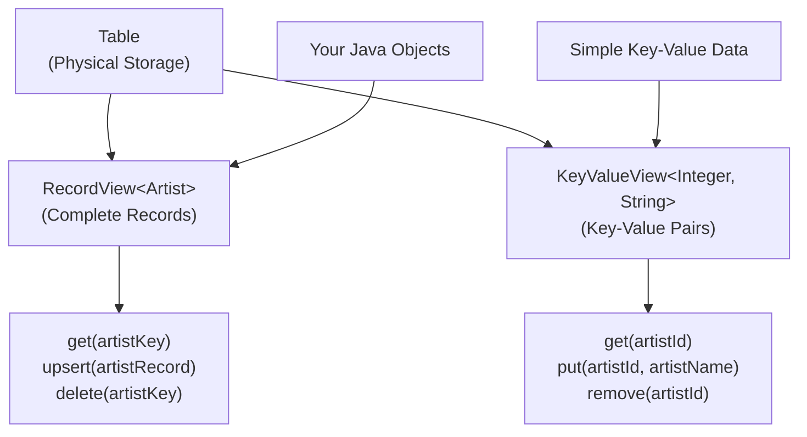

# 4. Table API - Object-Oriented Data Access

## 4.1 Understanding Object-Oriented Data Access

### Beyond SQL: Working with Data as Objects

Traditional database programming requires constant mental context switching. You design your application using object-oriented principles, but when it's time to persist or retrieve data, you switch to SQL thinking - rows, columns, JOIN operations, and result set iteration.

Apache Ignite 3's Table API eliminates this friction entirely by providing **native object-oriented data access**. Your Java objects become first-class citizens in the database, with direct CRUD operations that feel natural to Java developers.

### Why Object-Oriented Data Access Matters

Consider a typical music store operation - finding an artist and updating their information:

**Traditional SQL Approach:**
```java
// Mental model: Objects
Artist artist = new Artist(1, "AC/DC");

// Implementation: SQL context switch
String sql = "SELECT ArtistId, Name FROM Artist WHERE ArtistId = ?";
try (PreparedStatement stmt = connection.prepareStatement(sql)) {
    stmt.setInt(1, 1);
    ResultSet rs = stmt.executeQuery();
    if (rs.next()) {
        artist.setName(rs.getString("Name"));
        // Manual mapping between ResultSet and Object
    }
}

// Update: More SQL
String updateSql = "UPDATE Artist SET Name = ? WHERE ArtistId = ?";
try (PreparedStatement stmt = connection.prepareStatement(updateSql)) {
    stmt.setString(1, "AC/DC (Remastered)");
    stmt.setInt(2, 1);
    stmt.executeUpdate();
}
```

**Ignite 3 Table API Approach:**
```java
// Mental model and implementation: Objects all the way
Table artistTable = client.tables().table("Artist");
RecordView<Artist> artists = artistTable.recordView(Artist.class);

// Direct object operations - no SQL required
Artist artist = artists.get(null, new Artist(1, null));
if (artist != null) {
    artist.setName("AC/DC (Remastered)");
    artists.upsert(null, artist);
}
```

The difference is profound: **zero impedance mismatch** between your object model and data operations.

### When to Use Table API vs SQL API

Understanding when to use each approach is crucial for optimal performance and code clarity:

**Use Table API When:**
- **Known Primary Keys**: You know exactly which records to fetch
- **Single Record Operations**: Working with individual entities
- **Type Safety Critical**: Compile-time validation prevents runtime errors
- **Complex Object Graphs**: POJOs with nested relationships
- **High-Performance Point Operations**: Direct key-based access

**Use SQL API When:**
- **Complex Queries**: JOIN operations across multiple tables
- **Aggregate Functions**: COUNT, SUM, AVG, GROUP BY operations
- **Range Queries**: WHERE clauses with conditions beyond exact key match
- **Analytical Operations**: Reporting and business intelligence queries
- **Dynamic Queries**: Query structure determined at runtime

### Table API Architecture Overview

The Table API provides two complementary views of your data:



**RecordView**: Treats each database row as a complete object. Perfect when you need full entity operations.

**KeyValueView**: Separates keys from values, ideal for cache-like operations where you only need specific fields.

## 4.2 Working with RecordView: Complete Object Operations

### Setting Up RecordView

The RecordView provides the most natural object-oriented experience. Here's how to set it up with our music store entities:

```java
// Get table reference
Table artistTable = client.tables().table("Artist");

// Create strongly-typed RecordView
RecordView<Artist> artists = artistTable.recordView(Artist.class);

// RecordView automatically handles:
// - Object-to-tuple mapping
// - Type validation
// - Null value handling
// - Primary key extraction
```

**What Happens Under the Hood:**
1. **Schema Validation**: Ignite validates your Artist class against the table schema
2. **Mapper Creation**: Automatic mapping between Java fields and table columns
3. **Type Safety**: Compile-time checking ensures data integrity
4. **Performance Optimization**: Direct binary serialization without SQL parsing

### Basic CRUD Operations

#### Create and Update Operations

```java
// CREATE: Insert a new artist
Artist newArtist = new Artist(1, "AC/DC");
artists.upsert(null, newArtist);
System.out.println("Added artist: " + newArtist.getName());

// UPSERT: Insert or update (most common operation)
Artist ledZeppelin = new Artist(2, "Led Zeppelin");
artists.upsert(null, ledZeppelin);

// Update existing artist
ledZeppelin.setName("Led Zeppelin IV");
artists.upsert(null, ledZeppelin);  // Automatically updates
System.out.println("Updated artist name");
```

**Key Insights:**
- **upsert()** is the primary operation - it handles both inserts and updates
- **No separate UPDATE statement** - object state determines the operation
- **Primary key detection** - Ignite uses @Id annotations to identify keys
- **Atomic operations** - Each upsert is atomic and consistent

#### Read Operations

```java
// READ: Get artist by primary key
Artist keyObj = new Artist(1, null);  // Only ID needed for lookup
Artist found = artists.get(null, keyObj);

if (found != null) {
    System.out.println("Found artist: " + found.getName());
} else {
    System.out.println("Artist not found");
}

// Alternative: Create key object inline
Artist acdc = artists.get(null, new Artist(1, null));
if (acdc != null) {
    System.out.println("AC/DC albums coming soon!");
}
```

**Performance Note**: RecordView.get() is extremely fast because:
- **Direct key lookup** - no table scans or index searches
- **Colocation-aware** - data retrieval happens on the correct node
- **Binary protocol** - no SQL parsing overhead

#### Delete Operations

```java
// DELETE: Remove artist by key
Artist keyForDeletion = new Artist(2, null);
boolean deleted = artists.delete(null, keyForDeletion);

if (deleted) {
    System.out.println("Artist removed successfully");
} else {
    System.out.println("Artist not found for deletion");
}

// DELETE with value verification (conditional delete)
Artist exactMatch = new Artist(1, "AC/DC");
boolean conditionallyDeleted = artists.deleteExact(null, exactMatch);
System.out.println("Conditional delete result: " + conditionallyDeleted);
```

### Working with Complex Entities

Let's see how Table API handles more complex entities with composite keys and relationships:

```java
// Album entity with composite primary key
Album album = new Album(1, 1, "Back in Black");  // AlbumId=1, ArtistId=1

Table albumTable = client.tables().table("Album");
RecordView<Album> albums = albumTable.recordView(Album.class);

// Insert album (automatically colocated with artist)
albums.upsert(null, album);

// Read album using composite key
Album albumKey = new Album(1, 1, null);  // AlbumId + ArtistId for lookup
Album found = albums.get(null, albumKey);

if (found != null) {
    System.out.println("Album: " + found.getTitle() + 
                      " by Artist ID: " + found.getArtistId());
}

// Track entity with even more complexity
Track track = new Track();
track.setTrackId(1);
track.setAlbumId(1);
track.setName("Hells Bells");
track.setComposer("Young, Johnson");
track.setMilliseconds(312000);
track.setUnitPrice(new BigDecimal("0.99"));

Table trackTable = client.tables().table("Track");
RecordView<Track> tracks = trackTable.recordView(Track.class);
tracks.upsert(null, track);
```

### Bulk Operations for High Performance

#### Bulk Insert Operations

```java
// Create multiple artists from music store dataset
List<Artist> musicStoreArtists = Arrays.asList(
    new Artist(1, "AC/DC"),
    new Artist(2, "Accept"),
    new Artist(3, "Aerosmith"),
    new Artist(4, "Alanis Morissette"),
    new Artist(5, "Alice In Chains"),
    new Artist(6, "Antônio Carlos Jobim"),
    new Artist(7, "Apocalyptica"),
    new Artist(8, "Audioslave"),
    new Artist(9, "BackBeat"),
    new Artist(10, "The Beatles")
);

// Bulk upsert - highly optimized batch operation
artists.upsertAll(null, musicStoreArtists);
System.out.println("Loaded " + musicStoreArtists.size() + " artists from music store dataset");
```

**Performance Benefits of Bulk Operations:**
- **Network Optimization**: Single round trip for multiple records
- **Batch Processing**: Server-side optimizations for bulk operations  
- **Transaction Efficiency**: All operations within single transaction scope
- **Colocation Awareness**: Operations routed to correct nodes efficiently

#### Bulk Read Operations

```java
// Prepare key objects for bulk retrieval
List<Artist> artistKeys = Arrays.asList(
    new Artist(1, null),    // AC/DC
    new Artist(2, null),    // Accept
    new Artist(3, null),    // Aerosmith
    new Artist(10, null)    // The Beatles
);

// Bulk get operation
List<Artist> foundArtists = artists.getAll(null, artistKeys);

// Process results (maintains order)
for (int i = 0; i < artistKeys.size(); i++) {
    Artist key = artistKeys.get(i);
    Artist found = foundArtists.get(i);
    
    if (found != null) {
        System.out.println("Artist " + key.getArtistId() + ": " + found.getName());
    } else {
        System.out.println("Artist " + key.getArtistId() + ": Not found");
    }
}
```

#### Bulk Delete Operations

```java
// Delete multiple artists by key
List<Artist> artistsToDelete = Arrays.asList(
    new Artist(4, null),    // Alanis Morissette
    new Artist(5, null)     // Alice In Chains
);

List<Artist> deletedKeys = artists.deleteAll(null, artistsToDelete);
System.out.println("Deleted " + deletedKeys.size() + " artists");

// deletedKeys contains the keys that were successfully deleted
deletedKeys.forEach(deleted -> 
    System.out.println("Deleted artist ID: " + deleted.getArtistId()));
```

### Transaction Integration

RecordView operations integrate seamlessly with Ignite 3's transaction system:

```java
// Create a new album and tracks in a single transaction
client.transactions().runInTransaction(tx -> {
    // Insert album
    Album album = new Album(2, 1, "Highway to Hell");
    albums.upsert(tx, album);
    
    // Insert related tracks
    List<Track> albumTracks = Arrays.asList(
        new Track(1, 2, "Highway to Hell", 208000, new BigDecimal("0.99")),
        new Track(2, 2, "Girls Got Rhythm", 206000, new BigDecimal("0.99")),
        new Track(3, 2, "Walk All Over You", 294000, new BigDecimal("0.99"))
    );
    
    tracks.upsertAll(tx, albumTracks);
    
    System.out.println("Album and tracks added in transaction");
    return true;  // Commit transaction
});
```

**Transaction Benefits:**
- **ACID Guarantees**: All operations succeed or fail together
- **Consistency**: Related data stays consistent across operations
- **Isolation**: Other operations don't see partial results
- **Distributed Transactions**: Works across multiple cluster nodes

## 4.3 Working with KeyValueView: Efficient Key-Value Operations

### When KeyValueView Excels

KeyValueView provides a cache-like interface that separates keys from values. This is particularly useful for:

- **Partial Updates**: Updating only specific fields
- **Simple Data Types**: Working with primitives or simple objects
- **Cache Patterns**: Key-value style operations
- **Performance-Critical Code**: Minimal object creation overhead

### Setting Up KeyValueView

```java
// Create KeyValueView with separate key and value types
Table artistTable = client.tables().table("Artist");
KeyValueView<Integer, String> artistNames = 
    artistTable.keyValueView(Integer.class, String.class);

// For complex keys and values, use Tuple
KeyValueView<Tuple, Tuple> artistTuples = artistTable.keyValueView();
```

### Basic KeyValueView Operations

#### Put and Get Operations

```java
// PUT: Simple key-value operations
artistNames.put(null, 100, "Dream Theater");
artistNames.put(null, 101, "Tool");
artistNames.put(null, 102, "Porcupine Tree");

// GET: Retrieve values by key
String artistName = artistNames.get(null, 100);
if (artistName != null) {
    System.out.println("Artist 100: " + artistName);
}

// GET with default value
String nameWithDefault = artistNames.getOrDefault(null, 999, "Unknown Artist");
System.out.println("Artist 999: " + nameWithDefault);
```

#### Working with Nullable Values

```java
// Handle null values explicitly
artistNames.put(null, 103, null);  // Explicitly store null

// Use getNullable for null-aware retrieval
NullableValue<String> nullableResult = artistNames.getNullable(null, 103);
if (nullableResult != null) {
    String value = nullableResult.get();  // This will be null
    System.out.println("Artist 103 name is explicitly null: " + (value == null));
}

// Regular get() throws exception for null values
try {
    String nullName = artistNames.get(null, 103);  // Throws UnexpectedNullValueException
} catch (UnexpectedNullValueException e) {
    System.out.println("Cannot retrieve null value with get()");
}
```

### Advanced KeyValueView Patterns

#### Conditional Operations

```java
// PUT_IF_ABSENT: Only insert if key doesn't exist
boolean inserted = artistNames.putIfAbsent(null, 104, "Metallica");
if (inserted) {
    System.out.println("New artist added");
} else {
    System.out.println("Artist already exists");
}

// REPLACE: Only update if key exists
boolean replaced = artistNames.replace(null, 104, "Metallica (Updated)");
System.out.println("Artist name updated: " + replaced);

// REPLACE with value check: Update only if current value matches
boolean conditionalReplace = artistNames.replace(
    null, 104, "Metallica (Updated)", "Metallica (Final)");
System.out.println("Conditional update: " + conditionalReplace);
```

#### Get-and-Modify Operations

```java
// GET_AND_PUT: Atomic read-modify-write
String previousName = artistNames.getAndPut(null, 100, "Dream Theater (Progressive)");
System.out.println("Previous name: " + previousName);

// GET_AND_REMOVE: Atomic read-and-delete
String removedName = artistNames.getAndRemove(null, 102);
if (removedName != null) {
    System.out.println("Removed artist: " + removedName);
}
```

### Bulk Operations with KeyValueView

```java
// Bulk put using Map
Map<Integer, String> bulkArtists = new HashMap<>();
bulkArtists.put(200, "Iron Maiden");
bulkArtists.put(201, "Judas Priest");
bulkArtists.put(202, "Black Sabbath");
bulkArtists.put(203, "Deep Purple");

artistNames.putAll(null, bulkArtists);
System.out.println("Bulk inserted " + bulkArtists.size() + " artists");

// Bulk get
Set<Integer> keysToGet = Set.of(200, 201, 202, 203);
Map<Integer, String> retrieved = artistNames.getAll(null, keysToGet);

retrieved.forEach((id, name) -> 
    System.out.println("Artist " + id + ": " + name));

// Bulk remove
Collection<Integer> removedKeys = artistNames.removeAll(null, keysToGet);
System.out.println("Removed " + removedKeys.size() + " artists");
```

### Working with Tuple-based KeyValueView

For maximum flexibility, you can use Tuple objects for both keys and values:

```java
// Complex album operations with Tuples
Table albumTable = client.tables().table("Album");
KeyValueView<Tuple, Tuple> albumKV = albumTable.keyValueView();

// Create composite key using Tuple
Tuple albumKey = Tuple.create()
    .set("AlbumId", 10)
    .set("ArtistId", 1);

// Create value Tuple
Tuple albumValue = Tuple.create()
    .set("Title", "Let There Be Rock");

// Put album
albumKV.put(null, albumKey, albumValue);

// Get album
Tuple retrievedValue = albumKV.get(null, albumKey);
if (retrievedValue != null) {
    String title = retrievedValue.stringValue("Title");
    System.out.println("Album title: " + title);
}
```

## 4.4 Asynchronous Operations for High Performance

### Understanding Async Programming with Table API

Modern applications require non-blocking operations to achieve high throughput and responsiveness. Ignite 3's Table API provides comprehensive async support using CompletableFuture, allowing you to build highly concurrent applications.

### Basic Async Operations

```java
// Async upsert operation
Artist newArtist = new Artist(300, "Pink Floyd");

CompletableFuture<Void> insertFuture = artists.upsertAsync(null, newArtist);
insertFuture.thenRun(() -> {
    System.out.println("Artist inserted asynchronously");
}).exceptionally(throwable -> {
    System.err.println("Insert failed: " + throwable.getMessage());
    return null;
});

// Async get operation
Artist keyArtist = new Artist(300, null);
CompletableFuture<Artist> getFuture = artists.getAsync(null, keyArtist);

getFuture.thenAccept(artist -> {
    if (artist != null) {
        System.out.println("Found artist: " + artist.getName());
    } else {
        System.out.println("Artist not found");
    }
});
```

### Chaining Async Operations

```java
// Chain multiple async operations for complex workflows
CompletableFuture<String> result = artists
    .getAsync(null, new Artist(1, null))  // Get AC/DC
    .thenCompose(artist -> {
        if (artist != null) {
            // Get albums for this artist
            Album albumKey = new Album(null, artist.getArtistId(), null);
            return albums.getAllAsync(null, List.of(albumKey))
                .thenApply(albumList -> 
                    artist.getName() + " has " + albumList.size() + " albums");
        } else {
            return CompletableFuture.completedFuture("Artist not found");
        }
    })
    .exceptionally(throwable -> {
        return "Error: " + throwable.getMessage();
    });

// Use the result
result.thenAccept(message -> System.out.println(message));
```

### Parallel Async Operations

```java
// Execute multiple independent operations in parallel
List<CompletableFuture<Void>> futures = new ArrayList<>();

// Load multiple artists in parallel
String[] artistNames = {"System Of A Down", "Slipknot", "Rammstein", 
                       "Linkin Park", "Disturbed"};

for (int i = 0; i < artistNames.length; i++) {
    Artist artist = new Artist(400 + i, artistNames[i]);
    CompletableFuture<Void> future = artists.upsertAsync(null, artist);
    futures.add(future);
}

// Wait for all operations to complete
CompletableFuture<Void> allFutures = CompletableFuture.allOf(
    futures.toArray(new CompletableFuture[0]));

allFutures.thenRun(() -> {
    System.out.println("All " + artistNames.length + " artists loaded in parallel");
}).join();  // Wait for completion
```

### Async Bulk Operations

```java
// Async bulk operations for maximum throughput
List<Album> albumBatch = Arrays.asList(
    new Album(10, 1, "Back in Black"),
    new Album(11, 1, "Highway to Hell"),
    new Album(12, 2, "Balls to the Wall"),
    new Album(13, 3, "Pump")
);

CompletableFuture<Void> bulkInsert = albums.upsertAllAsync(null, albumBatch);
bulkInsert
    .thenRun(() -> System.out.println("Bulk insert completed"))
    .thenCompose(ignored -> {
        // Chain with bulk get
        List<Album> keys = albumBatch.stream()
            .map(album -> new Album(album.getAlbumId(), album.getArtistId(), null))
            .collect(Collectors.toList());
        return albums.getAllAsync(null, keys);
    })
    .thenAccept(results -> {
        System.out.println("Retrieved " + results.size() + " albums");
        results.forEach(album -> {
            if (album != null) {
                System.out.println("  - " + album.getTitle());
            }
        });
    });
```

### Advanced Async Patterns

#### Timeout and Retry Logic

```java
// Async operation with timeout
CompletableFuture<Artist> getWithTimeout = artists
    .getAsync(null, new Artist(1, null))
    .orTimeout(5, TimeUnit.SECONDS)
    .exceptionally(throwable -> {
        if (throwable instanceof TimeoutException) {
            System.err.println("Operation timed out");
        } else {
            System.err.println("Operation failed: " + throwable.getMessage());
        }
        return null;
    });

// Retry logic for transient failures
public static CompletableFuture<Void> insertWithRetry(
        RecordView<Artist> view, Artist artist, int maxRetries) {
    
    return view.upsertAsync(null, artist)
        .exceptionallyCompose(throwable -> {
            if (maxRetries > 0) {
                System.out.println("Retrying insert, attempts left: " + maxRetries);
                // Add exponential backoff
                return CompletableFuture
                    .delayedExecutor(1000, TimeUnit.MILLISECONDS)
                    .execute(() -> insertWithRetry(view, artist, maxRetries - 1));
            } else {
                return CompletableFuture.failedFuture(throwable);
            }
        });
}
```

#### Circuit Breaker Pattern

```java
public static class AsyncCircuitBreaker {
    private volatile boolean isOpen = false;
    private volatile long lastFailureTime = 0;
    private final long timeout = 60000; // 1 minute
    private final AtomicInteger failureCount = new AtomicInteger(0);
    private final int failureThreshold = 5;
    
    public <T> CompletableFuture<T> execute(Supplier<CompletableFuture<T>> operation) {
        if (isOpen && (System.currentTimeMillis() - lastFailureTime) < timeout) {
            return CompletableFuture.failedFuture(
                new RuntimeException("Circuit breaker is open"));
        }
        
        return operation.get()
            .whenComplete((result, throwable) -> {
                if (throwable != null) {
                    int failures = failureCount.incrementAndGet();
                    if (failures >= failureThreshold) {
                        isOpen = true;
                        lastFailureTime = System.currentTimeMillis();
                    }
                } else {
                    failureCount.set(0);
                    isOpen = false;
                }
            });
    }
}

// Usage
AsyncCircuitBreaker circuitBreaker = new AsyncCircuitBreaker();
Artist searchKey = new Artist(500, null);

circuitBreaker.execute(() -> artists.getAsync(null, searchKey))
    .thenAccept(artist -> {
        System.out.println("Circuit breaker success: " + artist);
    })
    .exceptionally(throwable -> {
        System.err.println("Circuit breaker protection: " + throwable.getMessage());
        return null;
    });
```

## 4.5 Error Handling and Best Practices

### Exception Hierarchy and Handling

Understanding Ignite 3's exception hierarchy is crucial for robust error handling:

```java
try {
    // Table API operations
    Artist artist = artists.get(null, new Artist(1, null));
    artists.upsert(null, artist);
    
} catch (MarshallerException e) {
    // Schema or type mismatch
    System.err.println("Data mapping error: " + e.getMessage());
    // Check your POJO annotations and field types
    
} catch (UnexpectedNullValueException e) {
    // Null value in non-nullable field
    System.err.println("Null value error: " + e.getMessage());
    // Use getNullable() for nullable columns
    
} catch (TransactionException e) {
    // Transaction-related errors
    System.err.println("Transaction error: " + e.getMessage());
    // Retry or rollback as appropriate
    
} catch (TableNotFoundException e) {
    // Table doesn't exist
    System.err.println("Table not found: " + e.getMessage());
    // Ensure table is created before accessing
    
} catch (IgniteException e) {
    // General Ignite errors
    System.err.println("Ignite error: " + e.getMessage());
    // Check cluster connectivity and status
}
```

### Defensive Programming Patterns

```java
// Safe table access with validation
public static RecordView<Artist> getArtistViewSafely(IgniteClient client) {
    try {
        Table table = client.tables().table("Artist");
        if (table == null) {
            throw new IllegalStateException("Artist table not found");
        }
        return table.recordView(Artist.class);
    } catch (Exception e) {
        System.err.println("Failed to get Artist table view: " + e.getMessage());
        throw new RuntimeException("Artist table access failed", e);
    }
}

// Null-safe operations
public static boolean safeUpsert(RecordView<Artist> view, Artist artist) {
    if (artist == null || artist.getArtistId() == null) {
        System.err.println("Invalid artist data");
        return false;
    }
    
    try {
        view.upsert(null, artist);
        return true;
    } catch (Exception e) {
        System.err.println("Failed to upsert artist " + artist.getArtistId() + 
                          ": " + e.getMessage());
        return false;
    }
}

// Bulk operation with partial failure handling
public static void safeBulkUpsert(RecordView<Artist> view, List<Artist> artists) {
    List<Artist> validArtists = artists.stream()
        .filter(Objects::nonNull)
        .filter(a -> a.getArtistId() != null)
        .collect(Collectors.toList());
    
    if (validArtists.isEmpty()) {
        System.out.println("No valid artists to insert");
        return;
    }
    
    try {
        view.upsertAll(null, validArtists);
        System.out.println("Successfully upserted " + validArtists.size() + " artists");
    } catch (Exception e) {
        System.err.println("Bulk upsert failed: " + e.getMessage());
        // Fall back to individual operations
        int successCount = 0;
        for (Artist artist : validArtists) {
            if (safeUpsert(view, artist)) {
                successCount++;
            }
        }
        System.out.println("Individual upserts: " + successCount + "/" + validArtists.size());
    }
}
```

### Performance Best Practices

#### Batch Operations

```java
// Efficient batch loading pattern
public static void efficientBulkLoad(RecordView<Artist> view, List<Artist> artists) {
    int batchSize = 1000;  // Optimal batch size for most workloads
    
    for (int i = 0; i < artists.size(); i += batchSize) {
        int endIndex = Math.min(i + batchSize, artists.size());
        List<Artist> batch = artists.subList(i, endIndex);
        
        try {
            view.upsertAll(null, batch);
            System.out.println("Processed batch " + (i / batchSize + 1) + 
                             ": " + batch.size() + " records");
        } catch (Exception e) {
            System.err.println("Batch " + (i / batchSize + 1) + " failed: " + e.getMessage());
            // Process individually as fallback
        }
    }
}
```

#### Resource Management

```java
// Proper resource lifecycle management
public class MusicStoreService implements AutoCloseable {
    private final IgniteClient client;
    private final RecordView<Artist> artists;
    private final RecordView<Album> albums;
    private final RecordView<Track> tracks;
    
    public MusicStoreService() {
        this.client = IgniteClient.builder()
            .addresses("127.0.0.1:10800")
            .build();
        
        this.artists = client.tables().table("Artist").recordView(Artist.class);
        this.albums = client.tables().table("Album").recordView(Album.class);
        this.tracks = client.tables().table("Track").recordView(Track.class);
    }
    
    public void addArtistWithAlbums(Artist artist, List<Album> artistAlbums) {
        // Use transaction for consistency
        client.transactions().runInTransaction(tx -> {
            artists.upsert(tx, artist);
            albums.upsertAll(tx, artistAlbums);
            return true;
        });
    }
    
    @Override
    public void close() {
        if (client != null) {
            client.close();
        }
    }
}

// Usage with try-with-resources
try (MusicStoreService service = new MusicStoreService()) {
    Artist newArtist = new Artist(1000, "New Band");
    List<Album> albums = List.of(
        new Album(1000, 1000, "First Album"),
        new Album(1001, 1000, "Second Album")
    );
    
    service.addArtistWithAlbums(newArtist, albums);
}
```

#### Connection Pool Optimization

```java
// Configure client for optimal performance
IgniteClient client = IgniteClient.builder()
    .addresses("127.0.0.1:10800", "127.0.0.1:10801", "127.0.0.1:10802")  // Multiple nodes
    .connectionTimeout(5000)      // 5 second connection timeout
    .requestTimeout(30000)        // 30 second operation timeout
    .maxConnectionsPerNode(10)    // Connection pool size
    .build();
```

## 4.6 Integration with Business Logic

### Domain Service Patterns

```java
/**
 * Music Store service demonstrating Table API integration with business logic
 */
public class MusicStoreManager {
    private final RecordView<Artist> artists;
    private final RecordView<Album> albums;
    private final RecordView<Track> tracks;
    private final IgniteClient client;
    
    public MusicStoreManager(IgniteClient client) {
        this.client = client;
        this.artists = client.tables().table("Artist").recordView(Artist.class);
        this.albums = client.tables().table("Album").recordView(Album.class);
        this.tracks = client.tables().table("Track").recordView(Track.class);
    }
    
    /**
     * Add a complete artist discography in a single transaction
     */
    public void addArtistDiscography(ArtistDiscography discography) {
        client.transactions().runInTransaction(tx -> {
            // Add artist
            artists.upsert(tx, discography.getArtist());
            
            // Add all albums
            albums.upsertAll(tx, discography.getAlbums());
            
            // Add all tracks
            tracks.upsertAll(tx, discography.getAllTracks());
            
            System.out.println("Added discography for: " + 
                             discography.getArtist().getName());
            return true;
        });
    }
    
    /**
     * Find popular artists (those with many albums)
     */
    public List<Artist> findPopularArtists(int minAlbumCount) {
        // Note: This would typically use SQL API for the aggregation
        // Here we show how Table API can be combined with business logic
        
        List<Artist> allArtists = getAllArtists();  // Table API operation
        
        return allArtists.stream()
            .filter(artist -> getAlbumCount(artist.getArtistId()) >= minAlbumCount)
            .collect(Collectors.toList());
    }
    
    private List<Artist> getAllArtists() {
        // In real implementation, this would use proper pagination
        // This is simplified for demonstration
        return List.of(/* retrieve from cache or use SQL for better performance */);
    }
    
    private int getAlbumCount(Integer artistId) {
        // This is inefficient - in practice, use SQL API for aggregations
        // Shown here to demonstrate Table API usage patterns
        
        // Use SQL for counting (more efficient than Table API for this)
        var result = client.sql().execute(null,
            "SELECT COUNT(*) as album_count FROM Album WHERE ArtistId = ?", artistId);
        
        if (result.hasNext()) {
            return result.next().intValue("album_count");
        }
        return 0;
    }
}

/**
 * Value object for artist discography operations
 */
public class ArtistDiscography {
    private final Artist artist;
    private final List<Album> albums;
    private final Map<Integer, List<Track>> tracksByAlbum;
    
    public ArtistDiscography(Artist artist, List<Album> albums, 
                           Map<Integer, List<Track>> tracksByAlbum) {
        this.artist = artist;
        this.albums = albums;
        this.tracksByAlbum = tracksByAlbum;
    }
    
    public List<Track> getAllTracks() {
        return tracksByAlbum.values().stream()
            .flatMap(List::stream)
            .collect(Collectors.toList());
    }
    
    // Getters...
    public Artist getArtist() { return artist; }
    public List<Album> getAlbums() { return albums; }
}
```

### Testing Patterns

```java
/**
 * Unit test patterns for Table API operations
 */
public class MusicStoreManagerTest {
    private IgniteClient client;
    private MusicStoreManager manager;
    
    @BeforeEach
    void setUp() {
        // Use embedded Ignite for testing
        client = IgniteClient.builder()
            .addresses("127.0.0.1:10800")
            .build();
        manager = new MusicStoreManager(client);
    }
    
    @Test
    void testAddArtistDiscography() {
        // Arrange
        Artist artist = new Artist(9999, "Test Artist");
        List<Album> albums = List.of(
            new Album(9999, 9999, "Test Album")
        );
        List<Track> tracks = List.of(
            new Track(9999, 9999, "Test Track", 180000, new BigDecimal("0.99"))
        );
        
        ArtistDiscography discography = new ArtistDiscography(
            artist, albums, Map.of(9999, tracks));
        
        // Act
        manager.addArtistDiscography(discography);
        
        // Assert
        RecordView<Artist> artists = client.tables().table("Artist").recordView(Artist.class);
        Artist found = artists.get(null, new Artist(9999, null));
        
        assertNotNull(found);
        assertEquals("Test Artist", found.getName());
        
        // Cleanup
        artists.delete(null, new Artist(9999, null));
    }
    
    @AfterEach
    void tearDown() {
        if (client != null) {
            client.close();
        }
    }
}
```

## 4.7 Summary: Mastering Object-Oriented Data Access

### What You've Learned

Throughout this module, you've mastered the fundamental patterns of object-oriented data access with Apache Ignite 3:

**Core Concepts:**
- **RecordView**: Complete object operations with automatic mapping
- **KeyValueView**: Efficient key-value operations with type safety
- **Async Programming**: Non-blocking operations for high-performance applications
- **Transaction Integration**: ACID guarantees across distributed operations

**Practical Skills:**
- **CRUD Operations**: Create, read, update, and delete with Java objects
- **Bulk Operations**: High-performance batch processing
- **Error Handling**: Robust exception management and recovery patterns
- **Business Integration**: Combining Table API with domain logic

### When to Use Table API

**Table API Excels For:**
✅ **Known Primary Keys**: Direct access to specific records  
✅ **High-Performance Point Operations**: Single record CRUD operations  
✅ **Type Safety**: Compile-time validation and IDE support  
✅ **Complex Objects**: POJOs with rich domain logic  
✅ **Transactional Operations**: ACID guarantees for business workflows  

**Consider SQL API For:**
⚠️ **Complex Queries**: JOINs, aggregations, and analytical operations  
⚠️ **Range Queries**: WHERE clauses beyond exact key matches  
⚠️ **Dynamic Queries**: Query structure determined at runtime  
⚠️ **Reporting**: Business intelligence and data analysis  

### Performance Optimization Guidelines

1. **Use Bulk Operations**: Always prefer `upsertAll()`, `getAll()`, `deleteAll()` for multiple records
2. **Leverage Async Patterns**: Use async operations for concurrent workloads
3. **Proper Transaction Scoping**: Group related operations in transactions
4. **Resource Management**: Use try-with-resources for client lifecycle
5. **Error Handling**: Implement circuit breakers and retry logic for resilience

### Next Steps: Advanced Data Access

You're now ready to explore complementary data access patterns:

**[Module 5: SQL API](05-sql-api-relational-data-access.md)** - Learn when and how to use SQL for complex queries, aggregations, and analytical operations

**[Module 6: Transactions](06-transactions.md)** - Master distributed transaction patterns for complex business workflows

**Hands-on Practice**: The `04-table-api-app` reference application provides runnable examples of every pattern covered in this module, using the complete music store dataset.

### Reference Application

The **`04-table-api-app`** demonstrates all concepts with working code:

- **RecordViewOperations.java**: Complete CRUD patterns with music store entities
- **KeyValueOperations.java**: Efficient key-value operations and caching patterns  
- **AsyncTableOperations.java**: High-performance async programming patterns
- **BulkOperationsDemo.java**: Batch processing and performance optimization
- **ErrorHandlingPatterns.java**: Robust error handling and recovery strategies

Run the reference application to see these concepts in action:

```bash
cd ignite3-reference-apps/04-table-api-app
mvn compile exec:java
```

The Table API provides the foundation for building robust, high-performance distributed applications with Apache Ignite 3. Master these patterns, and you'll be well-equipped to handle the majority of data access scenarios in modern distributed systems.