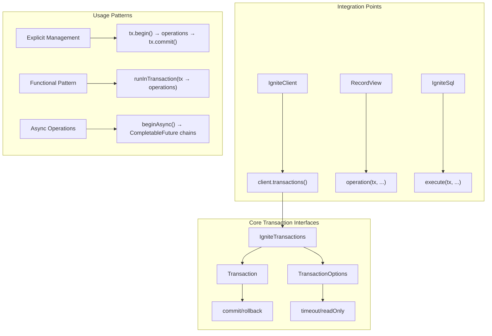

# 6. Transactions - Ensuring Data Consistency in Distributed Systems

In a music store's daily operations, data consistency matters. When a customer purchases multiple tracks, the payment processing, inventory updates, and playlist additions must succeed together—or fail together. This is where transactions become critical in distributed systems like Ignite 3.

## The Transaction Challenge in Music Store Operations

Consider this scenario: A customer selects five tracks from different albums and clicks "Buy Now." The system must:

1. **Create an invoice** for the customer
2. **Add line items** for each track
3. **Update inventory counts** for each track
4. **Add tracks to** the customer's purchased playlist
5. **Process the payment** and update the customer's account

If any step fails—network issues, insufficient inventory, payment decline—the entire operation should rollback. The customer shouldn't see a charge without receiving their music, and inventory shouldn't decrease without a completed sale.

This is exactly what Ignite 3's Transaction API delivers: **atomic operations across multiple tables and nodes** with full ACID guarantees.

## Overview: Transaction API Architecture

The Transaction API is built around interfaces that provide both explicit control and automatic management:



**Key Design Principles:**

- **ACID Guarantees**: Atomicity, Consistency, Isolation, Durability across the cluster
- **Multiple Patterns**: Explicit control vs automatic management via closures
- **Async Support**: CompletableFuture-based non-blocking operations
- **API Integration**: Works seamlessly with Table API and SQL API
- **Resource Safety**: Automatic cleanup and proper exception handling

## Getting Started: Your First Transaction

Let's start with a simple scenario: creating a new artist and their debut album atomically. If creating the album fails, we don't want an orphaned artist record.

### Basic Transaction Lifecycle

```java
/**
 * Demonstrates the fundamental transaction lifecycle in Ignite 3.
 * This example shows explicit transaction management where you control
 * the complete lifecycle: begin, operations, commit/rollback.
 */
public class FirstTransaction {
    
    public void createArtistAndAlbum(IgniteClient client) {
        // Step 1: Begin a transaction
        Transaction tx = client.transactions().begin();
        
        try {
            // Step 2: Get table views within the transaction
            RecordView<Tuple> artistTable = client.tables().table("Artist").recordView();
            RecordView<Tuple> albumTable = client.tables().table("Album").recordView();
            
            // Step 3: Create artist record
            Tuple artist = Tuple.create()
                .set("ArtistId", 1000)
                .set("Name", "Arctic Monkeys");
            artistTable.upsert(tx, artist);
            
            // Step 4: Create album record (linked to artist)
            Tuple album = Tuple.create()
                .set("AlbumId", 2000)
                .set("Title", "AM")
                .set("ArtistId", 1000);  // Foreign key relationship
            albumTable.upsert(tx, album);
            
            // Step 5: Commit the transaction
            tx.commit();
            System.out.println("✅ Artist and album created successfully");
            
        } catch (Exception e) {
            // Step 6: Rollback on any error
            tx.rollback();
            System.err.println("❌ Transaction failed: " + e.getMessage());
            throw e;
        }
    }
}
```

**What's happening here?**

1. **`begin()`** starts a new transaction context
2. **All operations** use the same transaction (`tx`) parameter
3. **`commit()`** makes all changes permanent across the cluster
4. **`rollback()`** undoes all changes if anything fails

This guarantees that either both records are created or neither exists—perfect for maintaining referential integrity.

### The runInTransaction Pattern

Most applications benefit from automatic transaction management. The `runInTransaction()` method handles commit/rollback based on your code's success or failure:

```java
/**
 * Demonstrates automatic transaction management using runInTransaction().
 * This pattern is recommended for most use cases as it handles lifecycle
 * management and provides cleaner code structure.
 */
public class AutomaticTransactions {
    
    public void createArtistAndAlbum(IgniteClient client) {
        boolean success = client.transactions().runInTransaction(tx -> {
            try {
                RecordView<Tuple> artistTable = client.tables().table("Artist").recordView();
                RecordView<Tuple> albumTable = client.tables().table("Album").recordView();
                
                // Create artist
                Tuple artist = Tuple.create()
                    .set("ArtistId", 1001)
                    .set("Name", "Radiohead");
                artistTable.upsert(tx, artist);
                
                // Create album
                Tuple album = Tuple.create()
                    .set("AlbumId", 2001)
                    .set("Title", "OK Computer")
                    .set("ArtistId", 1001);
                albumTable.upsert(tx, album);
                
                // Return true to commit
                return true;
                
            } catch (Exception e) {
                System.err.println("Error in transaction: " + e.getMessage());
                // Return false to rollback
                return false;
            }
        });
        
        if (success) {
            System.out.println("✅ Transaction completed successfully");
        } else {
            System.out.println("❌ Transaction was rolled back");
        }
    }
}
```

**Key advantages of `runInTransaction()`:**

- **Automatic lifecycle**: No need to manually call commit/rollback
- **Exception safety**: Rollback happens automatically on uncaught exceptions
- **Cleaner code**: Focus on business logic, not transaction plumbing
- **Return values**: Can return computed results from the transaction

## Real-World Scenario: Customer Purchase Workflow

Let's implement a complete customer purchase transaction that demonstrates why transactions matter in distributed systems.

### The Purchase Challenge

When a customer buys tracks, multiple things must happen atomically:

1. **Create invoice** with customer information
2. **Add line items** for each purchased track
3. **Calculate and set** the total amount
4. **Update track sales counters** (if maintaining statistics)

If any step fails, the entire purchase should be cancelled. No partial invoices, no orphaned line items.

### Multi-Table Transaction Implementation

```java
/**
 * Demonstrates a realistic business workflow requiring transactions.
 * This example shows why ACID properties are crucial for maintaining
 * data consistency in multi-table operations.
 */
public class CustomerPurchaseWorkflow {
    
    public Integer processPurchase(IgniteClient client, Integer customerId, List<Integer> trackIds) {
        return client.transactions().runInTransaction(tx -> {
            try {
                // Get table access
                RecordView<Tuple> invoiceTable = client.tables().table("Invoice").recordView();
                RecordView<Tuple> invoiceLineTable = client.tables().table("InvoiceLine").recordView();
                IgniteSql sql = client.sql();
                
                // Step 1: Create the invoice
                Integer invoiceId = generateInvoiceId();
                Tuple invoice = Tuple.create()
                    .set("InvoiceId", invoiceId)
                    .set("CustomerId", customerId)
                    .set("InvoiceDate", LocalDate.now())
                    .set("BillingAddress", "123 Music Street")
                    .set("BillingCity", "Harmony")
                    .set("BillingCountry", "USA")
                    .set("Total", BigDecimal.ZERO);  // Will calculate later
                
                invoiceTable.upsert(tx, invoice);
                System.out.println("📝 Created invoice " + invoiceId);
                
                // Step 2: Add line items and calculate total
                BigDecimal totalAmount = BigDecimal.ZERO;
                for (int i = 0; i < trackIds.size(); i++) {
                    Integer trackId = trackIds.get(i);
                    
                    // Get track price using SQL in the same transaction
                    ResultSet<SqlRow> trackResult = sql.execute(tx,
                        "SELECT UnitPrice FROM Track WHERE TrackId = ?", trackId);
                    
                    if (!trackResult.hasNext()) {
                        throw new IllegalArgumentException("Track not found: " + trackId);
                    }
                    
                    BigDecimal unitPrice = trackResult.next().decimalValue("UnitPrice");
                    
                    // Create line item
                    Tuple lineItem = Tuple.create()
                        .set("InvoiceLineId", generateLineItemId(i))
                        .set("InvoiceId", invoiceId)
                        .set("TrackId", trackId)
                        .set("UnitPrice", unitPrice)
                        .set("Quantity", 1);
                    
                    invoiceLineTable.upsert(tx, lineItem);
                    totalAmount = totalAmount.add(unitPrice);
                    System.out.println("🎵 Added track " + trackId + " ($" + unitPrice + ")");
                }
                
                // Step 3: Update invoice with calculated total
                invoice = invoice.set("Total", totalAmount);
                invoiceTable.upsert(tx, invoice);
                
                System.out.println("💰 Invoice total: $" + totalAmount);
                System.out.println("✅ Purchase completed successfully");
                
                return invoiceId;
                
            } catch (Exception e) {
                System.err.println("❌ Purchase failed: " + e.getMessage());
                throw e;  // This will trigger rollback
            }
        });
    }
    
    private Integer generateInvoiceId() {
        return (int) (System.currentTimeMillis() % 100000);
    }
    
    private Integer generateLineItemId(int index) {
        return (int) ((System.currentTimeMillis() + index) % 100000);
    }
}
```

**Transaction benefits demonstrated:**

- **Atomicity**: All changes happen together or not at all
- **Consistency**: Foreign key relationships are maintained
- **Isolation**: Other transactions don't see partial state
- **Durability**: Committed changes survive system failures

## TransactionOptions: Controlling Transaction Behavior

Different business scenarios require different transaction configurations. The `TransactionOptions` class provides fine-grained control over transaction behavior.

### Timeout Configuration

```java
/**
 * Demonstrates transaction timeout configuration for different scenarios.
 * Proper timeout setting prevents long-running transactions from blocking
 * system resources while allowing sufficient time for legitimate operations.
 */
public class TransactionTimeouts {
    
    public void quickUpdate(IgniteClient client) {
        // Short timeout for simple operations
        TransactionOptions quickOptions = new TransactionOptions()
            .timeoutMillis(5000)  // 5 seconds
            .readOnly(false);
        
        client.transactions().runInTransaction(quickOptions, tx -> {
            RecordView<Tuple> artistTable = client.tables().table("Artist").recordView();
            
            Tuple artist = artistTable.get(tx, Tuple.create().set("ArtistId", 1));
            if (artist != null) {
                artist = artist.set("Name", artist.stringValue("Name") + " (Updated)");
                artistTable.upsert(tx, artist);
                System.out.println("Quick update completed");
            }
            return true;
        });
    }
    
    public void complexReport(IgniteClient client) {
        // Longer timeout for complex operations
        TransactionOptions reportOptions = new TransactionOptions()
            .timeoutMillis(60000)  // 60 seconds
            .readOnly(true);       // Read-only for better performance
        
        client.transactions().runInTransaction(reportOptions, tx -> {
            IgniteSql sql = client.sql();
            
            // Complex multi-table analysis
            ResultSet<SqlRow> stats = sql.execute(tx, """
                SELECT 
                    COUNT(DISTINCT a.ArtistId) as artist_count,
                    COUNT(DISTINCT al.AlbumId) as album_count,
                    COUNT(DISTINCT t.TrackId) as track_count,
                    AVG(t.UnitPrice) as avg_price
                FROM Artist a
                JOIN Album al ON a.ArtistId = al.ArtistId
                JOIN Track t ON al.AlbumId = t.AlbumId
                """);
            
            if (stats.hasNext()) {
                SqlRow row = stats.next();
                System.out.printf("📊 Music Store Statistics:%n");
                System.out.printf("   Artists: %d%n", row.longValue("artist_count"));
                System.out.printf("   Albums: %d%n", row.longValue("album_count"));
                System.out.printf("   Tracks: %d%n", row.longValue("track_count"));
                System.out.printf("   Average Price: $%.2f%n", row.decimalValue("avg_price"));
            }
            
            return true;
        });
    }
}
```

### Read-Only Transactions

Read-only transactions provide performance benefits for queries that don't modify data:

```java
/**
 * Read-only transactions optimize performance for reporting and analytics.
 * They can access multiple tables consistently without the overhead
 * of write locks or conflict detection.
 */
public class ReadOnlyTransactions {
    
    public void generateMonthlySalesReport(IgniteClient client) {
        TransactionOptions readOnlyOptions = new TransactionOptions()
            .readOnly(true)
            .timeoutMillis(120000);  // 2 minutes for complex reports
        
        client.transactions().runInTransaction(readOnlyOptions, tx -> {
            IgniteSql sql = client.sql();
            
            // All queries in the same transaction see consistent data
            System.out.println("📈 Generating Monthly Sales Report...");
            
            // Top selling tracks
            ResultSet<SqlRow> topTracks = sql.execute(tx, """
                SELECT t.Name, COUNT(*) as sales_count
                FROM Track t
                JOIN InvoiceLine il ON t.TrackId = il.TrackId
                JOIN Invoice i ON il.InvoiceId = i.InvoiceId
                WHERE i.InvoiceDate >= ?
                GROUP BY t.TrackId, t.Name
                ORDER BY sales_count DESC
                LIMIT 10
                """, LocalDate.now().minusMonths(1));
            
            System.out.println("🎵 Top Selling Tracks:");
            while (topTracks.hasNext()) {
                SqlRow track = topTracks.next();
                System.out.printf("   %s: %d sales%n", 
                    track.stringValue("Name"), 
                    track.longValue("sales_count"));
            }
            
            // Revenue by genre
            ResultSet<SqlRow> genreRevenue = sql.execute(tx, """
                SELECT g.Name, SUM(il.UnitPrice * il.Quantity) as revenue
                FROM Genre g
                JOIN Track t ON g.GenreId = t.GenreId
                JOIN InvoiceLine il ON t.TrackId = il.TrackId
                JOIN Invoice i ON il.InvoiceId = i.InvoiceId
                WHERE i.InvoiceDate >= ?
                GROUP BY g.GenreId, g.Name
                ORDER BY revenue DESC
                """, LocalDate.now().minusMonths(1));
            
            System.out.println("🎭 Revenue by Genre:");
            while (genreRevenue.hasNext()) {
                SqlRow genre = genreRevenue.next();
                System.out.printf("   %s: $%.2f%n", 
                    genre.stringValue("Name"), 
                    genre.decimalValue("revenue"));
            }
            
            return true;
        });
    }
}
```

## Asynchronous Transactions: Non-Blocking Operations

For high-throughput applications, asynchronous transactions prevent blocking threads while operations complete across the distributed cluster.

### Basic Async Pattern

```java
/**
 * Demonstrates asynchronous transaction patterns for non-blocking operations.
 * Async transactions are crucial for high-throughput applications that need
 * to handle many concurrent operations efficiently.
 */
public class AsyncTransactionPatterns {
    
    public CompletableFuture<Void> createArtistAsync(IgniteClient client, String artistName) {
        return client.transactions().beginAsync()
            .thenCompose(tx -> {
                System.out.println("🚀 Starting async transaction for: " + artistName);
                
                RecordView<Tuple> artistTable = client.tables().table("Artist").recordView();
                
                Tuple artist = Tuple.create()
                    .set("ArtistId", generateArtistId())
                    .set("Name", artistName);
                
                return artistTable.upsertAsync(tx, artist)
                    .thenCompose(ignored -> {
                        System.out.println("✅ Artist created: " + artistName);
                        return tx.commitAsync();
                    })
                    .exceptionally(throwable -> {
                        System.err.println("❌ Failed to create artist: " + throwable.getMessage());
                        tx.rollbackAsync();
                        throw new RuntimeException(throwable);
                    });
            });
    }
    
    public CompletableFuture<String> createMultipleArtistsAsync(IgniteClient client, List<String> artistNames) {
        return client.transactions().runInTransactionAsync(tx -> {
            RecordView<Tuple> artistTable = client.tables().table("Artist").recordView();
            
            // Create all artists in parallel within the same transaction
            List<CompletableFuture<Void>> operations = artistNames.stream()
                .map(name -> {
                    Tuple artist = Tuple.create()
                        .set("ArtistId", generateArtistId())
                        .set("Name", name);
                    return artistTable.upsertAsync(tx, artist);
                })
                .collect(Collectors.toList());
            
            // Wait for all operations to complete
            return CompletableFuture.allOf(operations.toArray(new CompletableFuture[0]))
                .thenApply(ignored -> {
                    System.out.println("✅ Created " + artistNames.size() + " artists");
                    return "Success: " + artistNames.size() + " artists created";
                });
        });
    }
    
    private Integer generateArtistId() {
        return (int) (System.currentTimeMillis() % 100000);
    }
}
```

### Async Error Handling

```java
/**
 * Demonstrates proper error handling in asynchronous transactions.
 * Error handling is crucial in async operations as exceptions
 * propagate through CompletableFuture chains.
 */
public class AsyncErrorHandling {
    
    public CompletableFuture<String> safeAsyncOperation(IgniteClient client) {
        return client.transactions().beginAsync()
            .thenCompose(tx -> {
                RecordView<Tuple> artistTable = client.tables().table("Artist").recordView();
                
                return artistTable.getAsync(tx, Tuple.create().set("ArtistId", 999))
                    .thenCompose(artist -> {
                        if (artist != null) {
                            // Update existing artist
                            Tuple updated = artist.set("Name", artist.stringValue("Name") + " (Updated)");
                            return artistTable.upsertAsync(tx, updated);
                        } else {
                            // Create new artist
                            Tuple newArtist = Tuple.create()
                                .set("ArtistId", 999)
                                .set("Name", "New Artist");
                            return artistTable.upsertAsync(tx, newArtist);
                        }
                    })
                    .thenCompose(ignored -> tx.commitAsync())
                    .thenApply(ignored -> "Operation completed successfully")
                    .exceptionally(throwable -> {
                        // Handle any errors in the chain
                        System.err.println("Transaction error: " + throwable.getMessage());
                        tx.rollbackAsync();
                        return "Operation failed: " + throwable.getMessage();
                    });
            })
            .exceptionally(throwable -> {
                // Handle transaction creation errors
                return "Failed to begin transaction: " + throwable.getMessage();
            });
    }
}
```

## Exception Handling: Dealing with Failures

In distributed systems, failures happen. Network partitions, node failures, and timeout issues require proper exception handling strategies.

### Exception Types and Handling

```java
/**
 * Demonstrates comprehensive exception handling for transaction operations.
 * Proper error handling ensures application stability and provides
 * meaningful feedback when operations fail.
 */
public class TransactionExceptionHandling {
    
    public void handleTransactionExceptions(IgniteClient client) {
        Transaction tx = null;
        try {
            TransactionOptions options = new TransactionOptions()
                .timeoutMillis(10000)
                .readOnly(false);
            
            tx = client.transactions().begin(options);
            
            // Perform business operations
            performBusinessOperations(client, tx);
            
            tx.commit();
            System.out.println("✅ Transaction completed successfully");
            
        } catch (TransactionException e) {
            // Ignite-specific transaction errors
            System.err.println("🔄 Transaction error: " + e.getMessage());
            if (tx != null) tx.rollback();
            
            // Could implement retry logic here for transient failures
            
        } catch (IllegalArgumentException e) {
            // Business logic validation errors
            System.err.println("📋 Validation error: " + e.getMessage());
            if (tx != null) tx.rollback();
            
        } catch (Exception e) {
            // Unexpected system errors
            System.err.println("⚠️ System error: " + e.getMessage());
            if (tx != null) tx.rollback();
            throw e;  // Re-throw if caller needs to handle
        }
    }
    
    public boolean handleWithRetry(IgniteClient client, int maxRetries) {
        for (int attempt = 1; attempt <= maxRetries; attempt++) {
            try {
                return client.transactions().runInTransaction(tx -> {
                    // Simulate business logic that might fail
                    if (Math.random() < 0.3) {  // 30% failure rate
                        throw new RuntimeException("Simulated transient failure");
                    }
                    
                    performBusinessOperations(client, tx);
                    return true;
                });
                
            } catch (Exception e) {
                System.err.printf("❌ Attempt %d failed: %s%n", attempt, e.getMessage());
                
                if (attempt < maxRetries) {
                    // Exponential backoff
                    try {
                        Thread.sleep(100 * (1L << (attempt - 1)));
                    } catch (InterruptedException ie) {
                        Thread.currentThread().interrupt();
                        return false;
                    }
                } else {
                    System.err.println("🚫 All retry attempts exhausted");
                    return false;
                }
            }
        }
        return false;
    }
    
    private void performBusinessOperations(IgniteClient client, Transaction tx) {
        // Placeholder for business logic
        RecordView<Tuple> artistTable = client.tables().table("Artist").recordView();
        
        Tuple artist = Tuple.create()
            .set("ArtistId", 12345)
            .set("Name", "Test Artist");
        
        artistTable.upsert(tx, artist);
    }
}
```

## Performance Optimization: Transaction Best Practices

Understanding when and how to use transactions optimally ensures your music store application performs well under load.

### Batch Operations

```java
/**
 * Demonstrates efficient batch operations within transactions.
 * Batching reduces network round-trips and improves throughput
 * for operations that affect multiple records.
 */
public class BatchTransactionOperations {
    
    public void importAlbumCatalog(IgniteClient client, List<AlbumData> albums) {
        TransactionOptions batchOptions = new TransactionOptions()
            .timeoutMillis(300000)  // 5 minutes for large batches
            .readOnly(false);
        
        client.transactions().runInTransaction(batchOptions, tx -> {
            RecordView<Tuple> albumTable = client.tables().table("Album").recordView();
            RecordView<Tuple> trackTable = client.tables().table("Track").recordView();
            
            System.out.println("📦 Starting batch import of " + albums.size() + " albums");
            
            for (AlbumData albumData : albums) {
                // Insert album
                Tuple album = Tuple.create()
                    .set("AlbumId", albumData.getAlbumId())
                    .set("Title", albumData.getTitle())
                    .set("ArtistId", albumData.getArtistId());
                
                albumTable.upsert(tx, album);
                
                // Insert all tracks for this album
                for (TrackData trackData : albumData.getTracks()) {
                    Tuple track = Tuple.create()
                        .set("TrackId", trackData.getTrackId())
                        .set("Name", trackData.getName())
                        .set("AlbumId", albumData.getAlbumId())
                        .set("GenreId", trackData.getGenreId())
                        .set("UnitPrice", trackData.getUnitPrice());
                    
                    trackTable.upsert(tx, track);
                }
                
                if (albumData.getAlbumId() % 100 == 0) {
                    System.out.println("📀 Processed " + albumData.getAlbumId() + " albums...");
                }
            }
            
            System.out.println("✅ Batch import completed successfully");
            return true;
        });
    }
    
    // Helper classes for demo
    public static class AlbumData {
        private Integer albumId;
        private String title;
        private Integer artistId;
        private List<TrackData> tracks = new ArrayList<>();
        
        // Constructor and getters...
        public AlbumData(Integer albumId, String title, Integer artistId) {
            this.albumId = albumId;
            this.title = title;
            this.artistId = artistId;
        }
        
        public Integer getAlbumId() { return albumId; }
        public String getTitle() { return title; }
        public Integer getArtistId() { return artistId; }
        public List<TrackData> getTracks() { return tracks; }
    }
    
    public static class TrackData {
        private Integer trackId;
        private String name;
        private Integer genreId;
        private BigDecimal unitPrice;
        
        public TrackData(Integer trackId, String name, Integer genreId, BigDecimal unitPrice) {
            this.trackId = trackId;
            this.name = name;
            this.genreId = genreId;
            this.unitPrice = unitPrice;
        }
        
        public Integer getTrackId() { return trackId; }
        public String getName() { return name; }
        public Integer getGenreId() { return genreId; }
        public BigDecimal getUnitPrice() { return unitPrice; }
    }
}
```

### Transaction Scope Guidelines

```java
/**
 * Demonstrates optimal transaction scoping for different scenarios.
 * Proper transaction scope balances data consistency with system performance.
 */
public class TransactionScopeOptimization {
    
    // ✅ GOOD: Narrow scope for quick operations
    public void updateSingleArtist(IgniteClient client, Integer artistId, String newName) {
        client.transactions().runInTransaction(tx -> {
            RecordView<Tuple> artistTable = client.tables().table("Artist").recordView();
            
            Tuple artist = artistTable.get(tx, Tuple.create().set("ArtistId", artistId));
            if (artist != null) {
                artist = artist.set("Name", newName);
                artistTable.upsert(tx, artist);
            }
            return true;
        });
    }
    
    // ✅ GOOD: Wider scope for related operations
    public void createAlbumWithTracks(IgniteClient client, AlbumData albumData) {
        client.transactions().runInTransaction(tx -> {
            RecordView<Tuple> albumTable = client.tables().table("Album").recordView();
            RecordView<Tuple> trackTable = client.tables().table("Track").recordView();
            
            // Create album
            Tuple album = Tuple.create()
                .set("AlbumId", albumData.getAlbumId())
                .set("Title", albumData.getTitle())
                .set("ArtistId", albumData.getArtistId());
            albumTable.upsert(tx, album);
            
            // Create all tracks (they belong together)
            for (TrackData track : albumData.getTracks()) {
                Tuple trackTuple = Tuple.create()
                    .set("TrackId", track.getTrackId())
                    .set("Name", track.getName())
                    .set("AlbumId", albumData.getAlbumId())
                    .set("UnitPrice", track.getUnitPrice());
                trackTable.upsert(tx, trackTuple);
            }
            
            return true;
        });
    }
    
    // ❌ AVOID: Transaction scope too wide
    public void inefficientBulkUpdate(IgniteClient client) {
        // DON'T DO THIS: Single transaction for unrelated operations
        client.transactions().runInTransaction(tx -> {
            updateArtistData(tx);     // Independent operation
            updateAlbumData(tx);      // Independent operation  
            generateReports(tx);      // Long-running operation
            cleanupOldData(tx);       // Independent operation
            return true;
        });
        
        // INSTEAD: Use separate transactions for independent operations
        updateArtistDataInTransaction(client);
        updateAlbumDataInTransaction(client);
        generateReportsInTransaction(client);
        cleanupOldDataInTransaction(client);
    }
    
    // Helper methods (implementation omitted for brevity)
    private void updateArtistData(Transaction tx) { /* ... */ }
    private void updateAlbumData(Transaction tx) { /* ... */ }
    private void generateReports(Transaction tx) { /* ... */ }
    private void cleanupOldData(Transaction tx) { /* ... */ }
    
    private void updateArtistDataInTransaction(IgniteClient client) { /* ... */ }
    private void updateAlbumDataInTransaction(IgniteClient client) { /* ... */ }
    private void generateReportsInTransaction(IgniteClient client) { /* ... */ }
    private void cleanupOldDataInTransaction(IgniteClient client) { /* ... */ }
}
```

## Integration with Table API and SQL API

Transactions work seamlessly with both the Table API and SQL API, allowing you to mix operation types within the same transaction.

### Mixed API Usage

```java
/**
 * Demonstrates using both Table API and SQL API within the same transaction.
 * This pattern is common in applications that need both object-oriented
 * operations and complex SQL queries in the same business workflow.
 */
public class MixedAPITransactions {
    
    public void processCustomerOrder(IgniteClient client, Integer customerId, List<Integer> trackIds) {
        client.transactions().runInTransaction(tx -> {
            try {
                // Use Table API for object-oriented operations
                RecordView<Tuple> invoiceTable = client.tables().table("Invoice").recordView();
                RecordView<Tuple> invoiceLineTable = client.tables().table("InvoiceLine").recordView();
                
                // Use SQL API for complex queries
                IgniteSql sql = client.sql();
                
                // Step 1: Get customer info using SQL
                ResultSet<SqlRow> customerResult = sql.execute(tx,
                    "SELECT FirstName, LastName, Email FROM Customer WHERE CustomerId = ?", 
                    customerId);
                
                if (!customerResult.hasNext()) {
                    throw new IllegalArgumentException("Customer not found: " + customerId);
                }
                
                SqlRow customer = customerResult.next();
                String customerName = customer.stringValue("FirstName") + " " + customer.stringValue("LastName");
                System.out.println("👤 Processing order for: " + customerName);
                
                // Step 2: Create invoice using Table API
                Integer invoiceId = generateInvoiceId();
                Tuple invoice = Tuple.create()
                    .set("InvoiceId", invoiceId)
                    .set("CustomerId", customerId)
                    .set("InvoiceDate", LocalDate.now())
                    .set("BillingAddress", "123 Music St")
                    .set("BillingCity", "Harmony")
                    .set("BillingCountry", "USA")
                    .set("Total", BigDecimal.ZERO);
                
                invoiceTable.upsert(tx, invoice);
                
                // Step 3: Process each track using mixed APIs
                BigDecimal totalAmount = BigDecimal.ZERO;
                for (int i = 0; i < trackIds.size(); i++) {
                    Integer trackId = trackIds.get(i);
                    
                    // Get track details using SQL (supports complex queries)
                    ResultSet<SqlRow> trackResult = sql.execute(tx, """
                        SELECT t.Name, t.UnitPrice, a.Name as ArtistName, al.Title as AlbumTitle
                        FROM Track t
                        JOIN Album al ON t.AlbumId = al.AlbumId
                        JOIN Artist a ON al.ArtistId = a.ArtistId
                        WHERE t.TrackId = ?
                        """, trackId);
                    
                    if (!trackResult.hasNext()) {
                        throw new IllegalArgumentException("Track not found: " + trackId);
                    }
                    
                    SqlRow track = trackResult.next();
                    BigDecimal unitPrice = track.decimalValue("UnitPrice");
                    String trackName = track.stringValue("Name");
                    
                    // Create invoice line using Table API (simple object operations)
                    Tuple invoiceLine = Tuple.create()
                        .set("InvoiceLineId", generateLineItemId(i))
                        .set("InvoiceId", invoiceId)
                        .set("TrackId", trackId)
                        .set("UnitPrice", unitPrice)
                        .set("Quantity", 1);
                    
                    invoiceLineTable.upsert(tx, invoiceLine);
                    totalAmount = totalAmount.add(unitPrice);
                    
                    System.out.printf("🎵 Added: %s - $%.2f%n", trackName, unitPrice);
                }
                
                // Step 4: Update invoice total using Table API
                invoice = invoice.set("Total", totalAmount);
                invoiceTable.upsert(tx, invoice);
                
                System.out.printf("💰 Order total: $%.2f%n", totalAmount);
                System.out.println("✅ Customer order processed successfully");
                
                return true;
                
            } catch (Exception e) {
                System.err.println("❌ Order processing failed: " + e.getMessage());
                throw e;  // Triggers rollback
            }
        });
    }
    
    private Integer generateInvoiceId() {
        return (int) (System.currentTimeMillis() % 100000);
    }
    
    private Integer generateLineItemId(int index) {
        return (int) ((System.currentTimeMillis() + index) % 100000);
    }
}
```

## Transaction State Management

Understanding transaction state helps with debugging and monitoring your applications.

### Monitoring Transaction Properties

```java
/**
 * Demonstrates transaction state monitoring and conditional logic
 * based on transaction properties. This is useful for debugging
 * and implementing different behaviors based on transaction context.
 */
public class TransactionStateManagement {
    
    public void demonstrateTransactionStates(IgniteClient client) {
        // Read-only transaction example
        TransactionOptions readOnlyOptions = new TransactionOptions()
            .readOnly(true)
            .timeoutMillis(30000);
        
        Transaction readOnlyTx = client.transactions().begin(readOnlyOptions);
        try {
            boolean isReadOnly = readOnlyTx.isReadOnly();
            System.out.println("🔍 Transaction is read-only: " + isReadOnly);
            
            if (isReadOnly) {
                // Only perform read operations
                IgniteSql sql = client.sql();
                ResultSet<SqlRow> result = sql.execute(readOnlyTx, 
                    "SELECT COUNT(*) as artist_count FROM Artist");
                
                if (result.hasNext()) {
                    long count = result.next().longValue("artist_count");
                    System.out.println("📊 Total artists: " + count);
                }
            }
            
            readOnlyTx.commit();
            
        } catch (Exception e) {
            readOnlyTx.rollback();
            System.err.println("Read-only transaction failed: " + e.getMessage());
        }
        
        // Write transaction example
        TransactionOptions writeOptions = new TransactionOptions()
            .readOnly(false)
            .timeoutMillis(15000);
        
        Transaction writeTx = client.transactions().begin(writeOptions);
        try {
            boolean isReadOnly = writeTx.isReadOnly();
            System.out.println("✏️ Transaction is read-only: " + isReadOnly);
            
            if (!isReadOnly) {
                // Can perform write operations
                RecordView<Tuple> artistTable = client.tables().table("Artist").recordView();
                
                Tuple artist = Tuple.create()
                    .set("ArtistId", 99999)
                    .set("Name", "State Demo Artist");
                
                artistTable.upsert(writeTx, artist);
                System.out.println("✅ Artist created in write transaction");
            }
            
            writeTx.commit();
            
        } catch (Exception e) {
            writeTx.rollback();
            System.err.println("Write transaction failed: " + e.getMessage());
        }
    }
}
```

## Summary: Transaction Patterns for Music Store Success

Transactions in Ignite 3 provide the foundation for building reliable, consistent music store applications. Here's what we've learned:

### Key Patterns to Remember

1. **Use `runInTransaction()`** for most scenarios—it's safer and cleaner
2. **Keep transactions focused**—group related operations, avoid long-running workflows
3. **Use read-only transactions** for reporting and analytics
4. **Handle exceptions properly**—always have rollback strategies
5. **Consider async patterns** for high-throughput scenarios

### Business Scenarios Covered

- **Artist and Album Creation**: Maintaining referential integrity
- **Customer Purchases**: Multi-table workflows with calculations
- **Inventory Management**: Batch operations with proper scoping
- **Sales Reporting**: Read-only transactions for analytics
- **Data Import**: Large batch operations with timeouts

### Production Readiness

The patterns demonstrated here provide a solid foundation for production music store applications. They handle:

- **Network failures** through proper exception handling
- **Performance optimization** via read-only transactions and batching
- **Data consistency** through proper transaction scoping
- **Monitoring capabilities** via transaction state management

Your music store application can now ensure that every customer purchase, every inventory update, and every playlist modification maintains perfect data consistency across your distributed Ignite cluster.

The next module explores the **Compute API**, where we'll learn to process this transactionally-consistent data using distributed computing patterns.