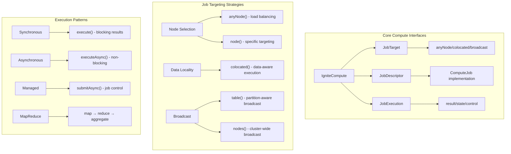

# 7. Compute API - Distributed Job Execution

In any music streaming platform, compute-intensive operations become inevitable. When a customer requests playlist recommendations for their 10,000-song library, or when the system needs to analyze listening patterns across millions of tracks, running these operations on a single node creates bottlenecks. The answer lies in distributed job execution—sending compute work to the data rather than pulling data to compute.

Consider this scenario: A music store wants to analyze which artists have the highest album sales across all customer purchases. Instead of pulling invoice data from all nodes to a central location for processing, Ignite 3's Compute API allows you to **send the analysis job directly to each node** where customer and invoice data resides. Each node processes its local data partition, then results aggregate back to the caller. This pattern—**code to data, not data to code**—defines efficient distributed computing.

This is exactly what Ignite 3's Compute API delivers: **distributed job execution with data locality awareness** and comprehensive management capabilities.

## Overview: Compute API Architecture

The Compute API provides a framework for executing code across cluster nodes with sophisticated targeting and result management:



**Key Design Principles:**

- **Data Locality**: Jobs execute where data resides, minimizing network overhead
- **Multiple Targeting**: From specific nodes to intelligent data-aware placement
- **Result Management**: Synchronous, asynchronous, and job control patterns
- **Type Safety**: Strong typing for job inputs, outputs, and execution context

## Job Submission Patterns

> **Important**: All examples in this documentation use the correct Ignite 3 API classes. When working with SQL results, use `org.apache.ignite.sql.SqlRow` (not `Row`). The examples include proper import statements to ensure your code compiles correctly.

### Basic Job Execution

The fundamental pattern involves creating a job descriptor and selecting an execution target:

```java
import org.apache.ignite.compute.ComputeJob;
import org.apache.ignite.compute.JobExecutionContext;
import org.apache.ignite.sql.IgniteSql;
import org.apache.ignite.sql.ResultSet;
import org.apache.ignite.sql.SqlRow;

// Job that calculates total duration for a set of track IDs
public class TrackDurationJob implements ComputeJob<List<Integer>, Double> {
    @Override
    public CompletableFuture<Double> executeAsync(JobExecutionContext context, List<Integer> trackIds) {
        return CompletableFuture.supplyAsync(() -> {
            // Access Ignite APIs within the job execution context
            IgniteSql sql = context.ignite().sql();
            
            double totalDuration = 0.0;
            for (Integer trackId : trackIds) {
                try (ResultSet<SqlRow> rs = sql.execute(null, 
                    "SELECT Milliseconds FROM Track WHERE TrackId = ?", trackId)) {
                    
                    if (rs.hasNext()) {
                        SqlRow row = rs.next();
                        totalDuration += row.doubleValue("Milliseconds") / 60000.0; // Convert to minutes
                    }
                }
            }
            
            return totalDuration;
        });
    }
}

// Required imports for job submission
import org.apache.ignite.client.IgniteClient;
import org.apache.ignite.compute.JobDescriptor;
import org.apache.ignite.compute.JobTarget;

// Connect to Ignite cluster and submit job
try (IgniteClient ignite = IgniteClient.builder()
        .addresses("localhost:10800")
        .build()) {
    
    // Submit job to any available node
    JobDescriptor<List<Integer>, Double> job = JobDescriptor.builder(TrackDurationJob.class).build();
    JobTarget target = JobTarget.anyNode(ignite.clusterNodes());
    List<Integer> trackIds = Arrays.asList(1, 2, 3, 4, 5);

    Double totalDuration = ignite.compute().execute(target, job, trackIds);
    System.out.println("Total track duration: " + totalDuration + " minutes");
}
```

**Key Concepts:**

- **ComputeJob Interface**: Your job implements `ComputeJob<InputType, OutputType>`
- **JobExecutionContext**: Provides access to the full Ignite API within the job
- **Type Safety**: Strong typing ensures compile-time correctness for inputs and outputs
- **Resource Access**: Jobs can execute SQL queries, access tables, and use other Ignite features

### Job Targeting Strategies

#### Any Node Execution

For compute work that doesn't depend on specific data location:

```java
// CPU-intensive job that doesn't require data access
public class AlbumNameAnalysisJob implements ComputeJob<List<String>, Map<String, Integer>> {
    @Override
    public CompletableFuture<Map<String, Integer>> executeAsync(
            JobExecutionContext context, List<String> albumTitles) {
        
        return CompletableFuture.supplyAsync(() -> {
            Map<String, Integer> analysis = new HashMap<>();
            
            for (String title : albumTitles) {
                // Word count analysis (CPU-intensive, no data access needed)
                String[] words = title.toLowerCase().split("\\s+");
                analysis.put(title, words.length);
            }
            
            return analysis;
        });
    }
}

// Execute on any available node for optimal load distribution
JobTarget target = JobTarget.anyNode(ignite.clusterNodes());
List<String> albums = Arrays.asList("Back in Black", "The Dark Side of the Moon", "Hotel California");
Map<String, Integer> analysis = ignite.compute().execute(target, job, albums);
```

#### Specific Node Targeting

When you need to target nodes with specific characteristics:

```java
// Target nodes based on resource availability or node characteristics
Set<ClusterNode> computeNodes = ignite.clusterNodes().stream()
    .filter(node -> node.name().startsWith("compute-"))
    .collect(Collectors.toSet());

if (!computeNodes.isEmpty()) {
    JobTarget target = JobTarget.anyNode(computeNodes);
    String result = ignite.compute().execute(target, job, inputData);
}

// Target a specific node by name or ID
Optional<ClusterNode> specificNode = ignite.clusterNodes().stream()
    .filter(node -> node.name().equals("worker-node-01"))
    .findFirst();

if (specificNode.isPresent()) {
    JobTarget target = JobTarget.node(specificNode.get());
    String result = ignite.compute().execute(target, job, inputData);
}
```

## Data Locality and Colocation

### Colocated Job Execution

The most powerful feature of Ignite 3's Compute API is data-aware job placement. Jobs execute on nodes where the relevant data resides:

```java
// Job that analyzes sales data for a specific artist
public class ArtistSalesAnalysisJob implements ComputeJob<Integer, ArtistSalesReport> {
    @Override
    public CompletableFuture<ArtistSalesReport> executeAsync(
            JobExecutionContext context, Integer artistId) {
        
        return CompletableFuture.supplyAsync(() -> {
            IgniteSql sql = context.ignite().sql();
            
            // This query executes locally since the job runs where Artist data is colocated
            String salesQuery = """
                SELECT al.Title, COUNT(il.TrackId) as TracksSold, SUM(il.UnitPrice * il.Quantity) as Revenue
                FROM Artist ar
                JOIN Album al ON ar.ArtistId = al.ArtistId  
                JOIN Track t ON al.AlbumId = t.AlbumId
                JOIN InvoiceLine il ON t.TrackId = il.TrackId
                WHERE ar.ArtistId = ?
                GROUP BY al.AlbumId, al.Title
                ORDER BY Revenue DESC
                """;
            
            List<AlbumSales> albumSales = new ArrayList<>();
            try (ResultSet<SqlRow> rs = sql.execute(null, salesQuery, artistId)) {
                while (rs.hasNext()) {
                    SqlRow row = rs.next();
                    albumSales.add(new AlbumSales(
                        row.stringValue("Title"),
                        row.intValue("TracksSold"), 
                        row.doubleValue("Revenue")
                    ));
                }
            }
            
            // Get artist name
            String artistName = "Unknown Artist";
            try (ResultSet<SqlRow> rs = sql.execute(null, 
                "SELECT Name FROM Artist WHERE ArtistId = ?", artistId)) {
                if (rs.hasNext()) {
                    artistName = rs.next().stringValue("Name");
                }
            }
            
            return new ArtistSalesReport(artistId, artistName, albumSales);
        });
    }
}

// Required import for colocation
import org.apache.ignite.table.Tuple;

// Execute job on the node where Artist data with ArtistId=1 resides
JobTarget colocatedTarget = JobTarget.colocated("Artist", 
    Tuple.create().set("ArtistId", 1));

ArtistSalesReport report = ignite.compute().execute(colocatedTarget, job, 1);
System.out.println("Sales report for " + report.getArtistName() + 
    ": " + report.getTotalRevenue() + " total revenue");
```

**Data Locality Benefits:**

- **Network Efficiency**: Data doesn't cross network boundaries for processing
- **Performance**: Local data access is orders of magnitude faster than remote
- **Scalability**: Work scales with data distribution across the cluster

### Broadcast Execution Patterns

When you need to execute jobs across all nodes or all data partitions:

```java
// Job that calculates local statistics on each node
public class LocalTrackStatsJob implements ComputeJob<Void, TrackStatistics> {
    @Override
    public CompletableFuture<TrackStatistics> executeAsync(
            JobExecutionContext context, Void input) {
        
        return CompletableFuture.supplyAsync(() -> {
            IgniteSql sql = context.ignite().sql();
            
            // Each node calculates statistics for its local track data
            try (ResultSet<SqlRow> rs = sql.execute(null, """
                SELECT COUNT(*) as TrackCount, 
                       AVG(Milliseconds) as AvgDuration,
                       MIN(Milliseconds) as MinDuration,
                       MAX(Milliseconds) as MaxDuration
                FROM Track
                """)) {
                
                if (rs.hasNext()) {
                    SqlRow row = rs.next();
                    return new TrackStatistics(
                        row.intValue("TrackCount"),
                        row.doubleValue("AvgDuration"),
                        row.intValue("MinDuration"),
                        row.intValue("MaxDuration")
                    );
                }
            }
            
            return new TrackStatistics(0, 0.0, 0, 0);
        });
    }
}

// Required import for broadcast
import org.apache.ignite.compute.BroadcastJobTarget;

// Execute on all nodes to gather comprehensive statistics
BroadcastJobTarget broadcastTarget = BroadcastJobTarget.nodes(ignite.clusterNodes());
Collection<TrackStatistics> nodeStats = ignite.compute().execute(broadcastTarget, job, null);

// Aggregate statistics from all nodes
TrackStatistics globalStats = nodeStats.stream()
    .reduce(new TrackStatistics(0, 0.0, Integer.MAX_VALUE, Integer.MIN_VALUE),
            TrackStatistics::merge);

System.out.println("Global track statistics: " + globalStats);
```

**Broadcast Patterns:**

- **Cluster-wide Operations**: Execute on all cluster nodes
- **Partition-aware Broadcast**: Execute on nodes that hold specific table data
- **Result Aggregation**: Collect and combine results from multiple executions

## Asynchronous Execution and Job Control

### Non-blocking Job Execution

For applications that can't afford to block on job execution:

```java
// Submit multiple analysis jobs asynchronously
List<Integer> artistIds = Arrays.asList(1, 2, 3, 4, 5);
List<CompletableFuture<ArtistSalesReport>> futures = new ArrayList<>();

for (Integer artistId : artistIds) {
    JobTarget target = JobTarget.colocated("Artist", 
        Tuple.create().set("ArtistId", artistId));
    
    CompletableFuture<ArtistSalesReport> future = ignite.compute()
        .executeAsync(target, salesAnalysisJob, artistId);
    
    futures.add(future);
}

// Process results as they complete
CompletableFuture<Void> allComplete = CompletableFuture.allOf(
    futures.toArray(new CompletableFuture[0]));

allComplete.thenRun(() -> {
    List<ArtistSalesReport> reports = futures.stream()
        .map(CompletableFuture::join)
        .collect(Collectors.toList());
    
    // Process all completed reports
    reports.forEach(report -> 
        System.out.println(report.getArtistName() + ": " + report.getTotalRevenue()));
});
```

### Job Execution Management

For long-running jobs that require monitoring and control:

```java
// Required imports for job control
import org.apache.ignite.compute.JobExecution;
import org.apache.ignite.compute.JobState;

// Submit job with execution control
CompletableFuture<JobExecution<String>> executionFuture = ignite.compute()
    .submitAsync(target, longRunningJob, inputData);

JobExecution<String> execution = executionFuture.get();

// Monitor job state
CompletableFuture<JobState> stateFuture = execution.stateAsync();
stateFuture.thenAccept(state -> {
    System.out.println("Job state: " + state.status());
    System.out.println("Job ID: " + state.id());
    System.out.println("Create time: " + state.createTime());
});

// Get result when job completes
CompletableFuture<String> resultFuture = execution.resultAsync();
resultFuture.thenAccept(result -> {
    System.out.println("Job completed with result: " + result);
});

// Cancel job if needed
// execution.cancel(); // Implementation depends on job design
```

**Job Control Features:**

- **State Monitoring**: Track job progress and status
- **Result Management**: Handle results when jobs complete
- **Execution Context**: Access job metadata and execution details

## Result Handling and Aggregation

### MapReduce Patterns

For complex analytics that require map-reduce style processing:

```java
// Map phase: Analyze tracks by genre on each node
public class GenreAnalysisMapJob implements ComputeJob<Void, Map<String, GenreStats>> {
    @Override
    public CompletableFuture<Map<String, GenreStats>> executeAsync(
            JobExecutionContext context, Void input) {
        
        return CompletableFuture.supplyAsync(() -> {
            IgniteSql sql = context.ignite().sql();
            Map<String, GenreStats> genreStats = new HashMap<>();
            
            try (ResultSet<SqlRow> rs = sql.execute(null, """
                SELECT g.Name as GenreName, 
                       COUNT(t.TrackId) as TrackCount,
                       AVG(t.Milliseconds) as AvgDuration,
                       SUM(COALESCE(il.Quantity, 0)) as TotalSales
                FROM Genre g
                LEFT JOIN Track t ON g.GenreId = t.GenreId
                LEFT JOIN InvoiceLine il ON t.TrackId = il.TrackId
                GROUP BY g.GenreId, g.Name
                """)) {
                
                while (rs.hasNext()) {
                    SqlRow row = rs.next();
                    String genreName = row.stringValue("GenreName");
                    genreStats.put(genreName, new GenreStats(
                        row.intValue("TrackCount"),
                        row.doubleValue("AvgDuration"),
                        row.intValue("TotalSales")
                    ));
                }
            }
            
            return genreStats;
        });
    }
}

// Execute map jobs across all nodes
BroadcastJobTarget target = BroadcastJobTarget.table("Track");
Collection<Map<String, GenreStats>> mapResults = ignite.compute()
    .execute(target, mapJob, null);

// Reduce phase: Aggregate results from all nodes
Map<String, GenreStats> globalGenreStats = new HashMap<>();
for (Map<String, GenreStats> nodeResult : mapResults) {
    nodeResult.forEach((genre, stats) -> 
        globalGenreStats.merge(genre, stats, GenreStats::merge));
}

// Display aggregated results
globalGenreStats.entrySet().stream()
    .sorted(Map.Entry.<String, GenreStats>comparingByValue(
        Comparator.comparing(GenreStats::getTotalSales)).reversed())
    .forEach(entry -> System.out.println(
        entry.getKey() + ": " + entry.getValue().getTotalSales() + " total sales"));
```

### Streaming Result Processing

For jobs that produce streaming results:

```java
// Job that streams playlist recommendations
public class PlaylistRecommendationJob implements ComputeJob<Integer, Stream<String>> {
    @Override
    public CompletableFuture<Stream<String>> executeAsync(
            JobExecutionContext context, Integer customerId) {
        
        return CompletableFuture.supplyAsync(() -> {
            IgniteSql sql = context.ignite().sql();
            
            // Stream recommendations based on customer's purchase history
            List<String> recommendations = new ArrayList<>();
            
            try (ResultSet<SqlRow> rs = sql.execute(null, """
                SELECT DISTINCT t2.Name as RecommendedTrack
                FROM Customer c1
                JOIN Invoice i1 ON c1.CustomerId = i1.CustomerId
                JOIN InvoiceLine il1 ON i1.InvoiceId = il1.InvoiceId
                JOIN Track t1 ON il1.TrackId = t1.TrackId
                JOIN Album a1 ON t1.AlbumId = a1.AlbumId
                JOIN Album a2 ON a1.ArtistId = a2.ArtistId AND a2.AlbumId != a1.AlbumId
                JOIN Track t2 ON a2.AlbumId = t2.AlbumId
                WHERE c1.CustomerId = ?
                ORDER BY t2.Name
                LIMIT 50
                """, customerId)) {
                
                while (rs.hasNext()) {
                    recommendations.add(rs.next().stringValue("RecommendedTrack"));
                }
            }
            
            return recommendations.stream();
        });
    }
}

// Process streaming recommendations
CompletableFuture<Stream<String>> recommendationsFuture = ignite.compute()
    .executeAsync(colocatedTarget, recommendationJob, customerId);

recommendationsFuture.thenAccept(recommendationsStream -> {
    recommendationsStream
        .limit(10)  // Take top 10 recommendations
        .forEach(track -> System.out.println("Recommended: " + track));
});
```

## Best Practices and Performance Optimization

### Resource Management in Jobs

```java
public class ResourceAwareTrackAnalysisJob implements ComputeJob<List<Integer>, TrackAnalysisResult> {
    @Override
    public CompletableFuture<TrackAnalysisResult> executeAsync(
            JobExecutionContext context, List<Integer> trackIds) {
        
        return CompletableFuture.supplyAsync(() -> {
            // Use try-with-resources for proper cleanup
            try (SqlSession session = context.ignite().sql().createSession()) {
                
                // Batch operations for efficiency
                List<Row> tracks = new ArrayList<>();
                for (int i = 0; i < trackIds.size(); i += 100) {
                    List<Integer> batch = trackIds.subList(i, 
                        Math.min(i + 100, trackIds.size()));
                    
                    String placeholders = String.join(",", 
                        Collections.nCopies(batch.size(), "?"));
                    
                    try (ResultSet<SqlRow> rs = session.execute(null,
                        "SELECT * FROM Track WHERE TrackId IN (" + placeholders + ")",
                        batch.toArray())) {
                        
                        while (rs.hasNext()) {
                            tracks.add(rs.next());
                        }
                    }
                }
                
                return analyzeTrackData(tracks);
                
            } catch (Exception e) {
                throw new RuntimeException("Track analysis failed", e);
            }
        });
    }
    
    private TrackAnalysisResult analyzeTrackData(List<Row> tracks) {
        // Perform analysis on track data
        double avgDuration = tracks.stream()
            .mapToDouble(row -> row.doubleValue("Milliseconds"))
            .average()
            .orElse(0.0);
        
        Map<String, Long> genreCounts = tracks.stream()
            .collect(Collectors.groupingBy(
                row -> String.valueOf(row.value("GenreId")),
                Collectors.counting()));
        
        return new TrackAnalysisResult(tracks.size(), avgDuration, genreCounts);
    }
}
```

### Error Handling and Fault Tolerance

```java
public class FaultTolerantArtistAnalysisJob implements ComputeJob<Integer, Optional<ArtistReport>> {
    @Override
    public CompletableFuture<Optional<ArtistReport>> executeAsync(
            JobExecutionContext context, Integer artistId) {
        
        return CompletableFuture.supplyAsync(() -> {
            try {
                // Check for job cancellation
                if (context.isCancelled()) {
                    return Optional.empty();
                }
                
                ArtistReport report = performArtistAnalysis(context, artistId);
                return Optional.of(report);
                
            } catch (DataAccessException e) {
                // Handle data access errors gracefully
                System.err.println("Data access error for artist " + artistId + ": " + e.getMessage());
                return Optional.empty();
                
            } catch (Exception e) {
                // Log unexpected errors but don't propagate
                System.err.println("Unexpected error analyzing artist " + artistId + ": " + e.getMessage());
                return Optional.empty();
            }
        });
    }
    
    private ArtistReport performArtistAnalysis(JobExecutionContext context, Integer artistId) {
        IgniteSql sql = context.ignite().sql();
        
        // Implementation with retry logic for transient failures
        int maxRetries = 3;
        for (int attempt = 0; attempt < maxRetries; attempt++) {
            try {
                return executeArtistQuery(sql, artistId);
            } catch (TransientException e) {
                if (attempt == maxRetries - 1) {
                    throw e;
                }
                // Exponential backoff
                try {
                    Thread.sleep(1000 * (1L << attempt));
                } catch (InterruptedException ie) {
                    Thread.currentThread().interrupt();
                    throw new RuntimeException("Analysis interrupted", ie);
                }
            }
        }
        
        throw new RuntimeException("Max retries exceeded");
    }
    
    private ArtistReport executeArtistQuery(IgniteSql sql, Integer artistId) {
        // Query implementation that may throw TransientException
        // ... implementation details
        return new ArtistReport(artistId, "Sample Artist", 0, 0.0);
    }
}
```

The Compute API transforms how music store applications handle data-intensive operations. By executing code where data resides and providing sophisticated job management capabilities, it enables applications to scale compute operations naturally with data growth. Whether analyzing customer listening patterns, generating playlist recommendations, or calculating sales reports, the Compute API ensures operations run efficiently across the distributed cluster.

In the next section, we'll explore Data Streaming patterns that complement compute operations by providing high-throughput data ingestion capabilities for real-time music store operations.