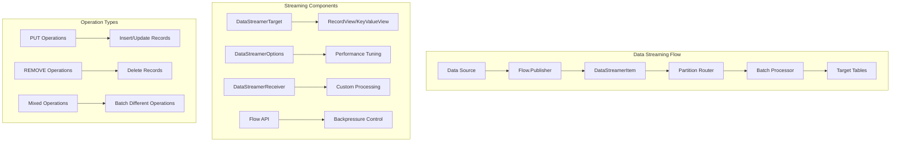

# 8. Data Streaming - High-Throughput Ingestion

When a music streaming service releases a new album from a major artist, millions of users immediately begin streaming tracks. Each play generates events: track started, track completed, rating given, playlist added. Processing these events one-by-one through traditional database operations creates bottlenecks that prevent real-time analytics and recommendations. The solution lies in **streaming data directly into Ignite tables** at high throughput.

Consider this scenario: A popular band releases their new album at midnight. Within the first hour, 500,000 listeners generate 2.5 million track events. Traditional INSERT statements would require 2.5 million individual database operations. Instead, Ignite 3's Data Streaming API **batches these events into optimized chunks**, routes them to appropriate cluster nodes based on data locality, and **ingests thousands of records per second** with built-in backpressure handling.

This is exactly what Ignite 3's Data Streaming API delivers: **high-throughput data ingestion with intelligent batching and flow control**.

## Overview: Data Streaming Architecture

The Data Streaming API provides a reactive framework for bulk data operations with sophisticated performance optimization:



**Key Design Principles:**

- **Reactive Streams**: Built on Java Flow API for natural backpressure handling
- **Intelligent Batching**: Groups records by partition for optimal network utilization
- **Data Locality**: Routes data to nodes where it will reside for minimal network overhead
- **Performance Control**: Configurable batch sizes, parallelism, and flow control

## Basic Streaming Patterns

> **Important**: All examples in this documentation use the correct Ignite 3 API classes. The Data Streaming API works with both `RecordView<T>` and `KeyValueView<K,V>` interfaces, providing type-safe streaming operations.

### Simple Record Streaming

The fundamental pattern involves creating a data publisher and streaming records into a table:

```java
import org.apache.ignite.client.IgniteClient;
import org.apache.ignite.table.RecordView;
import org.apache.ignite.table.DataStreamerItem;
import org.apache.ignite.table.DataStreamerOptions;
import org.apache.ignite.table.Tuple;

import java.util.concurrent.Flow;
import java.util.concurrent.SubmissionPublisher;
import java.util.concurrent.CompletableFuture;

// Basic track listening event streaming
try (IgniteClient ignite = IgniteClient.builder()
        .addresses("localhost:10800")
        .build()) {
    
    RecordView<Tuple> trackEventsView = ignite.tables()
        .table("TrackEvents")
        .recordView();
    
    // Configure streaming options for performance
    DataStreamerOptions options = DataStreamerOptions.builder()
        .pageSize(1000)                    // Records per batch
        .perPartitionParallelOperations(2) // Concurrent requests per partition
        .autoFlushInterval(1000)           // Auto-flush after 1 second
        .retryLimit(16)                    // Retry failed operations
        .build();
    
    // Create publisher for track events
    try (SubmissionPublisher<DataStreamerItem<Tuple>> publisher = 
            new SubmissionPublisher<>()) {
        
        // Start streaming process
        CompletableFuture<Void> streamingFuture = trackEventsView
            .streamData(publisher, options);
        
        // Simulate real-time track events
        for (int i = 0; i < 10000; i++) {
            Tuple trackEvent = Tuple.create()
                .set("EventId", i)
                .set("UserId", 1000 + (i % 100))          // 100 different users
                .set("TrackId", 1 + (i % 50))             // 50 different tracks
                .set("EventType", "TRACK_STARTED")
                .set("Timestamp", System.currentTimeMillis())
                .set("Duration", 0);                      // Will be updated when track ends
            
            // Stream as INSERT operation
            publisher.submit(DataStreamerItem.of(trackEvent));
            
            // Simulate event frequency (every 10ms)
            Thread.sleep(10);
        }
        
        // Signal completion and wait for all data to be processed
        publisher.close();
        streamingFuture.get();
        
        System.out.println("Successfully streamed 10,000 track events");
    }
}
```

**Key Concepts:**

- **DataStreamerItem**: Wrapper that specifies operation type (PUT/REMOVE)
- **DataStreamerOptions**: Performance tuning for batch sizes and parallelism  
- **Flow.Publisher**: Reactive streams interface for data production
- **Automatic Batching**: Records are grouped for efficient transmission

### Mixed Operation Streaming

Real-world scenarios often require mixing INSERT, UPDATE, and DELETE operations:

```java
import org.apache.ignite.table.DataStreamerOperationType;

// Stream mixed operations for track event lifecycle
try (SubmissionPublisher<DataStreamerItem<Tuple>> publisher = 
        new SubmissionPublisher<>()) {
    
    CompletableFuture<Void> streamingFuture = trackEventsView
        .streamData(publisher, options);
    
    // Simulate complete track listening lifecycle
    for (int sessionId = 1; sessionId <= 1000; sessionId++) {
        int userId = 1000 + (sessionId % 100);
        int trackId = 1 + (sessionId % 50);
        long startTime = System.currentTimeMillis();
        
        // 1. Track started event
        Tuple startEvent = Tuple.create()
            .set("EventId", sessionId * 3)
            .set("UserId", userId)
            .set("TrackId", trackId)
            .set("EventType", "TRACK_STARTED")
            .set("Timestamp", startTime)
            .set("Duration", 0);
        
        publisher.submit(DataStreamerItem.of(startEvent)); // PUT operation
        
        // 2. Track completed event (update duration)
        long endTime = startTime + (30000 + (sessionId % 240000)); // 30s to 4.5min
        Tuple completeEvent = Tuple.create()
            .set("EventId", sessionId * 3 + 1)
            .set("UserId", userId)
            .set("TrackId", trackId)
            .set("EventType", "TRACK_COMPLETED")
            .set("Timestamp", endTime)
            .set("Duration", endTime - startTime);
        
        publisher.submit(DataStreamerItem.of(completeEvent)); // PUT operation
        
        // 3. Remove old incomplete events (simulate cleanup)
        if (sessionId % 10 == 0) {
            Tuple obsoleteEvent = Tuple.create()
                .set("EventId", sessionId * 3 - 30); // Old event ID
            
            publisher.submit(DataStreamerItem.removed(obsoleteEvent)); // REMOVE operation
        }
    }
    
    publisher.close();
    streamingFuture.get();
    
    System.out.println("Processed complete track listening lifecycle for 1,000 sessions");
}
```

**Operation Type Benefits:**

- **PUT Operations**: Handle both inserts and updates automatically
- **REMOVE Operations**: Efficient bulk deletion without individual queries
- **Mixed Batches**: Operations are optimized together for network efficiency

## High-Volume Data Ingestion

### Bulk Track Data Loading

For scenarios requiring maximum throughput, such as migrating historical listening data:

```java
import java.nio.file.Files;
import java.nio.file.Paths;
import java.util.concurrent.ExecutorService;
import java.util.concurrent.Executors;

public class BulkTrackDataLoader {
    
    public static void loadHistoricalListeningData(IgniteClient ignite, String csvFilePath) 
            throws Exception {
        
        RecordView<Tuple> listeningHistoryView = ignite.tables()
            .table("ListeningHistory")
            .recordView();
        
        // High-throughput configuration for bulk loading
        DataStreamerOptions bulkOptions = DataStreamerOptions.builder()
            .pageSize(5000)                     // Large batches for throughput
            .perPartitionParallelOperations(4)  // High parallelism
            .autoFlushInterval(500)             // Faster flushing
            .retryLimit(32)                     // Higher retry limit for stability
            .build();
        
        // Use larger buffer for high-volume streaming
        ExecutorService executor = Executors.newFixedThreadPool(2);
        
        try (SubmissionPublisher<DataStreamerItem<Tuple>> publisher = 
                new SubmissionPublisher<>(executor, 10000)) { // Large buffer
            
            CompletableFuture<Void> streamingFuture = listeningHistoryView
                .streamData(publisher, bulkOptions);
            
            // Process CSV file in chunks for memory efficiency
            Files.lines(Paths.get(csvFilePath))
                .skip(1) // Skip header
                .forEach(line -> {
                    try {
                        String[] fields = line.split(",");
                        
                        Tuple historyRecord = Tuple.create()
                            .set("RecordId", Long.parseLong(fields[0]))
                            .set("UserId", Integer.parseInt(fields[1]))
                            .set("TrackId", Integer.parseInt(fields[2]))
                            .set("PlayDate", fields[3])
                            .set("PlayCount", Integer.parseInt(fields[4]))
                            .set("Rating", fields[5].isEmpty() ? null : Integer.parseInt(fields[5]))
                            .set("PlayDuration", Integer.parseInt(fields[6]));
                        
                        publisher.submit(DataStreamerItem.of(historyRecord));
                        
                    } catch (Exception e) {
                        System.err.println("Error processing line: " + line + " - " + e.getMessage());
                    }
                });
            
            publisher.close();
            streamingFuture.get();
            
            System.out.println("Successfully loaded historical listening data from " + csvFilePath);
            
        } finally {
            executor.shutdown();
        }
    }
}

// Usage example
BulkTrackDataLoader.loadHistoricalListeningData(ignite, 
    "/data/music-streaming-history.csv");
```

### Real-Time Event Streaming

For applications that must handle continuous data streams:

```java
import java.util.concurrent.BlockingQueue;
import java.util.concurrent.LinkedBlockingQueue;
import java.util.concurrent.CompletableFuture;

public class RealTimeEventStreamer {
    private final IgniteClient ignite;
    private final BlockingQueue<TrackEvent> eventQueue;
    private volatile boolean running = true;
    
    public RealTimeEventStreamer(IgniteClient ignite) {
        this.ignite = ignite;
        this.eventQueue = new LinkedBlockingQueue<>(100000); // Large buffer for bursts
    }
    
    public void startStreaming() {
        RecordView<Tuple> eventsView = ignite.tables()
            .table("RealTimeEvents")
            .recordView();
        
        DataStreamerOptions streamingOptions = DataStreamerOptions.builder()
            .pageSize(2000)                    // Balanced batch size
            .perPartitionParallelOperations(3) // High concurrency
            .autoFlushInterval(200)            // Fast response time
            .retryLimit(8)                     // Reasonable retry limit
            .build();
        
        CompletableFuture.runAsync(() -> {
            try (SubmissionPublisher<DataStreamerItem<Tuple>> publisher = 
                    new SubmissionPublisher<>()) {
                
                CompletableFuture<Void> streamingFuture = eventsView
                    .streamData(publisher, streamingOptions);
                
                while (running) {
                    try {
                        // Poll for events with timeout to check running status
                        TrackEvent event = eventQueue.poll(100, TimeUnit.MILLISECONDS);
                        if (event != null) {
                            Tuple eventTuple = createEventTuple(event);
                            publisher.submit(DataStreamerItem.of(eventTuple));
                        }
                        
                    } catch (InterruptedException e) {
                        Thread.currentThread().interrupt();
                        break;
                    }
                }
                
                publisher.close();
                streamingFuture.get();
                
            } catch (Exception e) {
                System.err.println("Real-time streaming error: " + e.getMessage());
            }
        });
    }
    
    public void addEvent(TrackEvent event) {
        if (!eventQueue.offer(event)) {
            System.err.println("Event queue full, dropping event: " + event);
        }
    }
    
    public void stop() {
        running = false;
    }
    
    private Tuple createEventTuple(TrackEvent event) {
        return Tuple.create()
            .set("EventId", event.getId())
            .set("UserId", event.getUserId())
            .set("TrackId", event.getTrackId())
            .set("EventType", event.getType().name())
            .set("Timestamp", event.getTimestamp())
            .set("Metadata", event.getMetadata());
    }
}

// Usage for handling music app events
RealTimeEventStreamer streamer = new RealTimeEventStreamer(ignite);
streamer.startStreaming();

// Simulate incoming events from music app
for (int i = 0; i < 50000; i++) {
    TrackEvent event = new TrackEvent(
        i, 
        1000 + (i % 500), 
        1 + (i % 100),
        EventType.TRACK_PLAY,
        System.currentTimeMillis(),
        "genre:rock,mood:energetic"
    );
    streamer.addEvent(event);
    
    // Simulate variable load
    if (i % 1000 == 0) {
        Thread.sleep(50); // Periodic burst pause
    }
}

streamer.stop();
```

## Advanced Streaming with Custom Receivers

### Server-Side Processing

For scenarios requiring data transformation or validation during ingestion:

```java
import org.apache.ignite.table.DataStreamerReceiver;
import org.apache.ignite.table.DataStreamerReceiverContext;
import org.apache.ignite.table.DataStreamerReceiverDescriptor;
import org.apache.ignite.compute.DeploymentUnit;

// Custom receiver for processing raw music event data
public class MusicEventProcessor implements DataStreamerReceiver<String, String, ProcessingResult> {
    
    @Override
    public CompletableFuture<List<ProcessingResult>> receive(
            List<String> rawEvents,
            DataStreamerReceiverContext ctx,
            String validationRules) {
        
        return CompletableFuture.supplyAsync(() -> {
            List<ProcessingResult> results = new ArrayList<>();
            RecordView<Tuple> eventsView = ctx.ignite().tables()
                .table("ProcessedEvents")
                .recordView();
            
            RecordView<Tuple> errorView = ctx.ignite().tables()
                .table("ProcessingErrors")
                .recordView();
            
            for (String rawEvent : rawEvents) {
                try {
                    // Parse and validate raw event data
                    MusicEvent parsedEvent = parseRawEvent(rawEvent);
                    
                    if (isValidEvent(parsedEvent, validationRules)) {
                        // Transform and store valid event
                        Tuple eventTuple = transformToTuple(parsedEvent);
                        eventsView.insert(null, eventTuple);
                        
                        results.add(new ProcessingResult(parsedEvent.getId(), "SUCCESS", null));
                        
                    } else {
                        // Store validation error
                        Tuple errorTuple = createErrorRecord(rawEvent, "VALIDATION_FAILED");
                        errorView.insert(null, errorTuple);
                        
                        results.add(new ProcessingResult(parsedEvent.getId(), "VALIDATION_ERROR", 
                            "Event failed validation rules"));
                    }
                    
                } catch (Exception e) {
                    // Store parsing error
                    Tuple errorTuple = createErrorRecord(rawEvent, "PARSING_ERROR");
                    errorView.insert(null, errorTuple);
                    
                    results.add(new ProcessingResult(null, "PARSING_ERROR", e.getMessage()));
                }
            }
            
            return results;
        });
    }
    
    private MusicEvent parseRawEvent(String rawEvent) {
        // Parse JSON or CSV format into structured event
        String[] parts = rawEvent.split("\\|");
        return new MusicEvent(
            Long.parseLong(parts[0]),   // Event ID
            Integer.parseInt(parts[1]), // User ID  
            Integer.parseInt(parts[2]), // Track ID
            parts[3],                   // Event type
            Long.parseLong(parts[4]),   // Timestamp
            parts.length > 5 ? parts[5] : null // Metadata
        );
    }
    
    private boolean isValidEvent(MusicEvent event, String validationRules) {
        // Implement validation logic based on rules
        if (event.getUserId() <= 0 || event.getTrackId() <= 0) {
            return false;
        }
        
        if (event.getTimestamp() > System.currentTimeMillis()) {
            return false; // Future timestamp not allowed
        }
        
        return true;
    }
    
    private Tuple transformToTuple(MusicEvent event) {
        return Tuple.create()
            .set("EventId", event.getId())
            .set("UserId", event.getUserId())
            .set("TrackId", event.getTrackId())
            .set("EventType", event.getEventType())
            .set("Timestamp", event.getTimestamp())
            .set("ProcessedAt", System.currentTimeMillis())
            .set("Metadata", event.getMetadata());
    }
    
    private Tuple createErrorRecord(String rawEvent, String errorType) {
        return Tuple.create()
            .set("ErrorId", System.nanoTime())
            .set("RawData", rawEvent)
            .set("ErrorType", errorType)
            .set("ErrorTime", System.currentTimeMillis());
    }
}

// Usage with receiver-based streaming
RecordView<Tuple> sourceView = ignite.tables()
    .table("RawEvents")
    .recordView();

// Create receiver descriptor
DataStreamerReceiverDescriptor<String, String, ProcessingResult> receiverDescriptor = 
    DataStreamerReceiverDescriptor.<String, String, ProcessingResult>builder(
        MusicEventProcessor.class)
        .units(new DeploymentUnit("musicProcessingUnit", "1.0.0"))
        .build();

// Stream raw data with custom processing
try (SubmissionPublisher<String> rawDataPublisher = new SubmissionPublisher<>()) {
    
    // Result subscriber to handle processing outcomes
    Flow.Subscriber<ProcessingResult> resultSubscriber = new Flow.Subscriber<ProcessingResult>() {
        private Flow.Subscription subscription;
        
        @Override
        public void onSubscribe(Flow.Subscription subscription) {
            this.subscription = subscription;
            subscription.request(Long.MAX_VALUE);
        }
        
        @Override
        public void onNext(ProcessingResult result) {
            System.out.println("Processing result: " + result.getStatus() + 
                " for event " + result.getEventId());
        }
        
        @Override
        public void onError(Throwable throwable) {
            System.err.println("Processing error: " + throwable.getMessage());
        }
        
        @Override
        public void onComplete() {
            System.out.println("Processing completed");
        }
    };
    
    CompletableFuture<Void> processingFuture = sourceView.streamData(
        rawDataPublisher,
        receiverDescriptor,
        rawEvent -> Tuple.create().set("key", rawEvent.hashCode()), // Key function
        rawEvent -> rawEvent,                                       // Payload function
        "userId>0;trackId>0;timestamp<now",                        // Validation rules
        resultSubscriber,                                          // Result handling
        DataStreamerOptions.DEFAULT                                // Options
    );
    
    // Send raw event data
    rawDataPublisher.submit("12345|1001|55|TRACK_STARTED|1640995200000|genre:jazz");
    rawDataPublisher.submit("12346|1001|55|TRACK_COMPLETED|1640995260000|duration:60000");
    rawDataPublisher.submit("12347|1002|73|TRACK_STARTED|1640995300000|genre:rock");
    
    rawDataPublisher.close();
    processingFuture.get();
}
```

## Backpressure and Flow Control

### Adaptive Flow Management

Managing data flow when consumers can't keep up with producers:

```java
import java.util.concurrent.Flow;

public class AdaptiveTrackEventPublisher implements Flow.Publisher<DataStreamerItem<Tuple>> {
    private final List<TrackEvent> events;
    private final AtomicBoolean subscribed = new AtomicBoolean(false);
    
    public AdaptiveTrackEventPublisher(List<TrackEvent> events) {
        this.events = new ArrayList<>(events);
    }
    
    @Override
    public void subscribe(Flow.Subscriber<? super DataStreamerItem<Tuple>> subscriber) {
        if (subscribed.compareAndSet(false, true)) {
            subscriber.onSubscribe(new AdaptiveSubscription(subscriber));
        } else {
            subscriber.onError(new IllegalStateException("Publisher already subscribed"));
        }
    }
    
    private class AdaptiveSubscription implements Flow.Subscription {
        private final Flow.Subscriber<? super DataStreamerItem<Tuple>> subscriber;
        private final AtomicLong demand = new AtomicLong(0);
        private final AtomicInteger currentIndex = new AtomicInteger(0);
        private volatile boolean cancelled = false;
        
        public AdaptiveSubscription(Flow.Subscriber<? super DataStreamerItem<Tuple>> subscriber) {
            this.subscriber = subscriber;
        }
        
        @Override
        public void request(long n) {
            if (n <= 0) {
                subscriber.onError(new IllegalArgumentException("Request must be positive"));
                return;
            }
            
            long currentDemand = demand.addAndGet(n);
            deliverItems(currentDemand);
        }
        
        @Override
        public void cancel() {
            cancelled = true;
        }
        
        private void deliverItems(long requestedItems) {
            CompletableFuture.runAsync(() -> {
                long delivered = 0;
                
                while (delivered < requestedItems && !cancelled) {
                    int index = currentIndex.getAndIncrement();
                    
                    if (index >= events.size()) {
                        subscriber.onComplete();
                        return;
                    }
                    
                    TrackEvent event = events.get(index);
                    Tuple eventTuple = Tuple.create()
                        .set("EventId", event.getId())
                        .set("UserId", event.getUserId())
                        .set("TrackId", event.getTrackId())
                        .set("EventType", event.getType().name())
                        .set("Timestamp", event.getTimestamp());
                    
                    try {
                        subscriber.onNext(DataStreamerItem.of(eventTuple));
                        delivered++;
                        
                        // Adaptive rate limiting based on system performance
                        if (delivered % 1000 == 0) {
                            Thread.sleep(10); // Small pause every 1000 items
                        }
                        
                    } catch (Exception e) {
                        subscriber.onError(e);
                        return;
                    }
                }
                
                // Update demand counter
                demand.addAndGet(-delivered);
            });
        }
    }
}

// Usage with adaptive publishing
List<TrackEvent> massiveEventsList = generateMassiveEventList(1_000_000);
AdaptiveTrackEventPublisher adaptivePublisher = new AdaptiveTrackEventPublisher(massiveEventsList);

RecordView<Tuple> eventsView = ignite.tables()
    .table("MassiveEvents")
    .recordView();

// Configure for high-volume with backpressure handling
DataStreamerOptions adaptiveOptions = DataStreamerOptions.builder()
    .pageSize(1000)                    // Reasonable batch size
    .perPartitionParallelOperations(2) // Moderate parallelism
    .autoFlushInterval(2000)           // Longer flush interval for backpressure
    .retryLimit(16)                    // Standard retry limit
    .build();

CompletableFuture<Void> streamingFuture = eventsView.streamData(adaptivePublisher, adaptiveOptions);

// Monitor streaming progress
CompletableFuture.runAsync(() -> {
    while (!streamingFuture.isDone()) {
        try {
            Thread.sleep(5000);
            System.out.println("Streaming in progress...");
        } catch (InterruptedException e) {
            Thread.currentThread().interrupt();
            break;
        }
    }
});

streamingFuture.get();
System.out.println("Successfully streamed 1,000,000 events with adaptive flow control");
```

### Error Handling and Recovery

Robust error handling for production streaming applications:

```java
public class RobustMusicEventStreamer {
    private final IgniteClient ignite;
    private final AtomicLong successCount = new AtomicLong(0);
    private final AtomicLong errorCount = new AtomicLong(0);
    
    public RobustMusicEventStreamer(IgniteClient ignite) {
        this.ignite = ignite;
    }
    
    public CompletableFuture<StreamingResult> streamEventsWithRecovery(
            List<TrackEvent> events) {
        
        return CompletableFuture.supplyAsync(() -> {
            RecordView<Tuple> eventsView = ignite.tables()
                .table("RobustEvents")
                .recordView();
            
            // Retry configuration for resilience
            DataStreamerOptions resilientOptions = DataStreamerOptions.builder()
                .pageSize(500)                     // Smaller batches for error isolation
                .perPartitionParallelOperations(1) // Single-threaded for error tracking
                .autoFlushInterval(1000)           // Regular flushing
                .retryLimit(32)                    // High retry limit
                .build();
            
            int maxRetries = 3;
            int currentRetry = 0;
            
            while (currentRetry < maxRetries) {
                try {
                    return attemptStreaming(eventsView, events, resilientOptions);
                    
                } catch (Exception e) {
                    currentRetry++;
                    errorCount.incrementAndGet();
                    
                    System.err.println("Streaming attempt " + currentRetry + " failed: " + 
                        e.getMessage());
                    
                    if (currentRetry < maxRetries) {
                        try {
                            // Exponential backoff
                            Thread.sleep(1000 * (1L << (currentRetry - 1)));
                        } catch (InterruptedException ie) {
                            Thread.currentThread().interrupt();
                            throw new RuntimeException("Streaming interrupted", ie);
                        }
                    }
                }
            }
            
            throw new RuntimeException("Failed to stream after " + maxRetries + " attempts");
        });
    }
    
    private StreamingResult attemptStreaming(RecordView<Tuple> eventsView, 
                                           List<TrackEvent> events,
                                           DataStreamerOptions options) throws Exception {
        
        try (SubmissionPublisher<DataStreamerItem<Tuple>> publisher = 
                new SubmissionPublisher<>()) {
            
            CompletableFuture<Void> streamingFuture = eventsView.streamData(publisher, options);
            
            // Add error handling subscriber
            publisher.subscribe(new Flow.Subscriber<DataStreamerItem<Tuple>>() {
                private Flow.Subscription subscription;
                
                @Override
                public void onSubscribe(Flow.Subscription subscription) {
                    this.subscription = subscription;
                    subscription.request(Long.MAX_VALUE);
                }
                
                @Override
                public void onNext(DataStreamerItem<Tuple> item) {
                    successCount.incrementAndGet();
                }
                
                @Override
                public void onError(Throwable throwable) {
                    errorCount.incrementAndGet();
                    System.err.println("Item processing error: " + throwable.getMessage());
                }
                
                @Override
                public void onComplete() {
                    System.out.println("Streaming batch completed successfully");
                }
            });
            
            // Submit events with validation
            for (TrackEvent event : events) {
                if (isValidEvent(event)) {
                    Tuple eventTuple = convertEventToTuple(event);
                    publisher.submit(DataStreamerItem.of(eventTuple));
                } else {
                    System.err.println("Skipping invalid event: " + event);
                    errorCount.incrementAndGet();
                }
            }
            
            publisher.close();
            streamingFuture.get();
            
            return new StreamingResult(successCount.get(), errorCount.get(), true);
        }
    }
    
    private boolean isValidEvent(TrackEvent event) {
        return event != null && 
               event.getId() > 0 && 
               event.getUserId() > 0 && 
               event.getTrackId() > 0 &&
               event.getTimestamp() > 0;
    }
    
    private Tuple convertEventToTuple(TrackEvent event) {
        return Tuple.create()
            .set("EventId", event.getId())
            .set("UserId", event.getUserId())
            .set("TrackId", event.getTrackId())
            .set("EventType", event.getType().name())
            .set("Timestamp", event.getTimestamp())
            .set("StreamedAt", System.currentTimeMillis());
    }
    
    public long getSuccessCount() { return successCount.get(); }
    public long getErrorCount() { return errorCount.get(); }
}

// Usage with comprehensive error handling
RobustMusicEventStreamer robustStreamer = new RobustMusicEventStreamer(ignite);

List<TrackEvent> criticalEvents = loadCriticalMusicEvents();
CompletableFuture<StreamingResult> resultFuture = robustStreamer
    .streamEventsWithRecovery(criticalEvents);

StreamingResult result = resultFuture.get();
System.out.println("Streaming completed - Success: " + result.getSuccessCount() + 
    ", Errors: " + result.getErrorCount());
```

## Performance Optimization and Best Practices

### Batch Size Optimization

```java
public class StreamingPerformanceTuner {
    
    public static DataStreamerOptions optimizeForThroughput() {
        return DataStreamerOptions.builder()
            .pageSize(5000)                     // Large batches for max throughput
            .perPartitionParallelOperations(4)  // High parallelism
            .autoFlushInterval(100)             // Fast flushing
            .retryLimit(8)                      // Quick failure detection
            .build();
    }
    
    public static DataStreamerOptions optimizeForLatency() {
        return DataStreamerOptions.builder()
            .pageSize(100)                      // Small batches for low latency
            .perPartitionParallelOperations(1)  // Minimal parallelism
            .autoFlushInterval(50)              // Very fast flushing
            .retryLimit(4)                      // Quick retry cycles
            .build();
    }
    
    public static DataStreamerOptions optimizeForStability() {
        return DataStreamerOptions.builder()
            .pageSize(1000)                     // Balanced batch size
            .perPartitionParallelOperations(2)  // Moderate parallelism
            .autoFlushInterval(1000)            // Conservative flushing
            .retryLimit(16)                     // High retry tolerance
            .build();
    }
}

// Benchmark different configurations
public class StreamingBenchmark {
    
    public void compareBatchSizes(IgniteClient ignite, List<TrackEvent> testEvents) {
        RecordView<Tuple> benchmarkView = ignite.tables()
            .table("BenchmarkEvents")
            .recordView();
        
        // Test different batch sizes
        int[] batchSizes = {100, 500, 1000, 2000, 5000};
        
        for (int batchSize : batchSizes) {
            DataStreamerOptions testOptions = DataStreamerOptions.builder()
                .pageSize(batchSize)
                .perPartitionParallelOperations(2)
                .autoFlushInterval(1000)
                .retryLimit(16)
                .build();
            
            long startTime = System.currentTimeMillis();
            
            try (SubmissionPublisher<DataStreamerItem<Tuple>> publisher = 
                    new SubmissionPublisher<>()) {
                
                CompletableFuture<Void> streamingFuture = benchmarkView
                    .streamData(publisher, testOptions);
                
                testEvents.forEach(event -> {
                    Tuple eventTuple = createBenchmarkTuple(event, batchSize);
                    publisher.submit(DataStreamerItem.of(eventTuple));
                });
                
                publisher.close();
                streamingFuture.get();
                
                long duration = System.currentTimeMillis() - startTime;
                double throughput = (double) testEvents.size() / duration * 1000;
                
                System.out.println("Batch size " + batchSize + 
                    ": " + duration + "ms, " + 
                    String.format("%.2f", throughput) + " events/sec");
                
            } catch (Exception e) {
                System.err.println("Benchmark failed for batch size " + batchSize + 
                    ": " + e.getMessage());
            }
        }
    }
    
    private Tuple createBenchmarkTuple(TrackEvent event, int batchSize) {
        return Tuple.create()
            .set("EventId", event.getId())
            .set("UserId", event.getUserId())
            .set("TrackId", event.getTrackId())
            .set("BatchSize", batchSize)
            .set("Timestamp", event.getTimestamp());
    }
}
```

The Data Streaming API transforms how music applications handle high-volume data ingestion. By leveraging reactive streams, intelligent batching, and data locality awareness, applications can process millions of track events per hour while maintaining responsiveness and reliability. Whether loading historical listening data, processing real-time user interactions, or implementing custom data transformation pipelines, the streaming API provides the performance and control needed for modern music streaming platforms.

In the next section, we'll explore Caching Patterns that complement streaming operations by providing intelligent data access strategies for frequently requested content.
