# Apache Ignite 3 Architecture

This document provides a complete architectural overview of Apache Ignite 3, from high-level design principles to detailed system implementation patterns.

## Introduction

Apache Ignite 3 represents a complete architectural redesign of the Apache Ignite platform, built as a distributed database for high-performance computing and real-time analytics workloads. The system addresses the scalability, performance, and operational challenges of modern distributed computing while maintaining strong consistency guarantees and multi-platform accessibility.

### Design Philosophy

Apache Ignite 3 is built on several foundational principles:

- **Schema-First Design**: All data operations are schema-driven, ensuring consistency between DDL definitions, internal models, and physical storage
- **Modular Architecture**: Clear separation of concerns with pluggable components and well-defined interfaces
- **Distributed-by-Design**: Built for horizontal scalability with automatic partitioning and rebalancing
- **Multi-Platform Native**: First-class support for Java, .NET, C++, and Python with consistent feature parity
- **Operational Simplicity**: Unified management through CLI tools and REST APIs with automatic cluster coordination

### Key Capabilities

Apache Ignite 3 provides a unified platform for multiple use cases:

- **ACID Transactions**: Distributed transactions with serializable isolation and hybrid logical clock coordination
- **Distributed SQL**: Standard SQL with JDBC/ODBC support and cost-based query optimization
- **Compute API**: Distributed computing with co-location support and multi-language execution
- **Real-time Analytics**: In-memory processing with persistent storage options
- **Multi-Model Storage**: Key-value and SQL access patterns over the same data

## High-Level Architecture

> [!NOTE]
> **Architecture Overview**: Apache Ignite 3's shared-nothing distributed design means every node is a full participant in the cluster, handling data, compute, and SQL operations. This eliminates single points of failure while enabling linear scalability.

### System Topology

Apache Ignite 3 operates as a shared-nothing distributed system where each node participates in cluster coordination, data storage, and query processing.


Apache Ignite 3's cluster topology reveals a democracy of equals rather than a traditional master-slave hierarchy. Every node in the cluster wears multiple hats: data storage, compute engine, and SQL processor. This design choice eliminates single points of failure while enabling linear scalability. When a Java application connects to the cluster, it doesn't need to find a "special" node – any node can handle its request and coordinate with others as needed.

The real intelligence lies in the cluster services that orchestrate this distributed symphony. The Cluster Management Group acts as the membership committee, deciding who joins and leaves the cluster. Metastorage serves as the cluster's collective memory, storing critical decisions that every node needs to know. The Placement Driver functions like an air traffic controller, determining which node should be the primary for each piece of data. This separation between data operations (the solid connections) and coordination operations (the dotted lines) allows the cluster to maintain consistency while maximizing performance.

### Data Distribution Model

Data in Apache Ignite 3 is automatically partitioned across cluster nodes with configurable replication factors and placement strategies.


Think of Apache Ignite 3's data distribution like a well-organized library system where books are automatically catalogued and distributed across multiple buildings. When you create a Users table, the system doesn't store it as one massive file somewhere. Instead, it intelligently breaks the table into 1024 smaller partition "volumes," each containing a subset of user records.

The genius lies in how these partitions spread across the cluster. Node 1 might hold partitions 1-256 of the Users table, while Node 2 takes partitions 257-512, ensuring no single node becomes a bottleneck. But what happens if Node 1 fails? That's where Node 3 comes in, quietly maintaining replica copies of Node 1's partitions. This isn't just backup storage – these replicas are live, synchronized copies that can instantly take over if needed.

The Placement Driver continuously monitors this distribution, making decisions like a smart city planner. When a new node joins the cluster, it automatically rebalances partitions to take advantage of the additional capacity. When a node leaves, it ensures the remaining nodes pick up the slack. All of this happens transparently, without application downtime or data loss.

### Service Architecture Overview

The system is organized into distinct service layers with clear responsibilities and interfaces.


Apache Ignite 3's service architecture resembles a well-designed skyscraper where each floor has a specific purpose, and higher floors depend on the stability and services of those below. At the foundation, the Infrastructure Layer provides the bedrock services – networking that connects nodes, consensus protocols that ensure agreement, and lifecycle management that orchestrates startup and shutdown sequences.

The Data Management Layer sits above this foundation, handling the nitty-gritty of data organization. Here, the Catalog Manager maintains the schema definitions, the Index Manager ensures fast data retrieval, and the Replica Manager coordinates data placement across nodes. This layer transforms raw infrastructure capabilities into data services.

The Service Layer is where the magic happens for end users. The SQL Query Processor transforms SQL statements into distributed execution plans, the Table Manager handles DDL operations like creating and dropping tables, and the Compute Manager enables processing data where it lives. All of these services lean heavily on the Transaction Manager, which ensures that operations maintain ACID properties across the distributed system.

Finally, the Client Interfaces layer provides multiple doorways into the system. Whether you're a Java developer using the native API, a data analyst connecting via ODBC, or a DevOps engineer using REST endpoints, this layer translates your requests into the internal service calls that get work done.

## Node Architecture

### Node Lifecycle and Bootstrap

Each Apache Ignite 3 node follows a carefully orchestrated startup sequence that establishes cluster membership, initializes services, and begins participating in distributed operations.


Joining an Apache Ignite 3 cluster is like getting a new employee fully onboarded in a distributed organization. The process is methodical and ensures the new node can contribute meaningfully before it starts handling real work.

First, the new node gets its internal house in order – initializing core components and preparing for cluster communication. Then comes the interview process with the Cluster Management Group, which validates that the node has the right credentials, configuration, and capabilities to join the team. This isn't just a formality; the CMG ensures the node won't destabilize the cluster.

Once accepted, the node connects to Metastorage – essentially downloading the employee handbook that contains all cluster policies, configurations, and current topology. Armed with this knowledge, the node starts up its services in a carefully orchestrated sequence. Storage engines come first (you need to be able to store data), followed by table managers (you need to understand the schema), and finally the SQL engine (you need to process queries).

The final step is registration with the Placement Driver, which is like getting assigned to specific projects. The Placement Driver evaluates the node's capacity and current cluster load, then assigns partitions that the node will be responsible for. Only after this complete onboarding process is the node considered a full cluster member, ready to serve client requests and participate in distributed operations.

### Node Internal Architecture

Each node contains all components necessary for distributed database operations, organized into functional layers.


Every Apache Ignite 3 node is a microcosm of the entire database system, capable of operating independently while collaborating seamlessly with its peers. The architecture reveals how complex distributed database operations are broken down into manageable, layered responsibilities.

At the perimeter, the Client Interface Layer acts as the node's reception desk, welcoming connections from various clients through TCP servers, HTTP endpoints, and JMX interfaces. This layer speaks multiple protocols fluently, whether it's binary protocol for high-performance applications or REST for management tools.

The Service Layer houses the node's core competencies. The SQL engine transforms queries into execution plans, the compute engine processes distributed jobs, and the table manager handles schema changes. The Transaction Manager serves as the coordinator, ensuring that operations across all these services maintain consistency. This layer represents the node's "brain" – where business logic decisions are made.

Below this, the Data Layer manages the node's understanding of data organization. The catalog manager knows about every table and column, the index manager maintains performance-critical data structures, and the replica manager coordinates with other nodes to maintain data consistency. This layer bridges the gap between high-level operations and physical storage.

The Storage Layer is where data actually lives. The MVCC engine ensures multiple transactions can work simultaneously without interfering with each other, while pluggable storage engines (RocksDB for persistence, Page Memory for performance) handle the actual bytes on disk or in memory. The garbage collector quietly cleans up obsolete data versions.

The Consensus Layer keeps the node connected to cluster decisions through Raft protocols, while the Infrastructure Layer provides the networking, configuration, and lifecycle management that everything else depends on. The Lifecycle Manager's oversight (shown by the dotted line) ensures that when the node starts up or shuts down, all these components coordinate properly rather than creating chaos.

## Distributed System Fundamentals

### Cluster Formation and Membership

Apache Ignite 3 uses a hybrid approach to cluster formation, combining gossip-based discovery with consensus-based membership management.


Building an Apache Ignite 3 cluster is like establishing a new city – it requires careful planning, proper infrastructure, and a logical sequence of development phases.

The journey begins with exploration and discovery. Using ScaleCube's gossip protocol, nodes locate each other through word-of-mouth communication, starting from a few known seed addresses. This is like pioneers finding each other in uncharted territory – each node that joins the network helps others discover the growing community.

Once enough nodes find each other, they need to establish governance. The Cluster Management Group formation phase is like drafting a constitution and electing a city council. Initial nodes validate each other's credentials and capabilities, ensuring only qualified members can participate in cluster decisions. This democratic process prevents rogue nodes from disrupting the community.

With governance established, the cluster needs infrastructure. The Metastorage initialization phase creates the distributed "city hall" where all important cluster information is stored and made available to every node. Configuration distribution ensures that all nodes operate under the same rules and policies, like a municipality ensuring consistent building codes across all neighborhoods.

Finally, the cluster becomes operational when table services activate and partition assignments are distributed. This is like opening businesses and assigning addresses – the infrastructure is ready, governance is in place, and now the cluster can start serving real work. The sequential nature of these phases ensures that foundational elements are solid before higher-level services begin operating.

### Consensus and Coordination

The system uses multiple Raft groups for different coordination concerns, ensuring both performance and strong consistency.

```mermaid
graph TB
    subgraph "Consensus Architecture"
        subgraph "Cluster Management Group (CMG)"
            CMG_L[CMG Leader]
            CMG_F1[CMG Follower 1]
            CMG_F2[CMG Follower 2]
        end
        
        subgraph "Metastorage Group"
            MS_L[Metastorage Leader]
            MS_F1[Metastorage Follower 1]
            MS_F2[Metastorage Follower 2]
            MS_L1[Metastorage Learner 1]
            MS_L2[Metastorage Learner 2]
        end
        
        subgraph "Placement Driver Group"
            PD_L[Placement Driver Leader]
            PD_F1[Placement Driver Follower 1]
            PD_F2[Placement Driver Follower 2]
        end
        
        subgraph "Data Partition Groups"
            DP1[Partition 1 Group]
            DP2[Partition 2 Group]
            DP3[Partition N Group]
        end
    end
    
    CMG_L --> CMG_F1
    CMG_L --> CMG_F2
    
    MS_L --> MS_F1
    MS_L --> MS_F2
    MS_L -.-> MS_L1
    MS_L -.-> MS_L2
    
    PD_L --> PD_F1
    PD_L --> PD_F2
    
    CMG_L --> MS_L
    MS_L --> PD_L
    PD_L -.-> DP1
    PD_L -.-> DP2
    PD_L -.-> DP3
```



Apache Ignite 3's consensus architecture operates like a well-structured government with specialized departments, each responsible for different aspects of cluster governance while maintaining clear lines of authority and accountability.

At the federal level, the Cluster Management Group functions as the supreme court, making fundamental decisions about cluster membership with a conservative three-member panel. These decisions are too critical for large groups – who can join the cluster, who must leave, and what the basic rules of engagement are.

The Metastorage Group operates like the national archives, maintaining the permanent record of all important cluster decisions. Its five-member structure includes three voting archivists and two apprentices (learners) who stay synchronized but don't vote. This design ensures the archive remains available even if some members are temporarily unavailable, while the learners provide geographic distribution and disaster recovery capabilities.

The Placement Driver Group serves as the logistics department, making real-time decisions about where data should live in the cluster. Its focused three-member team can make quick decisions about partition assignments and rebalancing without the overhead of larger committees.

Below these specialized groups, hundreds of Data Partition Groups operate like local governments, each managing a specific slice of data with their own three-member councils. This distributed approach means that decisions about individual partitions don't require involvement from the central authorities – local groups can handle local issues efficiently.

The hierarchy ensures that broad policy flows down from CMG through Metastorage to the Placement Driver, while individual partition groups operate autonomously within these established guidelines. This separation of concerns prevents bottlenecks while maintaining system-wide consistency.

### Transaction Processing Architecture

Apache Ignite 3 implements distributed ACID transactions using hybrid logical clocks for ordering and MVCC for concurrency control.


Apache Ignite 3's transaction processing resembles a sophisticated financial clearing house where multiple banks coordinate to process complex multi-party transactions while maintaining perfect accuracy and preventing fraud.

The Transaction Coordination center acts as the master orchestrator, tracking each transaction from inception to completion. When a transaction spans multiple partitions (like transferring money between accounts at different banks), the Transaction Coordinator ensures all participants stay synchronized and that the entire operation succeeds or fails as a unit.

The Concurrency Control system is the traffic management center that prevents chaos when thousands of transactions run simultaneously. The Hybrid Logical Clock ensures that events across the distributed system have a consistent timeline – crucial when determining which transaction happened first. The MVCC Engine allows multiple transactions to work with the same data simultaneously without stepping on each other's toes, while the Lock Manager prevents conflicts during critical sections.

The Commit Process machinery handles the permanent recording of successful transactions. The Commit Processor orchestrates the two-phase commit protocol across all involved partitions, the Transaction Log ensures durability (even if nodes crash), and the Recovery Manager can reconstruct the system state after failures.

Finally, the Participants – the primary replicas holding actual data – execute the transaction operations under coordination from the central systems. This distributed approach means that transactions can span any number of partitions across any number of nodes while maintaining ACID guarantees that would be familiar to any traditional database administrator.

### Data Replication and Consistency

The system maintains strong consistency through Raft-based replication at the partition level with coordinated leadership management.


Apache Ignite 3's data replication protocol demonstrates how strong consistency can coexist with high performance in a distributed system. The dance begins when a client needs to write data but doesn't know which node is currently the authoritative source for that particular partition.

Rather than broadcasting to all nodes or guessing, the client consults the Placement Driver – the cluster's address book that tracks which node is currently the primary for each partition. This smart routing eliminates unnecessary network hops and ensures writes always go to the right place.

Once the client connects to the primary replica, that node becomes the conductor of a carefully choreographed consensus protocol. The primary doesn't immediately write the data; instead, it first secures a local lock to prevent conflicts, then shares the proposed change with all secondary replicas in the Raft group.

Here's where the genius of consensus shines: the primary waits for acknowledgments from a majority of replicas before considering the operation successful. This means that even if some nodes are slow or temporarily unavailable, the operation can proceed as long as most of the replicas agree. Once majority agreement is achieved, the primary commits the data to storage and tells the client the operation succeeded.

The final choreography involves the primary notifying all replicas about the successful commit. This ensures that even the nodes that might have been temporarily slow during the consensus phase eventually become consistent with the committed state. The entire protocol guarantees that data is never lost and that all nodes eventually converge to the same state, while still providing excellent performance through direct primary access.

## Component Architecture

### Core Component Lifecycle

All major components implement the `IgniteComponent` interface, providing standardized lifecycle management with dependency ordering and graceful shutdown capabilities.


This lifecycle sequence diagram demonstrates the controlled startup and shutdown process that ensures proper component initialization and cleanup. During startup, the Lifecycle Manager starts components asynchronously in dependency order, allowing each component to complete its initialization before dependent components begin their startup. The shutdown process follows the reverse order, first calling beforeNodeStop() on all components to signal impending shutdown, then calling stopAsync() to perform graceful termination. This two-phase shutdown approach allows components to complete in-flight operations and release resources properly, ensuring data integrity and clean cluster departure.

### Manager Pattern Implementation

The system uses a manager-based architecture where each major subsystem is controlled by a dedicated manager component:

- **TableManager**: Table lifecycle and DDL operations
- **CatalogManager**: Schema and metadata management
- **ConfigurationManager**: Distributed configuration
- **MetaStorageManager**: Cluster metadata storage
- **TxManager**: Transaction coordination
- **ReplicaManager**: Partition replica management

## Storage Architecture

### Multi-Version Concurrency Control (MVCC)

Apache Ignite 3 implements MVCC at the storage layer to provide snapshot isolation and non-blocking concurrent access.


Apache Ignite 3's MVCC system works like a time machine for database records, allowing different transactions to see different versions of the same data based on when they started their work. This temporal magic enables remarkable concurrency without the performance penalties of traditional locking.

Imagine each database row as a filing cabinet where every change creates a new file folder, but the old folders are never thrown away immediately. Each folder is timestamped and marked with its status – committed, aborted, or still in progress. When a transaction needs to read data, it doesn't just grab the latest version; instead, it looks for the most recent version that was committed before the transaction began.

In our example, a transaction that starts at time T4 sees the world as it existed at T4, which means it reads the committed version from T3. A transaction that started earlier at T2.5 sees an older but consistent view of the world, reading the version committed at T2. A very early transaction at T0.5 sees nothing at all – because no committed versions existed yet when it started.

The beauty lies in what happens to failed transactions. The aborted version at T1 becomes invisible to everyone, as if it never existed. This isn't deletion – it's temporal isolation. The transaction that created that version failed, so its changes never become part of the timeline that other transactions can see.

This approach eliminates the traditional tradeoff between consistency and performance. Readers never block writers, writers never block readers, and yet every transaction sees a perfectly consistent snapshot of the database as it existed at a specific point in time.

### Pluggable Storage Engines

The storage abstraction allows multiple storage engine implementations with different performance and durability characteristics.


Apache Ignite 3's pluggable storage architecture embodies the principle that one size does not fit all in data management. Like a carpenter who chooses different tools for different jobs, the system allows tables to use different storage engines based on their specific needs.

The Storage API layer serves as the universal tool interface – defining a common language that any storage engine must speak. Whether you're building a high-speed cache or a durable archive, the interface contract remains the same: you must be able to store tables, manage partitions, and handle versioned data. This abstraction is what makes the magic possible.

RocksDB steps forward as the heavy-duty option, like a industrial-grade safe. It excels at persistent storage with excellent compression, making it ideal for large datasets that must survive node restarts and system failures. Its LSM-tree architecture optimizes for write-heavy workloads while providing excellent read performance through clever indexing strategies.

Page Memory offers a different value proposition, operating like a high-speed vault with an optional safety deposit box. It keeps frequently accessed data in memory for blazing fast access while optionally persisting to disk for durability. This hybrid approach bridges the gap between pure in-memory speed and persistent reliability.

The genius of this design becomes apparent in mixed workloads. Your user session cache might live in Page Memory for instant access, while your transaction history resides in RocksDB for long-term retention. Both can exist in the same cluster, managed by the same APIs, but optimized for their specific use patterns. The system even allows hot data to automatically migrate between storage types as access patterns change over time.

## SQL Processing Pipeline

### Query Execution Flow

SQL queries undergo a multi-phase processing pipeline with distributed execution capabilities.


Apache Ignite 3's SQL processing pipeline transforms human-readable queries into distributed execution masterpieces through a carefully orchestrated journey that would make any compiler writer proud.

The adventure begins when a client submits a SQL query – perhaps something as simple as "SELECT * FROM customers WHERE region = 'WEST'". The Query Processor doesn't immediately spring into action; instead, it methodically moves through a series of states that ensure nothing gets overlooked.

First comes REGISTRATION, where the query gets a unique identity and joins the queue of work to be done. Then PARSING kicks in, where the SQL text gets dissected into its grammatical components – tables, columns, conditions, and operations. This isn't just syntax checking; it's the first step toward understanding what the user actually wants.

The OPTIMIZING phase is where the real magic happens. The Prepare Service hands the parsed query to Apache Calcite, which acts like a master strategist, considering dozens of ways to execute the query efficiently. Should it use an index? Which tables should be joined first? How can the work be distributed across nodes? The optimizer evaluates these options and produces an execution plan that balances speed, resource usage, and network traffic.

CURSOR_INITIALIZATION prepares the execution machinery, setting up the distributed coordination needed to run the plan across multiple nodes. Then the Execution Service takes over, breaking the plan into fragments and coordinating their execution across the cluster's storage engines.

Data flows back in batches rather than all at once – a crucial design choice that prevents memory exhaustion on large result sets. The Query Processor assembles these batches into a cursor that the client can consume at its own pace. Finally, the TERMINATED state ensures that all resources are properly cleaned up, preventing memory leaks in long-running systems.

### Distributed Query Execution

Complex queries are broken into fragments that execute across cluster nodes with coordinated data exchange.


This distributed query execution diagram illustrates how Apache Ignite 3 breaks complex queries into fragments that execute across multiple cluster nodes. The Query Coordinator manages the overall execution from a single node, while the Root Fragment coordinates the final result aggregation. Intermediate Fragments on Node 1 and Node 2 perform operations like joins, grouping, or filtering on data from their local Leaf Fragments. Leaf Fragments execute on nodes containing the relevant data partitions, performing table scans and applying predicates. The dotted lines represent data exchange between fragments, with Leaf Fragments sending filtered data to their local Intermediate Fragments, which then aggregate and forward results to the Root Fragment. This architecture minimizes data movement while enabling parallel processing across the cluster.

## Distributed System Patterns

### Raft Consensus Implementation

Apache Ignite 3 uses Raft consensus for both metadata management and data replication with separate groups for different concerns.


This Raft consensus implementation diagram shows how Apache Ignite 3 organizes consensus groups for different system concerns. The Metastorage Raft Group handles cluster metadata with a three-node configuration ensuring high availability for critical cluster information. Each data partition has its own Raft group (Partition 1 and Partition 2 shown as examples) with independent leader election and replication, allowing for concurrent operations across different partitions. The Placement Driver coordinates with the Metastorage leader to make partition placement decisions and manages lease grants to partition leaders (shown by dotted arrows). This multi-group approach isolates different types of consensus operations, preventing metadata operations from interfering with data operations while maintaining strong consistency guarantees across all system components.

### Placement Driver Pattern

The Placement Driver provides centralized coordination for partition placement decisions while maintaining high availability through Raft-based leadership.


This Placement Driver sequence diagram demonstrates the lease-based coordination mechanism for managing partition leadership. The process begins when the Placement Driver detects an assignment change and reads current assignments from Metastorage. Based on availability and placement policies, the Placement Driver selects a primary replica and grants it a lease through Metastorage, which then notifies all replicas of the lease information. During normal operation, the primary replica sends keep-alive messages to maintain the lease. When failure detection occurs (missed keep-alives, network partitions, or explicit failure signals), the Placement Driver revokes the current lease and grants a new one to another replica, ensuring continuous availability while preventing split-brain scenarios through centralized lease management.

## Client Architecture

### Multi-Platform Client Support

Apache Ignite 3 provides native clients for multiple platforms with consistent protocol and feature support.


This multi-platform client architecture diagram showcases Apache Ignite 3's client ecosystem. Each platform provides native client implementations with platform-specific optimizations: Java Client with async APIs and partition awareness, .NET Client with Task-based async and LINQ integration, C++ Client with modern C++17 features and ODBC driver support, and Python Client with DB-API 2.0 compliance. All clients communicate through the standardized Binary Protocol v3.0, which handles feature negotiation, versioned handshakes, and operation codes, ensuring consistent functionality across platforms. The Server Handler provides the bridge between the protocol and internal server components, managing connections through Netty TCP servers, routing messages to appropriate services, and maintaining connection state for all client platforms.

### Connection Management and Load Balancing

Clients implement sophisticated connection management with partition awareness and automatic failover capabilities.


This connection management sequence diagram illustrates the sophisticated client-side load balancing and failover mechanisms in Apache Ignite 3. The client first initializes connections to multiple cluster nodes through the Load Balancer component, establishing a connection pool for high availability. When executing data operations, the Load Balancer uses partition awareness to route requests directly to the primary replica holding the target data, minimizing network hops and latency. When a node failure occurs (shown as Node 2 going down), the Load Balancer detects the connection loss, updates its topology view, and automatically routes subsequent operations to available nodes (Node 1 in this case). This ensures continuous operation without client-side errors, providing seamless failover capability while maintaining optimal performance through intelligent routing.

## Configuration Management

### Hierarchical Configuration Architecture

The system uses a schema-based configuration approach with separation between local and distributed settings.


This hierarchical configuration architecture diagram shows how Apache Ignite 3 manages both local and distributed configuration settings. Configuration Schemas annotated with @ConfigurationRoot define the structure and validation rules for all settings. These schemas generate both Local Config for node-specific settings and Distributed Config for cluster-wide settings. Local configurations are stored in the Vault (local key-value store) on each node, while distributed configurations are stored in the cluster-wide Metastorage. The Configuration Manager coordinates access to both storage systems, propagating Configuration Changes through Watchers that notify components when settings are updated. This architecture enables runtime configuration updates without service interruption while maintaining consistency across the cluster.

## Security Architecture

### Authentication and Authorization

The security model integrates with the client protocol and provides extensible authentication mechanisms.


This security sequence diagram demonstrates the two-phase security model in Apache Ignite 3, encompassing both authentication and authorization. When a client attempts to connect, the Client Handler delegates to the Authenticator for credential validation, which can support various authentication mechanisms (basic, LDAP, custom). Upon successful authentication, the Security Manager creates a user security context containing roles and permissions. For each subsequent operation request, the Security Manager performs authorization checks against the user's permissions before allowing operation execution. This design separates authentication concerns from authorization logic, enabling pluggable authentication providers while maintaining centralized access control. The alternative flows show that authentication failures prevent connection establishment, while authorization failures block specific operations without terminating the connection.

## Performance and Scalability Considerations

### Threading Model

The system employs specialized thread pools for different types of operations to optimize performance and resource utilization.

- **SQL Planning Pool**: 4 threads for query optimization
- **SQL Execution Pool**: 4 threads for query execution
- **Partition Operations**: Dedicated executors for data operations
- **Raft Operations**: Specialized pools for consensus operations
- **Network Operations**: Netty event loops for I/O operations

### Memory Management

- **Page-based Storage**: Configurable page sizes (1KB-16KB)
- **MVCC Version Chains**: Efficient storage of row versions
- **Connection Pooling**: Resource reuse across client connections
- **Garbage Collection**: Automated cleanup of old versions and metadata

### Scalability Patterns

- **Horizontal Scaling**: Dynamic node addition/removal
- **Partition Distribution**: Automatic data rebalancing
- **Client Load Balancing**: Partition-aware request routing
- **Elastic Storage**: Multiple storage engines with different characteristics

## Operational Architecture

### Cluster Operations and Management

Apache Ignite 3 provides multiple interfaces for cluster management and monitoring, ensuring operational visibility and control.

```mermaid
graph TB
    subgraph "Management Interfaces"
        CLI[Ignite CLI<br/>Interactive & Scripted]
        REST[REST API<br/>HTTP Management]
        JMX[JMX Interface<br/>Metrics & Control]
        WEB[Web Console<br/>Visual Management]
    end
    
    subgraph "Operational Services"
        METRICS[Metrics Collection<br/>JVM & System Metrics]
        LOGGING[Distributed Logging<br/>Structured Events]
        HEALTH[Health Monitoring<br/>Component Status]
        BACKUP[Backup & Recovery<br/>Point-in-time Snapshots]
    end
    
    subgraph "Cluster Coordination"
        CMG_OPS[CMG Operations<br/>Node Join/Leave]
        CONFIG_OPS[Configuration Changes<br/>Runtime Updates]
        TOPOLOGY[Topology Management<br/>Partition Rebalancing]
        MAINTENANCE[Maintenance Mode<br/>Rolling Updates]
    end
    
    CLI --> CMG_OPS
    CLI --> CONFIG_OPS
    CLI --> TOPOLOGY
    
    REST --> METRICS
    REST --> HEALTH
    REST --> BACKUP
    
    JMX --> METRICS
    JMX --> LOGGING
    
    WEB --> REST
    WEB --> JMX
```

This cluster operations and management diagram illustrates the multiple interfaces and services that support Apache Ignite 3 operations. The Management Interfaces provide different entry points for administration: CLI for command-line operations, REST API for HTTP-based management, JMX for Java-based monitoring tools, and Web Console for graphical management. The Operational Services encompass metrics collection, distributed logging, health monitoring, and backup/recovery capabilities. The Cluster Coordination section handles fundamental cluster operations including node lifecycle management, configuration changes, topology management, and maintenance operations. The connections show that CLI interfaces are primarily used for cluster coordination tasks, REST API serves operational services, and the Web Console aggregates both REST and JMX data for unified management visibility.

### Deployment Patterns

The system supports various deployment configurations optimized for different use cases and operational requirements.

```mermaid
graph TB
    subgraph "Development Deployment"
        DEV[Single Node<br/>All-in-one Development]
    end
    
    subgraph "Production Deployment"
        subgraph "High Availability Cluster"
            PROD_N1[Node 1<br/>Data + Compute + SQL]
            PROD_N2[Node 2<br/>Data + Compute + SQL]
            PROD_N3[Node 3<br/>Data + Compute + SQL]
            PROD_N4[Node 4<br/>Data + Compute + SQL]
            PROD_N5[Node 5<br/>Data + Compute + SQL]
        end
        
        subgraph "Load Balancers"
            LB1[Application LB<br/>Client Connections]
            LB2[Management LB<br/>Admin Interfaces]
        end
    end
    
    subgraph "Hybrid Cloud Deployment"
        subgraph "On-Premise Tier"
            ONPREM_N1[Node 1]
            ONPREM_N2[Node 2]
        end
        
        subgraph "Cloud Tier"
            CLOUD_N1[Cloud Node 1]
            CLOUD_N2[Cloud Node 2]
            CLOUD_N3[Cloud Node 3]
        end
    end
    
    subgraph "Edge Computing"
        EDGE_N1[Edge Node 1<br/>Local Processing]
        EDGE_N2[Edge Node 2<br/>Local Processing]
        CENTRAL[Central Cluster<br/>Aggregation & Analytics]
    end
    
    LB1 --> PROD_N1
    LB1 --> PROD_N2
    LB1 --> PROD_N3
    LB2 --> PROD_N4
    LB2 --> PROD_N5
    
    ONPREM_N1 <--> CLOUD_N1
    ONPREM_N2 <--> CLOUD_N2
    
    EDGE_N1 -.-> CENTRAL
    EDGE_N2 -.-> CENTRAL
```

This deployment patterns diagram showcases the flexibility of Apache Ignite 3 across different operational environments. The Development Deployment shows a single-node configuration suitable for development and testing scenarios. The Production Deployment illustrates a high-availability cluster with five nodes behind load balancers, where Application LB handles client connections and Management LB handles administrative interfaces, ensuring both performance and operational separation. The Hybrid Cloud Deployment demonstrates how on-premise and cloud nodes can participate in the same cluster, enabling gradual cloud migration or hybrid operational models. The Edge Computing scenario shows edge nodes performing local processing with periodic synchronization to a central cluster for aggregation and analytics, supporting distributed computing patterns where data processing occurs close to data sources.

### Monitoring and Observability

The platform provides extensive monitoring capabilities through metrics, logging, and distributed tracing integration.

```mermaid
graph TB
    subgraph "Metrics Collection"
        JVM_METRICS[JVM Metrics<br/>Memory, GC, Threads]
        SYS_METRICS[System Metrics<br/>CPU, Network, Disk]
        APP_METRICS[Application Metrics<br/>Queries, Transactions]
        RAFT_METRICS[Consensus Metrics<br/>Leadership, Replication]
    end
    
    subgraph "Monitoring Stack"
        PROMETHEUS[Prometheus<br/>Metrics Storage]
        GRAFANA[Grafana<br/>Visualization]
        ALERT_MGR[Alert Manager<br/>Notification Rules]
    end
    
    subgraph "Logging Infrastructure"
        STRUCT_LOG[Structured Logging<br/>JSON Format]
        LOG_AGGR[Log Aggregation<br/>ELK Stack]
        AUDIT_LOG[Audit Logging<br/>Security Events]
    end
    
    subgraph "Distributed Tracing"
        TRACE_COLLECT[Trace Collection<br/>OpenTelemetry]
        TRACE_STORE[Trace Storage<br/>Jaeger/Zipkin]
        SPAN_ANALYSIS[Span Analysis<br/>Performance Insights]
    end
    
    JVM_METRICS --> PROMETHEUS
    SYS_METRICS --> PROMETHEUS
    APP_METRICS --> PROMETHEUS
    RAFT_METRICS --> PROMETHEUS
    
    PROMETHEUS --> GRAFANA
    PROMETHEUS --> ALERT_MGR
    
    STRUCT_LOG --> LOG_AGGR
    AUDIT_LOG --> LOG_AGGR
    
    TRACE_COLLECT --> TRACE_STORE
    TRACE_STORE --> SPAN_ANALYSIS
```

This monitoring and observability diagram presents the observability stack for Apache Ignite 3 operations. The Metrics Collection layer gathers data from four key areas: JVM metrics for runtime health, system metrics for infrastructure monitoring, application metrics for business logic performance, and Raft metrics for consensus system health. The Monitoring Stack follows industry-standard patterns with Prometheus for metrics storage and scraping, Grafana for visualization and dashboards, and Alert Manager for notification and escalation rules. The Logging Infrastructure provides structured JSON logging with aggregation through ELK stack and dedicated audit logging for security events. The Distributed Tracing section enables end-to-end request tracking through OpenTelemetry collection, storage in Jaeger or Zipkin, and span analysis for performance insights. This multi-layered approach ensures complete visibility into system behavior across all operational dimensions.

## Summary and Architectural Benefits

Apache Ignite 3 represents a significant advancement in distributed database architecture, delivering a platform optimized for modern cloud-native applications and high-performance computing workloads.

### Key Architectural Strengths

**Distributed-First Design**
- Built from the ground up for horizontal scalability
- Automatic partition management and rebalancing
- Strong consistency through Raft consensus
- Fault tolerance with automatic failover

**Performance Optimization**
- MVCC-based concurrency without blocking
- Pluggable storage engines for different workload patterns
- Cost-based SQL optimization with distributed execution
- Partition-aware client routing for minimal network overhead

**Operational Excellence**
- Schema-driven data management with automatic validation
- Unified management through CLI and REST APIs
- Extensive monitoring and observability features
- Rolling updates and maintenance mode support

**Developer Experience**
- Multi-platform native clients with consistent APIs
- Standard SQL with JDBC/ODBC compatibility
- Distributed compute with data co-location
- Comprehensive testing and development tools

### Use Case Alignment

The architecture supports diverse application patterns:

- **Real-time Analytics**: In-memory processing with persistent storage
- **Transactional Applications**: ACID guarantees with high throughput
- **Distributed Computing**: Co-located computation with data locality
- **Hybrid Workloads**: Mixed OLTP and OLAP on the same platform
- **Cloud-Native Applications**: Kubernetes-ready with elastic scaling

This architecture demonstrates Apache Ignite 3's approach to building a modern, distributed database system that balances performance, consistency, and scalability while providing robust multi-platform support and extensibility.