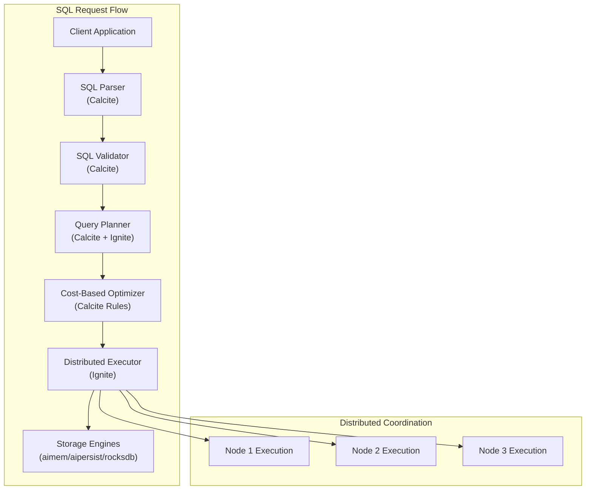

# Apache Ignite 3 SQL Engine Architecture

*Understanding Apache Calcite integration and SQL processing in Ignite 3*

## Overview

Apache Ignite 3 uses **Apache Calcite** as its SQL engine foundation, providing standards-compliant SQL processing with distributed query planning and optimization. Unlike traditional database systems where SQL is an afterthought, Ignite 3 integrates Calcite deeply into its distributed architecture to enable efficient query processing across cluster nodes.

This document explains how Calcite powers Ignite 3's SQL capabilities and the architectural decisions that enable distributed SQL processing at scale.

## Apache Calcite Integration

### What is Apache Calcite?

Apache Calcite is a framework for building databases and data management systems. It provides:

- **SQL Parser**: Converts SQL text into abstract syntax trees
- **SQL Validator**: Validates syntax and semantics against schema metadata
- **Query Planner**: Transforms queries into optimized execution plans
- **Cost-Based Optimizer**: Selects efficient execution strategies
- **Rule Engine**: Applies optimization transformations

### Calcite in Ignite 3 Architecture



## SQL Processing Pipeline

### 1. Parsing and Validation

When you execute a SQL statement, Ignite 3 uses Calcite's parser:

```java
// Your SQL statement
Statement stmt = client.sql().statementBuilder()
    .query("SELECT a.Name, COUNT(*) FROM Artist a JOIN Album al ON a.ArtistId = al.ArtistId GROUP BY a.Name")
    .build();

// Internally, Calcite processes this through:
// 1. SqlParser.parseQuery() -> SqlNode (AST)
// 2. SqlValidator.validate() -> Validated SqlNode
// 3. SqlToRelConverter.convertQuery() -> RelNode (logical plan)
```

**Calcite Components Used:**

- **SqlParser**: Converts SQL text to Abstract Syntax Tree (SqlNode)
- **SqlValidator**: Validates against Ignite's schema metadata
- **SqlToRelConverter**: Transforms to relational algebra (RelNode tree)

### 2. Logical Planning

Calcite transforms validated SQL into a logical query plan:

```text
LogicalProject(Name=[$0], EXPR$1=[$1])
  LogicalAggregate(group=[{0}], EXPR$1=[COUNT()])
    LogicalProject(Name=[$1])
      LogicalJoin(condition=[=($0, $2)], joinType=[inner])
        LogicalTableScan(table=[[Artist]])
        LogicalTableScan(table=[[Album]])
```

**Key Transformations:**

- **Predicate Pushdown**: WHERE clauses move closer to data sources
- **Projection Pushdown**: SELECT columns filtered early
- **Join Reordering**: Optimal join sequence based on statistics

### 3. Physical Planning

Ignite 3 extends Calcite with distributed-aware rules:

```text
IgniteDistributedProject(Name=[$0], EXPR$1=[$1])
  IgniteReduceAggregate(group=[{0}], EXPR$1=[COUNT($0)])
    IgniteMapAggregate(group=[{0}], EXPR$1=[COUNT()])
      IgniteColocatedJoin(condition=[=($0, $2)])
        IgniteTableScan(table=[[Artist]], partitions=[0,1,2...31])
        IgniteTableScan(table=[[Album]], partitions=[0,1,2...31])
```

**Ignite-Specific Optimizations:**

- **Colocation Detection**: Identifies when joins can execute locally
- **Partition Pruning**: Eliminates unnecessary partition scans  
- **Map-Reduce Planning**: Splits aggregations across nodes
- **Index Selection**: Chooses optimal indexes for table scans

### 4. Distributed Execution

The physical plan executes across cluster nodes:

```java
// Execution coordinates across nodes
public class DistributedQueryExecution {
    
    // Each node executes its partition of the plan
    CompletableFuture<List<Row>> executeFragment(PlanFragment fragment) {
        return fragment.getPartitions().stream()
            .map(this::scanPartition)
            .collect(toAsyncList());
    }
    
    // Results aggregate back to coordinator
    List<Row> combineResults(List<CompletableFuture<List<Row>>> futures) {
        return futures.stream()
            .map(CompletableFuture::join)
            .flatMap(List::stream)
            .collect(toList());
    }
}
```

## Query Optimization Features

### Cost-Based Optimization

Calcite's cost-based optimizer uses statistics to choose execution plans:

```java
// Ignite maintains table statistics for optimization
public class TableStatistics {
    private final long rowCount;                    // Total rows in table
    private final Map<String, ColumnStats> columns; // Per-column statistics
    private final double[] partitionSizes;          // Partition size distribution
    
    // Cost estimation for different access paths
    public double estimateSelectivity(RexNode predicate) {
        // Use column histograms and null counts
        return histogramBasedEstimate(predicate);
    }
}
```

**Statistics Used:**

- **Row Counts**: Total rows per table and partition
- **Column Statistics**: Null counts, distinct values, histograms
- **Index Statistics**: Index selectivity and size
- **Partition Distribution**: Data distribution across nodes

### Rule-Based Optimizations

Calcite applies transformation rules to improve query performance:

```java
// Key optimization rules applied by Ignite 3
List<RelOptRule> optimizationRules = List.of(
    
    // Predicate pushdown - move filters closer to data
    FilterTableScanRule.INSTANCE,
    FilterProjectTransposeRule.INSTANCE,
    FilterJoinRule.FILTER_ON_JOIN,
    
    // Projection elimination - remove unused columns
    ProjectRemoveRule.INSTANCE,
    ProjectMergeRule.INSTANCE,
    
    // Join optimization - reorder and select algorithms  
    JoinCommuteRule.INSTANCE,
    JoinAssociateRule.INSTANCE,
    
    // Aggregate optimization - push partial aggregates
    AggregateProjectMergeRule.INSTANCE,
    AggregateJoinTransposeRule.EXTENDED,
    
    // Ignite-specific rules for distribution
    IgniteColocatedJoinRule.INSTANCE,
    IgniteMapReduceRule.INSTANCE
);
```

### Distributed Query Patterns

Ignite 3 optimizes for distributed execution patterns:

**1. Colocation-Aware Joins**

```sql
-- When data is colocated by ArtistId, this executes locally
SELECT a.Name, al.Title 
FROM Artist a 
JOIN Album al ON a.ArtistId = al.ArtistId 
WHERE a.ArtistId = 123
```

**Optimization**: Calcite detects colocation and generates local join plans.

**2. Map-Reduce Aggregations**

```sql
-- Aggregation splits across nodes for parallel processing
SELECT Genre, COUNT(*), AVG(UnitPrice)
FROM Track 
GROUP BY Genre
```

**Optimization**: Partial aggregates on each node, final reduction on coordinator.

**3. Partition Pruning**

```sql
-- Only scans partitions containing the specified key
SELECT * FROM Track WHERE TrackId = 12345
```

**Optimization**: Hash-based partition elimination reduces I/O.

## SQL Standard Compliance

### Supported SQL Features

Ignite 3 with Calcite supports most of SQL:2016 standard:

**Core SQL:**
- SELECT, INSERT, UPDATE, DELETE, UPSERT
- All standard data types (INTEGER, VARCHAR, DECIMAL, DATE, TIMESTAMP, etc.)
- Standard functions (mathematical, string, date/time)
- Window functions (ROW_NUMBER, RANK, LAG, LEAD)
- Common Table Expressions (WITH clauses)

**Advanced Features:**
- Complex subqueries and correlated queries
- CASE expressions and conditional logic
- Set operations (UNION, INTERSECT, EXCEPT)
- Advanced joins (LEFT, RIGHT, FULL OUTER, CROSS)

**Example of Advanced SQL:**

```java
Statement complexQuery = client.sql().statementBuilder()
    .query("""
        WITH artist_stats AS (
            SELECT a.ArtistId, a.Name,
                   COUNT(t.TrackId) as track_count,
                   AVG(t.UnitPrice) as avg_price,
                   ROW_NUMBER() OVER (ORDER BY COUNT(t.TrackId) DESC) as rank
            FROM Artist a
            JOIN Album al ON a.ArtistId = al.ArtistId
            JOIN Track t ON al.AlbumId = t.AlbumId
            GROUP BY a.ArtistId, a.Name
        )
        SELECT Name, track_count, avg_price
        FROM artist_stats
        WHERE rank <= 10
        """)
    .build();
```

### Data Type Handling

Calcite manages type conversions and compatibility:

```java
// Automatic type promotion and conversion
public class TypeConversion {
    
    // Integer to Decimal for precision
    "SELECT UnitPrice * Quantity"  // INT * DECIMAL -> DECIMAL
    
    // String to Date parsing
    "WHERE InvoiceDate > '2023-01-01'"  // VARCHAR -> DATE
    
    // Null handling with proper three-valued logic
    "SELECT Name WHERE ArtistId IS NOT NULL"
}
```

## Metadata Management

### Schema Information

Calcite integrates with Ignite's schema registry:

```java
// Schema metadata flows from Ignite to Calcite
public class IgniteSchema implements Schema {
    
    @Override
    public Table getTable(String name) {
        // Retrieve table metadata from Ignite catalog
        TableDefinition tableDef = igniteClient.catalog().table(name);
        
        // Convert to Calcite table representation
        return new IgniteTable(tableDef);
    }
    
    @Override
    public Set<String> getTableNames() {
        // List all tables in the schema
        return igniteClient.catalog().tables();
    }
}
```

### Column Metadata Normalization

**Critical Architecture Decision**: Ignite 3 normalizes all identifiers to uppercase:

```java
// Internal metadata representation
public class ColumnMetadata {
    private final String name;           // Always uppercase: "ARTISTID"
    private final SqlTypeName type;      // Calcite type: VARCHAR, INTEGER, etc.
    private final boolean nullable;      // Null constraint
    private final Integer precision;     // For numeric types
    private final Integer scale;         // For decimal types
    
    // All lookups must use uppercase names
    public Object getValue(SqlRow row, String columnName) {
        return row.value(columnName.toUpperCase());
    }
}
```

## Performance Considerations

### Query Plan Caching

Calcite query plans are cached for reuse:

```java
// Statement objects cache parsed and planned queries
Statement cachedStatement = client.sql().statementBuilder()
    .query("SELECT * FROM Artist WHERE Name LIKE ?")
    .build();

// Reuse avoids parsing and planning overhead
for (String pattern : patterns) {
    ResultSet<SqlRow> results = client.sql().execute(null, cachedStatement, pattern);
    // Process results...
}
```

### Statistics and Cost Estimation

Accurate statistics improve optimization:

```sql
-- Ignite maintains statistics automatically
ANALYZE TABLE Artist;
ANALYZE TABLE Album;  
ANALYZE TABLE Track;

-- Statistics include:
-- - Row counts per table and partition
-- - Column value distributions and histograms  
-- - Index selectivity measurements
-- - Partition size distributions
```

### Join Algorithm Selection

Calcite chooses optimal join algorithms based on data size and distribution:

**Hash Joins**: For moderate-sized tables with good hash distribution
**Nested Loop Joins**: For small tables or when indexes are available
**Merge Joins**: For sorted inputs or range predicates

## Troubleshooting SQL Issues

### Query Plan Analysis

Use EXPLAIN to understand Calcite's decisions:

```java
Statement explainStmt = client.sql().statementBuilder()
    .query("EXPLAIN PLAN FOR SELECT a.Name, COUNT(*) FROM Artist a JOIN Album al ON a.ArtistId = al.ArtistId GROUP BY a.Name")
    .build();

ResultSet<SqlRow> plan = client.sql().execute(null, explainStmt);
// Examine the physical execution plan
```

### Common Optimization Issues

**Problem**: Slow joins across non-colocated tables
**Solution**: Redesign schema for colocation or use broadcast joins for small tables

**Problem**: Inefficient aggregations
**Solution**: Ensure proper partitioning and consider pre-aggregation strategies

**Problem**: Full table scans instead of index usage
**Solution**: Update table statistics and verify index definitions

## Integration with Distributed Systems

### Fault Tolerance

Calcite query execution integrates with Ignite's fault tolerance:

```java
// Query execution handles node failures gracefully
public class FaultTolerantExecution {
    
    public CompletableFuture<ResultSet> executeQuery(Statement stmt) {
        return executeWithRetry(stmt)
            .handle((result, throwable) -> {
                if (throwable instanceof NodeFailureException) {
                    // Retry on different node
                    return executeOnBackupNode(stmt);
                }
                return result;
            });
    }
}
```

### Consistency Guarantees

SQL operations respect Ignite's MVCC transaction model:

- **Read Operations**: See consistent snapshots as of transaction start time
- **Write Operations**: Use distributed locking for consistency
- **DDL Operations**: Coordinate schema changes across all nodes

## Future Enhancements

### Streaming SQL

Ignite 3 plans to extend Calcite for streaming queries:

```sql
-- Future capability: continuous queries over streaming data
SELECT STREAM artistId, COUNT(*) 
FROM Track_Stream
GROUP BY artistId
WINDOW TUMBLING (INTERVAL '1' MINUTE)
```

### Advanced Analytics

Enhanced Calcite integration for analytical workloads:

- **Vectorized Execution**: Batch processing for analytical queries
- **Columnar Storage**: Integration with columnar storage engines
- **Advanced Functions**: Machine learning and statistical functions

## Summary

Apache Calcite provides the SQL foundation that makes Ignite 3 a powerful distributed database:

- **Standards Compliance**: Full SQL support with proper semantics
- **Cost-Based Optimization**: Intelligent query planning using statistics
- **Distributed Awareness**: Optimization rules that understand data distribution
- **Extensibility**: Plugin architecture for custom optimizations

Understanding this architecture helps you:

- Write efficient SQL queries that leverage distribution
- Troubleshoot performance issues with query plans
- Design schemas that work well with the optimizer
- Make informed decisions about data modeling and partitioning

The deep integration between Calcite and Ignite's distributed storage enables SQL processing that scales horizontally while maintaining ACID properties and consistent performance.