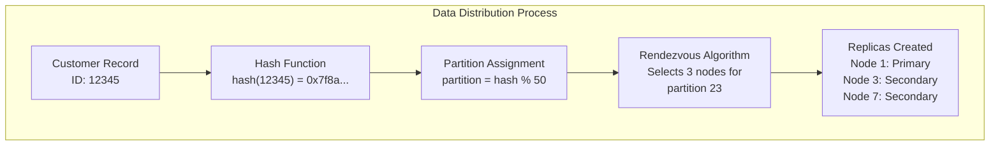
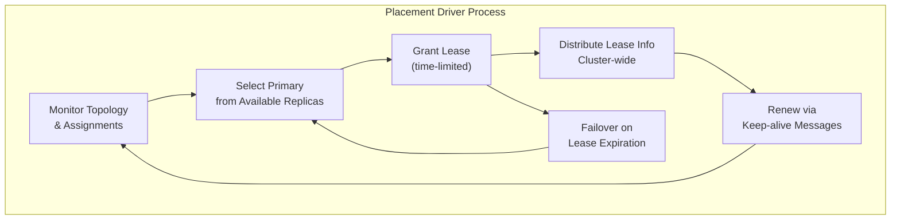

<!--
Licensed under Creative Commons Attribution-NonCommercial-ShareAlike 4.0 International (CC BY-NC-SA 4.0)
SPDX-License-Identifier: CC-BY-NC-SA-4.0
For full license text, see LICENSE-CC-BY-NC-SA-4.0
-->

# Apache Ignite 3 Storage System Architecture

*Understanding the distributed storage foundation that powers Apache Ignite 3*

## Overview

Apache Ignite 3's storage system is the foundation that enables distributed data management at scale. Unlike traditional databases that treat distribution as an afterthought, Ignite 3 was designed from the ground up as a distributed-first system. Understanding how data is partitioned, replicated, and stored across cluster nodes is crucial for building applications that leverage Ignite's capabilities.

This document explains the four core components that work together to provide distributed storage:

- **Distribution Zones** - Logical groupings that control data placement policies
- **Data Partitioning** - How data is divided and distributed across cluster nodes  
- **Storage Profiles** - Configuration templates that link tables to storage engines
- **Storage Engines** - The physical storage implementations that persist data

## Distribution Zones: Data Placement Control

Distribution zones are the primary mechanism for controlling how your data is distributed across the cluster. Think of them as templates that define data placement policies.

### Zone Configuration

Every distribution zone defines:

```java
// Core zone parameters
private final int partitions;           // How many pieces to split data into
private final int replicas;             // How many copies of each piece
private final int quorumSize;           // Minimum replicas for operations
private final String filter;            // Which nodes can store data
private final ConsistencyMode mode;     // Consistency guarantees
```

### Default Zone

Ignite 3 automatically creates a "default" zone when the cluster starts:

```sql
-- Equivalent to the automatic default zone
CREATE ZONE "default" WITH 
    PARTITIONS=25,
    REPLICAS=1,
    DATA_NODES_FILTER=null  -- Uses all available nodes
```

### Custom Zones for Production

Production applications typically need custom zones for fault tolerance:

```sql
-- Production zone with fault tolerance
CREATE ZONE "MusicStore" WITH 
    PARTITIONS=50,           -- More partitions for larger datasets
    REPLICAS=3,              -- 3 copies for fault tolerance
    DATA_NODES_FILTER='$.storage == "SSD"',  -- Only SSD nodes
    DATA_NODES_AUTO_ADJUST_SCALE_UP=100,     -- Scale up timeout (seconds)
    DATA_NODES_AUTO_ADJUST_SCALE_DOWN=300    -- Scale down timeout (seconds)
```

### Zone Hierarchy and Table Assignment

Tables belong to exactly one distribution zone:

```java
@Table(zone = @Zone(value = "MusicStore", storageProfiles = "rocksProfile"))
public class Artist {
    @Id Integer artistId;
    @Column String name;
}
```

The zone determines:

- How many pieces the Artist table is split into (partitions)
- How many copies of each piece exist (replicas)  
- Which cluster nodes can store Artist data (filter)
- What storage engines can be used (storage profiles)

## Data Partitioning: The Distribution Algorithm

Ignite 3 uses the **Rendezvous (Highest Random Weight) algorithm** to determine which nodes store which data. This algorithm provides consistent partition assignment that doesn't require coordination between nodes.

### How Partitioning Works



### Partition Assignment Algorithm

For each partition, the algorithm:

1. **Calculates weights** for all eligible nodes using: `hash(nodeId + partitionId)`
2. **Ranks nodes** by their calculated weights  
3. **Selects top N nodes** where N = replica count
4. **Excludes neighbors** (optional) to avoid same-host replicas

```java
// Simplified algorithm concept
public List<Node> assignPartition(int partitionId, List<Node> availableNodes, int replicas) {
    return availableNodes.stream()
        .sorted((n1, n2) -> compareWeights(n1, n2, partitionId))
        .limit(replicas)
        .collect(toList());
}

private long calculateWeight(Node node, int partitionId) {
    return hash(node.id() + partitionId);  // Consistent hash
}
```

### Partition Limits and Sizing

- **Maximum partitions**: 65,000 per zone
- **Recommended sizing**: `dataNodes * coresPerNode * 2 / replicas`
- **Minimum replicas**: 1 (no fault tolerance)
- **Maximum replicas**: Limited by available nodes

### Rebalancing Process

When cluster topology changes, Ignite automatically rebalances data:

1. **Trigger Detection**: Node joins/leaves, zone configuration changes
2. **Assignment Calculation**: Rendezvous algorithm calculates new assignments
3. **Replica Coordination**: Wait for all needed replicas to be ready
4. **Data Transfer**: Primary replica coordinates data movement to new nodes
5. **State Update**: Update stable assignments in cluster metadata
6. **Cleanup**: Stop redundant replicas and notify clients

## Storage Profiles: Engine Configuration Templates

Storage profiles act as configuration templates that link tables to storage engines. They define how data is physically stored on each node.

### Profile Structure

```java
@PolymorphicConfig
public class StorageProfileConfiguration {
    @PolymorphicId
    public String engine;          // Storage engine name (aimem, aipersist, rocksdb)
    
    @InjectedName  
    public String name;            // Profile name for reference
    
    // Engine-specific configuration parameters
}
```

### Creating Storage Profiles

Storage profiles are configured at the node level:

```bash
# Create a persistent storage profile
ignite node config update "ignite.storage.profiles: {
    persistentProfile: {
        engine: aipersist,
        size: 10000000000        # 10GB cache
    }
}"
```

### Profile Usage in Tables

Tables reference storage profiles through their distribution zone:

```java
// Zone specifies which storage profiles are allowed
@Table(zone = @Zone(value = "MusicStore", storageProfiles = "persistentProfile"))
public class Track {
    @Id Integer trackId;
    @Column String name;
    @Column Integer duration;
}
```

### Storage Profile Hierarchy

```text
Node Configuration
├── Storage Profiles (per node)
│   ├── Profile Name → Storage Engine + Configuration
│   └── Profile Name → Storage Engine + Configuration
│
Distribution Zone
├── Allowed Storage Profiles (subset of node profiles)
│
Table
└── Uses Zone's Storage Profiles
```

## Storage Engines: Physical Data Storage

Ignite 3 ships with three storage engines, each optimized for different use cases. The **aimem** engine is used by default when no specific storage profile is configured.

### AI Memory (aimem) - Default Engine

**Best for**: General purpose workloads, getting started, development and testing

```java
public static final String ENGINE_NAME = "aimem";
```

**Architecture**:

- **In-Memory Storage**: All data stored in RAM for maximum performance
- **Default Choice**: Automatically used when no storage profile is specified
- **No Persistence**: Data is lost when nodes restart
- **Lightweight**: Minimal configuration required

**Configuration**:

```bash
# aimem is the default, but can be explicitly configured
ignite node config update "ignite.storage.profiles: {
    defaultMem: {
        engine: aimem
    }
}"
```

**Performance Characteristics**:

- **Write Performance**: Excellent (no disk I/O overhead)
- **Read Performance**: Excellent (all data in memory)
- **Memory Usage**: Uses available RAM efficiently
- **Startup Time**: Fast (no data recovery needed)
- **Persistence**: None (data lost on restart)

### AI Persistent (aipersist) - Production Engine

**Best for**: Production workloads requiring data durability and fault tolerance

```java
public static final String ENGINE_NAME = "aipersist";
```

**Architecture**:

- **Persistent Storage**: Data survives node restarts and failures
- **Hybrid Memory/Disk**: Hot data in memory, cold data on disk
- **Write-Ahead Log**: Ensures data durability and crash recovery
- **B+ Tree Structure**: Optimized for both reads and writes

**Configuration**:

```bash
ignite node config update "ignite.storage.profiles: {
    production: {
        engine: aipersist,
        size: 8589934592    # 8GB memory cache
    }
}"
```

**Performance Characteristics**:

- **Write Performance**: Good (optimized for mixed workloads)
- **Read Performance**: Excellent (frequently accessed data cached in memory)
- **Memory Usage**: Configurable cache size for hot data
- **Startup Time**: Medium (may need to recover data from disk)
- **Persistence**: Full durability with WAL

### RocksDB - Experimental Engine

**Best for**: Experimental use cases, high-throughput write workloads, advanced users

```java
public static final String ENGINE_NAME = "rocksdb";
```

**Architecture**:

- **LSM Tree Structure**: Log-Structured Merge trees for write-heavy workloads
- **External Dependency**: Uses the RocksDB embedded database
- **Advanced Configuration**: Many tuning options for specific use cases
- **Experimental Status**: Not recommended for production use

**Configuration**:

```bash
ignite node config update "ignite.storage.profiles: {
    experimental: {
        engine: rocksdb,
        size: 4294967296,          # 4GB cache
        writeBufferSize: 134217728  # 128MB write buffer
    }
}"
```

**Performance Characteristics**:

- **Write Performance**: Excellent (LSM tree optimized for writes)
- **Read Performance**: Good (requires sufficient cache)
- **Memory Usage**: Configurable off-heap cache
- **Startup Time**: Fast (LSM tree structure)
- **Persistence**: Full durability with compaction

### Storage Engine Selection Guide

| Use Case | Recommended Engine | Reasoning |
|----------|-------------------|-----------|
| Development/testing | aimem (default) | Fast startup, no persistence overhead |
| Production applications | aipersist | Data durability with good performance |
| Caching layer | aimem | Maximum performance for temporary data |
| Write-heavy workloads | aipersist | Balanced performance for mixed operations |
| Experimental projects | rocksdb | Advanced features for specific use cases |
| Getting started | aimem (default) | Zero configuration required |

## Advanced Storage Concepts

### Multi-Version Concurrency Control (MVCC)

Ignite 3 uses MVCC to handle concurrent access to data:

```java
// Each record has multiple versions with timestamps
public class VersionedRecord {
    private final Object key;
    private final Object value;
    private final long timestamp;      // Version identifier
    private final boolean committed;   // Transaction state
}
```

**Version Chain Management**:

- **Read Operations**: See committed versions as of their transaction timestamp
- **Write Operations**: Create new versions without blocking readers
- **Garbage Collection**: Configurable low watermark removes old versions

### Placement Driver and Primary Replica Election

The **Placement Driver** ensures exactly one primary replica per partition:



**Lease Management**:

- **Lease Duration**: Configurable time-limited grants
- **Keep-alive**: Primary replicas send heartbeats
- **Failover**: Automatic reassignment when leases expire
- **Split-brain Prevention**: Only one valid primary per partition

### Storage Organization on Disk

Physical storage layout on each node:

```
work/
├── partitions/                 # Partition data
│   ├── zone_id_partition_id/   # Per-partition directories
│   │   ├── rocksdb/           # RocksDB files (if using RocksDB)
│   │   └── pagemem/           # Page memory files (if using PageMem)
├── raft-log/                  # RAFT consensus logs
├── metastorage/               # Cluster metadata
└── walArchive/                # Write-ahead log archives
```

### Node-local Storage Management

Each node manages its own storage independently:

```java
// Storage engine lifecycle per node
public interface StorageEngine {
    void start();                          // Initialize storage
    MvTableStorage createMvTable(config);  // Create table storage
    void stop();                           // Cleanup resources
}
```

**Resource Management**:

- **Memory Pools**: Shared across tables using the same engine
- **File Descriptors**: Managed per storage engine instance
- **Background Tasks**: Compaction, garbage collection, checkpointing

## Troubleshooting Storage Issues

### Common Configuration Problems

**Insufficient Replicas**:

```sql
-- Problem: Single replica provides no fault tolerance
CREATE ZONE "Production" WITH REPLICAS=1;

-- Solution: Use multiple replicas for production
CREATE ZONE "Production" WITH REPLICAS=3;
```

**Too Many Partitions**:

```sql
-- Problem: Too many small partitions create overhead
CREATE ZONE "SmallData" WITH PARTITIONS=1000;

-- Solution: Use appropriate partition count
CREATE ZONE "SmallData" WITH PARTITIONS=25;
```

### Monitoring Storage Health

**Partition State**:

```bash
# Check partition assignments and health
ignite cluster partition states --zone-name MusicStore
```

**Storage Metrics**:

```bash
# Monitor storage engine performance
ignite node metric list --filter storage
```

### Performance Tuning Guidelines

**AI Persistent (aipersist) Tuning**:

- **Cache Size**: Set to 20-50% of available RAM for hot data
- **WAL Settings**: Balance between durability and performance
- **Memory Allocation**: Size based on working set requirements

**RocksDB Tuning** (experimental):

- **Cache Size**: Set to 20-50% of available RAM
- **Write Buffer**: Increase for write-heavy workloads
- **Compaction**: Monitor background compaction impact

**AI Memory (aimem) Tuning**:

- **Memory Allocation**: Ensure sufficient RAM for entire dataset
- **GC Tuning**: Optimize JVM garbage collection for large heaps

## Integration with Application Development

### Storage-Aware Schema Design

Design tables with storage characteristics in mind:

```java
// Large persistent tables use aipersist for durability
@Table(zone = @Zone(value = "AnalyticsZone", storageProfiles = "persistentProfile"))
public class EventLog {
    @Id Long eventId;
    @Column String eventData;  // Historical data needs persistence
}

// Frequently accessed temporary data uses default aimem
@Table(zone = @Zone(value = "CacheZone", storageProfiles = "default"))
public class UserSession {
    @Id String sessionId;
    @Column Long lastAccess;  // Session data can be rebuilt
}
```

### Storage Profile Management

Best practices for storage profile lifecycle:

1. **Development**: Use default aimem for fast iteration
2. **Testing**: Use aipersist profiles matching production persistence needs  
3. **Production**: Use tuned aipersist profiles based on workload characteristics
4. **Migration**: Plan storage profile changes during maintenance windows

## Final Thoughts

Apache Ignite 3's storage system provides a flexible foundation for distributed data management through:

- **Distribution Zones** that define data placement policies
- **Rendezvous Partitioning** that consistently distributes data across nodes
- **Storage Profiles** that configure how data is physically stored
- **Three Storage Engines** optimized for different workload patterns:
  - **aimem** (default) - for development and high-performance temporary data
  - **aipersist** - for production workloads requiring durability
  - **rocksdb** (experimental) - for advanced use cases

Understanding these components enables you to:

- Design schemas that leverage data locality
- Choose appropriate storage engines for different tables
- Configure zones for fault tolerance and performance
- Troubleshoot storage-related issues in production

The storage system's flexibility allows applications to start simple with the default aimem engine and evolve to sophisticated multi-zone architectures with persistent storage as requirements grow.
