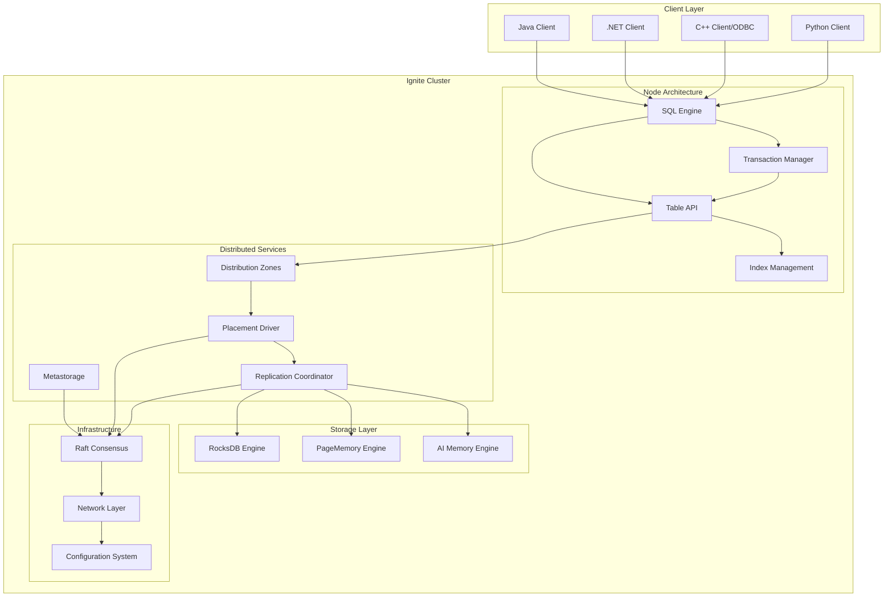
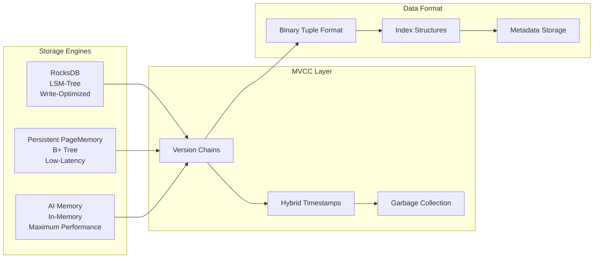
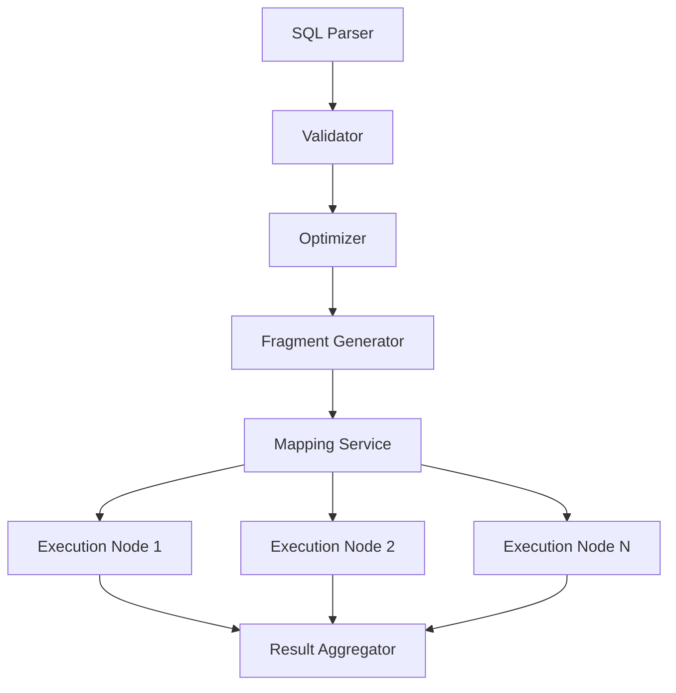

# Apache Ignite 3 Technical Features

## Feature matrix and capability overview

Apache Ignite 3 implements a distributed database platform for high-performance computing applications. The system provides modular architecture with pluggable storage engines, distributed SQL processing, and multi-platform client support.

> **Architecture Context**: For system architecture details, see [Ignite 3 Architecture](./ignite3-arch.md). For Java API specifics, see [Java API Architecture](./java-api-arch.md). For SQL implementation details, see [SQL Engine Architecture](./sql-engine-arch.md).

## Architecture Overview

Apache Ignite 3 implements distributed database architecture using consensus-driven coordination, pluggable storage engines, and SQL processing capabilities.



## Core Features

### Distributed SQL Engine

Apache Ignite 3 provides SQL capabilities through Apache Calcite integration with distributed query processing.

**Query Processing Architecture**
- Three-phase execution model: preparation, initialization, execution
- Configurable thread pools for planning and execution (default: 4 threads each)
- Cost-based optimization with transformation rules
- Distributed fragment execution with partition awareness

**SQL Standard Compliance**
- DDL operations: CREATE/DROP/ALTER for tables, indexes, schemas
- DML operations: SELECT, INSERT, UPDATE, DELETE, MERGE with complex predicates
- Advanced features: CTEs, JSON operations (window functions not supported)
- Transaction control: START TRANSACTION, COMMIT, ROLLBACK

**Performance Optimization**
- Query plan caching with parsed result caching
- Partition pruning for selective data access
- Colocation optimization for co-located joins
- Expression compilation for runtime optimization

### Storage Engine Architecture

The platform provides multiple storage engines optimized for different performance characteristics and durability requirements.



**Multi-Version Concurrency Control (MVCC)**
- Hybrid timestamp ordering for distributed consistency
- Version chain management with newest-to-oldest ordering
- Write intent storage during transaction processing
- Automatic garbage collection below low watermark

**Storage Engine Selection**
- RocksDB: Write-heavy workloads, large datasets, sequential access patterns
- Persistent PageMemory: Low-latency requirements, complex queries, OLTP workloads
- AI Memory: Caching use cases, temporary processing, maximum performance

**Data Organization**
- Binary Tuple format with O(1) field access via offset tables
- Schema-driven layout for minimal overhead
- Support for variable-length fields and null optimization
- Cross-platform serialization compatibility

### Distributed System Components

The platform implements sophisticated distributed coordination mechanisms for high availability and consistency.

**Consensus and Coordination**
- JRaft-based consensus implementation with multi-group support
- Metastorage for cluster metadata with 3-5 node voting groups
- Watch-based notification system for distributed coordination
- Revision-based versioning for consistent event ordering

**Replica Management**
- Placement Driver with centralized lease management for primary replica selection
- Clock-skew tolerant lease renewal protocol
- Three-phase rebalancing: pending → execution → stable transitions
- Automated failover with sub-second leader election

**Network Architecture**
- ScaleCube cluster membership with gossip protocol
- Netty-based transport with multiple specialized channel types
- Partition-aware routing for optimal data locality
- Message batching and connection pooling for performance

### Transaction Processing

The system provides ACID transactions with strong consistency guarantees across distributed partitions.

**Transaction Protocol**
- Two-Phase Locking (2PL) with deadlock prevention
- Atomic commitment via two-phase protocol
- Lease-based primary replica coordination
- Repeatable read isolation level by default

**Consistency Model**
- Strong consistency for transactional operations
- Linearizable reads from primary replicas
- Eventually consistent replication to followers
- MVCC support for non-blocking reads

### Multi-Platform Client Support

Apache Ignite 3 provides native client libraries across multiple programming languages and platforms.

**Java Client**
- Full API coverage: SQL, NoSQL, Transactions, Compute
- Partition awareness with intelligent request routing
- Connection multiplexing with automatic failover
- Asynchronous programming model with CompletableFuture

**.NET Client**
- Complete feature parity with Java client
- Built-in LINQ provider for strongly-typed SQL queries
- NodaTime integration for precise date/time mapping
- High-performance asynchronous operations

**C++ Client and ODBC Driver**
- Native C++17 implementation
- ODBC driver for database connectivity standards
- CMake-based build system with cross-platform support
- SSL/TLS encryption and authentication

**Python Client**
- DB-API 2.0 compliant interface
- C++ extension module for performance
- Support for Python 3.9-3.13
- Cross-platform wheel distribution

### Configuration and Management

The platform provides hierarchical configuration management with runtime updates and operational monitoring.

**Configuration System**
- HOCON format with hierarchical organization
- Runtime configuration updates without restart
- Node, cluster, and component-level settings
- Annotation-based validation and type safety

**Operational Features**
- Metrics integration via Micrometer
- System views for real-time monitoring
- Comprehensive logging and debugging capabilities
- Disaster recovery with cluster reset and repair

## Performance Characteristics

### Scalability

**Horizontal Scaling**
- Linear scale-out through automatic partitioning
- Elastic rebalancing with minimal disruption
- Resource isolation via dedicated thread pools
- Connection multiplexing for efficient resource utilization

**Concurrency**
- Lock-free algorithms in critical execution paths
- Batch processing via disruptor-based event handling
- Multi-threaded query processing on each node
- Pipeline execution model with minimal memory footprint

### Optimization Features

**Query Optimization**
- Cost-based optimization with distributed statistics
- Adaptive plan caching with runtime adjustments
- Expression compilation for improved execution performance
- Network optimization with minimized inter-node communication

**Storage Optimization**
- Configurable page replacement algorithms
- Checkpoint management with throttling mechanisms
- Compression support in RocksDB engine
- Off-heap memory management with minimal GC pressure

## Deployment and Operations

### Minimum Production Requirements

**Cluster Configuration**
- 3-5 nodes for metastorage voting group
- Odd number of replicas per partition (typically 3)
- Separate network channels for different traffic types
- Persistent storage with appropriate performance characteristics

**High Availability Setup**
- Multi-datacenter deployment with zone-aware placement
- Network redundancy with multiple communication pathways
- Storage redundancy with configurable replication factors
- Monitoring and alerting for proactive issue detection

### Integration Capabilities

**Enterprise Integration**
- JDBC/ODBC connectivity for existing applications
- REST API for language-agnostic access
- Spring Boot integration with auto-configuration
- Docker containerization support

**Development Tools**
- Command-line interface for cluster management
- Code deployment capabilities for compute jobs
- Schema migration and evolution support
- Comprehensive documentation and examples

## Use Case Suitability

### OLTP Applications
- Low-latency transactional processing
- High concurrency with ACID guarantees
- Horizontal scalability for growing workloads
- Multi-platform client library support

### Analytical Workloads
- Distributed SQL with complex query support
- In-memory processing for fast analytics
- Integration with existing BI tools via JDBC/ODBC
- Concurrent analytical and transactional processing

### Caching and Session Storage
- High-performance in-memory storage
- Automatic expiration and eviction policies
- Distributed caching across multiple nodes
- Integration with application frameworks

### Real-time Processing
- Stream processing capabilities
- Event-driven architecture support
- Low-latency data ingestion and processing
- Integration with messaging systems

## Database and SQL Features

### SQL DDL Capabilities and Schema Management

Apache Ignite 3 provides enterprise-grade DDL operations with distributed schema management and advanced table configuration options.

**Table Management Operations**
- CREATE TABLE with Ignite-specific extensions for distribution and storage
- ALTER TABLE operations: ADD COLUMN, DROP COLUMN, column modifications
- DROP TABLE with cascade and constraint handling
- IF NOT EXISTS and IF EXISTS clause support for safe operations

**Advanced Table Creation Features**
```sql
CREATE TABLE orders (
    id BIGINT PRIMARY KEY,
    customer_id INT NOT NULL,
    order_date DATE,
    total DECIMAL(10,2)
) COLOCATE BY (customer_id)
  ZONE sales_zone
  STORAGE PROFILE high_performance;
```

**Distribution Zone Management**
- Zone-based data distribution for optimal locality
- Configurable partition counts and replica factors
- Cross-datacenter replication strategies
- Storage profile assignment for performance optimization

**Schema and Namespace Support**
- Multi-schema database organization
- Schema-qualified object references
- Hierarchical metadata management via catalog system
- Cross-schema query capabilities

**Index Management**
- Hash indexes for equality predicates
- Sorted indexes for range queries and ordering
- Composite indexes with multiple columns
- Automatic index maintenance during DML operations

### Data Type System and Type Support

Apache Ignite 3 implements a rich type system with SQL standard compliance and cross-platform compatibility.

**Numeric Types**
- TINYINT (8-bit signed integer)
- SMALLINT (16-bit signed integer)
- INTEGER/INT (32-bit signed integer)
- BIGINT (64-bit signed integer)
- REAL/FLOAT (32-bit floating point)
- DOUBLE (64-bit floating point)
- DECIMAL with configurable precision and scale

**String and Character Types**
- VARCHAR with configurable length
- CHAR with fixed length
- Unicode support with UTF-8 encoding
- Variable-length optimization for storage efficiency

**Temporal Types**
- DATE (timezone-free date values)
- TIME with microsecond precision
- TIMESTAMP (timezone-free datetime)
- TIMESTAMP WITH LOCAL TIME ZONE (point-in-time values)

**Specialized Types**
- UUID (128-bit universally unique identifiers)
- VARBINARY for binary data storage
- BOOLEAN for true/false values
- PERIOD and DURATION for interval calculations

**Type System Features**
- Automatic type coercion following SQL standards
- NULL handling with nullable/non-nullable constraints
- Cross-platform type mapping for multi-language clients
- Schema evolution support with backward compatibility

### DML Operations and Query Capabilities

Apache Ignite 3 supports the full spectrum of SQL DML operations with advanced query processing capabilities.

**SELECT Statement Features**
- Complex predicate support with subqueries
- Multiple join types: INNER, LEFT, RIGHT, FULL OUTER, CROSS
- Correlated and non-correlated subqueries
- EXISTS and IN predicate optimization
- DISTINCT and ALL qualifiers

**Aggregate and Analytical Functions**
- Standard aggregates: COUNT, SUM, AVG, MIN, MAX
- Window functions with OVER clauses
- Analytical functions: ROW_NUMBER, RANK, DENSE_RANK
- Custom aggregate function support

**Set Operations**
- UNION and UNION ALL for result combination
- INTERSECT for common result identification
- EXCEPT/MINUS for result difference calculations
- Optimized execution for large result sets

**Advanced Query Features**
- Common Table Expressions (CTEs) including recursive CTEs
- Complex ORDER BY with multiple columns and directions
- LIMIT and OFFSET for result pagination
- Case expressions and conditional logic

**Data Modification Operations**
```sql
-- INSERT with various forms
INSERT INTO table VALUES (...);
INSERT INTO table SELECT ...;

-- UPDATE with complex predicates
UPDATE table SET col = value WHERE condition;

-- DELETE with subqueries
DELETE FROM table WHERE id IN (SELECT ...);

-- MERGE/UPSERT operations
MERGE INTO target USING source ON condition
  WHEN MATCHED THEN UPDATE SET ...
  WHEN NOT MATCHED THEN INSERT ...;
```

### Transaction Semantics and Isolation

Apache Ignite 3 provides ACID transaction guarantees with configurable isolation levels and distributed consistency.

**Transaction Isolation Levels**
- REPEATABLE READ (default): Prevents dirty reads and non-repeatable reads
- Strong consistency across distributed partitions
- MVCC implementation for non-blocking reads
- Snapshot isolation for analytical queries

**Transaction Management**
- Explicit transaction control: START TRANSACTION, COMMIT, ROLLBACK
- Implicit transactions for single statements
- Configurable transaction timeouts
- Deadlock detection and resolution

**Consistency Guarantees**
- ACID compliance across distributed operations
- Two-phase commit protocol for atomicity
- Linearizable reads from primary replicas
- Causal consistency for read operations

**Concurrency Control**
- Multi-version concurrency control (MVCC)
- Optimistic concurrency with conflict detection
- Write intent buffering during transaction processing
- Automatic garbage collection of old versions

### Query Optimization and Execution

Apache Ignite 3 employs sophisticated query optimization techniques for distributed query processing.

**Cost-Based Optimization**
- Apache Calcite integration with 25+ optimization rules
- Statistics-based cost estimation
- Join order optimization with dynamic programming
- Index selection based on selectivity estimates

**Distributed Query Processing**


**Execution Optimizations**
- Partition pruning for selective data access
- Predicate pushdown to storage layer
- Join algorithm selection: hash, merge, nested loop
- Pipeline execution with streaming operators

**Index Utilization**
- Automatic index selection for range queries
- Composite index usage for multi-column predicates
- Index-only scans when possible
- Covering index optimization

### JDBC and ODBC Compliance

Apache Ignite 3 provides standard database connectivity through JDBC and ODBC interfaces.

**JDBC Driver Features**
- JDBC 4.2 specification compliance
- Connection pooling and statement caching
- Prepared statement parameter binding
- ResultSet streaming for large queries
- Batch operation support

**ODBC Driver Capabilities**
- Cross-platform ODBC 3.8 support
- Integration with business intelligence tools
- Standard SQL type mapping
- Connection string configuration
- Performance monitoring hooks

**Standards Compliance**
- SQL-92 core feature compliance
- SQL:1999 features: CTEs
- SQL:2003 features: JSON support
- Window functions and analytical functions not supported

**Integration Features**
- Apache Spark connector for big data processing
- Hibernate ORM integration
- Spring Data support
- Connection pooling with HikariCP

## Final Thoughts

Apache Ignite 3 provides a distributed database platform that combines in-memory performance with enterprise reliability requirements. The modular architecture, feature set, and operational capabilities support diverse use cases from transactional applications to analytics platforms.

Key capabilities include pluggable storage engines, SQL support through Apache Calcite, multi-platform client ecosystem, and operational features for production environments. The system scales horizontally while maintaining consistency guarantees for distributed applications requiring performance and reliability.
