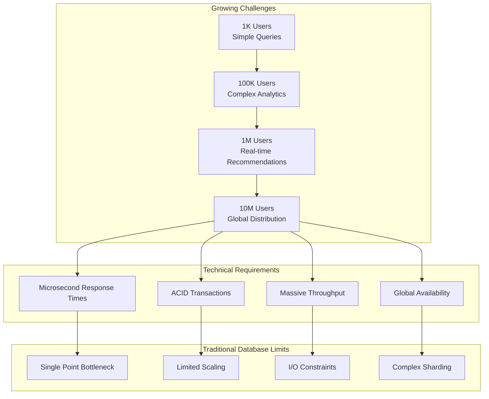
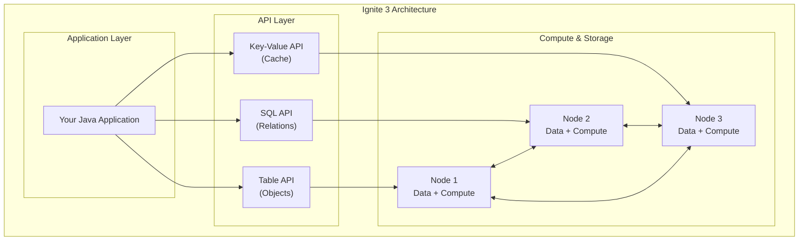
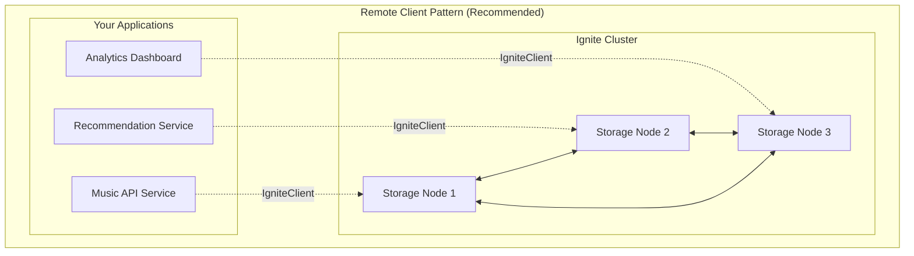
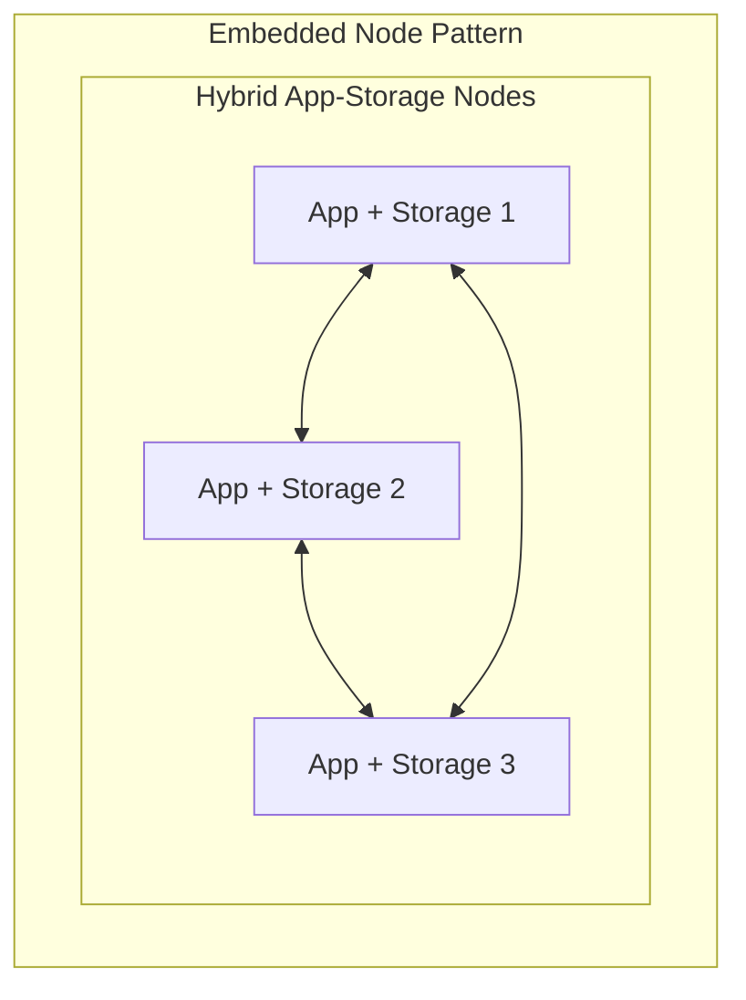
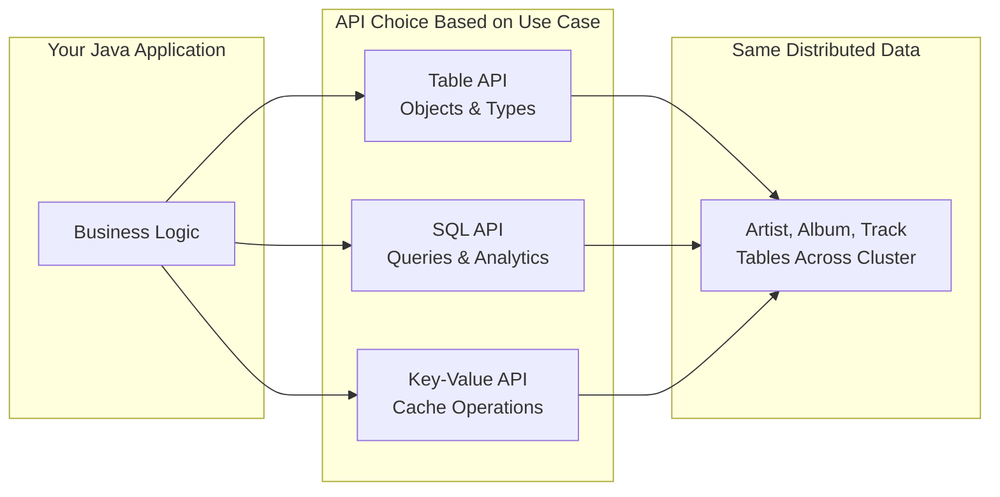
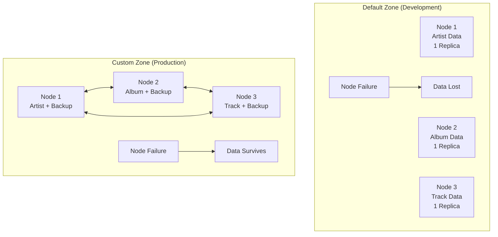

# Chapter 1.1: Introduction and Architecture Overview

## Learning Objectives

By completing this chapter, you will:

- Understand Apache Ignite 3's distributed computing capabilities and core use cases
- Distinguish between connection strategies and their appropriate applications
- Recognize when to use default zones versus custom zones for different scenarios
- Understand the Java API architecture and multi-modal access patterns
- Make informed decisions about deployment patterns for development and production

## The Challenge: Building at Scale

Picture this: you're building a music streaming platform. It starts simple - a few thousand users, basic catalog browsing, simple searches. But success brings complexity:



Your application now needs to:

- **Store catalogs**: 50M+ tracks across multiple regions, accessible in milliseconds
- **Process purchases**: Handle 10K concurrent transactions with full ACID guarantees  
- **Generate recommendations**: Analyze patterns across petabytes of listening data in real-time
- **Ingest events**: Process millions of play events per hour without dropping data
- **Scale operations**: Handle traffic spikes during album releases and viral content

Traditional databases hit walls. You need a distributed computing platform built for these demands.

## Apache Ignite 3: Your Distributed Solution

Apache Ignite 3 solves these scaling challenges through a unified distributed platform:



### What This Means for Your Code

Instead of managing database connections, cache layers, and compute frameworks separately:

```java
// Traditional approach - multiple systems to manage
Database db = connectToDatabase();
Cache cache = connectToCache(); 
ComputeCluster compute = connectToCompute();

// Ignite 3 - unified platform
IgniteClient ignite = IgniteClient.builder()
    .addresses("node1:10800", "node2:10800", "node3:10800")
    .build();

// All capabilities through one connection
Table<Artist> artists = ignite.tables().table("Artist").recordView(Artist.class);
SqlStatement analytics = ignite.sql().statementBuilder().query("SELECT...");
JobExecution<String> recommendation = ignite.compute().submit(nodes, job, args);
```

### Five Core Capabilities

- **In-Memory Data Grid**: Your data lives in RAM across nodes - microsecond access with optional persistence
- **Distributed SQL Engine**: Standard SQL that spans the entire cluster automatically
- **NoSQL Key-Value Store**: Type-safe object APIs for when you know exactly what you want
- **Compute Engine**: Run your business logic where the data lives - no network penalties
- **Streaming Engine**: Handle millions of events per second with automatic backpressure

### Evolution from Ignite 2

If you have worked with version 2 of Ignite in the past, Ignite 3 represents a redesign focused on developer experience and operational management:

- **Cleaner Architecture**: Simplified codebase with clear separation between storage, compute, and API layers
- **Schema Management**: Annotation-driven table creation reduces configuration complexity
- **Transaction Semantics**: Consistency guarantees with programming models
- **Modern Java Integration**: Built-in support for CompletableFuture, type safety, and contemporary frameworks

## Connection Strategy: Client vs Embedded

You have two ways to connect your application to an Ignite 3 cluster. Choose based on your deployment needs:





### Remote Client Pattern (Start Here)

Your applications connect to the cluster but stay separate from it:

```java
// Clean separation - app and storage independent
IgniteClient client = IgniteClient.builder()
    .addresses("storage1:10800", "storage2:10800", "storage3:10800")
    .build();
```

**Perfect for:**
- Microservices (each service connects independently)
- Containers and Kubernetes deployments
- Development and testing
- When you want to scale apps and storage separately

**Why it works:**
- Deploy new app versions without touching storage
- Scale applications based on traffic, storage based on data
- Simple operational model

### Embedded Node Pattern

Your application becomes part of the storage cluster:

```java
// App and storage lifecycle are joined
IgniteServer server = IgniteServer.start("myApp", configPath, workDir);
```

**Use when:**
- Data locality is critical (compute runs where data lives)
- Legacy systems that can't be easily separated
- Single-deployment scenarios

**Trade-offs:**
- App restarts affect cluster membership
- More complex deployment coordination
- Higher memory requirements

### Unified Programming Model

Both connection strategies implement the same Ignite interface, enabling consistent programming patterns regardless of deployment choice. This means you can develop with one pattern and deploy with another based on operational requirements.

## Java API: Three Ways to Access Your Data

Ignite 3 gives you three APIs to work with the same distributed data. Pick the right tool for each job:



### When to Use Each API

```java
// Table API - when you know the structure and want type safety
Artist artist = artists.get(null, artistKey);
artist.setName("Updated Name");
artists.upsert(null, artist);

// SQL API - when you need complex queries or analytics
var topTracks = client.sql().execute(null,
    "SELECT t.Name, COUNT(*) FROM Track t " +
    "JOIN InvoiceLine il ON t.TrackId = il.TrackId " + 
    "GROUP BY t.TrackId ORDER BY COUNT(*) DESC LIMIT 10");

// Key-Value API - when you want simple cache-like operations
Tuple trackKey = Tuple.create().set("TrackId", 123);
Tuple trackData = tracks.get(null, trackKey); // Fast key lookup
```

### Async Operations Everywhere

Every API supports both sync and async operations:

```java
// Synchronous - blocks until complete
Artist artist = artists.get(null, key);

// Asynchronous - returns immediately  
CompletableFuture<Artist> future = artists.getAsync(null, key);
future.thenApply(this::updateArtist)
      .thenCompose(updated -> artists.upsertAsync(null, updated))
      .thenRun(() -> System.out.println("Update complete"));
```

### Type Safety Across APIs

Your Java classes work consistently across all APIs:

```java
@Table(zone = @Zone("MusicStore"))
public class Artist {
    @Id Integer artistId;
    @Column String name;
    // ... constructors, getters, setters
}

// Same class works everywhere:
RecordView<Artist> tableView = ignite.tables().table("Artist").recordView(Artist.class);
ResultSet<Artist> sqlResults = ignite.sql().execute(null, "SELECT * FROM Artist", Artist.class);
```

## Distribution Zones: Development vs Production

Zones control how your data spreads across cluster nodes. Choose based on your environment needs:



### Default Zone: Fast Start, No Safety Net

Perfect for development - zero configuration required:

```java
@Table(zone = @Zone("default"))  // Uses automatic default zone
public class Artist {
    @Id Integer artistId;
    @Column String name;
}
```

**Configuration:**
- 1 replica (no backups)
- 25 partitions
- All nodes included
- Ready immediately

**Use for:**
- Local development
- Learning and experimentation  
- Proof-of-concept work
- Unit testing

**Reality check:** If a node fails, you lose data. Don't use in production.

### Custom Zones: Production-Ready Storage

For production workloads, create custom zones with fault tolerance:

```java
// Create a production zone with 3 replicas
@Table(zone = @Zone(value = "MusicStore", storageProfiles = "default"))
public class Artist {
    @Id Integer artistId;
    @Column String name;
}
```

This requires creating the zone first:
```sql
CREATE ZONE "MusicStore" WITH 
    PARTITIONS=50,     -- Split data into 50 pieces
    REPLICAS=3,        -- Keep 3 copies of each piece  
    STORAGE_PROFILES='default'
```

**What happens under the hood:**
- Your Artist data gets split into 50 partitions using consistent hashing
- Each partition gets replicated to 3 different nodes
- If a node fails, data remains available on the other 2 replicas
- The cluster automatically rebalances data when nodes join or leave

> **Want the full storage story?** See [Storage System Architecture](../00-reference/STORAGE-SYSTEM-ARCH.md) for complete details on partitioning algorithms, storage engines, and data placement strategies.

### Custom Zone Strategy

**What It Is**: Explicitly defined zones with specific replica counts, partition configurations, and node selection criteria tailored to your application requirements.

**Configuration Options**:

- 2+ replicas (fault tolerance)
- Optimized partition counts for your data size
- Specific storage profiles
- Node filtering and placement policies
- Performance-tuned settings

**When to Use**:

- Production deployments
- Mission-critical data requiring fault tolerance
- Performance-sensitive applications
- Multi-tenant scenarios requiring data isolation
- Applications with specific compliance requirements

**Benefits**:

- Fault tolerance through multiple replicas
- Performance optimization for specific workloads
- Data isolation and security
- Operational control and predictability

**Trade-offs**:

- Requires explicit configuration
- Higher resource consumption
- More complex operational management
- Increased setup complexity

### Decision Matrix

| Scenario | Zone Strategy | Reasoning |
|----------|---------------|-----------|
| Local development | Default | Speed of setup, no fault tolerance needed |
| Integration testing | Default | Simplified configuration, reproducible environments |
| Proof of concept | Default | Focus on functionality, not operations |
| Production API backend | Custom (2-3 replicas) | Fault tolerance, predictable performance |
| Analytics workload | Custom (optimized partitions) | Performance tuning for large datasets |
| Multi-tenant SaaS | Custom (per tenant) | Data isolation and security |

## Connection Framework

For optimal performance, Ignite 3 remote clients should connect to all cluster nodes to enable direct partition mapping and eliminate unnecessary network hops.

### Single-Node Connection Limitations

Connecting to only one cluster node results in:

- No automatic discovery of other nodes
- All operations routed through single connection point
- Poor performance due to extra network hops
- No direct partition awareness

### Multi-Node Connection Benefits

Specifying all cluster node addresses enables:

- Direct partition mapping for optimal performance
- Automatic failover to healthy nodes
- Load distribution across cluster
- Maximum throughput for data operations

### Topology Change Considerations

Current limitations require explicit address management:

- No automatic node discovery beyond specified addresses
- Adding/removing nodes requires application updates
- DNS-based addressing recommended for dynamic environments

## Key Patterns for Production Success

### Data Colocation Strategy

Store related data together to optimize query performance and reduce network overhead. Colocation keys ensure that related records reside on the same cluster nodes, enabling efficient local operations.

### Performance-First Connection Management

Always specify all cluster node addresses in production deployments. This enables partition awareness and eliminates performance bottlenecks caused by single-point-of-connection architectures.

### Zone-Aware Application Design

Design applications to work with both default and custom zones using the same programming patterns. This enables smooth transitions from development to production without code changes.

### API Integration Patterns

Combine Table API and SQL API based on operation characteristics:

- Use Table API for known-key operations requiring type safety
- Use SQL API for complex queries, joins, and analytical operations
- Both APIs access the same underlying distributed data seamlessly

## Prerequisites

**Required Technology**:

- **Java 17+**: Modern JDK
- **Maven 3.8+**: Build and dependency management
- **Docker**: Version 20.10.0 or newer (12GB RAM recommended)
- **Docker Compose**: Version 2.23.1 or newer

**Installation**:

> [!NOTE]
> Docker installation is preferred but not required.

**For Unix-based systems (Linux, macOS)**: Use the Docker setup instructions at [Apache Ignite 3 Docker Installation Guide](https://ignite.apache.org/docs/ignite3/latest/installation/installing-using-docker).

**For Windows and other systems**: Follow the installation instructions at [https://ignite.apache.org/docs/ignite3/latest/installation/](https://ignite.apache.org/docs/ignite3/latest/installation/) which covers all supported platforms and installation methods.

Alternative installation methods are available for environments where Docker is not suitable.

**Knowledge Assumptions**:

- Java fundamentals (collections, generics, streams)
- Basic SQL concepts (SELECT, JOIN, GROUP BY)
- General understanding of web application architecture

## Next Steps

Understanding these architectural concepts and decision frameworks provides the foundation for hands-on development.

Continue with:

- **[Chapter 1.2: Your First Implementation](02-getting-started.md)** - Put these concepts into practice with a working Ignite 3 application using the default zone pattern

- **[Chapter 1.3: Distributed Data Fundamentals](03-distributed-data-fundamentals.md)** - Learn the core concepts of distributed data management and advanced zone configuration patterns
