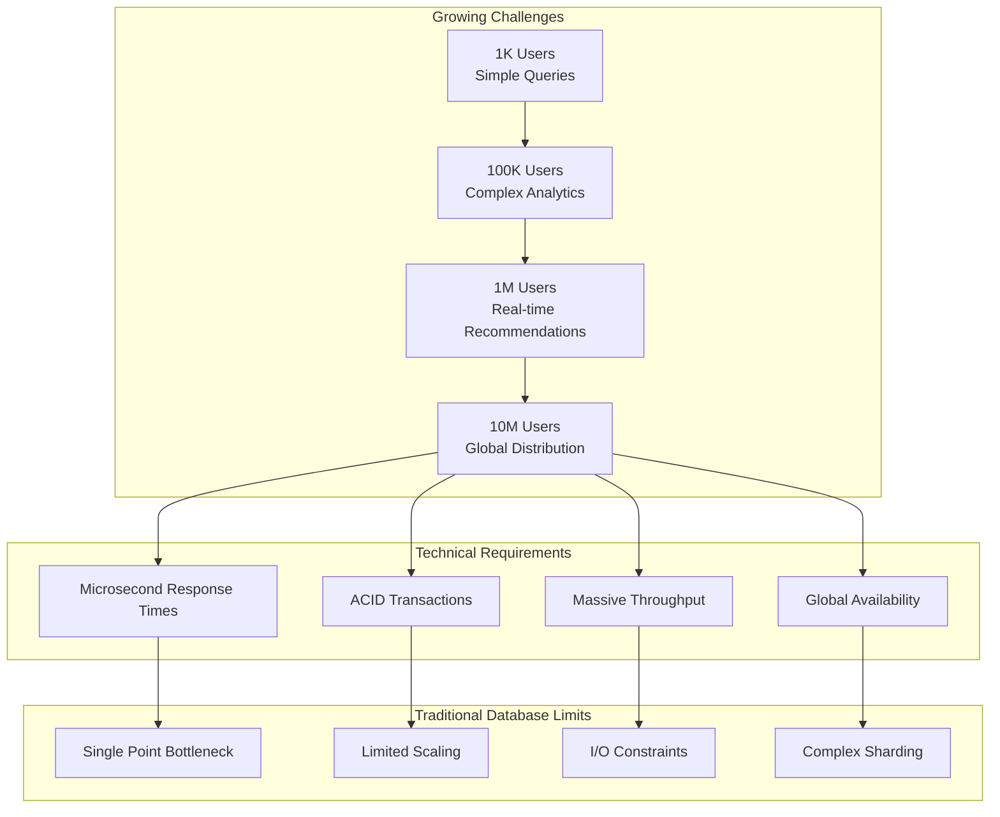
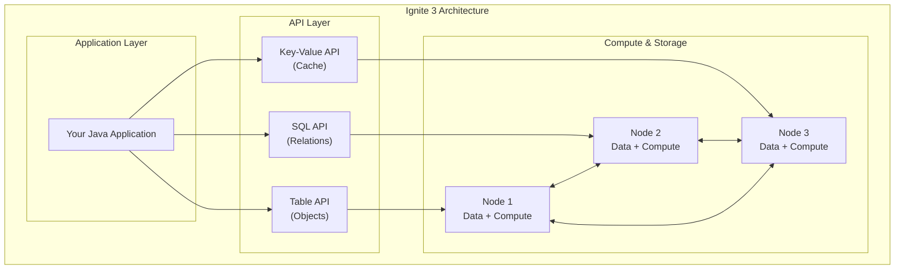
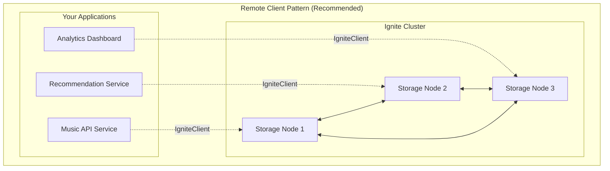
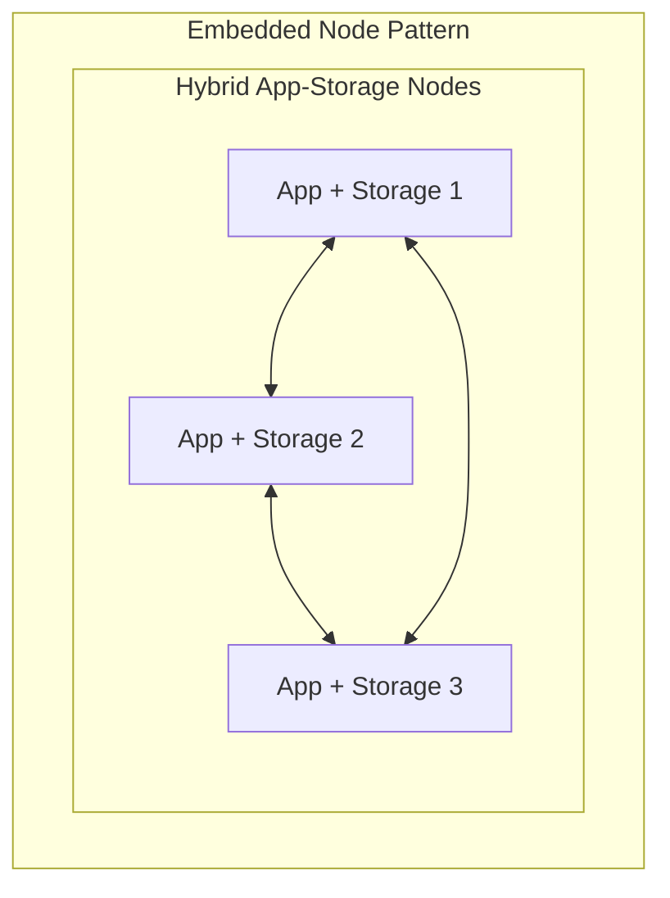
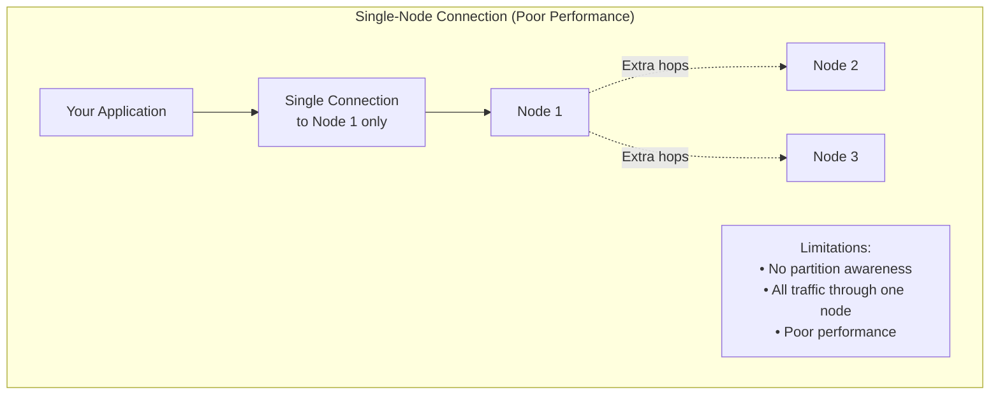
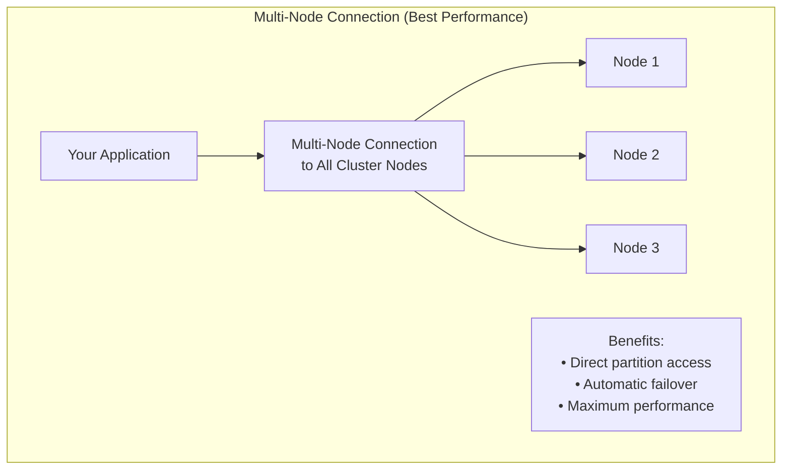

# Chapter 1.1: Introduction and Architecture Overview

Your music streaming platform just crashed. Again. This time it was 50,000 concurrent users trying to browse the latest album release. Your PostgreSQL instance maxed out at 100% CPU, connection pools exhausted, and users got timeout errors instead of music.

Your monitoring dashboard shows the grim reality: average query time spiked to 8 seconds, memory usage hit 95%, and your read replicas are 45 seconds behind master writes. The DBA is talking about "horizontal sharding with application-level routing logic", but that sounds like another temporary fix.

## The Distributed Data Problem

Traditional databases hit fundamental limits when your application grows beyond single-server capacity. These aren't configuration problems you can tune away - they're architectural constraints that require distributed solutions.

**Single Point of Failure:** Your entire application depends on one database server. When it goes down, everything stops.

**Vertical Scaling Limits:** Adding more CPU and RAM to one server only delays the inevitable. Even the largest servers max out at some point.

**Read Replica Lag:** Write operations hit the master, reads come from replicas that are seconds or minutes behind. Your users see stale data and inconsistent application behavior.

**Complex Sharding:** Manual database partitioning requires application-level routing logic, cross-shard joins become impossible, and operational complexity explodes.

Meanwhile, Spotify serves 400 million active users. Netflix streams globally without crashes. They're not running single PostgreSQL instances with read replicas. They use distributed architecture that scales horizontally.

## How Apache Ignite 3 Solves Distributed Data Challenges

Ignite 3 eliminates these traditional database limitations through distributed-first architecture. Instead of bolting distributed features onto single-server database designs, Ignite builds distribution into the core platform.

**Unified Platform:** One system handles storage, compute, and caching instead of managing separate database, cache, and compute clusters. Your application connects to one platform that scales all capabilities together.

**Automatic Distribution:** Data spreads across multiple nodes automatically. No manual sharding logic - Ignite handles data placement, routing, and consistency transparently.

**Consistent Performance:** Operations execute in microseconds whether your data lives on one node or spreads across hundreds. Built-in colocation strategies keep related data together for optimal join performance.

**Horizontal Scaling:** Add nodes to increase capacity. The cluster rebalances data automatically and serves more traffic without application changes.

**No Single Points of Failure:** Data replicates across multiple nodes. Node failures don't stop your application - the cluster continues operating with remaining nodes.

## Production Platform Scaling Requirements



Your application now needs to:

- **Store catalogs**: 50M+ tracks across multiple regions, accessible in milliseconds
- **Process purchases**: Handle 10K concurrent transactions with full ACID guarantees  
- **Generate recommendations**: Analyze patterns across petabytes of listening data in real-time
- **Ingest events**: Process millions of play events per hour without dropping data
- **Scale operations**: Handle traffic spikes during album releases and viral content

Traditional databases hit walls. You need a distributed computing platform built for these demands.

## Ignite 3 Architecture Implementation

Traditional scaling approaches create operational complexity: read replicas with replication lag, sharded databases that break cross-shard joins, cache layers with invalidation race conditions, and message queues with delivery semantics.

Ignite 3 eliminates this complexity through unified distributed architecture:



### How Unified APIs Eliminate Infrastructure Complexity

Traditional distributed applications require separate connections to databases, cache clusters, and compute frameworks. Each system has different APIs, connection management, and operational requirements.

Ignite 3 unifies all these capabilities behind consistent Java APIs:

```java
// Traditional approach - multiple systems to manage
Database db = connectToDatabase();
Cache cache = connectToCache(); 
ComputeCluster compute = connectToCompute();

// Ignite 3 - unified platform
IgniteClient ignite = IgniteClient.builder()
    .addresses("node1:10800", "node2:10800", "node3:10800")
    .build();

// All capabilities through one connection
Table<Artist> artists = ignite.tables().table("Artist").recordView(Artist.class);
SqlStatement analytics = ignite.sql().statementBuilder().query("SELECT...");
JobExecution<String> recommendation = ignite.compute().submit(nodes, job, args);
```

### How Ignite's Core Capabilities Address Scale Challenges

**Problem:** Traditional databases slow down as data grows because disk I/O becomes the bottleneck.

**Solution:** Ignite stores your catalog in distributed cluster memory across multiple nodes with microsecond access latencies and optional disk persistence for durability.

**Problem:** Complex queries slow down because traditional databases can't parallelize processing across multiple servers.

**Solution:** Ignite's distributed SQL engine executes queries across the entire cluster automatically, processing data where it resides without network transfer overhead.

**Problem:** Object-relational mapping creates overhead and complexity for simple data operations.

**Solution:** Ignite provides direct key-value access through type-safe Java APIs, eliminating ORM complexity for known-key operations.

**Problem:** Moving data to compute resources wastes network bandwidth and adds latency.

**Solution:** Ignite executes business logic directly on nodes containing relevant data, eliminating network serialization penalties.

**Problem:** High-volume data ingestion overwhelms traditional database write capabilities.

**Solution:** Ignite's streaming engine handles millions of events per second with automatic backpressure and flow control.

## Deployment Architecture Patterns

### Remote Client Pattern (Recommended)



### Remote Client Implementation

Your applications connect to the cluster but stay separate from it:

```java
// Clean separation - app and storage independent
IgniteClient client = IgniteClient.builder()
    .addresses("storage1:10800", "storage2:10800", "storage3:10800")
    .build();
```

**Optimal for:**

- Microservices (each service connects independently)
- Containers and Kubernetes deployments
- Development and testing
- When you want to scale apps and storage separately

**Implementation benefits:**

- Deploy new app versions without touching storage
- Scale applications based on traffic, storage based on data
- Simple operational model

### Embedded Node Pattern



### Embedded Node Implementation

Your application becomes part of the storage cluster:

```java
// App and storage lifecycle are joined
IgniteServer server = IgniteServer.start("myApp", configPath, workDir);
```

**Apply when:**

- Data locality is critical (compute runs where data lives)
- Legacy systems that can't be easily separated
- Single-deployment scenarios

**Implementation trade-offs:**

- App restarts affect cluster membership
- More complex deployment coordination
- Higher memory requirements

### Unified Programming Model

Both connection strategies implement the same Ignite interface, enabling consistent programming patterns regardless of deployment choice. This means you can develop with one pattern and deploy with another based on operational requirements.

## Multi-API Data Access Strategy

Ignite 3 provides three APIs to work with the same distributed data. Pick the right tool for each job:


### Ignite Data APIs

**Table API** provides type-safe object operations with automatic serialization, optimal for CRUD operations where you know the data structure. Use when you need strong typing, object mapping, and direct record manipulation with minimal overhead. Choose this for business logic that works with complete entities and when compile-time type safety is more important than raw performance.

**SQL API** enables complex queries and analytics across distributed data using standard SQL syntax. Choose this for aggregations, joins, filtering operations, and any query that benefits from SQL's declarative approach. Select this when you need to process large datasets with complex business rules or when working with analysts who prefer SQL syntax over programmatic APIs.

**Key-Value API** delivers maximum performance for simple get/put operations using generic Tuple objects. Select this for high-throughput scenarios, caching patterns, or when you need the fastest possible key-based access. Use this when microsecond response times matter more than type safety, or when implementing cache-like access patterns where you only need specific field values rather than complete objects.

```java
// Table API - type-safe record operations with automatic mapping
Artist artist = artists.get(null, artistKey);  // Direct object retrieval
artist.setName("Updated Name");
artists.upsert(null, artist);  // Type-safe updates

// SQL API - declarative queries with complex logic and joins
var topTracks = client.sql().execute(null,
    "SELECT t.Name, COUNT(*) FROM Track t " +
    "JOIN InvoiceLine il ON t.TrackId = il.TrackId " + 
    "GROUP BY t.TrackId ORDER BY COUNT(*) DESC LIMIT 10");

// Key-Value API - high-performance generic operations with minimal overhead
Tuple trackKey = Tuple.create().set("TrackId", 123);
Tuple trackData = tracks.get(null, trackKey);  // Fastest key-based access
```

### Asynchronous Operation Support

Every API supports both sync and async operations:

```java
// Table API - Synchronous blocks until complete
Artist artist = artists.get(null, key);

// Table API - Asynchronous returns immediately  
CompletableFuture<Artist> future = artists.getAsync(null, key);
future.thenApply(this::updateArtist)
      .thenCompose(updated -> artists.upsertAsync(null, updated))
      .thenRun(() -> System.out.println("Update complete"));

// SQL API - Same async pattern applies
CompletableFuture<SqlResultSet> sqlFuture = client.sql().executeAsync(null, "SELECT * FROM Artist");
sqlFuture.thenAccept(results -> processResults(results));

// Key-Value API - Same async pattern applies  
CompletableFuture<Tuple> kvFuture = tracks.getAsync(null, trackKey);
kvFuture.thenCompose(data -> tracks.putAsync(null, trackKey, updatedData));
```

### Cross-API Type Safety

Your Java classes work consistently across all APIs:

```java
@Table(zone = @Zone("MusicStore"))
public class Artist {
    @Id Integer artistId;
    @Column String name;
    // ... constructors, getters, setters
}

// Same class works everywhere:
RecordView<Artist> tableView = ignite.tables().table("Artist").recordView(Artist.class);
ResultSet<Artist> sqlResults = ignite.sql().execute(null, "SELECT * FROM Artist", Artist.class);

// Key-Value API accesses same data via Tuples:
KeyValueView<Tuple, Tuple> kvView = ignite.tables().table("Artist").keyValueView();
Tuple artistData = kvView.get(null, Tuple.create().set("artistId", 1)); // Same underlying data
```

## Distribution Zone Configuration

Distribution zones control how your data spreads across cluster nodes. Ignite 3 provides a default zone that works out of the box:

### Default Zone Implementation

When you create a table without specifying a zone, Ignite uses the default zone:

```java
@Table  // Uses default zone automatically
public class Artist {
    @Id Integer artistId;
    @Column String name;
}
```

**Configuration details:**

- **1 replica** (no backups)
- **25 partitions** (good for small to medium datasets)
- **All nodes included** (uses entire cluster)
- **Ready immediately** (no setup required)

**Optimal for:**

- Development and learning
- Proof-of-concept projects
- Getting started quickly

**Production consideration:** The default zone provides no fault tolerance. If a node fails, you lose data. For production workloads, you'll want custom zones with multiple replicas.

> **Need production-grade storage?** See [Storage System Architecture](../00-reference/storage-system-arch.md) for complete details on custom zones, partitioning strategies, and fault-tolerant configurations.

## Cluster Connection Strategies

How you connect to the cluster affects performance. Connecting to all nodes gives you the best experience:





### Multi-Node Connection Implementation

Always specify all cluster node addresses:

```java
// Good: Connect to all nodes for best performance
IgniteClient client = IgniteClient.builder()
    .addresses("node1:10800", "node2:10800", "node3:10800")
    .build();

// Poor: Single node creates bottlenecks  
IgniteClient client = IgniteClient.builder()
    .addresses("node1:10800")  // Only one node - bad performance
    .build();
```

**Implementation benefits:**

- **Direct access**: Your app connects directly to the node that holds the data
- **Automatic failover**: If one node goes down, your app keeps working
- **Load distribution**: Requests spread across all available nodes

## Implementation Pattern Summary

### Multi-Node Connection Pattern

```java
// Production pattern: specify all cluster nodes
IgniteClient client = IgniteClient.builder()
    .addresses("node1:10800", "node2:10800", "node3:10800")
    .build();
```

### Default Zone Pattern

```java
// Development pattern: use default zone for simplicity
@Table
public class Artist {
    @Id Integer artistId;
    @Column String name;
}
```

### API Selection Strategy

```java
// Table API for direct record access
Artist artist = artists.get(null, artistKey);

// SQL API for complex queries
var results = client.sql().execute(null, "SELECT * FROM Artist WHERE...");
```

## Technology Requirements

**Required software stack:**

- **Java 17+**: Modern JDK
- **Maven 3.8+**: Build and dependency management
- **Docker**: Version 20.10.0 or newer (12GB RAM recommended)
- **Docker Compose**: Version 2.23.1 or newer

**Installation approach:**

> [!NOTE]
> Docker installation is preferred but not required.

**For Unix-based systems (Linux, macOS)**: Use the Docker setup instructions at [Apache Ignite 3 Docker Installation Guide](https://ignite.apache.org/docs/ignite3/latest/installation/installing-using-docker).

**For Windows and other systems**: Follow the installation instructions at [https://ignite.apache.org/docs/ignite3/latest/installation/](https://ignite.apache.org/docs/ignite3/latest/installation/) which covers all supported platforms and installation methods.

Alternative installation methods are available for environments where Docker is not suitable.

**Required knowledge base:**

- Java fundamentals (collections, generics, streams)
- Basic SQL concepts (SELECT, JOIN, GROUP BY)
- General understanding of web application architecture

## Implementation Path

These architectural concepts and decision frameworks provide the foundation for hands-on development.

Continue with:

- **[Chapter 1.2: Your First Implementation](02-getting-started.md)** - Put these concepts into practice with a working Ignite 3 application using the default zone pattern

- **[Chapter 1.3: Distributed Data Fundamentals](03-distributed-data-fundamentals.md)** - Core concepts of distributed data management and advanced zone configuration patterns
