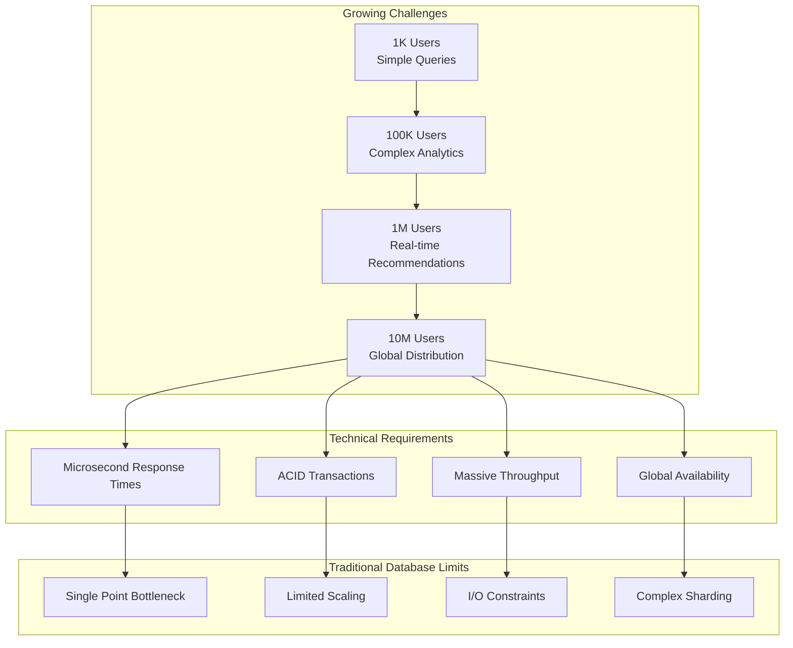
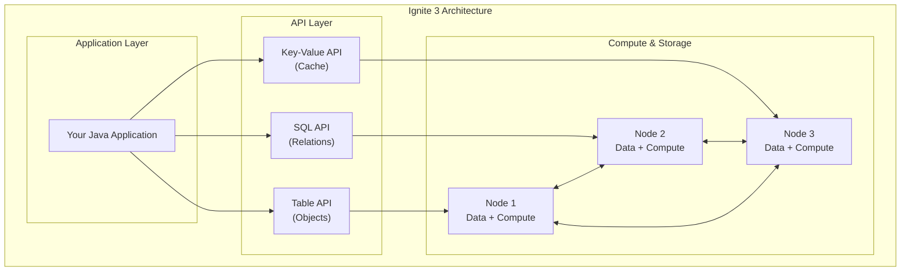
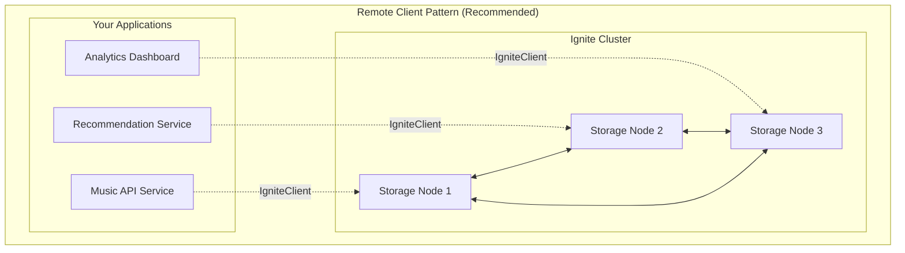
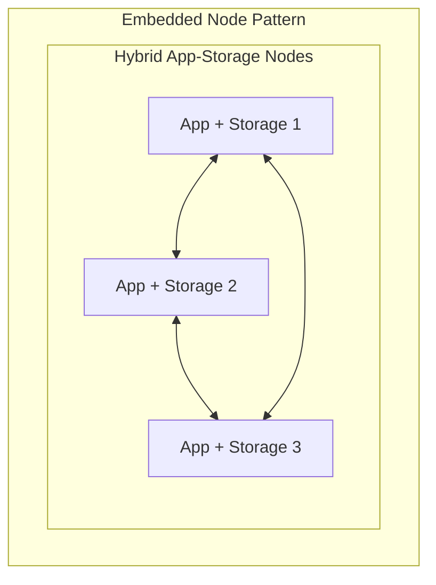
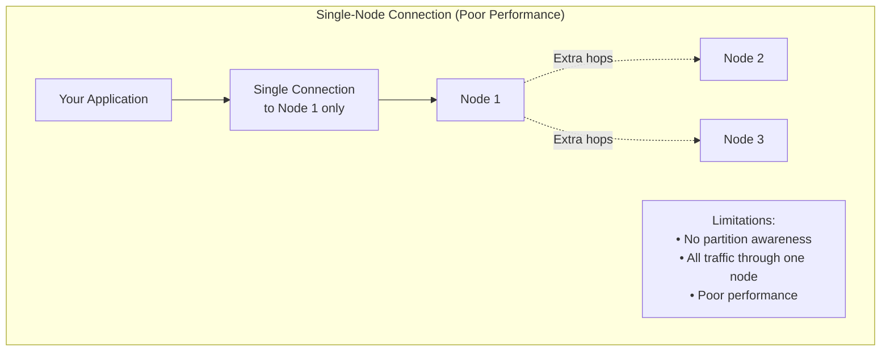
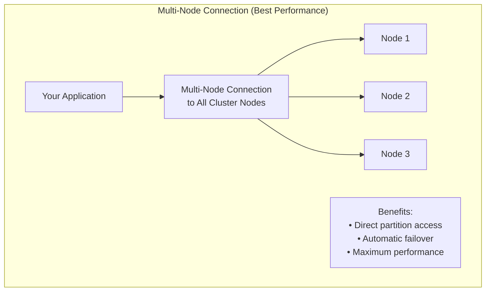

# Chapter 1.1: Introduction and Architecture Overview

## Learning Objectives

By completing this chapter, you will:

- Understand Apache Ignite 3's distributed computing capabilities and core use cases
- Distinguish between connection strategies and their appropriate applications
- Recognize when to use default zones versus custom zones for different scenarios
- Understand the Java API architecture and multi-modal access patterns
- Make informed decisions about deployment patterns for development and production

## The Challenge: Building at Scale

Picture this: you're building a music streaming platform. It starts simple - a few thousand users, basic catalog browsing, simple searches. But success brings complexity:



Your application now needs to:

- **Store catalogs**: 50M+ tracks across multiple regions, accessible in milliseconds
- **Process purchases**: Handle 10K concurrent transactions with full ACID guarantees  
- **Generate recommendations**: Analyze patterns across petabytes of listening data in real-time
- **Ingest events**: Process millions of play events per hour without dropping data
- **Scale operations**: Handle traffic spikes during album releases and viral content

Traditional databases hit walls. You need a distributed computing platform built for these demands.

## Apache Ignite 3: Your Distributed Solution

Apache Ignite 3 solves these scaling challenges through a unified distributed platform:



### What This Means for Your Code

Instead of managing database connections, cache layers, and compute frameworks separately:

```java
// Traditional approach - multiple systems to manage
Database db = connectToDatabase();
Cache cache = connectToCache(); 
ComputeCluster compute = connectToCompute();

// Ignite 3 - unified platform
IgniteClient ignite = IgniteClient.builder()
    .addresses("node1:10800", "node2:10800", "node3:10800")
    .build();

// All capabilities through one connection
Table<Artist> artists = ignite.tables().table("Artist").recordView(Artist.class);
SqlStatement analytics = ignite.sql().statementBuilder().query("SELECT...");
JobExecution<String> recommendation = ignite.compute().submit(nodes, job, args);
```

### Five Core Capabilities

- **In-Memory Data Grid**: Your data lives in RAM across nodes - microsecond access with optional persistence
- **Distributed SQL Engine**: Standard SQL that spans the entire cluster automatically
- **NoSQL Key-Value Store**: Type-safe object APIs for when you know exactly what you want
- **Compute Engine**: Run your business logic where the data lives - no network penalties
- **Streaming Engine**: Handle millions of events per second with automatic backpressure

### Evolution from Ignite 2

If you have worked with version 2 of Ignite in the past, Ignite 3 represents a redesign focused on developer experience and operational management:

- **Cleaner Architecture**: Simplified codebase with clear separation between storage, compute, and API layers
- **Schema Management**: Annotation-driven table creation reduces configuration complexity
- **Transaction Semantics**: Consistency guarantees with programming models
- **Modern Java Integration**: Built-in support for CompletableFuture, type safety, and contemporary frameworks

## Connection Strategy: Client vs Embedded

You have two ways to connect your application to an Ignite 3 cluster. Choose based on your deployment needs:





### Remote Client Pattern (Start Here)

Your applications connect to the cluster but stay separate from it:

```java
// Clean separation - app and storage independent
IgniteClient client = IgniteClient.builder()
    .addresses("storage1:10800", "storage2:10800", "storage3:10800")
    .build();
```

**Perfect for:**

- Microservices (each service connects independently)
- Containers and Kubernetes deployments
- Development and testing
- When you want to scale apps and storage separately

**Why it works:**

- Deploy new app versions without touching storage
- Scale applications based on traffic, storage based on data
- Simple operational model

### Embedded Node Pattern

Your application becomes part of the storage cluster:

```java
// App and storage lifecycle are joined
IgniteServer server = IgniteServer.start("myApp", configPath, workDir);
```

**Use when:**

- Data locality is critical (compute runs where data lives)
- Legacy systems that can't be easily separated
- Single-deployment scenarios

**Trade-offs:**

- App restarts affect cluster membership
- More complex deployment coordination
- Higher memory requirements

### Unified Programming Model

Both connection strategies implement the same Ignite interface, enabling consistent programming patterns regardless of deployment choice. This means you can develop with one pattern and deploy with another based on operational requirements.

## Java API: Three Ways to Access Your Data

Ignite 3 gives you three APIs to work with the same distributed data. Pick the right tool for each job:


### When to Use Each API

```java
// Table API - when you know the structure and want type safety
Artist artist = artists.get(null, artistKey);
artist.setName("Updated Name");
artists.upsert(null, artist);

// SQL API - when you need complex queries or analytics
var topTracks = client.sql().execute(null,
    "SELECT t.Name, COUNT(*) FROM Track t " +
    "JOIN InvoiceLine il ON t.TrackId = il.TrackId " + 
    "GROUP BY t.TrackId ORDER BY COUNT(*) DESC LIMIT 10");

// Key-Value API - when you want simple key-value operations
Tuple trackKey = Tuple.create().set("TrackId", 123);
Tuple trackData = tracks.get(null, trackKey); // Fast key lookup
```

### Async Operations Everywhere

Every API supports both sync and async operations:

```java
// Synchronous - blocks until complete
Artist artist = artists.get(null, key);

// Asynchronous - returns immediately  
CompletableFuture<Artist> future = artists.getAsync(null, key);
future.thenApply(this::updateArtist)
      .thenCompose(updated -> artists.upsertAsync(null, updated))
      .thenRun(() -> System.out.println("Update complete"));
```

### Type Safety Across APIs

Your Java classes work consistently across all APIs:

```java
@Table(zone = @Zone("MusicStore"))
public class Artist {
    @Id Integer artistId;
    @Column String name;
    // ... constructors, getters, setters
}

// Same class works everywhere:
RecordView<Artist> tableView = ignite.tables().table("Artist").recordView(Artist.class);
ResultSet<Artist> sqlResults = ignite.sql().execute(null, "SELECT * FROM Artist", Artist.class);
```

## Distribution Zones: Getting Started

Distribution zones control how your data spreads across cluster nodes. For getting started, Ignite 3 provides a default zone that works out of the box:

### Default Zone: Zero Configuration Required

When you create a table without specifying a zone, Ignite uses the default zone:

```java
@Table  // Uses default zone automatically
public class Artist {
    @Id Integer artistId;
    @Column String name;
}
```

**What you get:**

- **1 replica** (no backups)
- **25 partitions** (good for small to medium datasets)
- **All nodes included** (uses entire cluster)
- **Ready immediately** (no setup required)

**Perfect for:**

- Development and learning
- Proof-of-concept projects
- Getting started quickly

**Production consideration:** The default zone provides no fault tolerance. If a node fails, you lose data. For production workloads, you'll want custom zones with multiple replicas.

> **Need production-grade storage?** See [Storage System Architecture](../00-reference/storage-system-arch.md) for complete details on custom zones, partitioning strategies, and fault-tolerant configurations.

## Connection Patterns: Single vs Multi-Node

How you connect to the cluster affects performance. Connecting to all nodes gives you the best experience:





### The Right Way to Connect

Always specify all cluster node addresses:

```java
// Good: Connect to all nodes for best performance
IgniteClient client = IgniteClient.builder()
    .addresses("node1:10800", "node2:10800", "node3:10800")
    .build();

// Poor: Single node creates bottlenecks  
IgniteClient client = IgniteClient.builder()
    .addresses("node1:10800")  // Only one node - bad performance
    .build();
```

**Why this matters:**

- **Direct access**: Your app connects directly to the node that holds the data
- **Automatic failover**: If one node goes down, your app keeps working
- **Load distribution**: Requests spread across all available nodes

## Key Patterns for Success

### Connect to All Nodes

```java
// Production pattern: specify all cluster nodes
IgniteClient client = IgniteClient.builder()
    .addresses("node1:10800", "node2:10800", "node3:10800")
    .build();
```

### Start with Default Zone

```java
// Development pattern: use default zone for simplicity
@Table
public class Artist {
    @Id Integer artistId;
    @Column String name;
}
```

### Choose the Right API

```java
// Table API for direct record access
Artist artist = artists.get(null, artistKey);

// SQL API for complex queries
var results = client.sql().execute(null, "SELECT * FROM Artist WHERE...");
```

## Prerequisites

**Required Technology**:

- **Java 17+**: Modern JDK
- **Maven 3.8+**: Build and dependency management
- **Docker**: Version 20.10.0 or newer (12GB RAM recommended)
- **Docker Compose**: Version 2.23.1 or newer

**Installation**:

> [!NOTE]
> Docker installation is preferred but not required.

**For Unix-based systems (Linux, macOS)**: Use the Docker setup instructions at [Apache Ignite 3 Docker Installation Guide](https://ignite.apache.org/docs/ignite3/latest/installation/installing-using-docker).

**For Windows and other systems**: Follow the installation instructions at [https://ignite.apache.org/docs/ignite3/latest/installation/](https://ignite.apache.org/docs/ignite3/latest/installation/) which covers all supported platforms and installation methods.

Alternative installation methods are available for environments where Docker is not suitable.

**Knowledge Assumptions**:

- Java fundamentals (collections, generics, streams)
- Basic SQL concepts (SELECT, JOIN, GROUP BY)
- General understanding of web application architecture

## Next Steps

Understanding these architectural concepts and decision frameworks provides the foundation for hands-on development.

Continue with:

- **[Chapter 1.2: Your First Implementation](02-getting-started.md)** - Put these concepts into practice with a working Ignite 3 application using the default zone pattern

- **[Chapter 1.3: Distributed Data Fundamentals](03-distributed-data-fundamentals.md)** - Learn the core concepts of distributed data management and advanced zone configuration patterns
