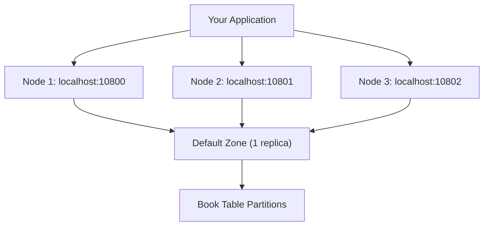

# Chapter 1.2: Getting Started with Your First Application

Your development environment fails to connect to the Ignite cluster because of Docker networking issues, or your first table creation fails with schema validation errors. Connection attempts timeout, your annotated classes don't generate tables, or CRUD operations throw partition mapping exceptions. 

The cluster runs but your application can't find any nodes. Multi-node addressing configuration is incorrect, resource cleanup patterns cause memory leaks, or the client connects to only one node instead of establishing partition awareness across the cluster.

This chapter solves these first-application problems through proper cluster setup, correct connection patterns, and working schema definitions.

## Environment Setup

### Client Library Configuration

Maven builds fail with missing dependencies because your POM lacks the client library. Add the single required dependency:

```xml
<dependency>
    <groupId>org.apache.ignite</groupId>
    <artifactId>ignite-client</artifactId>
    <version>3.0.0</version>
</dependency>
```

This provides the complete client API for connections, schema operations, and data access.

### Cluster Bootstrap Process

Applications fail to connect because no cluster exists. Docker provides the fastest cluster setup:

**Prerequisites**: 

- Docker 20.10.0+ and Docker Compose 2.23.1+
- Network ports 10300-10302 and 10800-10802 available
- See [Apache Ignite 3 Docker Installation Guide](https://ignite.apache.org/docs/ignite3/latest/installation/installing-using-docker) for platform-specific setup

#### Unix-based Systems (Linux, macOS)

```bash
# Clone and start the reference cluster
git clone <this-repo>
cd ignite3-reference-apps/00-docker

# Automated setup
./init-cluster.sh
```

The script detects your Docker Compose version and creates a 3-node cluster with proper networking configuration.

#### Windows and Manual Setup

**Docker Compose Approach**

```bash
# Clone and navigate to Docker setup
git clone <this-repo>
cd ignite3-reference-apps/00-docker

# Start containers (use your Docker Compose command)
docker-compose up -d
# OR: docker compose up -d
```

Wait 30-60 seconds for container startup, then initialize with PowerShell:

```powershell
# Initialize cluster using REST API
$body = @{
    metaStorageNodes = @("node1", "node2", "node3")
    cmgNodes = @("node1", "node2", "node3")
    clusterName = "ignite3-reference-cluster"
} | ConvertTo-Json

Invoke-RestMethod -Uri "http://localhost:10300/management/v1/cluster/init" -Method POST -Body $body -ContentType "application/json"
```

**Native Installation Alternative**

For production environments or non-Docker setups, use platform-specific installation from [https://ignite.apache.org/docs/ignite3/latest/installation/](https://ignite.apache.org/docs/ignite3/latest/installation/).

## Connection Patterns

### Multi-Node Client Configuration

Connection failures occur when applications use single-node addressing, causing partition awareness problems and failover issues. Proper client setup requires multi-node configuration:

```java
try (IgniteClient client = IgniteClient.builder()
        .addresses("localhost:10800", "localhost:10801", "localhost:10802")
        .build()) {
    
    System.out.println("Connected to: " + client.connections());
       
    // Your application logic here
}
// Client automatically closes and cleans up resources
```

**Multi-Node Addressing Requirements:**

- **Partition Awareness**: Client discovers partition locations across all nodes
- **Resource Management**: Try-with-resources prevents connection leaks
- **Failover Capability**: Multiple addresses provide redundancy when nodes fail
- **Performance Optimization**: Direct partition routing eliminates network hops

### Schema Definition with Default Zone

Table creation fails when zone configuration is missing or incorrect. The default zone solves initial setup problems by providing automatic zone management:

```java
@Table  // No zone specification = uses default zone
public class Book {
    @Id
    @Column(value = "id", nullable = false)
    private Integer id;
    
    @Column(value = "title", nullable = false, length = 100)
    private String title;
    
    @Column(value = "author", nullable = false, length = 50)
    private String author;
    
    // Constructor, getters, setters...
    public Book() {}
    public Book(Integer id, String title, String author) {
        this.id = id;
        this.title = title;
        this.author = author;
    }
    
    public Integer getId() { return id; }
    public void setId(Integer id) { this.id = id; }
    public String getTitle() { return title; }
    public void setTitle(String title) { this.title = title; }
    public String getAuthor() { return author; }
    public void setAuthor(String author) { this.author = author; }
    
    public String toString() {
        return "Book{id=" + id + ", title='" + title + "', author='" + author + "'}";
    }
}
```

**Default Zone Benefits:**

- **Zero Configuration**: Uses automatically created default zone
- **Compile-time Validation**: Schema validated during compilation
- **Automatic DDL**: Table structure generated from annotations
- **Partition Strategy**: Annotations control partitioning and indexing

## Complete Working Application

### Functional Implementation

Applications fail when connection patterns, schema definitions, or API usage contain errors. This complete implementation demonstrates working patterns:

```java
package com.example;

import org.apache.ignite.client.IgniteClient;
import org.apache.ignite.catalog.annotations.*;
import org.apache.ignite.table.RecordView;

public class HelloIgnite {
    
    @Table  // Uses default zone - perfect for learning and development
    public static class Book {
        @Id
        private Integer id;
        
        @Column(length = 100)
        private String title;
        
        @Column(length = 50)  
        private String author;
        
        public Book() {}
        public Book(Integer id, String title, String author) {
            this.id = id;
            this.title = title;
            this.author = author;
        }
        
        // Getters and setters
        public Integer getId() { return id; }
        public void setId(Integer id) { this.id = id; }
        public String getTitle() { return title; }
        public void setTitle(String title) { this.title = title; }
        public String getAuthor() { return author; }
        public void setAuthor(String author) { this.author = author; }
        
        public String toString() {
            return "Book{id=" + id + ", title='" + title + "', author='" + author + "'}";
        }
    }
    
    public static void main(String[] args) {
        // Implement multi-node connection strategy from Chapter 1.1
        try (IgniteClient client = IgniteClient.builder()
                .addresses("localhost:10800", "localhost:10801", "localhost:10802")
                .build()) {
            
            System.out.println("=== Connected with partition awareness ===");
            
            // 1. Create table (uses default zone automatically)
            client.catalog().createTable(Book.class);
            System.out.println("Table created in default zone");
            
            // 2. Get table view using Table API
            RecordView<Book> books = client.tables()
                .table("Book")
                .recordView(Book.class);
            
            // 3. Insert data using type-safe operations
            books.upsert(null, new Book(1, "1984", "George Orwell"));
            books.upsert(null, new Book(2, "Brave New World", "Aldous Huxley"));
            System.out.println("Books inserted using Table API");
            
            // 4. Read data using type-safe operations
            Book book = books.get(null, new Book(1, null, null));
            System.out.println("Retrieved: " + book);
            
            // 5. Query with SQL API - same data, different access pattern
            var result = client.sql().execute(null, "SELECT id, title, author FROM Book ORDER BY id");
            System.out.println("All books via SQL:");
            while (result.hasNext()) {
                var row = result.next();
                System.out.println("  " + row.intValue("id") + ": " + 
                                 row.stringValue("title") + " by " + 
                                 row.stringValue("author"));
            }
            
            System.out.println("Success! Default zone pattern working perfectly.");
            
        } catch (Exception e) {
            System.err.println("Error: " + e.getMessage());
            e.printStackTrace();
        }
    }
}
```

### Implementation Analysis

This application solves common first-application problems:

1. **Multi-node Connection**: Establishes partition awareness across cluster nodes
2. **Default Zone Usage**: Eliminates zone configuration complexity for development
3. **Schema Definition**: Uses annotation-driven table creation without manual DDL
4. **Multi-modal API**: Demonstrates Table API and SQL API accessing the same data
5. **Type Safety**: Provides compile-time validation throughout the data pipeline

### Execution Process

```bash
# 1. Start cluster (reference Docker setup)
cd ignite3-reference-apps/00-docker && ./init-cluster.sh

# 2. Compile and run the application
javac -cp ignite-client-3.0.0.jar HelloIgnite.java
java -cp .:ignite-client-3.0.0.jar HelloIgnite
```

**Expected Output:**

```text
=== Connected with partition awareness ===
Table created in default zone
Books inserted using Table API
Retrieved: Book{id=1, title='1984', author='George Orwell'}
All books via SQL:
  1: 1984 by George Orwell
  2: Brave New World by Aldous Huxley
Success! Default zone pattern working perfectly.
```

## Technical Implementation Details

### Default Zone Strategy

The implementation demonstrates how default zone usage eliminates configuration complexity:

- **Zero Configuration**: No zone creation code required - Ignite 3 provides this automatically
- **Immediate Availability**: Table creation succeeds using the pre-existing default zone
- **Development Efficiency**: Removes operational complexity while maintaining functionality
- **Performance Retention**: Multi-node connection patterns still provide optimization benefits

### Distributed Connection Architecture  

The multi-node connection establishes partition awareness across the cluster:



**Operational Benefits:**

- **Partition Awareness**: Client maps data partitions to specific nodes
- **Direct Routing**: Operations route directly to partition-owning nodes
- **Transparent Failover**: Node failures trigger automatic connection redistribution

### Unified API Access Pattern

The implementation demonstrates how both APIs access the same distributed data:

```java
// Table API - type-safe object operations
Book book = books.get(null, new Book(1, null, null));

// SQL API - flexible query operations on same data  
var result = client.sql().execute(null, "SELECT id, title, author FROM Book");
```

This unified programming model provides:

- Table API delivers type safety for key-based operations
- SQL API enables complex queries and analytics
- Both APIs access identical underlying distributed partitions

## Production Scaling Patterns

The development patterns demonstrated here scale directly to production environments without code changes:

### Pattern Continuity

The implementation foundation supports production requirements:

1. **Connection Patterns**: Multi-node addressing transfers directly to production clusters
2. **Programming Model**: Table and SQL APIs remain consistent across zone configurations
3. **Data Models**: POJO classes function with any zone setup
4. **Transition Path**: Moving to custom zones requires only zone creation, not application changes

### Custom Zone Requirements

Production environments require custom zones when applications need:

- **Fault Tolerance**: Multiple replicas for data protection and availability
- **Performance Optimization**: Tuned partition counts for specific workload patterns
- **Data Isolation**: Separate zones for different data tiers or tenant isolation
- **Compliance Controls**: Specific data residency or security requirements

## Next Steps

The connection and schema patterns established here provide the foundation for advanced distributed data operations:

**Advanced Data Distribution**: These patterns support complex production scenarios

- **[Chapter 1.3: Distributed Data Fundamentals](03-distributed-data-fundamentals.md)** - Custom zones, replication strategies, and advanced data distribution patterns for production workloads

**Production Implementation**: The [reference applications](../ignite3-reference-apps/) demonstrate these patterns with custom zones and the complete music store dataset, showing how development patterns scale to production requirements