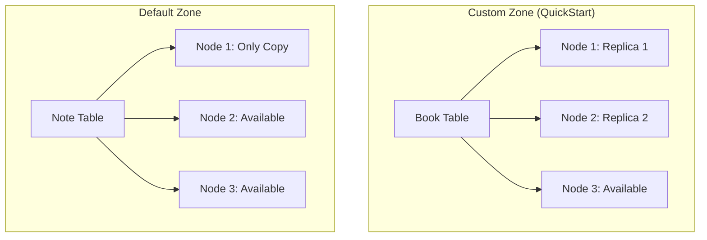
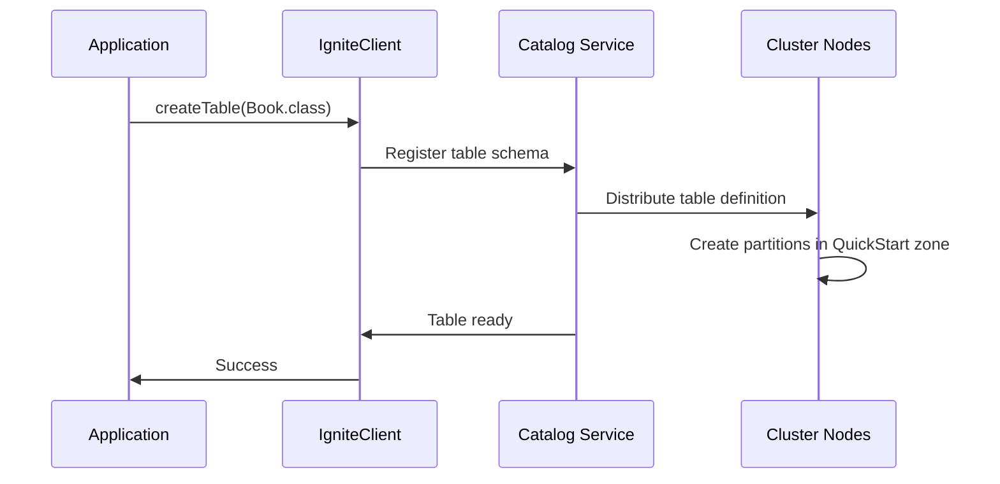

# Chapter 1.2: Getting Started with Your First Application

## Learning Objectives

By completing this chapter, you will:

- Create your first connection to an Ignite 3 cluster
- Define and create tables using annotations
- Perform basic CRUD operations using both Table and SQL APIs
- Understand resource management and proper cleanup patterns

## Working with the Reference Application

The **`02-getting-started-app`** provides a complete working example of the concepts covered in this chapter. You can run it alongside your learning to see these patterns in action with the full music store dataset.

**Quick Start**: After reading this chapter, run the reference application:

```bash
cd ignite3-reference-apps/02-getting-started-app
mvn compile exec:java
```

The reference app demonstrates connection patterns, schema creation, and basic CRUD operations that scale from the simple Book examples here to the full Artist-Album-Track hierarchy.

## Environment Setup

### Dependencies You Need

For any Ignite 3 application, you need just one dependency:

```xml
<dependency>
    <groupId>org.apache.ignite</groupId>
    <artifactId>ignite-client</artifactId>
    <version>3.0.0</version>
</dependency>
```

The client library includes everything needed to connect, define schemas, and perform operations.

### Running Cluster Setup

Before your first application, you need an Ignite 3 cluster running. The simplest approach uses Docker:

**Prerequisites**:

- Docker 20.10.0 or newer and Docker Compose 2.23.1 or newer
- See [Apache Ignite 3 Docker Installation Guide](https://ignite.apache.org/docs/ignite3/latest/installation/installing-using-docker) for setup instructions

#### Unix-based Systems (Linux, macOS)

```bash
# Clone and start the reference cluster
git clone <this-repo>
cd ignite3-reference-apps/00-docker

# Automated setup (recommended)
./init-cluster.sh
```

The `init-cluster.sh` script automatically detects your Docker Compose environment and creates a 3-node cluster perfect for development and learning.

#### Windows and Other Systems

**Option 1: Manual Docker Setup**

```bash
# Clone and navigate to Docker setup
git clone <this-repo>
cd ignite3-reference-apps/00-docker

# Start the cluster (use docker-compose or docker compose based on your installation)
docker-compose up -d
# OR: docker compose up -d
```

Wait 30-60 seconds for containers to start, then initialize using PowerShell:

```powershell
# Initialize cluster using PowerShell (Windows 10+)
$body = @{
    metaStorageNodes = @("node1", "node2", "node3")
    cmgNodes = @("node1", "node2", "node3")
    clusterName = "ignite3-reference-cluster"
} | ConvertTo-Json

Invoke-RestMethod -Uri "http://localhost:10300/management/v1/cluster/init" -Method POST -Body $body -ContentType "application/json"
```

**Option 2: Alternative Installation**

For non-Docker setups, follow the platform-specific installation instructions at [https://ignite.apache.org/docs/ignite3/latest/installation/](https://ignite.apache.org/docs/ignite3/latest/installation/).

## Core Concepts in Action

### Your First Connection

Connecting to Ignite 3 requires understanding how client connections work with cluster topology:

```java
try (IgniteClient client = IgniteClient.builder()
        .addresses("localhost:10800", "localhost:10801", "localhost:10802")
        .build()) {
    
    System.out.println("Connected to: " + client.connections());
       
    // Your application logic here
}
// Client automatically closes and cleans up resources
```

**Why Multiple Addresses Matter:**

- **Partition Awareness**: Client needs all node addresses for direct partition mapping and optimal performance
- **Try-with-resources**: Ensures proper cleanup even if exceptions occur  
- **Failover**: Multiple addresses provide redundancy if individual nodes are unavailable
- **Performance**: Single address connections cannot use direct partition mapping, resulting in poor performance

> [!IMPORTANT]
> **Best Practice**: Always specify all cluster node addresses in production. Connecting to a single address means the client won't discover other nodes automatically and will have degraded performance due to lack of direct partition mapping.

**Current Limitations:**

- **No Automatic Discovery**: Ignite 3 clients do not automatically discover cluster nodes beyond those specified in `.addresses()`
- **Topology Changes**: When nodes are added/removed, applications must be updated with new address lists or use DNS-based addressing

### The Distribution Zone Concept

Distribution zones control how your data is distributed across cluster nodes. Ignite 3 automatically creates a "Default" zone, but understanding when to use default vs custom zones is important:

#### Default Zone vs Custom Zones

**Default Zone Characteristics:**
- **Name**: "Default" (created automatically)
- **Replicas**: 1 (no fault tolerance)
- **Partitions**: 25
- **Use Case**: Development, testing, simple scenarios

**When to Create Custom Zones:**

```java
// Create a zone for production data requiring fault tolerance
ZoneDefinition zone = ZoneDefinition.builder("QuickStart")
    .ifNotExists()
    .replicas(2)        // Keep 2 copies for fault tolerance
    .partitions(25)     // Distribute data across partitions
    .storageProfiles("default")
    .build();

client.catalog().createZone(zone);
```

**Custom Zone Benefits:**

- **Fault Tolerance**: Multiple replicas protect against node failures  
- **Performance Tuning**: Optimize partition and replica counts for your workload
- **Data Isolation**: Separate different data types into appropriate zones

> [!TIP]
> **Best Practice**: Use the default zone for quick development and testing. Create custom zones for production workloads requiring fault tolerance (2+ replicas) or specific performance characteristics.

### Creating Your First Table

Instead of writing SQL DDL, Ignite 3 lets you define tables using Java classes:

```java
@Table(zone = @Zone(value = "QuickStart", storageProfiles = "default"))
public class Book {
    @Id
    @Column(value = "id", nullable = false)
    private Integer id;
    
    @Column(value = "title", nullable = false, length = 100)
    private String title;
    
    @Column(value = "author", nullable = false, length = 50)
    private String author;
    
    // Constructor, getters, setters...
}
```

**Alternative - Using Default Zone:**
```java
// For simple scenarios, you can omit zone specification to use the default zone
@Table
public class Book {
    // Same field definitions...
}
```

**What This Achieves:**

- **Type Safety**: Your schema is validated at compile time
- **Automatic DDL**: Ignite generates the table structure
- **Zone Assignment**: Data goes to specified zone (or "Default" if omitted)
- **Performance**: Annotations drive indexing and partitioning strategies

## Your First Complete Application

> [!TIP]
> **Complete Example**: This minimal application demonstrates all essential Ignite 3 patterns in just 40 lines - connection, schema definition, data operations, and SQL queries. It's a perfect starting point for understanding the platform.

### Complete Working Example

Here's a minimal but complete Ignite 3 application that demonstrates all the essential patterns:

```java
package com.example;

import org.apache.ignite.client.IgniteClient;
import org.apache.ignite.catalog.annotations.*;
import org.apache.ignite.catalog.definitions.ZoneDefinition;
import org.apache.ignite.table.RecordView;

public class HelloIgnite {
    
    @org.apache.ignite.catalog.annotations.Table(zone = @Zone(value = "QuickStart", storageProfiles = "default"))
    public static class Book {
        @Id
        private Integer id;
        
        @Column(length = 100)
        private String title;
        
        public Book() {}
        public Book(Integer id, String title) {
            this.id = id;
            this.title = title;
        }
        
        // Getters and setters
        public Integer getId() { return id; }
        public void setId(Integer id) { this.id = id; }
        public String getTitle() { return title; }
        public void setTitle(String title) { this.title = title; }
        
        public String toString() {
            return "Book{id=" + id + ", title='" + title + "'}";
        }
    }
    
    // Example 2: Table using default zone for simple development scenarios
    @org.apache.ignite.catalog.annotations.Table(value = "Note")
    public static class Note {
        @Id
        private Integer id;
        
        @Column(length = 200)
        private String content;
        
        public Note() {}
        public Note(Integer id, String content) {
            this.id = id;
            this.content = content;
        }
        
        public Integer getId() { return id; }
        public void setId(Integer id) { this.id = id; }
        public String getContent() { return content; }
        public void setContent(String content) { this.content = content; }
        
        public String toString() {
            return "Note{id=" + id + ", content='" + content + "'}";
        }
    }
    
    public static void main(String[] args) {
        try (IgniteClient client = IgniteClient.builder()
                .addresses("localhost:10800", "localhost:10801", "localhost:10802")
                .build()) {
            
            System.out.println(">>> Connected to all cluster nodes for optimal performance");
            
            // Example 1: Custom Zone for Production Scenarios
            System.out.println("\n=== Custom Zone Example (Production Pattern) ===");
            
            client.catalog().createZone(
                ZoneDefinition.builder("QuickStart")
                    .ifNotExists()
                    .replicas(2)  // Fault tolerance with 2 replicas
                    .partitions(25)
                    .storageProfiles("default")
                    .build()
            );
            System.out.println(">>> Custom zone 'QuickStart' created (2 replicas for fault tolerance)");
            
            client.catalog().createTable(Book.class);
            System.out.println(">>> Table 'Book' created in custom zone");
            
            RecordView<Book> books = client.tables()
                .table("Book")
                .recordView(Book.class);
            
            books.upsert(null, new Book(1, "1984"));
            System.out.println(">>> Books inserted into custom zone");
            
            Book book = books.get(null, new Book(1, null));
            System.out.println(">>> Retrieved from custom zone: " + book);
            
            // Example 2: Default Zone for Development Scenarios  
            System.out.println("\n=== Default Zone Example (Development Pattern) ===");
            
            client.catalog().createTable(Note.class);
            System.out.println(">>> Table 'Note' created in default zone (no zone creation needed)");
            
            RecordView<Note> notes = client.tables()
                .table("Note")
                .recordView(Note.class);
            
            notes.upsert(null, new Note(1, "Remember to use multiple addresses for production"));
            System.out.println(">>> Notes inserted into default zone");
            
            Note note = notes.get(null, new Note(1, null));
            System.out.println(">>> Retrieved from default zone: " + note);
            
            // Demonstrate SQL access across both zones
            System.out.println("\n=== SQL Query Across Zones ===");
            var bookResult = client.sql().execute(null, "SELECT COUNT(*) as record_count FROM Book");
            if (bookResult.hasNext()) {
                System.out.println(">>> Books in custom zone: " + bookResult.next().longValue("record_count"));
            }
            
            var noteResult = client.sql().execute(null, "SELECT COUNT(*) as record_count FROM Note");  
            if (noteResult.hasNext()) {
                System.out.println(">>> Notes in default zone: " + noteResult.next().longValue("record_count"));
            }
            
            System.out.println("\n=== Zone Best Practices Summary ===");
            System.out.println(">>> Default Zone: Use for development, testing, simple scenarios (1 replica)");
            System.out.println(">>> Custom Zones: Use for production workloads requiring fault tolerance (2+ replicas)");
            System.out.println(">>> Performance: Always specify all cluster addresses for partition awareness");
            
        } catch (Exception e) {
            e.printStackTrace();
        }
    }
}
```

### What This Example Shows

This application demonstrates essential Ignite 3 patterns:

1. **Multi-node Connection**: Connect to all cluster nodes for optimal performance and partition awareness
2. **Zone Patterns**: Both custom zone (production) and default zone (development) approaches
3. **Schema Definition**: Table creation from Java classes using annotations with zone specifications
4. **Data Operations**: Insert and retrieve operations across different zones
5. **SQL Querying**: Query data across tables in different zones
6. **Best Practices**: Clear guidance on when to use each zone approach

### Running the Example

```bash
# 1. Start cluster (reference Docker setup)
cd ignite3-reference-apps/00-docker && ./init-cluster.sh

# 2. Run the application
javac -cp ignite-client-3.0.0.jar HelloIgnite.java
java -cp .:ignite-client-3.0.0.jar HelloIgnite
```

**Expected Output:**

```text
>>> Connected to all cluster nodes for optimal performance

=== Custom Zone Example (Production Pattern) ===
>>> Custom zone 'QuickStart' created (2 replicas for fault tolerance)
>>> Table 'Book' created in custom zone
>>> Books inserted into custom zone
>>> Retrieved from custom zone: Book{id=1, title='1984'}

=== Default Zone Example (Development Pattern) ===
>>> Table 'Note' created in default zone (no zone creation needed)
>>> Notes inserted into default zone
>>> Retrieved from default zone: Note{id=1, content='Remember to use multiple addresses for production'}

=== SQL Query Across Zones ===
>>> Books in custom zone: 1
>>> Notes in default zone: 1

=== Zone Best Practices Summary ===
>>> Default Zone: Use for development, testing, simple scenarios (1 replica)
>>> Custom Zones: Use for production workloads requiring fault tolerance (2+ replicas)
>>> Performance: Always specify all cluster addresses for partition awareness
```

## Understanding What Happened

### Multi-Zone Architecture

The example demonstrates two different approaches to zone management:

**Custom Zone ("QuickStart")**:

- Created explicitly with 2 replicas for fault tolerance
- Configured with 25 partitions for optimal distribution
- Used for production scenarios requiring high availability

**Default Zone**:

- Created automatically by Ignite 3 during cluster initialization
- Configured with 1 replica (no fault tolerance)
- Used for development and testing scenarios

### Zone Data Distribution

Here's how your data spreads across cluster nodes:



**Zone Comparison:**

- **Custom Zone**: 2 replicas provide fault tolerance, data survives single node failure
- **Default Zone**: 1 replica, simpler but no fault tolerance
- **Performance**: Both zones benefit from multi-node client connections for partition awareness

### The Table Creation Process



### Type Safety and Zone Flexibility

Notice how the same programming patterns work across different zones:

```java
// Custom Zone - Object API
RecordView<Book> books = client.tables().table("Book").recordView(Book.class);
books.upsert(null, new Book(1, "1984"));
Book book = books.get(null, new Book(1, null));

// Default Zone - Object API  
RecordView<Note> notes = client.tables().table("Note").recordView(Note.class);
notes.upsert(null, new Note(1, "Development note"));

// SQL API - works across both zones
var bookResult = client.sql().execute(null, "SELECT COUNT(*) as record_count FROM Book");
var noteResult = client.sql().execute(null, "SELECT COUNT(*) as record_count FROM Note");
```

**This unified approach means:**

- Same programming patterns work regardless of zone configuration
- Use objects for type-safe operations with known keys
- Use SQL for complex queries and analytics across any zone
- Zone choice becomes a deployment decision, not a programming constraint

## Building Confidence

The patterns you've mastered form the foundation for everything that follows. Your learning journey continues with:

### Learning Strategy: Simple to Complete

This chapter demonstrates core concepts through a simplified Book entity that mirrors the music store dataset used throughout this primer. The patterns you learn here apply directly to the Artist, Album, and Track entities used extensively in later modules.

## Next Steps

**Continue Building**: The basic patterns here scale directly to production applications

- **[Chapter 1.3: Distributed Data Fundamentals](03-distributed-data-fundamentals.md)** - Learn how simple schemas handle distribution, replication, and fault tolerance

- **Practice Immediately**: The [reference applications](../ignite3-reference-apps/) provide working examples using the complete music store dataset, showing how these basic patterns scale to production scenarios
