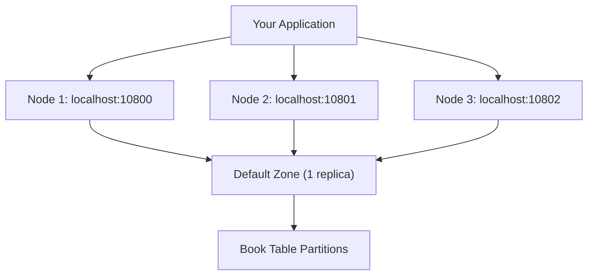

# Chapter 1.2: Getting Started with Your First Application

## Learning Objectives

By completing this chapter, you will:

- Create your first connection to an Ignite 3 cluster using multi-node addressing
- Define and create tables using annotations with the default zone
- Perform basic CRUD operations using both Table and SQL APIs
- Understand resource management and proper cleanup patterns
- Apply the concepts from Chapter 1.1 in a working application

## Working with the Reference Application

The **`02-getting-started-app`** provides a complete working example of the concepts covered in this chapter. You can run it alongside your learning to see these patterns in action with the full music store dataset.

**Quick Start**: After reading this chapter, run the reference application:

```bash
cd ignite3-reference-apps/02-getting-started-app
mvn compile exec:java
```

The reference app demonstrates the connection patterns, schema creation, and basic CRUD operations that scale from the Book examples here to the full Artist-Album-Track hierarchy.

## Environment Setup

### Dependencies You Need

For any Ignite 3 application, you need one dependency:

```xml
<dependency>
    <groupId>org.apache.ignite</groupId>
    <artifactId>ignite-client</artifactId>
    <version>3.0.0</version>
</dependency>
```

The client library includes everything needed to connect, define schemas, and perform operations.

### Running Cluster Setup

Before your first application, you need an Ignite 3 cluster running. The fastest approach uses Docker:

**Prerequisites**: 

- Docker 20.10.0 or newer and Docker Compose 2.23.1 or newer
- See [Apache Ignite 3 Docker Installation Guide](https://ignite.apache.org/docs/ignite3/latest/installation/installing-using-docker) for setup instructions

#### Unix-based Systems (Linux, macOS)

```bash
# Clone and start the reference cluster
git clone <this-repo>
cd ignite3-reference-apps/00-docker

# Automated setup (recommended)
./init-cluster.sh
```

The `init-cluster.sh` script automatically detects your Docker Compose environment and creates a 3-node cluster perfect for development and learning.

#### Windows and Other Systems

**Option 1: Manual Docker Setup**

```bash
# Clone and navigate to Docker setup
git clone <this-repo>
cd ignite3-reference-apps/00-docker

# Start the cluster (use docker-compose or docker compose based on your installation)
docker-compose up -d
# OR: docker compose up -d
```

Wait 30-60 seconds for containers to start, then initialize using PowerShell:

```powershell
# Initialize cluster using PowerShell (Windows 10+)
$body = @{
    metaStorageNodes = @("node1", "node2", "node3")
    cmgNodes = @("node1", "node2", "node3")
    clusterName = "ignite3-reference-cluster"
} | ConvertTo-Json

Invoke-RestMethod -Uri "http://localhost:10300/management/v1/cluster/init" -Method POST -Body $body -ContentType "application/json"
```

**Option 2: Alternative Installation**

For non-Docker setups, follow the platform-specific installation instructions at [https://ignite.apache.org/docs/ignite3/latest/installation/](https://ignite.apache.org/docs/ignite3/latest/installation/).

## Core Concepts in Practice

### Your First Connection

Connecting to Ignite 3 requires understanding how client connections work with cluster topology. Based on the concepts from Chapter 1.1, we'll use multi-node addressing for optimal performance:

```java
try (IgniteClient client = IgniteClient.builder()
        .addresses("localhost:10800", "localhost:10801", "localhost:10802")
        .build()) {
    
    System.out.println("Connected to: " + client.connections());
       
    // Your application logic here
}
// Client automatically closes and cleans up resources
```

**Why Multi-Node Addressing Matters:**

- **Partition Awareness**: Client connects to all nodes for direct partition mapping
- **Try-with-resources**: Ensures proper cleanup even if exceptions occur  
- **Failover**: Multiple addresses provide redundancy if individual nodes are unavailable
- **Performance**: Implements the connection performance framework from Chapter 1.1

### Using the Default Zone

Following the decision framework from Chapter 1.1, we'll use the default zone for this first implementation since we're in a development/learning scenario:

```java
@Table  // No zone specification = uses default zone
public class Book {
    @Id
    @Column(value = "id", nullable = false)
    private Integer id;
    
    @Column(value = "title", nullable = false, length = 100)
    private String title;
    
    @Column(value = "author", nullable = false, length = 50)
    private String author;
    
    // Constructor, getters, setters...
    public Book() {}
    public Book(Integer id, String title, String author) {
        this.id = id;
        this.title = title;
        this.author = author;
    }
    
    public Integer getId() { return id; }
    public void setId(Integer id) { this.id = id; }
    public String getTitle() { return title; }
    public void setTitle(String title) { this.title = title; }
    public String getAuthor() { return author; }
    public void setAuthor(String author) { this.author = author; }
    
    public String toString() {
        return "Book{id=" + id + ", title='" + title + "', author='" + author + "'}";
    }
}
```

**What This Achieves:**

- **Zero Zone Configuration**: Uses the automatically created default zone
- **Type Safety**: Your schema is validated at compile time
- **Automatic DDL**: Ignite generates the table structure
- **Performance**: Annotations drive indexing and partitioning strategies

## Your First Complete Application

### Complete Working Example

Here's a complete Ignite 3 application that implements the concepts from Chapter 1.1:

```java
package com.example;

import org.apache.ignite.client.IgniteClient;
import org.apache.ignite.catalog.annotations.*;
import org.apache.ignite.table.RecordView;

public class HelloIgnite {
    
    @Table  // Uses default zone - perfect for learning and development
    public static class Book {
        @Id
        private Integer id;
        
        @Column(length = 100)
        private String title;
        
        @Column(length = 50)  
        private String author;
        
        public Book() {}
        public Book(Integer id, String title, String author) {
            this.id = id;
            this.title = title;
            this.author = author;
        }
        
        // Getters and setters
        public Integer getId() { return id; }
        public void setId(Integer id) { this.id = id; }
        public String getTitle() { return title; }
        public void setTitle(String title) { this.title = title; }
        public String getAuthor() { return author; }
        public void setAuthor(String author) { this.author = author; }
        
        public String toString() {
            return "Book{id=" + id + ", title='" + title + "', author='" + author + "'}";
        }
    }
    
    public static void main(String[] args) {
        // Implement multi-node connection strategy from Chapter 1.1
        try (IgniteClient client = IgniteClient.builder()
                .addresses("localhost:10800", "localhost:10801", "localhost:10802")
                .build()) {
            
            System.out.println("=== Connected with partition awareness ===");
            
            // 1. Create table (uses default zone automatically)
            client.catalog().createTable(Book.class);
            System.out.println("Table created in default zone");
            
            // 2. Get table view using Table API
            RecordView<Book> books = client.tables()
                .table("Book")
                .recordView(Book.class);
            
            // 3. Insert data using type-safe operations
            books.upsert(null, new Book(1, "1984", "George Orwell"));
            books.upsert(null, new Book(2, "Brave New World", "Aldous Huxley"));
            System.out.println("Books inserted using Table API");
            
            // 4. Read data using type-safe operations
            Book book = books.get(null, new Book(1, null, null));
            System.out.println("Retrieved: " + book);
            
            // 5. Query with SQL API - same data, different access pattern
            var result = client.sql().execute(null, "SELECT id, title, author FROM Book ORDER BY id");
            System.out.println("All books via SQL:");
            while (result.hasNext()) {
                var row = result.next();
                System.out.println("  " + row.intValue("id") + ": " + 
                                 row.stringValue("title") + " by " + 
                                 row.stringValue("author"));
            }
            
            System.out.println("Success! Default zone pattern working perfectly.");
            
        } catch (Exception e) {
            System.err.println("Error: " + e.getMessage());
            e.printStackTrace();
        }
    }
}
```

### What This Example Shows

This application demonstrates the practical implementation of Chapter 1.1 concepts:

1. **Multi-node Connection**: Implements the connection performance framework for partition awareness
2. **Default Zone Usage**: Applies the zone decision framework for development scenarios
3. **Schema Definition**: Uses annotation-driven table creation with zero configuration
4. **Multi-modal API**: Demonstrates both Table API and SQL API accessing the same data
5. **Type Safety**: Shows compile-time type checking throughout the data flow

### Running the Example

```bash
# 1. Start cluster (reference Docker setup)
cd ignite3-reference-apps/00-docker && ./init-cluster.sh

# 2. Run the application
javac -cp ignite-client-3.0.0.jar HelloIgnite.java
java -cp .:ignite-client-3.0.0.jar HelloIgnite
```

**Expected Output:**

```text
=== Connected with partition awareness ===
Table created in default zone
Books inserted using Table API
Retrieved: Book{id=1, title='1984', author='George Orwell'}
All books via SQL:
  1: 1984 by George Orwell
  2: Brave New World by Aldous Huxley
Success! Default zone pattern working perfectly.
```

## Understanding What Happened

### Implementing the Default Zone Strategy

The example demonstrates the default zone strategy from Chapter 1.1:

- **Zero Configuration**: No zone creation code needed - Ignite 3 handles this automatically
- **Immediate Availability**: Table creation succeeds immediately using the pre-existing default zone
- **Development Focus**: Perfect for learning without operational complexity
- **Performance**: Still benefits from multi-node connection patterns

### Connection Pattern in Action

The multi-node connection demonstrates the connection performance framework:



**Benefits Realized:**

- **Partition Awareness**: Client knows exactly which node owns which data partitions
- **No Extra Hops**: Direct routing to the correct node for each operation
- **Automatic Failover**: If one node fails, operations continue seamlessly

### API Integration Pattern

The example shows how the same data model works across APIs:

```java
// Table API - type-safe object operations
Book book = books.get(null, new Book(1, null, null));

// SQL API - flexible query operations on same data  
var result = client.sql().execute(null, "SELECT id, title, author FROM Book");
```

This demonstrates the unified programming model where:

- Table API provides type safety for known-key operations
- SQL API enables complex queries and analytics
- Both APIs access the same underlying distributed data seamlessly

## Building Production Readiness

While this example uses the default zone for development, the patterns you've learned scale directly to production:

### Next Steps in Your Learning Journey

The foundation you've built here supports everything that follows:

1. **Same Connection Patterns**: Multi-node addressing works identically in production
2. **Same Programming Model**: Table and SQL APIs remain consistent across zone types
3. **Same Data Models**: Your POJO classes work with any zone configuration
4. **Production Transition**: Moving to custom zones requires only zone creation, not code changes

### When You'll Need Custom Zones

Based on the decision framework from Chapter 1.1, you'll create custom zones when you need:

- **Fault Tolerance**: Multiple replicas for production data protection
- **Performance Tuning**: Optimized partition counts for specific workloads  
- **Data Isolation**: Separate zones for different data tiers or tenants
- **Compliance Requirements**: Specific data residency or security needs

## Next Steps

The patterns you've mastered form the foundation for everything that follows:

**Continue Building**: These basic patterns scale directly to production applications

- **[Chapter 1.3: Distributed Data Fundamentals](03-distributed-data-fundamentals.md)** - Learn about custom zones, replication strategies, and advanced data distribution patterns

- **Practice with Production Patterns**: The [reference applications](../ignite3-reference-apps/) provide working examples using custom zones and the complete music store dataset, showing how these basic patterns scale to production scenarios