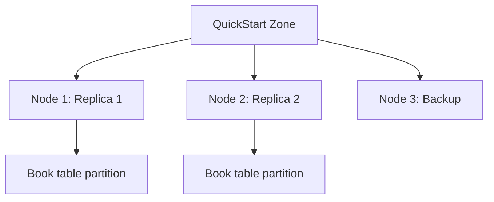
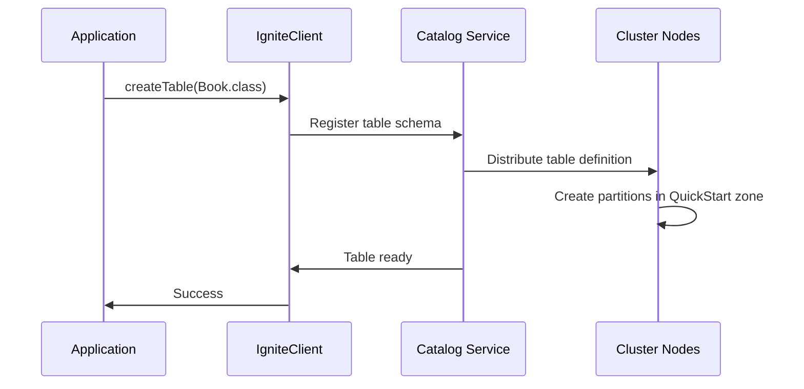

# Chapter 1.2: Getting Started with Your First Application

## Learning Objectives

By completing this chapter, you will:

- Create your first connection to an Ignite 3 cluster
- Define and create tables using annotations
- Perform basic CRUD operations using both Table and SQL APIs
- Understand resource management and proper cleanup patterns

## Working with the Reference Application

The **`02-getting-started-app`** provides a complete working example of the concepts covered in this chapter. You can run it alongside your learning to see these patterns in action with the full music store dataset.

**Quick Start**: After reading this chapter, run the reference application:

```bash
cd ignite3-reference-apps/02-getting-started-app
mvn compile exec:java
```

The reference app demonstrates connection patterns, schema creation, and basic CRUD operations that scale from the simple Book examples here to the full Artist-Album-Track hierarchy.

## Environment Setup

### Dependencies You Need

For any Ignite 3 application, you need just one dependency:

```xml
<dependency>
    <groupId>org.apache.ignite</groupId>
    <artifactId>ignite-client</artifactId>
    <version>3.0.0</version>
</dependency>
```

The client library includes everything needed to connect, define schemas, and perform operations.

### Running Cluster Setup

Before your first application, you need an Ignite 3 cluster running. The simplest approach uses Docker:

```bash
# Clone and start the reference cluster
git clone <this-repo>
cd ignite3-reference-apps/00-docker
docker-compose up -d

# Initialize the cluster (one-time setup)
./init-cluster.sh
```

This creates a 3-node cluster perfect for development and learning.

## Core Concepts in Action

### Your First Connection

Connecting to Ignite 3 is straightforward. The client automatically handles connection pooling, failover, and resource management:

```java
try (IgniteClient client = IgniteClient.builder()
        .addresses("localhost:10800")
        .build()) {
    
    System.out.println("Connected to: " + client.connections());
       
    // Your application logic here
}
// Client automatically closes and cleans up resources
```

**Why This Works:**

- **Try-with-resources**: Ensures proper cleanup even if exceptions occur
- **Single address**: For development; production uses multiple addresses for failover
- **Default timeouts**: Reasonable defaults for most applications

### The Distribution Zone Concept

Before creating tables, you need a distribution zone - think of it as a "container" that controls how your data is distributed:

```java
// Create a zone for our application data
ZoneDefinition zone = ZoneDefinition.builder("QuickStart")
    .ifNotExists()
    .replicas(2)        // Keep 2 copies of each piece of data
    .storageProfiles("default")
    .build();

client.catalog().createZone(zone);
```

**Zone Benefits:**

- **Fault Tolerance**: Multiple replicas protect against node failures
- **Performance Control**: Choose optimal replica count for your workload
- **Storage Selection**: Pick storage engines optimized for your access patterns

### Creating Your First Table

Instead of writing SQL DDL, Ignite 3 lets you define tables using Java classes:

```java
@Table(zone = @Zone(value = "QuickStart", storageProfiles = "default"))
public class Book {
    @Id
    @Column(value = "id", nullable = false)
    private Integer id;
    
    @Column(value = "title", nullable = false, length = 100)
    private String title;
    
    @Column(value = "author", nullable = false, length = 50)
    private String author;
    
    // Constructor, getters, setters...
}
```

**What This Achieves:**

- **Type Safety**: Your schema is validated at compile time
- **Automatic DDL**: Ignite generates the table structure
- **Zone Assignment**: Data goes to the "QuickStart" distribution zone
- **Performance**: Annotations drive indexing and partitioning strategies

## Your First Complete Application

> [!TIP]
> **Complete Example**: This minimal application demonstrates all essential Ignite 3 patterns in just 40 lines - connection, schema definition, data operations, and SQL queries. It's a perfect starting point for understanding the platform.

### Complete Working Example

Here's a minimal but complete Ignite 3 application that demonstrates all the essential patterns:

```java
package com.example;

import org.apache.ignite.client.IgniteClient;
import org.apache.ignite.catalog.annotations.*;
import org.apache.ignite.catalog.definitions.ZoneDefinition;
import org.apache.ignite.table.RecordView;

public class HelloIgnite {
    
    @org.apache.ignite.catalog.annotations.Table(zone = @Zone(value = "QuickStart", storageProfiles = "default"))
    public static class Book {
        @Id
        private Integer id;
        
        @Column(length = 100)
        private String title;
        
        public Book() {}
        public Book(Integer id, String title) {
            this.id = id;
            this.title = title;
        }
        
        // Getters and setters
        public Integer getId() { return id; }
        public void setId(Integer id) { this.id = id; }
        public String getTitle() { return title; }
        public void setTitle(String title) { this.title = title; }
        
        public String toString() {
            return "Book{id=" + id + ", title='" + title + "'}";
        }
    }
    
    public static void main(String[] args) {
        try (IgniteClient client = IgniteClient.builder()
                .addresses("localhost:10800")
                .build()) {
            
            // 1. Create zone
            client.catalog().createZone(
                ZoneDefinition.builder("QuickStart")
                    .ifNotExists()
                    .replicas(2)
                    .storageProfiles("default")
                    .build()
            );
            
            // 2. Create table
            client.catalog().createTable(Book.class);
            
            // 3. Insert data
            RecordView<Book> books = client.tables()
                .table("Book")
                .recordView(Book.class);
            
            books.upsert(null, new Book(1, "1984"));
            
            // 4. Read data
            Book book = books.get(null, new Book(1, null));
            System.out.println("Found: " + book);
            
            // 5. Query with SQL
            var result = client.sql().execute(null, "SELECT * FROM Book");
            while (result.hasNext()) {
                var row = result.next();
                System.out.println("SQL result: " + row.stringValue("title"));
            }
            
        } catch (Exception e) {
            e.printStackTrace();
        }
    }
}
```

### What This Example Shows

**In just 40 lines**, this application demonstrates:

1. **Connection**: Simple client setup with automatic resource management
2. **Schema**: Table creation from Java classes using annotations
3. **Distribution**: Zone configuration controls data placement
4. **Storage**: Insert and retrieve operations using type-safe APIs  
5. **Querying**: SQL access to the same data

### Running the Example

```bash
# 1. Start cluster (reference Docker setup)
cd ignite3-reference-apps/00-docker && ./init-cluster.sh

# 2. Run the application
javac -cp ignite-client-3.0.0.jar HelloIgnite.java
java -cp .:ignite-client-3.0.0.jar HelloIgnite
```

**Expected Output:**

```text
Found: Book{id=1, title='1984'}
SQL result: 1984
```

## Understanding What Happened

### The Distribution Zone

When you created the "QuickStart" zone, Ignite 3 configured how your data spreads across cluster nodes:



**Why This Matters:**

- **Fault Tolerance**: With 2 replicas, your data survives node failures
- **Load Distribution**: Reads and writes spread across multiple nodes
- **Scalability**: Add more nodes to handle more data and traffic

### The Table Creation Process



### Type Safety in Action

Notice how the same `Book` class works for both object operations and SQL queries:

```java
// Object API - type safe
books.upsert(null, new Book(1, "1984"));
Book book = books.get(null, new Book(1, null));

// SQL API - same data, different access pattern
var result = client.sql().execute(null, "SELECT * FROM Book");
```

**This dual API approach means:**

- Use objects when you know exact keys and want type safety
- Use SQL for complex queries, joins, and analytical operations
- Both APIs access the same underlying distributed data

## Building Confidence

The patterns you've mastered form the foundation for everything that follows. Your learning journey continues with:

### Learning Strategy: Simple to Complete

This chapter demonstrates core concepts through a simplified Book entity that mirrors the music store dataset used throughout this primer. The patterns you learn here apply directly to the Artist, Album, and Track entities used extensively in later modules.

## Next Steps

**Continue Building**: The basic patterns here scale directly to production applications

- **[Chapter 1.3: Distributed Data Fundamentals](03-distributed-data-fundamentals.md)** - Learn how simple schemas handle distribution, replication, and fault tolerance

- **Practice Immediately**: The [reference applications](../ignite3-reference-apps/) provide working examples using the complete music store dataset, showing how these basic patterns scale to production scenarios
