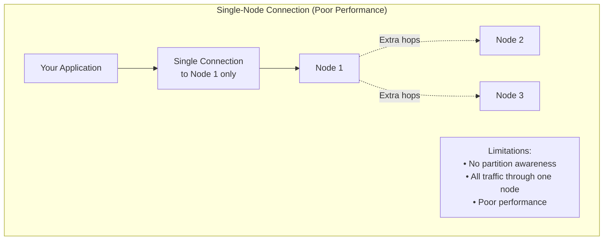
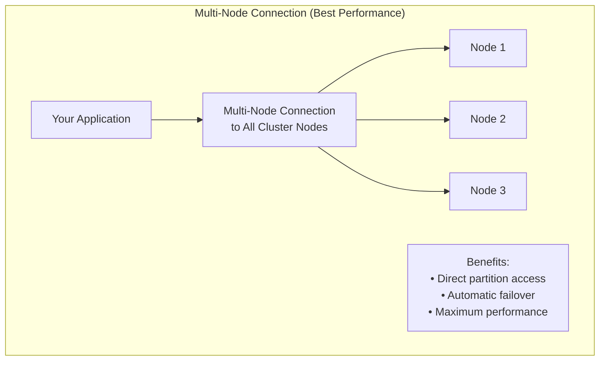
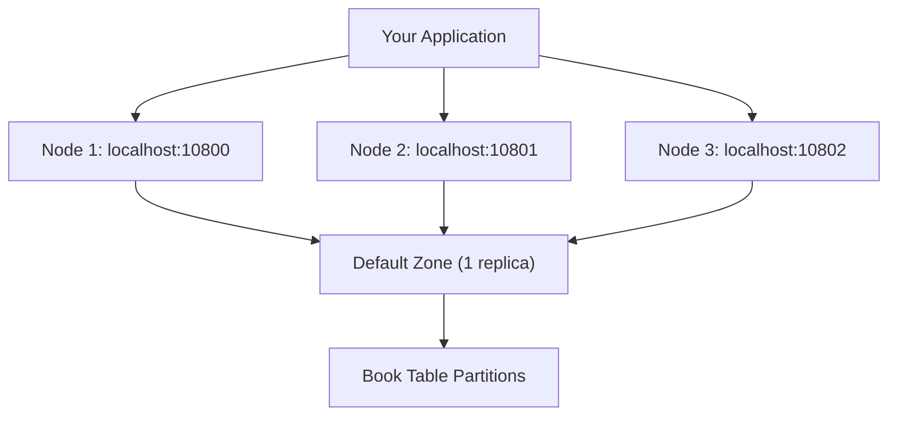

<!--
Licensed under Creative Commons Attribution-NonCommercial-ShareAlike 4.0 International (CC BY-NC-SA 4.0)
SPDX-License-Identifier: CC-BY-NC-SA-4.0
For full license text, see LICENSE-CC-BY-NC-SA-4.0
-->

# Chapter 1.2: Your First Ignite 3 Application

Your development environment fails to connect to the Ignite cluster because of Docker networking issues, or your first table creation fails with schema validation errors. Connection attempts timeout, your annotated classes don't generate tables, or CRUD operations throw partition mapping exceptions.

The cluster runs but your application can't find any nodes. Multi-node addressing configuration is incorrect, resource cleanup issues cause memory leaks, or the client connects to only one node instead of establishing partition awareness across the cluster.

This chapter solves these first-application problems through proper cluster setup, correct connection configuration, and working schema definitions.

## Environment Setup

### Client Library Configuration

Your build requires the Ignite 3 client library. Both Maven and Gradle are supported:

**Maven Configuration (pom.xml):**

```xml
<dependency>
    <groupId>org.apache.ignite</groupId>
    <artifactId>ignite-client</artifactId>
    <version>3.0.0</version>
</dependency>
```

**Gradle Configuration (build.gradle):**

```gradle
dependencies {
    implementation 'org.apache.ignite:ignite-client:3.0.0'
}
```

**Gradle with Kotlin DSL (build.gradle.kts):**

```kotlin
dependencies {
    implementation("org.apache.ignite:ignite-client:3.0.0")
}
```

This single dependency provides the complete client API for connections, schema operations, and data access.

### Cluster Bootstrap Process

Ignite 3 requires an initialized cluster before applications can connect. Unlike traditional databases that run as single instances, Ignite operates as a distributed system where multiple nodes work together to store and process data. The bootstrap process creates this initial cluster topology and prepares it to accept client connections.

Docker provides the fastest path to a working cluster for development:

**Prerequisites**:

- Docker 20.10.0+ and Docker Compose 2.23.1+
- Network ports 10300-10302 and 10800-10802 available
- See [Apache Ignite 3 Docker Installation Guide](https://ignite.apache.org/docs/ignite3/latest/installation/installing-using-docker) for platform-specific setup

#### Unix-based Systems (Linux, macOS)

```bash
# Clone and start the reference cluster
git clone <this-repo>
cd ignite3-reference-apps/00-docker

# Automated setup
./init-cluster.sh
```

The script detects your Docker Compose version and creates a 3-node cluster with proper networking configuration.

#### Windows and Manual Setup

**Docker Compose Approach**

```bash
# Clone and navigate to Docker setup
git clone <this-repo>
cd ignite3-reference-apps/00-docker

# Start containers (use your Docker Compose command)
docker-compose up -d
# OR: docker compose up -d
```

Wait 30-60 seconds for container startup, then initialize with PowerShell:

```powershell
# Initialize cluster using REST API
$body = @{
    metaStorageNodes = @("node1", "node2", "node3")
    cmgNodes = @("node1", "node2", "node3")
    clusterName = "ignite3-reference-cluster"
} | ConvertTo-Json

Invoke-RestMethod -Uri "http://localhost:10300/management/v1/cluster/init" -Method POST -Body $body -ContentType "application/json"
```

**Native Installation Alternative**

For production environments or non-Docker setups, use platform-specific installation from [https://ignite.apache.org/docs/ignite3/latest/installation/](https://ignite.apache.org/docs/ignite3/latest/installation/).

## Client Connection Implementation

### Multi-Node Connection Strategy

Ignite 3's distributed architecture requires proper client configuration to achieve optimal performance and reliability. Unlike single-database connections, distributed systems benefit from connecting to multiple nodes simultaneously to enable partition-aware operations and automatic failover.

**Why Multi-Node Connections Matter:**

When you connect to all cluster nodes, the client library builds a complete topology map that shows which data partitions live on which nodes. This enables direct routing - your operations go straight to the node that holds the data, eliminating network hops through intermediate nodes.





```java
try (IgniteClient client = IgniteClient.builder()
        .addresses("localhost:10800", "localhost:10801", "localhost:10802")
        .build()) {
    
    System.out.println("Connected to: " + client.connections());
       
    // Your application logic here
}
// Client automatically closes and cleans up resources
```

**Multi-Node Connection Benefits:**

- **Partition Awareness**: Client discovers partition locations across all nodes
- **Resource Management**: Try-with-resources prevents connection leaks  
- **Failover Capability**: Multiple addresses provide redundancy when nodes fail
- **Performance Optimization**: Direct partition routing eliminates network hops
- **Load Distribution**: Requests spread across all available nodes

```java
// Good: Connect to all nodes for best performance
IgniteClient client = IgniteClient.builder()
    .addresses("node1:10800", "node2:10800", "node3:10800")
    .build();

// Poor: Single node creates bottlenecks  
IgniteClient client = IgniteClient.builder()
    .addresses("node1:10800")  // Only one node - bad performance
    .build();
```

## Ignite 3 Hello World

### Your First Distributed Application

This demonstrates the core Ignite 3 Java API concepts in a working application:

```java
package com.example;

import org.apache.ignite.client.IgniteClient;
import org.apache.ignite.catalog.annotations.*;
import org.apache.ignite.table.RecordView;

public class HelloIgnite {
    
    @Table  // Uses default zone - perfect for learning and development
    public static class Book {
        @Id
        private Integer id;
        
        @Column(length = 100)
        private String title;
        
        @Column(length = 50)  
        private String author;
        
        public Book() {}
        public Book(Integer id, String title, String author) {
            this.id = id;
            this.title = title;
            this.author = author;
        }
        
        // Getters and setters
        public Integer getId() { return id; }
        public void setId(Integer id) { this.id = id; }
        public String getTitle() { return title; }
        public void setTitle(String title) { this.title = title; }
        public String getAuthor() { return author; }
        public void setAuthor(String author) { this.author = author; }
        
        public String toString() {
            return "Book{id=" + id + ", title='" + title + "', author='" + author + "'}";
        }
    }
    
    public static void main(String[] args) {
        // Implement multi-node connection strategy
        try (IgniteClient client = IgniteClient.builder()
                .addresses("localhost:10800", "localhost:10801", "localhost:10802")
                .build()) {
            
            System.out.println("=== Connected with partition awareness ===");
            
            // 1. Create table from POJO
            client.catalog().createTable(Book.class);
            System.out.println("Table created in default zone");
            
            // 2. Get table view using Table API
            RecordView<Book> books = client.tables()
                .table("Book")
                .recordView(Book.class);
            
            // 3. Insert data using type-safe operations
            books.upsert(null, new Book(1, "1984", "George Orwell"));
            books.upsert(null, new Book(2, "Brave New World", "Aldous Huxley"));
            System.out.println("Books inserted using Table API");
            
            // 4. Read data using type-safe operations
            Book book = books.get(null, new Book(1, null, null));
            System.out.println("Retrieved: " + book);
            
            // 5. Query with SQL API - same data, different API access method
            var result = client.sql().execute(null, "SELECT id, title, author FROM Book ORDER BY id");
            System.out.println("All books via SQL:");
            while (result.hasNext()) {
                var row = result.next();
                System.out.println("  " + row.intValue("id") + ": " + 
                                 row.stringValue("title") + " by " + 
                                 row.stringValue("author"));
            }
            
            System.out.println("Success!");
            
        } catch (Exception e) {
            System.err.println("Error: " + e.getMessage());
            e.printStackTrace();
        }
    }
}
```

### Implementation Analysis

This application solves common first-application problems:

1. **Multi-node Connection**: Establishes partition awareness across cluster nodes
2. **Default Zone Usage**: Eliminates zone configuration complexity for development
3. **Schema Definition**: Uses annotation-driven table creation without manual DDL
4. **Multi-modal API**: Demonstrates Table API and SQL API accessing the same data
5. **Type Safety**: Provides compile-time validation throughout the data pipeline

### Running the Application

```bash
# 1. Start cluster (reference Docker setup)
cd ignite3-reference-apps/00-docker && ./init-cluster.sh

# 2. Create and run HelloIgnite.java (use IDE of choice)
```

> [!TIP]
> Look at the `HelloWorldApp.java` in the reference 02-getting-started-app if you are having problems.

**Expected Output:**

```text
=== Connected with partition awareness ===
Table created in default zone
Books inserted using Table API
Retrieved: Book{id=1, title='1984', author='George Orwell'}
All books via SQL:
  1: 1984 by George Orwell
  2: Brave New World by Aldous Huxley
Success!
```

## Technical Implementation Details

### Default Zone Strategy

The implementation demonstrates how default zone usage eliminates configuration complexity:

- **Zero Configuration**: No zone creation code required - Ignite 3 provides this automatically
- **Immediate Availability**: Table creation succeeds using the pre-existing default zone
- **Development Efficiency**: Removes operational complexity while maintaining functionality
- **Performance Retention**: Multi-node connection configuration still provides optimization benefits

### Distributed Connection Implementation  

The multi-node connection establishes partition awareness across the cluster:



**Operational Benefits:**

- **Partition Awareness**: Client maps data partitions to specific nodes
- **Direct Routing**: Operations route directly to partition-owning nodes
- **Transparent Failover**: Node failures trigger automatic connection redistribution

### Unified API Access Model

The implementation demonstrates how the Table and SQL APIs can access the same distributed data:

```java
// Table API - type-safe object operations
Book book = books.get(null, new Book(1, null, null));

// SQL API - flexible query operations on same data  
var result = client.sql().execute(null, "SELECT id, title, author FROM Book");
```

This unified programming model provides:

- Table API delivers type safety for key-based operations
- SQL API enables complex queries and analytics
- Both APIs access identical underlying distributed partitions
