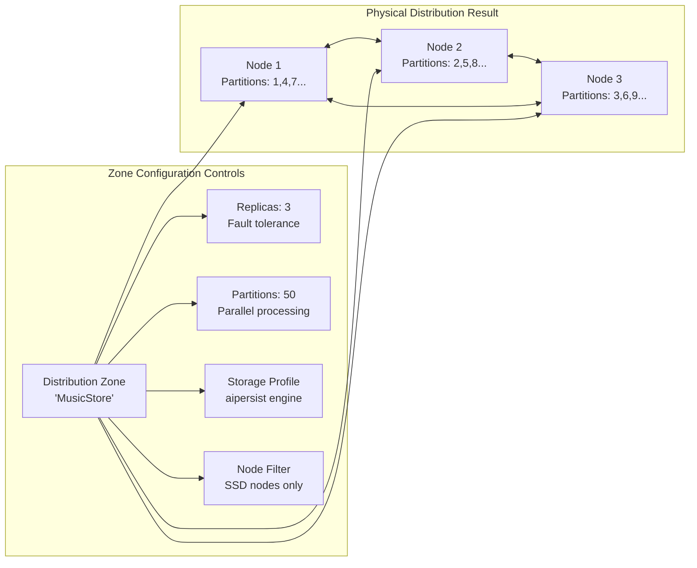
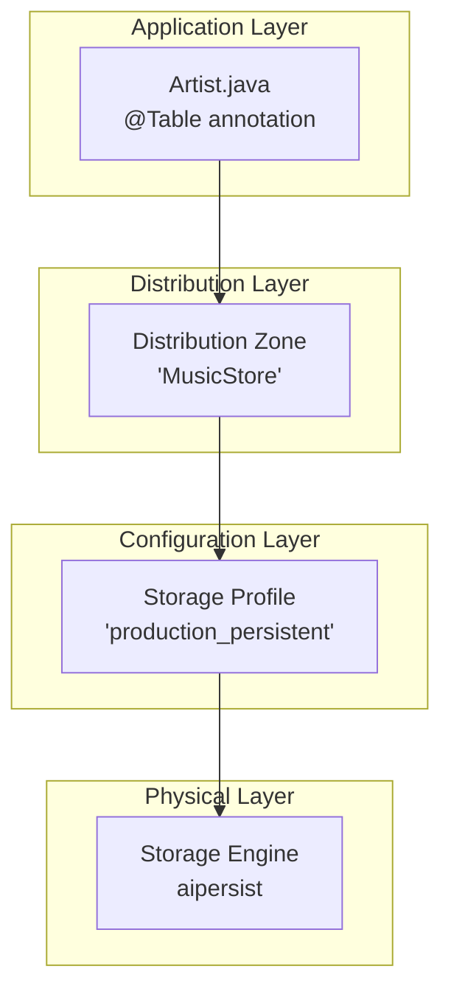
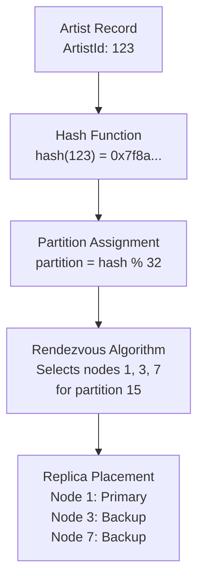
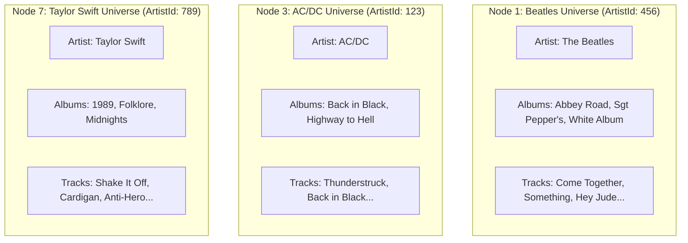

<!--
Licensed under Creative Commons Attribution-ShareAlike 4.0 International (CC BY-SA 4.0)
SPDX-License-Identifier: CC-BY-SA-4.0
For full license text, see LICENSE-CC-BY-SA-4.0
-->

# Chapter 1.3: Distributed Data Fundamentals

Your music streaming platform just hit 50,000 concurrent users, but Artist profile pages are loading in 3 seconds instead of milliseconds. The monitoring dashboard shows the problem: when users browse "The Beatles" discography, your application makes separate network calls to fetch the artist from node 1, albums from node 2, and tracks scattered across nodes 1, 2, and 3. Each network hop adds 20-50ms latency, and the database spends more time moving data between nodes than actually serving queries.

Meanwhile, your single-table Track searches execute in 5 milliseconds because all Track data for a given ArtistId lives together on the same nodes. The difference isn't the queries—it's data placement strategy.

This is the fundamental challenge every distributed application faces: how to place related data together while maintaining even distribution, fault tolerance, and query performance. Your database needs to be smart enough to keep Artist, Album, and Track records for "The Beatles" on the same physical nodes, but spread different artists across the cluster for load balancing.

## The Hidden Cost of Random Data Distribution

Traditional distributed databases scatter your data randomly across nodes, creating invisible performance penalties that only surface under load. Your development environment with 1,000 tracks works fine, but production with 50 million tracks exposes the hidden costs of poor data placement.

- **Network Amplification**: Simple queries like "show artist with albums" become 3-4 network operations instead of 1 local operation. Each network hop multiplies response time by the number of relationships in your query.

- **Resource Waste**: Your cluster spends 60% of its network bandwidth moving data between nodes for joins, instead of serving more user requests. CPU cycles burn on serializing, transferring, and deserializing data that could stay local.

- **Unpredictable Performance**: The same query runs fast when data happens to be colocated, but slow when it's distributed. Users experience inconsistent response times that vary based on which nodes store their data.

- **Developer Confusion**: Application developers can't predict query performance because the database's internal data placement decisions are invisible to application logic.

Ignite 3 solves these problems through **intelligent data distribution** that considers your application's access patterns rather than randomly scattering records across nodes.

### How Distribution Zones Solve Data Placement Problems

Distribution zones are Ignite 3's solution to the data placement problem. Instead of randomly scattering your data, zones let you define intelligent placement policies that match your application's access patterns.

- **The Problem Without Zones**: Your Artist table uses default random distribution. Artist #123 (The Beatles) ends up on node 1, but their albums scatter across nodes 2 and 3. When users browse The Beatles' discography, your application makes network calls to three different nodes, tripling response time.

- **The Solution With Zones**: You create a "MusicStore" zone that keeps Artist, Album, and Track records with the same ArtistId on the same nodes. Now The Beatles' complete discography lives together, turning 3 network operations into 1 local operation.

Behind the scenes, Ignite 3 uses the **Rendezvous (Highest Random Weight) algorithm** to consistently place data without requiring coordination between nodes. This algorithm guarantees that Artist #123 always maps to the same set of nodes, enabling predictable colocation.



### Storage Hierarchy: From Tables to Physical Storage

Ignite 3's storage system connects your Java tables to physical disk storage through a four-layer hierarchy that gives you precise control over performance and durability characteristics:



**Layer 1: Table → Zone Assignment**
Your `@Table(zone = @Zone("MusicStore"))` annotation assigns the Artist table to the MusicStore distribution zone, which controls data placement policies.

**Layer 2: Zone → Distribution Policies**
The MusicStore zone defines where your data lives (which nodes), how many copies exist (replica count), and how data spreads (partition count).

**Layer 3: Zone → Storage Profile**
Storage profiles link zones to specific storage engines, letting you use fast in-memory storage for session data and persistent storage for business data.

**Layer 4: Profile → Physical Storage**
Storage engines determine how data is physically stored: **aimem** for pure in-memory, **aipersist** for production persistence, or **rocksdb** for write-heavy workloads.

This hierarchy solves the data placement problem by connecting your business logic (Artist entities) directly to storage characteristics (persistence, performance, fault tolerance) through declarative configuration.

### From Development to Production: Zone Evolution Story

**Development Phase:** Your music app starts simple with the default zone (25 partitions, 1 replica, aimem storage). Perfect for rapid iteration with 1,000 sample tracks.

**Testing Phase:** You need realistic data distribution with persistent storage but want fast startup times. Create a custom zone optimized for integration testing:

```java
// Testing zone: balanced performance and persistence
ZoneDefinition testingZone = ZoneDefinition.builder("MusicStore_Test")
    .partitions(25)                    // Moderate partitioning for test data
    .replicas(2)                      // Basic fault tolerance
    .storageProfiles("aipersist_profile") // Persistent storage like production
    .build();

ignite.catalog().createZone(testingZone);
```

**Production Phase:** Your platform serves 10M users with strict uptime requirements. Production zones balance performance, fault tolerance, and resource utilization:

```java
// Production zone: optimized for scale and reliability
ZoneDefinition productionZone = ZoneDefinition.builder("MusicStore_Prod")
    .partitions(64)                    // High parallelism for 50M tracks
    .replicas(3)                      // Survive 2 node failures
    .storageProfiles("production_persistent") // Tuned aipersist configuration
    .build();

ignite.catalog().createZone(productionZone);
```

**Zone Benefits at Scale:**

- **Predictable Performance**: 64 partitions provide consistent load distribution across a 16-node cluster
- **Fault Tolerance**: 3 replicas ensure 99.99% availability during rolling updates and hardware failures
- **Storage Optimization**: Production-tuned aipersist profiles balance memory usage with persistence guarantees
- **Resource Isolation**: Different zones for operational data vs analytical workloads prevent resource contention

### Business-Driven Consistency Decisions

Consistency mode choices should align with business requirements rather than technical preferences. Your music platform has different consistency needs for different types of data.

#### Strong Consistency for Financial Data

**The Business Problem:** When customers purchase albums, payment processing must be 100% consistent. A network partition during checkout cannot result in charging customers without delivering content, or delivering content without payment.

```java
// Financial transactions require absolute consistency
@Table(zone = @Zone(value = "Payments", storageProfiles = "production_persistent"))
public class PaymentTransaction {
    @Id Integer transactionId;
    @Column BigDecimal amount;
    @Column String customerId;
    @Column String status; // PENDING, COMPLETED, FAILED
}
```

**Strong Consistency Guarantee:** Operations require majority consensus. During network partitions, the system chooses temporary unavailability over data inconsistency. Better to show "Payment processing unavailable" than to create accounting discrepancies.

#### High Availability for Catalog Data

**The Business Problem:** Music catalog browsing must stay available during infrastructure issues. Users should be able to browse artists and albums even if some cluster nodes are offline, because catalog inconsistencies are temporary and self-healing.

```java
// Catalog browsing prioritizes availability
ZoneDefinition catalogZone = ZoneDefinition.builder("MusicCatalog")
    .partitions(32)
    .replicas(3)                    // Extra replicas for read scaling
    .storageProfiles("catalog_optimized")
    .build();
ignite.catalog().createZone(catalogZone);

// Configure for high availability
client.sql().execute(null, 
    "ALTER ZONE MusicCatalog SET CONSISTENCY MODE HIGH_AVAILABILITY");
```

**High Availability Benefit:** Read and write operations continue even when majority nodes are offline. Temporary inconsistencies (like new albums appearing on some nodes before others) resolve automatically when connectivity restores.

**Business Impact:** Users continue discovering and enjoying music during infrastructure maintenance, generating revenue and engagement even when parts of the system are degraded.

### The Rendezvous Algorithm: Predictable Data Placement

Ignite 3 uses the **Rendezvous (Highest Random Weight) algorithm** to solve the distributed data placement problem. This algorithm ensures that Artist #123 always maps to the same set of nodes, regardless of which application server makes the request.



**Algorithm Benefits for Music Platform:**

- **Predictable Routing**: Every application server independently calculates that Artist #123 (The Beatles) lives on nodes 1, 3, and 7. No coordination or lookup tables required.

- **Colocation Enablement**: When Album records use the same ArtistId as their partition key, they automatically land on the same nodes as their parent Artist. The Beatles' albums and tracks all live together.

- **Minimal Rebalancing**: When you add node 8 to the cluster, only partitions with the highest random weight for node 8 move. Most data stays in place, minimizing network traffic during scaling operations.

- **Load Distribution**: Random weights ensure even distribution across available nodes, preventing hot spots where one node stores disproportionate amounts of popular artists.

This algorithm transforms unpredictable data placement into a deterministic system where related music data naturally clusters together while maintaining even load distribution.

## Solving the Cross-Partition Join Performance Crisis

### The Real Cost of Random Data Distribution

Your music platform's artist profile pages are loading slowly because traditional distributed databases scatter related data randomly. Here's what happens when a user clicks "View The Beatles":

**Without Colocation (Current Reality):**

```java
// This innocent-looking code hits multiple nodes
Artist beatles = artists.get(null, artistKey);           // Network call to Node 1
Collection<Album> albums = albums.getAll(null, 
    beatles.getAlbumIds());                              // Network calls to Nodes 2, 3, 7
Collection<Track> tracks = tracks.getAll(null,
    albums.stream().flatMap(a -> a.getTrackIds()));     // Network calls to Nodes 1, 4, 6, 8
```

**Performance Impact Analysis:**

- **Network Operations**: 6 separate cluster calls instead of 1
- **Latency Multiplication**: 20ms × 6 operations = 120ms just for network overhead
- **Resource Waste**: Each node serializes, transfers, and deserializes data that could stay local
- **Unpredictable Performance**: Query time varies from 50ms to 300ms depending on data placement

**Business Impact:** Users experience inconsistent page load times that feel broken compared to single-table operations that execute in 5ms.

### Colocation: The Solution to Cross-Node Query Performance

Colocation solves the distributed join problem by ensuring related data lives together. Instead of hoping related records randomly end up on the same nodes, you explicitly design data placement to match your query patterns.

**The Colocation Strategy for Music Data:**

```java
// Step 1: Artist anchor table (no colocation needed)
@Table(zone = @Zone(value = "MusicStore", storageProfiles = "production_persistent"))
public class Artist {
    @Id private Integer ArtistId;  // This becomes the colocation anchor
    @Column private String Name;
}

// Step 2: Albums follow Artist placement
@Table(zone = @Zone(value = "MusicStore", storageProfiles = "production_persistent"),
       colocateBy = @ColumnRef("ArtistId"))  // Follow Artist partitioning
public class Album {
    @Id private Integer AlbumId;
    @Id private Integer ArtistId;  // Must be part of primary key for colocation
    @Column private String Title;
}

// Step 3: Tracks follow the same pattern
@Table(zone = @Zone(value = "MusicStore", storageProfiles = "production_persistent"),
       colocateBy = @ColumnRef("ArtistId"))  // Same colocation key
public class Track {
    @Id private Integer TrackId;
    @Column private Integer AlbumId;
    @Column private Integer ArtistId;  // Colocation field
    @Column private String Name;
}
```

**Physical Data Placement Result:**



**Performance Transformation:**

- **Network Operations**: 6 calls reduced to 1 local operation
- **Response Time**: 120ms reduced to 5ms (24x improvement)
- **Resource Efficiency**: Zero network serialization for artist browsing
- **Predictable Performance**: Every artist profile loads in consistent time

### Local Joins: The Power of Colocated Data

Colocation transforms expensive distributed joins into fast local operations. When The Beatles' Artist, Album, and Track records all live on the same node, complex queries execute without any network traffic.

**High-Performance Artist Profile Query:**

```java
// This complex join executes entirely on one node due to colocation
Statement artistProfileQuery = client.sql().statementBuilder()
    .query("""
        SELECT a.Name as artist_name, 
               al.Title as album_title, 
               t.Name as track_name,
               t.Milliseconds as duration
        FROM Artist a 
        JOIN Album al ON a.ArtistId = al.ArtistId 
        JOIN Track t ON al.AlbumId = t.AlbumId 
        WHERE a.ArtistId = ?
        ORDER BY al.Title, t.TrackNumber
        """)
    .pageSize(100)
    .build();

// Executes on single node - no network overhead
var result = client.sql().execute(null, artistProfileQuery, 456); // The Beatles

while (result.hasNext()) {
    SqlRow row = result.next();
    String artistName = row.stringValue("ARTIST_NAME");   // Ignite normalizes to uppercase
    String albumTitle = row.stringValue("ALBUM_TITLE");
    String trackName = row.stringValue("TRACK_NAME");
    int duration = row.intValue("DURATION");
    
    System.out.printf("%s - %s - %s (%d ms)%n", 
        artistName, albumTitle, trackName, duration);
}
```

**Performance Comparison:**

- **Without Colocation:** Query coordinator fetches data from 3+ nodes, transfers results over network, processes joins in memory
- **With Colocation:** All data already exists on executing node, join processes in local memory, returns results directly

**Result:** Artist profile queries execute in 5-15ms instead of 100-300ms, providing responsive user experience that scales to millions of concurrent users.

> [!TIP]
> **SQL Column Naming:** Ignite 3 normalizes column names to uppercase following SQL standards. Use `"quoted_names"` in your SQL when you need case-sensitive column access.

### Batch Operations: Multiplying Colocation Benefits

Colocation benefits multiply when you process multiple related records. Loading a complete artist discography becomes a single-node operation instead of a cluster-wide scatter-gather.

**Efficient Discography Loading:**

```java
// All operations execute on the same node due to colocation
public class EfficientMusicBrowser {
    
    public ArtistDiscography loadCompleteDiscography(Integer artistId) {
        // Single node handles all related data
        Artist artist = artists.get(null, createArtistKey(artistId));
        
        if (artist == null) return null;
        
        // These batch operations all hit the same node
        Collection<Album> albums = albums.getAll(null, 
            generateAlbumKeys(artistId));
        
        Collection<Track> tracks = tracks.getAll(null,
            generateTrackKeys(artistId));
        
        return new ArtistDiscography(artist, albums, tracks);
    }
    
    // Batch operations for popular content
    public Map<Integer, Artist> loadFeaturedArtists(List<Integer> artistIds) {
        Collection<Artist> keys = artistIds.stream()
            .map(this::createArtistKey)
            .collect(Collectors.toList());
            
        return artists.getAll(null, keys).stream()
            .collect(Collectors.toMap(Artist::getArtistId, artist -> artist));
    }
}
```

**Performance Impact:**

- **Network Round-trips**: Reduced from O(records) to O(1) per artist
- **Resource Utilization**: CPU focused on business logic instead of network serialization
- **Predictable Latency**: Batch size doesn't affect response time linearly
- **Cache Efficiency**: Related data loaded together improves memory locality

## Storage Engines: Choosing the Right Physical Storage

Your data placement strategy means nothing if the wrong storage engine kills performance. Ignite 3 provides three storage engines optimized for different performance and durability requirements.

### The Storage Engine Decision Tree

**Development Phase: aimem (Default)**
When you're building features and need fast iteration:

```java
// Development uses default aimem automatically
@Table  // No storage profile specified = aimem
public class Artist {
    @Id Integer artistId;
    @Column String name;
}
```

**Characteristics:** Pure in-memory storage, blazing fast, no persistence (perfect for development)

**Production Phase: aipersist**
When you need the music platform to survive server restarts:

```java
// Production storage profiles configured at node level
@Table(zone = @Zone(value = "MusicStore", storageProfiles = "production_persistent"))
public class Artist {
    @Id Integer artistId;
    @Column String name;
}
```

**Characteristics:** Hybrid memory/disk, persistent across restarts, optimized for mixed read/write workloads

**Special Cases: rocksdb (Experimental)**
For write-heavy analytics ingestion:

```java
// Analytics tables with high write throughput
@Table(zone = @Zone(value = "Analytics", storageProfiles = "rocksdb_profile"))
public class PlayEvent {
    @Id Long eventId;
    @Column Instant timestamp;
    @Column Integer trackId;
}
```

**Characteristics:** LSM-tree optimization for write-heavy workloads, experimental status

### Performance Characteristics Comparison

| Engine | Write Speed | Read Speed | Memory Usage | Startup Time | Data Survives Restart |
|--------|-------------|------------|--------------|--------------|------------------------|
| **aimem** | Excellent | Excellent | High | Fast | ❌ No |
| **aipersist** | Good | Excellent | Medium | Medium | ✅ Yes |
| **rocksdb** | Excellent | Good | Low | Fast | ✅ Yes |

**Business Decision Framework:**

- **User sessions, temporary caches:** aimem for maximum speed
- **Music catalog, customer data:** aipersist for production reliability  
- **Event logs, analytics ingestion:** rocksdb for write optimization

### Fault Tolerance Through Intelligent Replication

Your music platform needs different fault tolerance strategies for different types of data. User sessions can be rebuilt, but financial transactions cannot be lost.

**Replication Strategy by Business Impact:**

```java
// Critical business data: Maximum fault tolerance
ZoneDefinition financialZone = ZoneDefinition.builder("Financial")
    .partitions(32)     
    .replicas(3)                    // Survive 2 simultaneous node failures
    .storageProfiles("encrypted_persistent")
    .build();

// Music catalog: Balance availability and cost
ZoneDefinition catalogZone = ZoneDefinition.builder("MusicCatalog")
    .partitions(64)     
    .replicas(3)                    // Good availability for browsing
    .storageProfiles("catalog_optimized")
    .build();

// User sessions: Minimal replication (can rebuild)
ZoneDefinition sessionZone = ZoneDefinition.builder("UserSessions")
    .partitions(50)     
    .replicas(2)                    // Basic protection, fast writes
    .storageProfiles("memory_optimized")
    .build();
```

**Replication Impact Analysis:**

- **3 Replicas**: Survives 2 node failures, higher write latency, more storage cost
- **2 Replicas**: Survives 1 node failure, balanced performance, moderate storage cost  
- **1 Replica**: No fault tolerance, maximum performance, minimum storage cost

**Business Rationale:** Spend replication budget where data loss hurts most. Financial transactions get maximum protection, user sessions get minimum protection.

### MVCC: Solving the Read-Write Conflict Problem

Your music platform faces a classic database problem: analytical queries that scan millions of tracks conflict with users purchasing albums. Traditional databases lock data during writes, blocking analytics. Ignite 3's **Multi-Version Concurrency Control (MVCC)** solves this through intelligent versioning.

**The Conflict Scenario:**

- **12:00 AM:** New Taylor Swift album releases
- **12:01 AM:** 500,000 users simultaneously purchasing tracks (writes)
- **12:01 AM:** Analytics dashboard calculating real-time sales (reads)
- **Traditional Database:** Analytics blocked by purchase transactions, dashboard shows stale data
- **Ignite 3 MVCC:** Analytics and purchases run concurrently without blocking

**How MVCC Enables Concurrent Operations:**

```java
// Simplified view of MVCC in action
public class MVCCExample {
    
    // Version chain for Track record with TrackId=12345
    // Newest versions first (N2O ordering)
    private VersionChain trackVersions = new VersionChain()
        .addVersion(timestamp=150, value="Track{price=1.29, sales=50000}")  // Current
        .addVersion(timestamp=140, value="Track{price=1.29, sales=45000}")  // Previous
        .addVersion(timestamp=130, value="Track{price=1.29, sales=40000}"); // Older
    
    // Purchase transaction (timestamp=155) - creates new version
    public void purchaseTrack() {
        // Creates new version without blocking readers
        trackVersions.addVersion(timestamp=155, 
            value="Track{price=1.29, sales=50001}");
    }
    
    // Analytics query (timestamp=145) - reads consistent snapshot
    public TrackStats analyzeTrack() {
        // Sees committed version as of timestamp 145
        // Not affected by concurrent purchases
        return trackVersions.getVersionAsOf(timestamp=145);
    }
}
```

**MVCC Benefits for Music Platform:**

- **Concurrent Analytics**: Sales dashboards run without blocking user purchases
- **Consistent Reads**: Long-running reports see stable data even during high transaction volume
- **No Lock Contention**: Popular tracks don't become bottlenecks during viral events
- **Read Scalability**: Multiple read replicas serve analytics without coordination

**Production Impact:** During album release events, purchase throughput and analytics performance remain independent, enabling real-time business intelligence during peak revenue periods.

## Multi-Zone Architecture: Optimizing for Workload Patterns

Production music platforms require different optimization strategies for different data types. A one-size-fits-all approach creates performance bottlenecks and resource waste.

### Zone Design by Access Pattern

**Transactional Workloads: Strong Consistency + Fast Writes**

```java
// Customer purchases require ACID guarantees
ZoneDefinition transactionalZone = ZoneDefinition.builder("CustomerTransactions")
    .partitions(32)                         // Moderate partitioning for ACID efficiency
    .replicas(3)                           // High fault tolerance for financial data
    .storageProfiles("transaction_optimized") // Tuned aipersist for ACID workloads
    .build();
```

**Use Case:** Album purchases, payment processing, subscription management
**Optimization:** Balanced partitioning for transaction coordination, high replication for data safety

**Analytical Workloads: High Throughput + Parallel Processing**

```java
// User behavior analytics need parallel processing
ZoneDefinition analyticsZone = ZoneDefinition.builder("UserBehaviorAnalytics")
    .partitions(128)                       // High partitioning for parallel queries
    .replicas(2)                          // Lower replication for cost efficiency
    .storageProfiles("analytics_columnar")  // Column-oriented storage for aggregations
    .build();
```

**Use Case:** Play event analysis, recommendation generation, business intelligence
**Optimization:** Maximum partitioning for parallel processing, moderate replication for cost control

**Operational Workloads: High Availability + Low Latency**

```java
// Music catalog browsing needs availability
ZoneDefinition catalogZone = ZoneDefinition.builder("MusicCatalog")
    .partitions(64)                        // Balanced partitioning for point queries
    .replicas(4)                          // Extra replicas for read scaling
    .storageProfiles("catalog_cache")      // Memory-optimized for browsing speed
    .build();
```

**Use Case:** Artist browsing, search, playlist management
**Optimization:** Extra replicas for read performance, memory optimization for response time

### Storage Profile Strategy for Production Scale

Storage profiles connect your business requirements to physical storage characteristics. Different data types need different storage optimization strategies.

**Profile Design by Business Requirement:**

```bash
# Configure multiple storage profiles for different workload characteristics

# High-performance transactional profile
ignite node config update "ignite.storage.profiles: {
    transaction_optimized: {
        engine: aipersist,
        size: 8589934592,        # 8GB cache for hot transaction data
        checkpointFrequency: 30  # Frequent checkpoints for durability
    }
}"

# Analytics-optimized profile for large scans
ignite node config update "ignite.storage.profiles: {
    analytics_columnar: {
        engine: aipersist,
        size: 17179869184,       # 16GB cache for large analytical datasets
        compressionEnabled: true  # Reduce storage cost for historical data
    }
}"

# Memory-optimized profile for catalog browsing
ignite node config update "ignite.storage.profiles: {
    catalog_cache: {
        engine: aimem            # Pure memory for maximum browsing speed
    }
}"
```

**Storage Profile Selection Matrix:**

| Data Type | Profile | Engine | Cache Size | Reasoning |
|-----------|---------|--------|------------|-----------|
| **Customer purchases** | transaction_optimized | aipersist | 8GB | Durability + speed for revenue data |
| **Music catalog** | catalog_cache | aimem | All RAM | Maximum browsing performance |
| **Play events** | analytics_columnar | aipersist | 16GB | Large scans with compression |
| **User sessions** | default | aimem | Default | Rebuilable data, speed priority |

### Strategic Table-to-Zone Assignment

Your table-to-zone assignments should reflect business priorities and access patterns, not just technical convenience.

**Revenue-Critical Data: Maximum Protection**

```java
// Customer financial data gets premium treatment
@Table(zone = @Zone(value = "CustomerTransactions", storageProfiles = "transaction_optimized"))
public class Customer {
    @Id Integer customerId;
    @Column String email;
    @Column BigDecimal lifetimeValue;
}

@Table(zone = @Zone(value = "CustomerTransactions", storageProfiles = "transaction_optimized"),
       colocateBy = @ColumnRef("CustomerId"))  // Colocate with Customer
public class Invoice {
    @Id Integer invoiceId;
    @Id Integer customerId;  // Colocation key
    @Column BigDecimal total;
}
```

**User Experience Data: High Availability**

```java
// Music catalog optimized for browsing speed
@Table(zone = @Zone(value = "MusicCatalog", storageProfiles = "catalog_cache"))
public class Artist {
    @Id Integer artistId;
    @Column String name;
    @Column String biography;
}

@Table(zone = @Zone(value = "MusicCatalog", storageProfiles = "catalog_cache"),
       colocateBy = @ColumnRef("ArtistId"))   // Fast artist browsing
public class Album {
    @Id Integer albumId;
    @Id Integer artistId;
    @Column String title;
}
```

**Analytics Data: Parallel Processing**

```java
// Event data optimized for large-scale analysis
@Table(zone = @Zone(value = "UserBehaviorAnalytics", storageProfiles = "analytics_columnar"))
public class PlayEvent {
    @Id Long eventId;
    @Column Instant timestamp;
    @Column Integer trackId;
    @Column Integer customerId;
    @Column Integer durationMs;
}
```

**Assignment Decision Framework:**

1. **Business Impact**: Revenue data gets maximum protection and performance
2. **Access Patterns**: Frequently browsed data gets memory optimization
3. **Query Characteristics**: Analytics workloads get maximum parallelization
4. **Cost Optimization**: Temporary data uses minimal replication

This strategic approach ensures your most important business operations get optimal performance while controlling infrastructure costs for less critical data.

## Production Deployment: Bringing It All Together

Understanding distributed data fundamentals is only valuable when applied to real production deployments. Here's how these concepts work together in a scalable music platform.

### Complete Production Setup

**Phase 1: Cluster Initialization**

```bash
# Start with the reference cluster for hands-on learning
cd ignite3-reference-apps/00-docker
./init-cluster.sh

# Deploy sample data to see distribution in action
cd ../01-sample-data-setup
mvn compile exec:java
```

**Phase 2: Production Zone Configuration**

```java
public class ProductionMusicPlatform {
    
    public void initializeProductionZones(IgniteClient client) {
        // Step 1: Customer data zone (high fault tolerance)
        ZoneDefinition customerZone = ZoneDefinition.builder("CustomerData")
            .partitions(32)                    // Moderate partitioning for transactions
            .replicas(3)                      // Survive 2 node failures
            .storageProfiles("customer_persistent")
            .build();
        client.catalog().createZone(customerZone);
        
        // Step 2: Music catalog zone (high availability)
        ZoneDefinition catalogZone = ZoneDefinition.builder("MusicCatalog")
            .partitions(64)                    // Higher partitioning for browsing scale
            .replicas(3)                      // Good availability for user experience
            .storageProfiles("catalog_optimized")
            .build();
        client.catalog().createZone(catalogZone);
        
        // Step 3: Analytics zone (high throughput)
        ZoneDefinition analyticsZone = ZoneDefinition.builder("PlayEventAnalytics")
            .partitions(128)                   // Maximum partitioning for parallel processing
            .replicas(2)                      // Cost-optimized replication
            .storageProfiles("analytics_columnar")
            .build();
        client.catalog().createZone(analyticsZone);
        
        System.out.println("Production zones configured for scale");
    }
}
```

**Phase 3: Verify Distribution Effects**

```java
// Verify colocation is working
Statement verifyColocation = client.sql().statementBuilder()
    .query("""
        SELECT a.Name as artist, COUNT(al.AlbumId) as albums, COUNT(t.TrackId) as tracks
        FROM Artist a
        LEFT JOIN Album al ON a.ArtistId = al.ArtistId  
        LEFT JOIN Track t ON al.AlbumId = t.AlbumId
        WHERE a.ArtistId = ?
        GROUP BY a.ArtistId, a.Name
        """)
    .build();

// This query executes on a single node due to colocation
var result = client.sql().execute(null, verifyColocation, 1);
while (result.hasNext()) {
    SqlRow row = result.next();
    System.out.printf("Artist: %s, Albums: %d, Tracks: %d%n",
        row.stringValue("ARTIST"), 
        row.longValue("ALBUMS"), 
        row.longValue("TRACKS"));
}
```

**What You've Achieved:**

- **Intelligent Data Placement**: Related music data colocated for performance
- **Fault Tolerance**: Critical data survives multiple node failures  
- **Performance Optimization**: Different zones optimized for different workloads
- **Scalable Architecture**: Foundation that grows from thousands to millions of users

These distributed data fundamentals transform a traditional database bottleneck into a scalable, fault-tolerant platform that maintains microsecond response times as your music platform grows from startup to global scale.

Understanding how tables connect to distribution zones, zones connect to storage profiles, and profiles connect to physical storage engines gives you complete control over your application's performance and durability characteristics. The next chapter shows how to apply these distributed data fundamentals to build production-ready schemas that leverage colocation, zone optimization, and storage engine selection for maximum performance.
