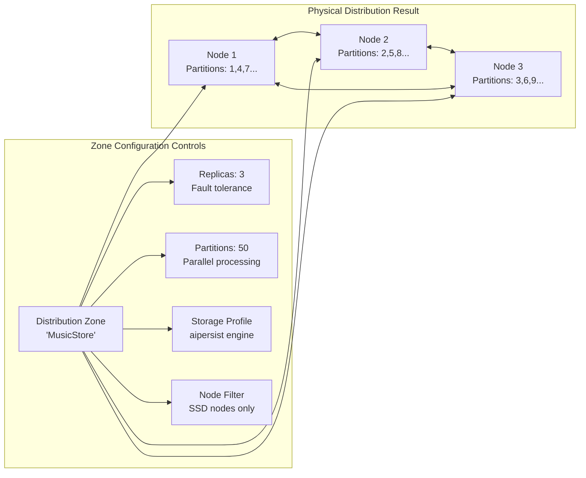
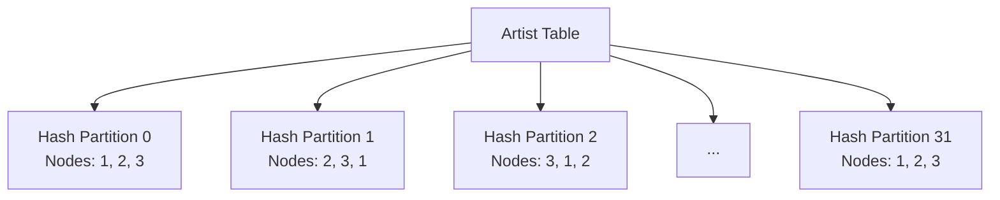
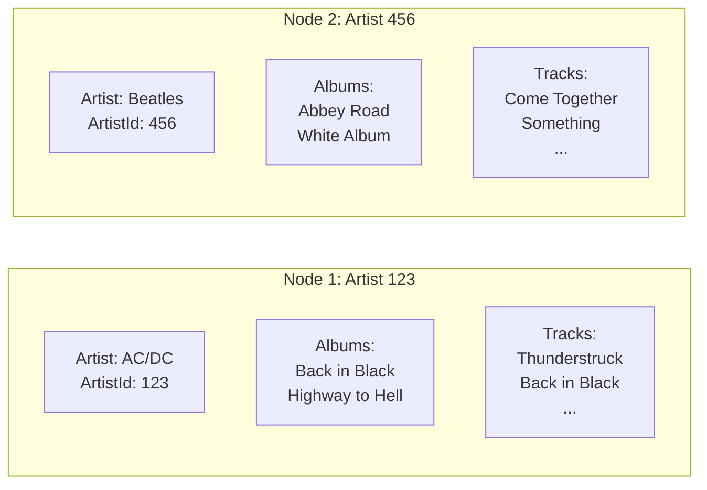
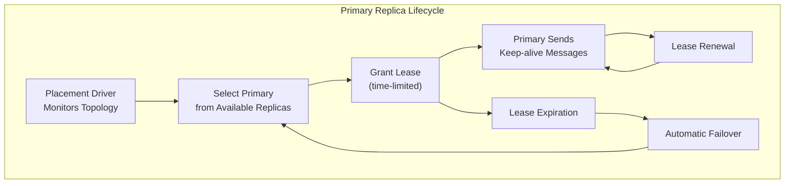
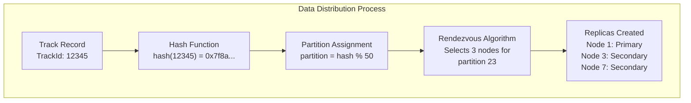

# Chapter 1.3: Distributed Data Fundamentals

Your Artist data is distributed across nodes but queries for related Albums hit multiple partitions, causing network overhead and performance degradation. When you join Artist, Album, and Track tables, the query coordinator must fetch data from different nodes, serialize results across the network, and reassemble them before returning results.

This fundamental challenge affects every distributed application: how to place related data together while maintaining even distribution, fault tolerance, and query performance.

## Understanding Data Distribution

Data distribution problems emerge immediately when you move beyond single-node storage. Without understanding distribution mechanics, your application may work in development but fail to scale in production.

### Distribution Zones Control Data Placement

Distribution zones define the physical and logical characteristics of how your data spreads across cluster nodes. Behind the scenes, Ignite 3 uses the **Rendezvous (Highest Random Weight) algorithm** to ensure consistent data placement without requiring coordination between nodes.



Each zone controls four critical aspects of data distribution:

- **Where** your data lives (node selection and filtering)
- **How many copies** exist (replica count for fault tolerance)
- **How data spreads** (partition count and Rendezvous distribution)
- **Storage characteristics** (engine choice: aimem, aipersist, or rocksdb)

### Zone Configuration Implementation

Create zones programmatically using the catalog DSL:

```java
// Preferred: Use catalog DSL for zone creation
ZoneDefinition zoneDefinition = ZoneDefinition.builder("\"MusicStore\"")
    .partitions(50)
    .replicas(3)
    .storageProfiles("default")
    .build();

ignite.catalog().createZone(zoneDefinition);
```

Or use SQL for administrative operations:

```sql
-- SQL approach for creating zones (STRONG_CONSISTENCY is default)
CREATE ZONE "MusicStore" WITH 
    PARTITIONS=50,                        -- Split data into 50 partitions
    REPLICAS=3,                           -- Keep 3 copies for fault tolerance
    STORAGE_PROFILES='aipersist_profile', -- Use persistent storage engine
    DATA_NODES_FILTER='$.storage == "SSD"' -- Only use SSD nodes
```

This configuration provides:

- **Fault Tolerance**: 3 replicas mean your data survives 2 node failures
- **Performance**: 50 partitions enable parallel processing across cluster
- **Storage Control**: Profile choice determines engine behavior
- **Node Selection**: Filters ensure data goes to appropriate hardware

### Consistency Mode Selection

Apache Ignite 3 supports two consistency modes that determine behavior during node failures:

#### STRONG_CONSISTENCY (Default)

Ensures strong consistency by requiring a majority of nodes for operations. Partitions become unavailable if the majority of assigned nodes are lost.

```java
// All zones use STRONG_CONSISTENCY by default
@Table(zone = @Zone(value = "CriticalData", storageProfiles = "default"))
public class PaymentTransaction { ... }
```

Use STRONG_CONSISTENCY for:

- Financial transactions requiring absolute consistency
- Business-critical data where accuracy is paramount
- Systems where temporary unavailability is preferable to data inconsistency

#### HIGH_AVAILABILITY

Prioritizes availability over strict consistency, allowing partitions to remain available for read-write operations even when the majority of assigned nodes are offline.

```java
// Configuration available via catalog DSL
ZoneDefinition catalogZone = ZoneDefinition.builder("\"CatalogData\"")
    .ifNotExists()
    .partitions(32)
    .replicas(2)
    .storageProfiles("default")
    .build();
ignite.catalog().createZone(catalogZone);

// Note: Consistency mode configuration via ALTER statements
Statement alterConsistencyStmt = client.sql().statementBuilder()
    .query("ALTER ZONE \"CatalogData\" SET CONSISTENCY MODE HIGH_AVAILABILITY")
    .build();
client.sql().execute(null, alterConsistencyStmt);
```

Use HIGH_AVAILABILITY for:

- Read-heavy catalog data where availability is crucial
- Content management systems prioritizing uptime
- Systems where temporary inconsistency is acceptable for continued operation

### Physical Data Distribution



Each partition maintains:

- **Primary replica**: Handles writes and coordinates reads
- **Backup replicas**: Provide fault tolerance and read scaling
- **Hash-based assignment**: Ensures even distribution

## Solving Colocation Problems

### The Cross-Partition Query Problem

Without careful design, related data spreads randomly across nodes, forcing expensive network operations:

```java
// Without colocation - potentially expensive
Artist artist = artists.get(null, artistKey);           // Node 1
Collection<Album> albums = albums.getAll(null, 
    artist.getAlbumIds());                              // Nodes 1, 2, 3
Collection<Track> tracks = tracks.getAll(null,
    albums.stream().flatMap(a -> a.getTrackIds()));     // Nodes 1, 2, 3
```

Each operation might hit different nodes, creating network overhead and increasing latency. Query joins across partitions require expensive data movement and coordination.

### Implementing Data Colocation

Colocation keeps related data together on the same nodes by using consistent partition keys:

```java
@Table(zone = @Zone(value = "MusicStore", storageProfiles = "default"),
       colocateBy = @ColumnRef("ArtistId"))
public class Album {
    @Id private Integer AlbumId;
    @Id private Integer ArtistId;  // Colocation key
    private String Title;
}

@Table(zone = @Zone(value = "MusicStore", storageProfiles = "default"),
       colocateBy = @ColumnRef("ArtistId"))
public class Track {
    @Id private Integer TrackId;
    private Integer AlbumId;
    private Integer ArtistId;  // Same colocation key
    private String Name;
}
```

**With colocation**, all data for an artist lives on the same nodes:



### Local Join Execution

Colocated data enables local joins that execute on a single node:

```java
// Preferred: Use StatementBuilder for complex queries
Statement joinQuery = client.sql().statementBuilder()
    .query("SELECT a.Name, al.Title, t.Name " +
           "FROM Artist a " +
           "JOIN Album al ON a.ArtistId = al.ArtistId " +
           "JOIN Track t ON al.AlbumId = t.AlbumId " +
           "WHERE a.ArtistId = ?")
    .pageSize(100)
    .build();

// This join executes on a single node
var result = client.sql().execute(null, joinQuery, 123);

// Process results - note that all column names are normalized to uppercase
while (result.hasNext()) {
    SqlRow row = result.next();
    String artistName = row.stringValue("NAME");      // Column names are uppercase
    String albumTitle = row.stringValue("TITLE");     // Even if defined as mixed case
    String trackName = row.stringValue("NAME");       // Column alias resolution needed
}
```

> [!IMPORTANT]
> Ignite 3 follows SQL standard normalization rules for metadata (table names, column names).
>
> When accessing columns via `SqlRow`:
>
> - `"myColumn"` → `"MYCOLUMN"` (normalized to **uppercase**)
> - `"\"MyColumn\""` → `"MyColumn"` (double quotes preserve exact case)
>
> Use double quotes in your SQL when you need to preserve case sensitivity for column access.

### Batch Operation Efficiency

Multi-record operations on colocated data execute efficiently:

```java
// All these operations happen on the same node
artists.get(null, artistKey);
albums.getAll(null, artistAlbumKeys);
tracks.getAll(null, artistTrackKeys);
```

## Managing Replication and Consistency

### Primary Replica Management

The Placement Driver coordinates primary replica selection using time-limited leases to ensure exactly one primary replica per partition handles writes:



**Lease Management Benefits:**

- **Split-brain Prevention**: Only one valid primary per partition
- **Automatic Failover**: Failed primaries detected via lease expiration
- **No Coordination Overhead**: Secondaries don't need to coordinate
- **Consistent Writes**: All writes go through the primary replica

### Replica Strategy Configuration

Different applications need different replication strategies:

```sql
-- High availability music catalog
CREATE ZONE "MusicCatalog" WITH 
    PARTITIONS=50,
    REPLICAS=3;                     -- Survive 2 node failures

-- Read-heavy reference data  
CREATE ZONE "ReferenceData" WITH 
    PARTITIONS=25,
    REPLICAS=5;                     -- Maximum read performance

-- Balanced user activity
CREATE ZONE "UserActivity" WITH 
    PARTITIONS=64,
    REPLICAS=2;                     -- Balance performance and safety
```

### Transaction Consistency with MVCC

Ignite 3 uses **Multi-Version Concurrency Control (MVCC)** to handle concurrent access without blocking:

```java
// Each record maintains multiple versions with timestamps
public class VersionedRecord {
    private final Object key;
    private final Object value;
    private final long timestamp;      // Version identifier
    private final boolean committed;   // Transaction state
}
```

**MVCC provides:**

- **Read Operations**: See committed versions as of transaction timestamp
- **Write Operations**: Create new versions without blocking readers
- **Garbage Collection**: Configurable cleanup removes old versions
- **Isolation**: Transactions see consistent snapshots

**Consistency Guarantees:**

- **ACID Transactions**: Full transactional semantics across partitions
- **Snapshot Isolation**: Readers see consistent data without locking
- **Linearizability**: Writes appear to happen atomically
- **Read-your-writes**: Sessions see their own writes immediately

## Designing Multi-Zone Architectures

### Zone Strategy Patterns

Real applications use multiple zones optimized for different data characteristics:

```java
// Preferred: Use catalog DSL for zone creation
ZoneDefinition businessZone = ZoneDefinition.builder("\"BusinessCritical\"")
    .partitions(25)
    .replicas(3)
    .storageProfiles("production_persistent")
    .build();
ignite.catalog().createZone(businessZone);

ZoneDefinition analyticsZone = ZoneDefinition.builder("\"Analytics\"")
    .partitions(64)
    .replicas(2)
    .storageProfiles("analytics_persistent")
    .build();
ignite.catalog().createZone(analyticsZone);

ZoneDefinition sessionsZone = ZoneDefinition.builder("\"Sessions\"")
    .partitions(50)
    .replicas(2)
    .storageProfiles("default")
    .build();
ignite.catalog().createZone(sessionsZone);
```

### Storage Profile Configuration

Storage profiles are configured during cluster initialization. The default profile using the aimem engine is available immediately. For production environments requiring persistent storage, storage profiles are configured through cluster management APIs or configuration files during node startup.

**Storage Engine Selection:**

- **aimem** (default): Development, caching, temporary data (no persistence)
- **aipersist**: Production applications requiring data durability
- **rocksdb**: Experimental engine for write-heavy workloads

### Zone-Table Mapping Strategy

```java
// Business entities use persistent storage for durability
@Table(zone = @Zone(value = "BusinessCritical", storageProfiles = "production_persistent"))
public class Customer { ... }

@Table(zone = @Zone(value = "BusinessCritical", storageProfiles = "production_persistent"))
public class Invoice { ... }

// Analytics use persistent storage but larger partitions
@Table(zone = @Zone(value = "Analytics", storageProfiles = "analytics_persistent"))
public class UserBehavior { ... }

@Table(zone = @Zone(value = "Analytics", storageProfiles = "analytics_persistent"))
public class SalesMetrics { ... }

// Session data uses default aimem for maximum speed
@Table(zone = @Zone(value = "Sessions", storageProfiles = "default"))
public class UserSession { ... }
```

**Zone Assignment Principles:**

- **Match storage to durability needs**: Use aipersist for data that must survive restarts
- **Optimize for access patterns**: More partitions for parallel processing
- **Consider fault tolerance**: More replicas for critical data

## Optimizing Partition Distribution

### Understanding the Rendezvous Algorithm

Ignite 3 uses the **Rendezvous (Highest Random Weight) algorithm** to distribute data consistently across nodes:



**Algorithm Benefits:**

- **Consistent Assignment**: Same key always maps to same nodes
- **No Coordination**: Nodes independently calculate assignments
- **Minimal Movement**: Only affected partitions rebalance when topology changes
- **Even Distribution**: Load spreads evenly across available nodes

### Partition Key Selection Strategy

Choose partition keys that work effectively with the Rendezvous algorithm:

```java
// Good: Random distribution across all partitions
@Table(zone = @Zone(value = "MusicStore", storageProfiles = "default"))
public class Track {
    @Id private UUID TrackId;      // Random UUID distributes evenly
    private Integer ArtistId;
}

// Better: Semantic distribution with colocation
@Table(zone = @Zone(value = "MusicStore", storageProfiles = "default"),
       colocateBy = @ColumnRef("ArtistId"))
public class Track {
    @Id private Integer TrackId;   // Sequential within artist
    @Id private Integer ArtistId;  // Groups related tracks
}
```

**Partitioning Best Practices:**

- **Avoid Hot Partitions**: Don't use sequential keys that concentrate on few partitions
- **Consider Colocation**: Group related data for local joins
- **Plan for Growth**: Choose partition counts that accommodate future scaling
- **Monitor Distribution**: Use cluster tools to verify even load distribution

### Query-Driven Colocation Design

Design colocation based on your most important queries:

```java
// If you frequently query "all tracks by artist"
@Table(colocateBy = @ColumnRef("ArtistId"))
public class Track { ... }

// If you frequently query "all purchases by customer"
@Table(colocateBy = @ColumnRef("CustomerId"))
public class Purchase { ... }

// If you frequently query "all items in playlist"
@Table(colocateBy = @ColumnRef("PlaylistId"))
public class PlaylistTrack { ... }
```

## Development Environment Setup

The complete setup provides distributed data experience with realistic distribution effects:

```bash
cd ignite3-java-api-primer/00-docker
./init-cluster.sh

cd ../01-sample-data-setup
mvn compile exec:java
```

**What This Establishes:**

- **3-Node Cluster**: Production-ready distributed setup with automatic failover
- **Multiple Storage Engines**: Experience with aimem (default) and aipersist storage
- **Colocated Data**: Artist-Album-Track hierarchies optimized for performance
- **Realistic Scale**: Sample data that demonstrates distribution effects
- **Zone Strategies**: Multiple zones using different storage profiles

**Verify Cluster Configuration:**

Cluster configuration and partition distribution can be monitored through the Java client APIs and management endpoints. The connection patterns established in previous chapters provide the foundation for cluster monitoring and health checks through programmatic interfaces.

---

These distributed data fundamentals solve the core problem of placing related data together while maintaining fault tolerance and performance. Understanding how zones control data placement, how colocation eliminates network overhead, and how replication provides consistency enables you to design schemas that scale effectively.

Next, apply these concepts to build production-ready schemas using annotations in **[Chapter 2.1: Basic Annotations](../02-schema-design/01-basic-annotations.md)**.
