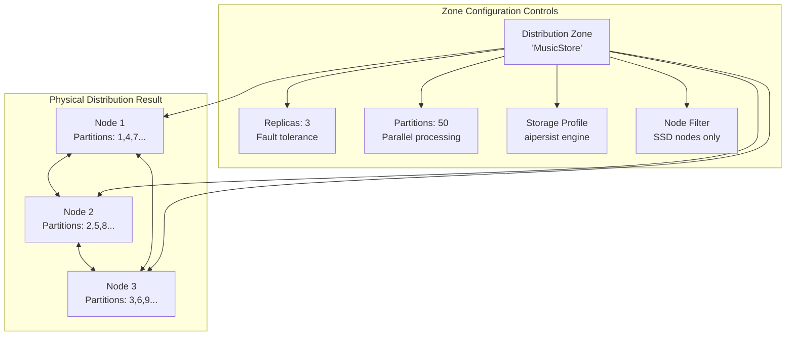
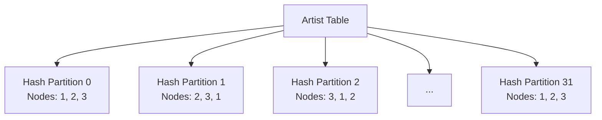
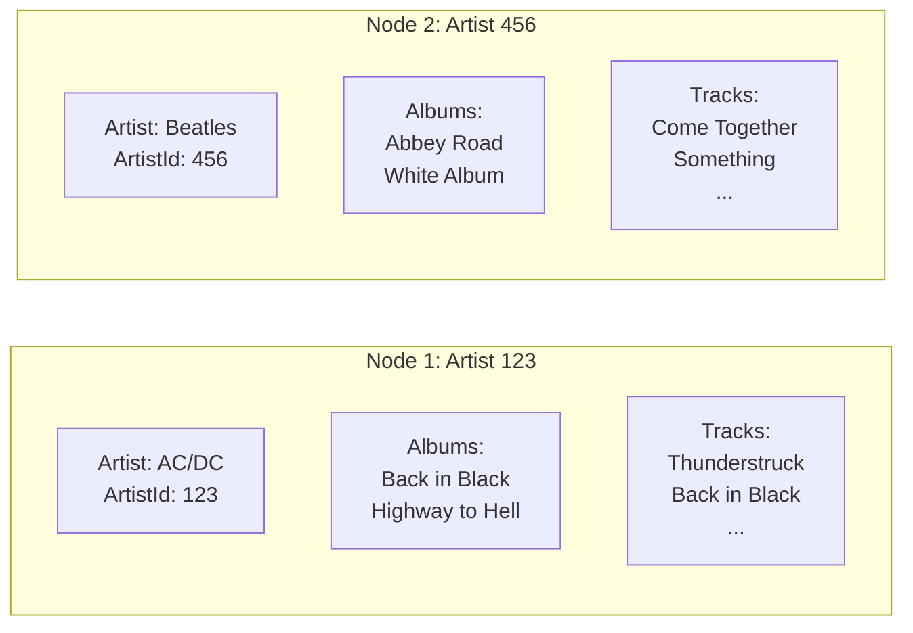
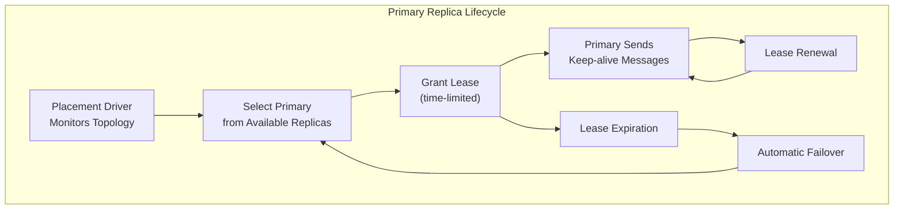
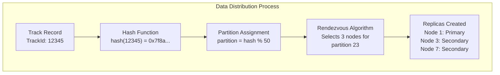

# Chapter 1.3: Distributed Data Fundamentals

## Learning Objectives

By completing this chapter, you will:

- Understand how data distributes across cluster nodes and partitions
- Recognize the role of distribution zones in controlling data placement
- Apply replication strategies for fault tolerance and performance
- Design for data colocation to optimize query performance

## From Simple Storage to Distributed Intelligence

In [Chapter 1.2](02-getting-started.md), you created your first table with a simple zone configuration:

```java
@Table(zone = @Zone(value = "QuickStart", storageProfiles = "default"))
public class Book {
    @Id private Integer id;
    @Column(length = 100) private String title;
}
```

This worked perfectly for learning the basics. Now you're ready to understand what happens behind this simple annotation and how it enables applications that scale to millions of operations per second.

## Understanding Distribution Zones

> [!NOTE]
> **Distribution Zones**: Think of zones as policies that control where your data lives, how many copies exist, and how it spreads across nodes. They're the foundation of Ignite 3's data placement and performance optimization strategies.
>
> For complete architectural details, see [Storage System Architecture](../00-reference/storage-system-arch.md).

### What Are Distribution Zones?

Distribution zones are logical containers that define how your data spreads across cluster nodes. Behind the scenes, Ignite 3 uses the **Rendezvous (Highest Random Weight) algorithm** to ensure consistent data placement without requiring coordination between nodes.



Each zone controls:

- **Where** your data lives (node selection and filtering)
- **How many copies** exist (replica count for fault tolerance)
- **How data spreads** (partition count and Rendezvous distribution)
- **Storage characteristics** (engine choice: aimem, aipersist, or rocksdb)

> **Deep dive**: See [Storage System Architecture](../00-reference/storage-system-arch.md) for complete details on partitioning algorithms, storage engines, and data placement strategies.

### Zone Configuration in Action

When you create a zone, you're configuring the distributed behavior:

```sql
-- SQL approach for creating zones
CREATE ZONE "MusicStore" WITH 
    PARTITIONS=50,                        -- Split data into 50 partitions
    REPLICAS=3,                           -- Keep 3 copies for fault tolerance
    STORAGE_PROFILES='aipersist_profile', -- Use persistent storage engine
    DATA_NODES_FILTER='$.storage == "SSD"' -- Only use SSD nodes
```

Or use the programmatic approach with StatementBuilder:

```java
// Preferred: Use StatementBuilder API for zone creation
Statement createZoneStmt = client.sql().statementBuilder()
    .query("CREATE ZONE \"MusicStore\" WITH PARTITIONS=?, REPLICAS=?, STORAGE_PROFILES=?")
    .build();

client.sql().execute(null, createZoneStmt, 50, 3, "default");
```

**Why This Matters:**

- **Fault Tolerance**: 3 replicas mean your data survives 2 node failures
- **Performance**: 50 partitions enable parallel processing across cluster
- **Storage Control**: Profile choice determines engine (aimem, aipersist, rocksdb)
- **Node Selection**: Filters ensure data goes to appropriate hardware

### How Data Distributes



Each partition has:

- **Primary replica**: Handles writes and coordinates reads
- **Backup replicas**: Provide fault tolerance and read scaling
- **Hash-based assignment**: Ensures even distribution

## Data Colocation Strategies

### The Performance Problem

Without careful design, related data spreads randomly across nodes, forcing expensive network operations:

```java
// Without colocation - potentially expensive
Artist artist = artists.get(null, artistKey);           // Node 1
Collection<Album> albums = albums.getAll(null, 
    artist.getAlbumIds());                              // Nodes 1, 2, 3
Collection<Track> tracks = tracks.getAll(null,
    albums.stream().flatMap(a -> a.getTrackIds()));     // Nodes 1, 2, 3
```

Each operation might hit different nodes, creating network overhead.

### The Colocation Solution

Colocation keeps related data together on the same nodes:

```java
@Table(zone = @Zone(value = "MusicStore", storageProfiles = "default"),
       colocateBy = @ColumnRef("ArtistId"))
public class Album {
    @Id private Integer AlbumId;
    @Id private Integer ArtistId;  // Colocation key
    private String Title;
}

@Table(zone = @Zone(value = "MusicStore", storageProfiles = "default"),
       colocateBy = @ColumnRef("ArtistId"))
public class Track {
    @Id private Integer TrackId;
    private Integer AlbumId;
    private Integer ArtistId;  // Same colocation key
    private String Name;
}
```

**With colocation**, all data for an artist lives on the same nodes:



### Colocation Benefits

**Local Joins**: Queries involving related tables execute locally:

```java
// Preferred: Use StatementBuilder for complex queries
Statement joinQuery = client.sql().statementBuilder()
    .query("SELECT a.Name, al.Title, t.Name " +
           "FROM Artist a " +
           "JOIN Album al ON a.ArtistId = al.ArtistId " +
           "JOIN Track t ON al.AlbumId = t.AlbumId " +
           "WHERE a.ArtistId = ?")
    .pageSize(100)
    .build();

// This join executes on a single node
var result = client.sql().execute(null, joinQuery, 123);

// Process results - note that all column names are normalized to uppercase
while (result.hasNext()) {
    SqlRow row = result.next();
    String artistName = row.stringValue("NAME");      // Column names are uppercase
    String albumTitle = row.stringValue("TITLE");     // Even if defined as mixed case
    String trackName = row.stringValue("NAME");       // Column alias resolution needed
}
```

> **Important**: Ignite 3 normalizes all SQL metadata (table names, column names) to uppercase. When accessing columns via `SqlRow`, always use uppercase names regardless of how they're defined in your schema or query aliases.
>
> For complete details on SQL processing, query optimization, and Apache Calcite integration, see [SQL Engine Architecture](../00-reference/sql-engine-arch.md).

**Batch Operations**: Multi-record operations on colocated data are efficient:

```java
// All these operations happen on the same node
artists.get(null, artistKey);
albums.getAll(null, artistAlbumKeys);
tracks.getAll(null, artistTrackKeys);
```

## Replication and Consistency

### Replica Configuration

Different applications need different replication strategies. Ignite 3 uses a **Placement Driver** to ensure exactly one primary replica per partition handles writes:

```sql
-- High availability music catalog
CREATE ZONE "MusicCatalog" WITH 
    PARTITIONS=50,
    REPLICAS=3;                     -- Survive 2 node failures

-- Read-heavy reference data  
CREATE ZONE "ReferenceData" WITH 
    PARTITIONS=25,
    REPLICAS=5;                     -- Maximum read performance

-- Balanced user activity
CREATE ZONE "UserActivity" WITH 
    PARTITIONS=64,
    REPLICAS=2;                     -- Balance performance and safety
```

### Primary Replica Management

The Placement Driver coordinates primary replica selection using time-limited leases:



**Lease Management Benefits:**

- **Split-brain Prevention**: Only one valid primary per partition
- **Automatic Failover**: Failed primaries detected via lease expiration
- **No Coordination Overhead**: Secondaries don't need to coordinate
- **Consistent Writes**: All writes go through the primary replica

### Transaction Consistency with MVCC

Ignite 3 uses **Multi-Version Concurrency Control (MVCC)** to handle concurrent access:

```java
// Each record maintains multiple versions with timestamps
public class VersionedRecord {
    private final Object key;
    private final Object value;
    private final long timestamp;      // Version identifier
    private final boolean committed;   // Transaction state
}
```

**MVCC Benefits:**

- **Read Operations**: See committed versions as of transaction timestamp
- **Write Operations**: Create new versions without blocking readers
- **Garbage Collection**: Configurable cleanup removes old versions
- **Isolation**: Transactions see consistent snapshots

**Consistency Guarantees:**

- **ACID Transactions**: Full transactional semantics across partitions
- **Snapshot Isolation**: Readers see consistent data without locking
- **Linearizability**: Writes appear to happen atomically
- **Read-your-writes**: Sessions see their own writes immediately

> **Deep Dive**: See [Storage System Architecture](../00-reference/storage-system-arch.md#multi-version-concurrency-control-mvcc) for complete MVCC implementation details.

## Practical Zone Design Patterns

### Multi-Zone Architecture

Real applications use multiple zones optimized for different data characteristics. Each zone uses storage profiles that match their requirements:

```java
// Preferred: Use StatementBuilder for zone creation
Statement businessZoneStmt = client.sql().statementBuilder()
    .query("CREATE ZONE \"BusinessCritical\" WITH PARTITIONS=?, REPLICAS=?, STORAGE_PROFILES=?")
    .build();
client.sql().execute(null, businessZoneStmt, 25, 3, "production_persistent");

Statement analyticsZoneStmt = client.sql().statementBuilder()
    .query("CREATE ZONE \"Analytics\" WITH PARTITIONS=?, REPLICAS=?, STORAGE_PROFILES=?")
    .build();
client.sql().execute(null, analyticsZoneStmt, 64, 2, "analytics_persistent");

Statement sessionsZoneStmt = client.sql().statementBuilder()
    .query("CREATE ZONE \"Sessions\" WITH PARTITIONS=?, REPLICAS=?, STORAGE_PROFILES=?")
    .build();
client.sql().execute(null, sessionsZoneStmt, 50, 2, "default");
```

### Storage Profile Configuration

Before creating zones, configure storage profiles on cluster nodes:

```bash
# Configure persistent storage for production data
ignite node config update "ignite.storage.profiles: {
    production_persistent: {
        engine: aipersist,
        size: 8589934592    # 8GB cache for hot data
    },
    analytics_persistent: {
        engine: aipersist,
        size: 4294967296    # 4GB cache for analytics
    }
}"
```

**Storage Engine Selection Guide:**

- **aimem** (default): Development, caching, temporary data (no persistence)
- **aipersist**: Production applications requiring data durability
- **rocksdb**: Experimental engine for write-heavy workloads

**Creating Reusable Statement Patterns:**

```java
// Create domain-specific builders for consistent configuration
public static Statement.StatementBuilder musicStoreQuery() {
    return client.sql().statementBuilder()
        .defaultSchema("MUSIC_STORE")
        .pageSize(100)
        .queryTimeout(30, TimeUnit.SECONDS);
}

// Use for zone operations
Statement zoneStmt = musicStoreQuery()
    .query("CREATE ZONE ? WITH PARTITIONS=?, REPLICAS=?, STORAGE_PROFILES=?")
    .build();
```

### Zone-Table Mapping

```java
// Business entities use persistent storage for durability
@Table(zone = @Zone(value = "BusinessCritical", storageProfiles = "production_persistent"))
public class Customer { ... }

@Table(zone = @Zone(value = "BusinessCritical", storageProfiles = "production_persistent"))
public class Invoice { ... }

// Analytics use persistent storage but larger partitions
@Table(zone = @Zone(value = "Analytics", storageProfiles = "analytics_persistent"))
public class UserBehavior { ... }

@Table(zone = @Zone(value = "Analytics", storageProfiles = "analytics_persistent"))
public class SalesMetrics { ... }

// Session data uses default aimem for maximum speed
@Table(zone = @Zone(value = "Sessions", storageProfiles = "default"))
public class UserSession { ... }
```

**Zone Assignment Principles:**

- **Match storage to durability needs**: Use aipersist for data that must survive restarts
- **Optimize for access patterns**: More partitions for parallel processing
- **Consider fault tolerance**: More replicas for critical data

## Performance Through Design

### Understanding Data Distribution

Ignite 3 uses the **Rendezvous (Highest Random Weight) algorithm** to distribute data consistently across nodes:



**Algorithm Benefits:**

- **Consistent Assignment**: Same key always maps to same nodes
- **No Coordination**: Nodes independently calculate assignments
- **Minimal Movement**: Only affected partitions rebalance when topology changes
- **Even Distribution**: Load spreads evenly across available nodes

### Partition Key Selection

Choose partition keys that work with the Rendezvous algorithm:

```java
// Good: Random distribution across all partitions
@Table(zone = @Zone(value = "MusicStore", storageProfiles = "default"))
public class Track {
    @Id private UUID TrackId;      // Random UUID distributes evenly
    private Integer ArtistId;
}

// Better: Semantic distribution with colocation
@Table(zone = @Zone(value = "MusicStore", storageProfiles = "default"),
       colocateBy = @ColumnRef("ArtistId"))
public class Track {
    @Id private Integer TrackId;   // Sequential within artist
    @Id private Integer ArtistId;  // Groups related tracks
}
```

**Partitioning Best Practices:**

- **Avoid Hot Partitions**: Don't use sequential keys that concentrate on few partitions
- **Consider Colocation**: Group related data for local joins
- **Plan for Growth**: Choose partition counts that accommodate future scaling
- **Monitor Distribution**: Use cluster tools to verify even load distribution

### Query-Driven Design

Design colocation based on your most important queries:

```java
// If you frequently query "all tracks by artist"
@Table(colocateBy = @ColumnRef("ArtistId"))
public class Track { ... }

// If you frequently query "all purchases by customer"
@Table(colocateBy = @ColumnRef("CustomerId"))
public class Purchase { ... }

// If you frequently query "all items in playlist"
@Table(colocateBy = @ColumnRef("PlaylistId"))
public class PlaylistTrack { ... }
```

## Learning Through Practice

### Development Environment Setup

The complete setup provides a rich learning experience with realistic data distribution:

```bash
cd ignite3-java-api-primer/00-docker
./init-cluster.sh

cd ../01-sample-data-setup
mvn compile exec:java
```

**What This Establishes:**

- **3-Node Cluster**: Production-ready distributed setup with automatic failover
- **Multiple Storage Engines**: Experience with aimem (default) and aipersist storage
- **Colocated Data**: Artist-Album-Track hierarchies optimized for performance
- **Realistic Scale**: Sample data that demonstrates distribution effects
- **Zone Strategies**: Multiple zones using different storage profiles

**Cluster Configuration:**

```bash
# Verify cluster status and partition distribution
ignite cluster status
ignite cluster partition states --zone-name default

# Check storage profiles and engines
ignite node config show --filter storage
```

### Next Steps in Your Learning Journey

Understanding distributed data fundamentals prepares you for schema design and data access patterns:

**[Module 2: Schema Design](../02-schema-design/01-basic-annotations.md)** - Apply these concepts to build production-ready schemas using annotations

**[Module 3: Data Access APIs](../03-data-access-apis/01-table-api-operations.md)** - Use Table and SQL APIs effectively with distributed data

The foundation is complete. You understand how Ignite 3 distributes data, handles failures, and optimizes performance through intelligent placement. These concepts underlie everything you'll build in the modules ahead.
