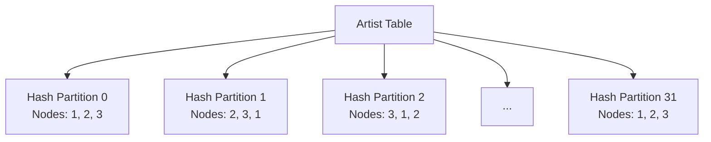
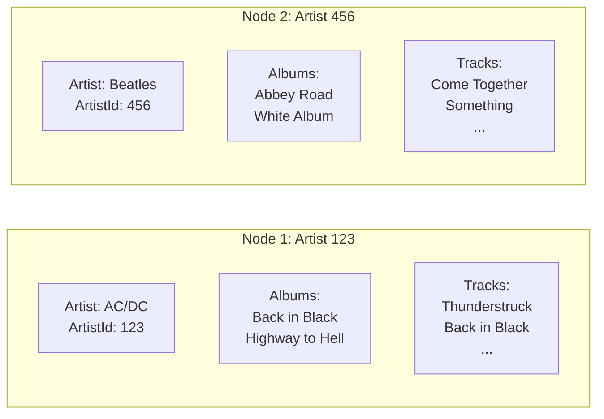

# Chapter 1.3: Distributed Data Fundamentals

## Learning Objectives

By completing this chapter, you will:

- Understand how data distributes across cluster nodes and partitions
- Recognize the role of distribution zones in controlling data placement
- Apply replication strategies for fault tolerance and performance
- Design for data colocation to optimize query performance

## From Simple Storage to Distributed Intelligence

In [Chapter 1.2](02-getting-started.md), you created your first table with a simple zone configuration:

```java
@Table(zone = @Zone(value = "QuickStart", storageProfiles = "default"))
public class Book {
    @Id private Integer id;
    @Column(length = 100) private String title;
}
```

This worked perfectly for learning the basics. Now you're ready to understand what happens behind this simple annotation and how it enables applications that scale to millions of operations per second.

## Understanding Distribution Zones

> [!NOTE]
> **Distribution Zones**: Think of zones as policies that control where your data lives, how many copies exist, and how it spreads across nodes. They're the foundation of Ignite 3's data placement and performance optimization strategies.

### What Are Distribution Zones?

Distribution zones are containers that define how your data spreads across cluster nodes. Think of them as policies that control:

- **Where** your data lives (which nodes)
- **How many copies** exist (replication factor)
- **How data spreads** (partitioning strategy)
- **Storage characteristics** (memory, persistence, performance)

### Zone Configuration in Action

When you create a zone, you're configuring the distributed behavior:

```java
ZoneDefinition musicZone = ZoneDefinition.builder("MusicStore")
    .replicas(3)                          // Keep 3 copies of each data partition
    .partitions(32)                       // Split data into 32 partitions
    .storageProfiles("fast_storage")      // Use high-performance storage
    .distributionAlgorithm("ROUND_ROBIN") // Even distribution strategy
    .build();

client.catalog().createZone(musicZone);
```

**Why This Matters:**

- **Fault Tolerance**: 3 replicas mean your data survives 2 node failures
- **Performance**: More partitions enable parallel processing
- **Storage Control**: Different profiles optimize for different workloads
- **Load Balance**: Distribution algorithms prevent hotspots

### How Data Distributes



Each partition has:

- **Primary replica**: Handles writes and coordinates reads
- **Backup replicas**: Provide fault tolerance and read scaling
- **Hash-based assignment**: Ensures even distribution

## Data Colocation Strategies

### The Performance Problem

Without careful design, related data spreads randomly across nodes, forcing expensive network operations:

```java
// Without colocation - potentially expensive
Artist artist = artists.get(null, artistKey);           // Node 1
Collection<Album> albums = albums.getAll(null, 
    artist.getAlbumIds());                              // Nodes 1, 2, 3
Collection<Track> tracks = tracks.getAll(null,
    albums.stream().flatMap(a -> a.getTrackIds()));     // Nodes 1, 2, 3
```

Each operation might hit different nodes, creating network overhead.

### The Colocation Solution

Colocation keeps related data together on the same nodes:

```java
@Table(zone = @Zone(value = "MusicStore", storageProfiles = "default"),
       colocateBy = @ColumnRef("ArtistId"))
public class Album {
    @Id private Integer AlbumId;
    @Id private Integer ArtistId;  // Colocation key
    private String Title;
}

@Table(zone = @Zone(value = "MusicStore", storageProfiles = "default"),
       colocateBy = @ColumnRef("ArtistId"))
public class Track {
    @Id private Integer TrackId;
    private Integer AlbumId;
    private Integer ArtistId;  // Same colocation key
    private String Name;
}
```

**With colocation**, all data for an artist lives on the same nodes:



### Colocation Benefits

**Local Joins**: Queries involving related tables execute locally:

```java
// This join executes on a single node
var result = client.sql().execute(null,
    "SELECT a.Name, al.Title, t.Name " +
    "FROM Artist a " +
    "JOIN Album al ON a.ArtistId = al.ArtistId " +
    "JOIN Track t ON al.AlbumId = t.AlbumId " +
    "WHERE a.ArtistId = ?", 123);
```

**Batch Operations**: Multi-record operations on colocated data are efficient:

```java
// All these operations happen on the same node
artists.get(null, artistKey);
albums.getAll(null, artistAlbumKeys);
tracks.getAll(null, artistTrackKeys);
```

## Replication and Consistency

### Replica Configuration

Different applications need different replication strategies:

```java
// High availability music catalog
ZoneDefinition catalogZone = ZoneDefinition.builder("MusicCatalog")
    .replicas(3)                    // Survive 2 node failures
    .consistencyMode("STRONG")      // Immediate consistency
    .build();

// Read-heavy reference data
ZoneDefinition refDataZone = ZoneDefinition.builder("ReferenceData")
    .replicas(5)                    // Maximum read performance
    .consistencyMode("EVENTUAL")    // Relaxed consistency for reads
    .build();

// High-write user activity
ZoneDefinition activityZone = ZoneDefinition.builder("UserActivity")
    .replicas(2)                    // Balance performance and safety
    .consistencyMode("WEAK")        // Optimize for write throughput
    .build();
```

### Consistency Levels

**Strong Consistency**: All replicas synchronized before operations complete

- **Use for**: Financial transactions, critical business data
- **Trade-off**: Higher latency, guaranteed accuracy

**Eventual Consistency**: Updates propagate asynchronously

- **Use for**: User preferences, activity logs, caching
- **Trade-off**: Lower latency, potential temporary inconsistencies

**Weak Consistency**: Minimal synchronization requirements

- **Use for**: Metrics, analytics, high-volume logging
- **Trade-off**: Maximum performance, potential data loss

## Practical Zone Design Patterns

### Multi-Zone Architecture

Real applications use multiple zones for different data characteristics:

```java
// Critical business data - maximum reliability
client.catalog().createZone(
    ZoneDefinition.builder("BusinessCritical")
        .replicas(3)
        .consistencyMode("STRONG")
        .storageProfiles("persistent_ssd")
        .build()
);

// Analytics data - optimized for bulk operations
client.catalog().createZone(
    ZoneDefinition.builder("Analytics")
        .replicas(2)
        .partitions(64)  // More partitions for parallel processing
        .consistencyMode("EVENTUAL")
        .storageProfiles("bulk_storage")
        .build()
);

// Session data - optimized for speed
client.catalog().createZone(
    ZoneDefinition.builder("Sessions")
        .replicas(2)
        .consistencyMode("WEAK")
        .storageProfiles("memory_only")
        .build()
);
```

### Zone-Table Mapping

```java
// Business entities in reliable storage
@Table(zone = @Zone(value = "BusinessCritical"))
public class Customer { ... }

@Table(zone = @Zone(value = "BusinessCritical"))
public class Invoice { ... }

// Analytics in optimized storage
@Table(zone = @Zone(value = "Analytics"))
public class UserBehavior { ... }

@Table(zone = @Zone(value = "Analytics"))
public class SalesMetrics { ... }

// Session data in fast storage
@Table(zone = @Zone(value = "Sessions"))
public class UserSession { ... }
```

## Performance Through Design

### Partition Key Selection

Choose partition keys that distribute load evenly:

```java
// Good: Random distribution
@Table(zone = @Zone(value = "MusicStore"))
public class Track {
    @Id private UUID TrackId;      // Random UUID distributes evenly
    private Integer ArtistId;
}

// Better: Semantic distribution with colocation
@Table(zone = @Zone(value = "MusicStore"),
       colocateBy = @ColumnRef("ArtistId"))
public class Track {
    @Id private Integer TrackId;   // Sequential within artist
    @Id private Integer ArtistId;  // Groups related tracks
}
```

### Query-Driven Design

Design colocation based on your most important queries:

```java
// If you frequently query "all tracks by artist"
@Table(colocateBy = @ColumnRef("ArtistId"))
public class Track { ... }

// If you frequently query "all purchases by customer"
@Table(colocateBy = @ColumnRef("CustomerId"))
public class Purchase { ... }

// If you frequently query "all items in playlist"
@Table(colocateBy = @ColumnRef("PlaylistId"))
public class PlaylistTrack { ... }
```

## Learning Through Practice

### Development Environment Setup

The complete setup provides a rich learning experience with realistic data distribution:

```bash
cd ignite3-reference-apps/00-docker
./init-cluster.sh

cd ../01-sample-data-setup
mvn compile exec:java
```

**What This Establishes:**

- **3-Node Cluster**: Production-ready distributed setup with automatic failover
- **Multiple Zones**: Different distribution strategies for different data types
- **Colocated Data**: Artist-Album-Track hierarchies optimized for performance
- **Realistic Scale**: Sample data that demonstrates distribution effects

### Next Steps in Your Learning Journey

Understanding distributed data fundamentals prepares you for schema design and data access patterns:

**[Module 2: Schema Design](../02-schema-design/01-basic-annotations.md)** - Apply these concepts to build production-ready schemas using annotations

**[Module 3: Data Access APIs](../03-data-access-apis/01-table-api-operations.md)** - Use Table and SQL APIs effectively with distributed data

The foundation is complete. You understand how Ignite 3 distributes data, handles failures, and optimizes performance through intelligent placement. These concepts underlie everything you'll build in the modules ahead.
