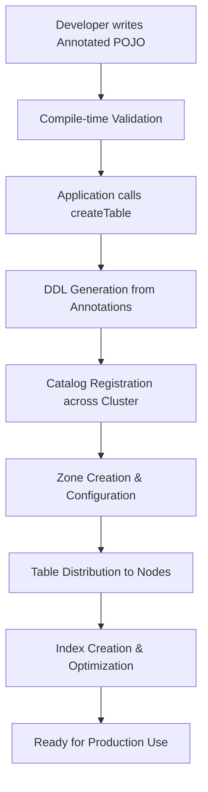

# Chapter 2.1: Basic Annotations and Table Creation

## Learning Objectives

By completing this chapter, you will:

- Understand the advantages of schema-as-code over traditional database schema management
- Master the six core annotations for defining distributed tables
- Create your first production-ready table using annotations
- Recognize how annotations eliminate schema synchronization complexity

## Working with the Reference Application

The **`03-schema-annotations-app`** demonstrates all schema design patterns covered in this module with the complete music store dataset. Run it alongside your learning to see annotations and colocation strategies in production code.

**Quick Start**: After reading this module, explore the reference application:

```bash
cd ignite3-reference-apps/03-schema-annotations-app
mvn compile exec:java
```

The reference app shows how the Book example from [Chapter 1.2](../01-foundation/02-getting-started.md) scales to Artist-Album-Track hierarchies with proper colocation and distribution zones.

## Building on Your Success

In [Chapter 1.2](../01-foundation/02-getting-started.md), you created your first distributed table using a simple Book entity:

```java
@Table(zone = @Zone(value = "QuickStart", storageProfiles = "default"))
public class Book {
    @Id private Integer id;
    @Column(length = 100) private String title;
}
```

This worked perfectly for learning the basics. Now you're ready to design production-ready schemas that handle complex relationships, optimize performance, and scale across distributed environments.

### From Simple to Sophisticated: The Schema Evolution Journey

Your Book entity demonstrated the fundamental pattern. Now we'll explore how that same pattern scales to handle:

- **Related Entities**: Artist → Album → Track hierarchies that mirror real business relationships
- **Performance Optimization**: Colocation strategies that keep related data together for efficient joins
- **Production Concerns**: Indexing, distribution zones, and query patterns that support high-performance applications

## Understanding Schema-as-Code

> [!IMPORTANT]
> **Schema-as-Code Benefits**: Ignite 3's annotation-based schema approach eliminates the friction of managing separate DDL scripts, provides compile-time validation, and ensures consistency across all environments while automatically handling distributed database complexities.

### The Traditional Database Challenge

In traditional database development, you've likely experienced the friction of managing schemas across environments. You write SQL DDL scripts, maintain migration files, and coordinate schema changes between development, testing, and production. When working with distributed databases, this complexity multiplies - you need to consider data placement, replication strategies, and performance optimizations.

Apache Ignite 3 eliminates this friction entirely through schema-as-code with annotations.

### Why Annotations Transform Distributed Development

Think of annotations as your blueprint for distributed data architecture. Instead of writing separate SQL scripts, you embed everything directly in your Java classes:

**Traditional Approach - Scattered Information:**

```sql
-- In schema.sql
CREATE TABLE Artist (ArtistId INT PRIMARY KEY, Name VARCHAR(120));
CREATE TABLE Album (AlbumId INT, Title VARCHAR(160), ArtistId INT, 
                   PRIMARY KEY (AlbumId, ArtistId)) COLOCATE BY (ArtistId);
CREATE INDEX IFK_AlbumArtistId ON Album (ArtistId);

-- Configuration in separate files
-- Distribution zones in XML or properties
-- Indexes defined separately
-- Colocation strategies documented elsewhere
```

**Ignite 3 Approach - Everything Together:**

```java
// Complete schema definition in one place
@Table(zone = @Zone(value = "MusicStore", storageProfiles = "default"))
public class Artist {
    @Id @Column(value = "ArtistId", nullable = false)
    private Integer ArtistId;
    
    @Column(value = "Name", nullable = true, length = 120)
    private String Name;
    // Constructors, getters, setters...
}

@Table(
    zone = @Zone(value = "MusicStore", storageProfiles = "default"),
    colocateBy = @ColumnRef("ArtistId"),  // Performance optimization built-in
    indexes = { @Index(value = "IFK_AlbumArtistId", columns = { @ColumnRef("ArtistId") }) }
)
public class Album {
    @Id @Column(value = "AlbumId", nullable = false)
    private Integer AlbumId;
    
    @Column(value = "Title", nullable = false, length = 160)
    private String Title;
    
    @Id @Column(value = "ArtistId", nullable = false)  // Enables colocation
    private Integer ArtistId;
}
```

**The Power of This Approach:**

- **Single Source of Truth**: Your Java class IS your schema - no synchronization issues
- **Compile-Time Safety**: Invalid schemas fail at compile time, not runtime
- **Performance by Design**: Colocation and indexing strategies are explicit and visible
- **Environment Consistency**: Same schema definitions work across all environments
- **Code Locality**: Schema lives next to the code that uses it
- **Automatic Operations**: Ignite generates DDL, creates indexes, configures distribution
- **Version Control Integration**: Schema changes are part of your normal code review process

### From Development to Production: A Seamless Journey

Let's see how schema-as-code eliminates common development pain points:

**Development Environment:**

```java
// Define your schema once
@Table(zone = @Zone(value = "MusicStore", storageProfiles = "default"))
public class Artist {
    @Id @Column(value = "ArtistId", nullable = false)
    private Integer ArtistId;
    
    @Column(value = "Name", nullable = true, length = 120)
    private String Name;
    
    // Business logic methods
    public boolean isValidName() {
        return Name != null && Name.trim().length() > 0;
    }
}
```

**What Happens Next:**

1. **Compile Time**: Annotations are validated - invalid schemas fail to compile
2. **Runtime**: Single call creates table: `client.catalog().createTable(Artist.class)`
3. **Automatic DDL**: Ignite generates optimized SQL DDL from your annotations
4. **Performance Setup**: Indexes, colocation, and distribution zones are configured automatically
5. **Production Ready**: Same code works in production with appropriate zone configurations

**The Developer Experience:**

- No SQL files to maintain
- No environment-specific schema variations
- No schema synchronization scripts
- No manual index creation
- No separate distribution configuration

This is the power of treating schema as code rather than configuration.

### The Journey from Code to Cluster

Understanding how your annotated classes become distributed tables helps you make better design decisions. Here's what happens behind the scenes:



**1. Development Phase - Compile-Time Safety**

```java
@Table(zone = @Zone(value = "MusicStore", storageProfiles = "default"))
public class Artist {
    @Id @Column(value = "ArtistId", nullable = false)
    private Integer ArtistId;  // ✓ Valid primary key
    
    @Column(value = "Name", nullable = true, length = 120)
    private String Name;       // ✓ String with length constraint
}
```

The Java compiler validates your annotations immediately. Invalid combinations (like missing @Id) cause compilation failure, catching errors before deployment.

**2. Application Startup - Table Creation**

```java
try (IgniteClient client = IgniteClient.builder()
        .addresses("127.0.0.1:10800")
        .build()) {
    
    // Single call creates complete distributed table
    client.catalog().createTable(Artist.class);
    // Behind the scenes: DDL generation, zone setup, distribution
}
```

**3. Cluster Coordination - Automatic Distribution**

- **DDL Generation**: Ignite converts annotations to optimized SQL DDL
- **Catalog Sync**: Schema is registered across all cluster nodes simultaneously  
- **Zone Assignment**: Data placement follows your distribution zone strategy
- **Index Creation**: Secondary indexes are built according to your specifications
- **Performance Setup**: Colocation strategies are configured for optimal joins

**4. Production Ready - Transparent Operation**

Once created, your tables operate transparently across the cluster. Your application code doesn't need to know which node stores which data - Ignite handles routing, consistency, and performance automatically.

This pipeline ensures that your schema intentions (performance, distribution, indexing) are realized consistently across all environments.

## The Annotation Toolbox

Ignite 3 provides six essential annotations that give you complete control over your distributed schema. Think of these as the building blocks for high-performance distributed data architecture:

### @Table - Primary Table Configuration

- **Purpose**: Marks a Java class as an Ignite table
- **Required**: Yes (on every entity class)
- **Attributes**:
  - `value` (optional): Table name override (defaults to class name)
  - `zone`: Distribution zone via `@Zone` annotation
  - `colocateBy` (optional): Colocation strategy via `@ColumnRef`
  - `indexes` (optional): Array of `@Index` definitions

### @Zone - Distribution Zone Definition  

- **Purpose**: Defines data distribution and replication strategy
- **Required**: Yes (within @Table)
- **Attributes**:
  - `value`: Zone name (e.g., "MusicStore", "MusicStoreReplicated")
  - `storageProfiles`: Storage engine configuration (typically "default")
  - `partitions` (optional): Number of partitions for data distribution
  - `replicas` (optional): Number of replicas for fault tolerance

### @Column - Field-to-Column Mapping

- **Purpose**: Maps Java fields to table columns with constraints
- **Required**: Optional (defaults to field name)
- **Attributes**:
  - `value`: Column name (defaults to field name if not specified)
  - `nullable`: NULL constraint specification (default: true)
  - `length`: String column length limits (for VARCHAR columns)
  - `precision`: Numeric precision (for DECIMAL columns)
  - `scale`: Numeric scale (for DECIMAL columns)

### @Id - Primary Key Designation

- **Purpose**: Marks fields as components of the primary key
- **Required**: Yes (at least one field per table)
- **Attributes**:
  - No attributes - simply marks the field as part of primary key
  - **Important**: For colocation, colocation key must be marked with @Id

### @ColumnRef - Column Reference for Relationships

- **Purpose**: References columns for colocation and indexing
- **Required**: When using colocation or indexes
- **Attributes**:
  - `value`: Referenced column name
  - `sort` (optional): Sort order for indexes (ASC, DESC)

### @Index - Secondary Index Definition

- **Purpose**: Creates database indexes for query performance
- **Required**: Optional (used within @Table indexes array)
- **Attributes**:
  - `value`: Index name
  - `columns`: Array of `@ColumnRef` for indexed columns
  - `unique` (optional): Uniqueness constraint

## Next Steps

Understanding basic annotations provides the foundation for building real entity relationships and optimizing performance:

- **[Chapter 2.2: Relationships and Colocation Strategies](02-relationships-and-colocation.md)** - Build your first distributed table step-by-step and understand entity relationships

- **[Chapter 2.3: Advanced Annotations and Zone Configuration](03-advanced-annotations.md)** - Master complex patterns like colocation, composite keys, and multi-zone architectures
