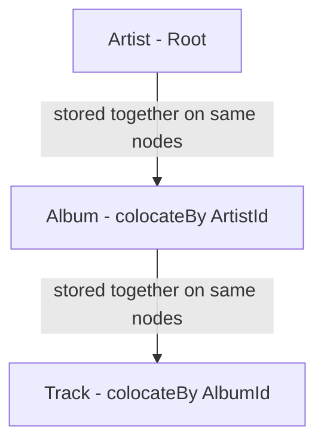

# Chapter 2.3: Advanced Annotations and Zone Configuration

## Learning Objectives

By completing this chapter, you will:
- Build three-level colocation hierarchies for maximum performance
- Design strategic zone configurations for different data access patterns
- Implement complex indexing strategies for business queries
- Master junction tables and self-referencing entity patterns

## Building Three-Level Colocation Hierarchy

> [!TIP]
> **Colocation Performance**: By colocating Artist → Album → Track data on the same nodes, complex queries across the entire music catalog execute locally without network overhead, delivering lightning-fast performance.

Let's extend our colocation chain to include Tracks. This creates a complete hierarchy where Artist → Album → Track data all lives together, enabling lightning-fast queries across the entire music catalog.

### The Album Entity: Intermediate Colocation Level

Building on our Artist foundation, here's the Album table that colocates with Artist:

```java
// Child table - Albums stored together with their Artist
@Table(
    zone = @Zone(value = "MusicStore", storageProfiles = "default"),
    colocateBy = @ColumnRef("ArtistId"),    // ← This is the key line!
    indexes = { @Index(value = "IFK_AlbumArtistId", columns = { @ColumnRef("ArtistId") }) }
)
public class Album {
    @Id
    @Column(value = "AlbumId", nullable = false)
    private Integer AlbumId;               // Unique album identifier
    
    @Id  // ← CRITICAL: Colocation key MUST be part of primary key
    @Column(value = "ArtistId", nullable = false)
    private Integer ArtistId;              // Links to Artist AND enables colocation
    
    @Column(value = "Title", nullable = false, length = 160)
    private String Title;
    
    public Album() {}
    
    public Album(Integer albumId, Integer artistId, String title) {
        this.AlbumId = albumId;
        this.ArtistId = artistId;
        this.Title = title;
    }
    
    // Getters and setters...
}
```

**Understanding the Colocation Setup:**

**`colocateBy = @ColumnRef("ArtistId")`** - This tells Ignite: "Store all albums for the same artist on the same cluster nodes as that artist's data."

**Why `@Id` on ArtistId?** - Ignite requires colocation keys to be part of the primary key. This ensures:

- Data partitioning works correctly
- Queries using both AlbumId and ArtistId are single-node operations
- Parent-child relationships are enforceable

**Composite Primary Key: (AlbumId, ArtistId)** - This means:

- Each album has a unique AlbumId within its artist
- The combination (AlbumId, ArtistId) is globally unique
- All albums for Artist 1 live on the same partition as Artist 1

**The Performance Benefit:**

```java
// This query executes on a SINGLE node (no network overhead)
String colocatedQuery = """
    SELECT ar.Name, al.Title 
    FROM Artist ar 
    JOIN Album al ON ar.ArtistId = al.ArtistId 
    WHERE ar.ArtistId = ?
    """;

// All data for Artist 1 is guaranteed to be on the same node
// Result: Lightning-fast joins with no network traffic
```

### The Track Entity: Advanced Colocation Patterns

The Track entity shows how to build complex, highly-indexed entities that participate in colocation hierarchies:

```java
@Table(
    zone = @Zone(value = "MusicStore", storageProfiles = "default"),
    colocateBy = @ColumnRef("AlbumId"),     // Tracks colocate with their Album
    indexes = {
        // Foreign key indexes for efficient joins
        @Index(value = "IFK_TrackAlbumId", columns = { @ColumnRef("AlbumId") }),
        @Index(value = "IFK_TrackGenreId", columns = { @ColumnRef("GenreId") }),
        @Index(value = "IFK_TrackMediaTypeId", columns = { @ColumnRef("MediaTypeId") }),
        
        // Business query indexes
        @Index(value = "IDX_TrackName", columns = { @ColumnRef("Name") })
    }
)
public class Track {
    @Id
    @Column(value = "TrackId", nullable = false)
    private Integer TrackId;               // Unique track identifier
    
    @Id  // ← ESSENTIAL: Colocation key must be in primary key
    @Column(value = "AlbumId", nullable = true)
    private Integer AlbumId;               // Links to Album AND enables colocation
    
    @Column(value = "Name", nullable = false, length = 200)
    private String Name;                   // Track title
    
    // Foreign key references to other tables
    @Column(value = "MediaTypeId", nullable = false)
    private Integer MediaTypeId;           // MP3, FLAC, etc.
    
    @Column(value = "GenreId", nullable = true)
    private Integer GenreId;               // Rock, Jazz, Classical, etc.
    
    // Track metadata
    @Column(value = "Composer", nullable = true, length = 220)
    private String Composer;               // Song composer (may differ from artist)
    
    @Column(value = "Milliseconds", nullable = false)
    private Integer Milliseconds;          // Track duration
    
    @Column(value = "Bytes", nullable = true)
    private Integer Bytes;                 // File size
    
    @Column(value = "UnitPrice", nullable = false, precision = 10, scale = 2)
    private BigDecimal UnitPrice;          // Price per track
    
    public Track() {}
    
    // Constructor for creating new tracks
    public Track(Integer trackId, Integer albumId, String name, 
                 Integer mediaTypeId, BigDecimal unitPrice) {
        this.TrackId = trackId;
        this.AlbumId = albumId;
        this.Name = name;
        this.MediaTypeId = mediaTypeId;
        this.UnitPrice = unitPrice;
    }
    
    // Getters and setters...
}
```

**The Complete Colocation Chain:**



**What This Achieves:**

- **Artist 1** data lives on Node A
- **All Albums for Artist 1** also live on Node A
- **All Tracks for those Albums** also live on Node A
- **Result**: Complete artist discography queries execute on a single node

**Index Strategy Explained:**

**Foreign Key Indexes**: `IFK_TrackAlbumId`, `IFK_TrackGenreId`, `IFK_TrackMediaTypeId`

- Enable efficient joins with parent tables
- Critical for referential integrity checks
- Support common query patterns like "all tracks in a genre"

**Business Indexes**: `IDX_TrackName`

- Support application features like track search
- Consider your application's query patterns when choosing indexes

**Performance Impact of This Design:**

```java
// This complex query executes on a SINGLE node:
String singleNodeQuery = """
    SELECT ar.Name as Artist, al.Title as Album, t.Name as Track, t.UnitPrice
    FROM Artist ar
    JOIN Album al ON ar.ArtistId = al.ArtistId  
    JOIN Track t ON al.AlbumId = t.AlbumId
    WHERE ar.ArtistId = ?                      -- Single artist
    ORDER BY al.Title, t.Name
    """;

// All related data is colocated, so:
// - No network traffic between nodes
// - No distributed join overhead
// - Lightning-fast response times
```

## Strategic Zone Design for Performance

Now that you understand colocation, let's explore how distribution zones amplify these benefits. Different types of data need different distribution strategies:

```java
// High-throughput operational data - 2 replicas for write performance
@Table(zone = @Zone(value = "MusicStore", storageProfiles = "default"))
public class Invoice {
    @Id
    @Column(value = "InvoiceId", nullable = false)
    private Integer InvoiceId;
    
    @Id  // Colocate invoices with customer data
    @Column(value = "CustomerId", nullable = false)
    private Integer CustomerId;
    
    @Column(value = "InvoiceDate", nullable = false)
    private LocalDate InvoiceDate;
    
    @Column(value = "BillingAddress", nullable = true, length = 70)
    private String BillingAddress;
    
    @Column(value = "BillingCity", nullable = true, length = 40)
    private String BillingCity;
    
    @Column(value = "BillingState", nullable = true, length = 40)
    private String BillingState;
    
    @Column(value = "BillingCountry", nullable = true, length = 40)
    private String BillingCountry;
    
    @Column(value = "BillingPostalCode", nullable = true, length = 10)
    private String BillingPostalCode;
    
    @Column(value = "Total", nullable = false, precision = 10, scale = 2)
    private BigDecimal Total;
    
    public Invoice() {}
    // Getters and setters...
}

// Reference data - 3 replicas for read performance across more nodes
@Table(zone = @Zone(value = "MusicStoreReplicated", storageProfiles = "default"))
public class Genre {
    @Id
    @Column(value = "GenreId", nullable = false)
    private Integer GenreId;
    
    @Column(value = "Name", nullable = true, length = 120)
    private String Name;
    
    public Genre() {}
    // Getters and setters...
}
```

## Multi-Column and Composite Indexes

Advanced indexing strategies for complex query patterns:

```java
@Table(
    zone = @Zone(value = "MusicStore", storageProfiles = "default"),
    indexes = {
        // Foreign key index
        @Index(
            value = "IFK_InvoiceLineInvoiceId", 
            columns = { @ColumnRef("InvoiceId") }
        ),
        
        // Foreign key index
        @Index(
            value = "IFK_InvoiceLineTrackId", 
            columns = { @ColumnRef("TrackId") }
        ),
        
        // Composite index for common query patterns
        @Index(
            value = "IDX_InvoiceLine_Price_Qty",
            columns = { 
                @ColumnRef("UnitPrice"), 
                @ColumnRef(value = "Quantity", sort = SortOrder.DESC) 
            }
        ),
        
        // Composite index for business constraint enforcement
        @Index(
            value = "IDX_InvoiceLine_Invoice_Track",
            columns = { 
                @ColumnRef("InvoiceId"), 
                @ColumnRef("TrackId") 
            }
        )
    },
    colocateBy = @ColumnRef("InvoiceId")
)
public class InvoiceLine {
    @Id
    @Column(value = "InvoiceLineId", nullable = false)
    private Integer InvoiceLineId;
    
    @Id  // Required for colocation
    @Column(value = "InvoiceId", nullable = false)
    private Integer InvoiceId;
    
    @Column(value = "TrackId", nullable = false)
    private Integer TrackId;
    
    @Column(value = "UnitPrice", nullable = false, precision = 10, scale = 2)
    private BigDecimal UnitPrice;
    
    @Column(value = "Quantity", nullable = false)
    private Integer Quantity;
    
    public InvoiceLine() {}
    
    // Getters and setters...
}
```

## Junction Table Pattern for Many-to-Many Relationships

```java
@Table(
    zone = @Zone(value = "MusicStore", storageProfiles = "default"),
    indexes = {
        @Index(value = "IFK_PlaylistTrackPlaylistId", columns = { @ColumnRef("PlaylistId") }),
        @Index(value = "IFK_PlaylistTrackTrackId", columns = { @ColumnRef("TrackId") })
    },
    colocateBy = @ColumnRef("PlaylistId")
)
public class PlaylistTrack {
    @Id
    @Column(value = "PlaylistId", nullable = false)
    private Integer PlaylistId;
    
    @Id
    @Column(value = "TrackId", nullable = false)
    private Integer TrackId;
    
    public PlaylistTrack() {}
    
    public PlaylistTrack(Integer playlistId, Integer trackId) {
        this.PlaylistId = playlistId;
        this.TrackId = trackId;
    }
    
    // Getters and setters...
}
```

## Self-Referencing Entity Pattern

Employee hierarchies and organizational structures:

```java
@Table(
    zone = @Zone(value = "MusicStore", storageProfiles = "default"),
    indexes = {
        @Index(value = "IFK_EmployeeReportsTo", columns = { @ColumnRef("ReportsTo") }),
        @Index(value = "IDX_Employee_Email", columns = { @ColumnRef("Email") })
    }
)
public class Employee {
    @Id
    @Column(value = "EmployeeId", nullable = false)
    private Integer EmployeeId;
    
    @Column(value = "LastName", nullable = false, length = 20)
    private String LastName;
    
    @Column(value = "FirstName", nullable = false, length = 20)
    private String FirstName;
    
    @Column(value = "Title", nullable = true, length = 30)
    private String Title;
    
    // Self-referencing foreign key
    @Column(value = "ReportsTo", nullable = true)
    private Integer ReportsTo;
    
    @Column(value = "BirthDate", nullable = true)
    private LocalDate BirthDate;
    
    @Column(value = "HireDate", nullable = true)
    private LocalDate HireDate;
    
    @Column(value = "Address", nullable = true, length = 70)
    private String Address;
    
    @Column(value = "City", nullable = true, length = 40)
    private String City;
    
    @Column(value = "State", nullable = true, length = 40)
    private String State;
    
    @Column(value = "Country", nullable = true, length = 40)
    private String Country;
    
    @Column(value = "PostalCode", nullable = true, length = 10)
    private String PostalCode;
    
    @Column(value = "Phone", nullable = true, length = 24)
    private String Phone;
    
    @Column(value = "Fax", nullable = true, length = 24)
    private String Fax;
    
    @Column(value = "Email", nullable = true, length = 60)
    private String Email;
    
    public Employee() {}
    
    // Getters and setters...
}
```

## Zone Configuration Examples

### Creating Multiple Zones for Different Performance Characteristics

```java
// Operational zone - optimized for writes
ZoneDefinition operationalZone = ZoneDefinition.builder("MusicStore")
    .replicas(2)        // Fewer replicas = faster writes
    .partitions(32)     // Good parallelism
    .storageProfiles("default")
    .build();

// Reference data zone - optimized for reads
ZoneDefinition referenceZone = ZoneDefinition.builder("MusicStoreReplicated")
    .replicas(3)        // More replicas = faster reads
    .partitions(16)     // Fewer partitions for reference data
    .storageProfiles("default")
    .build();

// Analytics zone - optimized for bulk operations
ZoneDefinition analyticsZone = ZoneDefinition.builder("Analytics")
    .replicas(2)        // Balance performance and safety
    .partitions(64)     // More partitions for parallel processing
    .storageProfiles("bulk_storage")
    .build();

client.catalog().createZone(operationalZone);
client.catalog().createZone(referenceZone);
client.catalog().createZone(analyticsZone);
```

## Performance Benefits of Advanced Patterns

The advanced annotation patterns you've learned provide measurable performance benefits:

**Single-Node Queries**: Colocation ensures related data queries execute on single nodes
**Efficient Joins**: Multi-level colocation eliminates cross-node join overhead
**Optimized Indexes**: Strategic indexing supports application query patterns
**Zone Specialization**: Different zones optimize different access patterns

These patterns transform distributed database complexity into high-performance, scalable applications.

## Next Steps

Understanding advanced annotation patterns prepares you for production deployment and access pattern optimization:

- **[Chapter 2.4: Schema Evolution and Migration Patterns](04-schema-evolution.md)** - Learn production patterns for DDL generation, access pattern selection, and schema management in real applications
