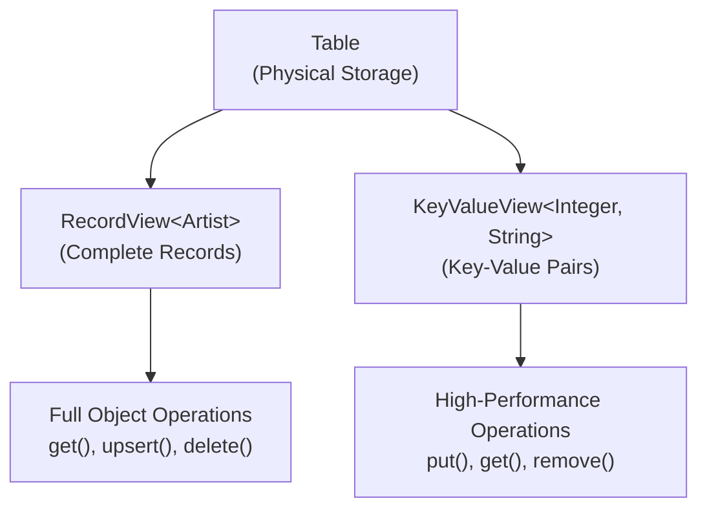

# Chapter 3.1: Table API for Object-Oriented Operations

## Learning Objectives

By completing this chapter, you will:

- Master object-oriented data access through RecordView and KeyValueView
- Understand when to use Table API versus SQL API for performance
- Implement CRUD operations with proper error handling and resource management
- Apply bulk operations and async patterns for performance scenarios

## Working with the Reference Application

The **`04-table-api-app`** demonstrates Table API patterns covered in this chapter using the music store dataset. Run it alongside your learning to see object-oriented data access patterns in action.

**Quick Start**: After reading this chapter, explore the reference application:

```bash
cd ignite3-reference-apps/04-table-api-app
mvn compile exec:java
```

The reference app shows how the schema design from [Module 2](../02-schema-design/01-basic-annotations.md) translates into CRUD operations, bulk processing, and async programming patterns.

## Understanding Object-Oriented Data Access

### Beyond SQL: Working with Data as Objects

Traditional database programming requires constant mental context switching. You design your application using object-oriented principles, but when it's time to persist or retrieve data, you switch to SQL thinking - rows, columns, JOIN operations, and result set iteration.

Apache Ignite 3's Table API reduces this friction by providing **native object-oriented data access**. Your Java objects become first-class citizens in the database, with direct CRUD operations that feel natural to Java developers.

### Why Object-Oriented Data Access Matters

Consider a typical music store operation - finding an artist and updating their information:

**Traditional SQL Approach:**

```java
// Mental model: Objects
Artist artist = new Artist(1, "AC/DC");

// Implementation: SQL context switch
String sql = "SELECT ArtistId, Name FROM Artist WHERE ArtistId = ?";
try (PreparedStatement stmt = connection.prepareStatement(sql)) {
    stmt.setInt(1, 1);
    ResultSet rs = stmt.executeQuery();
    if (rs.next()) {
        artist.setName(rs.getString("Name"));
        // Manual mapping between ResultSet and Object
    }
}

// Update: More SQL
String updateSql = "UPDATE Artist SET Name = ? WHERE ArtistId = ?";
try (PreparedStatement stmt = connection.prepareStatement(updateSql)) {
    stmt.setString(1, "AC/DC (Remastered)");
    stmt.setInt(2, 1);
    stmt.executeUpdate();
}
```

**Ignite 3 Table API Approach:**

```java
// Mental model and implementation: Objects all the way
Table artistTable = client.tables().table("Artist");
RecordView<Artist> artists = artistTable.recordView(Artist.class);

// Direct object operations - no SQL required
Artist artist = artists.get(null, new Artist(1, null));
if (artist != null) {
    artist.setName("AC/DC (Remastered)");
    artists.upsert(null, artist);
}
```

The difference is profound: **zero impedance mismatch** between your object model and data operations.

### When to Use Table API vs SQL API

Understanding when to use each approach is crucial for optimal performance and code clarity:

**Use Table API When:**

- **Known Primary Keys**: You know exactly which records to fetch
- **Single Record Operations**: Working with individual entities
- **Type Safety Critical**: Compile-time validation prevents runtime errors
- **Complex Object Graphs**: POJOs with nested relationships
- **High-Performance Point Operations**: Direct key-based access

**Use SQL API When:**

- **Complex Queries**: JOIN operations across multiple tables
- **Aggregate Functions**: COUNT, SUM, AVG, GROUP BY operations
- **Range Queries**: WHERE clauses with conditions beyond exact key match
- **Analytical Operations**: Reporting and business intelligence queries
- **Dynamic Queries**: Query structure determined at runtime

## Table API Architecture Overview

The Table API provides two complementary views of your data:



**RecordView**: Work with complete objects, ideal for business logic
**KeyValueView**: Work with key-value pairs, ideal for caching and high-performance operations

## RecordView: Full Object Operations

### Basic CRUD Operations

RecordView provides intuitive object-oriented operations:

```java
public class ArtistOperations {
    private final RecordView<Artist> artists;
    
    public ArtistOperations(IgniteClient client) {
        Table artistTable = client.tables().table("Artist");
        this.artists = artistTable.recordView(Artist.class);
    }
    
    // Create/Update operations
    public void saveArtist(Artist artist) {
        artists.upsert(null, artist);  // Insert or update
    }
    
    public boolean createArtistIfNotExists(Artist artist) {
        return artists.insert(null, artist);  // Insert only, returns false if exists
    }
    
    public boolean updateExistingArtist(Artist artist) {
        return artists.replace(null, artist);  // Update only, returns false if doesn't exist
    }
    
    // Read operations
    public Artist findArtist(Integer artistId) {
        Artist key = new Artist();
        key.setArtistId(artistId);
        return artists.get(null, key);
    }
    
    public Artist findArtistOrDefault(Integer artistId, Artist defaultArtist) {
        Artist found = findArtist(artistId);
        return found != null ? found : defaultArtist;
    }
    
    // Delete operations
    public boolean deleteArtist(Integer artistId) {
        Artist key = new Artist();
        key.setArtistId(artistId);
        return artists.delete(null, key);
    }
    
    public Artist deleteAndReturn(Integer artistId) {
        Artist key = new Artist();
        key.setArtistId(artistId);
        return artists.getAndDelete(null, key);  // Returns deleted record
    }
}
```

### Bulk Operations for Performance

Process multiple records efficiently with bulk operations:

```java
public class BulkArtistOperations {
    private final RecordView<Artist> artists;
    
    public BulkArtistOperations(IgniteClient client) {
        Table artistTable = client.tables().table("Artist");
        this.artists = artistTable.recordView(Artist.class);
    }
    
    // Bulk insert/update
    public void importArtists(Collection<Artist> artistList) {
        artists.upsertAll(null, artistList);
    }
    
    // Bulk read
    public Collection<Artist> findArtists(Collection<Integer> artistIds) {
        // Convert IDs to key objects
        Collection<Artist> keys = artistIds.stream()
            .map(id -> {
                Artist key = new Artist();
                key.setArtistId(id);
                return key;
            })
            .collect(Collectors.toList());
        
        return artists.getAll(null, keys);
    }
    
    // Bulk delete
    public Collection<Artist> deleteArtists(Collection<Integer> artistIds) {
        Collection<Artist> keys = artistIds.stream()
            .map(id -> {
                Artist key = new Artist();
                key.setArtistId(id);
                return key;
            })
            .collect(Collectors.toList());
        
        return artists.deleteAll(null, keys);
    }
    
    // Bulk conditional operations
    public void updatePricesConditionally(Collection<Track> tracks) {
        for (Track track : tracks) {
            // Only update if current price is less than new price
            artists.replace(null, track, 
                existingTrack -> existingTrack.getUnitPrice().compareTo(track.getUnitPrice()) < 0);
        }
    }
}
```

### Advanced Object Patterns

Handle complex scenarios with advanced patterns:

```java
public class AdvancedArtistPatterns {
    private final RecordView<Artist> artists;
    private final RecordView<Album> albums;
    
    public AdvancedArtistPatterns(IgniteClient client) {
        this.artists = client.tables().table("Artist").recordView(Artist.class);
        this.albums = client.tables().table("Album").recordView(Album.class);
    }
    
    // Atomic compare-and-replace
    public boolean updateArtistIfNameMatches(Integer artistId, String expectedName, String newName) {
        Artist key = new Artist();
        key.setArtistId(artistId);
        
        Artist expectedArtist = new Artist(artistId, expectedName);
        Artist newArtist = new Artist(artistId, newName);
        
        return artists.replace(null, expectedArtist, newArtist);
    }
    
    // Complex object retrieval with related data
    public ArtistWithAlbums getArtistWithAlbums(Integer artistId) {
        // Get the artist
        Artist artist = findArtist(artistId);
        if (artist == null) {
            return null;
        }
        
        // Get all albums for this artist (leveraging colocation)
        Collection<Album> artistAlbums = albums.getAll(null, 
            generateAlbumKeysForArtist(artistId));
        
        return new ArtistWithAlbums(artist, artistAlbums);
    }
    
    private Collection<Album> generateAlbumKeysForArtist(Integer artistId) {
        // In a real application, you'd have a way to know album IDs
        // This might come from a secondary index or separate query
        // For demonstration, assuming you have album IDs
        return IntStream.range(1, 10)
            .mapToObj(albumId -> {
                Album key = new Album();
                key.setAlbumId(albumId);
                key.setArtistId(artistId);
                return key;
            })
            .collect(Collectors.toList());
    }
    
    private Artist findArtist(Integer artistId) {
        Artist key = new Artist();
        key.setArtistId(artistId);
        return artists.get(null, key);
    }
}

// Helper class for complex operations
class ArtistWithAlbums {
    private final Artist artist;
    private final Collection<Album> albums;
    
    public ArtistWithAlbums(Artist artist, Collection<Album> albums) {
        this.artist = artist;
        this.albums = albums;
    }
    
    // Getters and business logic methods...
}
```

## KeyValueView: High-Performance Operations

For maximum performance scenarios, use KeyValueView for simple key-value operations:

```java
public class HighPerformanceCache {
    private final KeyValueView<Integer, String> artistNames;
    private final KeyValueView<String, Integer> artistLookup;
    
    public HighPerformanceCache(IgniteClient client) {
        Table artistTable = client.tables().table("Artist");
        this.artistNames = artistTable.keyValueView(Integer.class, String.class);
        
        // Note: This assumes you have a separate table/view for reverse lookup
        // In practice, you might use SQL API for this kind of lookup
        this.artistLookup = artistTable.keyValueView(String.class, Integer.class);
    }
    
    // Simple key-value operations
    public void cacheArtistName(Integer artistId, String name) {
        artistNames.put(null, artistId, name);
    }
    
    public String getArtistName(Integer artistId) {
        return artistNames.get(null, artistId);
    }
    
    public void removeArtistFromCache(Integer artistId) {
        artistNames.remove(null, artistId);
    }
    
    // Bulk key-value operations
    public void loadArtistCache(Map<Integer, String> artistData) {
        artistNames.putAll(null, artistData);
    }
    
    public Map<Integer, String> getMultipleArtists(Collection<Integer> artistIds) {
        return artistNames.getAll(null, artistIds);
    }
    
    // Conditional operations
    public boolean updateArtistNameIfExists(Integer artistId, String newName) {
        return artistNames.replace(null, artistId, newName);
    }
    
    public String setArtistNameIfAbsent(Integer artistId, String name) {
        return artistNames.putIfAbsent(null, artistId, name);
    }
}
```

## Asynchronous Operations

Scale performance with non-blocking async operations:

```java
public class AsyncArtistOperations {
    private final RecordView<Artist> artists;
    
    public AsyncArtistOperations(IgniteClient client) {
        this.artists = client.tables().table("Artist").recordView(Artist.class);
    }
    
    // Async single operations
    public CompletableFuture<Artist> findArtistAsync(Integer artistId) {
        Artist key = new Artist();
        key.setArtistId(artistId);
        return artists.getAsync(null, key);
    }
    
    public CompletableFuture<Void> saveArtistAsync(Artist artist) {
        return artists.upsertAsync(null, artist);
    }
    
    // Async bulk operations
    public CompletableFuture<Collection<Artist>> findMultipleArtistsAsync(Collection<Integer> artistIds) {
        Collection<Artist> keys = artistIds.stream()
            .map(id -> {
                Artist key = new Artist();
                key.setArtistId(id);
                return key;
            })
            .collect(Collectors.toList());
        
        return artists.getAllAsync(null, keys);
    }
    
    // Chaining async operations
    public CompletableFuture<String> getArtistNameAsync(Integer artistId) {
        return findArtistAsync(artistId)
            .thenApply(artist -> artist != null ? artist.getName() : "Unknown Artist");
    }
    
    // Parallel async operations
    public CompletableFuture<Map<String, Artist>> loadArtistsByGenre(Collection<String> genres) {
        Map<String, CompletableFuture<Artist>> futures = new HashMap<>();
        
        // Start all async operations in parallel
        for (String genre : genres) {
            // This would typically involve a more complex lookup
            CompletableFuture<Artist> future = findRepresentativeArtistForGenre(genre);
            futures.put(genre, future);
        }
        
        // Combine all results
        return CompletableFuture.allOf(futures.values().toArray(new CompletableFuture[0]))
            .thenApply(v -> futures.entrySet().stream()
                .collect(Collectors.toMap(
                    Map.Entry::getKey,
                    entry -> entry.getValue().join()
                )));
    }
    
    private CompletableFuture<Artist> findRepresentativeArtistForGenre(String genre) {
        // Simplified example - in practice this might involve SQL API
        return CompletableFuture.supplyAsync(() -> {
            // Logic to find representative artist for genre
            return new Artist(1, "Sample Artist for " + genre);
        });
    }
}
```

## Error Handling and Resource Management

Implement robust error handling for production applications:

```java
public class RobustArtistService {
    private final RecordView<Artist> artists;
    
    public RobustArtistService(IgniteClient client) {
        this.artists = client.tables().table("Artist").recordView(Artist.class);
    }
    
    public Optional<Artist> findArtistSafely(Integer artistId) {
        try {
            Artist key = new Artist();
            key.setArtistId(artistId);
            Artist result = artists.get(null, key);
            return Optional.ofNullable(result);
            
        } catch (Exception e) {
            // Log the error appropriately
            System.err.println("Failed to find artist " + artistId + ": " + e.getMessage());
            return Optional.empty();
        }
    }
    
    public boolean saveArtistSafely(Artist artist) {
        try {
            artists.upsert(null, artist);
            return true;
            
        } catch (Exception e) {
            System.err.println("Failed to save artist " + artist.getArtistId() + ": " + e.getMessage());
            return false;
        }
    }
    
    public CompletableFuture<Optional<Artist>> findArtistWithTimeout(Integer artistId, Duration timeout) {
        CompletableFuture<Artist> operation = findArtistAsync(artistId);
        
        return operation
            .thenApply(Optional::ofNullable)
            .completeOnTimeout(Optional.empty(), timeout.toMillis(), TimeUnit.MILLISECONDS)
            .exceptionally(throwable -> {
                System.err.println("Artist lookup failed or timed out: " + throwable.getMessage());
                return Optional.empty();
            });
    }
    
    private CompletableFuture<Artist> findArtistAsync(Integer artistId) {
        Artist key = new Artist();
        key.setArtistId(artistId);
        return artists.getAsync(null, key);
    }
}
```

## Performance Best Practices

Optimize your Table API usage for production workloads:

### 1. Use Bulk Operations When Possible

```java
// ✓ Efficient: Single bulk operation
artists.upsertAll(null, artistList);

// ✗ Inefficient: Multiple individual operations
for (Artist artist : artistList) {
    artists.upsert(null, artist);
}
```

### 2. Leverage Async Operations for High Throughput

```java
// ✓ Efficient: Parallel async operations
List<CompletableFuture<Artist>> futures = artistIds.stream()
    .map(this::findArtistAsync)
    .collect(Collectors.toList());

CompletableFuture.allOf(futures.toArray(new CompletableFuture[0]))
    .thenApply(v -> futures.stream()
        .map(CompletableFuture::join)
        .collect(Collectors.toList()));
```

### 3. Minimize Object Creation for Keys

```java
// ✓ Efficient: Reuse key objects when possible
Artist keyTemplate = new Artist();
for (Integer id : artistIds) {
    keyTemplate.setArtistId(id);
    Artist result = artists.get(null, keyTemplate);
    // Process result
}
```

The Table API provides the foundation for all object-oriented data operations in Ignite 3, offering both simplicity and high performance for distributed applications.

## Next Steps

Understanding Table API operations prepares you for complex analytical queries and relational data access:

**[Chapter 3.2: SQL API for Analytics and Reporting](02-sql-api-analytics.md)** - Master complex queries, joins, and analytical operations using the SQL API

**[Chapter 3.3: Choosing the Right API](03-sql-api-selection-guide.md)** - Learn decision frameworks for optimal API selection based on your use case requirements
