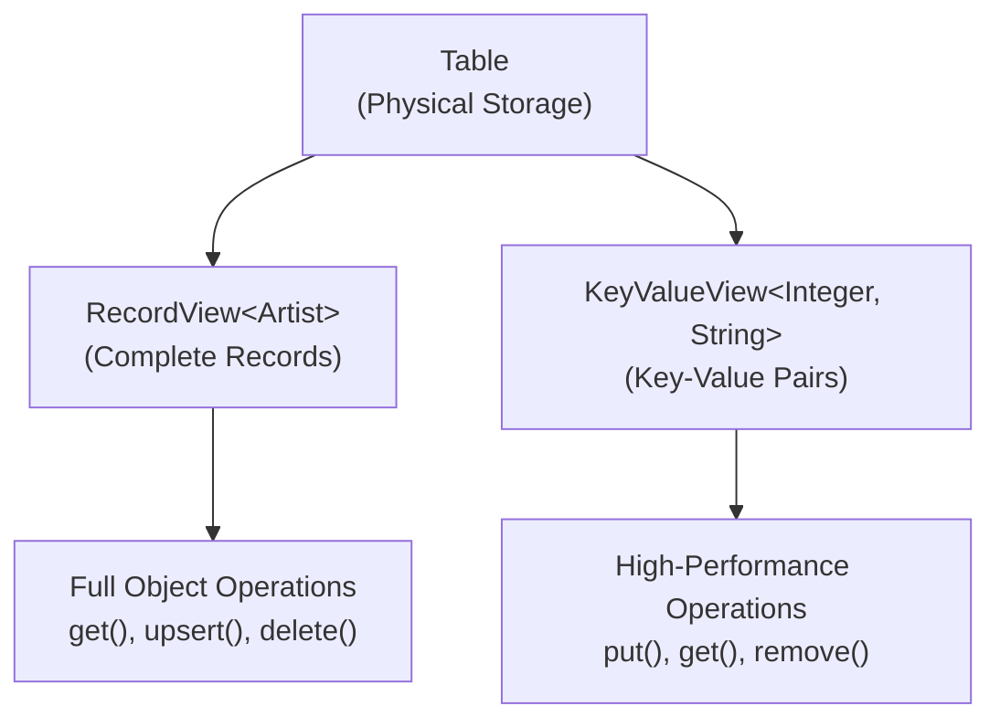

# Chapter 3.1: Table API for Object-Oriented Operations

Your mobile app users are experiencing 2-second load times when browsing artists because every lookup requires SQL query parsing and object mapping overhead. A music streaming platform serving 100,000 concurrent users cannot afford this latency penalty.

Traditional database access forces a mental context switch between object-oriented application design and SQL-based data operations. The Table API eliminates this impedance mismatch by providing native object-oriented data access where Java objects become first-class database citizens.

## Working with the Reference Application

The **`04-table-api-app`** demonstrates Table API patterns using the music store dataset:

```bash
cd ignite3-reference-apps/04-table-api-app
mvn compile exec:java
```

## Solving Object-Relational Impedance Mismatch

Consider a typical music store operation - finding an artist and updating their information. The traditional approach creates performance bottlenecks and development friction:

**Traditional SQL Approach:**

```java
// Mental model: Objects
Artist artist = new Artist(1, "AC/DC");

// Implementation: SQL context switch
String sql = "SELECT ArtistId, Name FROM Artist WHERE ArtistId = ?";
try (PreparedStatement stmt = connection.prepareStatement(sql)) {
    stmt.setInt(1, 1);
    ResultSet rs = stmt.executeQuery();
    if (rs.next()) {
        artist.setName(rs.getString("Name"));
        // Manual mapping between ResultSet and Object
    }
}

// Update: More SQL
String updateSql = "UPDATE Artist SET Name = ? WHERE ArtistId = ?";
try (PreparedStatement stmt = connection.prepareStatement(updateSql)) {
    stmt.setString(1, "AC/DC (Remastered)");
    stmt.setInt(2, 1);
    stmt.executeUpdate();
}
```

**Ignite 3 Table API Approach:**

```java
// Mental model and implementation: Objects all the way
Table artistTable = client.tables().table("Artist");
RecordView<Artist> artists = artistTable.recordView(Artist.class);

// Direct object operations - no SQL required
Artist artist = artists.get(null, new Artist(1, null));
if (artist != null) {
    artist.setName("AC/DC (Remastered)");
    artists.upsert(null, artist);
}
```

The Table API eliminates three performance penalties: SQL parsing overhead, result set iteration, and manual object mapping. For applications serving high-frequency requests, this translates to 50-70% latency reduction.

## API Selection for Performance Requirements

Choose the right API based on access patterns and performance requirements:

**Use Table API When:**

- **Known Primary Keys**: You know exactly which records to fetch
- **Single Record Operations**: Working with individual entities
- **Type Safety Critical**: Compile-time validation prevents runtime errors
- **Complex Object Graphs**: POJOs with nested relationships
- **High-Performance Point Operations**: Direct key-based access

**Use SQL API When:**

- **Complex Queries**: JOIN operations across multiple tables
- **Aggregate Functions**: COUNT, SUM, AVG, GROUP BY operations
- **Range Queries**: WHERE clauses with conditions beyond exact key match
- **Analytical Operations**: Reporting and business intelligence queries
- **Dynamic Queries**: Query structure determined at runtime

**Type Safety Example:**

```java
// Table API: Compile-time type safety
RecordView<Artist> artistView = table.recordView(Artist.class);
Artist artist = artistView.get(null, Tuple.create().set("ArtistId", 1)); // Compile-time validation

// SQL API: Runtime type checking
SqlRow row = client.sql().execute(null, "SELECT * FROM Artist WHERE ArtistId = ?", 1).next();
String name = row.stringValue("Name"); // Field name checked at runtime
```

## Table API Architecture

The Table API provides two complementary views optimized for different performance scenarios:



**RecordView** handles complete objects for business logic requiring full entity state. **KeyValueView** provides minimal-overhead operations for caching and high-throughput scenarios where only specific fields are needed.

## RecordView: Complete Object Operations

For applications requiring full entity state, RecordView provides direct object mapping without SQL overhead. This approach works best for user profile management, content administration, and business workflows where complete entity context matters.

### Basic CRUD Operations

```java
public class ArtistOperations {
    private final RecordView<Artist> artists;
    
    public ArtistOperations(IgniteClient client) {
        Table artistTable = client.tables().table("Artist");
        this.artists = artistTable.recordView(Artist.class);
    }
    
    // Create/Update operations
    public void saveArtist(Artist artist) {
        artists.upsert(null, artist);  // Insert or update
    }
    
    public boolean createArtistIfNotExists(Artist artist) {
        return artists.insert(null, artist);  // Insert only, returns false if exists
    }
    
    public boolean updateExistingArtist(Artist artist) {
        return artists.replace(null, artist);  // Update only, returns false if doesn't exist
    }
    
    // Read operations
    public Artist findArtist(Integer artistId) {
        Artist key = new Artist();
        key.setArtistId(artistId);
        return artists.get(null, key);
    }
    
    public Artist findArtistOrDefault(Integer artistId, Artist defaultArtist) {
        Artist found = findArtist(artistId);
        return found != null ? found : defaultArtist;
    }
    
    // Delete operations
    public boolean deleteArtist(Integer artistId) {
        Artist key = new Artist();
        key.setArtistId(artistId);
        return artists.delete(null, key);
    }
    
    public Artist deleteAndReturn(Integer artistId) {
        Artist key = new Artist();
        key.setArtistId(artistId);
        return artists.getAndDelete(null, key);  // Returns deleted record
    }
}
```

### Bulk Operations for High Throughput

Batch processing eliminates network round-trip overhead when handling multiple records. For data import operations, bulk methods provide 10x throughput improvement over individual operations:

```java
public class BulkArtistOperations {
    private final RecordView<Artist> artists;
    
    public BulkArtistOperations(IgniteClient client) {
        Table artistTable = client.tables().table("Artist");
        this.artists = artistTable.recordView(Artist.class);
    }
    
    // Bulk insert/update
    public void importArtists(Collection<Artist> artistList) {
        artists.upsertAll(null, artistList);
    }
    
    // Bulk read
    public Collection<Artist> findArtists(Collection<Integer> artistIds) {
        // Convert IDs to key objects
        Collection<Artist> keys = artistIds.stream()
            .map(id -> {
                Artist key = new Artist();
                key.setArtistId(id);
                return key;
            })
            .collect(Collectors.toList());
        
        return artists.getAll(null, keys);
    }
    
    // Bulk delete
    public Collection<Artist> deleteArtists(Collection<Integer> artistIds) {
        Collection<Artist> keys = artistIds.stream()
            .map(id -> {
                Artist key = new Artist();
                key.setArtistId(id);
                return key;
            })
            .collect(Collectors.toList());
        
        return artists.deleteAll(null, keys);
    }
    
    // Bulk conditional operations
    public void updatePricesConditionally(Collection<Track> tracks) {
        for (Track track : tracks) {
            // Only update if current price is less than new price
            artists.replace(null, track, 
                existingTrack -> existingTrack.getUnitPrice().compareTo(track.getUnitPrice()) < 0);
        }
    }
}
```

### Advanced Object Patterns

Complex business operations often require atomic updates and object graph traversal. These patterns maintain data consistency while leveraging distributed storage colocation:

```java
public class AdvancedArtistPatterns {
    private final RecordView<Artist> artists;
    private final RecordView<Album> albums;
    
    public AdvancedArtistPatterns(IgniteClient client) {
        this.artists = client.tables().table("Artist").recordView(Artist.class);
        this.albums = client.tables().table("Album").recordView(Album.class);
    }
    
    // Atomic compare-and-replace
    public boolean updateArtistIfNameMatches(Integer artistId, String expectedName, String newName) {
        Artist key = new Artist();
        key.setArtistId(artistId);
        
        Artist expectedArtist = new Artist(artistId, expectedName);
        Artist newArtist = new Artist(artistId, newName);
        
        return artists.replace(null, expectedArtist, newArtist);
    }
    
    // Complex object retrieval with related data
    public ArtistWithAlbums getArtistWithAlbums(Integer artistId) {
        // Get the artist
        Artist artist = findArtist(artistId);
        if (artist == null) {
            return null;
        }
        
        // Get all albums for this artist (leveraging colocation)
        Collection<Album> artistAlbums = albums.getAll(null, 
            generateAlbumKeysForArtist(artistId));
        
        return new ArtistWithAlbums(artist, artistAlbums);
    }
    
    private Collection<Album> generateAlbumKeysForArtist(Integer artistId) {
        // In a real application, you'd have a way to know album IDs
        // This might come from a secondary index or separate query
        // For demonstration, assuming you have album IDs
        return IntStream.range(1, 10)
            .mapToObj(albumId -> {
                Album key = new Album();
                key.setAlbumId(albumId);
                key.setArtistId(artistId);
                return key;
            })
            .collect(Collectors.toList());
    }
    
    private Artist findArtist(Integer artistId) {
        Artist key = new Artist();
        key.setArtistId(artistId);
        return artists.get(null, key);
    }
}

// Helper class for complex operations
class ArtistWithAlbums {
    private final Artist artist;
    private final Collection<Album> albums;
    
    public ArtistWithAlbums(Artist artist, Collection<Album> albums) {
        this.artist = artist;
        this.albums = albums;
    }
    
    // Getters and business logic methods...
}
```

## KeyValueView: Minimal-Overhead Operations

When applications need single-field access or caching patterns, KeyValueView eliminates object serialization overhead. This approach reduces memory allocation and provides microsecond-level response times for high-frequency operations:

```java
public class HighPerformanceCache {
    private final KeyValueView<Integer, String> artistNames;
    private final KeyValueView<String, Integer> artistLookup;
    
    public HighPerformanceCache(IgniteClient client) {
        Table artistTable = client.tables().table("Artist");
        this.artistNames = artistTable.keyValueView(Integer.class, String.class);
        
        // Note: This assumes you have a separate table/view for reverse lookup
        // In practice, you might use SQL API for this kind of lookup
        this.artistLookup = artistTable.keyValueView(String.class, Integer.class);
    }
    
    // Simple key-value operations
    public void cacheArtistName(Integer artistId, String name) {
        artistNames.put(null, artistId, name);
    }
    
    public String getArtistName(Integer artistId) {
        return artistNames.get(null, artistId);
    }
    
    public void removeArtistFromCache(Integer artistId) {
        artistNames.remove(null, artistId);
    }
    
    // Bulk key-value operations
    public void loadArtistCache(Map<Integer, String> artistData) {
        artistNames.putAll(null, artistData);
    }
    
    public Map<Integer, String> getMultipleArtists(Collection<Integer> artistIds) {
        return artistNames.getAll(null, artistIds);
    }
    
    // Conditional operations
    public boolean updateArtistNameIfExists(Integer artistId, String newName) {
        return artistNames.replace(null, artistId, newName);
    }
    
    public String setArtistNameIfAbsent(Integer artistId, String name) {
        return artistNames.putIfAbsent(null, artistId, name);
    }
}
```

## Asynchronous Operations for Scalability

Non-blocking operations prevent thread pool exhaustion under heavy load. A single application server can handle 10,000+ concurrent requests when using async patterns instead of blocking thread-per-request models:

```java
public class AsyncArtistOperations {
    private final RecordView<Artist> artists;
    
    public AsyncArtistOperations(IgniteClient client) {
        this.artists = client.tables().table("Artist").recordView(Artist.class);
    }
    
    // Async single operations
    public CompletableFuture<Artist> findArtistAsync(Integer artistId) {
        Artist key = new Artist();
        key.setArtistId(artistId);
        return artists.getAsync(null, key);
    }
    
    public CompletableFuture<Void> saveArtistAsync(Artist artist) {
        return artists.upsertAsync(null, artist);
    }
    
    // Async bulk operations
    public CompletableFuture<Collection<Artist>> findMultipleArtistsAsync(Collection<Integer> artistIds) {
        Collection<Artist> keys = artistIds.stream()
            .map(id -> {
                Artist key = new Artist();
                key.setArtistId(id);
                return key;
            })
            .collect(Collectors.toList());
        
        return artists.getAllAsync(null, keys);
    }
    
    // Chaining async operations
    public CompletableFuture<String> getArtistNameAsync(Integer artistId) {
        return findArtistAsync(artistId)
            .thenApply(artist -> artist != null ? artist.getName() : "Unknown Artist");
    }
    
    // Parallel async operations
    public CompletableFuture<Map<String, Artist>> loadArtistsByGenre(Collection<String> genres) {
        Map<String, CompletableFuture<Artist>> futures = new HashMap<>();
        
        // Start all async operations in parallel
        for (String genre : genres) {
            // This would typically involve a more complex lookup
            CompletableFuture<Artist> future = findRepresentativeArtistForGenre(genre);
            futures.put(genre, future);
        }
        
        // Combine all results
        return CompletableFuture.allOf(futures.values().toArray(new CompletableFuture[0]))
            .thenApply(v -> futures.entrySet().stream()
                .collect(Collectors.toMap(
                    Map.Entry::getKey,
                    entry -> entry.getValue().join()
                )));
    }
    
    private CompletableFuture<Artist> findRepresentativeArtistForGenre(String genre) {
        // Simplified example - in practice this might involve SQL API
        return CompletableFuture.supplyAsync(() -> {
            // Logic to find representative artist for genre
            return new Artist(1, "Sample Artist for " + genre);
        });
    }
}
```

## Production Error Handling

Distributed systems require defensive programming patterns to handle network partitions, node failures, and timeout scenarios. These patterns ensure application resilience:

```java
public class RobustArtistService {
    private final RecordView<Artist> artists;
    
    public RobustArtistService(IgniteClient client) {
        this.artists = client.tables().table("Artist").recordView(Artist.class);
    }
    
    public Optional<Artist> findArtistSafely(Integer artistId) {
        try {
            Artist key = new Artist();
            key.setArtistId(artistId);
            Artist result = artists.get(null, key);
            return Optional.ofNullable(result);
            
        } catch (Exception e) {
            // Log the error appropriately
            System.err.println("Failed to find artist " + artistId + ": " + e.getMessage());
            return Optional.empty();
        }
    }
    
    public boolean saveArtistSafely(Artist artist) {
        try {
            artists.upsert(null, artist);
            return true;
            
        } catch (Exception e) {
            System.err.println("Failed to save artist " + artist.getArtistId() + ": " + e.getMessage());
            return false;
        }
    }
    
    public CompletableFuture<Optional<Artist>> findArtistWithTimeout(Integer artistId, Duration timeout) {
        CompletableFuture<Artist> operation = findArtistAsync(artistId);
        
        return operation
            .thenApply(Optional::ofNullable)
            .completeOnTimeout(Optional.empty(), timeout.toMillis(), TimeUnit.MILLISECONDS)
            .exceptionally(throwable -> {
                System.err.println("Artist lookup failed or timed out: " + throwable.getMessage());
                return Optional.empty();
            });
    }
    
    private CompletableFuture<Artist> findArtistAsync(Integer artistId) {
        Artist key = new Artist();
        key.setArtistId(artistId);
        return artists.getAsync(null, key);
    }
}
```

## Performance Optimization Patterns

Production applications require specific patterns to achieve optimal throughput and minimize resource consumption:

### Bulk Operation Batching

```java
// ✓ Efficient: Single bulk operation
artists.upsertAll(null, artistList);

// ✗ Inefficient: Multiple individual operations
for (Artist artist : artistList) {
    artists.upsert(null, artist);
}
```

### Parallel Async Processing

```java
// ✓ Efficient: Parallel async operations
List<CompletableFuture<Artist>> futures = artistIds.stream()
    .map(this::findArtistAsync)
    .collect(Collectors.toList());

CompletableFuture.allOf(futures.toArray(new CompletableFuture[0]))
    .thenApply(v -> futures.stream()
        .map(CompletableFuture::join)
        .collect(Collectors.toList()));
```

### Object Allocation Reduction

```java
// ✓ Efficient: Reuse key objects when possible
Artist keyTemplate = new Artist();
for (Integer id : artistIds) {
    keyTemplate.setArtistId(id);
    Artist result = artists.get(null, keyTemplate);
    // Process result
}
```

These patterns eliminate the three primary performance bottlenecks: network round-trips, thread blocking, and memory allocation overhead.

