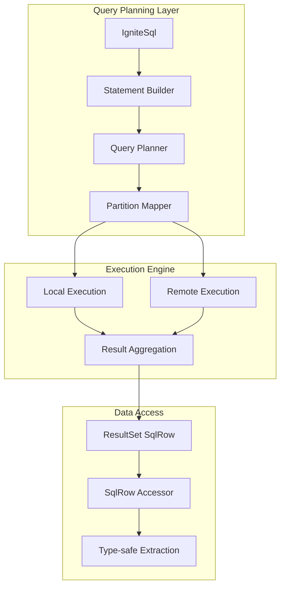

<!--
Licensed under Creative Commons Attribution-ShareAlike 4.0 International (CC BY-SA 4.0)
SPDX-License-Identifier: CC-BY-SA-4.0
For full license text, see LICENSE-CC-BY-SA-4.0
-->

# Chapter 3.2: SQL API for Analytics and Reporting

Your marketing dashboard queries timeout when analyzing listening behavior because joins across Artist-Album-Track tables hit multiple partitions. Cross-partition joins force Ignite to pull data from multiple nodes, creating network bottlenecks that turn sub-second queries into multi-second failures. The SQL API provides optimization techniques that exploit data colocation and query planning to solve these analytical performance challenges.

Building on the colocation strategies from [Chapter 3.1](01-table-api-operations.md), this chapter shows how SQL operations leverage partition-aware execution to deliver consistent analytical performance at scale.

## Working with the Reference Application

The **`05-sql-api-app`** demonstrates SQL API optimization techniques with analytics examples that show query planning, colocation exploitation, and distributed aggregation techniques:

```bash
cd ignite3-reference-apps/05-sql-api-app
mvn compile exec:java
```

The reference application implements all patterns from this chapter as working examples. Use it to experiment with query optimization, colocation strategies, and distributed aggregation techniques.

- **Critical Implementation Note** - Ignite 3 normalizes all SQL metadata (table names, column names, aliases) to uppercase. Always use uppercase names in `SqlRow.stringValue()` and other accessor methods regardless of schema definition.

## SQL Query Planning and Execution Architecture

The SQL API optimizes distributed query execution through partition-aware planning and colocation exploitation. Understanding these mechanisms helps you structure queries that execute efficiently across the cluster:



**Performance-Critical Components:**

- **Query Planner**: Analyzes WHERE clauses to identify partition pruning opportunities
- **Partition Mapper**: Routes operations to colocated data when possible
- **Result Aggregation**: Combines distributed results with minimal network overhead
- **Batch Processing**: Groups operations to reduce round-trip latency
- **Transaction Integration**: Coordinates ACID operations across partitions

## Building Partition-Aware SQL Queries

The `IgniteSql` interface provides the foundation for partition-aware query execution. Proper query construction and parameter binding directly impact whether operations execute locally or require expensive cross-partition coordination.

### Query Construction and Statement Builder API

Use `client.sql().statementBuilder()` to create optimized statements that leverage partition pruning:

```java
IgniteSql sql = client.sql();

// OPTIMAL: Query uses colocation key (ArtistId) for partition pruning
Statement colocatedQuery = sql.statementBuilder()
    .query("""
        SELECT a.Name as ArtistName, al.Title as AlbumTitle, 
               COUNT(t.TrackId) as TrackCount
        FROM Artist a
        JOIN Album al ON a.ArtistId = al.ArtistId
        JOIN Track t ON al.AlbumId = t.AlbumId  
        WHERE a.ArtistId = ?
        GROUP BY a.Name, al.Title
        """)
    .build();

// Single partition execution - sub-millisecond response
ResultSet<SqlRow> result = sql.execute(null, colocatedQuery, 42);
```

**Key Optimization Principles:**

- Filter by colocation keys (ArtistId, CustomerId) for single-partition execution
- Use proper JOIN order to minimize cross-partition data movement
- Apply WHERE clauses early to reduce data transfer volume

```

### Statement Configuration and Optimization

The `StatementBuilder` configures query execution parameters that directly impact distributed performance:

```java
// Configure statement for optimal distributed execution
Statement optimizedStmt = sql.statementBuilder()
    .query("SELECT * FROM Artist WHERE ArtistId = ?")
    .queryTimeout(5, TimeUnit.SECONDS)     // Prevent long-running queries
    .pageSize(1000)                        // Control memory usage
    .build();

// Batch operations for high-throughput inserts
BatchedArguments batch = BatchedArguments.create();
for (int i = 1; i <= 1000; i++) {
    batch.add("Generated Artist " + i, "Country " + (i % 10));
}
long[] insertCounts = sql.executeBatch(null, 
    "INSERT INTO Artist (Name, Country) VALUES (?, ?)", batch);
```

**Performance Configuration Options:**

- **queryTimeout**: Prevents runaway cross-partition queries
- **pageSize**: Controls memory usage for large result sets  
- **Batch Operations**: Reduces network round-trips for bulk operations
- **Statement Reuse**: Eliminates query parsing overhead

```

### Parameter Binding and Partition Pruning

Parameter binding enables query plan caching and partition pruning. Use colocation keys as parameters for optimal performance:

```java
// OPTIMAL: Colocation key parameter enables partition pruning
Statement partitionPrunedQuery = sql.statementBuilder()
    .query("""
        SELECT a.Name, COUNT(t.TrackId) as TrackCount
        FROM Artist a
        JOIN Album al ON a.ArtistId = al.ArtistId
        JOIN Track t ON al.AlbumId = t.AlbumId
        WHERE a.ArtistId = ?
        GROUP BY a.Name
        """)
    .build();

ResultSet<SqlRow> result = sql.execute(null, partitionPrunedQuery, 42);

// OPTIMAL: IN clause with colocation keys for parallel execution
ResultSet<SqlRow> multiArtist = sql.execute(null,
    "SELECT ArtistId, Name FROM Artist WHERE ArtistId IN (?, ?, ?)",
    1, 5, 10);
```

**Binding Best Practices:**

- Use colocation keys as parameters for single-partition execution
- Prefer IN clauses with colocation keys for parallel processing
- Avoid string concatenation - use parameterized queries
- Non-colocation key filters require full table scans

```

## Distributed ResultSet Processing

Large analytical queries generate massive result sets that can overwhelm client memory and network bandwidth. The SQL API provides streaming and pagination mechanisms that process distributed results efficiently.

### ResultSet Iteration and Data Extraction

Use the standard while-loop pattern for memory-efficient result processing:

```java
// Configure streaming with controlled memory usage
Statement streamingQuery = sql.statementBuilder()
    .query("""
        SELECT t.TrackId, t.Name, t.Milliseconds, t.UnitPrice,
               a.Name as ArtistName, al.Title as AlbumTitle
        FROM Track t
        JOIN Album al ON t.AlbumId = al.AlbumId
        JOIN Artist a ON al.ArtistId = a.ArtistId
        ORDER BY t.TrackId
        """)
    .pageSize(500)                          // Stream 500 rows per fetch
    .queryTimeout(60, TimeUnit.SECONDS)     // Prevent abandoned queries
    .build();

ResultSet<SqlRow> tracks = sql.execute(null, streamingQuery);

// Process results in streaming fashion - constant memory usage
long totalDuration = 0;
BigDecimal totalRevenue = BigDecimal.ZERO;
int processed = 0;

while (tracks.hasNext()) {
    SqlRow track = tracks.next();
    
    // Extract data with proper null handling
    long duration = track.longValue("MILLISECONDS");
    BigDecimal price = track.decimalValue("UNITPRICE");
    String artist = track.stringValue("ARTISTNAME");
    
    totalDuration += duration;
    totalRevenue = totalRevenue.add(price);
    processed++;
}

System.out.printf("Analysis complete: %d tracks, %d total minutes, $%.2f revenue%n",
    processed, totalDuration / 60000, totalRevenue);
    
```

**Key ResultSet Processing Patterns:**

- Use `pageSize` to control memory usage for large result sets
- Process results in streaming fashion with `while(rs.hasNext())`
- Extract data using typed accessors: `longValue()`, `stringValue()`, `decimalValue()`
- Handle hierarchical data through boundary detection and aggregation

```

## Type-Safe Data Extraction

Analytical queries return diverse data types that require careful extraction and null handling. Use typed accessor methods for safe data processing:

```java
// Type-safe data extraction with null handling
ResultSet<SqlRow> result = sql.execute(null, 
    "SELECT ArtistId, Name, Country, LastUpdated FROM Artist ORDER BY Name");

if (result.hasRowSet()) {
    while (result.hasNext()) {
        SqlRow row = result.next();
        
        // Required fields - will throw if null
        int artistId = row.intValue("ARTISTID");
        String name = row.stringValue("NAME");
        
        // Optional fields - handle nulls gracefully  
        String country = row.stringValue("COUNTRY");
        LocalDateTime lastUpdated = row.value("LASTUPDATED");
        
        System.out.printf("Artist %d: %s from %s%n", 
            artistId, name, country != null ? country : "Unknown");
    }
} else {
    // DML operations return affected row count
    long affected = result.affectedRows();
    System.out.printf("Modified %d records%n", affected);
}
```

**Data Extraction Best Practices:**

- Use typed accessors: `intValue()`, `stringValue()`, `decimalValue()`
- Check `hasRowSet()` to distinguish SELECT from DML operations
- Handle nullable fields with appropriate null checks
- Use `result.metadata()` for dynamic column inspection

```

## Distributed Analytics Patterns

Analytical workloads require complex aggregations and joins across multiple tables. Structure queries for optimal distributed execution:

### Colocated Analytics

Leverage data colocation for single-partition execution:

```java
// Colocated join - all data for ArtistId=1 on same partition
String colocatedQuery = """
    SELECT a.Name as ArtistName, al.Title as AlbumTitle, 
           t.Name as TrackName, t.UnitPrice, t.Milliseconds
    FROM Artist a
    JOIN Album al ON a.ArtistId = al.ArtistId  
    JOIN Track t ON al.AlbumId = t.AlbumId
    WHERE a.ArtistId = ?
    ORDER BY al.Title, t.TrackId
    """;

ResultSet<SqlRow> result = sql.execute(null, colocatedQuery, 1);
// Process results with boundary detection for hierarchical aggregation
```

### Distributed Aggregation

Use proper GROUP BY clauses for efficient cross-partition aggregation:

```java
// Multi-partition aggregation with local computation per partition
String distributedAggregateQuery = """
    SELECT a.Name as ArtistName,
           COUNT(t.TrackId) as TrackCount,
           AVG(t.Milliseconds) as AvgDuration,
           SUM(t.UnitPrice) as TotalValue
    FROM Artist a
    JOIN Album al ON a.ArtistId = al.ArtistId
    JOIN Track t ON al.AlbumId = t.AlbumId  
    GROUP BY a.ArtistId, a.Name
    HAVING COUNT(t.TrackId) >= 10
    ORDER BY TotalValue DESC
    """;

ResultSet<SqlRow> result = sql.execute(null, distributedAggregateQuery);
```

**Analytics Optimization Strategies:**

- Use colocation keys in WHERE clauses for single-partition execution
- Structure JOINs to follow colocation relationships
- Apply aggregation functions with proper GROUP BY clauses
- Use HAVING for post-aggregation filtering

```

## Transactional Analytics

Analytical operations often require ACID guarantees when combining read-heavy analytics with data modifications. Use transactions for consistent results:

```java
// Analytical transaction provides snapshot isolation
Transaction tx = client.transactions().begin();
try {
    // Analytical query sees consistent data snapshot
    ResultSet<SqlRow> beforeAnalytics = sql.execute(tx,
        "SELECT COUNT(*) as TrackCount, SUM(UnitPrice) as TotalValue " +
        "FROM Track WHERE ArtistId IN (SELECT ArtistId FROM Artist WHERE Country = ?)",
        "USA");
    
    // Modify data within transaction
    sql.execute(tx, "UPDATE Track SET UnitPrice = UnitPrice * 1.10 WHERE GenreId = ?", 1);
    
    // Analytical query sees modified data in same transaction
    ResultSet<SqlRow> afterAnalytics = sql.execute(tx, /* same query */);
    
    tx.commit();
} catch (Exception e) {
    // Automatic rollback ensures data consistency
}
```

**Transactional Analytics Benefits:**

- Snapshot isolation ensures consistent analytical results
- Combine Table API precision with SQL API analytics
- Coordinate updates across multiple partitions
- Automatic rollback preserves data integrity

```

## Production Analytics Patterns

Production analytical workloads require optimized query patterns that balance result accuracy with cluster resource usage.

### Business Intelligence Query Optimization

```java
// Revenue analytics with time-based filtering
Statement revenueQuery = sql.statementBuilder()
    .query("""
        SELECT g.Name as Genre,
               COUNT(il.InvoiceLineId) as SalesCount,
               SUM(il.UnitPrice * il.Quantity) as TotalRevenue
        FROM Genre g
        JOIN Track t ON g.GenreId = t.GenreId
        JOIN InvoiceLine il ON t.TrackId = il.TrackId
        JOIN Invoice i ON il.InvoiceId = i.InvoiceId
        WHERE i.InvoiceDate >= ? AND i.InvoiceDate < ?
        GROUP BY g.GenreId, g.Name
        ORDER BY TotalRevenue DESC
        """)
    .pageSize(100)
    .queryTimeout(30, TimeUnit.SECONDS)
    .build();

// Customer lifetime value analysis
Statement customerLTVQuery = sql.statementBuilder()
    .query("""
        SELECT c.CustomerId,
               c.FirstName || ' ' || c.LastName as CustomerName,
               COUNT(i.InvoiceId) as OrderCount,
               SUM(i.Total) as TotalSpent
        FROM Customer c
        JOIN Invoice i ON c.CustomerId = i.CustomerId
        WHERE i.InvoiceDate >= ?
        GROUP BY c.CustomerId, c.FirstName, c.LastName
        ORDER BY TotalSpent DESC
        """)
    .build();
```

**Business Intelligence Query Patterns:**

- Use time-range filters for performance and relevance
- Apply GROUP BY with proper aggregation functions  
- Set reasonable query timeouts for analytical workloads
- Use LIMIT clauses to control result set sizes

```

## Query Performance Optimization

Distributed analytical queries require optimization techniques that address partition distribution, query planning, and resource usage.

### Execution Plan Analysis

Use EXPLAIN to analyze query execution plans and identify performance bottlenecks:

```java
// Analyze execution plan for optimization opportunities
Statement explainQuery = sql.statementBuilder()
    .query("EXPLAIN SELECT t.Name, t.UnitPrice, a.Name as ArtistName " +
           "FROM Track t " +
           "JOIN Album al ON t.AlbumId = al.AlbumId " +
           "JOIN Artist a ON al.ArtistId = a.ArtistId " +
           "WHERE t.GenreId = ? AND t.UnitPrice > ?")
    .build();

ResultSet<SqlRow> explainResult = sql.execute(null, explainQuery, 1, new BigDecimal("0.99"));

// Optimized version using colocation-aware patterns
Statement optimizedQuery = sql.statementBuilder()
    .query("""
        SELECT t.Name, t.UnitPrice, a.Name as ArtistName
        FROM Track t
        JOIN Album al ON t.AlbumId = al.AlbumId
        JOIN Artist a ON al.ArtistId = a.ArtistId
        WHERE al.ArtistId = ?  -- Partition pruning by colocation key
          AND t.GenreId = ?    -- Secondary filter  
        ORDER BY t.Name
        """)
    .pageSize(500)
    .build();
```

### Batch Operations for High Throughput

Minimize network overhead through batch operations:

```java
// Prepare batch with realistic data distribution
BatchedArguments batchInsert = BatchedArguments.create();
for (int i = 1; i <= 5000; i++) {
    int artistId = (i % 50) + 1;  // Distribute across artists
    batchInsert.add("Generated Track " + i, albumId, artistId, /* other fields */);
}

// Execute batch insert
Statement batchStatement = sql.statementBuilder()
    .query("INSERT INTO Track (Name, AlbumId, ArtistId, ...) VALUES (?, ?, ?, ...)")
    .queryTimeout(60, TimeUnit.SECONDS)
    .build();

long[] results = sql.executeBatch(null, batchStatement, batchInsert);
```

**Performance Optimization Strategies:**

- Use EXPLAIN to identify execution plan bottlenecks
- Apply partition pruning through colocation key filters
- Batch operations to reduce network round-trips
- Set appropriate query timeouts and page sizes

```

## Production Error Handling

Distributed analytical queries require robust error handling for network partitions, node failures, and resource constraints:

```java
// Robust analytics with comprehensive error handling
public Optional<AnalyticsResult> executeRobustAnalytics(IgniteSql sql, String searchTerm) {
    Statement analyticsQuery = sql.statementBuilder()
        .query("""
            SELECT t.TrackId, t.Name, t.UnitPrice, t.Milliseconds,
                   a.Name as ArtistName, al.Title as AlbumTitle
            FROM Track t
            JOIN Album al ON t.AlbumId = al.AlbumId
            JOIN Artist a ON al.ArtistId = a.ArtistId
            WHERE t.Name LIKE ?
            """)
        .queryTimeout(30, TimeUnit.SECONDS)  // Prevent runaway queries
        .pageSize(1000)  // Control memory usage
        .build();
    
    try {
        ResultSet<SqlRow> result = sql.execute(null, analyticsQuery, "%" + searchTerm + "%");
        // Process results and return analytics
        return Optional.of(processResults(result));
        
    } catch (SqlTimeoutException e) {
        System.err.printf("Query timeout for term '%s'%n", searchTerm);
        return Optional.empty();
    } catch (SqlException e) {
        System.err.printf("SQL execution failed for term '%s'%n", searchTerm);
        return Optional.empty();
    }
}

// Asynchronous analytics with error handling
public CompletableFuture<Optional<RevenueAnalytics>> calculateRevenueAsync(
        IgniteSql sql, LocalDate startDate, LocalDate endDate) {
    
    return sql.executeAsync(null, revenueQuery, startDate, endDate)
        .thenApply(result -> processRevenueResults(result))
        .exceptionally(throwable -> {
            System.err.printf("Revenue analytics error: %s%n", throwable.getMessage());
            return Optional.empty();
        });
}
```

**Error Handling Best Practices:**

- Set appropriate query timeouts to prevent runaway operations
- Use specific exception types for targeted error handling
- Implement graceful degradation for non-critical analytics
- Log errors with sufficient context for troubleshooting

```

The SQL API enables production-scale analytical workloads through partition-aware query planning, distributed aggregation, and optimized result processing. Focus on colocation strategies, proper query construction, and robust error handling for optimal performance.

For complete working examples of all these patterns, see the **`05-sql-api-app`** reference application which implements production-ready analytics solutions.

---

**Next** - [Key-Value Operations](03-key-value-operations.md) - Maximum performance data access for caching, session management, and high-frequency operations that require minimal overhead.

