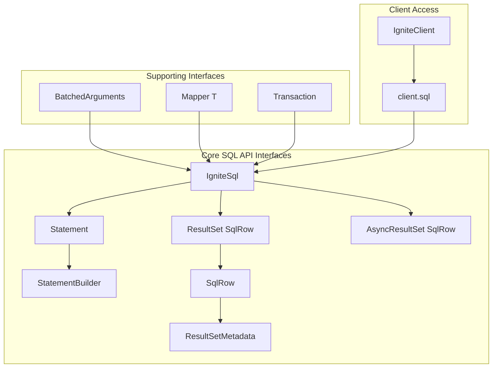

# Chapter 3.2: SQL API for Analytics and Reporting

## Learning Objectives

By completing this chapter, you will:

- Master the IgniteSql interface for complex relational queries
- Implement advanced ResultSet processing for hierarchical and aggregate data
- Integrate SQL operations with transactions for ACID compliance
- Apply performance optimization techniques for analytical workloads

## Working with the Reference Application

The **`05-sql-api-app`** demonstrates all SQL API patterns covered in this chapter with comprehensive music analytics examples. Run it alongside your learning to see complex queries, aggregations, and reporting patterns in action.

> **Critical Note**: Ignite 3 normalizes all SQL metadata (table names, column names, aliases) to uppercase. When accessing columns via `SqlRow.stringValue()` or other accessor methods, always use uppercase names regardless of how they're defined in your schema or query aliases.

**Quick Start**: After reading this chapter, explore the reference application:

```bash
cd ignite3-reference-apps/05-sql-api-app
mvn compile exec:java
```

The reference app shows how the Table API operations from [Chapter 3.1](01-table-api-operations.md) complement SQL analytics for business intelligence, joins across colocated tables, and performance-optimized reporting.

## SQL API Architecture Overview

> [!NOTE]
> **SQL API Design**: The SQL API provides both synchronous and asynchronous access to SQL operations, with support for transactions, batching, and result streaming for optimal performance in distributed environments.

The SQL API is designed around a few core interfaces that provide both synchronous and asynchronous access to SQL operations:



**Key Design Principles:**

- **Type Safety**: Strongly typed interfaces with generic support
- **Resource Management**: All operations support try-with-resources patterns
- **Transaction Integration**: Seamless integration with Ignite transactions
- **Async Support**: CompletableFuture-based asynchronous operations
- **Result Streaming**: Efficient handling of large result sets

## Getting Started with the IgniteSql Interface

The `IgniteSql` interface serves as the primary entry point for SQL operations. Access it through the main client interface for both DDL and DML operations.

### Basic SQL Operations

```java
/**
 * Basic SQL API access and query execution.
 * The IgniteSql interface is obtained from the main client and provides
 * access to SQL operations in Ignite 3.
 */
public class BasicSQLAccess {
    
    public void demonstrateBasicAccess(IgniteClient client) {
        try {
            // Access SQL operations through the client interface
            IgniteSql sql = client.sql();
            
            // Simple query execution - returns ResultSet<SqlRow>
            ResultSet<SqlRow> artists = sql.execute(null, "SELECT ArtistId, Name FROM Artist LIMIT 5");
            
            // Process results using iterator pattern
            while (artists.hasNext()) {
                SqlRow row = artists.next();
                int artistId = row.intValue("ArtistId");
                String name = row.stringValue("Name");
                System.out.println("Artist: " + artistId + " - " + name);
            }
        } catch (Exception e) {
            System.err.println("SQL operation failed: " + e.getMessage());
        }
    }
}
```

### Core Execute Methods

The `IgniteSql` interface provides several execute methods for different use cases:

```java
/**
 * The primary execute methods available in the IgniteSql interface.
 * Understanding when to use each method enables effective SQL API usage.
 */
public class SQLExecuteMethods {
    
    private IgniteSql sql;
    
    public void demonstrateExecuteMethods() {
        // 1. Basic string query execution
        ResultSet<SqlRow> result1 = sql.execute(null, "SELECT * FROM Artist WHERE ArtistId = ?", 1);
        
        // 2. Statement-based execution (better for repeated queries)
        Statement stmt = sql.statementBuilder()
            .query("SELECT * FROM Artist WHERE ArtistId = ?")
            .build();
        ResultSet<SqlRow> result2 = sql.execute(null, stmt, 1);
        
        // 3. Execute with object mapping (returns typed objects instead of SqlRow)
        ResultSet<Artist> result3 = sql.execute(null, Mapper.of(Artist.class), 
            "SELECT ArtistId, Name FROM Artist WHERE ArtistId = ?", 1);
        
        // 4. Batch execution for bulk operations
        BatchedArguments batch = BatchedArguments.create()
            .add("Rock Artist")
            .add("Jazz Artist")
            .add("Pop Artist");
        long[] insertCounts = sql.executeBatch(null, 
            "INSERT INTO Artist (Name) VALUES (?)", batch);
        
        // 5. Script execution for multiple statements
        sql.executeScript(
            "CREATE ZONE IF NOT EXISTS MusicZone WITH REPLICAS=2;" +
            "CREATE TABLE IF NOT EXISTS NewTable (id INT PRIMARY KEY) WITH PRIMARY_ZONE='MusicZone';"
        );
    }
}
```

### Parameter Binding and Safety

Always use parameter binding to prevent SQL injection and ensure type safety:

```java
/**
 * Parameter binding techniques for secure SQL execution.
 * Parameter binding ensures security and performance.
 */
public class ParameterBinding {
    
    public void demonstrateParameterBinding(IgniteSql sql) {
        // ✅ CORRECT: Use parameter placeholders
        String artistName = "Led Zeppelin";
        ResultSet<SqlRow> result = sql.execute(null, 
            "SELECT * FROM Artist WHERE Name = ?", artistName);
        
        // ✅ CORRECT: Multiple parameters in order
        ResultSet<SqlRow> albums = sql.execute(null,
            "SELECT * FROM Album WHERE ArtistId = ? AND Title LIKE ?", 
            1, "%Rock%");
        
        // ✅ CORRECT: Working with different data types
        LocalDate date = LocalDate.of(2023, 1, 1);
        BigDecimal minPrice = new BigDecimal("9.99");
        ResultSet<SqlRow> tracks = sql.execute(null,
            "SELECT * FROM Track WHERE UnitPrice >= ? AND LastModified > ?",
            minPrice, date);
        
        // ❌ WRONG: String concatenation (vulnerable to SQL injection)
        // String query = "SELECT * FROM Artist WHERE Name = '" + artistName + "'";
        // sql.execute(null, query); // DON'T DO THIS!
    }
}
```

## Statement Management and Configuration

The `Statement` interface allows you to configure query execution parameters and reuse prepared queries for better performance.

### Creating and Configuring Statements

```java
/**
 * Statement configuration for optimized query execution.
 * Statement builders provide control over query behavior.
 */
public class StatementConfiguration {
    
    public void demonstrateStatementBuilder(IgniteSql sql) {
        // Basic statement creation
        Statement basicStmt = sql.statementBuilder()
            .query("SELECT * FROM Artist WHERE Name LIKE ?")
            .build();
        
        // Statement configuration
        Statement advancedStmt = sql.statementBuilder()
            .query("SELECT * FROM Track ORDER BY Milliseconds DESC")
            .defaultSchema("MUSIC_STORE")           // Set default schema
            .queryTimeout(30, TimeUnit.SECONDS)     // Set timeout
            .pageSize(1000)                         // Configure result paging
            .timeZoneId(ZoneId.of("UTC"))           // Set timezone for temporal operations
            .build();
        
        // Execute configured statement
        ResultSet<SqlRow> longTracks = sql.execute(null, advancedStmt);
        
        // Reusable statement configuration
        Statement artistLookup = sql.statementBuilder()
            .query("SELECT ArtistId, Name FROM Artist WHERE Name = ?")
            .build();
        
        // Reuse the same statement with different parameters
        ResultSet<SqlRow> beatles = sql.execute(null, artistLookup, "The Beatles");
        ResultSet<SqlRow> stones = sql.execute(null, artistLookup, "The Rolling Stones");
    }
    
    /**
     * Pagination configuration for large result sets.
     */
    public void demonstratePagination(IgniteSql sql) {
        // Configure statement for paged results
        Statement pagedQuery = sql.statementBuilder()
            .query("SELECT * FROM Track ORDER BY TrackId")
            .pageSize(100)  // Fetch 100 rows at a time
            .build();
        
        ResultSet<SqlRow> tracks = sql.execute(null, pagedQuery);
        
        int pageCount = 0;
        while (tracks.hasNext()) {
            int rowsInPage = 0;
            while (tracks.hasNext() && rowsInPage < 100) {
                SqlRow track = tracks.next();
                rowsInPage++;
                // Process track
            }
            pageCount++;
            System.out.println("Processed page " + pageCount + " with " + rowsInPage + " rows");
        }
    }
}
```

## ResultSet Processing and Data Access

Working with `ResultSet<SqlRow>` and extracting typed data forms the foundation of SQL API usage.

### Basic ResultSet Operations

```java
/**
 * ResultSet processing patterns.
 * These patterns enable effective data retrieval.
 */
public class ResultSetProcessing {
    
    public void demonstrateBasicProcessing(IgniteSql sql) {
        ResultSet<SqlRow> result = sql.execute(null, 
            "SELECT ArtistId, Name, Country FROM Artist ORDER BY Name");
        
        // Check if result contains rows (vs. just affected row count)
        if (result.hasRowSet()) {
            System.out.println("Query returned data rows");
            
            // Iterate through results
            while (result.hasNext()) {
                SqlRow row = result.next();
                
                // Type-safe data extraction by column name
                int artistId = row.intValue("ArtistId");
                String name = row.stringValue("Name");
                String country = row.stringValue("Country");  // May be null
                
                System.out.printf("Artist %d: %s from %s%n", 
                    artistId, name, country != null ? country : "Unknown");
            }
        } else {
            // DML operations return affected row count instead of data
            long affectedRows = result.affectedRows();
            System.out.println("Operation affected " + affectedRows + " rows");
        }
    }
    
    /**
     * Handling different data types from SQL results.
     */
    public void demonstrateDataTypes(IgniteSql sql) {
        ResultSet<SqlRow> result = sql.execute(null,
            "SELECT TrackId, Name, Milliseconds, UnitPrice, LastModified " +
            "FROM Track WHERE TrackId = ?", 1);
        
        if (result.hasNext()) {
            SqlRow row = result.next();
            
            // Numeric types
            int trackId = row.intValue("TrackId");
            long duration = row.longValue("Milliseconds");
            BigDecimal price = row.decimalValue("UnitPrice");
            
            // String types
            String trackName = row.stringValue("Name");
            
            // Temporal types
            LocalDate modifiedDate = row.dateValue("LastModified");
            
            // Handle nullable values
            Integer genreId = row.intValue("GenreId");  // Returns null if column is NULL
            
            System.out.printf("Track: %s (%d ms) - $%s%n", 
                trackName, duration, price);
        }
    }
    
    /**
     * Metadata access for dynamic result processing.
     */
    public void demonstrateMetadata(IgniteSql sql) {
        ResultSet<SqlRow> result = sql.execute(null, "SELECT * FROM Artist LIMIT 1");
        
        // Access result metadata
        ResultSetMetadata metadata = result.metadata();
        
        System.out.println("Columns in Artist table:");
        for (ColumnMetadata column : metadata.columns()) {
            System.out.printf("  %s: %s (%s)%s%n",
                column.name(),
                column.type(),
                column.valueClass().getSimpleName(),
                column.nullable() ? " [NULL]" : " [NOT NULL]");
        }
        
        // Dynamic row processing using metadata
        if (result.hasNext()) {
            SqlRow row = result.next();
            for (ColumnMetadata column : metadata.columns()) {
                Object value = row.value(column.name());
                System.out.printf("%s: %s%n", column.name(), value);
            }
        }
    }
}
```

## Advanced Query Patterns

### Complex Joins and Hierarchical Data

```java
/**
 * Advanced patterns for processing complex query results.
 */
public class AdvancedResultProcessing {
    
    /**
     * Process JOIN query results with hierarchical data.
     */
    public void processJoinResults(IgniteSql sql) {
        String joinQuery = """
            SELECT a.Name as ArtistName, al.Title as AlbumTitle, 
                   t.Name as TrackName, t.UnitPrice
            FROM Artist a
            JOIN Album al ON a.ArtistId = al.ArtistId  
            JOIN Track t ON al.AlbumId = t.AlbumId
            WHERE a.ArtistId = ?
            ORDER BY al.Title, t.TrackId
            """;
        
        ResultSet<SqlRow> result = sql.execute(null, joinQuery, 1);
        
        String currentAlbum = null;
        BigDecimal albumTotal = BigDecimal.ZERO;
        
        while (result.hasNext()) {
            SqlRow row = result.next();
            
            String artist = row.stringValue("ArtistName");
            String album = row.stringValue("AlbumTitle");
            String track = row.stringValue("TrackName");
            BigDecimal price = row.decimalValue("UnitPrice");
            
            // Detect album changes in grouped results
            if (!album.equals(currentAlbum)) {
                if (currentAlbum != null) {
                    System.out.printf("  Album Total: $%s%n", albumTotal);
                }
                System.out.printf("%s - %s:%n", artist, album);
                currentAlbum = album;
                albumTotal = BigDecimal.ZERO;
            }
            
            System.out.printf("  %s - $%s%n", track, price);
            albumTotal = albumTotal.add(price);
        }
        
        if (currentAlbum != null) {
            System.out.printf("  Album Total: $%s%n", albumTotal);
        }
    }
    
    /**
     * Process aggregate query results.
     */
    public void processAggregateResults(IgniteSql sql) {
        String aggregateQuery = """
            SELECT a.Name as ArtistName,
                   COUNT(t.TrackId) as TrackCount,
                   AVG(t.Milliseconds) as AvgDuration,
                   SUM(t.UnitPrice) as TotalValue
            FROM Artist a
            JOIN Album al ON a.ArtistId = al.ArtistId
            JOIN Track t ON al.AlbumId = t.AlbumId  
            GROUP BY a.ArtistId, a.Name
            HAVING COUNT(t.TrackId) > 1
            ORDER BY TotalValue DESC
            """;
        
        ResultSet<SqlRow> result = sql.execute(null, aggregateQuery);
        
        System.out.println("Top Artists by Total Track Value:");
        while (result.hasNext()) {
            SqlRow row = result.next();
            
            String artist = row.stringValue("ArtistName");
            long trackCount = row.longValue("TrackCount");
            long avgDuration = row.longValue("AvgDuration");
            BigDecimal totalValue = row.decimalValue("TotalValue");
            
            System.out.printf("%s: %d tracks, avg %d ms, total value $%s%n",
                artist, trackCount, avgDuration, totalValue);
        }
    }
}
```

## Transaction Integration

The SQL API integrates with Ignite's transaction system, allowing you to combine SQL operations with Table API operations in ACID-compliant transactions.

### Basic Transaction Usage

```java
/**
 * Transaction integration with SQL operations.
 * Transactions ensure ACID compliance across distributed operations.
 */
public class SQLTransactions {
    
    public void demonstrateBasicTransaction(IgniteClient client) {
        IgniteSql sql = client.sql();
        
        // Execute SQL operations within a transaction
        Transaction tx = client.transactions().begin();
        try {
            // Insert new artist
            sql.execute(tx, "INSERT INTO Artist (Name, Country) VALUES (?, ?)", 
                "New Artist", "USA");
            
            // Get the artist ID (in real scenario, you'd use RETURNING clause or sequence)
            ResultSet<SqlRow> artistResult = sql.execute(tx,
                "SELECT ArtistId FROM Artist WHERE Name = ?", "New Artist");
            
            int artistId = artistResult.hasNext() ? 
                artistResult.next().intValue("ArtistId") : 0;
            
            // Insert album for the artist
            sql.execute(tx, "INSERT INTO Album (ArtistId, Title) VALUES (?, ?)",
                artistId, "Debut Album");
            
            // Commit the transaction
            tx.commit();
            System.out.println("Artist and album created successfully");
            
        } catch (Exception e) {
            System.err.println("Transaction failed: " + e.getMessage());
            // Transaction automatically rolled back when tx is closed
        }
    }
    
    /**
     * Mixing Table API and SQL operations in the same transaction.
     */
    public void demonstrateMixedOperations(IgniteClient client) {
        IgniteSql sql = client.sql();
        RecordView<Artist> artists = client.tables().table("Artist").recordView(Artist.class);
        
        Transaction tx = client.transactions().begin()
        try {
            // Use Table API for object operations
            Artist newArtist = new Artist(999, "API Artist");
            artists.upsert(tx, newArtist);
            
            // Use SQL API for complex operations in the same transaction
            sql.execute(tx, 
                "UPDATE Artist SET Country = ? WHERE ArtistId = ?", 
                "Canada", 999);
            
            // Query to verify both operations
            ResultSet<SqlRow> result = sql.execute(tx,
                "SELECT ArtistId, Name, Country FROM Artist WHERE ArtistId = ?", 999);
            
            if (result.hasNext()) {
                SqlRow row = result.next();
                System.out.printf("Created artist: %s from %s%n", 
                    row.stringValue("Name"), row.stringValue("Country"));
            }
            
            tx.commit();
            
        } catch (Exception e) {
            System.err.println("Mixed operation transaction failed: " + e.getMessage());
        }
    }
}
```

## Analytics and Reporting Patterns

### Business Intelligence Queries

```java
/**
 * Advanced analytics patterns for business intelligence.
 */
public class MusicStoreAnalytics {
    
    public void generateSalesReport(IgniteSql sql) {
        String salesQuery = """
            SELECT 
                g.Name as Genre,
                COUNT(il.InvoiceLineId) as TotalSales,
                SUM(il.Quantity) as TotalQuantity,
                SUM(il.UnitPrice * il.Quantity) as TotalRevenue,
                AVG(il.UnitPrice) as AvgPrice
            FROM Genre g
            JOIN Track t ON g.GenreId = t.GenreId
            JOIN InvoiceLine il ON t.TrackId = il.TrackId
            JOIN Invoice i ON il.InvoiceId = i.InvoiceId
            WHERE i.InvoiceDate >= ?
            GROUP BY g.GenreId, g.Name
            HAVING SUM(il.UnitPrice * il.Quantity) > 50
            ORDER BY TotalRevenue DESC
            """;
        
        LocalDate startDate = LocalDate.now().minusMonths(6);
        ResultSet<SqlRow> result = sql.execute(null, salesQuery, startDate);
        
        System.out.println("Genre Sales Report (Last 6 Months):");
        System.out.println("Genre | Sales | Quantity | Revenue | Avg Price");
        System.out.println("------|-------|----------|---------|----------");
        
        BigDecimal totalRevenue = BigDecimal.ZERO;
        while (result.hasNext()) {
            SqlRow row = result.next();
            
            String genre = row.stringValue("Genre");
            long sales = row.longValue("TotalSales");
            long quantity = row.longValue("TotalQuantity");
            BigDecimal revenue = row.decimalValue("TotalRevenue");
            BigDecimal avgPrice = row.decimalValue("AvgPrice");
            
            System.out.printf("%-12s | %5d | %8d | $%7.2f | $%6.2f%n",
                genre, sales, quantity, revenue, avgPrice);
            
            totalRevenue = totalRevenue.add(revenue);
        }
        
        System.out.println("------|-------|----------|---------|----------");
        System.out.printf("TOTAL: $%.2f%n", totalRevenue);
    }
    
    public void generateCustomerAnalytics(IgniteSql sql) {
        String customerQuery = """
            SELECT 
                c.FirstName || ' ' || c.LastName as CustomerName,
                c.Country,
                COUNT(i.InvoiceId) as OrderCount,
                SUM(i.Total) as TotalSpent,
                MAX(i.InvoiceDate) as LastPurchase,
                AVG(i.Total) as AvgOrderValue
            FROM Customer c
            JOIN Invoice i ON c.CustomerId = i.CustomerId
            GROUP BY c.CustomerId, c.FirstName, c.LastName, c.Country
            ORDER BY TotalSpent DESC
            LIMIT 10
            """;
        
        ResultSet<SqlRow> result = sql.execute(null, customerQuery);
        
        System.out.println("Top 10 Customers by Total Spending:");
        while (result.hasNext()) {
            SqlRow row = result.next();
            
            String name = row.stringValue("CustomerName");
            String country = row.stringValue("Country");
            long orders = row.longValue("OrderCount");
            BigDecimal spent = row.decimalValue("TotalSpent");
            LocalDate lastPurchase = row.dateValue("LastPurchase");
            BigDecimal avgOrder = row.decimalValue("AvgOrderValue");
            
            System.out.printf("%s (%s): %d orders, $%.2f total, avg $%.2f, last: %s%n",
                name, country, orders, spent, avgOrder, lastPurchase);
        }
    }
}
```

## Performance Optimization

### Query Optimization Techniques

```java
/**
 * Performance optimization patterns for SQL queries.
 */
public class SQLPerformanceOptimization {
    
    public void demonstrateIndexUsage(IgniteSql sql) {
        // Use EXPLAIN to understand query execution plans
        ResultSet<SqlRow> explainResult = sql.execute(null,
            "EXPLAIN SELECT * FROM Track WHERE GenreId = ? ORDER BY Name", 1);
        
        System.out.println("Query Execution Plan:");
        while (explainResult.hasNext()) {
            SqlRow row = explainResult.next();
            System.out.println(row.stringValue(0));  // First column contains plan
        }
        
        // Optimized query using proper indexes
        String optimizedQuery = """
            SELECT t.Name, t.UnitPrice, a.Name as ArtistName
            FROM Track t
            JOIN Album al ON t.AlbumId = al.AlbumId  -- Uses colocation
            JOIN Artist a ON al.ArtistId = a.ArtistId  -- Uses colocation
            WHERE t.GenreId = ?  -- Uses index on GenreId
            ORDER BY t.Name  -- Uses index on Name if available
            """;
        
        ResultSet<SqlRow> result = sql.execute(null, optimizedQuery, 1);
        // Process results...
    }
    
    public void demonstrateBatchOperations(IgniteSql sql) {
        // Prepare batch arguments
        BatchedArguments batchInsert = BatchedArguments.create();
        
        for (int i = 1; i <= 1000; i++) {
            batchInsert.add("Track " + i, i % 10 + 1, new BigDecimal("0.99"));
        }
        
        // Execute batch insert - much faster than individual inserts
        long[] results = sql.executeBatch(null,
            "INSERT INTO Track (Name, AlbumId, UnitPrice) VALUES (?, ?, ?)",
            batchInsert);
        
        System.out.println("Inserted " + Arrays.stream(results).sum() + " tracks");
    }
}
```

## Error Handling and Resource Management

```java
/**
 * Robust error handling for SQL operations.
 */
public class SQLErrorHandling {
    
    public Optional<List<Track>> findTracksSafely(IgniteSql sql, String searchTerm) {
        try {
            String query = """
                SELECT TrackId, Name, UnitPrice, Milliseconds
                FROM Track 
                WHERE Name LIKE ? 
                ORDER BY Name
                """;
            
            ResultSet<SqlRow> result = sql.execute(null, query, "%" + searchTerm + "%");
            
            List<Track> tracks = new ArrayList<>();
            while (result.hasNext()) {
                SqlRow row = result.next();
                
                Track track = new Track();
                track.setTrackId(row.intValue("TrackId"));
                track.setName(row.stringValue("Name"));
                track.setUnitPrice(row.decimalValue("UnitPrice"));
                track.setMilliseconds(row.intValue("Milliseconds"));
                
                tracks.add(track);
            }
            
            return Optional.of(tracks);
            
        } catch (Exception e) {
            System.err.println("Track search failed: " + e.getMessage());
            return Optional.empty();
        }
    }
    
    public CompletableFuture<Optional<BigDecimal>> calculateTotalRevenueAsync(IgniteSql sql) {
        return CompletableFuture.supplyAsync(() -> {
            try {
                String query = """
                    SELECT SUM(il.UnitPrice * il.Quantity) as TotalRevenue
                    FROM InvoiceLine il
                    """;
                
                ResultSet<SqlRow> result = sql.execute(null, query);
                
                if (result.hasNext()) {
                    BigDecimal total = result.next().decimalValue("TotalRevenue");
                    return Optional.ofNullable(total);
                }
                
                return Optional.empty();
                
            } catch (Exception e) {
                System.err.println("Revenue calculation failed: " + e.getMessage());
                return Optional.empty();
            }
        });
    }
}
```

The SQL API provides powerful capabilities for complex analytics, reporting, and business intelligence operations while maintaining the performance benefits of Ignite 3's distributed architecture.

## Next Steps

Understanding SQL API patterns prepares you for making optimal API choices based on your specific use cases:

- **[Chapter 3.3: Choosing the Right API](03-sql-api-selection-guide.md)** - Learn decision frameworks and patterns for selecting between Table API, SQL API, and hybrid approaches based on your application requirements
