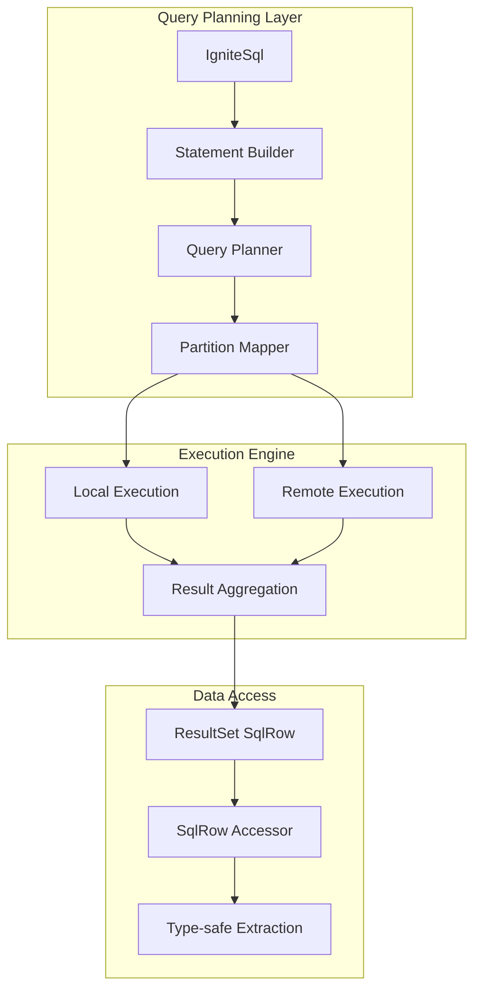

# Chapter 3.2: SQL API for Analytics and Reporting

Your marketing dashboard queries timeout when analyzing listening patterns because joins across Artist-Album-Track tables hit multiple partitions. Cross-partition joins force Ignite to pull data from multiple nodes, creating network bottlenecks that turn sub-second queries into multi-second failures. The SQL API provides optimization techniques that exploit data colocation and query planning to solve these analytical performance challenges.

Building on the colocation strategies from [Chapter 3.1](01-table-api-operations.md), this chapter shows how SQL operations leverage partition-aware execution to deliver consistent analytical performance at scale.

## Working with the Reference Application

The **`05-sql-api-app`** demonstrates SQL API optimization patterns with analytics examples that show query planning, colocation exploitation, and distributed aggregation techniques:

```bash
cd ignite3-reference-apps/05-sql-api-app
mvn compile exec:java
```

**Critical Implementation Note**: Ignite 3 normalizes all SQL metadata (table names, column names, aliases) to uppercase. Always use uppercase names in `SqlRow.stringValue()` and other accessor methods regardless of schema definition.

## SQL Query Planning and Execution Architecture

The SQL API optimizes distributed query execution through partition-aware planning and colocation exploitation. Understanding these mechanisms helps you structure queries that execute efficiently across the cluster:



**Performance-Critical Components:**

- **Query Planner**: Analyzes WHERE clauses to identify partition pruning opportunities
- **Partition Mapper**: Routes operations to colocated data when possible
- **Result Aggregation**: Combines distributed results with minimal network overhead
- **Batch Processing**: Groups operations to reduce round-trip latency
- **Transaction Integration**: Coordinates ACID operations across partitions

## Building Partition-Aware SQL Queries

The `IgniteSql` interface provides the foundation for partition-aware query execution. Proper query construction and parameter binding directly impact whether operations execute locally or require expensive cross-partition coordination.

### Partition-Aware Query Construction

```java
/**
 * Partition-aware SQL query construction prevents cross-partition joins
 * that cause performance bottlenecks in distributed analytics.
 */
public class PartitionAwareSQLQueries {
    
    public void demonstrateOptimalQueryPattern(IgniteClient client) {
        try {
            IgniteSql sql = client.sql();
            
            // ✅ OPTIMAL: Query uses colocation key (ArtistId) for partition pruning
            // All Artist-Album-Track data colocated by ArtistId routes to single partition
            Statement colocatedQuery = sql.statementBuilder()
                .query("""
                    SELECT a.Name as ArtistName, al.Title as AlbumTitle, 
                           COUNT(t.TrackId) as TrackCount
                    FROM Artist a
                    JOIN Album al ON a.ArtistId = al.ArtistId
                    JOIN Track t ON al.AlbumId = t.AlbumId  
                    WHERE a.ArtistId = ?
                    GROUP BY a.Name, al.Title
                    """)
                .build();
            
            // Single partition execution - sub-millisecond response
            ResultSet<SqlRow> result = sql.execute(null, colocatedQuery, 42);
            
            while (result.hasNext()) {
                SqlRow row = result.next();
                System.out.printf("%s - %s: %d tracks%n",
                    row.stringValue("ARTISTNAME"),
                    row.stringValue("ALBUMTITLE"), 
                    row.longValue("TRACKCOUNT"));
            }
            
        } catch (Exception e) {
            System.err.println("Query execution failed: " + e.getMessage());
        }
    }
}
```

### Statement Builder for Query Optimization

The `StatementBuilder` configures query execution parameters that directly impact distributed performance. Query timeout, result paging, and schema context affect how Ignite executes operations across partitions:

```java
/**
 * Statement configuration optimizes query execution for distributed environments.
 * Proper configuration prevents timeouts and reduces memory pressure.
 */
public class OptimizedStatementExecution {
    
    private IgniteSql sql;
    
    public void demonstrateOptimizedExecution() {
        // 1. Statement with partition-aware configuration
        Statement optimizedStmt = sql.statementBuilder()
            .query("SELECT * FROM Artist WHERE ArtistId = ?")
            .queryTimeout(5, TimeUnit.SECONDS)     // Prevent long-running cross-partition queries
            .pageSize(1000)                        // Limit memory usage for large results
            .build();
        
        ResultSet<SqlRow> result = sql.execute(null, optimizedStmt, 42);
        
        // 2. Batch operations minimize network round-trips
        BatchedArguments batch = BatchedArguments.create();
        for (int i = 1; i <= 1000; i++) {
            batch.add("Generated Artist " + i, "Country " + (i % 10));
        }
        
        // Single network operation for 1000 inserts
        long[] insertCounts = sql.executeBatch(null, 
            "INSERT INTO Artist (Name, Country) VALUES (?, ?)", batch);
        
        System.out.println("Batch inserted " + Arrays.stream(insertCounts).sum() + " records");
        
        // 3. Reusable statements for repeated queries
        Statement artistLookup = sql.statementBuilder()
            .query("SELECT ArtistId, Name FROM Artist WHERE Name = ?")
            .build();
        
        // Statement reuse eliminates repeated query parsing
        ResultSet<SqlRow> beatles = sql.execute(null, artistLookup, "The Beatles");
        ResultSet<SqlRow> stones = sql.execute(null, artistLookup, "The Rolling Stones");
    }
}
```

### Parameter Binding for Query Plan Optimization

Parameter binding enables query plan caching and prevents SQL injection, but also impacts partition pruning effectiveness. Understanding parameter binding patterns helps structure queries for optimal distributed execution:

```java
/**
 * Parameter binding patterns that enable partition pruning and query plan reuse.
 * Proper binding patterns allow Ignite to optimize distributed query execution.
 */
public class PartitionOptimizedBinding {
    
    public void demonstrateOptimalBinding(IgniteSql sql) {
        // ✅ OPTIMAL: Colocation key parameter enables partition pruning
        // Query planner can route directly to partition containing ArtistId=42
        Statement partitionPrunedQuery = sql.statementBuilder()
            .query("""
                SELECT a.Name, COUNT(t.TrackId) as TrackCount
                FROM Artist a
                JOIN Album al ON a.ArtistId = al.ArtistId
                JOIN Track t ON al.AlbumId = t.AlbumId
                WHERE a.ArtistId = ?
                GROUP BY a.Name
                """)
            .build();
        
        // Executes on single partition - consistent sub-millisecond performance
        ResultSet<SqlRow> result = sql.execute(null, partitionPrunedQuery, 42);
        
        // ✅ OPTIMAL: IN clause with colocation keys for parallel execution
        // Query planner routes each ArtistId to its partition in parallel
        ResultSet<SqlRow> multiArtist = sql.execute(null,
            "SELECT ArtistId, Name FROM Artist WHERE ArtistId IN (?, ?, ?)",
            1, 5, 10);
        
        // ⚠️ SUBOPTIMAL: Non-colocation key parameters force full table scan
        // Query must check all partitions because Genre is not colocation key
        ResultSet<SqlRow> genreQuery = sql.execute(null,
            "SELECT * FROM Track WHERE GenreId = ?", 1);
        
        // ❌ DANGEROUS: String concatenation prevents query plan caching
        // Also vulnerable to SQL injection
        // String query = "SELECT * FROM Artist WHERE Name = '" + artistName + "'";
    }
}
```

## Distributed ResultSet Processing

Large analytical queries generate massive result sets that can overwhelm client memory and network bandwidth. The SQL API provides streaming and pagination mechanisms that process distributed results efficiently without resource exhaustion.

### Memory-Efficient Result Processing

```java
/**
 * Memory-efficient processing prevents client memory exhaustion when handling
 * large distributed result sets from analytical queries.
 */
public class StreamingResultProcessor {
    
    public void processLargeResultSet(IgniteSql sql) {
        // Configure streaming with controlled memory usage
        Statement streamingQuery = sql.statementBuilder()
            .query("""
                SELECT t.TrackId, t.Name, t.Milliseconds, t.UnitPrice,
                       a.Name as ArtistName, al.Title as AlbumTitle
                FROM Track t
                JOIN Album al ON t.AlbumId = al.AlbumId
                JOIN Artist a ON al.ArtistId = a.ArtistId
                ORDER BY t.TrackId
                """)
            .pageSize(500)                          // Stream 500 rows per network fetch
            .queryTimeout(60, TimeUnit.SECONDS)     // Prevent abandoned queries
            .build();
        
        ResultSet<SqlRow> tracks = sql.execute(null, streamingQuery);
        
        // Process results in streaming fashion - constant memory usage
        long totalDuration = 0;
        BigDecimal totalRevenue = BigDecimal.ZERO;
        int processed = 0;
        
        while (tracks.hasNext()) {
            SqlRow track = tracks.next();
            
            // Extract data with proper null handling
            long duration = track.longValue("MILLISECONDS");
            BigDecimal price = track.decimalValue("UNITPRICE");
            String artist = track.stringValue("ARTISTNAME");
            
            totalDuration += duration;
            totalRevenue = totalRevenue.add(price);
            processed++;
            
            // Progress indication for long-running analytics
            if (processed % 1000 == 0) {
                System.out.printf("Processed %d tracks...%n", processed);
            }
        }
        
        System.out.printf("Analysis complete: %d tracks, %d total minutes, $%.2f revenue%n",
            processed, totalDuration / 60000, totalRevenue);
    }
    
    /**
     * Hierarchical data processing from distributed joins.
     */
    public void processHierarchicalResults(IgniteSql sql) {
        // Query that joins across colocated tables for optimal performance
        Statement hierarchicalQuery = sql.statementBuilder()
            .query("""
                SELECT a.ArtistId, a.Name as ArtistName,
                       al.AlbumId, al.Title as AlbumTitle,
                       t.TrackId, t.Name as TrackName, t.UnitPrice
                FROM Artist a
                JOIN Album al ON a.ArtistId = al.ArtistId
                JOIN Track t ON al.AlbumId = t.AlbumId
                WHERE a.ArtistId BETWEEN ? AND ?
                ORDER BY a.ArtistId, al.AlbumId, t.TrackId
                """)
            .pageSize(1000)
            .build();
        
        ResultSet<SqlRow> result = sql.execute(null, hierarchicalQuery, 1, 10);
        
        // Group results by hierarchy levels
        int currentArtistId = -1;
        int currentAlbumId = -1;
        BigDecimal albumTotal = BigDecimal.ZERO;
        BigDecimal artistTotal = BigDecimal.ZERO;
        
        while (result.hasNext()) {
            SqlRow row = result.next();
            
            int artistId = row.intValue("ARTISTID");
            int albumId = row.intValue("ALBUMID");
            BigDecimal trackPrice = row.decimalValue("UNITPRICE");
            
            // Detect artist boundary
            if (artistId != currentArtistId) {
                if (currentArtistId != -1) {
                    System.out.printf("Artist %d total: $%.2f%n", currentArtistId, artistTotal);
                }
                currentArtistId = artistId;
                artistTotal = BigDecimal.ZERO;
                System.out.printf("Processing Artist: %s%n", row.stringValue("ARTISTNAME"));
            }
            
            // Detect album boundary
            if (albumId != currentAlbumId) {
                if (currentAlbumId != -1) {
                    System.out.printf("  Album total: $%.2f%n", albumTotal);
                }
                currentAlbumId = albumId;
                albumTotal = BigDecimal.ZERO;
                System.out.printf("  Album: %s%n", row.stringValue("ALBUMTITLE"));
            }
            
            // Accumulate track value
            albumTotal = albumTotal.add(trackPrice);
            artistTotal = artistTotal.add(trackPrice);
            
            System.out.printf("    Track: %s - $%.2f%n", 
                row.stringValue("TRACKNAME"), trackPrice);
        }
        
        // Final totals
        if (currentAlbumId != -1) {
            System.out.printf("  Album total: $%.2f%n", albumTotal);
        }
        if (currentArtistId != -1) {
            System.out.printf("Artist %d total: $%.2f%n", currentArtistId, artistTotal);
        }
    }
}
```

## Type-Safe Data Extraction

Analytical queries return diverse data types that require careful extraction and null handling. Understanding SqlRow accessor patterns and metadata usage enables robust data processing that handles distributed query variations.

### Robust Data Type Handling

```java
/**
 * Robust data extraction prevents type conversion errors and null pointer
 * exceptions that occur when processing diverse analytical result sets.
 */
public class TypeSafeDataExtraction {
    
    public void demonstrateRobustExtraction(IgniteSql sql) {
        // Analytics query with potential null values and mixed data types
        ResultSet<SqlRow> result = sql.execute(null, 
            "SELECT ArtistId, Name, Country, LastUpdated FROM Artist ORDER BY Name");
        
        // Distinguish between data queries and DML operations
        if (result.hasRowSet()) {
            System.out.println("Processing analytical result set...");
            
            while (result.hasNext()) {
                SqlRow row = result.next();
                
                // Required fields - will throw if null
                int artistId = row.intValue("ARTISTID");
                String name = row.stringValue("NAME");
                
                // Optional fields - handle nulls gracefully
                String country = row.stringValue("COUNTRY");  
                LocalDateTime lastUpdated = row.value("LASTUPDATED");
                
                System.out.printf("Artist %d: %s from %s (updated: %s)%n", 
                    artistId, name, 
                    country != null ? country : "Unknown",
                    lastUpdated != null ? lastUpdated.toString() : "Never");
            }
        } else {
            // DML operations return affected row count
            long affected = result.affectedRows();
            System.out.printf("Modified %d records%n", affected);
        }
    }
    
    /**
     * Complex data type extraction with proper null handling and type safety.
     */
    public void demonstrateComplexDataTypes(IgniteSql sql) {
        // Query with diverse data types common in analytics
        ResultSet<SqlRow> result = sql.execute(null,
            "SELECT TrackId, Name, Milliseconds, UnitPrice, LastModified, " +
            "       GenreId, Composer, AlbumId " +
            "FROM Track WHERE TrackId = ?", 1);
        
        if (result.hasNext()) {
            SqlRow row = result.next();
            
            // Required numeric fields
            int trackId = row.intValue("TRACKID");
            long duration = row.longValue("MILLISECONDS");
            BigDecimal price = row.decimalValue("UNITPRICE");
            int albumId = row.intValue("ALBUMID");
            
            // Required string field
            String trackName = row.stringValue("NAME");
            
            // Optional fields with null checking
            Integer genreId = row.value("GENREID");  // May be null
            String composer = row.stringValue("COMPOSER");  // May be null
            LocalDateTime modified = row.value("LASTMODIFIED");  // May be null
            
            System.out.printf("Track %d: %s (%d ms) - $%s%n", 
                trackId, trackName, duration, price);
            System.out.printf("  Album: %d, Genre: %s, Composer: %s%n",
                albumId, 
                genreId != null ? genreId.toString() : "Unknown",
                composer != null ? composer : "Unknown");
            System.out.printf("  Last Modified: %s%n",
                modified != null ? modified.toString() : "Never");
        }
    }
    
    /**
     * Dynamic result processing using metadata enables generic analytical tools.
     */
    public void demonstrateMetadataDrivenProcessing(IgniteSql sql) {
        // Query with unknown result structure
        ResultSet<SqlRow> result = sql.execute(null, 
            "SELECT * FROM Artist WHERE ArtistId BETWEEN ? AND ?", 1, 5);
        
        // Analyze result structure dynamically
        ResultSetMetadata metadata = result.metadata();
        
        System.out.println("Result set structure:");
        List<ColumnMetadata> columns = metadata.columns();
        for (ColumnMetadata column : columns) {
            System.out.printf("  %s: %s (%s)%s%n",
                column.name(),
                column.type(),
                column.valueClass().getSimpleName(),
                column.nullable() ? " NULLABLE" : " NOT NULL");
        }
        
        System.out.println("\nData rows:");
        
        // Process rows dynamically based on metadata
        while (result.hasNext()) {
            SqlRow row = result.next();
            StringBuilder rowData = new StringBuilder();
            
            for (ColumnMetadata column : columns) {
                Object value = row.value(column.name());
                if (rowData.length() > 0) rowData.append(", ");
                rowData.append(column.name()).append("=").append(value);
            }
            
            System.out.println("  " + rowData.toString());
        }
    }
}
```

## Distributed Analytics Query Patterns

Analytical workloads require complex aggregations and joins that span multiple tables. These patterns show how to structure analytical queries for optimal distributed execution while avoiding common performance pitfalls.

### Cross-Partition Analytics Optimization

```java
/**
 * Distributed analytics patterns optimize cross-table queries by leveraging
 * data colocation and partition-aware join strategies.
 */
public class DistributedAnalyticsPatterns {
    
    /**
     * Colocated join processing exploits data colocation for single-partition execution.
     */
    public void processColocatedAnalytics(IgniteSql sql) {
        // Colocated join - all data for ArtistId=1 stored on same partition
        String colocatedQuery = """
            SELECT a.Name as ArtistName, al.Title as AlbumTitle, 
                   t.Name as TrackName, t.UnitPrice, t.Milliseconds
            FROM Artist a
            JOIN Album al ON a.ArtistId = al.ArtistId  
            JOIN Track t ON al.AlbumId = t.AlbumId
            WHERE a.ArtistId = ?
            ORDER BY al.Title, t.TrackId
            """;
        
        // Single partition execution - consistent sub-millisecond performance
        ResultSet<SqlRow> result = sql.execute(null, colocatedQuery, 1);
        
        String currentAlbum = null;
        BigDecimal albumRevenue = BigDecimal.ZERO;
        long albumDuration = 0;
        int trackCount = 0;
        
        while (result.hasNext()) {
            SqlRow row = result.next();
            
            String artist = row.stringValue("ARTISTNAME");
            String album = row.stringValue("ALBUMTITLE");
            String track = row.stringValue("TRACKNAME");
            BigDecimal price = row.decimalValue("UNITPRICE");
            long duration = row.longValue("MILLISECONDS");
            
            // Album boundary detection for aggregation
            if (!album.equals(currentAlbum)) {
                if (currentAlbum != null) {
                    System.out.printf("  Album Analytics: %d tracks, %.1f minutes, $%.2f revenue%n", 
                        trackCount, albumDuration / 60000.0, albumRevenue);
                }
                System.out.printf("%s - %s:%n", artist, album);
                currentAlbum = album;
                albumRevenue = BigDecimal.ZERO;
                albumDuration = 0;
                trackCount = 0;
            }
            
            System.out.printf("  %s - $%.2f (%.1f min)%n", 
                track, price, duration / 60000.0);
            
            albumRevenue = albumRevenue.add(price);
            albumDuration += duration;
            trackCount++;
        }
        
        if (currentAlbum != null) {
            System.out.printf("  Album Analytics: %d tracks, %.1f minutes, $%.2f revenue%n", 
                trackCount, albumDuration / 60000.0, albumRevenue);
        }
    }
    
    /**
     * Distributed aggregation patterns handle cross-partition analytics efficiently.
     */
    public void processDistributedAggregates(IgniteSql sql) {
        // Multi-partition aggregation with proper GROUP BY for distributed execution
        String distributedAggregateQuery = """
            SELECT a.Name as ArtistName,
                   COUNT(t.TrackId) as TrackCount,
                   AVG(t.Milliseconds) as AvgDuration,
                   SUM(t.UnitPrice) as TotalValue,
                   MIN(t.UnitPrice) as MinPrice,
                   MAX(t.UnitPrice) as MaxPrice
            FROM Artist a
            JOIN Album al ON a.ArtistId = al.ArtistId
            JOIN Track t ON al.AlbumId = t.AlbumId  
            GROUP BY a.ArtistId, a.Name
            HAVING COUNT(t.TrackId) >= 10
            ORDER BY TotalValue DESC
            LIMIT 20
            """;
        
        // Ignite executes local aggregations per partition, then combines results
        ResultSet<SqlRow> result = sql.execute(null, distributedAggregateQuery);
        
        System.out.println("Top Artists by Catalog Value (10+ tracks):");
        System.out.println("Artist | Tracks | Avg Duration | Total Value | Price Range");
        System.out.println("-------|--------|-------------|-------------|------------");
        
        while (result.hasNext()) {
            SqlRow row = result.next();
            
            String artist = row.stringValue("ARTISTNAME");
            long trackCount = row.longValue("TRACKCOUNT");
            double avgDuration = row.doubleValue("AVGDURATION");
            BigDecimal totalValue = row.decimalValue("TOTALVALUE");
            BigDecimal minPrice = row.decimalValue("MINPRICE");
            BigDecimal maxPrice = row.decimalValue("MAXPRICE");
            
            System.out.printf("%-20s | %6d | %8.1f min | $%9.2f | $%.2f-$%.2f%n",
                artist.length() > 20 ? artist.substring(0, 17) + "..." : artist,
                trackCount, 
                avgDuration / 60000.0, 
                totalValue,
                minPrice, maxPrice);
        }
    }
}
```

## Transactional Analytics Operations

Analytical operations often require ACID guarantees when combining read-heavy analytics with data modifications. The SQL API integrates with Ignite's distributed transaction system to provide consistent analytical results during concurrent updates.

### Consistent Analytics with Transactions

```java
/**
 * Transactional analytics ensure consistent analytical results during
 * concurrent data modifications across the distributed cluster.
 */
public class TransactionalAnalytics {
    
    public void demonstrateConsistentAnalytics(IgniteClient client) {
        IgniteSql sql = client.sql();
        
        // Analytical transaction provides snapshot isolation
        Transaction tx = client.transactions().begin();
        try {
            // Analytical query sees consistent data snapshot
            ResultSet<SqlRow> beforeAnalytics = sql.execute(tx,
                "SELECT COUNT(*) as TrackCount, SUM(UnitPrice) as TotalValue " +
                "FROM Track WHERE ArtistId IN (SELECT ArtistId FROM Artist WHERE Country = ?)",
                "USA");
            
            if (beforeAnalytics.hasNext()) {
                SqlRow before = beforeAnalytics.next();
                System.out.printf("Before: %d tracks, $%.2f total value%n",
                    before.longValue("TRACKCOUNT"), before.decimalValue("TOTALVALUE"));
            }
            
            // Modify data within transaction
            sql.execute(tx, "UPDATE Track SET UnitPrice = UnitPrice * 1.10 WHERE GenreId = ?", 1);
            
            // Analytical query sees modified data in same transaction
            ResultSet<SqlRow> afterAnalytics = sql.execute(tx,
                "SELECT COUNT(*) as TrackCount, SUM(UnitPrice) as TotalValue " +
                "FROM Track WHERE ArtistId IN (SELECT ArtistId FROM Artist WHERE Country = ?)",
                "USA");
            
            if (afterAnalytics.hasNext()) {
                SqlRow after = afterAnalytics.next();
                System.out.printf("After: %d tracks, $%.2f total value%n",
                    after.longValue("TRACKCOUNT"), after.decimalValue("TOTALVALUE"));
            }
            
            tx.commit();
            System.out.println("Analytical update completed successfully");
            
        } catch (Exception e) {
            System.err.println("Transactional analytics failed: " + e.getMessage());
            // Automatic rollback ensures data consistency
        }
    }
    
    /**
     * Hybrid operations combine Table API precision with SQL API analytics
     * in coordinated transactions across multiple partitions.
     */
    public void demonstrateHybridAnalytics(IgniteClient client) {
        IgniteSql sql = client.sql();
        RecordView<Track> tracks = client.tables().table("Track").recordView(Track.class);
        
        Transaction tx = client.transactions().begin();
        try {
            // Table API for precise record operations
            Track newTrack = new Track(9999, "Analytics Demo Track", 1, 1, 
                "Demo", "Various", 180000, 1024000, new BigDecimal("1.99"));
            tracks.upsert(tx, newTrack);
            
            // SQL API for analytical verification within same transaction
            ResultSet<SqlRow> albumAnalytics = sql.execute(tx, 
                "SELECT COUNT(*) as TrackCount, AVG(UnitPrice) as AvgPrice, " +
                "       SUM(Milliseconds) as TotalDuration " +
                "FROM Track WHERE AlbumId = ?", 1);
            
            if (albumAnalytics.hasNext()) {
                SqlRow analytics = albumAnalytics.next();
                System.out.printf("Album analytics after insert:%n");
                System.out.printf("  Tracks: %d%n", analytics.longValue("TRACKCOUNT"));
                System.out.printf("  Avg Price: $%.2f%n", analytics.decimalValue("AVGPRICE"));
                System.out.printf("  Total Duration: %.1f minutes%n", 
                    analytics.longValue("TOTALDURATION") / 60000.0);
            }
            
            // SQL API for bulk analytical operations
            long updated = sql.execute(tx,
                "UPDATE Track SET UnitPrice = ? WHERE AlbumId = ? AND UnitPrice < ?",
                new BigDecimal("1.29"), 1, new BigDecimal("1.00")
            ).affectedRows();
            
            System.out.printf("Updated %d tracks with promotional pricing%n", updated);
            
            tx.commit();
            
        } catch (Exception e) {
            System.err.println("Hybrid analytics transaction failed: " + e.getMessage());
        }
    }
}
```

## Production Analytics Patterns

Production analytical workloads require optimized query patterns that balance result accuracy with cluster resource usage. These patterns show how to structure business intelligence queries for consistent performance at scale.

### Revenue Analytics and Performance Metrics

```java
/**
 * Production analytics patterns optimize complex business intelligence queries
 * for consistent performance across distributed datasets.
 */
public class ProductionAnalyticsPatterns {
    
    public void generateOptimizedRevenueReport(IgniteSql sql) {
        // Optimized multi-table join with time-based partitioning consideration
        Statement revenueQuery = sql.statementBuilder()
            .query("""
                SELECT 
                    g.Name as Genre,
                    COUNT(il.InvoiceLineId) as SalesCount,
                    SUM(il.Quantity) as TotalQuantity,
                    SUM(il.UnitPrice * il.Quantity) as TotalRevenue,
                    AVG(il.UnitPrice) as AvgUnitPrice,
                    COUNT(DISTINCT i.CustomerId) as UniqueCustomers
                FROM Genre g
                JOIN Track t ON g.GenreId = t.GenreId
                JOIN InvoiceLine il ON t.TrackId = il.TrackId
                JOIN Invoice i ON il.InvoiceId = i.InvoiceId
                WHERE i.InvoiceDate >= ? AND i.InvoiceDate < ?
                GROUP BY g.GenreId, g.Name
                HAVING SUM(il.UnitPrice * il.Quantity) >= ?
                ORDER BY TotalRevenue DESC
                """)
            .pageSize(100)  // Control memory usage for large result sets
            .queryTimeout(30, TimeUnit.SECONDS)  // Prevent runaway analytics
            .build();
        
        LocalDate startDate = LocalDate.now().minusMonths(6);
        LocalDate endDate = LocalDate.now();
        BigDecimal minRevenue = new BigDecimal("50.00");
        
        ResultSet<SqlRow> result = sql.execute(null, revenueQuery, 
            startDate, endDate, minRevenue);
        
        System.out.printf("Revenue Analytics Report (%s to %s):%n", startDate, endDate);
        System.out.println("Genre           | Sales | Qty  | Revenue  | Avg Price | Customers");
        System.out.println("----------------|-------|------|----------|-----------|----------");
        
        BigDecimal totalRevenue = BigDecimal.ZERO;
        int totalCustomers = 0;
        
        while (result.hasNext()) {
            SqlRow row = result.next();
            
            String genre = row.stringValue("GENRE");
            long sales = row.longValue("SALESCOUNT");
            long quantity = row.longValue("TOTALQUANTITY");
            BigDecimal revenue = row.decimalValue("TOTALREVENUE");
            BigDecimal avgPrice = row.decimalValue("AVGUNITPRICE");
            long customers = row.longValue("UNIQUECUSTOMERS");
            
            System.out.printf("%-15s | %5d | %4d | $%8.2f | $%7.2f | %8d%n",
                genre.length() > 15 ? genre.substring(0, 12) + "..." : genre,
                sales, quantity, revenue, avgPrice, customers);
            
            totalRevenue = totalRevenue.add(revenue);
            totalCustomers += customers;
        }
        
        System.out.println("----------------|-------|------|----------|-----------|----------");
        System.out.printf("TOTALS          |       |      | $%8.2f |           | %8d%n", 
            totalRevenue, totalCustomers);
    }
    
    public void generateCustomerLifetimeValueAnalytics(IgniteSql sql) {
        // Customer analytics with recency, frequency, monetary value calculation
        Statement customerLTVQuery = sql.statementBuilder()
            .query("""
                SELECT 
                    c.CustomerId,
                    c.FirstName || ' ' || c.LastName as CustomerName,
                    c.Country,
                    c.State,
                    COUNT(i.InvoiceId) as OrderCount,
                    SUM(i.Total) as TotalSpent,
                    AVG(i.Total) as AvgOrderValue,
                    MAX(i.InvoiceDate) as LastPurchase,
                    MIN(i.InvoiceDate) as FirstPurchase,
                    DATEDIFF('DAY', MIN(i.InvoiceDate), MAX(i.InvoiceDate)) as CustomerLifespan
                FROM Customer c
                JOIN Invoice i ON c.CustomerId = i.CustomerId
                WHERE i.InvoiceDate >= ?
                GROUP BY c.CustomerId, c.FirstName, c.LastName, c.Country, c.State
                HAVING COUNT(i.InvoiceId) >= ?
                ORDER BY TotalSpent DESC, OrderCount DESC
                LIMIT ?
                """)
            .pageSize(50)
            .build();
        
        LocalDate analysisStart = LocalDate.now().minusYears(2);
        int minOrders = 3;
        int topCustomers = 25;
        
        ResultSet<SqlRow> result = sql.execute(null, customerLTVQuery, 
            analysisStart, minOrders, topCustomers);
        
        System.out.printf("Customer Lifetime Value Analysis (Since %s):%n", analysisStart);
        System.out.println("Customer                    | Country      | Orders | Total    | Avg Order | Lifespan | Last Purchase");
        System.out.println("----------------------------|--------------|--------|----------|-----------|----------|---------------");
        
        BigDecimal totalCLV = BigDecimal.ZERO;
        int customerCount = 0;
        
        while (result.hasNext()) {
            SqlRow row = result.next();
            
            String name = row.stringValue("CUSTOMERNAME");
            String country = row.stringValue("COUNTRY");
            long orders = row.longValue("ORDERCOUNT");
            BigDecimal spent = row.decimalValue("TOTALSPENT");
            BigDecimal avgOrder = row.decimalValue("AVGORDERVALUE");
            LocalDate lastPurchase = row.dateValue("LASTPURCHASE");
            Integer lifespan = row.value("CUSTOMERLIFESPAN");
            
            System.out.printf("%-27s | %-12s | %6d | $%8.2f | $%7.2f | %8s | %s%n",
                name.length() > 27 ? name.substring(0, 24) + "..." : name,
                country.length() > 12 ? country.substring(0, 9) + "..." : country,
                orders, spent, avgOrder,
                lifespan != null ? lifespan + "d" : "N/A",
                lastPurchase);
            
            totalCLV = totalCLV.add(spent);
            customerCount++;
        }
        
        System.out.println("----------------------------|--------------|--------|----------|-----------|----------|---------------");
        System.out.printf("SUMMARY: %d customers | Average CLV: $%.2f | Total CLV: $%.2f%n", 
            customerCount, 
            customerCount > 0 ? totalCLV.divide(BigDecimal.valueOf(customerCount), 2, RoundingMode.HALF_UP) : BigDecimal.ZERO,
            totalCLV);
    }
}
```

## Query Performance Optimization

Distributed analytical queries can exhibit unpredictable performance characteristics due to partition distribution, query plan selection, and resource contention. These optimization techniques address common performance bottlenecks in production analytical workloads.

### Execution Plan Analysis and Optimization

```java
/**
 * Query performance optimization addresses distributed execution bottlenecks
 * and resource contention in production analytical workloads.
 */
public class AnalyticsPerformanceOptimization {
    
    public void analyzeQueryExecutionPlan(IgniteSql sql) {
        // Analyze execution plan for complex analytical query
        Statement explainQuery = sql.statementBuilder()
            .query("EXPLAIN SELECT t.Name, t.UnitPrice, a.Name as ArtistName " +
                   "FROM Track t " +
                   "JOIN Album al ON t.AlbumId = al.AlbumId " +
                   "JOIN Artist a ON al.ArtistId = a.ArtistId " +
                   "WHERE t.GenreId = ? AND t.UnitPrice > ? " +
                   "ORDER BY t.Name")
            .build();
        
        ResultSet<SqlRow> explainResult = sql.execute(null, explainQuery, 1, new BigDecimal("0.99"));
        
        System.out.println("=== Query Execution Plan Analysis ===");
        while (explainResult.hasNext()) {
            SqlRow row = explainResult.next();
            String planStep = row.stringValue(0);
            System.out.println(planStep);
            
            // Identify performance concerns in execution plan
            if (planStep.contains("BROADCAST")) {
                System.out.println("⚠️  Warning: Broadcast join detected - may impact performance");
            }
            if (planStep.contains("FULL_SCAN")) {
                System.out.println("⚠️  Warning: Full table scan - consider adding indexes");
            }
            if (planStep.contains("SORT")) {
                System.out.println("ℹ️  Info: Sort operation - consider indexed ordering");
            }
        }
        
        // Execute optimized version using colocation-aware patterns
        Statement optimizedQuery = sql.statementBuilder()
            .query("""
                SELECT t.Name, t.UnitPrice, a.Name as ArtistName
                FROM Track t
                JOIN Album al ON t.AlbumId = al.AlbumId  -- Colocated join
                JOIN Artist a ON al.ArtistId = a.ArtistId  -- Colocated join
                WHERE al.ArtistId = ?  -- Partition pruning by colocation key
                  AND t.GenreId = ?    -- Secondary filter
                  AND t.UnitPrice > ?
                ORDER BY t.Name
                """)
            .pageSize(500)
            .build();
        
        long startTime = System.currentTimeMillis();
        ResultSet<SqlRow> result = sql.execute(null, optimizedQuery, 42, 1, new BigDecimal("0.99"));
        
        int resultCount = 0;
        while (result.hasNext()) {
            SqlRow row = result.next();
            resultCount++;
            // Process result efficiently
        }
        
        long executionTime = System.currentTimeMillis() - startTime;
        System.out.printf("Optimized query: %d results in %d ms%n", resultCount, executionTime);
    }
    
    public void demonstrateOptimizedBatchOperations(IgniteSql sql) {
        // Batch operations minimize network round-trips and transaction overhead
        BatchedArguments batchInsert = BatchedArguments.create();
        
        // Prepare large batch with realistic data distribution
        for (int i = 1; i <= 5000; i++) {
            int artistId = (i % 50) + 1;  // Distribute across 50 artists
            int albumId = artistId * 10 + (i % 10);  // Realistic album distribution
            batchInsert.add(
                "Generated Track " + i,
                albumId,
                artistId,  // Ensure colocation
                "Generated Composer " + (i % 100),
                180000 + (i % 240000),  // 3-7 minute tracks
                1024000 + (i % 5000000),  // 1-6MB files
                new BigDecimal("0.99").add(new BigDecimal(i % 200).multiply(new BigDecimal("0.01")))
            );
        }
        
        // Batch insert with optimal statement configuration
        Statement batchStatement = sql.statementBuilder()
            .query("INSERT INTO Track (Name, AlbumId, ArtistId, Composer, Milliseconds, Bytes, UnitPrice) " +
                   "VALUES (?, ?, ?, ?, ?, ?, ?)")
            .queryTimeout(60, TimeUnit.SECONDS)  // Allow time for large batch
            .build();
        
        long startTime = System.currentTimeMillis();
        long[] results = sql.executeBatch(null, batchStatement, batchInsert);
        long batchTime = System.currentTimeMillis() - startTime;
        
        long totalInserted = Arrays.stream(results).sum();
        double throughput = (totalInserted / (batchTime / 1000.0));
        
        System.out.printf("Batch Performance Analysis:%n");
        System.out.printf("  Records inserted: %d%n", totalInserted);
        System.out.printf("  Execution time: %d ms%n", batchTime);
        System.out.printf("  Throughput: %.1f records/second%n", throughput);
        System.out.printf("  Avg time per record: %.2f ms%n", batchTime / (double) totalInserted);
        
        // Verify batch insertion with analytics query
        ResultSet<SqlRow> verification = sql.execute(null,
            "SELECT COUNT(*) as NewTrackCount FROM Track WHERE Name LIKE 'Generated Track%'");
        
        if (verification.hasNext()) {
            long verifiedCount = verification.next().longValue("NEWTRACKCOUNT");
            System.out.printf("Verification: %d tracks confirmed in database%n", verifiedCount);
        }
    }
}
```

## Production Error Handling and Resource Management

Distributed analytical queries can fail due to network partitions, node failures, query timeouts, and resource exhaustion. Production-grade error handling addresses these failure modes with appropriate recovery strategies.

```java
/**
 * Production-grade error handling for distributed analytical operations.
 */
public class AnalyticsErrorHandling {
    
    public Optional<AnalyticsResult> executeRobustAnalytics(IgniteSql sql, String searchTerm) {
        Statement analyticsQuery = sql.statementBuilder()
            .query("""
                SELECT t.TrackId, t.Name, t.UnitPrice, t.Milliseconds,
                       a.Name as ArtistName, al.Title as AlbumTitle,
                       g.Name as GenreName
                FROM Track t
                JOIN Album al ON t.AlbumId = al.AlbumId
                JOIN Artist a ON al.ArtistId = a.ArtistId
                LEFT JOIN Genre g ON t.GenreId = g.GenreId
                WHERE t.Name LIKE ? 
                ORDER BY t.Name
                """)
            .queryTimeout(30, TimeUnit.SECONDS)  // Prevent runaway queries
            .pageSize(1000)  // Control memory usage
            .build();
        
        try {
            ResultSet<SqlRow> result = sql.execute(null, analyticsQuery, "%" + searchTerm + "%");
            
            List<TrackAnalytics> tracks = new ArrayList<>();
            BigDecimal totalValue = BigDecimal.ZERO;
            long totalDuration = 0;
            
            while (result.hasNext()) {
                SqlRow row = result.next();
                
                TrackAnalytics track = new TrackAnalytics(
                    row.intValue("TRACKID"),
                    row.stringValue("NAME"),
                    row.stringValue("ARTISTNAME"),
                    row.stringValue("ALBUMTITLE"),
                    row.stringValue("GENRENAME"),  // May be null
                    row.decimalValue("UNITPRICE"),
                    row.intValue("MILLISECONDS")
                );
                
                tracks.add(track);
                totalValue = totalValue.add(track.getUnitPrice());
                totalDuration += track.getMilliseconds();
            }
            
            return Optional.of(new AnalyticsResult(tracks, totalValue, totalDuration));
            
        } catch (SqlTimeoutException e) {
            System.err.printf("Analytics query timeout after 30 seconds for term '%s': %s%n", 
                searchTerm, e.getMessage());
            return Optional.empty();
        } catch (SqlException e) {
            System.err.printf("SQL execution failed for term '%s': %s%n", 
                searchTerm, e.getMessage());
            return Optional.empty();
        } catch (Exception e) {
            System.err.printf("Unexpected error during analytics for term '%s': %s%n", 
                searchTerm, e.getMessage());
            return Optional.empty();
        }
    }
    
    public CompletableFuture<Optional<RevenueAnalytics>> calculateComprehensiveRevenueAsync(
            IgniteSql sql, LocalDate startDate, LocalDate endDate) {
        
        Statement revenueAnalyticsQuery = sql.statementBuilder()
            .query("""
                SELECT 
                    SUM(il.UnitPrice * il.Quantity) as TotalRevenue,
                    COUNT(DISTINCT i.InvoiceId) as TotalInvoices,
                    COUNT(DISTINCT i.CustomerId) as UniqueCustomers,
                    AVG(i.Total) as AvgInvoiceValue,
                    COUNT(il.InvoiceLineId) as TotalLineItems
                FROM InvoiceLine il
                JOIN Invoice i ON il.InvoiceId = i.InvoiceId
                WHERE i.InvoiceDate >= ? AND i.InvoiceDate <= ?
                """)
            .queryTimeout(45, TimeUnit.SECONDS)
            .build();
        
        long analysisStart = System.currentTimeMillis();
        return sql.executeAsync(null, revenueAnalyticsQuery, startDate, endDate)
            .thenApply(result -> {
                if (result.hasNext()) {
                    SqlRow row = result.next();
                    long analysisTime = System.currentTimeMillis() - analysisStart;
                    
                    RevenueAnalytics analytics = new RevenueAnalytics(
                        row.decimalValue("TOTALREVENUE"), 
                        row.longValue("TOTALINVOICES"),
                        row.longValue("UNIQUECUSTOMERS"), 
                        row.decimalValue("AVGINVOICEVALUE"), 
                        row.longValue("TOTALLINEITEMS"), 
                        analysisTime,
                        startDate, endDate
                    );
                    
                    return Optional.of(analytics);
                }
                return Optional.empty();
            })
            .exceptionally(throwable -> {
                System.err.printf("Revenue analytics async error for period %s to %s: %s%n", 
                    startDate, endDate, throwable.getMessage());
                return Optional.empty();
            });
    }
}
```

The SQL API enables production-scale analytical workloads through partition-aware query planning, distributed aggregation, and optimized result processing. These patterns address the performance and reliability challenges that emerge when running complex analytics across distributed datasets.

## Next Steps

With both Table API and SQL API patterns established, the next chapter addresses API selection strategy:

- **[Chapter 3.3: Choosing the Right API](03-sql-api-selection-guide.md)** - Decision frameworks for selecting optimal data access patterns based on workload characteristics, performance requirements, and operational constraints
