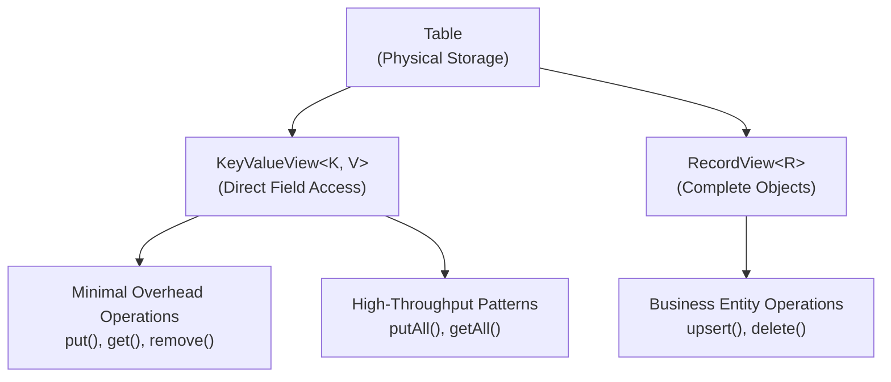

<!--
Licensed under Creative Commons Attribution-ShareAlike 4.0 International (CC BY-SA 4.0)
SPDX-License-Identifier: CC-BY-SA-4.0
For full license text, see LICENSE-CC-BY-SA-4.0
-->

# Chapter 3.3: Key-Value Operations for Maximum Performance

Your mobile app needs to handle 50,000 session lookups per second during peak hours, but object deserialization overhead from RecordView operations is creating 5-millisecond response times that compound into user experience problems. When you need specific field access without complex object graphs, full entity operations waste computational resources and memory bandwidth.

Session management, user preferences, feature flags, and caching scenarios require different performance characteristics than business entity operations. Key-Value operations eliminate serialization overhead by working directly with primitive types, achieving microsecond response times that scale linearly with load.

## Working with the Reference Application

The **`04-table-api-app`** demonstrates Key-Value patterns alongside Table API patterns using the music store dataset:

```bash
cd ignite3-reference-apps/04-table-api-app
mvn compile exec:java
```

## Understanding Key-Value Performance Characteristics

Key-Value operations optimize for scenarios where you need specific field access without object complexity. Compare the performance characteristics:

**RecordView: Complete Object Operations**

- Full object serialization/deserialization
- Complete entity context available
- Type safety with business logic integration
- Higher memory allocation per operation
- Optimal for: Business workflows, complex object manipulation

**KeyValueView: Direct Field Access**

- Minimal serialization overhead
- Single field or primitive type operations
- Direct memory access patterns
- Microsecond response times
- Optimal for: Caching, session management, feature flags

The difference becomes critical under load. A session lookup requiring only user ID validation doesn't need the overhead of deserializing complete user profiles.

## Key-Value Architecture in Ignite 3

The Key-Value API provides direct access to distributed storage without object mapping overhead:



KeyValueView operations bypass object mapping entirely, working directly with table storage for maximum performance when complex object context isn't required.

## Basic Key-Value Operations

Key-Value operations work with any two types that represent your key and value structure. The most common patterns involve ID-based lookups for specific fields:

```java
public class ArtistCache {
    private final KeyValueView<Integer, String> artistNames;
    private final KeyValueView<Integer, Integer> artistAlbumCounts;
    
    public ArtistCache(IgniteClient client) {
        Table artistTable = client.tables().table("Artist");
        
        // Key-Value view for ID -> Name mapping
        this.artistNames = artistTable.keyValueView(Integer.class, String.class);
        
        // Different Key-Value view for ID -> Count mapping
        this.artistAlbumCounts = artistTable.keyValueView(Integer.class, Integer.class);
    }
    
    // Basic CRUD operations with minimal overhead
    public void cacheArtistName(Integer artistId, String name) {
        artistNames.put(null, artistId, name);
    }
    
    public String getArtistName(Integer artistId) {
        return artistNames.get(null, artistId);  // Direct field access, no object creation
    }
    
    public void removeArtistFromCache(Integer artistId) {
        artistNames.remove(null, artistId);
    }
    
    // Return value indicates if remove operation found the key
    public boolean removeArtistIfExists(Integer artistId) {
        return artistNames.remove(null, artistId, artistNames.get(null, artistId));
    }
    
    // Conditional operations for atomic updates
    public boolean updateArtistNameIfExists(Integer artistId, String newName) {
        return artistNames.replace(null, artistId, newName);
    }
    
    public String setArtistNameIfAbsent(Integer artistId, String name) {
        return artistNames.putIfAbsent(null, artistId, name);
    }
}
```

## High-Performance Bulk Operations

Bulk Key-Value operations provide maximum throughput for cache loading, batch updates, and mass data operations:

```java
public class HighThroughputCache {
    private final KeyValueView<Integer, String> artistNames;
    private final KeyValueView<String, Set<Integer>> genreArtists;
    
    public HighThroughputCache(IgniteClient client) {
        Table artistTable = client.tables().table("Artist");
        this.artistNames = artistTable.keyValueView(Integer.class, String.class);
        
        // Complex value types work with Key-Value operations
        this.genreArtists = artistTable.keyValueView(String.class, Set.class);
    }
    
    // Bulk cache loading for application startup
    public void preloadArtistCache(Map<Integer, String> artistData) {
        // Single network operation loads entire dataset
        artistNames.putAll(null, artistData);
    }
    
    // Bulk retrieval for dashboard operations
    public Map<Integer, String> getMultipleArtists(Collection<Integer> artistIds) {
        return artistNames.getAll(null, artistIds);
    }
    
    // Bulk removal for cache invalidation
    public void invalidateArtists(Collection<Integer> artistIds) {
        artistNames.removeAll(null, artistIds);
    }
    
    // Streaming bulk operations for very large datasets
    public void streamArtistUpdates(Stream<Map.Entry<Integer, String>> artistUpdates) {
        // Process in batches to avoid memory issues
        artistUpdates
            .collect(Collectors.groupingBy(
                entry -> entry.getKey() % 1000,  // Batch by modulo
                Collectors.toMap(
                    Map.Entry::getKey,
                    Map.Entry::getValue
                )))
            .values()
            .parallelStream()  // Parallel batch processing
            .forEach(batch -> artistNames.putAll(null, batch));
    }
}
```

## Session Management Patterns

Session management represents the ideal Key-Value use case: high-frequency access to simple data structures with sub-millisecond performance requirements:

```java
public class UserSessionManager {
    private final KeyValueView<String, String> activeSessions;    // sessionId -> userId
    private final KeyValueView<String, Long> sessionTimestamps;   // sessionId -> lastAccess
    private final KeyValueView<String, String> userPreferences;  // userId -> preferences JSON
    
    public UserSessionManager(IgniteClient client) {
        // Use a dedicated session table for isolation
        Table sessionTable = client.tables().table("UserSession");
        
        this.activeSessions = sessionTable.keyValueView(String.class, String.class);
        this.sessionTimestamps = sessionTable.keyValueView(String.class, Long.class);
        this.userPreferences = sessionTable.keyValueView(String.class, String.class);
    }
    
    // Session creation with atomic multi-field updates
    public void createSession(String sessionId, String userId) {
        long timestamp = System.currentTimeMillis();
        
        // These operations could be wrapped in a transaction for atomicity
        activeSessions.put(null, sessionId, userId);
        sessionTimestamps.put(null, sessionId, timestamp);
    }
    
    // High-frequency session validation
    public boolean isSessionValid(String sessionId, long timeoutMs) {
        String userId = activeSessions.get(null, sessionId);
        if (userId == null) {
            return false;
        }
        
        Long lastAccess = sessionTimestamps.get(null, sessionId);
        if (lastAccess == null) {
            return false;
        }
        
        long currentTime = System.currentTimeMillis();
        return (currentTime - lastAccess) < timeoutMs;
    }
    
    // Session extension for active users
    public boolean extendSession(String sessionId) {
        // Only extend if session exists
        if (activeSessions.get(null, sessionId) != null) {
            sessionTimestamps.put(null, sessionId, System.currentTimeMillis());
            return true;
        }
        return false;
    }
    
    // Bulk session cleanup for maintenance
    public void cleanupExpiredSessions(long timeoutMs) {
        long cutoffTime = System.currentTimeMillis() - timeoutMs;
        
        // Get all sessions (in production, you'd want pagination)
        Map<String, Long> allTimestamps = sessionTimestamps.getAll(null, 
            getAllSessionIds());  // Implementation depends on your key enumeration strategy
        
        Set<String> expiredSessions = allTimestamps.entrySet().stream()
            .filter(entry -> entry.getValue() < cutoffTime)
            .map(Map.Entry::getKey)
            .collect(Collectors.toSet());
        
        // Bulk removal of expired sessions
        if (!expiredSessions.isEmpty()) {
            activeSessions.removeAll(null, expiredSessions);
            sessionTimestamps.removeAll(null, expiredSessions);
        }
    }
    
    private Collection<String> getAllSessionIds() {
        // In practice, you'd implement this based on your application's
        // session enumeration strategy (separate index, periodic scan, etc.)
        return Collections.emptyList();
    }
}
```

## Feature Flag and Configuration Management

Feature flags require instant access with minimal overhead since they're checked on every request. Key-Value operations provide optimal performance for this pattern:

```java
public class FeatureFlagManager {
    private final KeyValueView<String, Boolean> featureFlags;
    private final KeyValueView<String, String> configValues;
    private final KeyValueView<String, Integer> userExperimentGroups;
    
    public FeatureFlagManager(IgniteClient client) {
        Table configTable = client.tables().table("ApplicationConfig");
        
        this.featureFlags = configTable.keyValueView(String.class, Boolean.class);
        this.configValues = configTable.keyValueView(String.class, String.class);
        this.userExperimentGroups = configTable.keyValueView(String.class, Integer.class);
    }
    
    // High-frequency feature checks with minimal overhead
    public boolean isFeatureEnabled(String featureName) {
        Boolean enabled = featureFlags.get(null, featureName);
        return enabled != null && enabled;
    }
    
    // User-specific feature access with experiment groups
    public boolean isFeatureEnabledForUser(String featureName, String userId) {
        if (!isFeatureEnabled(featureName)) {
            return false;
        }
        
        // Check experiment group assignment
        Integer userGroup = userExperimentGroups.get(null, userId);
        if (userGroup == null) {
            return false;  // Default to disabled for unassigned users
        }
        
        // Feature might only be enabled for certain experiment groups
        String groupConfig = configValues.get(null, featureName + "_groups");
        if (groupConfig == null) {
            return true;  // No group restrictions
        }
        
        return groupConfig.contains(userGroup.toString());
    }
    
    // Batch configuration loading for application startup
    public void loadInitialConfiguration(Map<String, Object> configData) {
        Map<String, Boolean> flags = new HashMap<>();
        Map<String, String> values = new HashMap<>();
        
        // Separate configuration by type
        configData.forEach((key, value) -> {
            if (value instanceof Boolean) {
                flags.put(key, (Boolean) value);
            } else {
                values.put(key, value.toString());
            }
        });
        
        // Bulk load both types
        if (!flags.isEmpty()) {
            featureFlags.putAll(null, flags);
        }
        if (!values.isEmpty()) {
            configValues.putAll(null, values);
        }
    }
    
    // Hot configuration updates without restart
    public void updateFeatureFlag(String featureName, boolean enabled) {
        featureFlags.put(null, featureName, enabled);
    }
    
    // A/B test group assignment
    public void assignUserToExperimentGroup(String userId, int groupId) {
        userExperimentGroups.put(null, userId, groupId);
    }
}
```

## Asynchronous Key-Value Operations

Non-blocking Key-Value operations provide maximum scalability for high-concurrency scenarios:

```java
public class AsyncCacheOperations {
    private final KeyValueView<String, String> cache;
    
    public AsyncCacheOperations(IgniteClient client) {
        this.cache = client.tables().table("Cache").keyValueView(String.class, String.class);
    }
    
    // Async single operations
    public CompletableFuture<String> getCachedValueAsync(String key) {
        return cache.getAsync(null, key);
    }
    
    public CompletableFuture<Void> setCachedValueAsync(String key, String value) {
        return cache.putAsync(null, key, value);
    }
    
    // Async bulk operations for maximum throughput
    public CompletableFuture<Map<String, String>> getMultipleCachedValuesAsync(Collection<String> keys) {
        return cache.getAllAsync(null, keys);
    }
    
    // Chain async operations for complex workflows
    public CompletableFuture<String> getOrComputeAsync(String key, Function<String, String> computeFunction) {
        return cache.getAsync(null, key)
            .thenCompose(cachedValue -> {
                if (cachedValue != null) {
                    return CompletableFuture.completedFuture(cachedValue);
                } else {
                    // Compute value asynchronously
                    return CompletableFuture.supplyAsync(() -> computeFunction.apply(key))
                        .thenCompose(computedValue -> 
                            cache.putAsync(null, key, computedValue)
                                .thenApply(v -> computedValue));
                }
            });
    }
    
    // Parallel async operations with error handling
    public CompletableFuture<Map<String, String>> loadUserDataAsync(Collection<String> userIds) {
        Map<String, CompletableFuture<String>> futures = userIds.stream()
            .collect(Collectors.toMap(
                userId -> userId,
                userId -> cache.getAsync(null, "user_" + userId)
                    .exceptionally(throwable -> {
                        // Log error and return default
                        System.err.println("Failed to load user " + userId + ": " + throwable.getMessage());
                        return "default_user_data";
                    })
            ));
        
        return CompletableFuture.allOf(futures.values().toArray(new CompletableFuture[0]))
            .thenApply(v -> futures.entrySet().stream()
                .collect(Collectors.toMap(
                    Map.Entry::getKey,
                    entry -> entry.getValue().join()
                )));
    }
}
```

## Production Patterns and Error Handling

Key-Value operations in production require defensive patterns for network failures, timeout handling, and cache consistency:

```java
public class RobustKeyValueService {
    private final KeyValueView<String, String> primaryCache;
    private final Duration operationTimeout = Duration.ofMillis(100);
    
    public RobustKeyValueService(IgniteClient client) {
        this.primaryCache = client.tables().table("Cache").keyValueView(String.class, String.class);
    }
    
    // Timeout-aware operations
    public Optional<String> getWithTimeout(String key) {
        try {
            CompletableFuture<String> operation = primaryCache.getAsync(null, key);
            String result = operation.get(operationTimeout.toMillis(), TimeUnit.MILLISECONDS);
            return Optional.ofNullable(result);
            
        } catch (TimeoutException e) {
            System.err.println("Cache get timeout for key: " + key);
            return Optional.empty();
        } catch (Exception e) {
            System.err.println("Cache get failed for key " + key + ": " + e.getMessage());
            return Optional.empty();
        }
    }
    
    // Retry logic for transient failures
    public boolean putWithRetry(String key, String value, int maxRetries) {
        for (int attempt = 0; attempt < maxRetries; attempt++) {
            try {
                primaryCache.put(null, key, value);
                return true;
                
            } catch (Exception e) {
                if (attempt == maxRetries - 1) {
                    System.err.println("Cache put failed after " + maxRetries + " attempts for key " + key + ": " + e.getMessage());
                    return false;
                } else {
                    // Exponential backoff
                    try {
                        Thread.sleep((long) Math.pow(2, attempt) * 100);
                    } catch (InterruptedException ie) {
                        Thread.currentThread().interrupt();
                        return false;
                    }
                }
            }
        }
        return false;
    }
    
    // Bulk operations with partial failure handling
    public Map<String, String> getBulkWithFallback(Collection<String> keys, Function<String, String> fallbackProvider) {
        Map<String, String> results = new HashMap<>();
        
        try {
            Map<String, String> cacheResults = primaryCache.getAll(null, keys);
            results.putAll(cacheResults);
            
        } catch (Exception e) {
            System.err.println("Bulk cache get failed, falling back to individual operations: " + e.getMessage());
            
            // Fallback to individual operations
            for (String key : keys) {
                try {
                    String value = primaryCache.get(null, key);
                    if (value != null) {
                        results.put(key, value);
                    } else if (fallbackProvider != null) {
                        results.put(key, fallbackProvider.apply(key));
                    }
                } catch (Exception individualError) {
                    if (fallbackProvider != null) {
                        results.put(key, fallbackProvider.apply(key));
                    }
                }
            }
        }
        
        return results;
    }
}
```

## Key-Value Performance Optimization

Production Key-Value operations achieve optimal performance through specific patterns that minimize overhead and maximize throughput:

### Memory-Efficient Key Management

```java
// ✓ Efficient: Reuse key objects to reduce allocation
private final String keyPrefix = "user_session_";
private final StringBuilder keyBuilder = new StringBuilder();

public String getUserSession(String userId) {
    keyBuilder.setLength(0);
    keyBuilder.append(keyPrefix).append(userId);
    return sessions.get(null, keyBuilder.toString());
}
```

### Batch Size Optimization

```java
// ✓ Efficient: Process large datasets in optimal batch sizes
private static final int OPTIMAL_BATCH_SIZE = 1000;

public void loadLargeDataset(Map<String, String> largeDataset) {
    largeDataset.entrySet().stream()
        .collect(Collectors.groupingBy(
            entry -> entry.getKey().hashCode() % (largeDataset.size() / OPTIMAL_BATCH_SIZE + 1),
            Collectors.toMap(Map.Entry::getKey, Map.Entry::getValue)
        ))
        .values()
        .parallelStream()
        .forEach(batch -> cache.putAll(null, batch));
}
```

### Async Pipeline Optimization

```java
// ✓ Efficient: Pipeline async operations to overlap network and computation
public CompletableFuture<List<String>> processUserBatch(List<String> userIds) {
    return CompletableFuture.supplyAsync(() -> userIds)
        .thenCompose(ids -> cache.getAllAsync(null, ids))
        .thenApply(results -> results.values().stream()
            .filter(Objects::nonNull)
            .collect(Collectors.toList()));
}
```

Key-Value operations eliminate object serialization overhead, providing the foundation for ultra-high-performance data access patterns. When you need direct field access without complex object relationships, Key-Value operations deliver microsecond response times that scale linearly with system load.

---

**Next**: [Data Access API Decision Guide](04-api-decision-guide.md) - Strategic framework for selecting optimal APIs based on operation characteristics and performance requirements.
