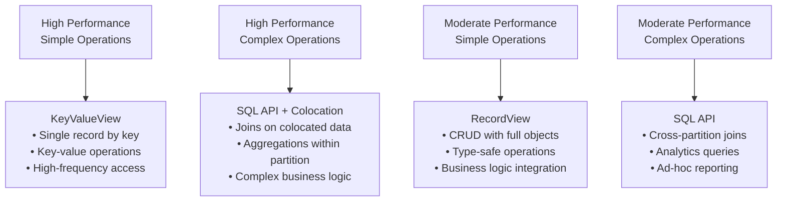
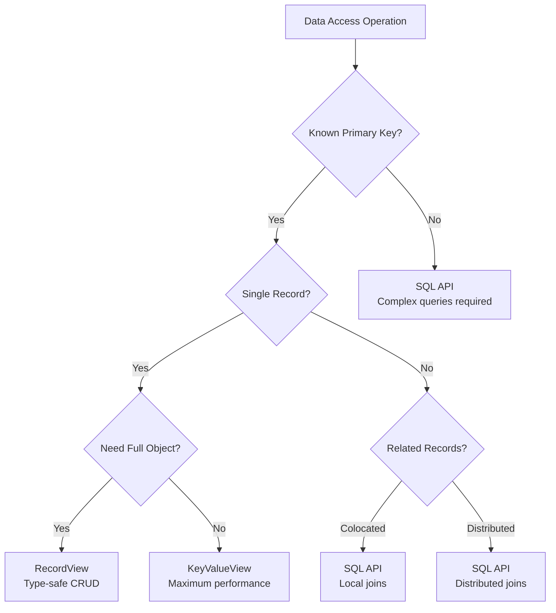

# Chapter 3.3: Choosing the Right API for Your Use Case

## Learning Objectives

By completing this chapter, you will:

- Apply decision frameworks for choosing between Table API and SQL API
- Understand performance characteristics of different data access patterns
- Implement hybrid approaches that combine multiple APIs effectively
- Design optimal data access strategies for common application scenarios

## API Selection Decision Framework

> [!IMPORTANT]
> **API Selection Impact**: Choosing the right API for each operation can dramatically affect both development productivity and runtime performance. The patterns in this chapter help you make optimal decisions for each use case.

Choosing the right API for each operation significantly impacts both development productivity and runtime performance. This chapter provides practical frameworks for making these decisions.

### The Performance-Complexity Matrix

Different operations fall into distinct categories based on their complexity and performance requirements:



### Decision Tree for API Selection

Use this decision tree to choose the optimal API for each operation:



## Performance Characteristics by API

### KeyValueView Performance Profile

**Optimal For:**

- Key-value operations (session data, user preferences)
- High-frequency simple lookups
- Single-field operations
- Scenarios where object overhead is significant

```java
public class HighPerformanceCache {
    private final KeyValueView<String, String> sessionCache;
    
    public HighPerformanceCache(IgniteClient client) {
        this.sessionCache = client.tables().table("UserSession")
            .keyValueView(String.class, String.class);
    }
    
    // Scenario: User session management
    public void storeSession(String sessionId, String userId) {
        sessionCache.put(null, sessionId, userId);  // Sub-millisecond operation
    }
    
    public String getUserSession(String sessionId) {
        return sessionCache.get(null, sessionId);   // Fastest possible lookup
    }
    
    // Scenario: Feature flags or configuration
    public boolean isFeatureEnabled(String featureKey) {
        String value = sessionCache.get(null, featureKey);
        return "true".equals(value);
    }
}
```

**Performance Benefits:**

- **Minimal serialization**: Only key and value transmitted
- **Direct partition access**: No query planning overhead
- **Optimal caching**: Perfect for cache-aside patterns

### RecordView Performance Profile

**Optimal For:**

- Business entity operations
- Type-safe development
- Operations requiring full object context
- Integration with business logic

```java
public class BusinessEntityOperations {
    private final RecordView<Customer> customers;
    private final RecordView<Invoice> invoices;
    
    public BusinessEntityOperations(IgniteClient client) {
        this.customers = client.tables().table("Customer").recordView(Customer.class);
        this.invoices = client.tables().table("Invoice").recordView(Invoice.class);
    }
    
    // Scenario: Customer management
    public Customer getCustomerProfile(Integer customerId) {
        Customer key = new Customer();
        key.setCustomerId(customerId);
        return customers.get(null, key);  // Type-safe, full object
    }
    
    public void updateCustomerProfile(Customer customer) {
        // Business logic validation
        if (customer.getEmail() == null || !customer.getEmail().contains("@")) {
            throw new IllegalArgumentException("Invalid email address");
        }
        
        customers.upsert(null, customer);  // Full object update
    }
    
    // Scenario: Order processing
    public void processOrder(Customer customer, Invoice invoice) {
        // Type-safe operations with business context
        customer.setLastOrderDate(LocalDate.now());
        customers.upsert(null, customer);
        
        invoice.setCustomerId(customer.getCustomerId());
        invoices.upsert(null, invoice);
    }
}
```

**Performance Benefits:**

- **Type safety**: Compile-time error detection
- **Object context**: Full business logic integration
- **Development speed**: IDE support and refactoring

### SQL API Performance Profile

**Optimal For:**

- Complex queries and joins
- Analytics and reporting
- Operations requiring aggregation
- Dynamic query requirements

```java
public class AnalyticsOperations {
    private final IgniteSql sql;
    
    public AnalyticsOperations(IgniteClient client) {
        this.sql = client.sql();
    }
    
    // Scenario: Sales analytics (leverages colocation)
    public List<ArtistSales> getTopSellingArtists(int limit) {
        String query = """
            SELECT a.Name, COUNT(il.TrackId) as TracksSold, 
                   SUM(il.UnitPrice * il.Quantity) as Revenue
            FROM Artist a
            JOIN Album al ON a.ArtistId = al.ArtistId     -- Colocated join
            JOIN Track t ON al.AlbumId = t.AlbumId        -- Colocated join
            JOIN InvoiceLine il ON t.TrackId = il.TrackId -- Distributed join
            GROUP BY a.ArtistId, a.Name
            ORDER BY Revenue DESC
            LIMIT ?
            """;
        
        ResultSet<SqlRow> result = sql.execute(null, query, limit);
        
        List<ArtistSales> sales = new ArrayList<>();
        while (result.hasNext()) {
            SqlRow row = result.next();
            sales.add(new ArtistSales(
                row.stringValue("Name"),
                row.longValue("TracksSold"),
                row.decimalValue("Revenue")
            ));
        }
        return sales;
    }
    
    // Scenario: Dynamic reporting
    public BigDecimal calculateRevenue(LocalDate startDate, LocalDate endDate, String genre) {
        String query = """
            SELECT SUM(il.UnitPrice * il.Quantity) as Revenue
            FROM InvoiceLine il
            JOIN Track t ON il.TrackId = t.TrackId
            JOIN Genre g ON t.GenreId = g.GenreId
            JOIN Invoice i ON il.InvoiceId = i.InvoiceId
            WHERE i.InvoiceDate BETWEEN ? AND ?
            AND (? IS NULL OR g.Name = ?)
            """;
        
        ResultSet<SqlRow> result = sql.execute(null, query, startDate, endDate, genre, genre);
        
        return result.hasNext() ? result.next().decimalValue("Revenue") : BigDecimal.ZERO;
    }
}
```

**Performance Benefits:**

- **Query optimization**: Automatic query planning and optimization
- **Colocation awareness**: Joins on colocated data execute locally
- **Flexible queries**: Support for complex analytical operations

## Common Application Scenarios

### Scenario 1: E-commerce Order Processing

```java
public class OrderProcessingService {
    private final RecordView<Customer> customers;
    private final RecordView<Order> orders;
    private final KeyValueView<String, Boolean> inventory;
    private final IgniteSql sql;
    
    public OrderProcessingService(IgniteClient client) {
        this.customers = client.tables().table("Customer").recordView(Customer.class);
        this.orders = client.tables().table("Order").recordView(Order.class);
        this.inventory = client.tables().table("Inventory")
            .keyValueView(String.class, Boolean.class);
        this.sql = client.sql();
    }
    
    public OrderResult processOrder(Integer customerId, List<OrderItem> items) {
        // 1. RecordView: Get customer (known key, need full object)
        Customer customer = getCustomer(customerId);
        if (customer == null) {
            return OrderResult.customerNotFound();
        }
        
        // 2. KeyValueView: Check inventory (high-performance lookups)
        for (OrderItem item : items) {
            Boolean available = inventory.get(null, item.getProductId());
            if (!Boolean.TRUE.equals(available)) {
                return OrderResult.outOfStock(item.getProductId());
            }
        }
        
        // 3. SQL API: Complex price calculation with discounts
        BigDecimal totalPrice = calculateOrderTotal(customerId, items);
        
        // 4. RecordView: Create order (full object with business logic)
        Order order = new Order();
        order.setCustomerId(customerId);
        order.setTotalPrice(totalPrice);
        order.setOrderDate(LocalDate.now());
        orders.upsert(null, order);
        
        return OrderResult.success(order);
    }
    
    private Customer getCustomer(Integer customerId) {
        Customer key = new Customer();
        key.setCustomerId(customerId);
        return customers.get(null, key);
    }
    
    private BigDecimal calculateOrderTotal(Integer customerId, List<OrderItem> items) {
        // SQL for complex pricing with customer-specific discounts
        String query = """
            SELECT SUM(p.Price * ? * (1 - COALESCE(cd.DiscountPercent, 0) / 100)) as Total
            FROM Product p
            LEFT JOIN CustomerDiscount cd ON cd.CustomerId = ? AND cd.ProductId = p.ProductId
            WHERE p.ProductId IN (?)
            """;
        
        List<String> productIds = items.stream()
            .map(OrderItem::getProductId)
            .collect(Collectors.toList());
        
        ResultSet<SqlRow> result = sql.execute(null, query, 
            items.size(), customerId, productIds);
        
        return result.hasNext() ? result.next().decimalValue("Total") : BigDecimal.ZERO;
    }
}
```

### Scenario 2: Real-Time Dashboard

```java
public class DashboardService {
    private final KeyValueView<String, String> metricsCache;
    private final IgniteSql sql;
    
    public DashboardService(IgniteClient client) {
        this.metricsCache = client.tables().table("MetricsCache")
            .keyValueView(String.class, String.class);
        this.sql = client.sql();
    }
    
    public DashboardData getDashboardData() {
        DashboardData dashboard = new DashboardData();
        
        // 1. KeyValueView: High-frequency cached metrics
        dashboard.setActiveUsers(getCachedMetric("active_users"));
        dashboard.setSystemStatus(getCachedMetric("system_status"));
        
        // 2. SQL API: Real-time analytics (executed occasionally, cached)
        String recentSalesKey = "recent_sales_" + LocalDate.now();
        String cachedSales = metricsCache.get(null, recentSalesKey);
        
        if (cachedSales == null) {
            BigDecimal sales = calculateRecentSales();
            metricsCache.put(null, recentSalesKey, sales.toString());
            dashboard.setRecentSales(sales);
        } else {
            dashboard.setRecentSales(new BigDecimal(cachedSales));
        }
        
        return dashboard;
    }
    
    private String getCachedMetric(String metricKey) {
        return metricsCache.get(null, metricKey);
    }
    
    private BigDecimal calculateRecentSales() {
        String query = """
            SELECT SUM(Total) as RecentSales
            FROM Invoice
            WHERE InvoiceDate >= ?
            """;
        
        LocalDate yesterday = LocalDate.now().minusDays(1);
        ResultSet<SqlRow> result = sql.execute(null, query, yesterday);
        
        return result.hasNext() ? result.next().decimalValue("RecentSales") : BigDecimal.ZERO;
    }
}
```

### Scenario 3: User Profile Management

```java
public class UserProfileService {
    private final RecordView<UserProfile> profiles;
    private final KeyValueView<Integer, String> preferencesCache;
    private final IgniteSql sql;
    
    public UserProfileService(IgniteClient client) {
        this.profiles = client.tables().table("UserProfile").recordView(UserProfile.class);
        this.preferencesCache = client.tables().table("UserPreferences")
            .keyValueView(Integer.class, String.class);
        this.sql = client.sql();
    }
    
    public CompleteUserProfile getUserProfile(Integer userId) {
        // 1. RecordView: Full profile data (complex object)
        UserProfile profile = getProfile(userId);
        if (profile == null) {
            return null;
        }
        
        // 2. KeyValueView: Fast preference lookup
        String preferences = preferencesCache.get(null, userId);
        
        // 3. SQL API: Activity summary (analytical query)
        UserActivity activity = getUserActivity(userId);
        
        return new CompleteUserProfile(profile, preferences, activity);
    }
    
    public void updateUserPreferences(Integer userId, String preferences) {
        // KeyValueView: Fast preference updates
        preferencesCache.put(null, userId, preferences);
    }
    
    public void updateUserProfile(UserProfile profile) {
        // RecordView: Complex object updates with validation
        if (profile.getEmail() == null || !isValidEmail(profile.getEmail())) {
            throw new IllegalArgumentException("Invalid email");
        }
        
        profiles.upsert(null, profile);
    }
    
    private UserProfile getProfile(Integer userId) {
        UserProfile key = new UserProfile();
        key.setUserId(userId);
        return profiles.get(null, key);
    }
    
    private UserActivity getUserActivity(Integer userId) {
        String query = """
            SELECT COUNT(*) as LoginCount,
                   MAX(LastLogin) as LastLogin,
                   COUNT(DISTINCT DATE(ActivityDate)) as ActiveDays
            FROM UserActivity
            WHERE UserId = ? AND ActivityDate >= ?
            """;
        
        LocalDate monthAgo = LocalDate.now().minusMonths(1);
        ResultSet<SqlRow> result = sql.execute(null, query, userId, monthAgo);
        
        if (result.hasNext()) {
            SqlRow row = result.next();
            return new UserActivity(
                row.longValue("LoginCount"),
                row.dateValue("LastLogin"),
                row.longValue("ActiveDays")
            );
        }
        
        return new UserActivity(0, null, 0);
    }
    
    private boolean isValidEmail(String email) {
        return email.contains("@") && email.contains(".");
    }
}
```

## Hybrid Approaches

### Combining APIs for Optimal Performance

```java
public class OptimizedMusicService {
    private final KeyValueView<Integer, String> artistNameCache;
    private final RecordView<Track> tracks;
    private final IgniteSql sql;
    
    public OptimizedMusicService(IgniteClient client) {
        this.artistNameCache = client.tables().table("Artist")
            .keyValueView(Integer.class, String.class);
        this.tracks = client.tables().table("Track").recordView(Track.class);
        this.sql = client.sql();
    }
    
    public SearchResults searchTracks(String searchTerm, int limit) {
        // 1. SQL API: Complex search with ranking
        String searchQuery = """
            SELECT t.TrackId, t.Name as TrackName, t.ArtistId,
                   RANK() OVER (ORDER BY 
                     CASE WHEN t.Name LIKE ? THEN 1 ELSE 2 END,
                     t.Name
                   ) as Relevance
            FROM Track t
            WHERE t.Name LIKE ?
            ORDER BY Relevance, t.Name
            LIMIT ?
            """;
        
        String pattern = "%" + searchTerm + "%";
        ResultSet<SqlRow> searchResult = sql.execute(null, searchQuery, pattern, pattern, limit);
        
        List<TrackResult> results = new ArrayList<>();
        Set<Integer> artistIds = new HashSet<>();
        
        // 2. Collect track data and artist IDs
        while (searchResult.hasNext()) {
            SqlRow row = searchResult.next();
            
            int trackId = row.intValue("TrackId");
            String trackName = row.stringValue("TrackName");
            int artistId = row.intValue("ArtistId");
            
            results.add(new TrackResult(trackId, trackName, artistId, null));
            artistIds.add(artistId);
        }
        
        // 3. KeyValueView: Fast batch lookup for artist names
        Map<Integer, String> artistNames = artistNameCache.getAll(null, artistIds);
        
        // 4. Combine results
        for (TrackResult result : results) {
            result.setArtistName(artistNames.get(result.getArtistId()));
        }
        
        return new SearchResults(results);
    }
    
    public PlaylistDetails getPlaylistWithMetadata(Integer playlistId) {
        // 1. SQL API: Get playlist tracks with full details
        String playlistQuery = """
            SELECT p.Name as PlaylistName, t.TrackId, t.Name as TrackName,
                   t.Milliseconds, a.Name as ArtistName
            FROM Playlist p
            JOIN PlaylistTrack pt ON p.PlaylistId = pt.PlaylistId
            JOIN Track t ON pt.TrackId = t.TrackId
            JOIN Album al ON t.AlbumId = al.AlbumId
            JOIN Artist a ON al.ArtistId = a.ArtistId
            WHERE p.PlaylistId = ?
            ORDER BY pt.TrackOrder
            """;
        
        ResultSet<SqlRow> playlistResult = sql.execute(null, playlistQuery, playlistId);
        
        String playlistName = null;
        List<TrackDetails> trackDetails = new ArrayList<>();
        Set<Integer> trackIds = new HashSet<>();
        
        while (playlistResult.hasNext()) {
            SqlRow row = playlistResult.next();
            
            if (playlistName == null) {
                playlistName = row.stringValue("PlaylistName");
            }
            
            int trackId = row.intValue("TrackId");
            trackIds.add(trackId);
            
            trackDetails.add(new TrackDetails(
                trackId,
                row.stringValue("TrackName"),
                row.stringValue("ArtistName"),
                row.intValue("Milliseconds")
            ));
        }
        
        // 2. RecordView: Get full track objects for additional metadata
        Collection<Track> trackKeys = trackIds.stream()
            .map(id -> {
                Track key = new Track();
                key.setTrackId(id);
                return key;
            })
            .collect(Collectors.toList());
        
        Collection<Track> fullTracks = tracks.getAll(null, trackKeys);
        
        // 3. Combine for complete playlist details
        Map<Integer, Track> trackMap = fullTracks.stream()
            .collect(Collectors.toMap(Track::getTrackId, t -> t));
        
        for (TrackDetails detail : trackDetails) {
            Track fullTrack = trackMap.get(detail.getTrackId());
            if (fullTrack != null) {
                detail.setUnitPrice(fullTrack.getUnitPrice());
                detail.setGenreId(fullTrack.getGenreId());
            }
        }
        
        return new PlaylistDetails(playlistName, trackDetails);
    }
}
```

## Performance Optimization Guidelines

### API Selection Best Practices

1. **Start with the simplest API that meets your requirements**
2. **Use KeyValueView for high-frequency simple operations**
3. **Use RecordView for business logic integration**
4. **Use SQL API for complex queries and analytics**
5. **Combine APIs in the same application for optimal performance**

### Common Anti-Patterns to Avoid

```java
// ANTI-PATTERN: Using SQL for simple key lookups
public class AntiPatterns {
    
    // DON'T: Use SQL for simple key-based access
    public String getArtistNameBad(IgniteSql sql, Integer artistId) {
        ResultSet<SqlRow> result = sql.execute(null, 
            "SELECT Name FROM Artist WHERE ArtistId = ?", artistId);
        return result.hasNext() ? result.next().stringValue("Name") : null;
    }
    
    // DO: Use KeyValueView for simple access
    public String getArtistNameGood(KeyValueView<Integer, String> artistNames, Integer artistId) {
        return artistNames.get(null, artistId);
    }
    
    // DON'T: Use RecordView for analytics
    public BigDecimal calculateTotalRevenueBad(RecordView<InvoiceLine> invoiceLines) {
        // This would require loading ALL invoice lines into memory!
        Collection<InvoiceLine> allLines = invoiceLines.getAll(null, getAllKeys());
        return allLines.stream()
            .map(line -> line.getUnitPrice().multiply(BigDecimal.valueOf(line.getQuantity())))
            .reduce(BigDecimal.ZERO, BigDecimal::add);
    }
    
    // DO: Use SQL for analytics
    public BigDecimal calculateTotalRevenueGood(IgniteSql sql) {
        ResultSet<SqlRow> result = sql.execute(null,
            "SELECT SUM(UnitPrice * Quantity) as Total FROM InvoiceLine");
        return result.hasNext() ? result.next().decimalValue("Total") : BigDecimal.ZERO;
    }
}
```

## Making the Right Choice

The key to optimal API selection is understanding your specific use case characteristics:

**Choose KeyValueView when:**

- You have the primary key
- You need maximum performance
- You're working with simple values
- You're implementing caching patterns

**Choose RecordView when:**

- You need full object functionality
- You want type safety and IDE support
- You're implementing business logic
- You're doing CRUD operations

**Choose SQL API when:**

- You need complex queries or joins
- You're doing analytics or reporting
- You don't have primary keys
- You need flexible, dynamic queries

**Combine APIs when:**

- Different operations have different performance requirements
- You can optimize different parts of your workflow
- You want to leverage the strengths of each approach

The most effective applications use all three approaches strategically, choosing the right tool for each specific operation.

## Series Conclusion

You've now mastered Ignite 3's complete data access layer, from object-oriented operations through complex analytics to optimal API selection. This foundation prepares you for the advanced distributed features covered in the remaining modules.

- **Continue Learning**: **[Module 4: Distributed Operations](../04-distributed-operations/01-transaction-fundamentals.md)** - Build on your data access knowledge to master transactions, distributed processing, and advanced distributed patterns
