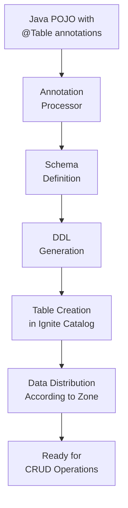
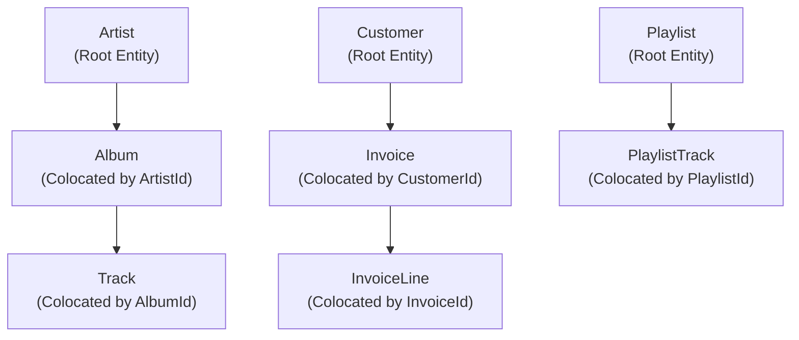

# 3. Schema-as-Code with Annotations

## 3.1 Introduction to Annotations API

### Why Annotations Matter in Distributed Systems

In distributed computing environments like Apache Ignite 3, annotations provide several critical benefits:

1. **Type Safety**: Compile-time validation ensures schema consistency across all cluster nodes
2. **Performance Optimization**: Annotations enable co-location, partitioning, and indexing strategies
3. **Maintainability**: Schema definitions live alongside the code that uses them
4. **Automatic DDL Generation**: No need to maintain separate SQL DDL scripts
5. **Version Control**: Schema changes are tracked with your application code
6. **Distribution Strategy**: Annotations control data placement across cluster nodes
7. **Index Management**: Secondary indexes defined alongside table structure
8. **Zone Configuration**: Storage engine and replication settings embedded in code

### Schema-as-Code Benefits

```java
// Traditional approach: Separate SQL commands with limited distribution control
// CREATE TABLE Artist (ArtistId INT PRIMARY KEY, Name VARCHAR);
// CREATE TABLE Album (AlbumId INT, Title VARCHAR, ArtistId INT, PRIMARY KEY (AlbumId, ArtistId)) COLOCATE BY (ArtistId);

// Ignite 3 approach: Complete schema definition in code
@Table(zone = @Zone(value = "MusicStore", storageProfiles = "default"))
public class Artist {
    @Id @Column(value = "ArtistId", nullable = false)
    private Integer ArtistId;
    
    @Column(value = "Name", nullable = true, length = 120)
    private String Name;
}

@Table(
    zone = @Zone(value = "MusicStore", storageProfiles = "default"),
    colocateBy = @ColumnRef("ArtistId"),
    indexes = { @Index(value = "IFK_AlbumArtistId", columns = { @ColumnRef("ArtistId") }) }
)
public class Album {
    @Id @Column(value = "AlbumId", nullable = false)
    private Integer AlbumId;
    
    @Column(value = "Title", nullable = false, length = 160)
    private String Title;
    
    @Id @Column(value = "ArtistId", nullable = false)
    private Integer ArtistId;
}
```

### Annotation Processing Pipeline



1. **Compile Time**: Annotations are processed and validated for consistency
2. **Runtime**: `client.catalog().createTable(MyClass.class)` is called
3. **Schema Generation**: Ignite generates DDL from annotations automatically
4. **Catalog Integration**: Table is registered in the distributed catalog
5. **Zone Assignment**: Table is assigned to the specified distribution zone
6. **Storage Configuration**: Storage profile determines the storage engine
7. **Index Creation**: Secondary indexes are created based on annotation definitions
8. **Colocation Setup**: Related data is placed together according to colocation strategy

### Core Annotation Reference

Apache Ignite 3 provides six core annotations for complete schema definition:

#### @Table - Primary Table Configuration
- **Purpose**: Marks a Java class as an Ignite table
- **Required**: Yes (on every entity class)
- **Attributes**:
  - `value` (optional): Table name override (defaults to class name)
  - `zone`: Distribution zone via `@Zone` annotation
  - `colocateBy` (optional): Colocation strategy via `@ColumnRef`
  - `indexes` (optional): Array of `@Index` definitions

#### @Zone - Distribution Zone Definition  
- **Purpose**: Defines data distribution and replication strategy
- **Required**: Yes (within @Table)
- **Attributes**:
  - `value`: Zone name (e.g., "MusicStore", "MusicStoreReplicated")
  - `storageProfiles`: Storage engine configuration (typically "default")
  - `partitions` (optional): Number of partitions for data distribution
  - `replicas` (optional): Number of replicas for fault tolerance

#### @Column - Field-to-Column Mapping
- **Purpose**: Maps Java fields to table columns with constraints
- **Required**: Optional (defaults to field name)
- **Attributes**:
  - `value`: Column name (defaults to field name if not specified)
  - `nullable`: NULL constraint specification (default: true)
  - `length`: String column length limits (for VARCHAR columns)
  - `precision`: Numeric precision (for DECIMAL columns)
  - `scale`: Numeric scale (for DECIMAL columns)

#### @Id - Primary Key Designation
- **Purpose**: Marks fields as components of the primary key
- **Required**: Yes (at least one field per table)
- **Attributes**:
  - No attributes - simply marks the field as part of primary key
  - **Important**: For colocation, colocation key must be marked with @Id

#### @ColumnRef - Column Reference for Relationships
- **Purpose**: References columns for colocation and indexing
- **Required**: When using colocation or indexes
- **Attributes**:
  - `value`: Referenced column name
  - `sort` (optional): Sort order for indexes (ASC, DESC)

#### @Index - Secondary Index Definition
- **Purpose**: Creates database indexes for query performance
- **Required**: Optional (used within @Table indexes array)
- **Attributes**:
  - `value`: Index name
  - `columns`: Array of `@ColumnRef` for indexed columns
  - `unique` (optional): Uniqueness constraint

## 3.2 Basic Table Definition

### Simple Entity Pattern - Single Primary Key

The simplest annotation pattern uses a single primary key field with basic column mapping:

```java
@Table(zone = @Zone(value = "MusicStore", storageProfiles = "default"))
public class Artist {
    @Id
    @Column(value = "ArtistId", nullable = false)
    private Integer ArtistId;
    
    @Column(value = "Name", nullable = true, length = 120)
    private String Name;
    
    // Default constructor required for Ignite 3
    public Artist() {}
    
    public Artist(Integer artistId, String name) {
        this.ArtistId = artistId;
        this.Name = name;
    }
    
    // Getters and setters
    public Integer getArtistId() { return ArtistId; }
    public void setArtistId(Integer artistId) { this.ArtistId = artistId; }
    public String getName() { return Name; }
    public void setName(String name) { this.Name = name; }
}
```

### Reference Data Pattern - High Replication

Reference data (lookup tables) typically use higher replication for better read performance:

```java
@Table(zone = @Zone(value = "MusicStoreReplicated", storageProfiles = "default"))
public class Genre {
    @Id
    @Column(value = "GenreId", nullable = false)
    private Integer GenreId;
    
    @Column(value = "Name", nullable = true, length = 120)
    private String Name;
    
    public Genre() {}
    
    public Genre(Integer genreId, String name) {
        this.GenreId = genreId;
        this.Name = name;
    }
    
    // Getters and setters...
}

@Table(zone = @Zone(value = "MusicStoreReplicated", storageProfiles = "default"))
public class MediaType {
    @Id
    @Column(value = "MediaTypeId", nullable = false)
    private Integer MediaTypeId;
    
    @Column(value = "Name", nullable = true, length = 120)
    private String Name;
    
    public MediaType() {}
    
    // Getters and setters...
}
```

### Data Type Mapping Examples

Ignite 3 supports a comprehensive range of Java data types with proper SQL mapping:

```java
@Table(zone = @Zone(value = "MusicStore", storageProfiles = "default"))
public class DataTypeExample {
    @Id
    @Column(value = "Id", nullable = false)
    private Integer Id;                    // SQL: INTEGER
    
    @Column(value = "Name", nullable = false, length = 255)
    private String Name;                   // SQL: VARCHAR(255)
    
    @Column(value = "IsActive", nullable = false)
    private Boolean IsActive;              // SQL: BOOLEAN
    
    @Column(value = "Price", nullable = false, precision = 10, scale = 2)
    private BigDecimal Price;              // SQL: DECIMAL(10,2)
    
    @Column(value = "CreatedDate", nullable = false)
    private LocalDate CreatedDate;         // SQL: DATE
    
    @Column(value = "LastModified", nullable = true)
    private LocalDateTime LastModified;    // SQL: TIMESTAMP
    
    @Column(value = "FileSize", nullable = true)
    private Long FileSize;                 // SQL: BIGINT
    
    @Column(value = "Rating", nullable = true)
    private Double Rating;                 // SQL: DOUBLE
    
    // Constructors, getters, setters...
}
```

### Column Constraint Specifications

```java
@Table(zone = @Zone(value = "MusicStore", storageProfiles = "default"))
public class Customer {
    @Id
    @Column(value = "CustomerId", nullable = false)
    private Integer CustomerId;
    
    // Required field with length constraint
    @Column(value = "FirstName", nullable = false, length = 40)
    private String FirstName;
    
    // Required field with specific length
    @Column(value = "LastName", nullable = false, length = 20)
    private String LastName;
    
    // Optional field with length constraint
    @Column(value = "Company", nullable = true, length = 80)
    private String Company;
    
    // Required field with unique business constraint (enforced by application)
    @Column(value = "Email", nullable = false, length = 60)
    private String Email;
    
    // Optional foreign key reference
    @Column(value = "SupportRepId", nullable = true)
    private Integer SupportRepId;
    
    // Financial data with precision constraints
    @Column(value = "CreditLimit", nullable = true, precision = 12, scale = 2)
    private BigDecimal CreditLimit;
    
    public Customer() {}
    
    // Getters and setters...
}
```

### Table Creation and Usage

```java
// Create tables from annotated classes
try (IgniteClient client = IgniteClient.builder()
        .addresses("127.0.0.1:10800")
        .build()) {
    
    // Create simple entity table
    client.catalog().createTable(Artist.class);
    
    // Create reference data tables
    client.catalog().createTable(Genre.class);
    client.catalog().createTable(MediaType.class);
    
    // Create complex entity table
    client.catalog().createTable(Customer.class);
    
    // Access the created tables
    Table artistTable = client.tables().table("Artist");
    RecordView<Artist> artistView = artistTable.recordView(Artist.class);
    
    // Insert data
    Artist artist = new Artist(1, "The Beatles");
    artistView.upsert(null, artist);
    
    // Query data
    Artist key = new Artist();
    key.setArtistId(1);
    Artist retrievedArtist = artistView.get(null, key);
    
    System.out.println("Artist: " + retrievedArtist.getName());
}
```

## 3.3 Advanced Schema Features

### Composite Primary Keys and Colocation

Composite primary keys are essential for related entities and enable data colocation for performance:

```java
// Parent table with simple primary key
@Table(zone = @Zone(value = "MusicStore", storageProfiles = "default"))
public class Artist {
    @Id
    @Column(value = "ArtistId", nullable = false)
    private Integer ArtistId;
    
    @Column(value = "Name", nullable = true, length = 120)
    private String Name;
    
    public Artist() {}
    // Getters and setters...
}

// Child table with composite primary key and colocation
@Table(
    zone = @Zone(value = "MusicStore", storageProfiles = "default"),
    colocateBy = @ColumnRef("ArtistId"),
    indexes = { @Index(value = "IFK_AlbumArtistId", columns = { @ColumnRef("ArtistId") }) }
)
public class Album {
    @Id
    @Column(value = "AlbumId", nullable = false)
    private Integer AlbumId;
    
    @Id  // Must be part of primary key for colocation
    @Column(value = "ArtistId", nullable = false)
    private Integer ArtistId;
    
    @Column(value = "Title", nullable = false, length = 160)
    private String Title;
    
    public Album() {}
    
    public Album(Integer albumId, Integer artistId, String title) {
        this.AlbumId = albumId;
        this.ArtistId = artistId;
        this.Title = title;
    }
    
    // Getters and setters...
}
```

### Complex Entity with Multiple Relationships

The Track entity demonstrates advanced annotation patterns with multiple foreign keys and indexes:

```java
@Table(
    zone = @Zone(value = "MusicStore", storageProfiles = "default"),
    colocateBy = @ColumnRef("AlbumId"),
    indexes = {
        @Index(value = "IFK_TrackAlbumId", columns = { @ColumnRef("AlbumId") }),
        @Index(value = "IFK_TrackGenreId", columns = { @ColumnRef("GenreId") }),
        @Index(value = "IFK_TrackMediaTypeId", columns = { @ColumnRef("MediaTypeId") }),
        @Index(value = "IDX_TrackName", columns = { @ColumnRef("Name") })
    }
)
public class Track {
    @Id
    @Column(value = "TrackId", nullable = false)
    private Integer TrackId;
    
    @Id  // Required for colocation with Album
    @Column(value = "AlbumId", nullable = true)
    private Integer AlbumId;
    
    @Column(value = "Name", nullable = false, length = 200)
    private String Name;
    
    @Column(value = "MediaTypeId", nullable = false)
    private Integer MediaTypeId;
    
    @Column(value = "GenreId", nullable = true)
    private Integer GenreId;
    
    @Column(value = "Composer", nullable = true, length = 220)
    private String Composer;
    
    @Column(value = "Milliseconds", nullable = false)
    private Integer Milliseconds;
    
    @Column(value = "Bytes", nullable = true)
    private Integer Bytes;
    
    @Column(value = "UnitPrice", nullable = false, precision = 10, scale = 2)
    private BigDecimal UnitPrice;
    
    public Track() {}
    
    // Getters and setters...
}
```

### Distribution Zone Strategies

Different zone configurations for different data access patterns:

```java
// High-throughput operational data - 2 replicas for write performance
@Table(zone = @Zone(value = "MusicStore", storageProfiles = "default"))
public class Invoice {
    @Id
    @Column(value = "InvoiceId", nullable = false)
    private Integer InvoiceId;
    
    @Id  // Colocate invoices with customer data
    @Column(value = "CustomerId", nullable = false)
    private Integer CustomerId;
    
    @Column(value = "InvoiceDate", nullable = false)
    private LocalDate InvoiceDate;
    
    @Column(value = "BillingAddress", nullable = true, length = 70)
    private String BillingAddress;
    
    @Column(value = "BillingCity", nullable = true, length = 40)
    private String BillingCity;
    
    @Column(value = "BillingState", nullable = true, length = 40)
    private String BillingState;
    
    @Column(value = "BillingCountry", nullable = true, length = 40)
    private String BillingCountry;
    
    @Column(value = "BillingPostalCode", nullable = true, length = 10)
    private String BillingPostalCode;
    
    @Column(value = "Total", nullable = false, precision = 10, scale = 2)
    private BigDecimal Total;
    
    public Invoice() {}
    // Getters and setters...
}

// Reference data - 3 replicas for read performance across more nodes
@Table(zone = @Zone(value = "MusicStoreReplicated", storageProfiles = "default"))
public class Genre {
    @Id
    @Column(value = "GenreId", nullable = false)
    private Integer GenreId;
    
    @Column(value = "Name", nullable = true, length = 120)
    private String Name;
    
    public Genre() {}
    // Getters and setters...
}
```

### Multi-Column and Composite Indexes

Advanced indexing strategies for complex query patterns:

```java
@Table(
    zone = @Zone(value = "MusicStore", storageProfiles = "default"),
    indexes = {
        // Foreign key index
        @Index(
            value = "IFK_InvoiceLineInvoiceId", 
            columns = { @ColumnRef("InvoiceId") }
        ),
        
        // Foreign key index
        @Index(
            value = "IFK_InvoiceLineTrackId", 
            columns = { @ColumnRef("TrackId") }
        ),
        
        // Composite index for common query patterns
        @Index(
            value = "IDX_InvoiceLine_Price_Qty",
            columns = { 
                @ColumnRef("UnitPrice"), 
                @ColumnRef(value = "Quantity", sort = SortOrder.DESC) 
            }
        ),
        
        // Unique composite index
        @Index(
            value = "UNQ_InvoiceLine_Invoice_Track",
            columns = { 
                @ColumnRef("InvoiceId"), 
                @ColumnRef("TrackId") 
            },
            unique = true
        )
    },
    colocateBy = @ColumnRef("InvoiceId")
)
public class InvoiceLine {
    @Id
    @Column(value = "InvoiceLineId", nullable = false)
    private Integer InvoiceLineId;
    
    @Id  // Required for colocation
    @Column(value = "InvoiceId", nullable = false)
    private Integer InvoiceId;
    
    @Column(value = "TrackId", nullable = false)
    private Integer TrackId;
    
    @Column(value = "UnitPrice", nullable = false, precision = 10, scale = 2)
    private BigDecimal UnitPrice;
    
    @Column(value = "Quantity", nullable = false)
    private Integer Quantity;
    
    public InvoiceLine() {}
    
    // Getters and setters...
}
```

### Junction Table Pattern for Many-to-Many Relationships

```java
@Table(
    zone = @Zone(value = "MusicStore", storageProfiles = "default"),
    indexes = {
        @Index(value = "IFK_PlaylistTrackPlaylistId", columns = { @ColumnRef("PlaylistId") }),
        @Index(value = "IFK_PlaylistTrackTrackId", columns = { @ColumnRef("TrackId") })
    },
    colocateBy = @ColumnRef("PlaylistId")
)
public class PlaylistTrack {
    @Id
    @Column(value = "PlaylistId", nullable = false)
    private Integer PlaylistId;
    
    @Id
    @Column(value = "TrackId", nullable = false)
    private Integer TrackId;
    
    public PlaylistTrack() {}
    
    public PlaylistTrack(Integer playlistId, Integer trackId) {
        this.PlaylistId = playlistId;
        this.TrackId = trackId;
    }
    
    // Getters and setters...
}
```

### Self-Referencing Entity Pattern

Employee hierarchies and organizational structures:

```java
@Table(
    zone = @Zone(value = "MusicStore", storageProfiles = "default"),
    indexes = {
        @Index(value = "IFK_EmployeeReportsTo", columns = { @ColumnRef("ReportsTo") }),
        @Index(value = "IDX_Employee_Email", columns = { @ColumnRef("Email") })
    }
)
public class Employee {
    @Id
    @Column(value = "EmployeeId", nullable = false)
    private Integer EmployeeId;
    
    @Column(value = "LastName", nullable = false, length = 20)
    private String LastName;
    
    @Column(value = "FirstName", nullable = false, length = 20)
    private String FirstName;
    
    @Column(value = "Title", nullable = true, length = 30)
    private String Title;
    
    // Self-referencing foreign key
    @Column(value = "ReportsTo", nullable = true)
    private Integer ReportsTo;
    
    @Column(value = "BirthDate", nullable = true)
    private LocalDate BirthDate;
    
    @Column(value = "HireDate", nullable = true)
    private LocalDate HireDate;
    
    @Column(value = "Address", nullable = true, length = 70)
    private String Address;
    
    @Column(value = "City", nullable = true, length = 40)
    private String City;
    
    @Column(value = "State", nullable = true, length = 40)
    private String State;
    
    @Column(value = "Country", nullable = true, length = 40)
    private String Country;
    
    @Column(value = "PostalCode", nullable = true, length = 10)
    private String PostalCode;
    
    @Column(value = "Phone", nullable = true, length = 24)
    private String Phone;
    
    @Column(value = "Fax", nullable = true, length = 24)
    private String Fax;
    
    @Column(value = "Email", nullable = true, length = 60)
    private String Email;
    
    public Employee() {}
    
    // Getters and setters...
}
```

## 3.4 Colocation and Data Distribution

### Understanding Colocation

Colocation is a fundamental performance optimization in distributed systems that stores related data on the same cluster nodes. This minimizes network traffic during joins and significantly improves query performance.

#### Music Store Hierarchy Colocation

The music store domain demonstrates a three-level colocation hierarchy:



#### Basic Colocation Pattern

```java
// Root entity - no colocation needed
@Table(zone = @Zone(value = "MusicStore", storageProfiles = "default"))
public class Artist {
    @Id
    @Column(value = "ArtistId", nullable = false)
    private Integer ArtistId;
    
    @Column(value = "Name", nullable = true, length = 120)
    private String Name;
    
    public Artist() {}
    // Getters and setters...
}

// Child entity colocated with parent
@Table(
    zone = @Zone(value = "MusicStore", storageProfiles = "default"),
    colocateBy = @ColumnRef("ArtistId"),  // Albums stored with their artist
    indexes = { @Index(value = "IFK_AlbumArtistId", columns = { @ColumnRef("ArtistId") }) }
)
public class Album {
    @Id
    @Column(value = "AlbumId", nullable = false)
    private Integer AlbumId;
    
    @Id  // REQUIRED: Colocation key must be part of primary key
    @Column(value = "ArtistId", nullable = false)
    private Integer ArtistId;
    
    @Column(value = "Title", nullable = false, length = 160)
    private String Title;
    
    public Album() {}
    // Getters and setters...
}
```

#### Multi-Level Colocation Chain

```java
// Grandchild entity - colocated through the hierarchy
@Table(
    zone = @Zone(value = "MusicStore", storageProfiles = "default"),
    colocateBy = @ColumnRef("AlbumId"),  // Tracks stored with their album
    indexes = {
        @Index(value = "IFK_TrackAlbumId", columns = { @ColumnRef("AlbumId") }),
        @Index(value = "IFK_TrackGenreId", columns = { @ColumnRef("GenreId") }),
        @Index(value = "IFK_TrackMediaTypeId", columns = { @ColumnRef("MediaTypeId") })
    }
)
public class Track {
    @Id
    @Column(value = "TrackId", nullable = false)
    private Integer TrackId;
    
    @Id  // REQUIRED: Colocation key must be part of primary key
    @Column(value = "AlbumId", nullable = true)
    private Integer AlbumId;
    
    @Column(value = "Name", nullable = false, length = 200)
    private String Name;
    
    @Column(value = "MediaTypeId", nullable = false)
    private Integer MediaTypeId;
    
    @Column(value = "GenreId", nullable = true)
    private Integer GenreId;
    
    @Column(value = "Composer", nullable = true, length = 220)
    private String Composer;
    
    @Column(value = "Milliseconds", nullable = false)
    private Integer Milliseconds;
    
    @Column(value = "Bytes", nullable = true)
    private Integer Bytes;
    
    @Column(value = "UnitPrice", nullable = false, precision = 10, scale = 2)
    private BigDecimal UnitPrice;
    
    public Track() {}
    // Getters and setters...
}
```

#### Business Domain Colocation

Customer-Invoice-InvoiceLine demonstrates business transaction colocation:

```java
@Table(zone = @Zone(value = "MusicStore", storageProfiles = "default"))
public class Customer {
    @Id
    @Column(value = "CustomerId", nullable = false)
    private Integer CustomerId;
    
    @Column(value = "FirstName", nullable = false, length = 40)
    private String FirstName;
    
    @Column(value = "LastName", nullable = false, length = 20)
    private String LastName;
    
    @Column(value = "Email", nullable = false, length = 60)
    private String Email;
    
    // Additional customer fields...
    
    public Customer() {}
    // Getters and setters...
}

@Table(
    zone = @Zone(value = "MusicStore", storageProfiles = "default"),
    colocateBy = @ColumnRef("CustomerId"),
    indexes = { @Index(value = "IFK_InvoiceCustomerId", columns = { @ColumnRef("CustomerId") }) }
)
public class Invoice {
    @Id
    @Column(value = "InvoiceId", nullable = false)
    private Integer InvoiceId;
    
    @Id  // Customer invoices stay together
    @Column(value = "CustomerId", nullable = false)
    private Integer CustomerId;
    
    @Column(value = "InvoiceDate", nullable = false)
    private LocalDate InvoiceDate;
    
    @Column(value = "Total", nullable = false, precision = 10, scale = 2)
    private BigDecimal Total;
    
    // Additional invoice fields...
    
    public Invoice() {}
    // Getters and setters...
}
```

### Colocation Best Practices

#### 1. Primary Key Requirements
```java
// CORRECT: Colocation key is part of primary key
@Table(colocateBy = @ColumnRef("ArtistId"))
public class Album {
    @Id @Column(value = "AlbumId", nullable = false)
    private Integer AlbumId;
    
    @Id @Column(value = "ArtistId", nullable = false)  // ✓ Part of PK
    private Integer ArtistId;
}

// INCORRECT: Colocation key not in primary key (will fail)
@Table(colocateBy = @ColumnRef("ArtistId"))
public class Album {
    @Id @Column(value = "AlbumId", nullable = false)
    private Integer AlbumId;
    
    @Column(value = "ArtistId", nullable = false)  // ✗ Not part of PK
    private Integer ArtistId;
}
```

#### 2. Data Type Consistency
```java
// Parent table
@Column(value = "ArtistId", nullable = false)
private Integer ArtistId;  // INTEGER

// Child table - MUST match parent type
@Column(value = "ArtistId", nullable = false)
private Integer ArtistId;  // INTEGER (correct)

// INCORRECT: Different data types will cause issues
// private Long ArtistId;     // ✗ BIGINT doesn't match INTEGER
// private String ArtistId;   // ✗ VARCHAR doesn't match INTEGER
```

#### 3. Balanced Distribution Strategy
```java
// GOOD: Well-distributed colocation key
@Table(colocateBy = @ColumnRef("CustomerId"))  // Many customers = good distribution
public class Invoice { ... }

// POOR: Skewed colocation key
@Table(colocateBy = @ColumnRef("CountryId"))   // Few countries = poor distribution
public class Customer { ... }
```

### Performance Impact Demonstration

#### Single-Node Query (Colocated Data)
```java
// This query executes on a single node due to colocation
String colocatedQuery = """
    SELECT 
        ar.Name as Artist,
        al.Title as Album,
        t.Name as Track,
        t.UnitPrice
    FROM Artist ar
    JOIN Album al ON ar.ArtistId = al.ArtistId
    JOIN Track t ON al.AlbumId = t.AlbumId
    WHERE ar.ArtistId = ?
    ORDER BY al.Title, t.Name
    """;

// All Artist 1 data is on the same node - no network overhead
try (ResultSet<SqlRow> result = client.sql().execute(null, colocatedQuery, 1)) {
    while (result.hasNext()) {
        SqlRow row = result.next();
        System.out.printf("%s - %s - %s ($%.2f)%n",
            row.stringValue("Artist"),
            row.stringValue("Album"), 
            row.stringValue("Track"),
            row.doubleValue("UnitPrice"));
    }
}
```

#### Multi-Node Query Impact
```java
// This query may require cross-node communication
String crossNodeQuery = """
    SELECT 
        c.FirstName || ' ' || c.LastName as Customer,
        ar.Name as Artist,
        COUNT(*) as PurchasedTracks
    FROM Customer c
    JOIN Invoice i ON c.CustomerId = i.CustomerId
    JOIN InvoiceLine il ON i.InvoiceId = il.InvoiceId
    JOIN Track t ON il.TrackId = t.TrackId
    JOIN Album al ON t.AlbumId = al.AlbumId
    JOIN Artist ar ON al.ArtistId = ar.ArtistId
    GROUP BY c.CustomerId, c.FirstName, c.LastName, ar.ArtistId, ar.Name
    ORDER BY PurchasedTracks DESC
    """;

// Customer and Artist data may be on different nodes
// Requires network communication for joins
```

### Zone Configuration for Colocation

```java
// Standard zone for operational data with colocation
@Table(
    zone = @Zone(
        value = "MusicStore", 
        storageProfiles = "default"
        // Default: 2 replicas, good for write performance
    ),
    colocateBy = @ColumnRef("ArtistId")
)
public class Album { ... }

// High-replica zone for reference data (no colocation needed)
@Table(
    zone = @Zone(
        value = "MusicStoreReplicated", 
        storageProfiles = "default"
        // Typically: 3+ replicas, optimized for read performance
    )
)
public class Genre { ... }
```

## 3.5 Key-Value vs Record Mapping

### Choosing the Right Data Access Pattern

Ignite 3 offers two primary approaches for data access: separate Key/Value classes and single Record classes. The choice depends on your use case, performance requirements, and code complexity preferences.

### Separate Key/Value Classes

This pattern is optimal for complex composite keys and performance-critical applications.

#### When to Use Separate Key/Value Classes

1. **Complex Composite Keys**: Multiple fields form the primary key
2. **Key-Only Operations**: Frequent operations that only need key fields
3. **Partial Updates**: Need to update only specific value fields efficiently
4. **Memory Optimization**: Minimize network transfer and memory usage
5. **High-Performance Scenarios**: Bulk operations and streaming applications

#### PlaylistTrack Example - Junction Table Pattern

```java
// Separate key class for composite primary key
public class PlaylistTrackKey {
    @Id
    @Column(value = "PlaylistId", nullable = false)
    private Integer PlaylistId;
    
    @Id
    @Column(value = "TrackId", nullable = false)
    private Integer TrackId;
    
    public PlaylistTrackKey() {}
    
    public PlaylistTrackKey(Integer playlistId, Integer trackId) {
        this.PlaylistId = playlistId;
        this.TrackId = trackId;
    }
    
    // Equals, hashCode, getters, setters...
    @Override
    public boolean equals(Object o) {
        if (this == o) return true;
        if (!(o instanceof PlaylistTrackKey)) return false;
        PlaylistTrackKey that = (PlaylistTrackKey) o;
        return Objects.equals(PlaylistId, that.PlaylistId) && 
               Objects.equals(TrackId, that.TrackId);
    }
    
    @Override
    public int hashCode() {
        return Objects.hash(PlaylistId, TrackId);
    }
    
    public Integer getPlaylistId() { return PlaylistId; }
    public void setPlaylistId(Integer playlistId) { this.PlaylistId = playlistId; }
    public Integer getTrackId() { return TrackId; }
    public void setTrackId(Integer trackId) { this.TrackId = trackId; }
}

// Separate value class for additional data
public class PlaylistTrackValue {
    @Column(value = "SortOrder", nullable = true)
    private Integer SortOrder;
    
    @Column(value = "DateAdded", nullable = false)
    private LocalDateTime DateAdded;
    
    public PlaylistTrackValue() {}
    
    public PlaylistTrackValue(Integer sortOrder, LocalDateTime dateAdded) {
        this.SortOrder = sortOrder;
        this.DateAdded = dateAdded;
    }
    
    // Getters and setters...
    public Integer getSortOrder() { return SortOrder; }
    public void setSortOrder(Integer sortOrder) { this.SortOrder = sortOrder; }
    public LocalDateTime getDateAdded() { return DateAdded; }
    public void setDateAdded(LocalDateTime dateAdded) { this.DateAdded = dateAdded; }
}

// Usage with KeyValueView
try (IgniteClient client = IgniteClient.builder()
        .addresses("127.0.0.1:10800")
        .build()) {
    
    KeyValueView<PlaylistTrackKey, PlaylistTrackValue> playlistTrackView = 
        client.tables().table("PlaylistTrack")
              .keyValueView(PlaylistTrackKey.class, PlaylistTrackValue.class);
    
    // Efficient key-only operations
    PlaylistTrackKey key = new PlaylistTrackKey(1, 101);
    
    // Check existence (only key transmitted)
    boolean exists = playlistTrackView.contains(null, key);
    
    // Insert with value
    PlaylistTrackValue value = new PlaylistTrackValue(1, LocalDateTime.now());
    playlistTrackView.put(null, key, value);
    
    // Get only value (key already known)
    PlaylistTrackValue retrievedValue = playlistTrackView.get(null, key);
    
    // Update only value fields
    retrievedValue.setSortOrder(2);
    playlistTrackView.put(null, key, retrievedValue);
}
```

#### InvoiceLine Example - Business Transaction Detail

```java
public class InvoiceLineKey {
    @Id
    @Column(value = "InvoiceLineId", nullable = false)
    private Integer InvoiceLineId;
    
    @Id
    @Column(value = "InvoiceId", nullable = false)
    private Integer InvoiceId;  // For colocation
    
    public InvoiceLineKey() {}
    
    public InvoiceLineKey(Integer invoiceLineId, Integer invoiceId) {
        this.InvoiceLineId = invoiceLineId;
        this.InvoiceId = invoiceId;
    }
    
    // Equals, hashCode, getters, setters...
}

public class InvoiceLineValue {
    @Column(value = "TrackId", nullable = false)
    private Integer TrackId;
    
    @Column(value = "UnitPrice", nullable = false, precision = 10, scale = 2)
    private BigDecimal UnitPrice;
    
    @Column(value = "Quantity", nullable = false)
    private Integer Quantity;
    
    public InvoiceLineValue() {}
    
    public InvoiceLineValue(Integer trackId, BigDecimal unitPrice, Integer quantity) {
        this.TrackId = trackId;
        this.UnitPrice = unitPrice;
        this.Quantity = quantity;
    }
    
    // Calculate total
    public BigDecimal getTotal() {
        return UnitPrice.multiply(BigDecimal.valueOf(Quantity));
    }
    
    // Getters and setters...
}
```

### Single Record Classes

This pattern offers simplicity and is ideal for entity-centric operations.

#### When to Use Single Record Classes

1. **Simple Primary Keys**: Single field primary keys
2. **Entity-Centric Operations**: Most operations involve the complete entity
3. **Simpler Code**: Reduced complexity in object management
4. **ORM-Style Development**: Traditional object-relational mapping patterns
5. **Rapid Development**: Faster prototyping and development cycles

#### Customer Example - Complete Entity

```java
@Table(
    zone = @Zone(value = "MusicStore", storageProfiles = "default"),
    indexes = {
        @Index(value = "IFK_CustomerSupportRepId", columns = { @ColumnRef("SupportRepId") }),
        @Index(value = "IDX_Customer_Email", columns = { @ColumnRef("Email") }),
        @Index(value = "IDX_Customer_Location", columns = { 
            @ColumnRef("Country"), 
            @ColumnRef("City") 
        })
    }
)
public class Customer {
    @Id
    @Column(value = "CustomerId", nullable = false)
    private Integer CustomerId;
    
    @Column(value = "FirstName", nullable = false, length = 40)
    private String FirstName;
    
    @Column(value = "LastName", nullable = false, length = 20)
    private String LastName;
    
    @Column(value = "Company", nullable = true, length = 80)
    private String Company;
    
    @Column(value = "Address", nullable = true, length = 70)
    private String Address;
    
    @Column(value = "City", nullable = true, length = 40)
    private String City;
    
    @Column(value = "State", nullable = true, length = 40)
    private String State;
    
    @Column(value = "Country", nullable = true, length = 40)
    private String Country;
    
    @Column(value = "PostalCode", nullable = true, length = 10)
    private String PostalCode;
    
    @Column(value = "Phone", nullable = true, length = 24)
    private String Phone;
    
    @Column(value = "Fax", nullable = true, length = 24)
    private String Fax;
    
    @Column(value = "Email", nullable = false, length = 60)
    private String Email;
    
    @Column(value = "SupportRepId", nullable = true)
    private Integer SupportRepId;
    
    public Customer() {}
    
    // Business methods
    public String getFullName() {
        return FirstName + " " + LastName;
    }
    
    public String getFullAddress() {
        StringBuilder addr = new StringBuilder();
        if (Address != null) addr.append(Address);
        if (City != null) addr.append(", ").append(City);
        if (State != null) addr.append(", ").append(State);
        if (Country != null) addr.append(", ").append(Country);
        return addr.toString();
    }
    
    // Getters and setters...
}

// Usage with RecordView
try (IgniteClient client = IgniteClient.builder()
        .addresses("127.0.0.1:10800")
        .build()) {
    
    RecordView<Customer> customerView = 
        client.tables().table("Customer").recordView(Customer.class);
    
    // Create complete customer entity
    Customer customer = new Customer();
    customer.setCustomerId(1);
    customer.setFirstName("John");
    customer.setLastName("Doe");
    customer.setEmail("john.doe@example.com");
    customer.setCity("New York");
    customer.setCountry("USA");
    
    // Insert complete entity
    customerView.upsert(null, customer);
    
    // Get complete entity using key-only object
    Customer keyOnly = new Customer();
    keyOnly.setCustomerId(1);
    Customer retrievedCustomer = customerView.get(null, keyOnly);
    
    // Business logic using complete entity
    System.out.println("Customer: " + retrievedCustomer.getFullName());
    System.out.println("Address: " + retrievedCustomer.getFullAddress());
}
```

### Performance and Design Trade-offs

| Aspect | Key/Value Classes | Single Record Class |
|--------|-------------------|--------------------|
| **Network Transfer** | Only required fields | Complete entity always |
| **Memory Usage** | Minimal for key operations | Higher for partial operations |
| **Serialization Overhead** | Separate key/value serialization | Single object serialization |
| **Code Complexity** | Higher (two classes) | Lower (one class) |
| **Type Safety** | Very high (separate concerns) | High (unified entity) |
| **Partial Updates** | Efficient value-only updates | Full entity replacement |
| **Bulk Operations** | More complex setup | Simpler implementation |
| **Development Speed** | Slower (more classes) | Faster (fewer classes) |
| **Query Integration** | Requires assembly | Direct entity mapping |

### Decision Matrix

```java
// Choose Key/Value when you have:
// ✓ Composite primary keys (2+ fields)
// ✓ Frequent key-only operations (exists, delete by key)
// ✓ Need for efficient partial updates
// ✓ High-performance requirements
// ✓ Large entities with frequent key operations
// ✓ Complex caching scenarios

// Examples: PlaylistTrack, InvoiceLine, OrderItem, UserRole

// Choose Single Record when you have:
// ✓ Simple primary keys (1 field)
// ✓ Entity-centric business logic
// ✓ ORM-style development preferences
// ✓ Rapid prototyping requirements
// ✓ Simpler maintenance priorities
// ✓ Direct SQL result mapping needs

// Examples: Customer, Artist, Album, Track, Invoice, Employee
```

### Hybrid Approach Example

```java
// You can use both patterns in the same application
public class MusicStoreService {
    
    // Simple entities use Record pattern
    private final RecordView<Artist> artistView;
    private final RecordView<Customer> customerView;
    
    // Complex entities use Key/Value pattern
    private final KeyValueView<PlaylistTrackKey, PlaylistTrackValue> playlistTrackView;
    private final KeyValueView<InvoiceLineKey, InvoiceLineValue> invoiceLineView;
    
    public MusicStoreService(IgniteClient client) {
        this.artistView = client.tables().table("Artist").recordView(Artist.class);
        this.customerView = client.tables().table("Customer").recordView(Customer.class);
        this.playlistTrackView = client.tables().table("PlaylistTrack")
            .keyValueView(PlaylistTrackKey.class, PlaylistTrackValue.class);
        this.invoiceLineView = client.tables().table("InvoiceLine")
            .keyValueView(InvoiceLineKey.class, InvoiceLineValue.class);
    }
    
    // Entity-centric operations use Record pattern
    public Customer getCustomerWithDetails(Integer customerId) {
        Customer key = new Customer();
        key.setCustomerId(customerId);
        return customerView.get(null, key);
    }
    
    // Performance-critical operations use Key/Value pattern
    public boolean isTrackInPlaylist(Integer playlistId, Integer trackId) {
        PlaylistTrackKey key = new PlaylistTrackKey(playlistId, trackId);
        return playlistTrackView.contains(null, key);
    }
}
```

## 3.6 DDL Generation and Catalog Integration

### Automatic Table Creation from Annotations

Ignite 3 automatically generates SQL DDL statements from your annotated POJOs, eliminating the need to maintain separate schema files.

#### Single Class Table Creation

```java
// Create tables from annotated classes
try (IgniteClient client = IgniteClient.builder()
        .addresses("127.0.0.1:10800")
        .build()) {
    
    // Simple entities with single primary key
    client.catalog().createTable(Artist.class);
    client.catalog().createTable(Customer.class);
    client.catalog().createTable(Genre.class);
    client.catalog().createTable(MediaType.class);
    
    // Complex entities with composite keys and colocation
    client.catalog().createTable(Album.class);
    client.catalog().createTable(Track.class);
    client.catalog().createTable(Invoice.class);
    client.catalog().createTable(InvoiceLine.class);
    
    // Junction tables for many-to-many relationships
    client.catalog().createTable(PlaylistTrack.class);
    
    System.out.println("All tables created successfully!");
}
```

#### Key-Value Class Table Creation

```java
// Create tables from separate key/value classes
Table playlistTrackTable = client.catalog()
    .createTable(PlaylistTrackKey.class, PlaylistTrackValue.class);

Table invoiceLineTable = client.catalog()
    .createTable(InvoiceLineKey.class, InvoiceLineValue.class);
```

### Generated DDL Examples

#### Simple Entity DDL Generation

From this annotation:
```java
@Table(zone = @Zone(value = "MusicStore", storageProfiles = "default"))
public class Artist {
    @Id @Column(value = "ArtistId", nullable = false)
    private Integer ArtistId;
    
    @Column(value = "Name", nullable = true, length = 120)
    private String Name;
}
```

Ignite generates equivalent DDL:
```sql
CREATE ZONE IF NOT EXISTS MusicStore WITH (
    STORAGE_PROFILES = 'default'
);

CREATE TABLE Artist (
    ArtistId INTEGER NOT NULL,
    Name VARCHAR(120),
    PRIMARY KEY (ArtistId)
) WITH (
    ZONE = 'MusicStore'
);
```

#### Complex Entity with Colocation and Indexes

From this annotation:
```java
@Table(
    zone = @Zone(value = "MusicStore", storageProfiles = "default"),
    colocateBy = @ColumnRef("AlbumId"),
    indexes = {
        @Index(value = "IFK_TrackAlbumId", columns = { @ColumnRef("AlbumId") }),
        @Index(value = "IFK_TrackGenreId", columns = { @ColumnRef("GenreId") }),
        @Index(value = "IDX_TrackName", columns = { @ColumnRef("Name") })
    }
)
public class Track {
    @Id @Column(value = "TrackId", nullable = false)
    private Integer TrackId;
    
    @Id @Column(value = "AlbumId", nullable = true)
    private Integer AlbumId;
    
    @Column(value = "Name", nullable = false, length = 200)
    private String Name;
    
    @Column(value = "UnitPrice", nullable = false, precision = 10, scale = 2)
    private BigDecimal UnitPrice;
    
    // Additional fields...
}
```

Ignite generates:
```sql
CREATE TABLE Track (
    TrackId INTEGER NOT NULL,
    AlbumId INTEGER,
    Name VARCHAR(200) NOT NULL,
    MediaTypeId INTEGER NOT NULL,
    GenreId INTEGER,
    Composer VARCHAR(220),
    Milliseconds INTEGER NOT NULL,
    Bytes INTEGER,
    UnitPrice DECIMAL(10,2) NOT NULL,
    PRIMARY KEY (TrackId, AlbumId)
) WITH (
    ZONE = 'MusicStore',
    COLOCATE_BY = (AlbumId)
);

CREATE INDEX IFK_TrackAlbumId ON Track (AlbumId);
CREATE INDEX IFK_TrackGenreId ON Track (GenreId);
CREATE INDEX IDX_TrackName ON Track (Name);
```

### Schema Validation and Error Handling

```java
public class SchemaManager {
    
    public void createMusicStoreSchema(IgniteClient client) {
        try {
            // Create zones first (if they don't exist)
            createDistributionZones(client);
            
            // Create tables in dependency order
            createBaseTables(client);
            createDependentTables(client);
            
            System.out.println("Music store schema created successfully");
            
        } catch (IgniteException e) {
            if (e.getMessage().contains("already exists")) {
                System.out.println("Schema already exists, skipping creation");
            } else {
                System.err.println("Schema creation failed: " + e.getMessage());
                throw e;
            }
        }
    }
    
    private void createDistributionZones(IgniteClient client) {
        // Zones are created automatically when first table is created
        // But you can create them explicitly for configuration
        System.out.println("Distribution zones will be created with first table");
    }
    
    private void createBaseTables(IgniteClient client) {
        // Create independent tables first
        client.catalog().createTable(Artist.class);
        client.catalog().createTable(Customer.class);
        client.catalog().createTable(Employee.class);
        client.catalog().createTable(Genre.class);
        client.catalog().createTable(MediaType.class);
        client.catalog().createTable(Playlist.class);
        
        System.out.println("Base tables created");
    }
    
    private void createDependentTables(IgniteClient client) {
        // Create tables with foreign key dependencies
        client.catalog().createTable(Album.class);      // depends on Artist
        client.catalog().createTable(Track.class);      // depends on Album, Genre, MediaType
        client.catalog().createTable(Invoice.class);    // depends on Customer
        client.catalog().createTable(InvoiceLine.class); // depends on Invoice, Track
        client.catalog().createTable(PlaylistTrack.class); // depends on Playlist, Track
        
        System.out.println("Dependent tables created");
    }
}
```

### Table Existence and Metadata Operations

```java
public class SchemaInspector {
    
    public void inspectMusicStoreSchema(IgniteClient client) {
        // Check if tables exist
        try {
            Table artistTable = client.tables().table("Artist");
            System.out.println("Artist table exists: " + (artistTable != null));
            
            // Get table metadata (this varies by Ignite version)
            // In Ignite 3, you typically work with the table directly
            RecordView<Artist> artistView = artistTable.recordView(Artist.class);
            System.out.println("Artist table view created successfully");
            
        } catch (IgniteException e) {
            System.out.println("Artist table does not exist: " + e.getMessage());
        }
        
        // List all tables (implementation may vary)
        listExistingTables(client);
    }
    
    private void listExistingTables(IgniteClient client) {
        String[] expectedTables = {
            "Artist", "Album", "Track", "Customer", "Invoice", "InvoiceLine",
            "Employee", "Genre", "MediaType", "Playlist", "PlaylistTrack"
        };
        
        for (String tableName : expectedTables) {
            try {
                Table table = client.tables().table(tableName);
                System.out.println("✓ Table exists: " + tableName);
            } catch (IgniteException e) {
                System.out.println("✗ Table missing: " + tableName);
            }
        }
    }
}
```

### Schema Evolution and Migration

```java
public class SchemaMigration {
    
    // Note: Schema evolution in Ignite 3 is typically handled by
    // creating new tables and migrating data, as ALTER TABLE
    // support may be limited
    
    public void addNewColumnExample(IgniteClient client) {
        // For schema changes, you typically:
        // 1. Create new table version with updated schema
        // 2. Migrate data from old to new table
        // 3. Drop old table and rename new table
        
        System.out.println("Schema evolution requires careful data migration planning");
    }
    
    public void verifySchemaConsistency(IgniteClient client) {
        // Verify that all expected tables exist and are accessible
        String[] requiredTables = {
            "Artist", "Album", "Track", "Customer", "Invoice", 
            "InvoiceLine", "Genre", "MediaType"
        };
        
        boolean allTablesExist = true;
        for (String tableName : requiredTables) {
            try {
                client.tables().table(tableName);
                System.out.println("✓ " + tableName);
            } catch (Exception e) {
                System.err.println("✗ " + tableName + " - " + e.getMessage());
                allTablesExist = false;
            }
        }
        
        if (allTablesExist) {
            System.out.println("Schema consistency check passed");
        } else {
            throw new IllegalStateException("Schema is inconsistent");
        }
    }
}
```

### Best Practices for DDL Generation

1. **Zone Creation Order**: Create zones before tables, or let them be created automatically
2. **Dependency Management**: Create independent tables before dependent ones
3. **Error Handling**: Handle "already exists" exceptions gracefully
4. **Transaction Boundaries**: DDL operations are not typically transactional
5. **Testing**: Always test schema creation in development environments first
6. **Documentation**: Keep annotation documentation up-to-date with schema changes

```java
// Complete schema setup example
public class MusicStoreSetup {
    
    public static void main(String[] args) {
        try (IgniteClient client = IgniteClient.builder()
                .addresses("127.0.0.1:10800")
                .build()) {
            
            // Create complete music store schema
            SchemaManager schemaManager = new SchemaManager();
            schemaManager.createMusicStoreSchema(client);
            
            // Verify schema consistency
            SchemaMigration migration = new SchemaMigration();
            migration.verifySchemaConsistency(client);
            
            // Inspect the created schema
            SchemaInspector inspector = new SchemaInspector();
            inspector.inspectMusicStoreSchema(client);
            
            System.out.println("Music store setup completed successfully!");
            
        } catch (Exception e) {
            System.err.println("Setup failed: " + e.getMessage());
            e.printStackTrace();
        }
    }
}
```

## 3.7 Summary and Best Practices

### Module 03 Summary

This module covered the complete Apache Ignite 3 annotations system for schema-as-code development:

1. **Core Annotations**: @Table, @Zone, @Column, @Id, @ColumnRef, @Index
2. **Basic Table Definition**: Simple entities with single primary keys
3. **Advanced Features**: Composite keys, colocation, indexes, distribution zones
4. **Colocation Strategies**: Performance optimization through data co-location
5. **Access Patterns**: Key/Value vs Record mapping for different use cases
6. **DDL Generation**: Automatic table creation from annotated POJOs

### Schema Design Principles

#### 1. Distribution Zone Strategy
```java
// Operational data - fewer replicas for write performance
@Table(zone = @Zone(value = "MusicStore", storageProfiles = "default"))

// Reference data - more replicas for read performance
@Table(zone = @Zone(value = "MusicStoreReplicated", storageProfiles = "default"))
```

#### 2. Colocation Hierarchy Planning
```java
// Design colocation chains for query performance
Artist (root) → Album (by ArtistId) → Track (by AlbumId)
Customer (root) → Invoice (by CustomerId) → InvoiceLine (by InvoiceId)
```

#### 3. Index Strategy
```java
// Foreign key indexes for joins
@Index(value = "IFK_AlbumArtistId", columns = { @ColumnRef("ArtistId") })

// Business query indexes
@Index(value = "IDX_Customer_Email", columns = { @ColumnRef("Email") })

// Composite indexes for complex queries
@Index(value = "IDX_Track_Genre_Price", columns = { 
    @ColumnRef("GenreId"), 
    @ColumnRef("UnitPrice") 
})
```

### Development Best Practices

#### Entity Design Guidelines

1. **Naming Conventions**: Use PascalCase field names that match SQL conventions
2. **Primary Key Design**: Include colocation keys in composite primary keys
3. **Data Type Selection**: Use appropriate Java types for SQL compatibility
4. **Nullability**: Use wrapper types (Integer) for nullable columns, primitives (int) for non-null
5. **Constructor Requirements**: Always provide default constructors for Ignite

#### Performance Optimization

1. **Colocation Planning**: Design colocation based on most frequent query patterns
2. **Index Strategy**: Create indexes for foreign keys and common query filters
3. **Zone Selection**: Use appropriate replication factors for data access patterns
4. **Access Pattern**: Choose Key/Value vs Record based on performance requirements

#### Code Organization

```java
// Organize entities by domain
package com.example.music.model.catalog;   // Artist, Album, Track
package com.example.music.model.sales;     // Customer, Invoice, InvoiceLine
package com.example.music.model.content;   // Playlist, PlaylistTrack
package com.example.music.model.reference; // Genre, MediaType
```

### Common Patterns and Anti-Patterns

#### ✅ Good Patterns

```java
// Proper colocation with composite primary key
@Table(colocateBy = @ColumnRef("ArtistId"))
public class Album {
    @Id @Column(value = "AlbumId", nullable = false)
    private Integer AlbumId;
    
    @Id @Column(value = "ArtistId", nullable = false)  // ✓ Colocation key in PK
    private Integer ArtistId;
}

// Appropriate zone selection
@Table(zone = @Zone(value = "MusicStoreReplicated"))  // ✓ Reference data
public class Genre { ... }

// Proper index naming and targeting
@Index(value = "IFK_TrackAlbumId", columns = { @ColumnRef("AlbumId") })  // ✓ Clear purpose
```

#### ❌ Anti-Patterns

```java
// Colocation key not in primary key (will fail)
@Table(colocateBy = @ColumnRef("ArtistId"))
public class Album {
    @Id @Column(value = "AlbumId", nullable = false)
    private Integer AlbumId;
    
    @Column(value = "ArtistId", nullable = false)  // ✗ Not part of PK
    private Integer ArtistId;
}

// Poor distribution due to low cardinality
@Table(colocateBy = @ColumnRef("CountryId"))  // ✗ Few countries = poor distribution
public class Customer { ... }

// Missing foreign key indexes
@Table  // ✗ No indexes defined for foreign keys
public class Track {
    private Integer AlbumId;    // ✗ No index for joins
    private Integer GenreId;    // ✗ No index for joins
}
```

### Testing and Validation

#### Schema Validation
```java
// Verify all tables can be created
public void validateSchemaCreation() {
    try (IgniteClient client = createTestClient()) {
        client.catalog().createTable(Artist.class);
        client.catalog().createTable(Album.class);
        client.catalog().createTable(Track.class);
        // All tables created successfully
    }
}

// Test colocation requirements
public void validateColocation() {
    // Verify colocated data is actually colocated
    // This requires cluster inspection tools
}
```

#### Performance Testing
```java
// Test query performance with colocation
public void testColocatedQueryPerformance() {
    String colocatedQuery = """
        SELECT ar.Name, al.Title, t.Name 
        FROM Artist ar
        JOIN Album al ON ar.ArtistId = al.ArtistId
        JOIN Track t ON al.AlbumId = t.AlbumId
        WHERE ar.ArtistId = ?
        """;
    
    // Measure execution time and network overhead
}
```

### Migration and Evolution

#### Schema Evolution Strategy
1. **Version Control**: Keep all annotation changes in version control
2. **Backward Compatibility**: Design schema changes to be backward compatible when possible
3. **Migration Planning**: Plan data migration for breaking schema changes
4. **Testing**: Test schema changes in development environments first

#### Production Deployment
1. **Rolling Updates**: Deploy schema changes with application updates
2. **Monitoring**: Monitor for schema-related errors and performance issues
3. **Rollback Plans**: Have rollback procedures for schema changes
4. **Documentation**: Maintain up-to-date schema documentation

### Next Steps

After mastering schema-as-code with annotations, the next logical progression includes:

1. **Module 04 - Table API**: Using the annotated schemas for CRUD operations
2. **Module 05 - SQL API**: Querying the schema with SQL
3. **Module 06 - Transactions**: Multi-table operations with ACID guarantees
4. **Module 09 - Caching Patterns**: Using schemas for caching strategies

The schema foundation established in this module enables all subsequent Ignite 3 operations and provides the performance optimizations necessary for distributed applications.
