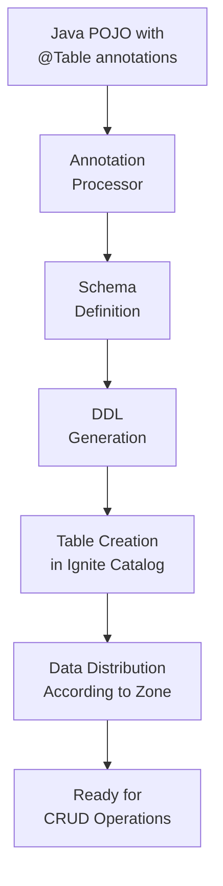

# 3. Schema-as-Code with Annotations

## 3.1 Introduction to Annotations API

### Why Annotations Matter in Distributed Systems

In distributed computing environments like Apache Ignite 3, annotations provide several critical benefits:

1. **Type Safety**: Compile-time validation ensures schema consistency across all cluster nodes
2. **Performance Optimization**: Annotations enable co-location, partitioning, and indexing strategies
3. **Maintainability**: Schema definitions live alongside the code that uses them
4. **Automatic DDL Generation**: No need to maintain separate SQL DDL scripts
5. **Version Control**: Schema changes are tracked with your application code

### Schema-as-Code Benefits

```java
// Traditional approach: Separate SQL commands
// CREATE TABLE Artist (ArtistId INT PRIMARY KEY, Name VARCHAR);
// CREATE TABLE Album (AlbumId INT, Title VARCHAR, ArtistId INT, PRIMARY KEY (AlbumId, ArtistId)) COLOCATE BY (ArtistId);

// Ignite 3 approach: Schema embedded in code
@Table(zone = @Zone(value = "Chinook", storageProfiles = "default"))
public class Artist {
    @Id @Column(value = "ArtistId", nullable = false)
    private Integer artistId;
    
    @Column(value = "Name", nullable = true)
    private String name;
}

@Table(
    zone = @Zone(value = "Chinook", storageProfiles = "default"),
    colocateBy = @ColumnRef("ArtistId")
)
public class Album {
    @Id @Column(value = "AlbumId", nullable = false)
    private Integer albumId;
    
    @Column(value = "Title", nullable = false)
    private String title;
    
    @Id @Column(value = "ArtistId", nullable = false)
    private Integer artistId;
}
```

### Annotation Processing Pipeline



1. **Compile Time**: Annotations are processed and validated
2. **Runtime**: `client.catalog().createTable(MyClass.class)` is called
3. **Schema Generation**: Ignite generates DDL from annotations
4. **Catalog Integration**: Table is registered in the distributed catalog
5. **Zone Assignment**: Table is assigned to the specified distribution zone
6. **Storage Configuration**: Storage profile determines the storage engine

## 3.2 Basic Table Definition

### @Table Annotation Fundamentals

```java
@Table("my_table")
public class MyRecord {
    @Id
    private Integer id;
    
    @Column(value = "name", nullable = false, length = 50)
    private String name;
    
    private String description; // Auto-mapped column
}
```

### @Column for Field Mapping

- `value()` - column name
- `nullable()` - nullability constraint
- `length()` - string length
- `precision()` & `scale()` - numeric precision

### @Id for Primary Keys

- Single field primary keys
- Sort order specification
- Auto-generation strategies

## 3.3 Advanced Schema Features

### Composite Primary Keys

```java
@Table("complex_table")
public class ComplexEntity {
    @Id
    private Long id;
    
    @Id
    @Column("region")
    private String region;
    
    // Other fields...
}
```

### @Zone for Distribution Configuration

```java
@Table(
    value = "distributed_table",
    zone = @Zone(
        value = "my_zone",
        partitions = 16,
        replicas = 3,
        storageProfiles = "default"
    )
)
public class DistributedEntity {
    // Fields...
}
```

### @Index for Secondary Indexes

```java
@Table(
    value = "indexed_table",
    indexes = @Index(
        value = "name_idx",
        columns = {
            @ColumnRef("name"),
            @ColumnRef(value = "created_date", sort = SortOrder.DESC)
        }
    )
)
public class IndexedEntity {
    // Fields...
}
```

### @ColumnRef and Colocation

Colocation is a performance optimization technique that stores related data on the same cluster nodes. This minimizes network traffic during joins and improves query performance.

#### Basic Colocation Example

```java
// Parent table (no colocation needed)
@Table(zone = @Zone(value = "Chinook", storageProfiles = "default"))
public class Artist {
    @Id
    @Column(value = "ArtistId", nullable = false)
    private Integer artistId;
    
    @Column(value = "Name", nullable = true)
    private String name;
    
    // Constructors, getters, setters...
}

// Child table colocated with Artist
@Table(
    zone = @Zone(value = "Chinook", storageProfiles = "default"),
    colocateBy = @ColumnRef("ArtistId")  // Albums stored with their artist
)
public class Album {
    @Id
    @Column(value = "AlbumId", nullable = false)
    private Integer albumId;
    
    @Column(value = "Title", nullable = false)
    private String title;
    
    @Id  // Must be part of primary key for colocation
    @Column(value = "ArtistId", nullable = false)
    private Integer artistId;
    
    // Constructors, getters, setters...
}
```

#### Multi-Level Colocation

```java
// Tracks colocated with Albums (which are colocated with Artists)
@Table(
    zone = @Zone(value = "Chinook", storageProfiles = "default"),
    colocateBy = @ColumnRef("AlbumId")
)
public class Track {
    @Id
    @Column(value = "TrackId", nullable = false)
    private Integer trackId;
    
    @Column(value = "Name", nullable = false)
    private String name;
    
    @Id  // Required for colocation
    @Column(value = "AlbumId", nullable = true)
    private Integer albumId;
    
    @Column(value = "MediaTypeId", nullable = false)
    private Integer mediaTypeId;
    
    @Column(value = "GenreId", nullable = true)
    private Integer genreId;
    
    @Column(value = "Composer", nullable = true)
    private String composer;
    
    @Column(value = "Milliseconds", nullable = false)
    private Integer milliseconds;
    
    @Column(value = "Bytes", nullable = true)
    private Integer bytes;
    
    @Column(value = "UnitPrice", nullable = false)
    private BigDecimal unitPrice;
    
    // Constructors, getters, setters...
}
```

#### Colocation Best Practices

1. **Colocation Key Must Be in Primary Key**: The field referenced by `@ColumnRef` must be marked with `@Id`
2. **Data Type Consistency**: Colocation keys must have the same data type across related tables
3. **Query Pattern Alignment**: Choose colocation based on your most frequent join patterns
4. **Balanced Distribution**: Ensure colocation keys provide good data distribution

#### Performance Impact Example

```java
// This query benefits from colocation - all data is on the same node
client.sql().execute(null, 
    "SELECT a.Name as Artist, al.Title as Album, t.Name as Track " +
    "FROM Artist a " +
    "JOIN Album al ON a.ArtistId = al.ArtistId " +
    "JOIN Track t ON al.AlbumId = t.AlbumId " +
    "WHERE a.ArtistId = ?", artistId);
```

## 3.4 Key-Value vs Record Mapping

### When to Use Separate Key/Value Classes

Separate key/value classes are beneficial when:

1. **Complex Composite Keys**: Multiple fields form the primary key
2. **Key-Only Operations**: Frequent operations that only need key fields
3. **Partial Updates**: You want to update only specific fields
4. **Clear Separation**: Logical separation between identifier and data

#### Example: Separate Key/Value Classes

```java
// Separate key class
public class InvoiceLineKey {
    @Id
    @Column(value = "InvoiceId", nullable = false)
    private Integer invoiceId;
    
    @Id
    @Column(value = "TrackId", nullable = false)
    private Integer trackId;
    
    public InvoiceLineKey() {}
    
    public InvoiceLineKey(Integer invoiceId, Integer trackId) {
        this.invoiceId = invoiceId;
        this.trackId = trackId;
    }
    
    // Getters and setters...
}

// Separate value class
public class InvoiceLineValue {
    @Column(value = "UnitPrice", nullable = false)
    private BigDecimal unitPrice;
    
    @Column(value = "Quantity", nullable = false)
    private Integer quantity;
    
    public InvoiceLineValue() {}
    
    public InvoiceLineValue(BigDecimal unitPrice, Integer quantity) {
        this.unitPrice = unitPrice;
        this.quantity = quantity;
    }
    
    // Getters and setters...
}

// Usage with KeyValueView
KeyValueView<InvoiceLineKey, InvoiceLineValue> invoiceLineView = 
    client.tables().table("InvoiceLine")
          .keyValueView(InvoiceLineKey.class, InvoiceLineValue.class);

// Insert
InvoiceLineKey key = new InvoiceLineKey(1, 101);
InvoiceLineValue value = new InvoiceLineValue(new BigDecimal("0.99"), 2);
invoiceLineView.put(null, key, value);

// Get only value
InvoiceLineValue retrievedValue = invoiceLineView.get(null, key);
```

### When to Use Single Record Classes

Single record classes are better when:

1. **Simple Primary Keys**: Single field primary keys
2. **Entity-Centric Operations**: Most operations involve the complete entity
3. **Simpler Code**: Less complexity in object management
4. **ORM-Style Usage**: Traditional object-relational mapping patterns

#### Example: Single Record Class

```java
@Table(
    zone = @Zone(value = "Chinook", storageProfiles = "default"),
    indexes = {
        @Index(value = "IFK_CustomerSupportRepId", columns = { @ColumnRef("SupportRepId") })
    }
)
public class Customer {
    @Id
    @Column(value = "CustomerId", nullable = false)
    private Integer customerId;
    
    @Column(value = "FirstName", nullable = false, length = 40)
    private String firstName;
    
    @Column(value = "LastName", nullable = false, length = 20)
    private String lastName;
    
    @Column(value = "Company", nullable = true, length = 80)
    private String company;
    
    @Column(value = "Address", nullable = true, length = 70)
    private String address;
    
    @Column(value = "City", nullable = true, length = 40)
    private String city;
    
    @Column(value = "State", nullable = true, length = 40)
    private String state;
    
    @Column(value = "Country", nullable = true, length = 40)
    private String country;
    
    @Column(value = "PostalCode", nullable = true, length = 10)
    private String postalCode;
    
    @Column(value = "Phone", nullable = true, length = 24)
    private String phone;
    
    @Column(value = "Fax", nullable = true, length = 24)
    private String fax;
    
    @Column(value = "Email", nullable = false, length = 60)
    private String email;
    
    @Column(value = "SupportRepId", nullable = true)
    private Integer supportRepId;
    
    // Constructors, getters, setters...
}

// Usage with RecordView
RecordView<Customer> customerView = 
    client.tables().table("Customer").recordView(Customer.class);

// Insert complete entity
Customer customer = new Customer();
customer.setCustomerId(1);
customer.setFirstName("John");
customer.setLastName("Doe");
customer.setEmail("john.doe@example.com");
customerView.upsert(null, customer);

// Get complete entity
Customer key = new Customer();
key.setCustomerId(1);
Customer retrievedCustomer = customerView.get(null, key);
```

### Performance Implications

| Aspect | Key/Value Classes | Single Record Class |
|--------|-------------------|--------------------|
| **Network Transfer** | Only required fields | Complete entity |
| **Memory Usage** | Minimal for key-only ops | Higher for partial ops |
| **Serialization** | Separate serialization | Single serialization |
| **Code Complexity** | Higher (two classes) | Lower (one class) |
| **Type Safety** | Very high | High |
| **Partial Updates** | Efficient | Less efficient |
| **Bulk Operations** | More complex | Simpler |

### Choosing the Right Approach

```java
// Use Key/Value when:
// 1. Composite primary keys
// 2. Frequent key-only operations
// 3. Need efficient partial updates

// Use Single Record when:
// 1. Simple primary keys
// 2. Entity-centric operations
// 3. Simpler code is priority
// 4. ORM-style development
```

## 3.5 DDL Generation and Catalog Integration

```java
// Create table from annotations
Table table = ignite.catalog().createTable(MyRecord.class);

// Create table from key-value classes
Table table = ignite.catalog().createTable(PersonKey.class, PersonValue.class);
```

## 3.6 POJO Mapping Deep Dive

### `Mapper.of()` Auto-Mapping

Ignite 3 provides automatic mapping between POJOs and SQL results using the `Mapper.of()` method:

```java
// Define a result class for SQL queries
public class ArtistSummary {
    private String artistName;
    private Integer albumCount;
    private Integer trackCount;
    
    // Default constructor required
    public ArtistSummary() {}
    
    // Getters and setters
    public String getArtistName() { return artistName; }
    public void setArtistName(String artistName) { this.artistName = artistName; }
    public Integer getAlbumCount() { return albumCount; }
    public void setAlbumCount(Integer albumCount) { this.albumCount = albumCount; }
    public Integer getTrackCount() { return trackCount; }
    public void setTrackCount(Integer trackCount) { this.trackCount = trackCount; }
    
    @Override
    public String toString() {
        return "ArtistSummary{artistName='" + artistName + "', albumCount=" + albumCount + 
               ", trackCount=" + trackCount + "}";
    }
}

// Use auto-mapping with SQL queries
String sql = """
    SELECT 
        a.Name as artistName,
        COUNT(DISTINCT al.AlbumId) as albumCount,
        COUNT(t.TrackId) as trackCount
    FROM Artist a
    LEFT JOIN Album al ON a.ArtistId = al.ArtistId
    LEFT JOIN Track t ON al.AlbumId = t.AlbumId
    GROUP BY a.ArtistId, a.Name
    ORDER BY trackCount DESC
    LIMIT 10
    """;

try (ResultSet<ArtistSummary> result = client.sql().execute(
        null, Mapper.of(ArtistSummary.class), sql)) {
    
    while (result.hasNext()) {
        ArtistSummary summary = result.next();
        System.out.println(summary);
    }
}
```

### Custom Field-to-Column Mapping

For more control over mapping, use `MapperBuilder`:

```java
// Custom mapping when field names don't match column names
public class CustomerInfo {
    private String fullName;        // Maps to "FirstName || ' ' || LastName"
    private String emailAddress;   // Maps to "Email"
    private String location;       // Maps to "City || ', ' || Country"
    
    // Constructors, getters, setters...
}

// Create custom mapper
Mapper<CustomerInfo> customMapper = Mapper.<CustomerInfo>builder()
    .map("fullName", "full_name")      // Map to SQL alias
    .map("emailAddress", "Email")       // Map to different column
    .map("location", "location_info")   // Map to computed column
    .build();

String sql = """
    SELECT 
        FirstName || ' ' || LastName as full_name,
        Email,
        City || ', ' || Country as location_info
    FROM Customer
    WHERE Country = ?
    """;

try (ResultSet<CustomerInfo> result = client.sql().execute(
        null, customMapper, sql, "USA")) {
    
    while (result.hasNext()) {
        CustomerInfo info = result.next();
        System.out.println(info);
    }
}
```

### Type Conversion System

Ignite 3 automatically handles common type conversions:

```java
public class TrackDetails {
    private Integer trackId;
    private String name;
    private Duration duration;      // Converted from milliseconds
    private LocalDateTime created;  // Converted from timestamp
    private BigDecimal price;       // Precise decimal handling
    private Boolean isPopular;      // Converted from computed boolean
    
    // Getters and setters with conversion logic
    public Duration getDuration() { return duration; }
    public void setDuration(Duration duration) { this.duration = duration; }
    
    // Custom setter for milliseconds to Duration conversion
    public void setDurationMillis(Long millis) {
        this.duration = millis != null ? Duration.ofMillis(millis) : null;
    }
}

// SQL with type conversions
String sql = """
    SELECT 
        TrackId,
        Name,
        Milliseconds as durationMillis,
        CURRENT_TIMESTAMP as created,
        UnitPrice as price,
        (Milliseconds > 240000) as isPopular
    FROM Track
    WHERE GenreId = ?
    """;

// Custom mapper with type conversion
Mapper<TrackDetails> trackMapper = Mapper.<TrackDetails>builder()
    .map("durationMillis", "Milliseconds")
    .convert("durationMillis", (Long millis) -> 
        millis != null ? Duration.ofMillis(millis) : null)
    .build();
```

### Working with Complex Types

#### Nested Objects and JSON

```java
// Complex type with nested structure
public class AlbumWithTracks {
    private Integer albumId;
    private String title;
    private String artistName;
    private List<String> trackNames;  // Aggregated from related tracks
    private Map<String, Object> metadata; // Additional flexible data
    
    // Constructors, getters, setters...
}

// Handle complex aggregations
String complexSql = """
    SELECT 
        al.AlbumId,
        al.Title,
        ar.Name as artistName,
        GROUP_CONCAT(t.Name, '|') as trackNamesConcat
    FROM Album al
    JOIN Artist ar ON al.ArtistId = ar.ArtistId
    LEFT JOIN Track t ON al.AlbumId = t.AlbumId
    WHERE al.AlbumId = ?
    GROUP BY al.AlbumId, al.Title, ar.Name
    """;

// Custom post-processing
try (ResultSet<SqlRow> result = client.sql().execute(null, complexSql, albumId)) {
    if (result.hasNext()) {
        SqlRow row = result.next();
        
        AlbumWithTracks album = new AlbumWithTracks();
        album.setAlbumId(row.intValue("AlbumId"));
        album.setTitle(row.stringValue("Title"));
        album.setArtistName(row.stringValue("artistName"));
        
        // Process concatenated track names
        String trackNamesConcat = row.stringValue("trackNamesConcat");
        if (trackNamesConcat != null && !trackNamesConcat.isEmpty()) {
            album.setTrackNames(Arrays.asList(trackNamesConcat.split("\\|")));
        }
        
        // Add metadata
        Map<String, Object> metadata = new HashMap<>();
        metadata.put("trackCount", album.getTrackNames().size());
        metadata.put("queryTime", LocalDateTime.now());
        album.setMetadata(metadata);
        
        System.out.println("Album: " + album);
    }
}
```

#### Date and Time Handling

```java
public class InvoiceInfo {
    private Integer invoiceId;
    private LocalDate invoiceDate;     // SQL DATE
    private LocalDateTime created;     // SQL TIMESTAMP
    private ZonedDateTime lastModified; // SQL TIMESTAMP WITH TIME ZONE
    
    // Getters and setters...
}

// Ignite automatically converts SQL date/time types to Java time types
String sql = """
    SELECT 
        InvoiceId,
        InvoiceDate,
        InvoiceDate as created,
        CURRENT_TIMESTAMP as lastModified
    FROM Invoice
    WHERE InvoiceId = ?
    """;

try (ResultSet<InvoiceInfo> result = client.sql().execute(
        null, Mapper.of(InvoiceInfo.class), sql, invoiceId)) {
    
    InvoiceInfo invoice = result.next();
    System.out.println("Invoice date: " + invoice.getInvoiceDate());
    System.out.println("Created: " + invoice.getCreated());
    System.out.println("Last modified: " + invoice.getLastModified());
}
```

### Best Practices for POJO Mapping

1. **Always Provide Default Constructors**: Required for object instantiation
2. **Use Appropriate Java Types**: Match SQL types to Java types appropriately
3. **Handle Nullability**: Use wrapper types (Integer, Boolean) for nullable columns
4. **Consider Performance**: Auto-mapping is convenient but custom mapping may be faster
5. **Validate Mappings**: Test mappings with actual data to catch issues early
6. **Document Complex Mappings**: Comment non-obvious field-to-column relationships
