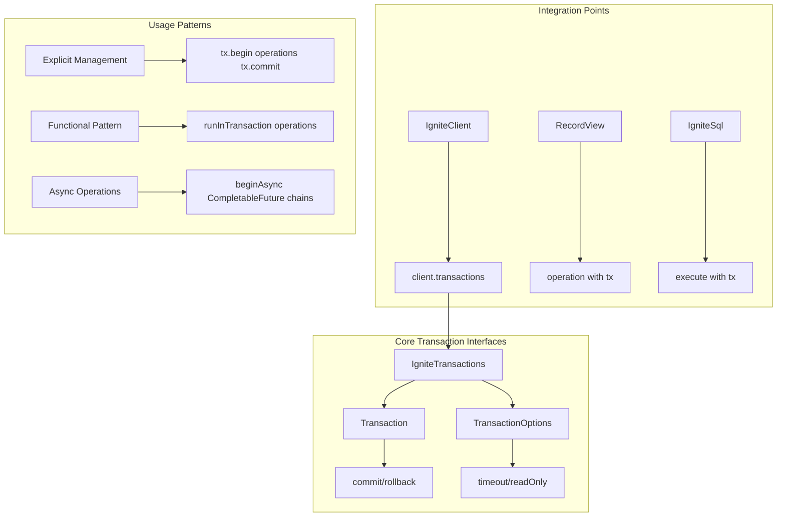

# Chapter 4.1: Transaction Fundamentals and ACID Properties

Your purchase workflow just left a customer charged but with no music in their library. The transaction failed halfway through across distributed nodes—the payment table updated on Node 1, but the customer library updates on Node 2 never committed. Your data is now inconsistent across the cluster, and you have no automated way to detect or recover from this state.

This happens when operations span multiple nodes without proper transaction coordination. In distributed systems, partial failures are the norm, not the exception. Network partitions split cluster communication, individual nodes crash during multi-step operations, and concurrent modifications create race conditions that leave data in invalid states.

## How Distributed Transactions Solve ACID Violations

Ignite 3's Transaction API prevents these failures through distributed ACID guarantees. When a customer selects five tracks from different albums and clicks "Buy Now," the system must atomically execute operations across multiple cluster nodes:

1. **Create invoice record** (potentially on Node 1, colocated with customer data)
2. **Add line items** for each track (potentially on Node 2, colocated with invoice data)  
3. **Update inventory counts** (potentially on Node 3, colocated with track data)
4. **Add tracks to customer's library** (potentially on Node 1, colocated with customer data)
5. **Process payment** and update account balance (potentially on Node 4, colocated with payment data)

Network failures, insufficient inventory, or payment declines trigger complete rollback across all affected nodes. The distributed transaction coordinator ensures either all operations commit atomically or all rollback, preventing partial state corruption.

## Transaction API Architecture

The Transaction API coordinates distributed operations through three primary interfaces that manage cluster-wide consistency:



**Distributed Coordination Mechanisms:**

- **Two-Phase Commit Protocol**: Ensures atomicity across multiple cluster nodes through prepare and commit phases
- **Transaction Coordinator**: Designated node manages transaction state and communicates with all participating nodes
- **Deadlock Detection**: Distributed algorithm prevents circular wait conditions that could halt the entire cluster
- **Conflict Resolution**: Optimistic concurrency control with automatic retry mechanisms for concurrent modifications
- **Partition Tolerance**: Maintains consistency during network splits and node failures

## Explicit Transaction Lifecycle Management

The fundamental transaction pattern requires explicit coordination across distributed nodes. When creating related records like artists and albums, both operations either succeed together or fail together, preventing orphaned references across the cluster.

### Basic Two-Phase Commit Implementation

```java
/**
 * Demonstrates distributed transaction lifecycle with explicit two-phase commit.
 * The transaction coordinator manages prepare and commit phases across all
 * participating cluster nodes to ensure atomicity.
 */
public class DistributedTransactionLifecycle {
    
    public void createArtistAndAlbum(IgniteClient client) {
        // Step 1: Transaction coordinator begins distributed transaction
        Transaction tx = client.transactions().begin();
        
        try {
            // Step 2: Get table views - data may be distributed across nodes
            RecordView<Artist> artistTable = client.tables().table("Artist").recordView(Artist.class);
            RecordView<Album> albumTable = client.tables().table("Album").recordView(Album.class);
            
            // Step 3: Create artist record (potentially on Node 1)
            Artist artist = new Artist(1000, "Arctic Monkeys");
            artistTable.upsert(tx, artist);
            
            // Step 4: Create album record linked to artist (potentially on Node 2)
            Album album = new Album(2000, 1000, "AM");
            albumTable.upsert(tx, album);
            
            // Step 5: Two-phase commit across all participating nodes
            // Phase 1: Prepare - all nodes validate and lock resources
            // Phase 2: Commit - all nodes atomically apply changes
            tx.commit();
            System.out.println("Distributed transaction committed across cluster");
            
        } catch (Exception e) {
            System.err.println("Transaction failed during distributed commit: " + e.getMessage());
            // Rollback triggers distributed abort across all participating nodes
            tx.rollback();
        }
    }
}
```

**Distributed ACID Guarantees:**

- **Atomicity**: Two-phase commit ensures all participating nodes either commit or abort together
- **Consistency**: Foreign key relationships maintained across data partitions
- **Isolation**: Concurrent transactions see consistent snapshots across all cluster nodes  
- **Durability**: Committed changes replicated to multiple nodes, surviving individual node failures

## Distributed ACID Implementation Patterns

### Cross-Node Atomicity Coordination

Data distribution across cluster nodes creates atomicity challenges that single-node databases never face. Customer records may reside on Node 1, invoice data on Node 2, and invoice line items on Node 3. Without proper coordination, partial failures leave related data in inconsistent states across the cluster.

```java
public class CrossNodeAtomicity {
    
    public void coordinateDistributedPurchase(IgniteClient client) {
        // Functional transaction pattern handles distributed coordination
        client.transactions().runInTransaction((Consumer<Transaction>) tx -> {
            RecordView<Customer> customers = client.tables().table("Customer").recordView(Customer.class);
            RecordView<Invoice> invoices = client.tables().table("Invoice").recordView(Invoice.class);
            RecordView<InvoiceLine> invoiceLines = client.tables().table("InvoiceLine").recordView(InvoiceLine.class);
            
            // Each operation may execute on different cluster nodes
            // Transaction coordinator ensures distributed atomicity
            
            Customer customer = new Customer(500, "John", "Doe", "john@example.com");
            customers.upsert(tx, customer);  // Executes on Node 1 (customer partition)
            
            Invoice invoice = new Invoice(1000, 500, LocalDate.now(), new BigDecimal("15.99"));
            invoices.upsert(tx, invoice);    // Executes on Node 2 (invoice partition)
            
            InvoiceLine line1 = new InvoiceLine(2000, 1000, 1, new BigDecimal("0.99"), 1);
            invoiceLines.upsert(tx, line1);  // Executes on Node 3 (line item partition)
            
            InvoiceLine line2 = new InvoiceLine(2001, 1000, 2, new BigDecimal("1.29"), 1);
            invoiceLines.upsert(tx, line2);  // Executes on Node 3 (line item partition)
            
            // Distributed two-phase commit ensures all nodes commit atomically
            // If any node fails during prepare phase, all nodes abort
        });
    }
}
```

### Strong Consistency Across Data Partitions

Distributed systems face consistency challenges when data relationships span multiple partitions. Business rules like "album total must equal sum of track prices" require validation across potentially different cluster nodes. Without strong consistency guarantees, concurrent modifications can create states where these invariants are violated.

```java  
public class DistributedConsistencyValidation {
    
    public void enforceBusinessRuleConsistency(IgniteClient client) {
        try (Transaction tx = client.transactions().begin()) {
            IgniteSql sql = client.sql();
            
            // Insert album record (potentially on Node 1)
            sql.execute(tx, "INSERT INTO Album (AlbumId, ArtistId, Title, TotalPrice) VALUES (?, ?, ?, ?)",
                3000, 1000, "New Album", new BigDecimal("12.99"));
            
            // Insert track records (potentially on Node 2) 
            sql.execute(tx, "INSERT INTO Track (TrackId, AlbumId, Name, UnitPrice) VALUES (?, ?, ?, ?)",
                5000, 3000, "Track 1", new BigDecimal("1.29"));
            
            sql.execute(tx, "INSERT INTO Track (TrackId, AlbumId, Name, UnitPrice) VALUES (?, ?, ?, ?)",
                5001, 3000, "Track 2", new BigDecimal("1.29"));
            
            // Consistency validation requires cross-partition join
            // Transaction ensures snapshot isolation across all participating nodes
            ResultSet<SqlRow> result = sql.execute(tx,
                "SELECT al.TotalPrice, SUM(t.UnitPrice) as TrackTotal " +
                "FROM Album al LEFT JOIN Track t ON al.AlbumId = t.AlbumId " +
                "WHERE al.AlbumId = ? GROUP BY al.AlbumId, al.TotalPrice", 3000);
            
            if (result.hasNext()) {
                SqlRow row = result.next();
                BigDecimal albumPrice = row.decimalValue("TotalPrice");
                BigDecimal trackTotal = row.decimalValue("TrackTotal");
                
                if (!albumPrice.equals(trackTotal)) {
                    throw new IllegalStateException("Cross-partition consistency violation detected");
                }
            }
            
            // Two-phase commit ensures consistency rule enforcement across cluster
            tx.commit();
            
        } catch (Exception e) {
            System.err.println("Distributed consistency validation failed: " + e.getMessage());
        }
    }
}
```

### Transaction Isolation Patterns

Distributed systems must balance strong consistency with performance. Read-write transactions provide full ACID guarantees but require expensive coordination across all participating nodes. Read-only transactions offer snapshot consistency with better performance by avoiding distributed locking mechanisms.

> **Important Note**: The `Transaction` interface is **not AutoCloseable**. Always use `client.transactions().runInTransaction()` for automatic lifecycle management, or manage explicit transactions carefully with try/catch/finally blocks.

```java
public class DistributedTransactionIsolation {
    
    public void readWriteTransactionWithLocking(IgniteClient client) {
        // Read-Write: requires distributed locking and two-phase commit
        TransactionOptions options = new TransactionOptions()
            .readOnly(false)  // Enables modifications across cluster
            .timeoutMillis(30000);
        
        try {
            client.transactions().runInTransaction(options, tx -> {
                RecordView<Track> tracks = client.tables().table("Track").recordView(Track.class);
                
                // Read operation acquires distributed read locks
                Track track = tracks.get(tx, createTrackKey(1));
                
                if (track != null) {
                    // Write operation acquires distributed write locks
                    // Prevents concurrent modifications across all replicas
                    track.setUnitPrice(track.getUnitPrice().add(new BigDecimal("0.10")));
                    tracks.upsert(tx, track);
                }
                
                return null;  // Two-phase commit releases all distributed locks
            });
            
        } catch (Exception e) {
            System.err.println("Distributed read-write transaction failed: " + e.getMessage());
        }
    }
    
    public void readOnlySnapshotIsolation(IgniteClient client) {
        // Read-Only: snapshot isolation without distributed locking overhead
        TransactionOptions options = new TransactionOptions()
            .readOnly(true)   // Snapshot consistency across all partitions
            .timeoutMillis(30000);
        
        try {
            client.transactions().runInTransaction(options, tx -> {
                IgniteSql sql = client.sql();
                
                // First read establishes snapshot timestamp across cluster
                ResultSet<SqlRow> firstRead = sql.execute(tx,
                    "SELECT COUNT(*) as TrackCount FROM Track WHERE UnitPrice > ?", 
                    new BigDecimal("1.00"));
                
                long initialCount = firstRead.next().longValue("TrackCount");
                
                try {
                    // Concurrent modifications by other transactions occur during delay
                    Thread.sleep(1000);
                } catch (InterruptedException ie) {
                    Thread.currentThread().interrupt();
                }
                
                // Second read uses same snapshot timestamp - no locks required
                ResultSet<SqlRow> secondRead = sql.execute(tx,
                    "SELECT COUNT(*) as TrackCount FROM Track WHERE UnitPrice > ?", 
                    new BigDecimal("1.00"));
                
                long finalCount = secondRead.next().longValue("TrackCount");
                
                // Snapshot isolation guarantees consistent view despite concurrent changes
                assert initialCount == finalCount : "Snapshot consistency maintained across cluster";
                
                return null;
            });
            
        } catch (Exception e) {
            System.err.println("Read-only snapshot transaction failed: " + e.getMessage());
        }
    }
    
    private Track createTrackKey(Integer trackId) {
        Track key = new Track();
        key.setTrackId(trackId);
        return key;
    }
}
```

### Distributed Durability and Fault Tolerance

Distributed durability requires data replication across multiple cluster nodes to survive individual node failures. Unlike single-node systems where durability means "written to disk," distributed durability means "replicated to multiple nodes with confirmed persistence."

```java
public class DistributedDurabilityGuarantees {
    
    public void ensureReplicatedPersistence(IgniteClient client) {
        try (Transaction tx = client.transactions().begin()) {
            RecordView<Artist> artists = client.tables().table("Artist").recordView(Artist.class);
            
            Artist newArtist = new Artist(2000, "Replicated Artist");
            artists.upsert(tx, newArtist);
            
            // Commit triggers replication to all configured replicas
            // Data persists across multiple nodes with confirmed write acknowledgments
            tx.commit();
            
            System.out.println("Artist data replicated across cluster nodes for fault tolerance");
            
            // Data remains accessible even during:
            // - Individual node failures (automatic failover to replicas)
            // - Network partitions (majority partition continues operations)
            // - Client disconnections (server-side persistence maintained)
            // - Rolling upgrades (data migrated to new cluster topology)
            
        } catch (Exception e) {
            System.err.println("Distributed durability guarantee failed: " + e.getMessage());
        }
    }
}
```

## Automatic Transaction Lifecycle Management

### Eliminating Distributed Transaction Complexity

Manual transaction lifecycle management in distributed systems introduces numerous failure modes: forgetting to rollback on exceptions, resource leaks from unclosed transactions, and complex error handling across multiple cluster nodes. The functional transaction pattern eliminates these issues through automatic lifecycle management.

```java
import java.util.function.Consumer;

/**
 * Demonstrates automatic distributed transaction management using runInTransaction().
 * This pattern eliminates manual coordination complexity and prevents common
 * distributed transaction management errors.
 */
public class AutomaticDistributedTransactions {
    
    public void createAtomicArtistAlbum(IgniteClient client) {
        try {
            // Functional pattern handles distributed coordination automatically
            client.transactions().runInTransaction((Consumer<Transaction>) tx -> {
                RecordView<Artist> artistTable = client.tables().table("Artist").recordView(Artist.class);
                RecordView<Album> albumTable = client.tables().table("Album").recordView(Album.class);
                
                // Operations span multiple partitions/nodes
                Artist artist = new Artist(1001, "Radiohead");
                artistTable.upsert(tx, artist);  // Potential Node 1
                
                Album album = new Album(2001, 1001, "OK Computer");  
                albumTable.upsert(tx, album);   // Potential Node 2
                
                // Automatic two-phase commit on successful completion
                // Automatic rollback on any exception across all nodes
            });
            
            System.out.println("Distributed transaction completed across cluster");
            
        } catch (Throwable e) {
            System.err.println("Distributed transaction failed and rolled back: " + e.getMessage());
        }
    }
    
    public Integer processCustomerPurchaseWorkflow(IgniteClient client, Integer customerId) {
        // Function pattern for transactions that return computed values
        return client.transactions().runInTransaction(tx -> {
            RecordView<Customer> customers = client.tables().table("Customer").recordView(Customer.class);
            IgniteSql sql = client.sql();
            
            // Combine Table API and SQL operations in unified transaction
            Customer customer = new Customer(customerId, "Jane", "Smith", "jane@example.com");
            customers.upsert(tx, customer);  // Structured record operation
            
            // SQL operation on potentially different partition
            sql.execute(tx, "UPDATE Customer SET Country = ? WHERE CustomerId = ?", "USA", customerId);
            
            return customerId;  // Return processed ID
        });
    }
}
```

**Distributed Transaction Automation Benefits:**

- **Distributed Coordinator Management**: Automatic selection and coordination of transaction leaders across cluster nodes
- **Cluster-Wide Exception Handling**: Automatic rollback propagation to all participating nodes on any failure
- **Resource Cleanup**: Automatic release of distributed locks and transaction resources across cluster
- **Return Value Extraction**: Can extract computed results from distributed operations
- **Failure Mode Prevention**: Eliminates distributed transaction management errors

> **Lambda Type Resolution**: Due to method overloading, void operations require explicit casting to `(Consumer<Transaction>)` while operations returning values use `Function<Transaction, T>` automatically.

### Distributed Transaction Patterns

The functional transaction pattern handles distributed coordination for:

- **Cross-Partition Operations**: Business logic spanning multiple data partitions
- **Multi-Table Workflows**: Complex operations requiring consistency across related tables
- **Failure-Prone Scenarios**: Operations susceptible to network, node, or business logic failures
- **Concurrent Access Patterns**: Operations requiring isolation from concurrent distributed modifications

### Distributed Transaction Conflict Resolution

```java
public class DistributedTransactionConflictHandler {
    
    public TransactionResult processOrderWithDistributedRetry(IgniteClient client, OrderRequest order) {
        int retryCount = 0;
        int maxRetries = 3;
        
        while (retryCount < maxRetries) {
            try (Transaction tx = client.transactions().begin()) {
                
                // Distributed operations across multiple partitions
                validateInventoryAcrossNodes(client, tx, order);
                createInvoiceWithLineItems(client, tx, order);
                updateInventoryOnMultipleNodes(client, tx, order);
                
                // Two-phase commit across all participating nodes
                tx.commit();
                return TransactionResult.success("Distributed order processed successfully");
                
            } catch (InventoryException e) {
                // Business constraint violation - immediate failure
                return TransactionResult.failure("Cross-partition inventory constraint violated: " + e.getMessage());
                
            } catch (TransactionException e) {
                // Distributed transaction conflict - retry with exponential backoff
                // Common causes: concurrent modifications, network partitions, node failures
                retryCount++;
                if (retryCount >= maxRetries) {
                    return TransactionResult.failure("Distributed transaction conflicts exceeded retry limit");
                }
                
                try {
                    // Exponential backoff reduces cluster contention
                    Thread.sleep(100 * retryCount * retryCount);
                } catch (InterruptedException ie) {
                    Thread.currentThread().interrupt();
                    return TransactionResult.failure("Distributed transaction retry interrupted");
                }
                
            } catch (Exception e) {
                // Network partition, node failure, or other distributed system error
                return TransactionResult.failure("Distributed system error: " + e.getMessage());
            }
        }
        
        return TransactionResult.failure("Distributed transaction retry limit exceeded");
    }
    
    private void validateInventoryAcrossNodes(IgniteClient client, Transaction tx, OrderRequest order) 
            throws InventoryException {
        IgniteSql sql = client.sql();
        
        for (OrderItem item : order.getItems()) {
            // Query may span multiple partitions for inventory data
            ResultSet<SqlRow> result = sql.execute(tx,
                "SELECT QuantityAvailable FROM Inventory WHERE ProductId = ?", 
                item.getProductId());
            
            if (result.hasNext()) {
                int available = result.next().intValue("QuantityAvailable");
                if (available < item.getQuantity()) {
                    throw new InventoryException("Distributed inventory check failed: Product " + item.getProductId() + 
                        " has only " + available + " units available across cluster");
                }
            } else {
                throw new InventoryException("Product " + item.getProductId() + " not found in distributed inventory");
            }
        }
    }
    
    private void createInvoiceWithLineItems(IgniteClient client, Transaction tx, OrderRequest order) {
        RecordView<Invoice> invoices = client.tables().table("Invoice").recordView(Invoice.class);
        
        Invoice invoice = new Invoice();
        invoice.setInvoiceId(order.getInvoiceId());
        invoice.setCustomerId(order.getCustomerId());
        invoice.setInvoiceDate(LocalDate.now());
        invoice.setTotal(order.getTotal());
        
        // Invoice record may be stored on different node than line items
        invoices.upsert(tx, invoice);
    }
    
    private void updateInventoryOnMultipleNodes(IgniteClient client, Transaction tx, OrderRequest order) {
        IgniteSql sql = client.sql();
        
        for (OrderItem item : order.getItems()) {
            // Each inventory update may occur on different cluster node
            sql.execute(tx,
                "UPDATE Inventory SET QuantityAvailable = QuantityAvailable - ? WHERE ProductId = ?",
                item.getQuantity(), item.getProductId());
        }
    }
}

// Helper classes for error handling
class TransactionResult {
    private final boolean success;
    private final String message;
    
    private TransactionResult(boolean success, String message) {
        this.success = success;
        this.message = message;
    }
    
    public static TransactionResult success(String message) {
        return new TransactionResult(true, message);
    }
    
    public static TransactionResult failure(String message) {
        return new TransactionResult(false, message);
    }
    
    // Getters...
}

class InventoryException extends Exception {
    public InventoryException(String message) {
        super(message);
    }
}
```

## Cross-API Transactional Consistency

Distributed transactions coordinate operations across both Table API and SQL API to maintain consistency when different access patterns are required within the same business workflow:

```java
public class CrossAPIDistributedTransactions {
    
    public void processCompleteOrderWorkflow(IgniteClient client, Order order) {
        try (Transaction tx = client.transactions().begin()) {
            
            // 1. Table API: Structured record operations on primary entities
            RecordView<Customer> customers = client.tables().table("Customer").recordView(Customer.class);
            RecordView<Invoice> invoices = client.tables().table("Invoice").recordView(Invoice.class);
            
            Customer customer = order.getCustomer();
            customers.upsert(tx, customer);  // Node 1: Customer partition
            
            Invoice invoice = order.getInvoice();
            invoices.upsert(tx, invoice);    // Node 2: Invoice partition
            
            // 2. SQL API: Complex analytical operations requiring joins across partitions
            IgniteSql sql = client.sql();
            
            for (OrderItem item : order.getItems()) {
                // Cross-partition join for pricing and discount calculation
                ResultSet<SqlRow> priceResult = sql.execute(tx,
                    "SELECT p.UnitPrice, COALESCE(d.DiscountPercent, 0) as Discount " +
                    "FROM Product p " +
                    "LEFT JOIN CustomerDiscount d ON p.ProductId = d.ProductId AND d.CustomerId = ? " +
                    "WHERE p.ProductId = ?", 
                    customer.getCustomerId(), item.getProductId());
                
                if (priceResult.hasNext()) {
                    SqlRow row = priceResult.next();
                    BigDecimal unitPrice = row.decimalValue("UnitPrice");
                    BigDecimal discount = row.decimalValue("Discount");
                    BigDecimal finalPrice = unitPrice.multiply(
                        BigDecimal.ONE.subtract(discount.divide(new BigDecimal("100"))));
                    
                    // SQL insert for complex calculated data
                    sql.execute(tx,
                        "INSERT INTO InvoiceLine (InvoiceLineId, InvoiceId, ProductId, Quantity, UnitPrice) " +
                        "VALUES (?, ?, ?, ?, ?)",
                        item.getInvoiceLineId(), invoice.getInvoiceId(), 
                        item.getProductId(), item.getQuantity(), finalPrice);  // Node 3: Line item partition
                }
            }
            
            // 3. Table API: Atomic customer statistics update
            customer.setLastOrderDate(LocalDate.now());
            customer.setTotalOrders(customer.getTotalOrders() + 1);
            customers.upsert(tx, customer);  // Node 1: Customer partition update
            
            // Two-phase commit coordinates all operations across Nodes 1, 2, and 3
            tx.commit();
            System.out.println("Cross-API distributed transaction completed across cluster");
            
        } catch (Exception e) {
            System.err.println("Cross-API distributed transaction failed: " + e.getMessage());
        }
    }
}
```

## Distributed Transaction Performance Optimization

### Minimizing Cross-Node Coordination Overhead

Distributed transactions require expensive coordination protocols like two-phase commit. Long-running transactions hold distributed locks longer, increasing contention and reducing cluster throughput. The key optimization is minimizing transaction scope while maintaining atomicity requirements.

```java
public class DistributedTransactionOptimization {
    
    // ✓ OPTIMIZED: Minimize distributed coordination time
    public void minimizeDistributedLockingTime(IgniteClient client) {
        // Perform expensive computation outside transaction scope
        List<Track> tracksToUpdate = prepareTrackUpdatesOutsideTransaction();
        
        // Distributed transaction holds locks for minimal time
        try (Transaction tx = client.transactions().begin()) {
            RecordView<Track> tracks = client.tables().table("Track").recordView(Track.class);
            
            // Batch upsert reduces network round-trips between coordinator nodes
            tracks.upsertAll(tx, tracksToUpdate);
            
            // Quick commit releases distributed locks across cluster
            tx.commit();
            
        } catch (Exception e) {
            System.err.println("Optimized distributed transaction failed: " + e.getMessage());
        }
    }
    
    // ✗ ANTI-PATTERN: Extended distributed locking
    public void extendedDistributedLocking(IgniteClient client) {
        try (Transaction tx = client.transactions().begin()) {
            // Expensive computation while holding distributed locks
            // This blocks concurrent access across entire cluster
            List<Track> tracks = performExpensiveAnalysisWhileLocked();  // 30 seconds of cluster-wide blocking!
            
            RecordView<Track> trackTable = client.tables().table("Track").recordView(Track.class);
            trackTable.upsertAll(tx, tracks);
            
            tx.commit();
            
        } catch (Exception e) {
            System.err.println("Extended locking transaction failed: " + e.getMessage());
        }
    }
    
    private List<Track> prepareTrackUpdatesOutsideTransaction() {
        // CPU-intensive operations don't require distributed coordination
        return new ArrayList<>();
    }
    
    private List<Track> performExpensiveAnalysisWhileLocked() {
        // Simulates expensive computation during distributed transaction
        return new ArrayList<>();
    }
}
```

## Advancing to Complex Distributed Patterns

Distributed ACID fundamentals enable advanced coordination patterns that solve complex cluster-wide consistency challenges. With basic two-phase commit mechanisms established, you can now implement sophisticated distributed workflows that maintain consistency across async operations, compute jobs, and complex business transactions.

**[Chapter 4.2: Advanced Transaction Patterns](02-advanced-transaction-patterns.md)** - Implement async distributed transactions, handle complex retry scenarios, and coordinate long-running workflows across cluster nodes.

**[Chapter 4.3: Compute API for Distributed Processing](03-compute-api-processing.md)** - Apply transactional consistency to distributed compute jobs, ensuring data integrity during parallel processing across the cluster.
