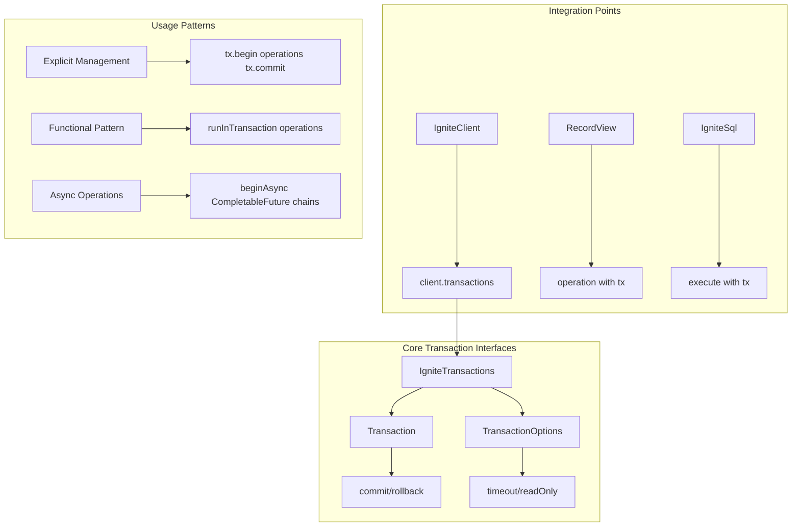

# Chapter 4.1: Transaction Fundamentals and ACID Properties

## Learning Objectives

By completing this chapter, you will:

- Understand ACID guarantees in distributed environments
- Master explicit transaction management patterns
- Implement proper error handling and resource cleanup
- Apply transactions across Table API and SQL operations

## Working with the Reference Application

The **`06-transactions-app`** demonstrates transaction patterns covered in this chapter with music store workflows. Run it alongside your learning to see ACID guarantees, isolation levels, and error handling patterns in action.

**Quick Start**: After reading this chapter, explore the reference application:

```bash
cd ignite3-reference-apps/06-transactions-app
mvn compile exec:java
```

The reference app shows how the Table API and SQL operations from [Module 3](../03-data-access-apis/01-table-api-operations.md) work together within distributed transactions for business workflows.

## The Transaction Challenge in Music Store Operations

> [!IMPORTANT]
> **ACID in Distributed Systems**: Transactions in Ignite 3 provide full ACID guarantees across multiple nodes and tables, ensuring data consistency even when operations span the entire cluster.

Consider this scenario: A customer selects five tracks from different albums and clicks "Buy Now." The system must:

1. **Create an invoice** for the customer
2. **Add line items** for each track
3. **Update inventory counts** for each track
4. **Add tracks to** the customer's purchased playlist
5. **Process the payment** and update the customer's account

If any step fails—network issues, insufficient inventory, payment decline—the entire operation should rollback. The customer shouldn't see a charge without receiving their music, and inventory shouldn't decrease without a completed sale.

This is what Ignite 3's Transaction API delivers: **atomic operations across multiple tables and nodes** with ACID guarantees.

## Overview: Transaction API Architecture

The Transaction API is built around interfaces that provide both explicit control and automatic management:



**Key Design Principles:**

- **ACID Guarantees**: Atomicity, Consistency, Isolation, Durability across the cluster
- **Multiple Patterns**: Explicit control vs automatic management via closures
- **Async Support**: CompletableFuture-based non-blocking operations
- **API Integration**: Works seamlessly with Table API and SQL API
- **Resource Safety**: Automatic cleanup and proper exception handling

## Getting Started: Your First Transaction

Let's start with a simple scenario: creating a new artist and their debut album atomically. If creating the album fails, we don't want an orphaned artist record.

### Basic Transaction Lifecycle

```java
/**
 * Demonstrates the fundamental transaction lifecycle in Ignite 3.
 * This example shows explicit transaction management where you control
 * the complete lifecycle: begin, operations, commit/rollback.
 */
public class FirstTransaction {
    
    public void createArtistAndAlbum(IgniteClient client) {
        // Step 1: Begin a transaction
        Transaction tx = client.transactions().begin();
        
        try {
            // Step 2: Get table views within the transaction
            RecordView<Artist> artistTable = client.tables().table("Artist").recordView(Artist.class);
            RecordView<Album> albumTable = client.tables().table("Album").recordView(Album.class);
            
            // Step 3: Create artist record
            Artist artist = new Artist(1000, "Arctic Monkeys");
            artistTable.upsert(tx, artist);
            
            // Step 4: Create album record (linked to artist)
            Album album = new Album(2000, 1000, "AM");
            albumTable.upsert(tx, album);
            
            // Step 5: Commit all changes atomically
            tx.commit();
            System.out.println("✓ Artist and album created successfully");
            
        } catch (Exception e) {
            System.err.println("✗ Transaction failed: " + e.getMessage());
            // Step 6: Rollback on any error
            tx.rollback();
        }
    }
}
```

**What This Achieves:**

- **Atomicity**: Both artist and album are created, or neither exists
- **Consistency**: Foreign key relationships remain valid
- **Isolation**: Other transactions see either no change or complete change
- **Durability**: Once committed, the changes persist across node failures

### Understanding ACID in Distributed Systems

#### Atomicity Across Multiple Nodes

In a distributed environment, your data may be spread across multiple cluster nodes. Ignite 3 ensures atomicity even when transaction operations affect data on different nodes:

```java
public class DistributedAtomicity {
    
    public void demonstrateDistributedAtomicity(IgniteClient client) {
        try (Transaction tx = client.transactions().begin()) {
            RecordView<Customer> customers = client.tables().table("Customer").recordView(Customer.class);
            RecordView<Invoice> invoices = client.tables().table("Invoice").recordView(Invoice.class);
            RecordView<InvoiceLine> invoiceLines = client.tables().table("InvoiceLine").recordView(InvoiceLine.class);
            
            // These operations may execute on different cluster nodes
            // due to data distribution, but atomicity is guaranteed
            
            Customer customer = new Customer(500, "John", "Doe", "john@example.com");
            customers.upsert(tx, customer);  // May execute on Node 1
            
            Invoice invoice = new Invoice(1000, 500, LocalDate.now(), new BigDecimal("15.99"));
            invoices.upsert(tx, invoice);    // May execute on Node 2 (colocated with customer)
            
            InvoiceLine line1 = new InvoiceLine(2000, 1000, 1, new BigDecimal("0.99"), 1);
            invoiceLines.upsert(tx, line1);  // May execute on Node 2 (colocated with invoice)
            
            InvoiceLine line2 = new InvoiceLine(2001, 1000, 2, new BigDecimal("1.29"), 1);
            invoiceLines.upsert(tx, line2);  // May execute on Node 2 (colocated with invoice)
            
            // All nodes coordinate to ensure atomic commit
            tx.commit();
            
        } catch (Exception e) {
            System.err.println("Distributed transaction failed: " + e.getMessage());
        }
    }
}
```

#### Consistency Guarantees

Ignite 3 maintains **strong consistency** across all data throughout the distributed system:

```java
public class ConsistencyExample {
    
    public void demonstrateConsistency(IgniteClient client) {
        try (Transaction tx = client.transactions().begin()) {
            IgniteSql sql = client.sql();
            
            // Business rule: Album total must equal sum of track prices
            sql.execute(tx, "INSERT INTO Album (AlbumId, ArtistId, Title, TotalPrice) VALUES (?, ?, ?, ?)",
                3000, 1000, "New Album", new BigDecimal("12.99"));
            
            sql.execute(tx, "INSERT INTO Track (TrackId, AlbumId, Name, UnitPrice) VALUES (?, ?, ?, ?)",
                5000, 3000, "Track 1", new BigDecimal("1.29"));
            
            sql.execute(tx, "INSERT INTO Track (TrackId, AlbumId, Name, UnitPrice) VALUES (?, ?, ?, ?)",
                5001, 3000, "Track 2", new BigDecimal("1.29"));
            
            // Verify consistency within transaction
            ResultSet<SqlRow> result = sql.execute(tx,
                "SELECT al.TotalPrice, SUM(t.UnitPrice) as TrackTotal " +
                "FROM Album al LEFT JOIN Track t ON al.AlbumId = t.AlbumId " +
                "WHERE al.AlbumId = ? GROUP BY al.AlbumId, al.TotalPrice", 3000);
            
            if (result.hasNext()) {
                SqlRow row = result.next();
                BigDecimal albumPrice = row.decimalValue("TotalPrice");
                BigDecimal trackTotal = row.decimalValue("TrackTotal");
                
                if (!albumPrice.equals(trackTotal)) {
                    throw new IllegalStateException("Album price inconsistency detected");
                }
            }
            
            tx.commit();
            
        } catch (Exception e) {
            System.err.println("Consistency check failed: " + e.getMessage());
        }
    }
}
```

#### Transaction Types

Ignite 3 supports two transaction types that balance consistency with performance:

```java
public class TransactionTypes {
    
    public void demonstrateReadWriteTransaction(IgniteClient client) {
        // Read-Write transaction: supports modifications, full ACID guarantees
        TransactionOptions options = new TransactionOptions()
            .readOnly(false)  // Default: allows modifications
            .timeoutMillis(30000);
        
        try (Transaction tx = client.transactions().begin(options)) {
            RecordView<Track> tracks = client.tables().table("Track").recordView(Track.class);
            
            // Read-Write: can modify data within transaction
            Track track = tracks.get(tx, createTrackKey(1));
            
            if (track != null) {
                track.setUnitPrice(track.getUnitPrice().add(new BigDecimal("0.10")));
                tracks.upsert(tx, track);
            }
            
            tx.commit();
            
        } catch (Exception e) {
            System.err.println("Read-Write transaction failed: " + e.getMessage());
        }
    }
    
    public void demonstrateReadOnlyTransaction(IgniteClient client) {
        // Read-Only transaction: snapshot view, better performance, no modifications
        TransactionOptions options = new TransactionOptions()
            .readOnly(true)   // Read-only: snapshot consistency
            .timeoutMillis(30000);
        
        try (Transaction tx = client.transactions().begin(options)) {
            IgniteSql sql = client.sql();
            
            // Read-Only: provides consistent snapshot view
            ResultSet<SqlRow> firstRead = sql.execute(tx,
                "SELECT COUNT(*) as TrackCount FROM Track WHERE UnitPrice > ?", 
                new BigDecimal("1.00"));
            
            long initialCount = firstRead.next().longValue("TrackCount");
            
            // Simulate some work...
            Thread.sleep(1000);
            
            // Second read sees same snapshot data throughout transaction
            ResultSet<SqlRow> secondRead = sql.execute(tx,
                "SELECT COUNT(*) as TrackCount FROM Track WHERE UnitPrice > ?", 
                new BigDecimal("1.00"));
            
            long finalCount = secondRead.next().longValue("TrackCount");
            
            assert initialCount == finalCount : "Snapshot consistency maintained";
            
            tx.commit();  // Read-only transactions still need explicit commit
            
        } catch (Exception e) {
            System.err.println("Read-Only transaction failed: " + e.getMessage());
        }
    }
    
    private Track createTrackKey(Integer trackId) {
        Track key = new Track();
        key.setTrackId(trackId);
        return key;
    }
}
```

#### Durability in Distributed Storage

Once a transaction commits, changes persist even if nodes fail:

```java
public class DurabilityExample {
    
    public void demonstrateDurability(IgniteClient client) {
        try (Transaction tx = client.transactions().begin()) {
            RecordView<Artist> artists = client.tables().table("Artist").recordView(Artist.class);
            
            Artist newArtist = new Artist(2000, "Durable Artist");
            artists.upsert(tx, newArtist);
            
            // After commit, this data persists even if:
            // - Individual nodes crash
            // - Network partitions occur
            // - Client disconnects
            tx.commit();
            
            System.out.println("✓ Artist data is now durable across the cluster");
            
        } catch (Exception e) {
            System.err.println("Durability example failed: " + e.getMessage());
        }
    }
}
```

## Explicit Transaction Management

### Basic Patterns

Explicit transaction management gives you complete control over the transaction lifecycle:

```java
public class ExplicitTransactionManagement {
    
    public void basicExplicitPattern(IgniteClient client) {
        Transaction tx = null;
        try {
            // 1. Begin transaction
            tx = client.transactions().begin();
            
            // 2. Perform operations
            performBusinessOperations(client, tx);
            
            // 3. Commit if all operations succeed
            tx.commit();
            System.out.println("✓ Transaction completed successfully");
            
        } catch (Exception e) {
            System.err.println("✗ Transaction failed: " + e.getMessage());
            
            // 4. Rollback on any error
            if (tx != null) {
                try {
                    tx.rollback();
                } catch (Exception rollbackError) {
                    System.err.println("✗ Rollback failed: " + rollbackError.getMessage());
                }
            }
        }
    }
    
    public void tryWithResourcesPattern(IgniteClient client) {
        // Preferred pattern: automatic cleanup with try-with-resources
        try (Transaction tx = client.transactions().begin()) {
            performBusinessOperations(client, tx);
            tx.commit();
            System.out.println("✓ Transaction completed successfully");
            
        } catch (Exception e) {
            System.err.println("✗ Transaction failed: " + e.getMessage());
            // Transaction automatically rolled back when closed
        }
    }
    
    private void performBusinessOperations(IgniteClient client, Transaction tx) {
        RecordView<Customer> customers = client.tables().table("Customer").recordView(Customer.class);
        IgniteSql sql = client.sql();
        
        // Mix Table API and SQL operations in same transaction
        Customer customer = new Customer(100, "Jane", "Smith", "jane@example.com");
        customers.upsert(tx, customer);
        
        sql.execute(tx, "UPDATE Customer SET Country = ? WHERE CustomerId = ?", "USA", 100);
    }
}
```

### Advanced Error Handling

```java
public class AdvancedErrorHandling {
    
    public TransactionResult processOrderWithRecovery(IgniteClient client, OrderRequest order) {
        int retryCount = 0;
        int maxRetries = 3;
        
        while (retryCount < maxRetries) {
            try (Transaction tx = client.transactions().begin()) {
                
                // Attempt the order processing
                validateInventory(client, tx, order);
                createInvoice(client, tx, order);
                updateInventory(client, tx, order);
                
                tx.commit();
                return TransactionResult.success("Order processed successfully");
                
            } catch (InventoryException e) {
                // Business logic error - don't retry
                return TransactionResult.failure("Insufficient inventory: " + e.getMessage());
                
            } catch (TransactionException e) {
                // Transaction conflict - retry with backoff
                retryCount++;
                if (retryCount >= maxRetries) {
                    return TransactionResult.failure("Transaction failed after " + maxRetries + " attempts");
                }
                
                try {
                    Thread.sleep(100 * retryCount); // Exponential backoff
                } catch (InterruptedException ie) {
                    Thread.currentThread().interrupt();
                    return TransactionResult.failure("Transaction interrupted");
                }
                
            } catch (Exception e) {
                // Unexpected error - don't retry
                return TransactionResult.failure("Unexpected error: " + e.getMessage());
            }
        }
        
        return TransactionResult.failure("Maximum retries exceeded");
    }
    
    private void validateInventory(IgniteClient client, Transaction tx, OrderRequest order) 
            throws InventoryException {
        IgniteSql sql = client.sql();
        
        for (OrderItem item : order.getItems()) {
            ResultSet<SqlRow> result = sql.execute(tx,
                "SELECT QuantityAvailable FROM Inventory WHERE ProductId = ?", 
                item.getProductId());
            
            if (result.hasNext()) {
                int available = result.next().intValue("QuantityAvailable");
                if (available < item.getQuantity()) {
                    throw new InventoryException("Product " + item.getProductId() + 
                        " has only " + available + " units available");
                }
            } else {
                throw new InventoryException("Product " + item.getProductId() + " not found");
            }
        }
    }
    
    private void createInvoice(IgniteClient client, Transaction tx, OrderRequest order) {
        RecordView<Invoice> invoices = client.tables().table("Invoice").recordView(Invoice.class);
        
        Invoice invoice = new Invoice();
        invoice.setInvoiceId(order.getInvoiceId());
        invoice.setCustomerId(order.getCustomerId());
        invoice.setInvoiceDate(LocalDate.now());
        invoice.setTotal(order.getTotal());
        
        invoices.upsert(tx, invoice);
    }
    
    private void updateInventory(IgniteClient client, Transaction tx, OrderRequest order) {
        IgniteSql sql = client.sql();
        
        for (OrderItem item : order.getItems()) {
            sql.execute(tx,
                "UPDATE Inventory SET QuantityAvailable = QuantityAvailable - ? WHERE ProductId = ?",
                item.getQuantity(), item.getProductId());
        }
    }
}

// Helper classes for error handling
class TransactionResult {
    private final boolean success;
    private final String message;
    
    private TransactionResult(boolean success, String message) {
        this.success = success;
        this.message = message;
    }
    
    public static TransactionResult success(String message) {
        return new TransactionResult(true, message);
    }
    
    public static TransactionResult failure(String message) {
        return new TransactionResult(false, message);
    }
    
    // Getters...
}

class InventoryException extends Exception {
    public InventoryException(String message) {
        super(message);
    }
}
```

## Combining Table API and SQL Operations

Transactions work seamlessly across both data access APIs:

```java
public class MixedAPITransactions {
    
    public void processCompleteOrder(IgniteClient client, Order order) {
        try (Transaction tx = client.transactions().begin()) {
            
            // 1. Table API: Create customer and invoice records
            RecordView<Customer> customers = client.tables().table("Customer").recordView(Customer.class);
            RecordView<Invoice> invoices = client.tables().table("Invoice").recordView(Invoice.class);
            
            Customer customer = order.getCustomer();
            customers.upsert(tx, customer);
            
            Invoice invoice = order.getInvoice();
            invoices.upsert(tx, invoice);
            
            // 2. SQL API: Complex inventory and pricing operations
            IgniteSql sql = client.sql();
            
            for (OrderItem item : order.getItems()) {
                // Check current pricing and apply discounts
                ResultSet<SqlRow> priceResult = sql.execute(tx,
                    "SELECT p.UnitPrice, COALESCE(d.DiscountPercent, 0) as Discount " +
                    "FROM Product p " +
                    "LEFT JOIN CustomerDiscount d ON p.ProductId = d.ProductId AND d.CustomerId = ? " +
                    "WHERE p.ProductId = ?", 
                    customer.getCustomerId(), item.getProductId());
                
                if (priceResult.hasNext()) {
                    SqlRow row = priceResult.next();
                    BigDecimal unitPrice = row.decimalValue("UnitPrice");
                    BigDecimal discount = row.decimalValue("Discount");
                    BigDecimal finalPrice = unitPrice.multiply(
                        BigDecimal.ONE.subtract(discount.divide(new BigDecimal("100"))));
                    
                    // Create invoice line with calculated price
                    sql.execute(tx,
                        "INSERT INTO InvoiceLine (InvoiceLineId, InvoiceId, ProductId, Quantity, UnitPrice) " +
                        "VALUES (?, ?, ?, ?, ?)",
                        item.getInvoiceLineId(), invoice.getInvoiceId(), 
                        item.getProductId(), item.getQuantity(), finalPrice);
                }
            }
            
            // 3. Table API: Update customer statistics
            customer.setLastOrderDate(LocalDate.now());
            customer.setTotalOrders(customer.getTotalOrders() + 1);
            customers.upsert(tx, customer);
            
            tx.commit();
            System.out.println("✓ Complete order processed successfully");
            
        } catch (Exception e) {
            System.err.println("✗ Order processing failed: " + e.getMessage());
        }
    }
}
```

## Performance Considerations

### Transaction Scope Optimization

```java
public class TransactionOptimization {
    
    // ✓ GOOD: Minimize transaction scope
    public void optimizedTransactionScope(IgniteClient client) {
        // Prepare data outside transaction
        List<Track> tracksToUpdate = prepareTrackUpdates();
        
        // Keep transaction scope minimal
        try (Transaction tx = client.transactions().begin()) {
            RecordView<Track> tracks = client.tables().table("Track").recordView(Track.class);
            
            tracks.upsertAll(tx, tracksToUpdate);
            tx.commit();
            
        } catch (Exception e) {
            System.err.println("Optimized transaction failed: " + e.getMessage());
        }
    }
    
    // ✗ BAD: Long-running transaction
    public void poorTransactionScope(IgniteClient client) {
        try (Transaction tx = client.transactions().begin()) {
            // Don't do expensive computation inside transactions
            List<Track> tracks = performExpensiveAnalysis();  // Takes 30 seconds!
            
            RecordView<Track> trackTable = client.tables().table("Track").recordView(Track.class);
            trackTable.upsertAll(tx, tracks);
            
            tx.commit();
            
        } catch (Exception e) {
            System.err.println("Poor transaction failed: " + e.getMessage());
        }
    }
    
    private List<Track> prepareTrackUpdates() {
        // Expensive operations outside transaction
        return new ArrayList<>();
    }
    
    private List<Track> performExpensiveAnalysis() {
        // Simulate expensive computation
        return new ArrayList<>();
    }
}
```

## Next Steps

Understanding transaction fundamentals prepares you for advanced distributed patterns and async operations:

- **[Chapter 4.2: Advanced Transaction Patterns](02-advanced-transaction-patterns.md)** - Master functional transaction patterns, async operations, and complex distributed workflows

- **[Chapter 4.3: Compute API for Distributed Processing](03-compute-api-processing.md)** - Learn how transaction consistency enables reliable distributed job execution and data processing
