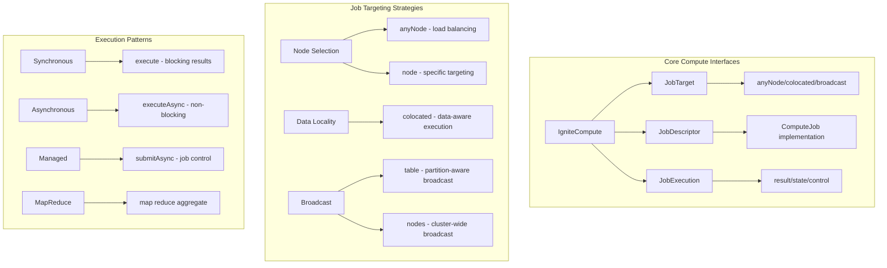

# Chapter 4.3: Compute API for Distributed Processing

## Learning Objectives

By completing this chapter, you will:

- Implement distributed job execution with data locality awareness
- Master job targeting strategies for optimal performance
- Apply MapReduce patterns for large-scale analytics
- Handle asynchronous job execution and result aggregation

## Working with the Reference Application

The **`07-compute-api-app`** demonstrates all Compute API patterns covered in this chapter with sophisticated music analytics examples. Run it alongside your learning to see distributed job execution, data locality patterns, and result aggregation in action.

**Quick Start**: After reading this chapter, explore the reference application:

```bash
cd ignite3-reference-apps/07-compute-api-app
mvn compile exec:java
```

The reference app shows how the data consistency from [Chapter 4.1](01-transaction-fundamentals.md) enables reliable distributed processing workflows, building on the schema and data access patterns from previous modules.

## Overview: Compute API Architecture

> [!NOTE]
> **Distributed Processing**: The Compute API enables running code directly on cluster nodes where your data resides, eliminating data movement and enabling massive parallel processing capabilities.

The Compute API provides a framework for executing code across cluster nodes with sophisticated targeting and result management:



**Key Design Principles:**

- **Data Locality**: Jobs execute where data resides, minimizing network overhead
- **Multiple Targeting**: From specific nodes to intelligent data-aware placement
- **Result Management**: Synchronous, asynchronous, and job control patterns
- **Type Safety**: Strong typing for job inputs, outputs, and execution context

## Job Submission Patterns

### Basic Job Execution

The fundamental pattern involves creating a job descriptor and selecting an execution target:

```java
import org.apache.ignite.compute.ComputeJob;
import org.apache.ignite.compute.JobExecutionContext;
import org.apache.ignite.compute.BroadcastJobTarget;
import org.apache.ignite.sql.IgniteSql;
import org.apache.ignite.sql.ResultSet;
import org.apache.ignite.sql.SqlRow;

// Job that calculates total duration for a set of track IDs
public class TrackDurationJob implements ComputeJob<List<Integer>, Double> {
    @Override
    public CompletableFuture<Double> executeAsync(JobExecutionContext context, List<Integer> trackIds) {
        return CompletableFuture.supplyAsync(() -> {
            // Access Ignite APIs within the job execution context
            IgniteSql sql = context.ignite().sql();
            
            double totalDuration = 0.0;
            for (Integer trackId : trackIds) {
                try (ResultSet<SqlRow> rs = sql.execute(null, 
                    "SELECT Milliseconds FROM Track WHERE TrackId = ?", trackId)) {
                    
                    if (rs.hasNext()) {
                        SqlRow row = rs.next();
                        totalDuration += row.doubleValue("Milliseconds") / 60000.0; // Convert to minutes
                    }
                }
            }
            
            return totalDuration;
        });
    }
}

// Required imports for job submission
import org.apache.ignite.client.IgniteClient;
import org.apache.ignite.compute.JobDescriptor;
import org.apache.ignite.compute.JobTarget;

// Connect to Ignite cluster and submit job
try (IgniteClient ignite = IgniteClient.builder()
        .addresses("localhost:10800")
        .build()) {
    
    // Submit job to any available node
    JobDescriptor<List<Integer>, Double> job = JobDescriptor.builder(TrackDurationJob.class).build();
    JobTarget target = JobTarget.anyNode(ignite.clusterNodes());
    List<Integer> trackIds = Arrays.asList(1, 2, 3, 4, 5);

    Double totalDuration = ignite.compute().execute(target, job, trackIds);
    System.out.println("Total track duration: " + totalDuration + " minutes");
}
```

**Key Concepts:**

- **ComputeJob Interface**: Your job implements `ComputeJob<InputType, OutputType>`
- **JobExecutionContext**: Provides access to the full Ignite API within the job
- **Type Safety**: Strong typing ensures compile-time correctness for inputs and outputs
- **Resource Access**: Jobs can execute SQL queries, access tables, and use other Ignite features

### Job Targeting Strategies

#### Any Node Execution

For compute work that doesn't depend on specific data location:

```java
// CPU-intensive job that doesn't require data access
public class AlbumNameAnalysisJob implements ComputeJob<List<String>, Map<String, Integer>> {
    @Override
    public CompletableFuture<Map<String, Integer>> executeAsync(
            JobExecutionContext context, List<String> albumTitles) {
        
        return CompletableFuture.supplyAsync(() -> {
            Map<String, Integer> analysis = new HashMap<>();
            
            for (String title : albumTitles) {
                // Word count analysis (CPU-intensive, no data access needed)
                String[] words = title.toLowerCase().split("\\s+");
                analysis.put(title, words.length);
            }
            
            return analysis;
        });
    }
}

// Execute on any available node for optimal load distribution
JobTarget target = JobTarget.anyNode(ignite.clusterNodes());
List<String> albums = Arrays.asList("Back in Black", "The Dark Side of the Moon", "Hotel California");
Map<String, Integer> analysis = ignite.compute().execute(target, job, albums);
```

#### Specific Node Targeting

When you need to target nodes with specific characteristics:

```java
// Target nodes based on resource availability or node characteristics
Set<ClusterNode> computeNodes = ignite.clusterNodes().stream()
    .filter(node -> node.name().startsWith("compute-"))
    .collect(Collectors.toSet());

if (!computeNodes.isEmpty()) {
    JobTarget target = JobTarget.anyNode(computeNodes);
    String result = ignite.compute().execute(target, job, inputData);
}

// Target a specific node by name or ID
Optional<ClusterNode> specificNode = ignite.clusterNodes().stream()
    .filter(node -> node.name().equals("worker-node-01"))
    .findFirst();

if (specificNode.isPresent()) {
    JobTarget target = JobTarget.node(specificNode.get());
    String result = ignite.compute().execute(target, job, inputData);
}
```

## Data Locality and Colocation

### Colocated Job Execution

The most powerful feature of Ignite 3's Compute API is data-aware job placement. Jobs execute on nodes where the relevant data resides:

```java
// Job that analyzes sales data for a specific artist
public class ArtistSalesAnalysisJob implements ComputeJob<Integer, ArtistSalesReport> {
    @Override
    public CompletableFuture<ArtistSalesReport> executeAsync(
            JobExecutionContext context, Integer artistId) {
        
        return CompletableFuture.supplyAsync(() -> {
            IgniteSql sql = context.ignite().sql();
            
            // This query executes locally since the job runs where Artist data is colocated
            String salesQuery = """
                SELECT al.Title, COUNT(il.TrackId) as TracksSold, SUM(il.UnitPrice * il.Quantity) as Revenue
                FROM Artist ar
                JOIN Album al ON ar.ArtistId = al.ArtistId  
                JOIN Track t ON al.AlbumId = t.AlbumId
                JOIN InvoiceLine il ON t.TrackId = il.TrackId
                WHERE ar.ArtistId = ?
                GROUP BY al.AlbumId, al.Title
                ORDER BY Revenue DESC
                """;
            
            List<AlbumSales> albumSales = new ArrayList<>();
            try (ResultSet<SqlRow> rs = sql.execute(null, salesQuery, artistId)) {
                while (rs.hasNext()) {
                    SqlRow row = rs.next();
                    albumSales.add(new AlbumSales(
                        row.stringValue("Title"),
                        row.intValue("TracksSold"), 
                        row.doubleValue("Revenue")
                    ));
                }
            }
            
            // Get artist name
            String artistName = "Unknown Artist";
            try (ResultSet<SqlRow> rs = sql.execute(null, 
                "SELECT Name FROM Artist WHERE ArtistId = ?", artistId)) {
                if (rs.hasNext()) {
                    artistName = rs.next().stringValue("Name");
                }
            }
            
            return new ArtistSalesReport(artistId, artistName, albumSales);
        });
    }
}

// Required import for colocation
import org.apache.ignite.table.Tuple;

// Execute job on the node where Artist data with ArtistId=1 resides
JobTarget colocatedTarget = JobTarget.colocated("Artist", 
    Tuple.create().set("ArtistId", 1));

ArtistSalesReport report = ignite.compute().execute(colocatedTarget, job, 1);
System.out.println("Sales report for " + report.getArtistName() + 
    ": " + report.getTotalRevenue() + " total revenue");
```

**Data Locality Benefits:**

- **Network Efficiency**: Data doesn't cross network boundaries for processing
- **Performance**: Local data access is orders of magnitude faster than remote
- **Scalability**: Work scales with data distribution across the cluster

### Broadcast Execution Patterns

When you need to execute jobs across all nodes or all data partitions:

```java
// Job that calculates local statistics on each node
public class LocalTrackStatsJob implements ComputeJob<Void, TrackStatistics> {
    @Override
    public CompletableFuture<TrackStatistics> executeAsync(
            JobExecutionContext context, Void input) {
        
        return CompletableFuture.supplyAsync(() -> {
            IgniteSql sql = context.ignite().sql();
            
            // Each node calculates statistics for its local track data
            try (ResultSet<SqlRow> rs = sql.execute(null, """
                SELECT COUNT(*) as TrackCount, 
                       AVG(Milliseconds) as AvgDuration,
                       MIN(Milliseconds) as MinDuration,
                       MAX(Milliseconds) as MaxDuration
                FROM Track
                """)) {
                
                if (rs.hasNext()) {
                    SqlRow row = rs.next();
                    return new TrackStatistics(
                        row.intValue("TrackCount"),
                        row.doubleValue("AvgDuration"),
                        row.intValue("MinDuration"),
                        row.intValue("MaxDuration")
                    );
                }
            }
            
            return new TrackStatistics(0, 0.0, 0, 0);
        });
    }
}

// Execute on all nodes to gather comprehensive statistics
BroadcastJobTarget broadcastTarget = BroadcastJobTarget.nodes(ignite.clusterNodes());
Collection<TrackStatistics> nodeStats = ignite.compute().execute(broadcastTarget, job, null);

// Aggregate statistics from all nodes
TrackStatistics globalStats = nodeStats.stream()
    .reduce(new TrackStatistics(0, 0.0, Integer.MAX_VALUE, Integer.MIN_VALUE),
            TrackStatistics::merge);

System.out.println("Global track statistics: " + globalStats);
```

**Broadcast Patterns:**

- **Cluster-wide Operations**: Execute on all cluster nodes
- **Partition-aware Broadcast**: Execute on nodes that hold specific table data
- **Result Aggregation**: Collect and combine results from multiple executions

## Asynchronous Execution and Job Control

### Non-blocking Job Execution

For applications that can't afford to block on job execution:

```java
// Submit multiple analysis jobs asynchronously
List<Integer> artistIds = Arrays.asList(1, 2, 3, 4, 5);
List<CompletableFuture<ArtistSalesReport>> futures = new ArrayList<>();

for (Integer artistId : artistIds) {
    JobTarget target = JobTarget.colocated("Artist", 
        Tuple.create().set("ArtistId", artistId));
    
    CompletableFuture<ArtistSalesReport> future = ignite.compute()
        .executeAsync(target, salesAnalysisJob, artistId);
    
    futures.add(future);
}

// Process results as they complete
CompletableFuture<Void> allComplete = CompletableFuture.allOf(
    futures.toArray(new CompletableFuture[0]));

allComplete.thenRun(() -> {
    List<ArtistSalesReport> reports = futures.stream()
        .map(CompletableFuture::join)
        .collect(Collectors.toList());
    
    // Process all completed reports
    reports.forEach(report -> 
        System.out.println(report.getArtistName() + ": " + report.getTotalRevenue()));
});
```

### Job Execution Management

For long-running jobs that require monitoring and control:

```java
// Required imports for job control
import org.apache.ignite.compute.JobExecution;
import org.apache.ignite.compute.JobState;

// Submit job with execution control
CompletableFuture<JobExecution<String>> executionFuture = ignite.compute()
    .submitAsync(target, longRunningJob, inputData);

JobExecution<String> execution = executionFuture.get();

// Monitor job state
CompletableFuture<JobState> stateFuture = execution.stateAsync();
stateFuture.thenAccept(state -> {
    System.out.println("Job state: " + state.status());
    System.out.println("Job ID: " + state.id());
    System.out.println("Create time: " + state.createTime());
});

// Get result when job completes
CompletableFuture<String> resultFuture = execution.resultAsync();
resultFuture.thenAccept(result -> {
    System.out.println("Job completed with result: " + result);
});

// Cancel job if needed
// execution.cancel(); // Implementation depends on job design
```

**Job Control Features:**

- **State Monitoring**: Track job progress and status
- **Result Management**: Handle results when jobs complete
- **Execution Context**: Access job metadata and execution details

## MapReduce Patterns

### Distributed Analytics with Map-Reduce

For complex analytics that require map-reduce style processing:

```java
// Map phase: Analyze tracks by genre on each node
public class GenreAnalysisMapJob implements ComputeJob<Void, Map<String, GenreStats>> {
    @Override
    public CompletableFuture<Map<String, GenreStats>> executeAsync(
            JobExecutionContext context, Void input) {
        
        return CompletableFuture.supplyAsync(() -> {
            IgniteSql sql = context.ignite().sql();
            Map<String, GenreStats> genreStats = new HashMap<>();
            
            try (ResultSet<SqlRow> rs = sql.execute(null, """
                SELECT g.Name as GenreName, 
                       COUNT(t.TrackId) as TrackCount,
                       AVG(t.Milliseconds) as AvgDuration,
                       SUM(COALESCE(il.Quantity, 0)) as TotalSales
                FROM Genre g
                LEFT JOIN Track t ON g.GenreId = t.GenreId
                LEFT JOIN InvoiceLine il ON t.TrackId = il.TrackId
                GROUP BY g.GenreId, g.Name
                """)) {
                
                while (rs.hasNext()) {
                    SqlRow row = rs.next();
                    String genreName = row.stringValue("GenreName");
                    genreStats.put(genreName, new GenreStats(
                        row.intValue("TrackCount"),
                        row.doubleValue("AvgDuration"),
                        row.intValue("TotalSales")
                    ));
                }
            }
            
            return genreStats;
        });
    }
}

// Execute map jobs across all nodes
BroadcastJobTarget target = BroadcastJobTarget.nodes(ignite.clusterNodes());
Collection<Map<String, GenreStats>> mapResults = ignite.compute()
    .execute(target, mapJob, null);

// Reduce phase: Aggregate results from all nodes
Map<String, GenreStats> globalGenreStats = new HashMap<>();
for (Map<String, GenreStats> nodeResult : mapResults) {
    nodeResult.forEach((genre, stats) -> 
        globalGenreStats.merge(genre, stats, GenreStats::merge));
}

// Display aggregated results
globalGenreStats.entrySet().stream()
    .sorted(Map.Entry.<String, GenreStats>comparingByValue(
        Comparator.comparing(GenreStats::getTotalSales)).reversed())
    .forEach(entry -> System.out.println(
        entry.getKey() + ": " + entry.getValue().getTotalSales() + " total sales"));
```

### Advanced Processing Patterns

```java
// Complex recommendation engine using distributed processing
public class RecommendationEngineJob implements ComputeJob<Integer, List<Recommendation>> {
    @Override
    public CompletableFuture<List<Recommendation>> executeAsync(
            JobExecutionContext context, Integer customerId) {
        
        return CompletableFuture.supplyAsync(() -> {
            IgniteSql sql = context.ignite().sql();
            List<Recommendation> recommendations = new ArrayList<>();
            
            // Step 1: Analyze customer's purchase history
            Map<String, Integer> genrePreferences = analyzeGenrePreferences(sql, customerId);
            
            // Step 2: Find similar customers based on genre preferences
            List<Integer> similarCustomers = findSimilarCustomers(sql, genrePreferences);
            
            // Step 3: Recommend tracks purchased by similar customers
            recommendations = generateRecommendations(sql, customerId, similarCustomers);
            
            return recommendations;
        });
    }
    
    private Map<String, Integer> analyzeGenrePreferences(IgniteSql sql, Integer customerId) {
        Map<String, Integer> preferences = new HashMap<>();
        
        try (ResultSet<SqlRow> rs = sql.execute(null, """
            SELECT g.Name, COUNT(*) as PurchaseCount
            FROM Invoice i
            JOIN InvoiceLine il ON i.InvoiceId = il.InvoiceId
            JOIN Track t ON il.TrackId = t.TrackId
            JOIN Genre g ON t.GenreId = g.GenreId
            WHERE i.CustomerId = ?
            GROUP BY g.GenreId, g.Name
            ORDER BY PurchaseCount DESC
            """, customerId)) {
            
            while (rs.hasNext()) {
                SqlRow row = rs.next();
                preferences.put(row.stringValue("Name"), row.intValue("PurchaseCount"));
            }
        }
        
        return preferences;
    }
    
    private List<Integer> findSimilarCustomers(IgniteSql sql, Map<String, Integer> genrePreferences) {
        // Simplified similarity algorithm - in practice would use more sophisticated ML
        List<Integer> similarCustomers = new ArrayList<>();
        
        for (String genre : genrePreferences.keySet()) {
            try (ResultSet<SqlRow> rs = sql.execute(null, """
                SELECT DISTINCT i.CustomerId
                FROM Invoice i
                JOIN InvoiceLine il ON i.InvoiceId = il.InvoiceId
                JOIN Track t ON il.TrackId = t.TrackId
                JOIN Genre g ON t.GenreId = g.GenreId
                WHERE g.Name = ?
                LIMIT 10
                """, genre)) {
                
                while (rs.hasNext()) {
                    similarCustomers.add(rs.next().intValue("CustomerId"));
                }
            }
        }
        
        return similarCustomers.stream().distinct().collect(Collectors.toList());
    }
    
    private List<Recommendation> generateRecommendations(
            IgniteSql sql, Integer customerId, List<Integer> similarCustomers) {
        
        List<Recommendation> recommendations = new ArrayList<>();
        
        if (!similarCustomers.isEmpty()) {
            String customerList = similarCustomers.stream()
                .map(String::valueOf)
                .collect(Collectors.joining(","));
            
            try (ResultSet<SqlRow> rs = sql.execute(null, """
                SELECT t.TrackId, t.Name, ar.Name as ArtistName, 
                       COUNT(*) as PopularityScore
                FROM Track t
                JOIN Album al ON t.AlbumId = al.AlbumId
                JOIN Artist ar ON al.ArtistId = ar.ArtistId
                JOIN InvoiceLine il ON t.TrackId = il.TrackId
                JOIN Invoice i ON il.InvoiceId = i.InvoiceId
                WHERE i.CustomerId IN (""" + customerList + """)
                AND t.TrackId NOT IN (
                    SELECT t2.TrackId FROM Track t2
                    JOIN InvoiceLine il2 ON t2.TrackId = il2.TrackId
                    JOIN Invoice i2 ON il2.InvoiceId = i2.InvoiceId
                    WHERE i2.CustomerId = ?
                )
                GROUP BY t.TrackId, t.Name, ar.Name
                ORDER BY PopularityScore DESC
                LIMIT 20
                """, customerId)) {
                
                while (rs.hasNext()) {
                    SqlRow row = rs.next();
                    recommendations.add(new Recommendation(
                        row.intValue("TrackId"),
                        row.stringValue("Name"),
                        row.stringValue("ArtistName"),
                        row.intValue("PopularityScore")
                    ));
                }
            }
        }
        
        return recommendations;
    }
}

// Execute recommendation job colocated with customer data
JobTarget target = JobTarget.colocated("Customer", 
    Tuple.create().set("CustomerId", customerId));

List<Recommendation> recommendations = ignite.compute()
    .execute(target, recommendationJob, customerId);

System.out.println("Recommendations for customer " + customerId + ":");
recommendations.forEach(rec -> 
    System.out.println("  " + rec.getTrackName() + " by " + rec.getArtistName()));
```

## Error Handling and Fault Tolerance

### Job Failure Handling

```java
public class RobustComputeService {
    
    public <T> CompletableFuture<T> executeWithRetry(
            IgniteClient ignite, 
            JobTarget target, 
            ComputeJob<?, T> job, 
            Object input,
            int maxRetries) {
        
        return executeWithRetryInternal(ignite, target, job, input, maxRetries, 0);
    }
    
    private <T> CompletableFuture<T> executeWithRetryInternal(
            IgniteClient ignite,
            JobTarget target,
            ComputeJob<?, T> job,
            Object input,
            int maxRetries,
            int currentAttempt) {
        
        JobDescriptor<Object, T> descriptor = JobDescriptor.builder(job.getClass()).build();
        
        return ignite.compute().executeAsync(target, descriptor, input)
            .exceptionallyCompose(throwable -> {
                if (currentAttempt >= maxRetries) {
                    return CompletableFuture.failedFuture(throwable);
                }
                
                if (isRetryableException(throwable)) {
                    long delay = calculateBackoffDelay(currentAttempt);
                    
                    return CompletableFuture
                        .delayedExecutor(delay, TimeUnit.MILLISECONDS)
                        .thenCompose(ignored -> 
                            executeWithRetryInternal(ignite, target, job, input, maxRetries, currentAttempt + 1));
                } else {
                    return CompletableFuture.failedFuture(throwable);
                }
            });
    }
    
    private boolean isRetryableException(Throwable throwable) {
        return throwable.getMessage().contains("node unavailable") ||
               throwable.getMessage().contains("timeout") ||
               throwable.getMessage().contains("connection");
    }
    
    private long calculateBackoffDelay(int attempt) {
        long baseDelay = 1000; // 1 second
        return Math.min(baseDelay * (long) Math.pow(2, attempt), 30000); // Max 30 seconds
    }
}
```

## Helper Classes for Examples

```java
// Supporting classes for the examples above
class ArtistSalesReport {
    private Integer artistId;
    private String artistName;
    private List<AlbumSales> albumSales;
    private double totalRevenue;
    
    public ArtistSalesReport(Integer artistId, String artistName, List<AlbumSales> albumSales) {
        this.artistId = artistId;
        this.artistName = artistName;
        this.albumSales = albumSales;
        this.totalRevenue = albumSales.stream().mapToDouble(AlbumSales::getRevenue).sum();
    }
    
    // Getters...
}

class AlbumSales {
    private String title;
    private int tracksSold;
    private double revenue;
    
    public AlbumSales(String title, int tracksSold, double revenue) {
        this.title = title;
        this.tracksSold = tracksSold;
        this.revenue = revenue;
    }
    
    // Getters...
}

class TrackStatistics {
    private int trackCount;
    private double avgDuration;
    private int minDuration;
    private int maxDuration;
    
    public TrackStatistics(int trackCount, double avgDuration, int minDuration, int maxDuration) {
        this.trackCount = trackCount;
        this.avgDuration = avgDuration;
        this.minDuration = minDuration;
        this.maxDuration = maxDuration;
    }
    
    public static TrackStatistics merge(TrackStatistics a, TrackStatistics b) {
        return new TrackStatistics(
            a.trackCount + b.trackCount,
            (a.avgDuration * a.trackCount + b.avgDuration * b.trackCount) / (a.trackCount + b.trackCount),
            Math.min(a.minDuration, b.minDuration),
            Math.max(a.maxDuration, b.maxDuration)
        );
    }
    
    // Getters...
}

class GenreStats {
    private int trackCount;
    private double avgDuration;
    private int totalSales;
    
    public GenreStats(int trackCount, double avgDuration, int totalSales) {
        this.trackCount = trackCount;
        this.avgDuration = avgDuration;
        this.totalSales = totalSales;
    }
    
    public static GenreStats merge(GenreStats a, GenreStats b) {
        return new GenreStats(
            a.trackCount + b.trackCount,
            (a.avgDuration * a.trackCount + b.avgDuration * b.trackCount) / (a.trackCount + b.trackCount),
            a.totalSales + b.totalSales
        );
    }
    
    // Getters...
}

class Recommendation {
    private Integer trackId;
    private String trackName;
    private String artistName;
    private int popularityScore;
    
    public Recommendation(Integer trackId, String trackName, String artistName, int popularityScore) {
        this.trackId = trackId;
        this.trackName = trackName;
        this.artistName = artistName;
        this.popularityScore = popularityScore;
    }
    
    // Getters...
}
```

The Compute API transforms single-node processing limitations into distributed intelligence, enabling analytics and processing that scales with your data across the cluster while maintaining the performance benefits of data locality.

## Module Conclusion

You've now mastered the complete distributed operations foundation in Ignite 3, from ACID transactions through advanced patterns to distributed processing. This prepares you for the performance and scalability patterns covered in the remaining modules.

- **Continue Learning**: **[Module 5: Performance and Scalability](../05-performance-scalability/01-data-streaming.md)** - Apply your distributed operations knowledge to master high-throughput data ingestion, caching strategies, and performance optimization techniques
