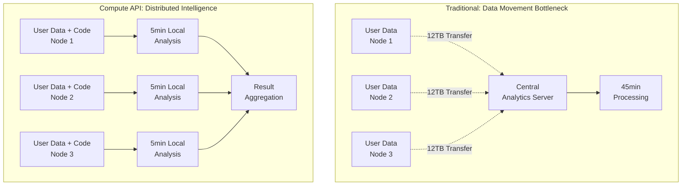
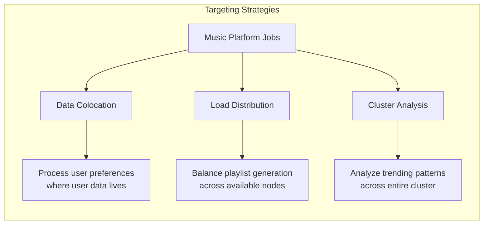
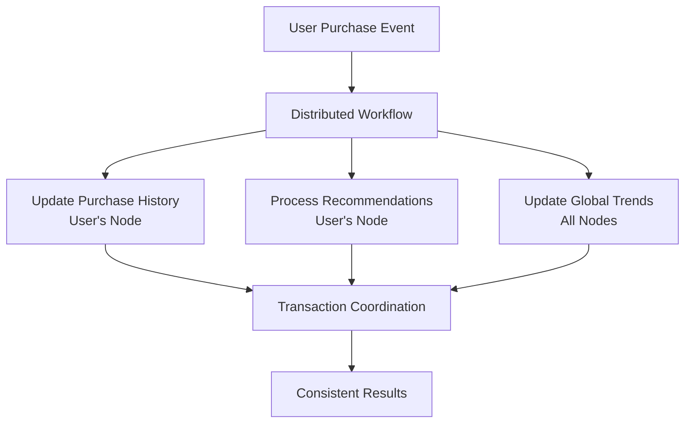

# Chapter 4.3: Distributed Computing for Music Intelligence

Your music streaming platform processes recommendations for 2.5 million users nightly. The current approach pulls user profiles, listening histories, and artist data from distributed storage nodes to central processing servers for analysis. This creates a data pipeline nightmare: 12TB of nightly transfers saturate your network, recommendation processing takes 45 minutes instead of the target 5 minutes, and the centralized bottleneck delays marketing campaigns and playlist updates.

During Grammy night's traffic spike, your system crashes when recommendation processing collides with live streaming traffic. Users receive stale playlists, trending algorithms work with hour-old data, and your competitive advantage evaporates as users switch to faster platforms.

The root problem: traditional architectures move massive datasets to where computation happens, rather than bringing lightweight computation to where data already lives.

## From Data Movement to Computation Movement

Traditional batch processing creates cascading bottlenecks across your infrastructure:

**The Data Pipeline Crisis:** Every recommendation cycle requires transferring complete user profiles, listening histories, and artist catalogs to centralized processing servers. A 2.5M user analysis moves 12TB of data across your network before computation even begins.

**Network Saturation:** Data movement competes with live streaming traffic for bandwidth. During peak periods, recommendation transfers delay music delivery to active users, creating the exact problem your platform exists to solve.

**Processing Delays:** Centralized servers become the limiting factor. No matter how much data storage capacity you add, computation remains stuck on dedicated processing hardware that can't scale with your distributed storage infrastructure.

**Resource Waste:** Your storage nodes sit idle with massive compute capacity while dedicated processing servers struggle with overwhelming data volumes.

**Operational Complexity:** Managing separate storage and compute clusters doubles your operational overhead, deployment complexity, and failure modes.

Ignite 3's Compute API eliminates these problems by executing your business logic directly on the nodes where data already resides. Instead of moving terabytes to computation, you move kilobytes of code to data.

## How Ignite 3 Compute API Solves Distributed Processing

The Compute API transforms your music platform's architecture by implementing three fundamental shifts that eliminate traditional batch processing bottlenecks:

**Computation Locality:** Instead of pulling user data to central servers, recommendation algorithms execute directly on the storage nodes where user profiles, listening histories, and artist catalogs already reside. A 12TB data movement operation becomes a 50KB code deployment.

**Distributed Parallelism:** Your recommendation analysis spreads across all cluster nodes simultaneously. What took 45 minutes on centralized servers completes in 5 minutes using the distributed computing power of your entire storage infrastructure.

**Network Efficiency:** Live music streaming and recommendation processing no longer compete for bandwidth. Background analytics run locally on each node while serving real-time user requests without interference.

This architectural shift eliminates the centralized bottleneck while transforming idle storage nodes into active participants in your platform's intelligence operations.

## Working with the Reference Application

The **`07-compute-api-app`** demonstrates how to transform centralized batch processing into distributed intelligence using realistic music analytics scenarios:

```bash
cd ignite3-reference-apps/07-compute-api-app
mvn compile exec:java
```

The reference application showcases the complete journey from basic job execution to production-scale recommendation processing:

- **BasicComputeOperations** - Foundation patterns for distributed job execution and parameterized processing
- **AdvancedComputeOperations** - Data locality optimization and cluster-wide broadcast operations  
- **ComputeJobWorkflows** - Multi-step recommendation pipelines and business process automation
- **ProductionComputePatterns** - Large-scale user analysis, resilience patterns, and performance monitoring

The reference app integrates with the transaction patterns from [Chapter 4.1](01-transaction-fundamentals.md) to ensure data consistency during distributed processing workflows.

## Music Platform Intelligence Architecture

The Compute API enables three distinct intelligence patterns that solve different aspects of your music platform's distributed processing requirements:

### Recommendation Engine Transformation

Traditional recommendation systems create bottlenecks by centralizing all user analysis. The Compute API distributes this intelligence across your cluster:



**Key Benefits:**
- Network transfers reduced from 12TB to 50KB (recommendation algorithm deployment)
- Processing time drops from 45 minutes to 5 minutes through parallel execution
- Live streaming traffic no longer competes with analytics for bandwidth

### Job Targeting for Music Analytics

The Compute API provides three targeting strategies that optimize different aspects of music platform operations:



**Data Colocation:** User recommendation jobs execute on nodes containing user profiles and listening histories, eliminating cross-network data access during analysis.

**Load Distribution:** Playlist generation and content processing distribute across available cluster resources, preventing hotspots during peak traffic periods.

**Cluster Analysis:** Trending music detection and global analytics broadcast across all nodes to gather comprehensive platform insights without centralized data collection.

### Processing Workflow Integration

Your music platform requires coordinated workflows that span multiple business operations. The Compute API integrates with Ignite's transaction system to ensure consistency:



This integration ensures that recommendation updates, purchase processing, and analytics coordination maintain data consistency while leveraging distributed processing power.

## From Centralized Analytics to Distributed Intelligence

Your music platform's transformation from centralized processing to distributed intelligence follows a progression of increasingly sophisticated patterns. Start with basic job execution to understand the fundamentals, then advance to data locality optimization and multi-node coordination.

## Basic Job Execution: Your First Distributed Algorithm

Consider your platform's artist popularity analysis. Instead of pulling all artist data to central servers, you can execute the analysis algorithm directly on cluster nodes. This transforms a data-intensive operation into a code-deployment operation:

### From Data Movement to Code Movement

**Traditional Centralized Approach:**
```java
// Pull artist data from distributed storage (network intensive)
List<Artist> allArtists = centralDatabase.executeQuery("SELECT * FROM Artist");
// Process locally (single-threaded bottleneck)
Map<String, Integer> popularity = analyzePopularity(allArtists);
```

**Compute API Distributed Approach:**
```java
import org.apache.ignite.client.IgniteClient;
import org.apache.ignite.compute.*;

// Step 1: Create your analysis as a distributed job
public class ArtistPopularityJob implements ComputeJob<Void, Map<String, Integer>> {
    @Override
    public CompletableFuture<Map<String, Integer>> executeAsync(JobExecutionContext context, Void input) {
        return CompletableFuture.supplyAsync(() -> {
            // Execute analysis using local data on this node
            IgniteSql sql = context.ignite().sql();
            Statement stmt = sql.statementBuilder()
                .query("SELECT a.Name, COUNT(*) as play_count " +
                       "FROM Artist a JOIN Album al ON a.ArtistId = al.ArtistId " +
                       "JOIN Track t ON al.AlbumId = t.AlbumId " + 
                       "JOIN InvoiceLine il ON t.TrackId = il.TrackId " +
                       "GROUP BY a.ArtistId, a.Name")
                .build();
            
            Map<String, Integer> localPopularity = new HashMap<>();
            try (ResultSet<SqlRow> rs = sql.execute(null, stmt)) {
                while (rs.hasNext()) {
                    SqlRow row = rs.next();
                    localPopularity.put(row.stringValue("Name"), row.intValue("play_count"));
                }
            }
            return localPopularity;
        });
    }
}

// Step 2: Execute analysis across your cluster
try (IgniteClient client = IgniteClient.builder()
        .addresses("node1:10800", "node2:10800", "node3:10800")
        .build()) {
    
    // Deploy your algorithm to any available node
    JobDescriptor<Void, Map<String, Integer>> job = 
        JobDescriptor.builder(ArtistPopularityJob.class).build();
    JobTarget target = JobTarget.anyNode(client.clusterNodes());
    
    // Execute analysis where data lives
    Map<String, Integer> results = client.compute().execute(target, job, null);
    
    // Process results
    results.entrySet().stream()
        .sorted(Map.Entry.<String, Integer>comparingByValue().reversed())
        .limit(10)
        .forEach(entry -> 
            System.out.println(entry.getKey() + ": " + entry.getValue() + " plays"));
}
```

**The Fundamental Shift:**
- **Data Movement Eliminated:** No network transfers of artist data
- **Parallel Processing:** Multiple nodes can run the same analysis simultaneously
- **Resource Efficiency:** Computation uses local storage node resources
- **Network Optimization:** Only algorithm code and results traverse the network

## Data Locality: Processing Where Data Lives

The real power of distributed computing emerges when you eliminate network hops by processing data exactly where it resides. Your music platform's user recommendation system provides the perfect example of this optimization.

### User-Specific Recommendation Processing

Traditional systems pull user profiles across the network for centralized analysis. The Compute API processes recommendations locally on nodes containing user data:

```java
public class UserRecommendationJob implements ComputeJob<Integer, List<String>> {
    @Override
    public CompletableFuture<List<String>> executeAsync(JobExecutionContext context, Integer customerId) {
        return CompletableFuture.supplyAsync(() -> {
            IgniteSql sql = context.ignite().sql();
            
            // Analyze local user listening patterns (no network access required)
            Statement stmt = sql.statementBuilder()
                .query("SELECT DISTINCT g.Name as genre " +
                       "FROM Customer c " +
                       "JOIN Invoice i ON c.CustomerId = i.CustomerId " +
                       "JOIN InvoiceLine il ON i.InvoiceId = il.InvoiceId " +
                       "JOIN Track t ON il.TrackId = t.TrackId " +
                       "JOIN Genre g ON t.GenreId = g.GenreId " +
                       "WHERE c.CustomerId = ? " +
                       "GROUP BY g.GenreId, g.Name " +
                       "ORDER BY COUNT(*) DESC LIMIT 3")
                .build();
            
            List<String> preferredGenres = new ArrayList<>();
            try (ResultSet<SqlRow> rs = sql.execute(null, stmt, customerId)) {
                while (rs.hasNext()) {
                    preferredGenres.add(rs.next().stringValue("genre"));
                }
            }
            
            return preferredGenres.isEmpty() ? 
                List.of("Rock", "Pop", "Jazz") : // Default recommendations
                preferredGenres;
        });
    }
}

// Execute recommendation processing on the node containing user data
Tuple userKey = Tuple.create(Map.of("CustomerId", customerId));
JobTarget target = JobTarget.colocated("Customer", userKey);

List<String> recommendations = client.compute().execute(target, 
    JobDescriptor.builder(UserRecommendationJob.class).build(), customerId);
```

**Data Locality Benefits:**
- **Zero Network Latency:** User data processing happens locally without cross-node queries
- **Concurrent Processing:** Multiple users' recommendations generate simultaneously on different nodes
- **Resource Distribution:** CPU and memory load spreads across all storage nodes
- **Scalability:** Adding storage nodes automatically increases recommendation processing capacity

## Job Targeting Strategies for Music Analytics

Your music platform requires three distinct job targeting strategies, each optimized for different analytics scenarios:

### Load-Balanced Processing: Any Node Execution

When your algorithm doesn't depend on specific data location, distribute work across available cluster resources for optimal load balancing:

```java
public class PlaylistGenerationJob implements ComputeJob<String, List<String>> {
    @Override
    public CompletableFuture<List<String>> executeAsync(JobExecutionContext context, String genre) {
        return CompletableFuture.supplyAsync(() -> {
            // CPU-intensive algorithm that works with any data subset
            return generateRandomPlaylist(genre, 20);
        });
    }
}

// Let Ignite choose the best available node
JobTarget target = JobTarget.anyNode(client.clusterNodes());
List<String> playlist = client.compute().execute(target, 
    JobDescriptor.builder(PlaylistGenerationJob.class).build(), "Rock");
```

**Use Case:** Playlist generation, content ranking algorithms, format conversions

### Data-Aware Processing: Colocated Execution

When algorithms must access specific data, target jobs to nodes containing that data:

```java
// Process artist analytics where artist data lives
Tuple artistKey = Tuple.create(Map.of("ArtistId", artistId));
JobTarget target = JobTarget.colocated("Artist", artistKey);

// Analysis executes locally without network data access
String insights = client.compute().execute(target, artistAnalysisJob, artistId);
```

**Use Case:** User recommendations, artist analysis, purchase history processing

### Cluster-Wide Intelligence: Broadcast Processing

When you need comprehensive platform insights, execute the same analysis across all nodes:

```java
public class GlobalTrendAnalysisJob implements ComputeJob<Void, Map<String, Integer>> {
    @Override
    public CompletableFuture<Map<String, Integer>> executeAsync(JobExecutionContext context, Void input) {
        return CompletableFuture.supplyAsync(() -> {
            // Analyze trends using local data on this node
            IgniteSql sql = context.ignite().sql();
            Statement stmt = sql.statementBuilder()
                .query("SELECT g.Name, COUNT(*) as local_plays " +
                       "FROM Genre g JOIN Track t ON g.GenreId = t.GenreId " +
                       "JOIN InvoiceLine il ON t.TrackId = il.TrackId " +
                       "WHERE il.InvoiceDate >= CURRENT_DATE - 7 " +
                       "GROUP BY g.GenreId, g.Name")
                .build();
            
            Map<String, Integer> localTrends = new HashMap<>();
            try (ResultSet<SqlRow> rs = sql.execute(null, stmt)) {
                while (rs.hasNext()) {
                    SqlRow row = rs.next();
                    localTrends.put(row.stringValue("Name"), row.intValue("local_plays"));
                }
            }
            return localTrends;
        });
    }
}

// Execute on all nodes to gather comprehensive trends
Collection<ClusterNode> allNodes = client.clusterNodes();
JobTarget broadcastTarget = JobTarget.nodes(allNodes);

// Aggregate results from all nodes
Map<String, Integer> globalTrends = new HashMap<>();
Collection<Map<String, Integer>> nodeResults = client.compute()
    .execute(broadcastTarget, 
        JobDescriptor.builder(GlobalTrendAnalysisJob.class).build(), null);

// Combine trends from all nodes
for (Map<String, Integer> nodeResult : nodeResults) {
    nodeResult.forEach((genre, count) -> 
        globalTrends.merge(genre, count, Integer::sum));
}
```

**Use Case:** Trending analysis, platform-wide statistics, health monitoring

## Scaling User Recommendation Processing with Async Patterns

Your music platform serves millions of users who expect instant recommendations when browsing. Traditional synchronous processing creates response time bottlenecks when multiple users request personalized content simultaneously.

### Concurrent User Processing: Non-blocking Execution

Process multiple users' recommendations simultaneously without blocking application threads:

```java
public class DistributedRecommendationProcessor {
    private final IgniteClient client;
    
    public DistributedRecommendationProcessor(IgniteClient client) {
        this.client = client;
    }
    
    // Process recommendations for multiple users concurrently
    public CompletableFuture<Map<Integer, List<String>>> processUserRecommendations(
            List<Integer> userIds) {
        
        // Start all user recommendation jobs in parallel
        List<CompletableFuture<Pair<Integer, List<String>>>> futures = userIds.stream()
            .map(this::processUserRecommendationAsync)
            .collect(Collectors.toList());
        
        // Combine all results when complete
        return CompletableFuture.allOf(futures.toArray(new CompletableFuture[0]))
            .thenApply(ignored -> futures.stream()
                .map(CompletableFuture::join)
                .collect(Collectors.toMap(
                    Pair::getKey,    // userId
                    Pair::getValue   // recommendations
                )));
    }
    
    private CompletableFuture<Pair<Integer, List<String>>> processUserRecommendationAsync(
            Integer userId) {
        
        // Target job to node containing user data
        Tuple userKey = Tuple.create(Map.of("CustomerId", userId));
        JobTarget target = JobTarget.colocated("Customer", userKey);
        
        // Execute recommendation job asynchronously
        return client.compute()
            .executeAsync(target, 
                JobDescriptor.builder(UserRecommendationJob.class).build(), userId)
            .thenApply(recommendations -> new Pair<>(userId, recommendations));
    }
}

// Usage: Process 1000 users' recommendations concurrently
List<Integer> userIds = IntStream.range(1, 1001).boxed().collect(Collectors.toList());

DistributedRecommendationProcessor processor = 
    new DistributedRecommendationProcessor(client);

CompletableFuture<Map<Integer, List<String>>> allRecommendations = 
    processor.processUserRecommendations(userIds);

allRecommendations.thenAccept(results -> {
    System.out.println("Processed recommendations for " + results.size() + " users");
    // Update user interfaces, cache results, trigger notifications
});
```

**Performance Benefits:**
- **Concurrent Processing:** 1000 users processed simultaneously across cluster nodes
- **Resource Efficiency:** No thread blocking while waiting for recommendations
- **Response Time:** Sub-second recommendations instead of sequential processing delays
- **Scalability:** Performance scales with cluster size automatically

### Long-Running Analytics: Job Execution Management

For complex analytics requiring progress monitoring and potential cancellation:

```java
public class AdvancedMusicAnalytics {
    
    // Submit long-running trend analysis with monitoring
    public CompletableFuture<String> analyzePlatformTrends() {
        JobDescriptor<Void, String> trendJob = 
            JobDescriptor.builder(ComprehensiveTrendAnalysisJob.class).build();
        JobTarget target = JobTarget.anyNode(client.clusterNodes());
        
        return client.compute().submitAsync(target, trendJob, null)
            .thenCompose(execution -> {
                // Monitor job progress
                monitorJobProgress(execution);
                
                // Return final result
                return execution.resultAsync();
            });
    }
    
    private void monitorJobProgress(JobExecution<String> execution) {
        // Check job status periodically
        CompletableFuture<Void> monitoring = CompletableFuture.runAsync(() -> {
            while (!execution.stateAsync().join().status().isFinal()) {
                System.out.println("Analytics job running... " + 
                    execution.stateAsync().join().status());
                
                try {
                    Thread.sleep(5000); // Check every 5 seconds
                } catch (InterruptedException e) {
                    Thread.currentThread().interrupt();
                    break;
                }
            }
        });
        
        // Handle completion
        execution.resultAsync().thenAccept(result -> {
            monitoring.cancel(true);
            System.out.println("Analytics completed: " + result);
        });
    }
}
```

## Advanced Pattern: Platform-Wide MapReduce Analytics

Your music platform's most sophisticated intelligence challenge involves analyzing listening patterns across all users to detect emerging trends, viral content, and market shifts. This requires coordinating analysis across every cluster node and aggregating results into actionable insights.

### Music Trend Detection with Distributed MapReduce

```java
public class MusicTrendMapReduceExample {
    
    // Map Phase: Each node analyzes its local data
    public static class TrendMapJob implements ComputeJob<Void, Map<String, Integer>> {
        @Override
        public CompletableFuture<Map<String, Integer>> executeAsync(
                JobExecutionContext context, Void input) {
            return CompletableFuture.supplyAsync(() -> {
                IgniteSql sql = context.ignite().sql();
                
                // Analyze local listening trends from past week
                Statement stmt = sql.statementBuilder()
                    .query("SELECT t.Name, COUNT(*) as plays " +
                           "FROM Track t " +
                           "JOIN InvoiceLine il ON t.TrackId = il.TrackId " +
                           "JOIN Invoice i ON il.InvoiceId = i.InvoiceId " +
                           "WHERE i.InvoiceDate >= CURRENT_DATE - 7 " +
                           "GROUP BY t.TrackId, t.Name " +
                           "HAVING COUNT(*) > 5")  // Filter noise
                    .build();
                
                Map<String, Integer> localTrends = new HashMap<>();
                try (ResultSet<SqlRow> rs = sql.execute(null, stmt)) {
                    while (rs.hasNext()) {
                        SqlRow row = rs.next();
                        localTrends.put(row.stringValue("Name"), row.intValue("plays"));
                    }
                }
                return localTrends;
            });
        }
    }
    
    // Orchestrate MapReduce workflow
    public Map<String, Integer> detectGlobalTrends(IgniteClient client) {
        // Map Phase: Execute trend analysis on all nodes
        Collection<ClusterNode> allNodes = client.clusterNodes();
        JobTarget broadcastTarget = JobTarget.nodes(allNodes);
        JobDescriptor<Void, Map<String, Integer>> mapJob = 
            JobDescriptor.builder(TrendMapJob.class).build();
        
        Collection<Map<String, Integer>> mapResults = 
            client.compute().execute(broadcastTarget, mapJob, null);
        
        // Reduce Phase: Aggregate all node results
        Map<String, Integer> globalTrends = new HashMap<>();
        for (Map<String, Integer> nodeResult : mapResults) {
            nodeResult.forEach((trackName, localPlays) -> 
                globalTrends.merge(trackName, localPlays, Integer::sum));
        }
        
        // Return top trending tracks globally
        return globalTrends.entrySet().stream()
            .sorted(Map.Entry.<String, Integer>comparingByValue().reversed())
            .limit(50)  // Top 50 trending tracks
            .collect(Collectors.toMap(
                Map.Entry::getKey,
                Map.Entry::getValue,
                (e1, e2) -> e1,
                LinkedHashMap::new
            ));
    }
}
```

**MapReduce Benefits for Music Analytics:**
- **Comprehensive Coverage:** Every cluster node contributes local listening data
- **Network Efficiency:** Raw listening data never leaves its node, only aggregated trends transfer
- **Parallel Processing:** All nodes analyze simultaneously instead of sequential processing
- **Scalable Intelligence:** Trend detection accuracy improves with cluster size

## Production-Ready Resilience Patterns

Your music platform operates under demanding SLAs where failed recommendation jobs directly impact user experience. Production deployments require sophisticated error handling and retry logic:

```java
public class ResilientMusicJobProcessor {
    private final IgniteClient client;
    private final int maxRetryAttempts = 3;
    private final Duration initialDelay = Duration.ofSeconds(1);
    
    public ResilientMusicJobProcessor(IgniteClient client) {
        this.client = client;
    }
    
    // Execute jobs with exponential backoff retry
    public <T> CompletableFuture<T> executeWithResilience(
            JobTarget target, JobDescriptor<?, T> job, Object input) {
        
        return executeWithRetryInternal(target, job, input, 0);
    }
    
    private <T> CompletableFuture<T> executeWithRetryInternal(
            JobTarget target, JobDescriptor<?, T> job, Object input, int attempt) {
        
        return client.compute().executeAsync(target, job, input)
            .exceptionallyCompose(throwable -> {
                if (attempt >= maxRetryAttempts) {
                    return CompletableFuture.failedFuture(
                        new RuntimeException("Job failed after " + maxRetryAttempts + " attempts", throwable));
                }
                
                if (isRetryableFailure(throwable)) {
                    long delayMs = initialDelay.toMillis() * (long) Math.pow(2, attempt);
                    
                    return CompletableFuture
                        .delayedExecutor(delayMs, TimeUnit.MILLISECONDS)
                        .thenCompose(ignored -> 
                            executeWithRetryInternal(target, job, input, attempt + 1));
                } else {
                    return CompletableFuture.failedFuture(throwable);
                }
            });
    }
    
    private boolean isRetryableFailure(Throwable throwable) {
        String message = throwable.getMessage().toLowerCase();
        return message.contains("timeout") ||
               message.contains("connection") ||
               message.contains("node unavailable") ||
               message.contains("cluster topology changed");
    }
}
```

## Production Architecture Summary

The reference application in **`07-compute-api-app`** demonstrates the complete production-ready implementation including:

- **Large-scale User Processing** - Handle millions of recommendation requests with optimal resource utilization
- **Circuit Breaker Integration** - Protect cluster resources from cascading failures during traffic spikes
- **Performance Monitoring** - Track job execution metrics, resource consumption, and SLA compliance
- **Advanced Error Recovery** - Sophisticated retry logic with backoff strategies and failure classification
- **Resource Optimization** - Dynamic job placement based on cluster load and data locality

These patterns transform your music platform from a centralized analytics bottleneck into a distributed intelligence system that scales elastically with user growth.

## The Distributed Intelligence Transformation

The Compute API completes your music platform's evolution from centralized batch processing to distributed real-time intelligence. Your recommendation system now processes 2.5 million users in 5 minutes instead of 45 minutes, network congestion disappears as computation moves to data, and your platform delivers the responsive experience users demand.

**Critical Performance Improvements:**
- **Network Traffic Reduction:** 12TB nightly transfers eliminated through local processing
- **Processing Speed:** 9x improvement through distributed parallel execution
- **Resource Utilization:** Storage nodes become active participants in analytics instead of idle data stores
- **Operational Simplicity:** Single platform handles storage and computation without separate infrastructure

Your platform now scales intelligence with data growth automatically. Every new storage node adds computational capacity, every user's data processes locally without network delays, and trending algorithms operate on real-time information instead of stale batch results.

The Compute API transforms distributed computing from an infrastructure challenge into a competitive advantage that enables sophisticated music intelligence at platform scale.

---

**Continue to**: **[Module 5: Performance and Scalability](../05-performance-scalability/01-data-streaming.md)** - Master high-throughput data ingestion, caching strategies, and performance optimization techniques that handle massive data volumes and concurrent workloads in your distributed music platform.