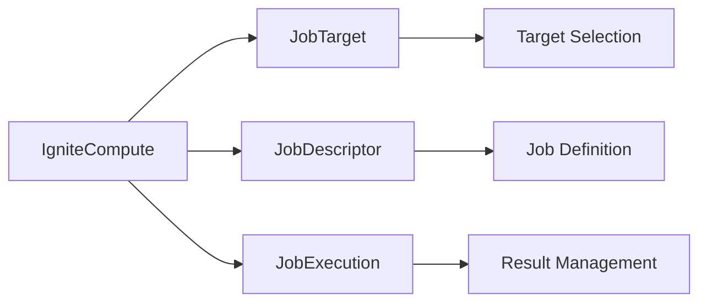
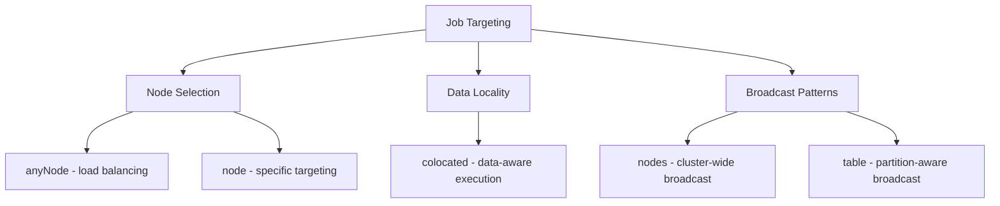
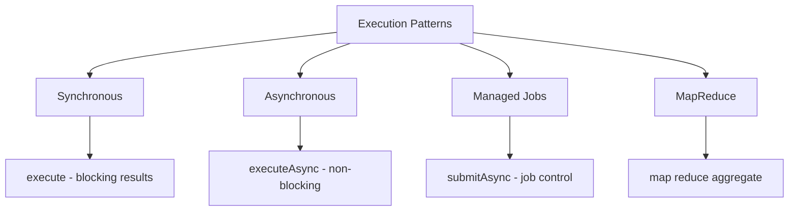

# Chapter 4.3: Distributed Computing

Your recommendation algorithm takes 45 minutes to process because it transfers terabytes of user data across the network instead of running computations where data resides. Your monthly analytics job consumes more bandwidth than your production workload, dragging down system performance for hours.

The Compute API solves these bottlenecks by executing code directly on cluster nodes where data lives, eliminating data movement and enabling massive parallel processing. This transforms single-node processing limitations into distributed intelligence that scales with your data.

## Working with the Reference Application

The **`07-compute-api-app`** demonstrates distributed job execution, data locality patterns, and result aggregation with music analytics examples. The application handles automatic job deployment using the `ComputeJobDeployment` utility class with REST API integration.

```bash
cd ignite3-reference-apps/07-compute-api-app
mvn package
mvn compile exec:java
```

Job deployment handles both automatic and manual scenarios:

**Automatic Deployment**:
```bash
# Application handles deployment automatically
mvn package && mvn compile exec:java
```

**Manual Deployment**:
```bash
# Using included deployment script
./deploy-jar.sh compute-jobs 1.0.0 target/07-compute-api-app-1.0.0.jar

# Or using Docker CLI
docker run --rm -it --network=host -e LANG=C.UTF-8 -e LC_ALL=C.UTF-8 apacheignite/ignite:3.0.0 cli
cluster unit deploy compute-jobs /path/to/target/07-compute-api-app-1.0.0.jar
```

The reference app builds on the data consistency patterns from [Chapter 4.1](01-transaction-fundamentals.md) to create reliable distributed processing workflows.

## Architecture

The Compute API provides a framework for executing code across cluster nodes with sophisticated targeting and result management.

### Core Compute Components

The fundamental components work together to enable distributed job execution:



**IgniteCompute** serves as the entry point for all compute operations, coordinating job submission and execution across the cluster. **JobTarget** specifies where jobs should run, **JobDescriptor** defines what jobs should execute, and **JobExecution** manages running jobs and their results.

### Job Targeting Options

Different targeting strategies optimize job placement for various scenarios:



**Node Selection** distributes work across available nodes for optimal resource utilization. **Data Locality** executes jobs where relevant data resides, eliminating network transfers. **Broadcast Patterns** enable cluster-wide operations and comprehensive data analysis.

### Execution Patterns

Multiple execution approaches handle different application requirements:



**Synchronous** execution blocks until jobs complete and return results directly. **Asynchronous** execution enables non-blocking operations with CompletableFuture results. **Managed Jobs** provide execution control for monitoring and cancellation. **MapReduce** patterns distribute computation and aggregate results across multiple nodes.

These three core capabilities solve distributed computing problems:

- **Data Locality**: Jobs execute where data resides, minimizing network overhead
- **Multiple Targeting**: From specific nodes to intelligent data-aware placement  
- **Result Management**: Synchronous, asynchronous, and job control patterns

## Job Submission Workflow

### Basic Job Submission

**Problem**: Your analytics platform processes customer listening data by pulling millions of track records from distributed nodes to a central processing server. This creates a bottleneck where network bandwidth limits analysis speed, and the central server becomes overwhelmed handling data from multiple customers simultaneously. A simple track duration calculation for 10,000 tracks requires transferring megabytes of data across the network just to perform basic arithmetic.

**Solution**: Execute computation directly on the nodes where data resides, eliminating network transfer overhead and distributing processing load across the cluster.

All distributed compute operations follow a standard workflow: create a job, define a target, and execute. This foundational pattern applies to every compute scenario regardless of complexity:

```java
import org.apache.ignite.client.IgniteClient;
import org.apache.ignite.compute.ComputeJob;
import org.apache.ignite.compute.JobExecutionContext;
import org.apache.ignite.compute.JobDescriptor;
import org.apache.ignite.compute.JobTarget;

// Step 1: Create a job class that implements ComputeJob
public class SimpleMessageJob implements ComputeJob<String, String> {
    @Override
    public CompletableFuture<String> executeAsync(JobExecutionContext context, String message) {
        return CompletableFuture.completedFuture("Processed: " + message);
    }
}

// Step 2: Connect to cluster and submit job
try (IgniteClient ignite = IgniteClient.builder()
        .addresses("localhost:10800")
        .build()) {
    
    // Step 3: Create job descriptor
    JobDescriptor<String, String> job = JobDescriptor.builder(SimpleMessageJob.class).build();
    
    // Step 4: Define execution target
    JobTarget target = JobTarget.anyNode(ignite.clusterNodes());
    
    // Step 5: Execute job and get result
    String result = ignite.compute().execute(target, job, "Hello World");
    System.out.println("Result: " + result);
}
```

**Standard Workflow Steps:**

1. **Job Implementation**: Create a class implementing `ComputeJob<InputType, OutputType>`
2. **Client Connection**: Establish connection to the Ignite cluster
3. **Job Descriptor**: Create descriptor that defines the job class and configuration
4. **Target Selection**: Choose where the job executes (any node, specific node, or data-colocated)
5. **Job Execution**: Submit job and receive results

This five-step pattern forms the foundation for all compute operations.

### Data Processing Job Example

When your analytics queries consume excessive bandwidth transferring data for computation, jobs execute directly on data nodes using the same foundational workflow:

```java
import org.apache.ignite.sql.IgniteSql;
import org.apache.ignite.sql.ResultSet;
import org.apache.ignite.sql.SqlRow;

// Job that calculates total duration for a set of track IDs
public class TrackDurationJob implements ComputeJob<List<Integer>, Double> {
    @Override
    public CompletableFuture<Double> executeAsync(JobExecutionContext context, List<Integer> trackIds) {
        return CompletableFuture.supplyAsync(() -> {
            // Access Ignite APIs within the job execution context
            IgniteSql sql = context.ignite().sql();
            
            double totalDuration = 0.0;
            for (Integer trackId : trackIds) {
                try (ResultSet<SqlRow> rs = sql.execute(null, 
                    "SELECT Milliseconds FROM Track WHERE TrackId = ?", trackId)) {
                    
                    if (rs.hasNext()) {
                        SqlRow row = rs.next();
                        totalDuration += row.doubleValue("Milliseconds") / 60000.0; // Convert to minutes
                    }
                }
            }
            
            return totalDuration;
        });
    }
}

// Follow the same five-step workflow
try (IgniteClient ignite = IgniteClient.builder()
        .addresses("localhost:10800")
        .build()) {
    
    JobDescriptor<List<Integer>, Double> job = JobDescriptor.builder(TrackDurationJob.class).build();
    JobTarget target = JobTarget.anyNode(ignite.clusterNodes());
    List<Integer> trackIds = Arrays.asList(1, 2, 3, 4, 5);

    Double totalDuration = ignite.compute().execute(target, job, trackIds);
    System.out.println("Total track duration: " + totalDuration + " minutes");
}
```

**Key Concepts:**

- **ComputeJob Interface**: Jobs implement `ComputeJob<InputType, OutputType>` for type safety
- **JobExecutionContext**: Provides access to the full Ignite API within the job
- **Resource Access**: Jobs execute SQL queries and access tables locally
- **Data Processing**: Eliminates network transfers by processing data where it resides

## Job Submission Patterns

Now that you understand the basic workflow, these patterns show how to adapt the five-step process for different execution scenarios.

### Deployment Units and Job Class Management

Standalone Ignite clusters require job classes deployed before execution using deployment units. The reference application includes a `ComputeJobDeployment` utility class that handles this automatically:

```java
import org.apache.ignite.deployment.DeploymentUnit;

public class ComputeExample {
    
    public void executeJobWithDeployment(IgniteClient ignite) {
        // Use the deployment utility for automatic JAR deployment
        if (!ComputeJobDeployment.deployJobClasses()) {
            System.out.println(">>> Continuing with development deployment units");
        }
        
        // Create job descriptor with deployment units
        JobDescriptor<String, String> job = JobDescriptor.builder(MessageProcessingJob.class)
                .units(ComputeJobDeployment.getDeploymentUnits())
                .build();
        
        JobTarget target = JobTarget.anyNode(ignite.clusterNodes());
        String result = ignite.compute().execute(target, job, "Hello World");
        System.out.println("Result: " + result);
    }
}
```

**Deployment Workflow:**

1. **Build JAR**: Package job classes into a JAR file
   ```bash
   mvn package
   ```

2. **Deploy JAR**: Use REST API, CLI, or Docker CLI to deploy the JAR to the cluster

   **REST API**:
   ```bash
   # Deploy via HTTP REST API
   curl -X POST \
     "http://localhost:10300/management/v1/deployment/units/compute-jobs/1.0.0?deployMode=MAJORITY" \
     -H "Content-Type: multipart/form-data" \
     -F "unitContent=@target/app-1.0.0.jar"
   ```

   **CLI Options**:
   ```bash
   # Using local CLI
   ignite cluster unit deploy compute-jobs target/app-1.0.0.jar
   
   # Using Docker CLI
   docker run --rm -it --network=host -e LANG=C.UTF-8 -e LC_ALL=C.UTF-8 apacheignite/ignite:3.0.0 cli
   cluster unit  deploy compute-jobs /path/to/target/app-1.0.0.jar
   ```

3. **Execute Jobs**: Run application using deployment units that reference the deployed JAR

**Programmatic Deployment in Java:**

```java
// Deploy JAR programmatically via REST API
public void deployJobClasses(Path jarPath) throws Exception {
    String restApiUrl = "http://localhost:10300/management/v1/deployment/units/" 
                      + "compute-jobs/1.0.0?deployMode=MAJORITY";
    
    byte[] jarContent = Files.readAllBytes(jarPath);
    
    // Create multipart form data
    String boundary = "----WebKitFormBoundary" + System.currentTimeMillis();
    String multipartData = createMultipartData(boundary, jarPath.getFileName().toString(), jarContent);
    
    HttpClient httpClient = HttpClient.newHttpClient();
    HttpRequest request = HttpRequest.newBuilder()
            .uri(URI.create(restApiUrl))
            .header("Content-Type", "multipart/form-data; boundary=" + boundary)
            .POST(HttpRequest.BodyPublishers.ofString(multipartData, StandardCharsets.ISO_8859_1))
            .build();
    
    HttpResponse<String> response = httpClient.send(request, HttpResponse.BodyHandlers.ofString());
    
    if (response.statusCode() == 200 || response.statusCode() == 201) {
        System.out.println("Deployment successful");
    } else if (response.statusCode() == 409) {
        System.out.println("Deployment unit already exists");
    } else {
        throw new RuntimeException("Deployment failed: HTTP " + response.statusCode());
    }
}
```

**Deployment Strategies:**

- **Automated Environments**: Use REST API for CI/CD pipeline integration
- **Development**: Applications automatically deploy JARs before job execution
- **Production**: Use deployment units with deployed JARs for isolation and versioning
- **Error Handling**: Provide fallback instructions when REST API deployment fails

### Job Targeting Strategies

#### Any Node Execution

**Problem**: Your music platform needs to analyze album titles for keyword trends, but this CPU-intensive text processing doesn't require database access. Running these computations on your application servers creates resource contention with user-facing requests, while your Ignite cluster nodes have available CPU capacity.

**Solution**: Distribute CPU-intensive work that doesn't require data access across available cluster nodes, balancing load and freeing application servers for user requests.

Target any available node for optimal load distribution:

```java
// CPU-intensive job that doesn't require data access
public class AlbumNameAnalysisJob implements ComputeJob<List<String>, Map<String, Integer>> {
    @Override
    public CompletableFuture<Map<String, Integer>> executeAsync(
            JobExecutionContext context, List<String> albumTitles) {
        
        return CompletableFuture.supplyAsync(() -> {
            Map<String, Integer> analysis = new HashMap<>();
            
            for (String title : albumTitles) {
                // Word count analysis (CPU-intensive, no data access needed)
                String[] words = title.toLowerCase().split("\\s+");
                analysis.put(title, words.length);
            }
            
            return analysis;
        });
    }
}

// Execute on any available node for optimal load distribution
JobTarget target = JobTarget.anyNode(ignite.clusterNodes());
List<String> albums = Arrays.asList("Back in Black", "The Dark Side of the Moon", "Hotel California");
Map<String, Integer> analysis = ignite.compute().execute(target, job, albums);
```

#### Specific Node Targeting

**Problem**: Your recommendation engine requires nodes with large memory allocations and specialized ML libraries, while your cluster contains both high-memory compute nodes and standard data nodes. Generic job targeting might place memory-intensive ML algorithms on nodes without sufficient resources, causing out-of-memory errors or poor performance.

**Solution**: Direct jobs to nodes with specific hardware characteristics, software configurations, or resource availability to match workload requirements with appropriate infrastructure.

Target nodes with specific characteristics or resource requirements:

```java
// Target nodes based on resource availability or node characteristics
Set<ClusterNode> computeNodes = ignite.clusterNodes().stream()
    .filter(node -> node.name().startsWith("compute-"))
    .collect(Collectors.toSet());

if (!computeNodes.isEmpty()) {
    JobTarget target = JobTarget.anyNode(computeNodes);
    String result = ignite.compute().execute(target, job, inputData);
}

// Target a specific node by name or ID
Optional<ClusterNode> specificNode = ignite.clusterNodes().stream()
    .filter(node -> node.name().equals("worker-node-01"))
    .findFirst();

if (specificNode.isPresent()) {
    JobTarget target = JobTarget.node(specificNode.get());
    String result = ignite.compute().execute(target, job, inputData);
}
```

## Data Locality and Colocation

### Colocated Job Execution

**Problem**: Your artist sales analytics require joining data from Artist, Album, Track, and InvoiceLine tables. When these related tables are distributed across different nodes, complex queries trigger massive network traffic as data moves between nodes for joins and aggregations. A sales report for a single artist might require transferring thousands of records across the network, multiplying response times and consuming bandwidth.

**Solution**: Execute jobs on the node where the primary data (Artist) is stored, ensuring all related data is available locally through colocation. This eliminates cross-node data transfer and leverages local storage performance.

Data-aware job placement transforms bandwidth-constrained analytics into local processing:

```java
// Job that analyzes sales data for a specific artist
public class ArtistSalesAnalysisJob implements ComputeJob<Integer, ArtistSalesReport> {
    @Override
    public CompletableFuture<ArtistSalesReport> executeAsync(
            JobExecutionContext context, Integer artistId) {
        
        return CompletableFuture.supplyAsync(() -> {
            IgniteSql sql = context.ignite().sql();
            
            // This query executes locally since the job runs where Artist data is colocated
            String salesQuery = """
                SELECT al.Title, COUNT(il.TrackId) as TracksSold, SUM(il.UnitPrice * il.Quantity) as Revenue
                FROM Artist ar
                JOIN Album al ON ar.ArtistId = al.ArtistId  
                JOIN Track t ON al.AlbumId = t.AlbumId
                JOIN InvoiceLine il ON t.TrackId = il.TrackId
                WHERE ar.ArtistId = ?
                GROUP BY al.AlbumId, al.Title
                ORDER BY Revenue DESC
                """;
            
            List<AlbumSales> albumSales = new ArrayList<>();
            try (ResultSet<SqlRow> rs = sql.execute(null, salesQuery, artistId)) {
                while (rs.hasNext()) {
                    SqlRow row = rs.next();
                    albumSales.add(new AlbumSales(
                        row.stringValue("Title"),
                        row.intValue("TracksSold"), 
                        row.doubleValue("Revenue")
                    ));
                }
            }
            
            // Get artist name
            String artistName = "Unknown Artist";
            try (ResultSet<SqlRow> rs = sql.execute(null, 
                "SELECT Name FROM Artist WHERE ArtistId = ?", artistId)) {
                if (rs.hasNext()) {
                    artistName = rs.next().stringValue("Name");
                }
            }
            
            return new ArtistSalesReport(artistId, artistName, albumSales);
        });
    }
}

// Required import for colocation
import org.apache.ignite.table.Tuple;

// Execute job on the node where Artist data with ArtistId=1 resides
JobTarget colocatedTarget = JobTarget.colocated("Artist", 
    Tuple.create().set("ArtistId", 1));

ArtistSalesReport report = ignite.compute().execute(colocatedTarget, job, 1);
System.out.println("Sales report for " + report.getArtistName() + 
    ": " + report.getTotalRevenue() + " total revenue");
```

This eliminates the primary bottleneck in distributed analytics:

- **Network Efficiency**: Data doesn't cross network boundaries for processing
- **Performance**: Local data access is orders of magnitude faster than remote
- **Scalability**: Work scales with data distribution across the cluster

### Broadcast Execution Patterns

**Problem**: Your music platform needs to calculate global statistics like total track count, average song duration, and play count distributions across the entire catalog. Traditional approaches either pull all data to a single node (overwhelming that node and the network) or execute separate queries from the client (requiring multiple round trips and partial result aggregation).

**Solution**: Execute the same job on every node in the cluster, allowing each node to process its local data portion, then aggregate results. This parallelizes the work across all available resources while maintaining data locality.

Execute jobs across all nodes or all data partitions for cluster-wide operations:

```java
// Job that calculates local statistics on each node
public class LocalTrackStatsJob implements ComputeJob<Void, TrackStatistics> {
    @Override
    public CompletableFuture<TrackStatistics> executeAsync(
            JobExecutionContext context, Void input) {
        
        return CompletableFuture.supplyAsync(() -> {
            IgniteSql sql = context.ignite().sql();
            
            // Each node calculates statistics for its local track data
            try (ResultSet<SqlRow> rs = sql.execute(null, """
                SELECT COUNT(*) as TrackCount, 
                       AVG(Milliseconds) as AvgDuration,
                       MIN(Milliseconds) as MinDuration,
                       MAX(Milliseconds) as MaxDuration
                FROM Track
                """)) {
                
                if (rs.hasNext()) {
                    SqlRow row = rs.next();
                    return new TrackStatistics(
                        row.intValue("TrackCount"),
                        row.doubleValue("AvgDuration"),
                        row.intValue("MinDuration"),
                        row.intValue("MaxDuration")
                    );
                }
            }
            
            return new TrackStatistics(0, 0.0, 0, 0);
        });
    }
}

// Execute on all nodes to gather comprehensive statistics
BroadcastJobTarget broadcastTarget = BroadcastJobTarget.nodes(ignite.clusterNodes());
Collection<TrackStatistics> nodeStats = ignite.compute().execute(broadcastTarget, job, null);

// Aggregate statistics from all nodes
TrackStatistics globalStats = nodeStats.stream()
    .reduce(new TrackStatistics(0, 0.0, Integer.MAX_VALUE, Integer.MIN_VALUE),
            TrackStatistics::merge);

System.out.println("Global track statistics: " + globalStats);
```

Broadcast patterns enable cluster-wide analytics:

- **Cluster-wide Operations**: Execute on all cluster nodes
- **Partition-aware Broadcast**: Execute on nodes that hold specific table data
- **Result Aggregation**: Collect and combine results from multiple executions

## Asynchronous Execution and Job Control

### Non-blocking Job Execution

**Problem**: Your music streaming application generates artist sales reports for multiple artists simultaneously when users request analytics dashboards. Blocking on each report generation creates a cascading delay where later reports wait for earlier ones to complete, leading to poor user experience as dashboard loading times become unpredictable and potentially very long.

**Solution**: Submit multiple jobs asynchronously and process results as they become available, allowing the application to remain responsive and handle multiple operations concurrently.

Applications that require responsiveness use asynchronous patterns to avoid blocking:

```java
// Submit multiple analysis jobs asynchronously
List<Integer> artistIds = Arrays.asList(1, 2, 3, 4, 5);
List<CompletableFuture<ArtistSalesReport>> futures = new ArrayList<>();

for (Integer artistId : artistIds) {
    JobTarget target = JobTarget.colocated("Artist", 
        Tuple.create().set("ArtistId", artistId));
    
    CompletableFuture<ArtistSalesReport> future = ignite.compute()
        .executeAsync(target, salesAnalysisJob, artistId);
    
    futures.add(future);
}

// Process results as they complete
CompletableFuture<Void> allComplete = CompletableFuture.allOf(
    futures.toArray(new CompletableFuture[0]));

allComplete.thenRun(() -> {
    List<ArtistSalesReport> reports = futures.stream()
        .map(CompletableFuture::join)
        .collect(Collectors.toList());
    
    // Process all completed reports
    reports.forEach(report -> 
        System.out.println(report.getArtistName() + ": " + report.getTotalRevenue()));
});
```

### Job Execution Management

**Problem**: Your nightly batch processing generates comprehensive music catalog analytics that can take hours to complete. Without visibility into job progress, you can't determine if jobs are progressing normally, stuck, or failed. When issues occur, you have no way to cancel runaway jobs or retry failed operations, potentially wasting cluster resources or requiring full system restarts.

**Solution**: Use job execution controls to monitor progress, track status, and manage long-running operations with proper lifecycle management.

Long-running jobs require monitoring and control capabilities:

```java
// Required imports for job control
import org.apache.ignite.compute.JobExecution;
import org.apache.ignite.compute.JobState;

// Submit job with execution control
CompletableFuture<JobExecution<String>> executionFuture = ignite.compute()
    .submitAsync(target, longRunningJob, inputData);

JobExecution<String> execution = executionFuture.get();

// Monitor job state
CompletableFuture<JobState> stateFuture = execution.stateAsync();
stateFuture.thenAccept(state -> {
    System.out.println("Job state: " + state.status());
    System.out.println("Job ID: " + state.id());
    System.out.println("Create time: " + state.createTime());
});

// Get result when job completes
CompletableFuture<String> resultFuture = execution.resultAsync();
resultFuture.thenAccept(result -> {
    System.out.println("Job completed with result: " + result);
});

// Cancel job if needed
// execution.cancel(); // Implementation depends on job design
```

Job control features handle complex execution scenarios:

- **State Monitoring**: Track job progress and status
- **Result Management**: Handle results when jobs complete
- **Execution Context**: Access job metadata and execution details

## MapReduce Patterns

### Distributed Analytics with Map-Reduce

**Problem**: Your music platform needs to analyze genre popularity across millions of tracks and customer purchases. This requires grouping tracks by genre, calculating statistics like play counts and sales figures, then aggregating results across the entire dataset. Processing this sequentially would take hours, while pulling all data to one location would overwhelm both network and processing resources.

**Solution**: Implement a map-reduce pattern where each node analyzes its local data portion (map phase), then results are combined across nodes (reduce phase). This maximizes parallelism while minimizing data transfer.

Complex analytics distribute computation across nodes, then aggregate results:

```java
// Map phase: Analyze tracks by genre on each node
public class GenreAnalysisMapJob implements ComputeJob<Void, Map<String, GenreStats>> {
    @Override
    public CompletableFuture<Map<String, GenreStats>> executeAsync(
            JobExecutionContext context, Void input) {
        
        return CompletableFuture.supplyAsync(() -> {
            IgniteSql sql = context.ignite().sql();
            Map<String, GenreStats> genreStats = new HashMap<>();
            
            try (ResultSet<SqlRow> rs = sql.execute(null, """
                SELECT g.Name as GenreName, 
                       COUNT(t.TrackId) as TrackCount,
                       AVG(t.Milliseconds) as AvgDuration,
                       SUM(COALESCE(il.Quantity, 0)) as TotalSales
                FROM Genre g
                LEFT JOIN Track t ON g.GenreId = t.GenreId
                LEFT JOIN InvoiceLine il ON t.TrackId = il.TrackId
                GROUP BY g.GenreId, g.Name
                """)) {
                
                while (rs.hasNext()) {
                    SqlRow row = rs.next();
                    String genreName = row.stringValue("GenreName");
                    genreStats.put(genreName, new GenreStats(
                        row.intValue("TrackCount"),
                        row.doubleValue("AvgDuration"),
                        row.intValue("TotalSales")
                    ));
                }
            }
            
            return genreStats;
        });
    }
}

// Execute map jobs across all nodes
BroadcastJobTarget target = BroadcastJobTarget.nodes(ignite.clusterNodes());
Collection<Map<String, GenreStats>> mapResults = ignite.compute()
    .execute(target, mapJob, null);

// Reduce phase: Aggregate results from all nodes
Map<String, GenreStats> globalGenreStats = new HashMap<>();
for (Map<String, GenreStats> nodeResult : mapResults) {
    nodeResult.forEach((genre, stats) -> 
        globalGenreStats.merge(genre, stats, GenreStats::merge));
}

// Display aggregated results
globalGenreStats.entrySet().stream()
    .sorted(Map.Entry.<String, GenreStats>comparingByValue(
        Comparator.comparing(GenreStats::getTotalSales)).reversed())
    .forEach(entry -> System.out.println(
        entry.getKey() + ": " + entry.getValue().getTotalSales() + " total sales"));
```

### Advanced Processing Patterns

**Problem**: Your recommendation engine must analyze individual customer purchase history, identify similar customers based on genre preferences, and generate personalized track recommendations. This involves multiple complex queries, correlation analysis, and algorithmic processing that becomes computationally expensive when scaled across millions of customers. Processing each recommendation request from a central server creates bottlenecks and doesn't scale with user growth.

**Solution**: Create sophisticated distributed processing workflows that combine multiple analytical steps, leverage data colocation for performance, and distribute the computational load across cluster nodes.

Recommendation engines require sophisticated distributed processing workflows:

```java
// Complex recommendation engine using distributed processing
public class RecommendationEngineJob implements ComputeJob<Integer, List<Recommendation>> {
    @Override
    public CompletableFuture<List<Recommendation>> executeAsync(
            JobExecutionContext context, Integer customerId) {
        
        return CompletableFuture.supplyAsync(() -> {
            IgniteSql sql = context.ignite().sql();
            List<Recommendation> recommendations = new ArrayList<>();
            
            // Step 1: Analyze customer's purchase history
            Map<String, Integer> genrePreferences = analyzeGenrePreferences(sql, customerId);
            
            // Step 2: Find similar customers based on genre preferences
            List<Integer> similarCustomers = findSimilarCustomers(sql, genrePreferences);
            
            // Step 3: Recommend tracks purchased by similar customers
            recommendations = generateRecommendations(sql, customerId, similarCustomers);
            
            return recommendations;
        });
    }
    
    private Map<String, Integer> analyzeGenrePreferences(IgniteSql sql, Integer customerId) {
        Map<String, Integer> preferences = new HashMap<>();
        
        try (ResultSet<SqlRow> rs = sql.execute(null, """
            SELECT g.Name, COUNT(*) as PurchaseCount
            FROM Invoice i
            JOIN InvoiceLine il ON i.InvoiceId = il.InvoiceId
            JOIN Track t ON il.TrackId = t.TrackId
            JOIN Genre g ON t.GenreId = g.GenreId
            WHERE i.CustomerId = ?
            GROUP BY g.GenreId, g.Name
            ORDER BY PurchaseCount DESC
            """, customerId)) {
            
            while (rs.hasNext()) {
                SqlRow row = rs.next();
                preferences.put(row.stringValue("Name"), row.intValue("PurchaseCount"));
            }
        }
        
        return preferences;
    }
    
    private List<Integer> findSimilarCustomers(IgniteSql sql, Map<String, Integer> genrePreferences) {
        // Simplified similarity algorithm - in practice would use more sophisticated ML
        List<Integer> similarCustomers = new ArrayList<>();
        
        for (String genre : genrePreferences.keySet()) {
            try (ResultSet<SqlRow> rs = sql.execute(null, """
                SELECT DISTINCT i.CustomerId
                FROM Invoice i
                JOIN InvoiceLine il ON i.InvoiceId = il.InvoiceId
                JOIN Track t ON il.TrackId = t.TrackId
                JOIN Genre g ON t.GenreId = g.GenreId
                WHERE g.Name = ?
                LIMIT 10
                """, genre)) {
                
                while (rs.hasNext()) {
                    similarCustomers.add(rs.next().intValue("CustomerId"));
                }
            }
        }
        
        return similarCustomers.stream().distinct().collect(Collectors.toList());
    }
    
    private List<Recommendation> generateRecommendations(
            IgniteSql sql, Integer customerId, List<Integer> similarCustomers) {
        
        List<Recommendation> recommendations = new ArrayList<>();
        
        if (!similarCustomers.isEmpty()) {
            String customerList = similarCustomers.stream()
                .map(String::valueOf)
                .collect(Collectors.joining(","));
            
            try (ResultSet<SqlRow> rs = sql.execute(null, """
                SELECT t.TrackId, t.Name, ar.Name as ArtistName, 
                       COUNT(*) as PopularityScore
                FROM Track t
                JOIN Album al ON t.AlbumId = al.AlbumId
                JOIN Artist ar ON al.ArtistId = ar.ArtistId
                JOIN InvoiceLine il ON t.TrackId = il.TrackId
                JOIN Invoice i ON il.InvoiceId = i.InvoiceId
                WHERE i.CustomerId IN (""" + customerList + """)
                AND t.TrackId NOT IN (
                    SELECT t2.TrackId FROM Track t2
                    JOIN InvoiceLine il2 ON t2.TrackId = il2.TrackId
                    JOIN Invoice i2 ON il2.InvoiceId = i2.InvoiceId
                    WHERE i2.CustomerId = ?
                )
                GROUP BY t.TrackId, t.Name, ar.Name
                ORDER BY PopularityScore DESC
                LIMIT 20
                """, customerId)) {
                
                while (rs.hasNext()) {
                    SqlRow row = rs.next();
                    recommendations.add(new Recommendation(
                        row.intValue("TrackId"),
                        row.stringValue("Name"),
                        row.stringValue("ArtistName"),
                        row.intValue("PopularityScore")
                    ));
                }
            }
        }
        
        return recommendations;
    }
}

// Execute recommendation job colocated with customer data
JobTarget target = JobTarget.colocated("Customer", 
    Tuple.create().set("CustomerId", customerId));

List<Recommendation> recommendations = ignite.compute()
    .execute(target, recommendationJob, customerId);

System.out.println("Recommendations for customer " + customerId + ":");
recommendations.forEach(rec -> 
    System.out.println("  " + rec.getTrackName() + " by " + rec.getArtistName()));
```

## Error Handling and Fault Tolerance

### Job Failure Handling

Distributed jobs face network failures, node outages, and resource constraints. Robust error handling with retry logic ensures job completion despite failures:

```java
public class RobustComputeService {
    
    public <T> CompletableFuture<T> executeWithRetry(
            IgniteClient ignite, 
            JobTarget target, 
            ComputeJob<?, T> job, 
            Object input,
            int maxRetries) {
        
        return executeWithRetryInternal(ignite, target, job, input, maxRetries, 0);
    }
    
    private <T> CompletableFuture<T> executeWithRetryInternal(
            IgniteClient ignite,
            JobTarget target,
            ComputeJob<?, T> job,
            Object input,
            int maxRetries,
            int currentAttempt) {
        
        JobDescriptor<Object, T> descriptor = JobDescriptor.builder(job.getClass()).build();
        
        return ignite.compute().executeAsync(target, descriptor, input)
            .exceptionallyCompose(throwable -> {
                if (currentAttempt >= maxRetries) {
                    return CompletableFuture.failedFuture(throwable);
                }
                
                if (isRetryableException(throwable)) {
                    long delay = calculateBackoffDelay(currentAttempt);
                    
                    return CompletableFuture
                        .delayedExecutor(delay, TimeUnit.MILLISECONDS)
                        .thenCompose(ignored -> 
                            executeWithRetryInternal(ignite, target, job, input, maxRetries, currentAttempt + 1));
                } else {
                    return CompletableFuture.failedFuture(throwable);
                }
            });
    }
    
    private boolean isRetryableException(Throwable throwable) {
        return throwable.getMessage().contains("node unavailable") ||
               throwable.getMessage().contains("timeout") ||
               throwable.getMessage().contains("connection");
    }
    
    private long calculateBackoffDelay(int attempt) {
        long baseDelay = 1000; // 1 second
        return Math.min(baseDelay * (long) Math.pow(2, attempt), 30000); // Max 30 seconds
    }
}
```

## Helper Classes for Examples

```java
// Supporting classes for the examples above
class ArtistSalesReport {
    private Integer artistId;
    private String artistName;
    private List<AlbumSales> albumSales;
    private double totalRevenue;
    
    public ArtistSalesReport(Integer artistId, String artistName, List<AlbumSales> albumSales) {
        this.artistId = artistId;
        this.artistName = artistName;
        this.albumSales = albumSales;
        this.totalRevenue = albumSales.stream().mapToDouble(AlbumSales::getRevenue).sum();
    }
    
    // Getters...
}

class AlbumSales {
    private String title;
    private int tracksSold;
    private double revenue;
    
    public AlbumSales(String title, int tracksSold, double revenue) {
        this.title = title;
        this.tracksSold = tracksSold;
        this.revenue = revenue;
    }
    
    // Getters...
}

class TrackStatistics {
    private int trackCount;
    private double avgDuration;
    private int minDuration;
    private int maxDuration;
    
    public TrackStatistics(int trackCount, double avgDuration, int minDuration, int maxDuration) {
        this.trackCount = trackCount;
        this.avgDuration = avgDuration;
        this.minDuration = minDuration;
        this.maxDuration = maxDuration;
    }
    
    public static TrackStatistics merge(TrackStatistics a, TrackStatistics b) {
        return new TrackStatistics(
            a.trackCount + b.trackCount,
            (a.avgDuration * a.trackCount + b.avgDuration * b.trackCount) / (a.trackCount + b.trackCount),
            Math.min(a.minDuration, b.minDuration),
            Math.max(a.maxDuration, b.maxDuration)
        );
    }
    
    // Getters...
}

class GenreStats {
    private int trackCount;
    private double avgDuration;
    private int totalSales;
    
    public GenreStats(int trackCount, double avgDuration, int totalSales) {
        this.trackCount = trackCount;
        this.avgDuration = avgDuration;
        this.totalSales = totalSales;
    }
    
    public static GenreStats merge(GenreStats a, GenreStats b) {
        return new GenreStats(
            a.trackCount + b.trackCount,
            (a.avgDuration * a.trackCount + b.avgDuration * b.trackCount) / (a.trackCount + b.trackCount),
            a.totalSales + b.totalSales
        );
    }
    
    // Getters...
}

class Recommendation {
    private Integer trackId;
    private String trackName;
    private String artistName;
    private int popularityScore;
    
    public Recommendation(Integer trackId, String trackName, String artistName, int popularityScore) {
        this.trackId = trackId;
        this.trackName = trackName;
        this.artistName = artistName;
        this.popularityScore = popularityScore;
    }
    
    // Getters...
}
```

The Compute API transforms single-node processing limitations into distributed intelligence, enabling analytics and processing that scales with your data across the cluster while maintaining the performance benefits of data locality.

## Implementation Considerations

### SQL Reserved Words in Compute Jobs

Ignite 3 rejects SQL queries with reserved word aliases. When writing SQL queries within compute jobs, use descriptive aliases instead of reserved words:

```java
// Incorrect - will cause parsing errors
try (ResultSet<SqlRow> result = sql.execute(null, "SELECT COUNT(*) as count FROM Track")) {
    // This will fail with "Encountered 'count' at line 1, column 20"
}

// Correct - use descriptive aliases
try (ResultSet<SqlRow> result = sql.execute(null, "SELECT COUNT(*) as track_count FROM Track")) {
    if (result.hasNext()) {
        return (int) result.next().longValue("track_count");
    }
}
```

**Reserved words to avoid in AS clauses:**

- `count`, `sum`, `avg`, `min`, `max`
- `value`, `data`, `key`, `index`
- `table`, `column`, `row`, `name`

### Serialization Patterns

String-based serialization provides reliable distributed job results across different JVM versions and configurations:

```java
// String-based results
public static class GenreStatsJob implements ComputeJob<Void, String> {
    @Override
    public CompletableFuture<String> executeAsync(JobExecutionContext context, Void arg) {
        // Return CSV format for easy parsing
        return CompletableFuture.completedFuture("Rock,150\nPop,120\nJazz,80");
    }
}

// Complex collections require additional serialization handling
public static class ComplexJob implements ComputeJob<Void, Map<String, List<Integer>>> {
    // Complex nested collections need custom serialization
}
```

The Compute API transforms single-node processing limitations into distributed intelligence, enabling analytics and processing that scales with your data across the cluster while maintaining the performance benefits of data locality.

Moving beyond distributed operations, the next module addresses the performance bottlenecks that emerge as data volume and processing demands grow.

**Continue to**: **[Module 5: Performance and Scalability](../05-performance-scalability/01-data-streaming.md)** - Master high-throughput data ingestion, caching strategies, and performance optimization techniques that handle massive data volumes and concurrent workloads.
