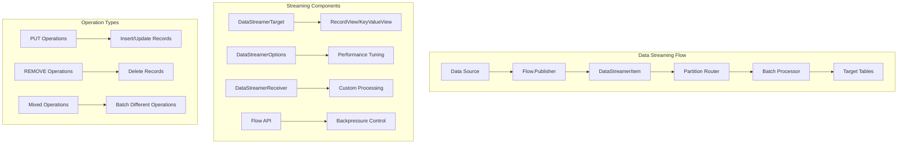

# Chapter 5.1: Data Streaming and High-Throughput Ingestion

## Learning Objectives

By completing this chapter, you will:

- Implement reactive streaming patterns for bulk data ingestion
- Master backpressure handling and flow control mechanisms
- Configure streaming options for different performance requirements
- Handle high-volume event processing with error recovery

## Working with the Reference Application

The **`08-data-streaming-app`** demonstrates Data Streaming patterns covered in this chapter with music event ingestion examples. Run it alongside your learning to see reactive streaming, backpressure handling, and bulk ingestion patterns in action.

**Quick Start**: After reading this chapter, explore the reference application:

```bash
cd ignite3-reference-apps/08-data-streaming-app
mvn compile exec:java
```

The reference app shows how the distributed computing from [Chapter 4.3](../04-distributed-operations/03-compute-api-processing.md) integrates with streaming patterns, building on the transaction and data access patterns from earlier modules.

## The High-Throughput Challenge

> [!TIP]
> **High-Volume Data Scenario**: When processing millions of real-time events (like music streaming data), traditional one-by-one database operations create bottlenecks. Data Streaming APIs enable batching, intelligent routing, and backpressure handling for sustained high throughput.

When a music streaming service releases a new album from a major artist, millions of users immediately begin streaming tracks. Each play generates events: track started, track completed, rating given, playlist added. Processing these events one-by-one through traditional database operations creates bottlenecks that prevent real-time analytics and recommendations.

Consider this scenario: A popular band releases their new album at midnight. Within the first hour, 500,000 listeners generate 2.5 million track events. Traditional INSERT statements would require 2.5 million individual database operations. Instead, Ignite 3's Data Streaming API **batches these events into chunks**, routes them to cluster nodes based on data locality, and **ingests thousands of records per second** with backpressure handling.

## Overview: Data Streaming Architecture

The Data Streaming API provides a reactive framework for bulk data operations with performance optimization:



**Key Design Principles:**

- **Reactive Streams**: Built on Java Flow API for natural backpressure handling
- **Intelligent Batching**: Groups records by partition for optimal network utilization
- **Data Locality**: Routes data to nodes where it will reside for minimal network overhead
- **Performance Control**: Configurable batch sizes, parallelism, and flow control

## Basic Streaming Patterns

### Simple Record Streaming

The fundamental pattern involves creating a data publisher and streaming records into a table:

```java
import org.apache.ignite.client.IgniteClient;
import org.apache.ignite.table.RecordView;
import org.apache.ignite.table.DataStreamerItem;
import org.apache.ignite.table.DataStreamerOptions;
import org.apache.ignite.table.Tuple;

import java.util.concurrent.Flow;
import java.util.concurrent.SubmissionPublisher;
import java.util.concurrent.CompletableFuture;

/**
 * Demonstrates basic streaming patterns for music track events.
 * This example shows how to configure streaming options and handle
 * reactive data flows for high-volume event ingestion.
 */
public class BasicTrackEventStreaming {
    
    public void streamTrackEvents(IgniteClient client) throws Exception {
        RecordView<Tuple> trackEventsView = client.tables()
            .table("TrackEvents")
            .recordView();
        
        // Configure streaming options for performance
        DataStreamerOptions options = DataStreamerOptions.builder()
            .pageSize(1000)                    // Records per batch
            .perPartitionParallelOperations(2) // Concurrent requests per partition
            .autoFlushInterval(1000)           // Auto-flush after 1 second
            .retryLimit(16)                    // Retry failed operations
            .build();
        
        // Create publisher for track events
        try (SubmissionPublisher<DataStreamerItem<Tuple>> publisher = 
                new SubmissionPublisher<>()) {
            
            // Start streaming process
            CompletableFuture<Void> streamingFuture = trackEventsView
                .streamData(publisher, options);
            
            // Simulate real-time track events
            for (int i = 0; i < 10000; i++) {
                Tuple trackEvent = Tuple.create()
                    .set("EventId", (long) i)
                    .set("UserId", 1000 + (i % 100))          // 100 different users
                    .set("TrackId", 1 + (i % 50))             // 50 different tracks
                    .set("EventType", "TRACK_STARTED")
                    .set("EventTime", System.currentTimeMillis())
                    .set("Duration", 0);                      // Will be updated when track ends
                
                // Stream as INSERT operation
                publisher.submit(DataStreamerItem.of(trackEvent));
                
                // Simulate event frequency (every 10ms)
                Thread.sleep(10);
            }
            
            // Signal completion and wait for all data to be processed
            publisher.close();
            streamingFuture.get();
            
            System.out.println("Successfully streamed 10,000 track events");
        }
    }
}
```

**Key Concepts:**

- **DataStreamerItem**: Wrapper that specifies operation type (PUT/REMOVE)
- **DataStreamerOptions**: Performance tuning for batch sizes and parallelism
- **Flow.Publisher**: Reactive streams interface for data production
- **Automatic Batching**: Records are grouped for efficient transmission

### Mixed Operation Streaming

Real-world scenarios often require mixing INSERT, UPDATE, and DELETE operations:

```java
/**
 * Demonstrates mixed streaming operations for complete track lifecycle events.
 * Shows how to handle different operation types within the same streaming session.
 */
public class MixedOperationStreaming {
    
    public void streamTrackLifecycle(IgniteClient client) throws Exception {
        RecordView<Tuple> trackEventsView = client.tables()
            .table("TrackEvents")
            .recordView();
        
        DataStreamerOptions options = DataStreamerOptions.builder()
            .pageSize(500)
            .perPartitionParallelOperations(2)
            .autoFlushInterval(500)
            .retryLimit(8)
            .build();
        
        // Stream mixed operations for track event lifecycle
        try (SubmissionPublisher<DataStreamerItem<Tuple>> publisher = 
                new SubmissionPublisher<>()) {
            
            CompletableFuture<Void> streamingFuture = trackEventsView
                .streamData(publisher, options);
            
            // Simulate complete track listening lifecycle
            for (int sessionId = 1; sessionId <= 1000; sessionId++) {
                int userId = 1000 + (sessionId % 100);
                int trackId = 1 + (sessionId % 50);
                long startTime = System.currentTimeMillis();
                
                // 1. Track started event
                Tuple startEvent = Tuple.create()
                    .set("EventId", (long) sessionId * 3)
                    .set("UserId", userId)
                    .set("TrackId", trackId)
                    .set("EventType", "TRACK_STARTED")
                    .set("EventTime", startTime)
                    .set("Duration", 0);
                
                publisher.submit(DataStreamerItem.of(startEvent)); // PUT operation
                
                // 2. Track completed event (update duration)
                long endTime = startTime + (30000 + (sessionId % 240000)); // 30s to 4.5min
                Tuple completeEvent = Tuple.create()
                    .set("EventId", (long) sessionId * 3 + 1)
                    .set("UserId", userId)
                    .set("TrackId", trackId)
                    .set("EventType", "TRACK_COMPLETED")
                    .set("EventTime", endTime)
                    .set("Duration", endTime - startTime);
                
                publisher.submit(DataStreamerItem.of(completeEvent)); // PUT operation
                
                // 3. Remove old incomplete events (simulate cleanup)
                if (sessionId % 10 == 0) {
                    Tuple obsoleteEvent = Tuple.create()
                        .set("EventId", (long) sessionId * 3 - 30); // Old event ID
                    
                    publisher.submit(DataStreamerItem.removed(obsoleteEvent)); // REMOVE operation
                }
            }
            
            publisher.close();
            streamingFuture.get();
            
            System.out.println("Processed complete track listening lifecycle for 1,000 sessions");
        }
    }
}
```

**Operation Type Benefits:**

- **PUT Operations**: Handle both inserts and updates automatically
- **REMOVE Operations**: Efficient bulk deletion without individual queries
- **Mixed Batches**: Operations are optimized together for network efficiency

## High-Volume Data Ingestion

### Bulk Track Data Loading

For scenarios requiring maximum throughput, such as migrating historical listening data:

```java
import java.nio.file.Files;
import java.nio.file.Paths;
import java.util.concurrent.ExecutorService;
import java.util.concurrent.Executors;

/**
 * Demonstrates high-volume bulk loading patterns for historical data migration.
 * Optimized for maximum throughput with proper resource management.
 */
public class BulkTrackDataLoader {
    
    public static void loadHistoricalListeningData(IgniteClient client, String csvFilePath) 
            throws Exception {
        
        RecordView<Tuple> listeningHistoryView = client.tables()
            .table("ListeningHistory")
            .recordView();
        
        // High-throughput configuration for bulk loading
        DataStreamerOptions bulkOptions = DataStreamerOptions.builder()
            .pageSize(5000)                     // Large batches for throughput
            .perPartitionParallelOperations(4)  // High parallelism
            .autoFlushInterval(500)             // Faster flushing
            .retryLimit(32)                     // Higher retry limit for stability
            .build();
        
        // Use larger buffer for high-volume streaming
        ExecutorService executor = Executors.newFixedThreadPool(2);
        
        try (SubmissionPublisher<DataStreamerItem<Tuple>> publisher = 
                new SubmissionPublisher<>(executor, 10000)) { // Large buffer
            
            CompletableFuture<Void> streamingFuture = listeningHistoryView
                .streamData(publisher, bulkOptions);
            
            // Process CSV file in chunks for memory efficiency
            Files.lines(Paths.get(csvFilePath))
                .skip(1) // Skip header
                .forEach(line -> {
                    try {
                        String[] fields = line.split(",");
                        
                        Tuple historyRecord = Tuple.create()
                            .set("RecordId", Long.parseLong(fields[0]))
                            .set("UserId", Integer.parseInt(fields[1]))
                            .set("TrackId", Integer.parseInt(fields[2]))
                            .set("PlayDate", fields[3])
                            .set("PlayCount", Integer.parseInt(fields[4]))
                            .set("Rating", fields[5].isEmpty() ? null : Integer.parseInt(fields[5]))
                            .set("PlayDuration", Integer.parseInt(fields[6]));
                        
                        publisher.submit(DataStreamerItem.of(historyRecord));
                        
                    } catch (Exception e) {
                        System.err.println("Error processing line: " + line + " - " + e.getMessage());
                    }
                });
            
            publisher.close();
            streamingFuture.get();
            
            System.out.println("Successfully loaded historical listening data from " + csvFilePath);
            
        } finally {
            executor.shutdown();
        }
    }
}
```

### Real-Time Event Streaming

For applications that must handle continuous data streams:

```java
import java.util.concurrent.BlockingQueue;
import java.util.concurrent.LinkedBlockingQueue;
import java.util.concurrent.TimeUnit;

/**
 * Real-time event streaming with continuous data processing.
 * Handles burst loads and maintains steady throughput.
 */
public class RealTimeEventStreamer {
    private final IgniteClient client;
    private final BlockingQueue<TrackEvent> eventQueue;
    private volatile boolean running = true;
    
    public RealTimeEventStreamer(IgniteClient client) {
        this.client = client;
        this.eventQueue = new LinkedBlockingQueue<>(100000); // Large buffer for bursts
    }
    
    public void startStreaming() {
        RecordView<Tuple> eventsView = client.tables()
            .table("RealTimeEvents")
            .recordView();
        
        DataStreamerOptions streamingOptions = DataStreamerOptions.builder()
            .pageSize(2000)                    // Balanced batch size
            .perPartitionParallelOperations(3) // High concurrency
            .autoFlushInterval(200)            // Fast response time
            .retryLimit(8)                     // Reasonable retry limit
            .build();
        
        CompletableFuture.runAsync(() -> {
            try (SubmissionPublisher<DataStreamerItem<Tuple>> publisher = 
                    new SubmissionPublisher<>()) {
                
                CompletableFuture<Void> streamingFuture = eventsView
                    .streamData(publisher, streamingOptions);
                
                while (running) {
                    try {
                        // Poll for events with timeout to check running status
                        TrackEvent event = eventQueue.poll(100, TimeUnit.MILLISECONDS);
                        if (event != null) {
                            Tuple eventTuple = createEventTuple(event);
                            publisher.submit(DataStreamerItem.of(eventTuple));
                        }
                        
                    } catch (InterruptedException e) {
                        Thread.currentThread().interrupt();
                        break;
                    }
                }
                
                publisher.close();
                streamingFuture.get();
                
            } catch (Exception e) {
                System.err.println("Real-time streaming error: " + e.getMessage());
            }
        });
    }
    
    public void addEvent(TrackEvent event) {
        if (!eventQueue.offer(event)) {
            System.err.println("Event queue full, dropping event: " + event);
        }
    }
    
    public void stop() {
        running = false;
    }
    
    private Tuple createEventTuple(TrackEvent event) {
        return Tuple.create()
            .set("EventId", event.getId())
            .set("UserId", event.getUserId())
            .set("TrackId", event.getTrackId())
            .set("EventType", event.getType().name())
            .set("EventTime", event.getTimestamp())
            .set("Metadata", event.getMetadata());
    }
}
```

## Backpressure and Flow Control

### Adaptive Flow Management

Managing data flow when consumers can't keep up with producers:

```java
import java.util.concurrent.Flow;
import java.util.concurrent.atomic.AtomicBoolean;
import java.util.concurrent.atomic.AtomicLong;
import java.util.concurrent.atomic.AtomicInteger;

/**
 * Adaptive publisher that responds to downstream capacity and system performance.
 * Implements backpressure handling to prevent system overload.
 */
public class AdaptiveTrackEventPublisher implements Flow.Publisher<DataStreamerItem<Tuple>> {
    private final List<TrackEvent> events;
    private final AtomicBoolean subscribed = new AtomicBoolean(false);
    
    public AdaptiveTrackEventPublisher(List<TrackEvent> events) {
        this.events = new ArrayList<>(events);
    }
    
    @Override
    public void subscribe(Flow.Subscriber<? super DataStreamerItem<Tuple>> subscriber) {
        if (subscribed.compareAndSet(false, true)) {
            subscriber.onSubscribe(new AdaptiveSubscription(subscriber));
        } else {
            subscriber.onError(new IllegalStateException("Publisher already subscribed"));
        }
    }
    
    private class AdaptiveSubscription implements Flow.Subscription {
        private final Flow.Subscriber<? super DataStreamerItem<Tuple>> subscriber;
        private final AtomicLong demand = new AtomicLong(0);
        private final AtomicInteger currentIndex = new AtomicInteger(0);
        private volatile boolean cancelled = false;
        
        public AdaptiveSubscription(Flow.Subscriber<? super DataStreamerItem<Tuple>> subscriber) {
            this.subscriber = subscriber;
        }
        
        @Override
        public void request(long n) {
            if (n <= 0) {
                subscriber.onError(new IllegalArgumentException("Request must be positive"));
                return;
            }
            
            long currentDemand = demand.addAndGet(n);
            deliverItems(currentDemand);
        }
        
        @Override
        public void cancel() {
            cancelled = true;
        }
        
        private void deliverItems(long requestedItems) {
            CompletableFuture.runAsync(() -> {
                long delivered = 0;
                
                while (delivered < requestedItems && !cancelled) {
                    int index = currentIndex.getAndIncrement();
                    
                    if (index >= events.size()) {
                        subscriber.onComplete();
                        return;
                    }
                    
                    TrackEvent event = events.get(index);
                    Tuple eventTuple = Tuple.create()
                        .set("EventId", event.getId())
                        .set("UserId", event.getUserId())
                        .set("TrackId", event.getTrackId())
                        .set("EventType", event.getType().name())
                        .set("EventTime", event.getTimestamp());
                    
                    try {
                        subscriber.onNext(DataStreamerItem.of(eventTuple));
                        delivered++;
                        
                        // Adaptive rate limiting based on system performance
                        if (delivered % 1000 == 0) {
                            Thread.sleep(10); // Small pause every 1000 items
                        }
                        
                    } catch (Exception e) {
                        subscriber.onError(e);
                        return;
                    }
                }
                
                // Update demand counter
                demand.addAndGet(-delivered);
            });
        }
    }
}
```

## Error Handling and Recovery

### Robust Error Management

Production streaming applications require comprehensive error handling:

```java
import java.util.concurrent.atomic.AtomicLong;

/**
 * Robust streaming implementation with retry logic and error recovery.
 * Maintains operational metrics and handles various failure scenarios.
 */
public class RobustMusicEventStreamer {
    private final IgniteClient client;
    private final AtomicLong successCount = new AtomicLong(0);
    private final AtomicLong errorCount = new AtomicLong(0);
    
    public RobustMusicEventStreamer(IgniteClient client) {
        this.client = client;
    }
    
    public CompletableFuture<StreamingResult> streamEventsWithRecovery(
            List<TrackEvent> events) {
        
        return CompletableFuture.supplyAsync(() -> {
            RecordView<Tuple> eventsView = client.tables()
                .table("RobustEvents")
                .recordView();
            
            // Retry configuration for resilience
            DataStreamerOptions resilientOptions = DataStreamerOptions.builder()
                .pageSize(500)                     // Smaller batches for error isolation
                .perPartitionParallelOperations(1) // Single-threaded for error tracking
                .autoFlushInterval(1000)           // Regular flushing
                .retryLimit(32)                    // High retry limit
                .build();
            
            int maxRetries = 3;
            int currentRetry = 0;
            
            while (currentRetry < maxRetries) {
                try {
                    return attemptStreaming(eventsView, events, resilientOptions);
                    
                } catch (Exception e) {
                    currentRetry++;
                    errorCount.incrementAndGet();
                    
                    System.err.println("Streaming attempt " + currentRetry + " failed: " + 
                        e.getMessage());
                    
                    if (currentRetry < maxRetries) {
                        try {
                            // Exponential backoff
                            Thread.sleep(1000 * (1L << (currentRetry - 1)));
                        } catch (InterruptedException ie) {
                            Thread.currentThread().interrupt();
                            throw new RuntimeException("Streaming interrupted", ie);
                        }
                    }
                }
            }
            
            throw new RuntimeException("Failed to stream after " + maxRetries + " attempts");
        });
    }
    
    private StreamingResult attemptStreaming(RecordView<Tuple> eventsView, 
                                           List<TrackEvent> events,
                                           DataStreamerOptions options) throws Exception {
        
        try (SubmissionPublisher<DataStreamerItem<Tuple>> publisher = 
                new SubmissionPublisher<>()) {
            
            CompletableFuture<Void> streamingFuture = eventsView.streamData(publisher, options);
            
            // Submit events with validation
            for (TrackEvent event : events) {
                if (isValidEvent(event)) {
                    Tuple eventTuple = convertEventToTuple(event);
                    publisher.submit(DataStreamerItem.of(eventTuple));
                    successCount.incrementAndGet();
                } else {
                    System.err.println("Skipping invalid event: " + event);
                    errorCount.incrementAndGet();
                }
            }
            
            publisher.close();
            streamingFuture.get();
            
            return new StreamingResult(successCount.get(), errorCount.get(), true);
        }
    }
    
    private boolean isValidEvent(TrackEvent event) {
        return event != null && 
               event.getId() > 0 && 
               event.getUserId() > 0 && 
               event.getTrackId() > 0 &&
               event.getTimestamp() > 0;
    }
    
    private Tuple convertEventToTuple(TrackEvent event) {
        return Tuple.create()
            .set("EventId", event.getId())
            .set("UserId", event.getUserId())
            .set("TrackId", event.getTrackId())
            .set("EventType", event.getType().name())
            .set("EventTime", event.getTimestamp())
            .set("StreamedAt", System.currentTimeMillis());
    }
    
    public long getSuccessCount() { return successCount.get(); }
    public long getErrorCount() { return errorCount.get(); }
}

// Helper classes
class StreamingResult {
    private final long successCount;
    private final long errorCount;
    private final boolean completed;
    
    public StreamingResult(long successCount, long errorCount, boolean completed) {
        this.successCount = successCount;
        this.errorCount = errorCount;
        this.completed = completed;
    }
    
    // Getters...
}

class TrackEvent {
    private final long id;
    private final int userId;
    private final int trackId;
    private final EventType type;
    private final long timestamp;
    private final String metadata;
    
    // Constructor and getters...
}

enum EventType {
    TRACK_PLAY, TRACK_PAUSE, TRACK_SKIP, TRACK_COMPLETE
}
```

Data streaming transforms how music applications handle high-volume data ingestion. By leveraging reactive streams, intelligent batching, and data locality awareness, applications can process millions of track events while maintaining responsiveness and reliability.

## Next Steps

Understanding data streaming prepares you for comprehensive performance optimization and intelligent caching patterns:

- **[Chapter 5.2: Caching Strategies and Performance Optimization](02-caching-strategies.md)** - Learn how to complement streaming operations with intelligent data access strategies for frequently requested content

- **[Chapter 5.3: Query Performance and Index Optimization](03-query-performance.md)** - Master SQL performance tuning and indexing strategies that work with your streaming data patterns
