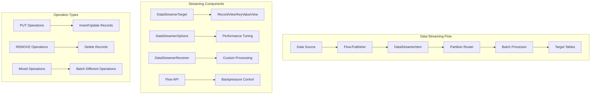

# Chapter 5.1: Data Streaming and High-Throughput Ingestion

Your music platform is dropping play events during peak traffic because traditional message queues can't handle 10 million events per hour while maintaining ACID consistency. When Taylor Swift releases a new album at midnight, your system processes 500,000 concurrent listeners generating 2.5 million track events in the first hour. Traditional INSERT statements create a write bottleneck that causes event loss, delayed analytics, and frustrated users seeing stale recommendation data.

Ignite 3's Data Streaming API solves high-volume ingestion problems through reactive streams that batch events intelligently, route data based on partition locality, and maintain throughput under backpressure. Instead of 2.5 million individual database operations, the streaming API processes thousands of events per second in optimized batches while preserving transaction semantics.

## Working with the Reference Application

The **`08-data-streaming-app`** demonstrates these patterns with music event ingestion that handles burst loads, mixed operation types, and error recovery scenarios:

```bash
cd ignite3-reference-apps/08-data-streaming-app
mvn compile exec:java
```

## Streaming Architecture and Data Flow

The Data Streaming API routes high-volume operations through reactive streams that optimize batch processing and partition locality:



The streaming architecture addresses performance bottlenecks through reactive streams built on Java's Flow API for natural backpressure handling. Intelligent batching groups records by partition to minimize network traffic, while data locality routing ensures records reach their target nodes efficiently. Performance controls tune batch sizes, parallelism levels, and flow rates to match system capacity.

## Building High-Throughput Streaming Operations

### Reactive Stream Implementation

Production music platforms require streaming patterns that handle burst loads without blocking application threads. The basic streaming implementation creates a reactive publisher that feeds records into cluster tables through optimized batches:

```java
import org.apache.ignite.client.IgniteClient;
import org.apache.ignite.table.RecordView;
import org.apache.ignite.table.DataStreamerItem;
import org.apache.ignite.table.DataStreamerOptions;
import org.apache.ignite.table.Tuple;

import java.util.concurrent.Flow;
import java.util.concurrent.SubmissionPublisher;
import java.util.concurrent.CompletableFuture;

/**
 * Handles burst loads from concurrent user sessions during album releases.
 * Configures streaming options to maximize throughput while preventing
 * system overload through backpressure management.
 */
public class BasicTrackEventStreaming {
    
    public void streamTrackEvents(IgniteClient client) throws Exception {
        RecordView<Tuple> trackEventsView = client.tables()
            .table("TrackEvents")
            .recordView();
        
        // Configure streaming options for performance
        DataStreamerOptions options = DataStreamerOptions.builder()
            .pageSize(1000)                    // Records per batch
            .perPartitionParallelOperations(2) // Concurrent requests per partition
            .autoFlushInterval(1000)           // Auto-flush after 1 second
            .retryLimit(16)                    // Retry failed operations
            .build();
        
        // Create publisher for track events
        try (SubmissionPublisher<DataStreamerItem<Tuple>> publisher = 
                new SubmissionPublisher<>()) {
            
            // Start streaming process
            CompletableFuture<Void> streamingFuture = trackEventsView
                .streamData(publisher, options);
            
            // Simulate real-time track events
            for (int i = 0; i < 10000; i++) {
                Tuple trackEvent = Tuple.create()
                    .set("EventId", (long) i)
                    .set("UserId", 1000 + (i % 100))          // 100 different users
                    .set("TrackId", 1 + (i % 50))             // 50 different tracks
                    .set("EventType", "TRACK_STARTED")
                    .set("EventTime", System.currentTimeMillis())
                    .set("Duration", 0);                      // Will be updated when track ends
                
                // Stream as INSERT operation
                publisher.submit(DataStreamerItem.of(trackEvent));
                
                // Simulate event frequency (every 10ms)
                Thread.sleep(10);
            }
            
            // Signal completion and wait for all data to be processed
            publisher.close();
            streamingFuture.get();
            
            System.out.println("Successfully streamed 10,000 track events");
        }
    }
}
```

The streaming implementation addresses the 10 million events per hour problem through several mechanisms. DataStreamerItem wrappers specify operation types (PUT/REMOVE) to optimize batch processing. DataStreamerOptions controls performance tuning for batch sizes and parallelism levels that match cluster capacity. The Flow.Publisher interface provides reactive streams for data production with natural backpressure handling. Automatic batching groups records by partition affinity to minimize network overhead.

### Mixed Operation Streaming

Music platforms need to handle complete track lifecycle events through mixed operations that combine inserts, updates, and deletes within single streaming sessions. This pattern eliminates the need for separate processing pipelines and maintains consistency across related operations:

```java
/**
 * Processes complete track lifecycle events from start to cleanup.
 * Handles INSERT, UPDATE, and DELETE operations within unified streaming
 * sessions to maintain consistency and reduce processing overhead.
 */
public class MixedOperationStreaming {
    
    public void streamTrackLifecycle(IgniteClient client) throws Exception {
        RecordView<Tuple> trackEventsView = client.tables()
            .table("TrackEvents")
            .recordView();
        
        DataStreamerOptions options = DataStreamerOptions.builder()
            .pageSize(500)
            .perPartitionParallelOperations(2)
            .autoFlushInterval(500)
            .retryLimit(8)
            .build();
        
        // Stream mixed operations for track event lifecycle
        try (SubmissionPublisher<DataStreamerItem<Tuple>> publisher = 
                new SubmissionPublisher<>()) {
            
            CompletableFuture<Void> streamingFuture = trackEventsView
                .streamData(publisher, options);
            
            // Simulate complete track listening lifecycle
            for (int sessionId = 1; sessionId <= 1000; sessionId++) {
                int userId = 1000 + (sessionId % 100);
                int trackId = 1 + (sessionId % 50);
                long startTime = System.currentTimeMillis();
                
                // 1. Track started event
                Tuple startEvent = Tuple.create()
                    .set("EventId", (long) sessionId * 3)
                    .set("UserId", userId)
                    .set("TrackId", trackId)
                    .set("EventType", "TRACK_STARTED")
                    .set("EventTime", startTime)
                    .set("Duration", 0);
                
                publisher.submit(DataStreamerItem.of(startEvent)); // PUT operation
                
                // 2. Track completed event (update duration)
                long endTime = startTime + (30000 + (sessionId % 240000)); // 30s to 4.5min
                Tuple completeEvent = Tuple.create()
                    .set("EventId", (long) sessionId * 3 + 1)
                    .set("UserId", userId)
                    .set("TrackId", trackId)
                    .set("EventType", "TRACK_COMPLETED")
                    .set("EventTime", endTime)
                    .set("Duration", endTime - startTime);
                
                publisher.submit(DataStreamerItem.of(completeEvent)); // PUT operation
                
                // 3. Remove old incomplete events (simulate cleanup)
                if (sessionId % 10 == 0) {
                    Tuple obsoleteEvent = Tuple.create()
                        .set("EventId", (long) sessionId * 3 - 30); // Old event ID
                    
                    publisher.submit(DataStreamerItem.removed(obsoleteEvent)); // REMOVE operation
                }
            }
            
            publisher.close();
            streamingFuture.get();
            
            System.out.println("Processed complete track listening lifecycle for 1,000 sessions");
        }
    }
}
```

Mixed operation streaming solves the complexity of maintaining consistent track event data across the complete user interaction lifecycle. PUT operations handle both inserts and updates automatically, detecting whether records exist and applying the appropriate action. REMOVE operations enable efficient bulk deletion without individual queries that would create additional network traffic. Mixed batches optimize different operation types together for network efficiency, reducing the total number of round trips required.

## Maximum Throughput Data Migration

### Historical Data Loading

Music platforms migrating from legacy systems need to load terabytes of historical listening data without disrupting live traffic. Traditional batch loading approaches cause memory exhaustion and block operational workloads. High-throughput streaming enables concurrent data migration while maintaining system availability:

```java
import java.nio.file.Files;
import java.nio.file.Paths;
import java.util.concurrent.ExecutorService;
import java.util.concurrent.Executors;

/**
 * Loads terabytes of historical listening data without blocking live traffic.
 * Optimized for maximum throughput through large batches, high parallelism,
 * and memory-efficient stream processing.
 */
public class BulkTrackDataLoader {
    
    public static void loadHistoricalListeningData(IgniteClient client, String csvFilePath) 
            throws Exception {
        
        RecordView<Tuple> listeningHistoryView = client.tables()
            .table("ListeningHistory")
            .recordView();
        
        // High-throughput configuration for bulk loading
        DataStreamerOptions bulkOptions = DataStreamerOptions.builder()
            .pageSize(5000)                     // Large batches for throughput
            .perPartitionParallelOperations(4)  // High parallelism
            .autoFlushInterval(500)             // Faster flushing
            .retryLimit(32)                     // Higher retry limit for stability
            .build();
        
        // Use larger buffer for high-volume streaming
        ExecutorService executor = Executors.newFixedThreadPool(2);
        
        try (SubmissionPublisher<DataStreamerItem<Tuple>> publisher = 
                new SubmissionPublisher<>(executor, 10000)) { // Large buffer
            
            CompletableFuture<Void> streamingFuture = listeningHistoryView
                .streamData(publisher, bulkOptions);
            
            // Process CSV file in chunks for memory efficiency
            Files.lines(Paths.get(csvFilePath))
                .skip(1) // Skip header
                .forEach(line -> {
                    try {
                        String[] fields = line.split(",");
                        
                        Tuple historyRecord = Tuple.create()
                            .set("RecordId", Long.parseLong(fields[0]))
                            .set("UserId", Integer.parseInt(fields[1]))
                            .set("TrackId", Integer.parseInt(fields[2]))
                            .set("PlayDate", fields[3])
                            .set("PlayCount", Integer.parseInt(fields[4]))
                            .set("Rating", fields[5].isEmpty() ? null : Integer.parseInt(fields[5]))
                            .set("PlayDuration", Integer.parseInt(fields[6]));
                        
                        publisher.submit(DataStreamerItem.of(historyRecord));
                        
                    } catch (Exception e) {
                        System.err.println("Error processing line: " + line + " - " + e.getMessage());
                    }
                });
            
            publisher.close();
            streamingFuture.get();
            
            System.out.println("Successfully loaded historical listening data from " + csvFilePath);
            
        } finally {
            executor.shutdown();
        }
    }
}
```

### Continuous Event Processing

Music platforms need to handle continuous streams of user interaction events that arrive at unpredictable rates. Peak traffic during new releases creates burst loads that can overwhelm traditional processing pipelines. Real-time streaming maintains consistent throughput through adaptive buffering and flow control:

```java
import java.util.concurrent.BlockingQueue;
import java.util.concurrent.LinkedBlockingQueue;
import java.util.concurrent.TimeUnit;

/**
 * Processes continuous user interaction events at variable rates.
 * Handles burst loads through adaptive buffering while maintaining
 * steady throughput during normal traffic conditions.
 */
public class RealTimeEventStreamer {
    private final IgniteClient client;
    private final BlockingQueue<TrackEvent> eventQueue;
    private volatile boolean running = true;
    
    public RealTimeEventStreamer(IgniteClient client) {
        this.client = client;
        this.eventQueue = new LinkedBlockingQueue<>(100000); // Large buffer for bursts
    }
    
    public void startStreaming() {
        RecordView<Tuple> eventsView = client.tables()
            .table("RealTimeEvents")
            .recordView();
        
        DataStreamerOptions streamingOptions = DataStreamerOptions.builder()
            .pageSize(2000)                    // Balanced batch size
            .perPartitionParallelOperations(3) // High concurrency
            .autoFlushInterval(200)            // Fast response time
            .retryLimit(8)                     // Reasonable retry limit
            .build();
        
        CompletableFuture.runAsync(() -> {
            try (SubmissionPublisher<DataStreamerItem<Tuple>> publisher = 
                    new SubmissionPublisher<>()) {
                
                CompletableFuture<Void> streamingFuture = eventsView
                    .streamData(publisher, streamingOptions);
                
                while (running) {
                    try {
                        // Poll for events with timeout to check running status
                        TrackEvent event = eventQueue.poll(100, TimeUnit.MILLISECONDS);
                        if (event != null) {
                            Tuple eventTuple = createEventTuple(event);
                            publisher.submit(DataStreamerItem.of(eventTuple));
                        }
                        
                    } catch (InterruptedException e) {
                        Thread.currentThread().interrupt();
                        break;
                    }
                }
                
                publisher.close();
                streamingFuture.get();
                
            } catch (Exception e) {
                System.err.println("Real-time streaming error: " + e.getMessage());
            }
        });
    }
    
    public void addEvent(TrackEvent event) {
        if (!eventQueue.offer(event)) {
            System.err.println("Event queue full, dropping event: " + event);
        }
    }
    
    public void stop() {
        running = false;
    }
    
    private Tuple createEventTuple(TrackEvent event) {
        return Tuple.create()
            .set("EventId", event.getId())
            .set("UserId", event.getUserId())
            .set("TrackId", event.getTrackId())
            .set("EventType", event.getType().name())
            .set("EventTime", event.getTimestamp())
            .set("Metadata", event.getMetadata());
    }
}
```

## Handling System Overload Through Backpressure

### Adaptive Flow Management

Peak traffic events like album releases generate event bursts that can overwhelm downstream processing capacity. Without proper flow control, systems either drop events or exhaust memory trying to buffer unlimited data. Adaptive publishers implement backpressure mechanisms that slow data production when consumers signal capacity constraints:

```java
import java.util.concurrent.Flow;
import java.util.concurrent.atomic.AtomicBoolean;
import java.util.concurrent.atomic.AtomicLong;
import java.util.concurrent.atomic.AtomicInteger;

/**
 * Responds to downstream capacity signals to prevent system overload.
 * Implements demand-based flow control that adjusts production rates
 * based on consumer processing capacity.
 */
public class AdaptiveTrackEventPublisher implements Flow.Publisher<DataStreamerItem<Tuple>> {
    private final List<TrackEvent> events;
    private final AtomicBoolean subscribed = new AtomicBoolean(false);
    
    public AdaptiveTrackEventPublisher(List<TrackEvent> events) {
        this.events = new ArrayList<>(events);
    }
    
    @Override
    public void subscribe(Flow.Subscriber<? super DataStreamerItem<Tuple>> subscriber) {
        if (subscribed.compareAndSet(false, true)) {
            subscriber.onSubscribe(new AdaptiveSubscription(subscriber));
        } else {
            subscriber.onError(new IllegalStateException("Publisher already subscribed"));
        }
    }
    
    private class AdaptiveSubscription implements Flow.Subscription {
        private final Flow.Subscriber<? super DataStreamerItem<Tuple>> subscriber;
        private final AtomicLong demand = new AtomicLong(0);
        private final AtomicInteger currentIndex = new AtomicInteger(0);
        private volatile boolean cancelled = false;
        
        public AdaptiveSubscription(Flow.Subscriber<? super DataStreamerItem<Tuple>> subscriber) {
            this.subscriber = subscriber;
        }
        
        @Override
        public void request(long n) {
            if (n <= 0) {
                subscriber.onError(new IllegalArgumentException("Request must be positive"));
                return;
            }
            
            long currentDemand = demand.addAndGet(n);
            deliverItems(currentDemand);
        }
        
        @Override
        public void cancel() {
            cancelled = true;
        }
        
        private void deliverItems(long requestedItems) {
            CompletableFuture.runAsync(() -> {
                long delivered = 0;
                
                while (delivered < requestedItems && !cancelled) {
                    int index = currentIndex.getAndIncrement();
                    
                    if (index >= events.size()) {
                        subscriber.onComplete();
                        return;
                    }
                    
                    TrackEvent event = events.get(index);
                    Tuple eventTuple = Tuple.create()
                        .set("EventId", event.getId())
                        .set("UserId", event.getUserId())
                        .set("TrackId", event.getTrackId())
                        .set("EventType", event.getType().name())
                        .set("EventTime", event.getTimestamp());
                    
                    try {
                        subscriber.onNext(DataStreamerItem.of(eventTuple));
                        delivered++;
                        
                        // Adaptive rate limiting based on system performance
                        if (delivered % 1000 == 0) {
                            Thread.sleep(10); // Small pause every 1000 items
                        }
                        
                    } catch (Exception e) {
                        subscriber.onError(e);
                        return;
                    }
                }
                
                // Update demand counter
                demand.addAndGet(-delivered);
            });
        }
    }
}
```

## Production Error Recovery

### Resilient Stream Processing

Network partitions, node failures, and temporary capacity overloads can disrupt streaming operations and cause data loss. Production systems need comprehensive error handling that includes retry logic, exponential backoff, and operational metrics to maintain data integrity during failure scenarios:

```java
import java.util.concurrent.atomic.AtomicLong;

/**
 * Maintains data integrity during network partitions and node failures.
 * Implements retry logic with exponential backoff and operational metrics
 * to handle various failure scenarios without data loss.
 */
public class RobustMusicEventStreamer {
    private final IgniteClient client;
    private final AtomicLong successCount = new AtomicLong(0);
    private final AtomicLong errorCount = new AtomicLong(0);
    
    public RobustMusicEventStreamer(IgniteClient client) {
        this.client = client;
    }
    
    public CompletableFuture<StreamingResult> streamEventsWithRecovery(
            List<TrackEvent> events) {
        
        return CompletableFuture.supplyAsync(() -> {
            RecordView<Tuple> eventsView = client.tables()
                .table("RobustEvents")
                .recordView();
            
            // Retry configuration for resilience
            DataStreamerOptions resilientOptions = DataStreamerOptions.builder()
                .pageSize(500)                     // Smaller batches for error isolation
                .perPartitionParallelOperations(1) // Single-threaded for error tracking
                .autoFlushInterval(1000)           // Regular flushing
                .retryLimit(32)                    // High retry limit
                .build();
            
            int maxRetries = 3;
            int currentRetry = 0;
            
            while (currentRetry < maxRetries) {
                try {
                    return attemptStreaming(eventsView, events, resilientOptions);
                    
                } catch (Exception e) {
                    currentRetry++;
                    errorCount.incrementAndGet();
                    
                    System.err.println("Streaming attempt " + currentRetry + " failed: " + 
                        e.getMessage());
                    
                    if (currentRetry < maxRetries) {
                        try {
                            // Exponential backoff
                            Thread.sleep(1000 * (1L << (currentRetry - 1)));
                        } catch (InterruptedException ie) {
                            Thread.currentThread().interrupt();
                            throw new RuntimeException("Streaming interrupted", ie);
                        }
                    }
                }
            }
            
            throw new RuntimeException("Failed to stream after " + maxRetries + " attempts");
        });
    }
    
    private StreamingResult attemptStreaming(RecordView<Tuple> eventsView, 
                                           List<TrackEvent> events,
                                           DataStreamerOptions options) throws Exception {
        
        try (SubmissionPublisher<DataStreamerItem<Tuple>> publisher = 
                new SubmissionPublisher<>()) {
            
            CompletableFuture<Void> streamingFuture = eventsView.streamData(publisher, options);
            
            // Submit events with validation
            for (TrackEvent event : events) {
                if (isValidEvent(event)) {
                    Tuple eventTuple = convertEventToTuple(event);
                    publisher.submit(DataStreamerItem.of(eventTuple));
                    successCount.incrementAndGet();
                } else {
                    System.err.println("Skipping invalid event: " + event);
                    errorCount.incrementAndGet();
                }
            }
            
            publisher.close();
            streamingFuture.get();
            
            return new StreamingResult(successCount.get(), errorCount.get(), true);
        }
    }
    
    private boolean isValidEvent(TrackEvent event) {
        return event != null && 
               event.getId() > 0 && 
               event.getUserId() > 0 && 
               event.getTrackId() > 0 &&
               event.getTimestamp() > 0;
    }
    
    private Tuple convertEventToTuple(TrackEvent event) {
        return Tuple.create()
            .set("EventId", event.getId())
            .set("UserId", event.getUserId())
            .set("TrackId", event.getTrackId())
            .set("EventType", event.getType().name())
            .set("EventTime", event.getTimestamp())
            .set("StreamedAt", System.currentTimeMillis());
    }
    
    public long getSuccessCount() { return successCount.get(); }
    public long getErrorCount() { return errorCount.get(); }
}

// Helper classes
class StreamingResult {
    private final long successCount;
    private final long errorCount;
    private final boolean completed;
    
    public StreamingResult(long successCount, long errorCount, boolean completed) {
        this.successCount = successCount;
        this.errorCount = errorCount;
        this.completed = completed;
    }
    
    // Getters...
}

class TrackEvent {
    private final long id;
    private final int userId;
    private final int trackId;
    private final EventType type;
    private final long timestamp;
    private final String metadata;
    
    // Constructor and getters...
}

enum EventType {
    TRACK_PLAY, TRACK_PAUSE, TRACK_SKIP, TRACK_COMPLETE
}
```

## Streaming Patterns for Production Scale

Data streaming solves the fundamental challenge of processing millions of concurrent user events without creating system bottlenecks. Reactive streams provide natural backpressure handling that prevents memory exhaustion during traffic bursts. Intelligent batching groups operations by partition affinity to minimize network overhead and maximize cluster utilization. Mixed operation support enables complete event lifecycle processing within single streaming sessions.

The error recovery patterns ensure data integrity during network partitions and node failures through retry logic and exponential backoff strategies. Adaptive flow control responds to downstream capacity constraints to prevent system overload while maintaining consistent throughput.

High-throughput streaming enables music platforms to handle album release traffic, migrate legacy data, and process continuous user interactions without dropping events or blocking operational workloads. These patterns provide the foundation for real-time analytics and personalized recommendations that depend on timely event processing.

## Next Steps

Streaming operations generate large volumes of frequently accessed data that requires intelligent caching strategies to maintain query performance:

- **[Chapter 5.2: Caching Strategies and Performance Optimization](02-caching-strategies.md)** - Implement data access patterns that complement streaming operations with intelligent caching for frequently requested content

- **[Chapter 5.3: Query Performance and Index Optimization](03-query-performance.md)** - Optimize SQL performance and indexing strategies for high-volume streaming data patterns
