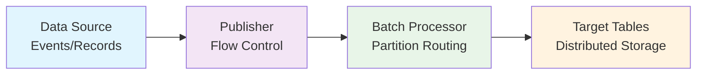
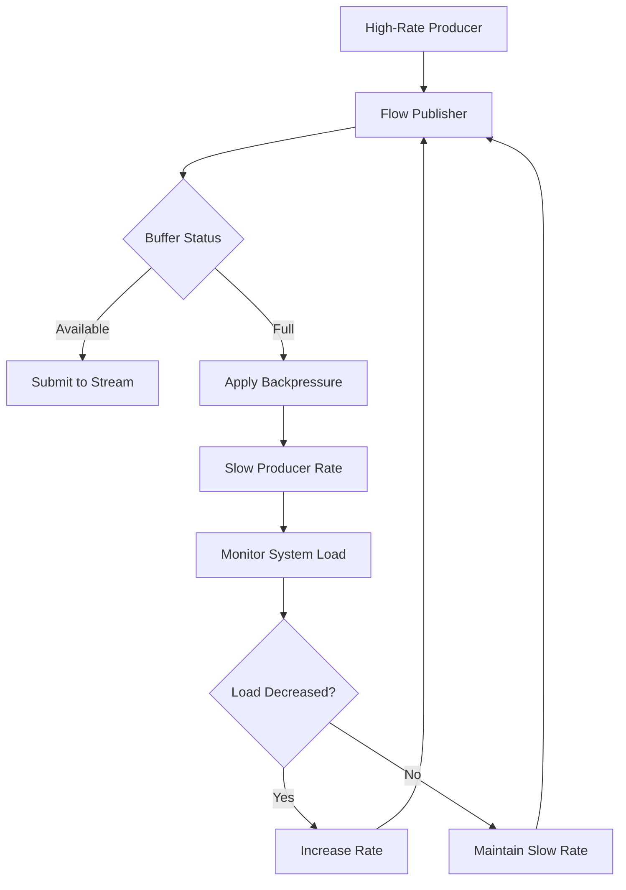

<!--
Licensed under Creative Commons Attribution-ShareAlike 4.0 International (CC BY-SA 4.0)
SPDX-License-Identifier: CC-BY-SA-4.0
For full license text, see LICENSE-CC-BY-SA-4.0
-->

# Chapter 5.1: Data Streaming and High-Throughput Ingestion

Your music platform is dropping play events during peak traffic because traditional message queues can't handle 10 million events per hour while maintaining ACID consistency. When Taylor Swift releases a new album at midnight, your system processes 500,000 concurrent listeners generating 2.5 million track events in the first hour. Traditional INSERT statements create a write bottleneck that causes event loss, delayed analytics, and frustrated users seeing stale recommendation data.

Ignite 3's Data Streaming API solves high-volume ingestion problems through reactive streams that batch events intelligently, route data based on partition locality, and maintain throughput under backpressure. Instead of 2.5 million individual database operations, the streaming API processes thousands of events per second in optimized batches while preserving transaction semantics.

## Working with the Reference Applications

The streaming reference applications demonstrate high-throughput ingestion patterns with comprehensive production examples:

### Data Streaming Module

The **`08-data-streaming-app`** demonstrates core streaming patterns with music event ingestion:

```bash
cd ignite3-reference-apps/08-data-streaming-app
mvn compile exec:java
```

Features:

- **BasicDataStreamerDemo** - Fundamental streaming patterns and configuration
- **BulkDataIngestion** - High-volume data loading optimization
- **BackpressureHandling** - Flow control and adaptive rate limiting

### File Streaming Module  

The **`10-file-streaming-app`** demonstrates file-based streaming with backpressure control:

```bash
cd ignite3-reference-apps/10-file-streaming-app
mvn compile exec:java
```

Features:

- **FileStreamingPublisher** - File-based event streaming with reactive patterns
- **FileBackpressureStreaming** - Advanced flow control for large file processing
- **SampleDataGenerator** - Realistic data generation for testing streaming scenarios
- **StreamingMetrics** - Performance monitoring and resource utilization tracking

Both applications handle burst loads, mixed operation types, and error recovery scenarios using production-ready patterns.

## Streaming Architecture Overview

### The Streaming Problem

Traditional database operations become bottlenecks when processing millions of events per hour:

- **Network Overhead** - Each INSERT requires a round trip to the cluster
- **Transaction Coordination** - Individual operations require distributed coordination  
- **Connection Pool Exhaustion** - Separate connections for each operation
- **Partition Routing Overhead** - Each record requires separate partition lookup

At scale, this creates exponential overhead that overwhelms network capacity and exhausts system resources.

### Reactive Streaming Solution

Ignite 3's Data Streaming API implements the Reactive Streams Specification through four key principles:



**1. Asynchronous Processing** - Streams operate on separate threads, preventing blocking
**2. Non-blocking Backpressure** - System slows production rather than dropping events
**3. Demand-driven Flow Control** - Consumers signal capacity to producers
**4. Fault Tolerance** - Built-in retry with exponential backoff

### Backpressure Management



Backpressure mechanisms prevent system overload through feedback loops that adapt production rates based on downstream processing capacity.

## Core Streaming Components

### DataStreamerItem

Wraps operations and specifies their type:

```java
// PUT operation (insert/update)
DataStreamerItem<Tuple> putItem = DataStreamerItem.of(recordTuple);

// REMOVE operation (delete)
DataStreamerItem<Tuple> removeItem = DataStreamerItem.removed(keyTuple);
```

### DataStreamerOptions

Controls streaming performance characteristics:

```java
DataStreamerOptions options = DataStreamerOptions.builder()
    .pageSize(2000)                     // Records per batch
    .perPartitionParallelOperations(4)  // Concurrent operations per partition
    .autoFlushInterval(500)             // Automatic flush timeout (ms)
    .retryLimit(16)                     // Maximum retry attempts
    .build();
```

### Flow.Publisher Integration

Provides reactive streaming with built-in backpressure:

```java
SubmissionPublisher<DataStreamerItem<Tuple>> publisher = new SubmissionPublisher<>();

// Submit operations to stream
publisher.submit(DataStreamerItem.of(trackEvent));

// Signal completion
publisher.close();
```

### RecordView Streaming

Connects publishers to target tables:

```java
RecordView<Tuple> eventsView = client.tables()
    .table("TrackEvents")
    .recordView();

CompletableFuture<Void> streamingResult = eventsView
    .streamData(publisher, options);
```

## Basic Streaming Pattern

The fundamental streaming workflow follows a standard pattern:

```java
import org.apache.ignite.client.IgniteClient;
import org.apache.ignite.table.*;
import java.util.concurrent.Flow;
import java.util.concurrent.SubmissionPublisher;

public class BasicEventStreaming {
    
    public void streamTrackEvents(IgniteClient client) throws Exception {
        // 1. Get table view
        RecordView<Tuple> eventsView = client.tables()
            .table("TrackEvents")
            .recordView();
        
        // 2. Configure streaming options
        DataStreamerOptions options = DataStreamerOptions.builder()
            .pageSize(1000)
            .perPartitionParallelOperations(2)
            .autoFlushInterval(1000)
            .retryLimit(16)
            .build();
        
        // 3. Create publisher
        try (SubmissionPublisher<DataStreamerItem<Tuple>> publisher = 
                new SubmissionPublisher<>()) {
            
            // 4. Start streaming
            CompletableFuture<Void> streamingFuture = eventsView
                .streamData(publisher, options);
            
            // 5. Submit events
            for (int i = 0; i < 10000; i++) {
                Tuple trackEvent = Tuple.create()
                    .set("EventId", (long) i)
                    .set("UserId", 1000 + (i % 100))
                    .set("TrackId", 1 + (i % 50))
                    .set("EventType", "TRACK_STARTED")
                    .set("EventTime", System.currentTimeMillis());
                
                publisher.submit(DataStreamerItem.of(trackEvent));
            }
            
            // 6. Complete streaming
            publisher.close();
            streamingFuture.get();
        }
    }
}
```

## Streaming Patterns

### Mixed Operations

Handle complete event lifecycles with INSERT, UPDATE, and DELETE operations:

```java
// Track started
publisher.submit(DataStreamerItem.of(startEvent));     // PUT

// Track completed  
publisher.submit(DataStreamerItem.of(completeEvent));  // PUT

// Remove old events
publisher.submit(DataStreamerItem.removed(oldEvent));  // REMOVE
```

### Bulk Data Loading

High-throughput configuration for historical data migration:

```java
DataStreamerOptions bulkOptions = DataStreamerOptions.builder()
    .pageSize(5000)                     // Large batches for throughput
    .perPartitionParallelOperations(4)  // High parallelism
    .autoFlushInterval(500)             // Faster flushing
    .retryLimit(32)                     // Higher retry limit
    .build();

// Use larger buffer for high-volume streaming
SubmissionPublisher<DataStreamerItem<Tuple>> publisher = 
    new SubmissionPublisher<>(executor, 10000);
```

### Continuous Event Processing

Real-time streaming for ongoing user interactions:

```java
public class RealTimeEventStreamer {
    private final BlockingQueue<TrackEvent> eventQueue;
    
    public void startStreaming() {
        CompletableFuture.runAsync(() -> {
            while (running) {
                TrackEvent event = eventQueue.poll(100, TimeUnit.MILLISECONDS);
                if (event != null) {
                    publisher.submit(DataStreamerItem.of(createEventTuple(event)));
                }
            }
        });
    }
}
```

## Backpressure and Flow Control

### Adaptive Publishers

Implement demand-based flow control:

```java
public class AdaptivePublisher implements Flow.Publisher<DataStreamerItem<Tuple>> {
    
    @Override
    public void subscribe(Flow.Subscriber<? super DataStreamerItem<Tuple>> subscriber) {
        subscriber.onSubscribe(new AdaptiveSubscription(subscriber));
    }
    
    private class AdaptiveSubscription implements Flow.Subscription {
        private final AtomicLong demand = new AtomicLong(0);
        
        @Override
        public void request(long n) {
            long currentDemand = demand.addAndGet(n);
            deliverItems(currentDemand);
        }
        
        private void deliverItems(long requestedItems) {
            // Deliver items based on demand signals
            // Apply rate limiting based on system performance
        }
    }
}
```

### Error Recovery

Production systems require comprehensive error handling:

```java
public CompletableFuture<StreamingResult> streamWithRecovery(List<TrackEvent> events) {
    int maxRetries = 3;
    int currentRetry = 0;
    
    while (currentRetry < maxRetries) {
        try {
            return attemptStreaming(events);
        } catch (Exception e) {
            currentRetry++;
            if (currentRetry < maxRetries) {
                // Exponential backoff
                Thread.sleep(1000 * (1L << (currentRetry - 1)));
            }
        }
    }
    
    throw new RuntimeException("Failed after " + maxRetries + " attempts");
}
```

## Performance Optimization

### Batch Size Tuning

- **Large batches (2000-5000)** - Better network efficiency, higher memory usage
- **Small batches (500-1000)** - Lower latency, more network traffic
- **Balance based on** - Data size, network capacity, processing requirements

### Partition Awareness

Group related records by partition affinity:

```java
// Colocate events by ArtistId for efficiency
Tuple artistKey = Tuple.create(Map.of("ArtistId", artistId));
// Events for this artist will be processed together
```

### Parallelism Control

Balance throughput with cluster capacity:

```java
DataStreamerOptions options = DataStreamerOptions.builder()
    .perPartitionParallelOperations(2)  // Conservative for stability
    // or
    .perPartitionParallelOperations(8)  // Aggressive for throughput
    .build();
```

## Production Considerations

### Reliability Patterns

- **Retry with Exponential Backoff** - Handle transient failures gracefully
- **Error Isolation** - Process in smaller batches to isolate errors
- **Buffer Management** - Monitor utilization and implement overflow handling
- **Health Monitoring** - Track throughput, error rates, buffer utilization

### Operational Benefits

High-throughput streaming enables music platforms to:

- Handle album release traffic spikes without dropping events
- Migrate terabytes of historical data without blocking live operations
- Process continuous user interactions for real-time analytics  
- Maintain ACID consistency while achieving millions of operations per hour

### Advanced Patterns

The reference applications demonstrate production-scale patterns including:

- **File-based Streaming** - Process large data files with memory efficiency
- **Adaptive Flow Control** - Dynamic rate adjustment based on system performance
- **Metrics Collection** - Real-time monitoring of streaming performance
- **Circuit Breaker Patterns** - Protect against cascading failures
- **Custom Publishers** - Implement domain-specific flow control logic

---

Data streaming transforms high-volume ingestion from a bottleneck into a scalable foundation for real-time analytics and operational systems. By batching operations intelligently and applying backpressure naturally, streaming maintains performance and reliability under variable load conditions.

**Continue to**: **[Caching Strategies](02-caching-strategies.md)** - Implement intelligent caching patterns that reduce database load while ensuring data consistency and optimal read performance.
