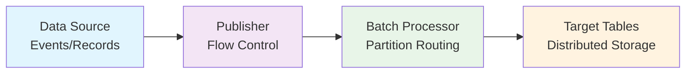
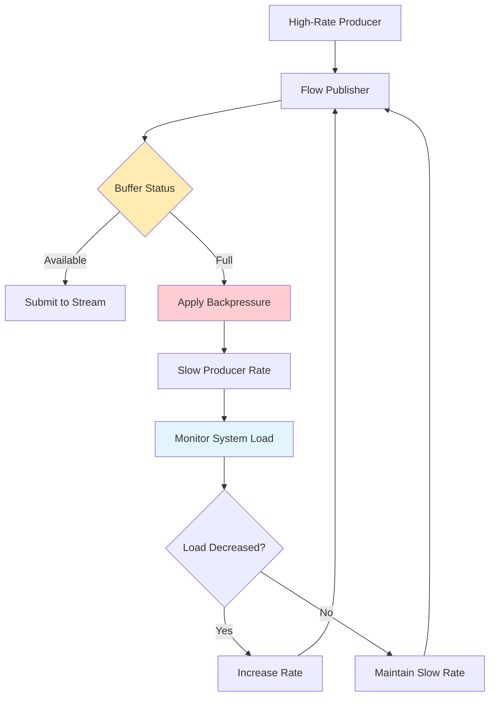
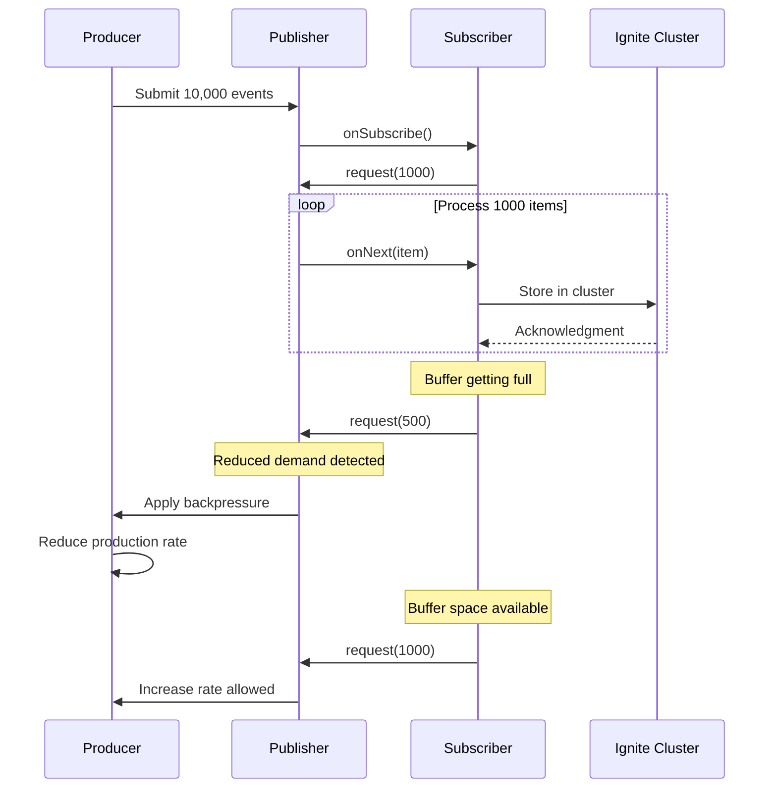

# Chapter 5.1: Data Streaming and High-Throughput Ingestion

Your music platform is dropping play events during peak traffic because traditional message queues can't handle 10 million events per hour while maintaining ACID consistency. When Taylor Swift releases a new album at midnight, your system processes 500,000 concurrent listeners generating 2.5 million track events in the first hour. Traditional INSERT statements create a write bottleneck that causes event loss, delayed analytics, and frustrated users seeing stale recommendation data.

Ignite 3's Data Streaming API solves high-volume ingestion problems through reactive streams that batch events intelligently, route data based on partition locality, and maintain throughput under backpressure. Instead of 2.5 million individual database operations, the streaming API processes thousands of events per second in optimized batches while preserving transaction semantics.

## Working with the Reference Application

The **`08-data-streaming-app`** demonstrates these patterns with music event ingestion that handles burst loads, mixed operation types, and error recovery scenarios:

```bash
cd ignite3-reference-apps/08-data-streaming-app
mvn compile exec:java
```

## Streaming Fundamentals: Reactive Data Processing

### The Streaming Problem

Traditional database insert operations become bottlenecks when processing millions of events per hour. Each INSERT statement requires:

- Network round trip to the cluster
- Transaction coordination across nodes  
- Individual acknowledgment back to the client
- Separate partition routing for each record

At scale, this creates exponential overhead. A music platform processing 500,000 concurrent users during an album release would generate 2.5 million individual database operations in the first hour, overwhelming network capacity and exhausting connection pools.

### Reactive Streaming Solutions

Ignite 3's Data Streaming API implements the Reactive Streams Specification to solve high-throughput ingestion through four key principles:

**1. Asynchronous Processing**
Streams operate on separate threads from application logic, preventing blocking operations that would freeze user interfaces during bulk data processing.

**2. Non-blocking Backpressure**
When consumers cannot keep up with producers, the system applies backpressure by slowing data production rather than dropping events or exhausting memory.

**3. Demand-driven Flow Control**
Consumers signal their capacity to producers, ensuring data flows at sustainable rates that match downstream processing capabilities.

**4. Fault Tolerance**
Streaming operations include built-in retry mechanisms with exponential backoff to handle network partitions and temporary node failures.

### Ignite 3's Streaming Architecture

The streaming system processes data through three connected stages:



**Data Source**: Applications generate events at variable rates, from steady user interactions to burst loads during peak traffic.

**Publisher**: Flow.Publisher implementations manage data production rates and coordinate with downstream consumers through backpressure signals.

**Batch Processor**: DataStreamerItem objects group operations by partition affinity and optimize network utilization through intelligent batching.

**Target Tables**: RecordView and KeyValueView APIs apply batched operations to distributed tables while maintaining consistency.

### Backpressure Management in Ignite 3

Ignite 3 implements sophisticated backpressure handling that prevents system overload:



Backpressure mechanisms work through several feedback loops:

- **Buffer Monitoring**: Publishers track buffer utilization and signal capacity constraints to producers
- **Rate Adaptation**: Producer threads respond to capacity signals by increasing or decreasing event generation rates
- **Demand Signaling**: Consumers request specific numbers of items, preventing unlimited data buffering
- **Load Balancing**: The system distributes backpressure across multiple producer threads to maintain overall throughput

### Exponential Backoff Algorithm

When streaming operations encounter failures, Ignite 3 applies exponential backoff to prevent overwhelming struggling nodes:

```java
// Backoff calculation: delay = baseDelay * (2^retryAttempt) + jitter
long delay = 1000 * (1L << retryAttempt) + random.nextInt(500);
```

The backoff algorithm serves multiple purposes:

**Failure Recovery**: Temporary network issues or node overload can resolve themselves given sufficient time
**Resource Protection**: Prevents failed operations from consuming excessive system resources through repeated immediate retries
**Distributed Coordination**: Reduces thundering herd effects when multiple clients experience similar failures
**Progressive Delay**: Increases delay exponentially (1s, 2s, 4s, 8s) to give systems time to recover

Jitter adds randomness to prevent synchronized retry attempts across multiple clients that could create periodic load spikes.

## Core Streaming API Components

Before implementing streaming solutions, understanding the key API components helps architect effective data ingestion patterns.

### DataStreamerItem: Operation Wrapper

DataStreamerItem wraps individual operations and specifies their type:

```java
// PUT operation (insert/update)
DataStreamerItem<Tuple> putItem = DataStreamerItem.of(recordTuple);

// REMOVE operation (delete)
DataStreamerItem<Tuple> removeItem = DataStreamerItem.removed(keyTuple);
```

PUT operations handle both inserts and updates automatically. If a record with the same primary key exists, it gets updated; otherwise, a new record is inserted. REMOVE operations delete records by primary key, ignoring non-existent keys without errors.

### DataStreamerOptions: Performance Configuration

DataStreamerOptions controls streaming performance characteristics:

```java
DataStreamerOptions options = DataStreamerOptions.builder()
    .pageSize(2000)                     // Records per batch
    .perPartitionParallelOperations(4)  // Concurrent operations per partition
    .autoFlushInterval(500)             // Automatic flush timeout (ms)
    .retryLimit(16)                     // Maximum retry attempts
    .build();
```

**pageSize**: Balances throughput and memory usage. Larger batches improve network efficiency but consume more memory.

**perPartitionParallelOperations**: Controls parallelism per partition. Higher values increase throughput but may overwhelm individual nodes.

**autoFlushInterval**: Forces batch processing after specified milliseconds, preventing indefinite buffering of partial batches.

**retryLimit**: Maximum retry attempts for failed operations before giving up. Higher values improve resilience but may delay error reporting.

### Flow.Publisher: Data Production Control

Java's Flow.Publisher interface provides reactive streaming with built-in backpressure:

```java
SubmissionPublisher<DataStreamerItem<Tuple>> publisher = new SubmissionPublisher<>();

// Submit operations to stream
publisher.submit(DataStreamerItem.of(trackEvent));

// Signal completion
publisher.close();
```

SubmissionPublisher handles subscriber coordination, demand signaling, and buffer management automatically. Applications focus on data production while the publisher manages flow control.

### RecordView Streaming Integration

RecordView.streamData() connects publishers to target tables:

```java
RecordView<Tuple> eventsView = client.tables()
    .table("TrackEvents")
    .recordView();

CompletableFuture<Void> streamingResult = eventsView
    .streamData(publisher, options);
```

The streaming operation returns immediately with a CompletableFuture that completes when all data has been processed or an error occurs.

## Building High-Throughput Streaming Operations

### Reactive Stream Implementation

Production music platforms require streaming patterns that handle burst loads without blocking application threads. The basic streaming implementation creates a reactive publisher that feeds records into cluster tables through optimized batches:

```java
import org.apache.ignite.client.IgniteClient;
import org.apache.ignite.table.RecordView;
import org.apache.ignite.table.DataStreamerItem;
import org.apache.ignite.table.DataStreamerOptions;
import org.apache.ignite.table.Tuple;

import java.util.concurrent.Flow;
import java.util.concurrent.SubmissionPublisher;
import java.util.concurrent.CompletableFuture;

/**
 * Handles burst loads from concurrent user sessions during album releases.
 * Configures streaming options to maximize throughput while preventing
 * system overload through backpressure management.
 */
public class BasicTrackEventStreaming {
    
    public void streamTrackEvents(IgniteClient client) throws Exception {
        RecordView<Tuple> trackEventsView = client.tables()
            .table("TrackEvents")
            .recordView();
        
        // Configure streaming options for performance
        DataStreamerOptions options = DataStreamerOptions.builder()
            .pageSize(1000)                    // Records per batch
            .perPartitionParallelOperations(2) // Concurrent requests per partition
            .autoFlushInterval(1000)           // Auto-flush after 1 second
            .retryLimit(16)                    // Retry failed operations
            .build();
        
        // Create publisher for track events
        try (SubmissionPublisher<DataStreamerItem<Tuple>> publisher = 
                new SubmissionPublisher<>()) {
            
            // Start streaming process
            CompletableFuture<Void> streamingFuture = trackEventsView
                .streamData(publisher, options);
            
            // Simulate real-time track events
            for (int i = 0; i < 10000; i++) {
                Tuple trackEvent = Tuple.create()
                    .set("EventId", (long) i)
                    .set("UserId", 1000 + (i % 100))          // 100 different users
                    .set("TrackId", 1 + (i % 50))             // 50 different tracks
                    .set("EventType", "TRACK_STARTED")
                    .set("EventTime", System.currentTimeMillis())
                    .set("Duration", 0);                      // Will be updated when track ends
                
                // Stream as INSERT operation
                publisher.submit(DataStreamerItem.of(trackEvent));
                
                // Simulate event frequency (every 10ms)
                Thread.sleep(10);
            }
            
            // Signal completion and wait for all data to be processed
            publisher.close();
            streamingFuture.get();
            
            System.out.println("Successfully streamed 10,000 track events");
        }
    }
}
```

The streaming implementation addresses the 10 million events per hour problem through several mechanisms. DataStreamerItem wrappers specify operation types (PUT/REMOVE) to optimize batch processing. DataStreamerOptions controls performance tuning for batch sizes and parallelism levels that match cluster capacity. The Flow.Publisher interface provides reactive streams for data production with natural backpressure handling. Automatic batching groups records by partition affinity to minimize network overhead.

### Mixed Operation Streaming

Music platforms need to handle complete track lifecycle events through mixed operations that combine inserts, updates, and deletes within single streaming sessions. This pattern eliminates the need for separate processing pipelines and maintains consistency across related operations:

```java
/**
 * Processes complete track lifecycle events from start to cleanup.
 * Handles INSERT, UPDATE, and DELETE operations within unified streaming
 * sessions to maintain consistency and reduce processing overhead.
 */
public class MixedOperationStreaming {
    
    public void streamTrackLifecycle(IgniteClient client) throws Exception {
        RecordView<Tuple> trackEventsView = client.tables()
            .table("TrackEvents")
            .recordView();
        
        DataStreamerOptions options = DataStreamerOptions.builder()
            .pageSize(500)
            .perPartitionParallelOperations(2)
            .autoFlushInterval(500)
            .retryLimit(8)
            .build();
        
        // Stream mixed operations for track event lifecycle
        try (SubmissionPublisher<DataStreamerItem<Tuple>> publisher = 
                new SubmissionPublisher<>()) {
            
            CompletableFuture<Void> streamingFuture = trackEventsView
                .streamData(publisher, options);
            
            // Simulate complete track listening lifecycle
            for (int sessionId = 1; sessionId <= 1000; sessionId++) {
                int userId = 1000 + (sessionId % 100);
                int trackId = 1 + (sessionId % 50);
                long startTime = System.currentTimeMillis();
                
                // 1. Track started event
                Tuple startEvent = Tuple.create()
                    .set("EventId", (long) sessionId * 3)
                    .set("UserId", userId)
                    .set("TrackId", trackId)
                    .set("EventType", "TRACK_STARTED")
                    .set("EventTime", startTime)
                    .set("Duration", 0);
                
                publisher.submit(DataStreamerItem.of(startEvent)); // PUT operation
                
                // 2. Track completed event (update duration)
                long endTime = startTime + (30000 + (sessionId % 240000)); // 30s to 4.5min
                Tuple completeEvent = Tuple.create()
                    .set("EventId", (long) sessionId * 3 + 1)
                    .set("UserId", userId)
                    .set("TrackId", trackId)
                    .set("EventType", "TRACK_COMPLETED")
                    .set("EventTime", endTime)
                    .set("Duration", endTime - startTime);
                
                publisher.submit(DataStreamerItem.of(completeEvent)); // PUT operation
                
                // 3. Remove old incomplete events (simulate cleanup)
                if (sessionId % 10 == 0) {
                    Tuple obsoleteEvent = Tuple.create()
                        .set("EventId", (long) sessionId * 3 - 30); // Old event ID
                    
                    publisher.submit(DataStreamerItem.removed(obsoleteEvent)); // REMOVE operation
                }
            }
            
            publisher.close();
            streamingFuture.get();
            
            System.out.println("Processed complete track listening lifecycle for 1,000 sessions");
        }
    }
}
```

Mixed operation streaming solves the complexity of maintaining consistent track event data across the complete user interaction lifecycle. PUT operations handle both inserts and updates automatically, detecting whether records exist and applying the appropriate action. REMOVE operations enable efficient bulk deletion without individual queries that would create additional network traffic. Mixed batches optimize different operation types together for network efficiency, reducing the total number of round trips required.

## Maximum Throughput Data Migration

### Historical Data Loading

Music platforms migrating from legacy systems need to load terabytes of historical listening data without disrupting live traffic. Traditional batch loading approaches cause memory exhaustion and block operational workloads. High-throughput streaming enables concurrent data migration while maintaining system availability:

```java
import java.nio.file.Files;
import java.nio.file.Paths;
import java.util.concurrent.ExecutorService;
import java.util.concurrent.Executors;

/**
 * Loads terabytes of historical listening data without blocking live traffic.
 * Optimized for maximum throughput through large batches, high parallelism,
 * and memory-efficient stream processing.
 */
public class BulkTrackDataLoader {
    
    public static void loadHistoricalListeningData(IgniteClient client, String csvFilePath) 
            throws Exception {
        
        RecordView<Tuple> listeningHistoryView = client.tables()
            .table("ListeningHistory")
            .recordView();
        
        // High-throughput configuration for bulk loading
        DataStreamerOptions bulkOptions = DataStreamerOptions.builder()
            .pageSize(5000)                     // Large batches for throughput
            .perPartitionParallelOperations(4)  // High parallelism
            .autoFlushInterval(500)             // Faster flushing
            .retryLimit(32)                     // Higher retry limit for stability
            .build();
        
        // Use larger buffer for high-volume streaming
        ExecutorService executor = Executors.newFixedThreadPool(2);
        
        try (SubmissionPublisher<DataStreamerItem<Tuple>> publisher = 
                new SubmissionPublisher<>(executor, 10000)) { // Large buffer
            
            CompletableFuture<Void> streamingFuture = listeningHistoryView
                .streamData(publisher, bulkOptions);
            
            // Process CSV file in chunks for memory efficiency
            Files.lines(Paths.get(csvFilePath))
                .skip(1) // Skip header
                .forEach(line -> {
                    try {
                        String[] fields = line.split(",");
                        
                        Tuple historyRecord = Tuple.create()
                            .set("RecordId", Long.parseLong(fields[0]))
                            .set("UserId", Integer.parseInt(fields[1]))
                            .set("TrackId", Integer.parseInt(fields[2]))
                            .set("PlayDate", fields[3])
                            .set("PlayCount", Integer.parseInt(fields[4]))
                            .set("Rating", fields[5].isEmpty() ? null : Integer.parseInt(fields[5]))
                            .set("PlayDuration", Integer.parseInt(fields[6]));
                        
                        publisher.submit(DataStreamerItem.of(historyRecord));
                        
                    } catch (Exception e) {
                        System.err.println("Error processing line: " + line + " - " + e.getMessage());
                    }
                });
            
            publisher.close();
            streamingFuture.get();
            
            System.out.println("Successfully loaded historical listening data from " + csvFilePath);
            
        } finally {
            executor.shutdown();
        }
    }
}
```

### Continuous Event Processing

Music platforms need to handle continuous streams of user interaction events that arrive at unpredictable rates. Peak traffic during new releases creates burst loads that can overwhelm traditional processing pipelines. Real-time streaming maintains consistent throughput through adaptive buffering and flow control:

```java
import java.util.concurrent.BlockingQueue;
import java.util.concurrent.LinkedBlockingQueue;
import java.util.concurrent.TimeUnit;

/**
 * Processes continuous user interaction events at variable rates.
 * Handles burst loads through adaptive buffering while maintaining
 * steady throughput during normal traffic conditions.
 */
public class RealTimeEventStreamer {
    private final IgniteClient client;
    private final BlockingQueue<TrackEvent> eventQueue;
    private volatile boolean running = true;
    
    public RealTimeEventStreamer(IgniteClient client) {
        this.client = client;
        this.eventQueue = new LinkedBlockingQueue<>(100000); // Large buffer for bursts
    }
    
    public void startStreaming() {
        RecordView<Tuple> eventsView = client.tables()
            .table("RealTimeEvents")
            .recordView();
        
        DataStreamerOptions streamingOptions = DataStreamerOptions.builder()
            .pageSize(2000)                    // Balanced batch size
            .perPartitionParallelOperations(3) // High concurrency
            .autoFlushInterval(200)            // Fast response time
            .retryLimit(8)                     // Reasonable retry limit
            .build();
        
        CompletableFuture.runAsync(() -> {
            try (SubmissionPublisher<DataStreamerItem<Tuple>> publisher = 
                    new SubmissionPublisher<>()) {
                
                CompletableFuture<Void> streamingFuture = eventsView
                    .streamData(publisher, streamingOptions);
                
                while (running) {
                    try {
                        // Poll for events with timeout to check running status
                        TrackEvent event = eventQueue.poll(100, TimeUnit.MILLISECONDS);
                        if (event != null) {
                            Tuple eventTuple = createEventTuple(event);
                            publisher.submit(DataStreamerItem.of(eventTuple));
                        }
                        
                    } catch (InterruptedException e) {
                        Thread.currentThread().interrupt();
                        break;
                    }
                }
                
                publisher.close();
                streamingFuture.get();
                
            } catch (Exception e) {
                System.err.println("Real-time streaming error: " + e.getMessage());
            }
        });
    }
    
    public void addEvent(TrackEvent event) {
        if (!eventQueue.offer(event)) {
            System.err.println("Event queue full, dropping event: " + event);
        }
    }
    
    public void stop() {
        running = false;
    }
    
    private Tuple createEventTuple(TrackEvent event) {
        return Tuple.create()
            .set("EventId", event.getId())
            .set("UserId", event.getUserId())
            .set("TrackId", event.getTrackId())
            .set("EventType", event.getType().name())
            .set("EventTime", event.getTimestamp())
            .set("Metadata", event.getMetadata());
    }
}
```

## Handling System Overload Through Backpressure

Understanding backpressure is essential for building resilient streaming systems that maintain performance under variable load conditions.

### How Backpressure Works

Backpressure prevents system overload through coordinated communication between data producers and consumers:

1. **Demand Signaling**: Consumers request specific numbers of items they can process
2. **Buffer Monitoring**: Producers track buffer utilization and detect capacity constraints  
3. **Rate Adaptation**: Production rates adjust based on consumer capacity signals
4. **Flow Control**: The system maintains sustainable throughput without dropping data

When a music streaming platform experiences traffic spikes, backpressure prevents catastrophic failures by automatically slowing data production to match processing capacity.

### The Backpressure Flow in Practice



This interaction shows how backpressure creates a feedback loop that prevents buffer overflows and maintains system stability.

### Adaptive Flow Management

Peak traffic events like album releases generate event bursts that can overwhelm downstream processing capacity. Without proper flow control, systems either drop events or exhaust memory trying to buffer unlimited data. Adaptive publishers implement backpressure mechanisms that slow data production when consumers signal capacity constraints:

```java
import java.util.concurrent.Flow;
import java.util.concurrent.atomic.AtomicBoolean;
import java.util.concurrent.atomic.AtomicLong;
import java.util.concurrent.atomic.AtomicInteger;

/**
 * Responds to downstream capacity signals to prevent system overload.
 * Implements demand-based flow control that adjusts production rates
 * based on consumer processing capacity.
 */
public class AdaptiveTrackEventPublisher implements Flow.Publisher<DataStreamerItem<Tuple>> {
    private final List<TrackEvent> events;
    private final AtomicBoolean subscribed = new AtomicBoolean(false);
    
    public AdaptiveTrackEventPublisher(List<TrackEvent> events) {
        this.events = new ArrayList<>(events);
    }
    
    @Override
    public void subscribe(Flow.Subscriber<? super DataStreamerItem<Tuple>> subscriber) {
        if (subscribed.compareAndSet(false, true)) {
            subscriber.onSubscribe(new AdaptiveSubscription(subscriber));
        } else {
            subscriber.onError(new IllegalStateException("Publisher already subscribed"));
        }
    }
    
    private class AdaptiveSubscription implements Flow.Subscription {
        private final Flow.Subscriber<? super DataStreamerItem<Tuple>> subscriber;
        private final AtomicLong demand = new AtomicLong(0);
        private final AtomicInteger currentIndex = new AtomicInteger(0);
        private volatile boolean cancelled = false;
        
        public AdaptiveSubscription(Flow.Subscriber<? super DataStreamerItem<Tuple>> subscriber) {
            this.subscriber = subscriber;
        }
        
        @Override
        public void request(long n) {
            if (n <= 0) {
                subscriber.onError(new IllegalArgumentException("Request must be positive"));
                return;
            }
            
            long currentDemand = demand.addAndGet(n);
            deliverItems(currentDemand);
        }
        
        @Override
        public void cancel() {
            cancelled = true;
        }
        
        private void deliverItems(long requestedItems) {
            CompletableFuture.runAsync(() -> {
                long delivered = 0;
                
                while (delivered < requestedItems && !cancelled) {
                    int index = currentIndex.getAndIncrement();
                    
                    if (index >= events.size()) {
                        subscriber.onComplete();
                        return;
                    }
                    
                    TrackEvent event = events.get(index);
                    Tuple eventTuple = Tuple.create()
                        .set("EventId", event.getId())
                        .set("UserId", event.getUserId())
                        .set("TrackId", event.getTrackId())
                        .set("EventType", event.getType().name())
                        .set("EventTime", event.getTimestamp());
                    
                    try {
                        subscriber.onNext(DataStreamerItem.of(eventTuple));
                        delivered++;
                        
                        // Adaptive rate limiting based on system performance
                        if (delivered % 1000 == 0) {
                            Thread.sleep(10); // Small pause every 1000 items
                        }
                        
                    } catch (Exception e) {
                        subscriber.onError(e);
                        return;
                    }
                }
                
                // Update demand counter
                demand.addAndGet(-delivered);
            });
        }
    }
}
```

## Production Error Recovery

### Resilient Stream Processing

Network partitions, node failures, and temporary capacity overloads can disrupt streaming operations and cause data loss. Production systems need comprehensive error handling that includes retry logic, exponential backoff, and operational metrics to maintain data integrity during failure scenarios:

```java
import java.util.concurrent.atomic.AtomicLong;

/**
 * Maintains data integrity during network partitions and node failures.
 * Implements retry logic with exponential backoff and operational metrics
 * to handle various failure scenarios without data loss.
 */
public class RobustMusicEventStreamer {
    private final IgniteClient client;
    private final AtomicLong successCount = new AtomicLong(0);
    private final AtomicLong errorCount = new AtomicLong(0);
    
    public RobustMusicEventStreamer(IgniteClient client) {
        this.client = client;
    }
    
    public CompletableFuture<StreamingResult> streamEventsWithRecovery(
            List<TrackEvent> events) {
        
        return CompletableFuture.supplyAsync(() -> {
            RecordView<Tuple> eventsView = client.tables()
                .table("RobustEvents")
                .recordView();
            
            // Retry configuration for resilience
            DataStreamerOptions resilientOptions = DataStreamerOptions.builder()
                .pageSize(500)                     // Smaller batches for error isolation
                .perPartitionParallelOperations(1) // Single-threaded for error tracking
                .autoFlushInterval(1000)           // Regular flushing
                .retryLimit(32)                    // High retry limit
                .build();
            
            int maxRetries = 3;
            int currentRetry = 0;
            
            while (currentRetry < maxRetries) {
                try {
                    return attemptStreaming(eventsView, events, resilientOptions);
                    
                } catch (Exception e) {
                    currentRetry++;
                    errorCount.incrementAndGet();
                    
                    System.err.println("Streaming attempt " + currentRetry + " failed: " + 
                        e.getMessage());
                    
                    if (currentRetry < maxRetries) {
                        try {
                            // Exponential backoff
                            Thread.sleep(1000 * (1L << (currentRetry - 1)));
                        } catch (InterruptedException ie) {
                            Thread.currentThread().interrupt();
                            throw new RuntimeException("Streaming interrupted", ie);
                        }
                    }
                }
            }
            
            throw new RuntimeException("Failed to stream after " + maxRetries + " attempts");
        });
    }
    
    private StreamingResult attemptStreaming(RecordView<Tuple> eventsView, 
                                           List<TrackEvent> events,
                                           DataStreamerOptions options) throws Exception {
        
        try (SubmissionPublisher<DataStreamerItem<Tuple>> publisher = 
                new SubmissionPublisher<>()) {
            
            CompletableFuture<Void> streamingFuture = eventsView.streamData(publisher, options);
            
            // Submit events with validation
            for (TrackEvent event : events) {
                if (isValidEvent(event)) {
                    Tuple eventTuple = convertEventToTuple(event);
                    publisher.submit(DataStreamerItem.of(eventTuple));
                    successCount.incrementAndGet();
                } else {
                    System.err.println("Skipping invalid event: " + event);
                    errorCount.incrementAndGet();
                }
            }
            
            publisher.close();
            streamingFuture.get();
            
            return new StreamingResult(successCount.get(), errorCount.get(), true);
        }
    }
    
    private boolean isValidEvent(TrackEvent event) {
        return event != null && 
               event.getId() > 0 && 
               event.getUserId() > 0 && 
               event.getTrackId() > 0 &&
               event.getTimestamp() > 0;
    }
    
    private Tuple convertEventToTuple(TrackEvent event) {
        return Tuple.create()
            .set("EventId", event.getId())
            .set("UserId", event.getUserId())
            .set("TrackId", event.getTrackId())
            .set("EventType", event.getType().name())
            .set("EventTime", event.getTimestamp())
            .set("StreamedAt", System.currentTimeMillis());
    }
    
    public long getSuccessCount() { return successCount.get(); }
    public long getErrorCount() { return errorCount.get(); }
}

// Helper classes
class StreamingResult {
    private final long successCount;
    private final long errorCount;
    private final boolean completed;
    
    public StreamingResult(long successCount, long errorCount, boolean completed) {
        this.successCount = successCount;
        this.errorCount = errorCount;
        this.completed = completed;
    }
    
    // Getters...
}

class TrackEvent {
    private final long id;
    private final int userId;
    private final int trackId;
    private final EventType type;
    private final long timestamp;
    private final String metadata;
    
    // Constructor and getters...
}

enum EventType {
    TRACK_PLAY, TRACK_PAUSE, TRACK_SKIP, TRACK_COMPLETE
}
```

## Streaming Patterns for Production Scale

Data streaming addresses the fundamental scaling challenge of processing millions of concurrent user events through several key patterns:

### Performance Optimization Strategies

**Batch Size Tuning**: Larger batches (2000-5000 records) improve network efficiency but increase memory usage and latency. Smaller batches (500-1000 records) provide faster response times but generate more network traffic.

**Partition Awareness**: Group related records by partition affinity to minimize cross-partition transactions. Music events colocated by ArtistId or CustomerId process more efficiently than randomly distributed records.

**Parallelism Control**: Balance perPartitionParallelOperations with cluster capacity. Higher parallelism increases throughput but may overwhelm individual nodes during peak traffic.

**Flow Control**: Implement demand-based producers that respond to backpressure signals rather than generating unlimited data streams.

### Reliability Patterns

**Retry with Exponential Backoff**: Handle transient failures through progressive retry delays that prevent overwhelming struggling nodes while allowing recovery time.

**Error Isolation**: Process streams in smaller batches to isolate errors and prevent single failures from affecting large data sets.

**Buffer Management**: Monitor publisher buffer utilization and implement overflow handling strategies that gracefully degrade performance rather than dropping events.

**Health Monitoring**: Track streaming metrics (throughput, error rates, buffer utilization) to detect performance degradation before it impacts users.

### Operational Considerations

High-throughput streaming enables music platforms to:

- Handle album release traffic spikes without dropping events
- Migrate terabytes of historical data without blocking live operations  
- Process continuous user interactions for real-time analytics
- Maintain ACID consistency while achieving millions of operations per hour

These patterns provide the foundation for scalable data ingestion that supports real-time personalization, fraud detection, and operational analytics at music streaming scale.

## Next Steps

With high-throughput data streaming established, implement intelligent caching strategies that optimize access patterns for the large volumes of frequently requested data generated by streaming operations:

**[Chapter 5.2: Caching Strategies and Performance Optimization](02-caching-strategies.md)** - Implement data access patterns that complement streaming operations with intelligent caching for frequently requested content and query result optimization
