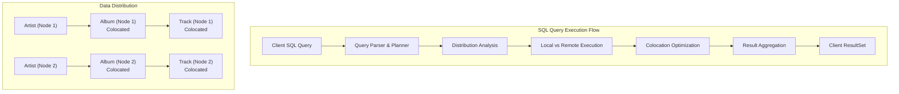
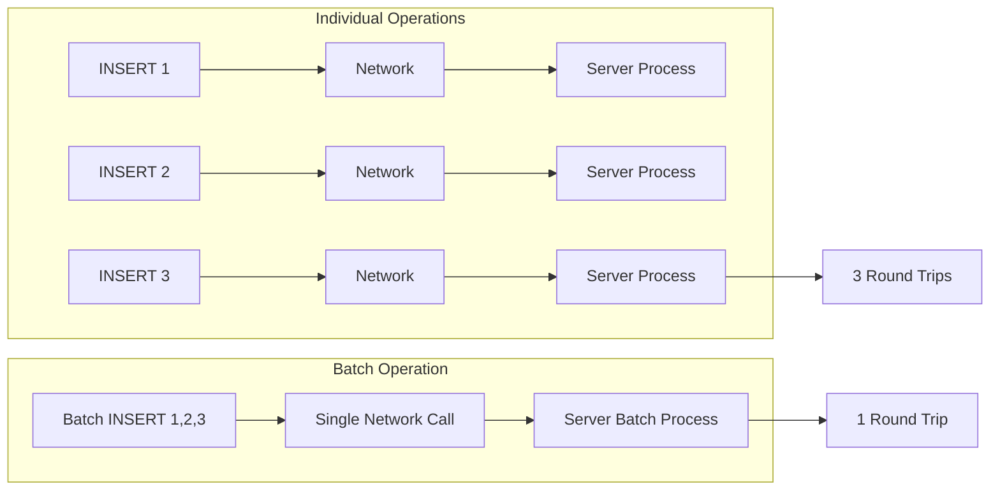

# 5. SQL API - Relational Data Access

The Ignite 3 SQL API provides enterprise-grade relational database capabilities with distributed systems optimizations. This module demonstrates how to leverage SQL for complex queries, data analysis, and business logic while taking advantage of Ignite's distributed architecture, colocation strategies, and performance optimizations.

## Overview: SQL in Distributed Systems

Ignite 3's SQL engine is built for distributed environments where data is partitioned across multiple nodes. Understanding how SQL operations work in this context is crucial for optimal performance:



**Key SQL Distribution Concepts:**

- **Colocation-Aware Joins**: Joins between colocated tables execute locally without network overhead
- **Distributed Aggregations**: GROUP BY and aggregate functions work across all cluster nodes
- **Query Routing**: Queries are routed to nodes containing the relevant data
- **Result Streaming**: Large result sets are streamed efficiently to prevent memory issues

## The `IgniteSql` Interface

The `IgniteSql` interface is your gateway to all SQL operations in Ignite 3. It provides both synchronous and asynchronous execution models with comprehensive transaction support:

```java
// Access the SQL interface from your client
IgniteSql sql = client.sql();

// Key capabilities:
// - DDL operations (CREATE, ALTER, DROP)
// - DML operations (INSERT, UPDATE, DELETE, MERGE)
// - Query operations (SELECT with complex joins and aggregations)
// - Batch operations for bulk data processing
// - Prepared statements for performance and security
// - Async operations for non-blocking execution
// - Transaction integration for ACID compliance
```

## DDL Operations: Schema Definition with SQL

While Ignite 3 supports annotation-based schema definition (covered in Module 3), SQL DDL provides dynamic schema management and advanced distribution configurations:

### Distribution Zones and Table Creation

```java
/**
 * Create distribution zones for optimal data placement.
 * Zones define how data is distributed and replicated across the cluster.
 */
public void createMusicStoreZones(IgniteSql sql) {
    // Primary zone for transactional data (2 replicas for availability)
    sql.executeScript(
        "CREATE ZONE MusicStore WITH REPLICAS=2, PARTITIONS=25, STORAGE_PROFILES='default'"
    );
    
    // Replicated zone for reference data (3 replicas for high read performance)
    sql.executeScript(
        "CREATE ZONE MusicStoreReplicated WITH REPLICAS=3, PARTITIONS=25, STORAGE_PROFILES='default'"
    );
    
    System.out.println("Distribution zones created successfully");
}
```

### Creating Tables with Colocation Strategy

```java
/**
 * Create the music store schema with optimal colocation for performance.
 * This demonstrates the relationship hierarchy: Artist → Album → Track
 */
public void createMusicStoreTables(IgniteSql sql) {
    // Root entity: Artists
    sql.executeScript(
        "CREATE TABLE Artist (" +
        "    ArtistId INTEGER PRIMARY KEY," +
        "    Name VARCHAR(120) NOT NULL" +
        ") WITH PRIMARY_ZONE='MusicStore'"
    );
    
    // Albums colocated with their artists for optimal JOIN performance
    sql.executeScript(
        "CREATE TABLE Album (" +
        "    AlbumId INTEGER," +
        "    ArtistId INTEGER," +
        "    Title VARCHAR(160) NOT NULL," +
        "    PRIMARY KEY (AlbumId, ArtistId)" +
        ") WITH PRIMARY_ZONE='MusicStore', COLOCATION_COLUMNS='ArtistId'"
    );
    
    // Tracks colocated with their albums (which are colocated with artists)
    sql.executeScript(
        "CREATE TABLE Track (" +
        "    TrackId INTEGER," +
        "    AlbumId INTEGER," +
        "    Name VARCHAR(200) NOT NULL," +
        "    MediaTypeId INTEGER NOT NULL," +
        "    GenreId INTEGER," +
        "    Composer VARCHAR(220)," +
        "    Milliseconds INTEGER NOT NULL," +
        "    Bytes INTEGER," +
        "    UnitPrice DECIMAL(10,2) NOT NULL," +
        "    PRIMARY KEY (TrackId, AlbumId)" +
        ") WITH PRIMARY_ZONE='MusicStore', COLOCATION_COLUMNS='AlbumId'"
    );
    
    System.out.println("Music store tables created with optimal colocation");
}
```

### Index Creation for Query Performance

```java
/**
 * Create indexes to support efficient queries across the distributed cluster.
 * Indexes are essential for foreign key lookups and complex query performance.
 */
public void createPerformanceIndexes(IgniteSql sql) {
    // Album foreign key index for artist lookups
    sql.executeScript("CREATE INDEX IFK_AlbumArtistId ON Album (ArtistId)");
    
    // Track foreign key indexes for multi-table joins
    sql.executeScript("CREATE INDEX IFK_TrackAlbumId ON Track (AlbumId)");
    sql.executeScript("CREATE INDEX IFK_TrackGenreId ON Track (GenreId)");
    sql.executeScript("CREATE INDEX IFK_TrackMediaTypeId ON Track (MediaTypeId)");
    
    // Performance index for artist name searches
    sql.executeScript("CREATE INDEX IDX_ArtistName ON Artist (Name)");
    
    // Composite index for track searches
    sql.executeScript("CREATE INDEX IDX_TrackNameGenre ON Track (Name, GenreId)");
    
    System.out.println("Performance indexes created for efficient distributed queries");
}
```

### Schema Modification Operations

```java
/**
 * Modify existing schema structures dynamically.
 * Ignite 3 supports online schema evolution without service interruption.
 */
public void modifyMusicStoreSchema(IgniteSql sql) {
    // Add new column to existing table
    sql.executeScript("ALTER TABLE Artist ADD COLUMN Country VARCHAR(50)");
    
    // Add index to new column
    sql.executeScript("CREATE INDEX IDX_ArtistCountry ON Artist (Country)");
    
    // Create new table for artist biography information
    sql.executeScript(
        "CREATE TABLE ArtistBio (" +
        "    ArtistId INTEGER PRIMARY KEY," +
        "    Biography TEXT," +
        "    Website VARCHAR(200)," +
        "    FOREIGN KEY (ArtistId) REFERENCES Artist(ArtistId)" +
        ") WITH PRIMARY_ZONE='MusicStore'"
    );
    
    System.out.println("Schema modifications completed successfully");
}

/**
 * Drop schema objects when they're no longer needed.
 * Always drop dependent objects before dropping referenced objects.
 */
public void cleanupSchema(IgniteSql sql) {
    // Drop indexes first
    sql.executeScript("DROP INDEX IF EXISTS IDX_ArtistCountry");
    
    // Drop tables in dependency order
    sql.executeScript("DROP TABLE IF EXISTS ArtistBio");
    
    // Drop zones last (only if no tables reference them)
    // sql.executeScript("DROP ZONE IF EXISTS MusicStoreReplicated");
    
    System.out.println("Schema cleanup completed");
}
```

## DML Operations: Data Manipulation with SQL

Data Manipulation Language (DML) operations in Ignite 3 are optimized for distributed environments. The SQL engine automatically handles data routing, colocation awareness, and transaction coordination across cluster nodes.

### INSERT Operations

#### Basic Single-Row Inserts

```java
/**
 * Insert individual records using parameterized queries.
 * Parameters prevent SQL injection and enable query plan reuse.
 */
public void insertMusicStoreData(IgniteSql sql) {
    // Insert root entities first (Artists)
    sql.execute(null,
        "INSERT INTO Artist (ArtistId, Name) VALUES (?, ?)",
        1, "AC/DC");
    
    sql.execute(null,
        "INSERT INTO Artist (ArtistId, Name) VALUES (?, ?)",
        2, "Accept");
    
    // Insert Albums (colocated with Artists by ArtistId)
    sql.execute(null,
        "INSERT INTO Album (AlbumId, ArtistId, Title) VALUES (?, ?, ?)",
        1, 1, "For Those About To Rock We Salute You");
    
    sql.execute(null,
        "INSERT INTO Album (AlbumId, ArtistId, Title) VALUES (?, ?, ?)",
        2, 2, "Balls to the Wall");
    
    // Insert Tracks (colocated with Albums by AlbumId)
    sql.execute(null,
        "INSERT INTO Track (TrackId, AlbumId, Name, MediaTypeId, GenreId, Milliseconds, UnitPrice) " +
        "VALUES (?, ?, ?, ?, ?, ?, ?)",
        1, 1, "For Those About To Rock (We Salute You)", 1, 1, 343719, new BigDecimal("0.99"));
    
    System.out.println("Music store data inserted successfully");
}
```

#### Multi-Value INSERT Operations

```java
/**
 * Insert multiple rows in a single statement for efficiency.
 * This reduces network round trips and improves performance.
 */
public void insertMultipleArtists(IgniteSql sql) {
    // Insert multiple artists in one statement
    long affectedRows = sql.execute(null,
        "INSERT INTO Artist (ArtistId, Name) VALUES " +
        "(?, ?), (?, ?), (?, ?), (?, ?), (?, ?)",
        3, "Aerosmith",
        4, "Alanis Morissette", 
        5, "Alice In Chains",
        6, "Antônio Carlos Jobim",
        7, "Apocalyptica"
    ).affectedRows();
    
    System.out.println("Inserted " + affectedRows + " artists");
}
```

#### INSERT with SELECT (Data Copying)

```java
/**
 * Copy data between tables using INSERT ... SELECT.
 * Useful for data archiving, reporting tables, and data transformation.
 */
public void copyArtistData(IgniteSql sql) {
    // Create a backup table first
    sql.executeScript(
        "CREATE TABLE ArtistBackup (" +
        "    ArtistId INTEGER PRIMARY KEY," +
        "    Name VARCHAR(120)," +
        "    BackupDate DATE DEFAULT CURRENT_DATE" +
        ") WITH PRIMARY_ZONE='MusicStore'"
    );
    
    // Copy specific artists to backup table
    long copiedRows = sql.execute(null,
        "INSERT INTO ArtistBackup (ArtistId, Name) " +
        "SELECT ArtistId, Name FROM Artist WHERE ArtistId BETWEEN ? AND ?",
        1, 10
    ).affectedRows();
    
    System.out.println("Copied " + copiedRows + " artists to backup table");
}
```

### UPDATE Operations

#### Basic Record Updates

```java
/**
 * Update individual records with optimal distributed routing.
 * Updates automatically route to the correct cluster node based on the primary key.
 */
public void updateMusicStoreData(IgniteSql sql) {
    // Update single artist record
    long updatedRows = sql.execute(null,
        "UPDATE Artist SET Name = ? WHERE ArtistId = ?",
        "AC/DC (Remastered Collection)", 1
    ).affectedRows();
    
    System.out.println("Updated " + updatedRows + " artist record");
    
    // Update album title with precise targeting
    sql.execute(null,
        "UPDATE Album SET Title = ? WHERE AlbumId = ? AND ArtistId = ?",
        "For Those About To Rock (Special Edition)", 1, 1
    );
    
    // Update track pricing
    sql.execute(null,
        "UPDATE Track SET UnitPrice = ? WHERE TrackId = ? AND AlbumId = ?",
        new BigDecimal("1.29"), 1, 1
    );
    
    System.out.println("Individual records updated successfully");
}
```

#### Conditional Bulk Updates

```java
/**
 * Update multiple records based on conditions.
 * Ignite 3 automatically distributes these operations across relevant cluster nodes.
 */
public void bulkUpdateOperations(IgniteSql sql) {
    // Update all artists whose names start with 'A'
    long updatedArtists = sql.execute(null,
        "UPDATE Artist SET Name = UPPER(Name) WHERE Name LIKE ?",
        "A%"
    ).affectedRows();
    
    System.out.println("Updated " + updatedArtists + " artist names to uppercase");
    
    // Bulk price adjustment for tracks over 5 minutes
    long updatedTracks = sql.execute(null,
        "UPDATE Track SET UnitPrice = UnitPrice * ? WHERE Milliseconds > ?",
        new BigDecimal("1.1"), 300000 // 5 minutes in milliseconds
    ).affectedRows();
    
    System.out.println("Applied price increase to " + updatedTracks + " long tracks");
    
    // Update based on related data (subquery)
    long updatedAlbums = sql.execute(null,
        "UPDATE Album SET Title = CONCAT(Title, ' - Premium Edition') " +
        "WHERE ArtistId IN (SELECT ArtistId FROM Artist WHERE Name LIKE ?)",
        "%AC/DC%"
    ).affectedRows();
    
    System.out.println("Updated " + updatedAlbums + " album titles for AC/DC");
}
```

#### UPDATE with JOIN Operations

```java
/**
 * Complex updates involving multiple tables using JOIN syntax.
 * Demonstrates distributed query optimization with colocated data.
 */
public void complexUpdateOperations(IgniteSql sql) {
    // Update track pricing based on genre popularity
    // First create a view of genre statistics
    sql.executeScript(
        "CREATE OR REPLACE VIEW GenrePopularity AS " +
        "SELECT g.GenreId, g.Name, COUNT(t.TrackId) as TrackCount " +
        "FROM Genre g " +
        "LEFT JOIN Track t ON g.GenreId = t.GenreId " +
        "GROUP BY g.GenreId, g.Name"
    );
    
    // Update prices for tracks in popular genres
    long updatedTracks = sql.execute(null,
        "UPDATE Track SET UnitPrice = UnitPrice * ? " +
        "WHERE GenreId IN (" +
        "    SELECT GenreId FROM GenrePopularity WHERE TrackCount > ?" +
        ")",
        new BigDecimal("1.15"), 100
    ).affectedRows();
    
    System.out.println("Applied premium pricing to " + updatedTracks + " tracks in popular genres");
}
```

### DELETE Operations

#### Basic Record Deletion

```java
/**
 * Delete individual records with precise targeting.
 * DELETE operations in Ignite 3 route to the correct nodes automatically.
 */
public void deleteMusicStoreData(IgniteSql sql) {
    // Delete specific track
    long deletedTracks = sql.execute(null,
        "DELETE FROM Track WHERE TrackId = ? AND AlbumId = ?",
        1, 1
    ).affectedRows();
    
    System.out.println("Deleted " + deletedTracks + " track");
    
    // Delete specific album (after removing its tracks)
    long deletedAlbums = sql.execute(null,
        "DELETE FROM Album WHERE AlbumId = ? AND ArtistId = ?",
        1, 1
    ).affectedRows();
    
    System.out.println("Deleted " + deletedAlbums + " album");
    
    // Delete artist (after removing albums and tracks)
    long deletedArtists = sql.execute(null,
        "DELETE FROM Artist WHERE ArtistId = ?",
        1
    ).affectedRows();
    
    System.out.println("Deleted " + deletedArtists + " artist");
}
```

#### Conditional Bulk Deletions

```java
/**
 * Delete multiple records based on business logic conditions.
 * Demonstrates cascading deletes and referential integrity.
 */
public void bulkDeleteOperations(IgniteSql sql) {
    // Delete tracks with zero bytes (corrupted files)
    long deletedTracks = sql.execute(null,
        "DELETE FROM Track WHERE Bytes IS NULL OR Bytes = 0"
    ).affectedRows();
    
    System.out.println("Deleted " + deletedTracks + " corrupted tracks");
    
    // Delete artists with no albums (cleanup operation)
    long deletedArtists = sql.execute(null,
        "DELETE FROM Artist WHERE ArtistId NOT IN (" +
        "    SELECT DISTINCT ArtistId FROM Album WHERE ArtistId IS NOT NULL" +
        ")"
    ).affectedRows();
    
    System.out.println("Deleted " + deletedArtists + " artists with no albums");
    
    // Delete old backup data
    long deletedBackups = sql.execute(null,
        "DELETE FROM ArtistBackup WHERE BackupDate < ?",
        LocalDate.now().minusDays(30)
    ).affectedRows();
    
    System.out.println("Deleted " + deletedBackups + " old backup records");
}
```

#### DELETE with Complex Conditions

```java
/**
 * Advanced deletion patterns using subqueries and joins.
 * Shows how to delete related data efficiently in distributed environment.
 */
public void complexDeleteOperations(IgniteSql sql) {
    // Delete tracks from albums by artists in specific genre
    long deletedTracks = sql.execute(null,
        "DELETE FROM Track WHERE AlbumId IN (" +
        "    SELECT DISTINCT a.AlbumId " +
        "    FROM Album a " +
        "    JOIN Artist ar ON a.ArtistId = ar.ArtistId " +
        "    WHERE ar.Name LIKE ?" +
        ")",
        "%test%"
    ).affectedRows();
    
    System.out.println("Deleted " + deletedTracks + " tracks from test artists");
    
    // Clean up empty albums
    long deletedAlbums = sql.execute(null,
        "DELETE FROM Album WHERE AlbumId NOT IN (" +
        "    SELECT DISTINCT AlbumId FROM Track WHERE AlbumId IS NOT NULL" +
        ")"
    ).affectedRows();
    
    System.out.println("Deleted " + deletedAlbums + " empty albums");
}
```

### MERGE/UPSERT Operations

#### Basic UPSERT Operations

```java
/**
 * Insert or update records using MERGE operations.
 * MERGE is essential for data synchronization and ETL operations.
 */
public void upsertMusicStoreData(IgniteSql sql) {
    // Insert new artist or update existing one
    sql.execute(null,
        "MERGE INTO Artist (ArtistId, Name) VALUES (?, ?) " +
        "ON CONFLICT (ArtistId) DO UPDATE SET Name = EXCLUDED.Name",
        100, "Queen");
    
    // Alternative INSERT ... ON CONFLICT syntax
    sql.execute(null,
        "INSERT INTO Artist (ArtistId, Name) VALUES (?, ?) " +
        "ON CONFLICT (ArtistId) DO UPDATE SET Name = EXCLUDED.Name",
        101, "The Beatles");
    
    // Upsert album with complex logic
    sql.execute(null,
        "INSERT INTO Album (AlbumId, ArtistId, Title) VALUES (?, ?, ?) " +
        "ON CONFLICT (AlbumId, ArtistId) DO UPDATE SET " +
        "Title = CASE WHEN EXCLUDED.Title != Album.Title THEN EXCLUDED.Title ELSE Album.Title END",
        100, 100, "Greatest Hits");
    
    System.out.println("Upsert operations completed successfully");
}
```

#### Batch UPSERT with Business Logic

```java
/**
 * Advanced upsert patterns for data synchronization scenarios.
 * Demonstrates conditional logic and audit trail patterns.
 */
public void advancedUpsertOperations(IgniteSql sql) {
    // Upsert with timestamp tracking
    sql.execute(null,
        "INSERT INTO Artist (ArtistId, Name) VALUES (?, ?) " +
        "ON CONFLICT (ArtistId) DO UPDATE SET " +
        "Name = EXCLUDED.Name",
        102, "Pink Floyd");
    
    // Conditional upsert - only update if new data is different
    sql.execute(null,
        "INSERT INTO Track (TrackId, AlbumId, Name, MediaTypeId, GenreId, Milliseconds, UnitPrice) " +
        "VALUES (?, ?, ?, ?, ?, ?, ?) " +
        "ON CONFLICT (TrackId, AlbumId) DO UPDATE SET " +
        "Name = EXCLUDED.Name, " +
        "Milliseconds = EXCLUDED.Milliseconds, " +
        "UnitPrice = EXCLUDED.UnitPrice " +
        "WHERE Track.Name != EXCLUDED.Name OR Track.UnitPrice != EXCLUDED.UnitPrice",
        100, 100, "Bohemian Rhapsody", 1, 1, 355000, new BigDecimal("1.29"));
    
    System.out.println("Advanced upsert operations completed");
}
```

## Query Operations: Advanced SELECT Capabilities

Ignite 3's SQL query engine provides comprehensive SELECT capabilities optimized for distributed data. The engine automatically optimizes joins based on colocation, minimizes network traffic, and supports complex analytical queries across the entire cluster.

### Basic Query Patterns

#### Simple SELECT Operations

```java
/**
 * Basic query operations with proper resource management.
 * Always use try-with-resources for automatic ResultSet cleanup.
 */
public void basicQueryOperations(IgniteSql sql) {
    // Simple artist lookup with parameters
    try (ResultSet<SqlRow> rs = sql.execute(null,
            "SELECT ArtistId, Name FROM Artist WHERE Name LIKE ? ORDER BY Name", 
            "A%")) {
        
        System.out.println("Artists starting with 'A':");
        while (rs.hasNext()) {
            SqlRow row = rs.next();
            System.out.printf("ID: %d, Artist: %s%n", 
                row.intValue("ArtistId"), row.stringValue("Name"));
        }
    }
    
    // Track search with multiple conditions
    try (ResultSet<SqlRow> rs = sql.execute(null,
            "SELECT TrackId, Name, Milliseconds, UnitPrice " +
            "FROM Track " +
            "WHERE Milliseconds BETWEEN ? AND ? AND UnitPrice <= ? " +
            "ORDER BY UnitPrice DESC, Milliseconds DESC",
            180000, 300000, new BigDecimal("0.99"))) {
        
        System.out.println("\nTracks 3-5 minutes, under $0.99:");
        while (rs.hasNext()) {
            SqlRow row = rs.next();
            System.out.printf("Track: %s, Duration: %d ms, Price: $%.2f%n",
                row.stringValue("Name"),
                row.intValue("Milliseconds"),
                row.decimalValue("UnitPrice"));
        }
    }
}
```

#### Aggregation Queries

```java
/**
 * Demonstrate aggregation operations across distributed data.
 * Aggregations automatically work across all cluster nodes.
 */
public void aggregationQueries(IgniteSql sql) {
    // Count statistics across the music store
    try (ResultSet<SqlRow> rs = sql.execute(null,
            "SELECT " +
            "    COUNT(*) as TotalTracks, " +
            "    AVG(UnitPrice) as AvgPrice, " +
            "    SUM(Milliseconds) as TotalDuration, " +
            "    MIN(UnitPrice) as MinPrice, " +
            "    MAX(UnitPrice) as MaxPrice " +
            "FROM Track")) {
        
        if (rs.hasNext()) {
            SqlRow row = rs.next();
            System.out.println("Music Store Statistics:");
            System.out.printf("Total Tracks: %d%n", row.longValue("TotalTracks"));
            System.out.printf("Average Price: $%.2f%n", row.decimalValue("AvgPrice"));
            System.out.printf("Total Duration: %d ms%n", row.longValue("TotalDuration"));
            System.out.printf("Price Range: $%.2f - $%.2f%n", 
                row.decimalValue("MinPrice"), row.decimalValue("MaxPrice"));
        }
    }
    
    // Genre popularity analysis
    try (ResultSet<SqlRow> rs = sql.execute(null,
            "SELECT g.Name as Genre, COUNT(t.TrackId) as TrackCount, " +
            "       AVG(t.UnitPrice) as AvgPrice " +
            "FROM Genre g " +
            "JOIN Track t ON g.GenreId = t.GenreId " +
            "GROUP BY g.GenreId, g.Name " +
            "HAVING COUNT(t.TrackId) > ? " +
            "ORDER BY TrackCount DESC",
            10)) {
        
        System.out.println("\nPopular Genres (>10 tracks):");
        while (rs.hasNext()) {
            SqlRow row = rs.next();
            System.out.printf("Genre: %s, Tracks: %d, Avg Price: $%.2f%n",
                row.stringValue("Genre"),
                row.longValue("TrackCount"),
                row.decimalValue("AvgPrice"));
        }
    }
}
```

### Complex JOIN Operations

#### Multi-Table Joins with Colocation Optimization

```java
/**
 * Complex joins that take advantage of Ignite's colocation strategy.
 * Artist→Album→Track joins execute locally on each node for optimal performance.
 */
public void optimizedJoinQueries(IgniteSql sql) {
    // Complete music hierarchy join (optimized by colocation)
    try (ResultSet<SqlRow> rs = sql.execute(null,
            "SELECT " +
            "    ar.Name as ArtistName, " +
            "    al.Title as AlbumTitle, " +
            "    t.Name as TrackName, " +
            "    t.Milliseconds, " +
            "    t.UnitPrice " +
            "FROM Artist ar " +
            "JOIN Album al ON ar.ArtistId = al.ArtistId " +
            "JOIN Track t ON al.AlbumId = t.AlbumId " +
            "WHERE ar.ArtistId = ? " +
            "ORDER BY al.Title, t.TrackId",
            1)) {
        
        System.out.println("Complete discography for artist ID 1:");
        String currentAlbum = "";
        while (rs.hasNext()) {
            SqlRow row = rs.next();
            String albumTitle = row.stringValue("AlbumTitle");
            
            if (!albumTitle.equals(currentAlbum)) {
                System.out.printf("\nAlbum: %s%n", albumTitle);
                currentAlbum = albumTitle;
            }
            
            System.out.printf("  Track: %s (%d ms) - $%.2f%n",
                row.stringValue("TrackName"),
                row.intValue("Milliseconds"),
                row.decimalValue("UnitPrice"));
        }
    }
}
```

#### Cross-Domain Joins and Analytics

```java
/**
 * Advanced joins across business domains for analytical insights.
 * Demonstrates distributed query execution across multiple table types.
 */
public void analyticalJoinQueries(IgniteSql sql) {
    // Artist popularity based on customer purchases
    try (ResultSet<SqlRow> rs = sql.execute(null,
            "SELECT " +
            "    ar.Name as ArtistName, " +
            "    COUNT(DISTINCT il.InvoiceId) as PurchaseCount, " +
            "    SUM(il.Quantity * il.UnitPrice) as TotalRevenue, " +
            "    COUNT(DISTINCT t.TrackId) as UniqueTracksPurchased " +
            "FROM Artist ar " +
            "JOIN Album al ON ar.ArtistId = al.ArtistId " +
            "JOIN Track t ON al.AlbumId = t.AlbumId " +
            "JOIN InvoiceLine il ON t.TrackId = il.TrackId " +
            "GROUP BY ar.ArtistId, ar.Name " +
            "HAVING SUM(il.Quantity * il.UnitPrice) > ? " +
            "ORDER BY TotalRevenue DESC " +
            "LIMIT 10",
            new BigDecimal("50.00"))) {
        
        System.out.println("Top Artists by Revenue (>$50):");
        while (rs.hasNext()) {
            SqlRow row = rs.next();
            System.out.printf("Artist: %s, Purchases: %d, Revenue: $%.2f, Tracks Sold: %d%n",
                row.stringValue("ArtistName"),
                row.longValue("PurchaseCount"),
                row.decimalValue("TotalRevenue"),
                row.longValue("UniqueTracksPurchased"));
        }
    }
    
    // Customer preferences analysis
    try (ResultSet<SqlRow> rs = sql.execute(null,
            "SELECT " +
            "    c.FirstName || ' ' || c.LastName as CustomerName, " +
            "    c.Country, " +
            "    COUNT(DISTINCT ar.ArtistId) as DifferentArtists, " +
            "    COUNT(DISTINCT g.GenreId) as DifferentGenres, " +
            "    SUM(il.Quantity * il.UnitPrice) as TotalSpent " +
            "FROM Customer c " +
            "JOIN Invoice i ON c.CustomerId = i.CustomerId " +
            "JOIN InvoiceLine il ON i.InvoiceId = il.InvoiceId " +
            "JOIN Track t ON il.TrackId = t.TrackId " +
            "JOIN Genre g ON t.GenreId = g.GenreId " +
            "JOIN Album al ON t.AlbumId = al.AlbumId " +
            "JOIN Artist ar ON al.ArtistId = ar.ArtistId " +
            "GROUP BY c.CustomerId, c.FirstName, c.LastName, c.Country " +
            "HAVING SUM(il.Quantity * il.UnitPrice) > ? " +
            "ORDER BY TotalSpent DESC " +
            "LIMIT 5",
            new BigDecimal("20.00"))) {
        
        System.out.println("\nTop Customers by Diversity (>$20 spent):");
        while (rs.hasNext()) {
            SqlRow row = rs.next();
            System.out.printf("Customer: %s (%s), Artists: %d, Genres: %d, Spent: $%.2f%n",
                row.stringValue("CustomerName"),
                row.stringValue("Country"),
                row.longValue("DifferentArtists"),
                row.longValue("DifferentGenres"),
                row.decimalValue("TotalSpent"));
        }
    }
}
```

### Window Functions and Advanced Analytics

```java
/**
 * Advanced analytical queries using window functions.
 * Demonstrates sophisticated SQL capabilities for business intelligence.
 */
public void windowFunctionQueries(IgniteSql sql) {
    // Track ranking within albums
    try (ResultSet<SqlRow> rs = sql.execute(null,
            "SELECT " +
            "    ar.Name as ArtistName, " +
            "    al.Title as AlbumTitle, " +
            "    t.Name as TrackName, " +
            "    t.Milliseconds, " +
            "    ROW_NUMBER() OVER (PARTITION BY al.AlbumId ORDER BY t.TrackId) as TrackNumber, " +
            "    RANK() OVER (PARTITION BY al.AlbumId ORDER BY t.Milliseconds DESC) as DurationRank " +
            "FROM Artist ar " +
            "JOIN Album al ON ar.ArtistId = al.ArtistId " +
            "JOIN Track t ON al.AlbumId = t.AlbumId " +
            "WHERE ar.ArtistId BETWEEN ? AND ? " +
            "ORDER BY ar.Name, al.Title, TrackNumber",
            1, 3)) {
        
        System.out.println("Track Analysis with Window Functions:");
        String currentKey = "";
        while (rs.hasNext()) {
            SqlRow row = rs.next();
            String albumKey = row.stringValue("ArtistName") + " - " + row.stringValue("AlbumTitle");
            
            if (!albumKey.equals(currentKey)) {
                System.out.printf("\n%s:%n", albumKey);
                currentKey = albumKey;
            }
            
            System.out.printf("  Track %d: %s (%d ms, Duration Rank: %d)%n",
                row.longValue("TrackNumber"),
                row.stringValue("TrackName"),
                row.intValue("Milliseconds"),
                row.longValue("DurationRank"));
        }
    }
    
    // Running totals and percentages
    try (ResultSet<SqlRow> rs = sql.execute(null,
            "SELECT " +
            "    g.Name as Genre, " +
            "    COUNT(t.TrackId) as TrackCount, " +
            "    SUM(COUNT(t.TrackId)) OVER (ORDER BY COUNT(t.TrackId) DESC) as RunningTotal, " +
            "    ROUND(100.0 * COUNT(t.TrackId) / SUM(COUNT(t.TrackId)) OVER (), 2) as Percentage " +
            "FROM Genre g " +
            "JOIN Track t ON g.GenreId = t.GenreId " +
            "GROUP BY g.GenreId, g.Name " +
            "ORDER BY TrackCount DESC " +
            "LIMIT 10")) {
        
        System.out.println("\nGenre Distribution Analysis:");
        while (rs.hasNext()) {
            SqlRow row = rs.next();
            System.out.printf("Genre: %s, Tracks: %d (%.2f%%), Running Total: %d%n",
                row.stringValue("Genre"),
                row.longValue("TrackCount"),
                row.doubleValue("Percentage"),
                row.longValue("RunningTotal"));
        }
    }
}
```

## Prepared Statements: Performance and Security

Prepared statements in Ignite 3 provide query plan caching, parameter type safety, and SQL injection protection. The distributed query planner caches execution plans across cluster nodes, significantly improving performance for repeated queries.

### Statement Creation and Configuration

#### Basic Statement Creation

```java
/**
 * Create prepared statements for optimal performance and security.
 * Statement objects can be reused multiple times with different parameters.
 */
public void createPreparedStatements(IgniteSql sql) {
    // Simple prepared statement
    Statement artistLookup = sql.createStatement(
        "SELECT ArtistId, Name FROM Artist WHERE Name LIKE ? ORDER BY Name"
    );
    
    // Statement with multiple parameters
    Statement trackSearch = sql.createStatement(
        "SELECT t.Name, t.Milliseconds, t.UnitPrice " +
        "FROM Track t " +
        "WHERE t.Milliseconds BETWEEN ? AND ? AND t.UnitPrice <= ? " +
        "ORDER BY t.UnitPrice DESC"
    );
    
    // Complex statement with joins
    Statement albumsWithTracks = sql.createStatement(
        "SELECT ar.Name as ArtistName, al.Title as AlbumTitle, COUNT(t.TrackId) as TrackCount " +
        "FROM Artist ar " +
        "JOIN Album al ON ar.ArtistId = al.ArtistId " +
        "JOIN Track t ON al.AlbumId = t.AlbumId " +
        "WHERE ar.ArtistId = ? " +
        "GROUP BY ar.ArtistId, ar.Name, al.AlbumId, al.Title"
    );
    
    System.out.println("Prepared statements created and cached");
}
```

#### Advanced Statement Configuration

```java
/**
 * Create statements with advanced configuration options.
 * Demonstrates timeout, schema, pagination, and timezone settings.
 */
public void advancedStatementConfiguration(IgniteSql sql) {
    // Statement with custom configuration
    Statement configuredStatement = sql.statementBuilder()
        .query("SELECT * FROM Track WHERE GenreId = ? ORDER BY Name")
        .queryTimeout(30, TimeUnit.SECONDS)
        .defaultSchema("MusicStore")
        .pageSize(1000)
        .timeZoneId(ZoneId.of("America/New_York"))
        .build();
    
    // Execute with configuration
    try (ResultSet<SqlRow> rs = sql.execute(null, configuredStatement, 1)) {
        System.out.println("Query executed with custom configuration:");
        int count = 0;
        while (rs.hasNext() && count < 5) {
            SqlRow row = rs.next();
            System.out.printf("Track: %s%n", row.stringValue("Name"));
            count++;
        }
        System.out.println("... (showing first 5 results)");
    }
}

### Parameter Binding Patterns

#### Positional Parameters with Type Safety

```java
/**
 * Demonstrate type-safe parameter binding with prepared statements.
 * Ignite 3 automatically handles type conversion and validation.
 */
public void positionalParameterBinding(IgniteSql sql) {
    // Artist search with string parameter
    Statement artistStmt = sql.createStatement(
        "SELECT ArtistId, Name FROM Artist WHERE Name LIKE ? ORDER BY Name"
    );
    
    try (ResultSet<SqlRow> rs = sql.execute(null, artistStmt, "A%")) {
        System.out.println("Artists starting with 'A':");
        while (rs.hasNext()) {
            SqlRow row = rs.next();
            System.out.printf("  %d: %s%n", 
                row.intValue("ArtistId"), row.stringValue("Name"));
        }
    }
    
    // Track search with multiple parameter types
    Statement trackStmt = sql.createStatement(
        "SELECT Name, Milliseconds, UnitPrice " +
        "FROM Track " +
        "WHERE Milliseconds BETWEEN ? AND ? AND UnitPrice >= ? " +
        "ORDER BY UnitPrice DESC LIMIT ?"
    );
    
    try (ResultSet<SqlRow> rs = sql.execute(null, trackStmt, 
            240000,                    // Integer: min duration
            360000,                    // Integer: max duration  
            new BigDecimal("1.00"),    // BigDecimal: min price
            10)) {                     // Integer: limit
        
        System.out.println("\nExpensive tracks (4-6 minutes, $1.00+):");
        while (rs.hasNext()) {
            SqlRow row = rs.next();
            System.out.printf("  %s - %d ms - $%.2f%n",
                row.stringValue("Name"),
                row.intValue("Milliseconds"),
                row.decimalValue("UnitPrice"));
        }
    }
}
```

#### Complex Parameter Scenarios

```java
/**
 * Handle complex parameter binding scenarios including NULLs and collections.
 * Demonstrates best practices for parameter safety and validation.
 */
public void complexParameterBinding(IgniteSql sql) {
    // Handle NULL parameters safely
    Statement nullSafeStmt = sql.createStatement(
        "SELECT * FROM Track WHERE (? IS NULL OR GenreId = ?) AND Name LIKE ?"
    );
    
    Integer genreId = null;  // This could be null from user input
    String namePattern = "%Love%";
    
    try (ResultSet<SqlRow> rs = sql.execute(null, nullSafeStmt, 
            genreId, genreId, namePattern)) {
        
        System.out.println("Tracks with 'Love' in title (any genre):");
        while (rs.hasNext()) {
            SqlRow row = rs.next();
            System.out.printf("  %s (Genre: %s)%n",
                row.stringValue("Name"),
                row.value("GenreId"));
        }
    }
    
    // Date parameter binding
    Statement dateStmt = sql.createStatement(
        "SELECT c.FirstName, c.LastName, i.InvoiceDate, i.Total " +
        "FROM Customer c " +
        "JOIN Invoice i ON c.CustomerId = i.CustomerId " +
        "WHERE i.InvoiceDate >= ? " +
        "ORDER BY i.InvoiceDate DESC"
    );
    
    LocalDate startDate = LocalDate.now().minusYears(1);
    
    try (ResultSet<SqlRow> rs = sql.execute(null, dateStmt, startDate)) {
        System.out.println("\nRecent invoices (last year):");
        int count = 0;
        while (rs.hasNext() && count < 5) {
            SqlRow row = rs.next();
            System.out.printf("  %s %s - %s - $%.2f%n",
                row.stringValue("FirstName"),
                row.stringValue("LastName"),
                row.value("InvoiceDate"),
                row.decimalValue("Total"));
            count++;
        }
    }
}
```

#### Dynamic Parameter Lists

```java
/**
 * Handle variable parameter lists for IN clauses and dynamic queries.
 * Essential for building flexible query interfaces.
 */
public void dynamicParameterLists(IgniteSql sql) {
    // Find artists by multiple IDs
    List<Integer> artistIds = Arrays.asList(1, 2, 3, 5, 8);
    
    // Build dynamic IN clause
    String placeholders = artistIds.stream()
        .map(id -> "?")
        .collect(Collectors.joining(", "));
    
    String dynamicSql = "SELECT ArtistId, Name FROM Artist WHERE ArtistId IN (" + placeholders + ") ORDER BY Name";
    Statement dynamicStmt = sql.createStatement(dynamicSql);
    
    try (ResultSet<SqlRow> rs = sql.execute(null, dynamicStmt, artistIds.toArray())) {
        System.out.println("Selected artists:");
        while (rs.hasNext()) {
            SqlRow row = rs.next();
            System.out.printf("  %d: %s%n", 
                row.intValue("ArtistId"), row.stringValue("Name"));
        }
    }
    
    // Dynamic search criteria
    Map<String, Object> searchCriteria = new HashMap<>();
    searchCriteria.put("minPrice", new BigDecimal("0.99"));
    searchCriteria.put("maxDuration", 300000);
    searchCriteria.put("genreId", 1);
    
    StringBuilder queryBuilder = new StringBuilder("SELECT * FROM Track WHERE 1=1");
    List<Object> parameters = new ArrayList<>();
    
    if (searchCriteria.containsKey("minPrice")) {
        queryBuilder.append(" AND UnitPrice >= ?");
        parameters.add(searchCriteria.get("minPrice"));
    }
    
    if (searchCriteria.containsKey("maxDuration")) {
        queryBuilder.append(" AND Milliseconds <= ?");
        parameters.add(searchCriteria.get("maxDuration"));
    }
    
    if (searchCriteria.containsKey("genreId")) {
        queryBuilder.append(" AND GenreId = ?");
        parameters.add(searchCriteria.get("genreId"));
    }
    
    queryBuilder.append(" ORDER BY Name LIMIT 5");
    
    Statement searchStmt = sql.createStatement(queryBuilder.toString());
    
    try (ResultSet<SqlRow> rs = sql.execute(null, searchStmt, parameters.toArray())) {
        System.out.println("\nDynamic search results:");
        while (rs.hasNext()) {
            SqlRow row = rs.next();
            System.out.printf("  %s - $%.2f%n",
                row.stringValue("Name"),
                row.decimalValue("UnitPrice"));
        }
    }
}

### Statement Caching and Reuse Patterns

#### Statement Cache Implementation

```java
/**
 * Implement a statement cache for optimal performance in high-throughput applications.
 * This pattern is essential for applications that execute similar queries repeatedly.
 */
public class MusicStoreStatementCache {
    private final IgniteSql sql;
    private final Map<String, Statement> statementCache = new ConcurrentHashMap<>();
    
    public MusicStoreStatementCache(IgniteSql sql) {
        this.sql = sql;
        initializeCommonStatements();
    }
    
    private void initializeCommonStatements() {
        // Cache frequently used statements at startup
        cacheStatement("artist_by_id", 
            "SELECT ArtistId, Name FROM Artist WHERE ArtistId = ?");
        
        cacheStatement("albums_by_artist", 
            "SELECT AlbumId, Title FROM Album WHERE ArtistId = ? ORDER BY Title");
        
        cacheStatement("tracks_by_album", 
            "SELECT TrackId, Name, Milliseconds, UnitPrice FROM Track WHERE AlbumId = ? ORDER BY TrackId");
        
        cacheStatement("search_tracks", 
            "SELECT t.Name, ar.Name as ArtistName, al.Title as AlbumTitle " +
            "FROM Track t " +
            "JOIN Album al ON t.AlbumId = al.AlbumId " +
            "JOIN Artist ar ON al.ArtistId = ar.ArtistId " +
            "WHERE t.Name LIKE ? ORDER BY ar.Name, al.Title, t.Name");
        
        cacheStatement("customer_purchases", 
            "SELECT COUNT(*) as PurchaseCount, SUM(il.Quantity * il.UnitPrice) as TotalSpent " +
            "FROM Customer c " +
            "JOIN Invoice i ON c.CustomerId = i.CustomerId " +
            "JOIN InvoiceLine il ON i.InvoiceId = il.InvoiceId " +
            "WHERE c.CustomerId = ?");
    }
    
    private void cacheStatement(String key, String sql) {
        statementCache.put(key, this.sql.createStatement(sql));
    }
    
    public Statement getStatement(String key) {
        return statementCache.get(key);
    }
    
    // Convenience methods for common queries
    public ResultSet<SqlRow> findArtist(Integer artistId) {
        return sql.execute(null, getStatement("artist_by_id"), artistId);
    }
    
    public ResultSet<SqlRow> findAlbumsByArtist(Integer artistId) {
        return sql.execute(null, getStatement("albums_by_artist"), artistId);
    }
    
    public ResultSet<SqlRow> findTracksByAlbum(Integer albumId) {
        return sql.execute(null, getStatement("tracks_by_album"), albumId);
    }
    
    public ResultSet<SqlRow> searchTracks(String namePattern) {
        return sql.execute(null, getStatement("search_tracks"), namePattern);
    }
}
```

#### Repository Pattern with Prepared Statements

```java
/**
 * Implement a repository pattern using prepared statements for data access.
 * Provides a clean interface while optimizing performance through statement reuse.
 */
public class ArtistRepository {
    private final IgniteSql sql;
    private final Statement insertStmt;
    private final Statement updateStmt;
    private final Statement deleteStmt;
    private final Statement findByIdStmt;
    private final Statement findByNameStmt;
    private final Statement findAllStmt;
    
    public ArtistRepository(IgniteSql sql) {
        this.sql = sql;
        
        // Prepare all statements at construction time
        this.insertStmt = sql.createStatement(
            "INSERT INTO Artist (ArtistId, Name) VALUES (?, ?)");
        
        this.updateStmt = sql.createStatement(
            "UPDATE Artist SET Name = ? WHERE ArtistId = ?");
        
        this.deleteStmt = sql.createStatement(
            "DELETE FROM Artist WHERE ArtistId = ?");
        
        this.findByIdStmt = sql.createStatement(
            "SELECT ArtistId, Name FROM Artist WHERE ArtistId = ?");
        
        this.findByNameStmt = sql.createStatement(
            "SELECT ArtistId, Name FROM Artist WHERE Name LIKE ? ORDER BY Name");
        
        this.findAllStmt = sql.createStatement(
            "SELECT ArtistId, Name FROM Artist ORDER BY Name");
    }
    
    public void insert(Integer artistId, String name) {
        sql.execute(null, insertStmt, artistId, name);
    }
    
    public boolean update(Integer artistId, String name) {
        return sql.execute(null, updateStmt, name, artistId).affectedRows() > 0;
    }
    
    public boolean delete(Integer artistId) {
        return sql.execute(null, deleteStmt, artistId).affectedRows() > 0;
    }
    
    public Optional<SqlRow> findById(Integer artistId) {
        try (ResultSet<SqlRow> rs = sql.execute(null, findByIdStmt, artistId)) {
            return rs.hasNext() ? Optional.of(rs.next()) : Optional.empty();
        }
    }
    
    public List<SqlRow> findByName(String namePattern) {
        try (ResultSet<SqlRow> rs = sql.execute(null, findByNameStmt, namePattern)) {
            List<SqlRow> results = new ArrayList<>();
            rs.forEachRemaining(results::add);
            return results;
        }
    }
    
    public List<SqlRow> findAll() {
        try (ResultSet<SqlRow> rs = sql.execute(null, findAllStmt)) {
            List<SqlRow> results = new ArrayList<>();
            rs.forEachRemaining(results::add);
            return results;
        }
    }
}

```

## Result Processing: Working with Query Results

Ignite 3 provides multiple ways to process query results, from low-level `SqlRow` access to automatic POJO mapping. The result processing system is designed for both ease of use and high performance in distributed environments.

### Working with `ResultSet<SqlRow>`

#### Basic Result Processing and Data Access

```java
/**
 * Demonstrate comprehensive result processing techniques with SqlRow.
 * Shows proper resource management and data type handling.
 */
public void basicResultProcessing(IgniteSql sql) {
    // Process basic query results
    try (ResultSet<SqlRow> rs = sql.execute(null,
            "SELECT ArtistId, Name FROM Artist WHERE Name LIKE ? ORDER BY Name LIMIT 5",
            "A%")) {
        
        System.out.println("Basic result processing:");
        while (rs.hasNext()) {
            SqlRow row = rs.next();
            
            // Access columns by name (recommended)
            Integer id = row.intValue("ArtistId");
            String name = row.stringValue("Name");
            
            // Access columns by index (0-based)
            Integer idByIndex = row.intValue(0);
            String nameByIndex = row.stringValue(1);
            
            System.out.printf("  ID: %d, Name: %s%n", id, name);
        }
    }
    
    // Process complex data types
    try (ResultSet<SqlRow> rs = sql.execute(null,
            "SELECT t.TrackId, t.Name, t.Milliseconds, t.Bytes, t.UnitPrice, t.Composer " +
            "FROM Track t WHERE t.AlbumId = ? ORDER BY t.TrackId",
            1)) {
        
        System.out.println("\nTrack details with various data types:");
        while (rs.hasNext()) {
            SqlRow row = rs.next();
            
            // Handle different data types appropriately
            Integer trackId = row.intValue("TrackId");
            String trackName = row.stringValue("Name");
            Integer duration = row.intValue("Milliseconds");
            
            // Handle nullable columns safely
            Integer bytes = row.value("Bytes") != null ? row.intValue("Bytes") : 0;
            String composer = row.value("Composer") != null ? row.stringValue("Composer") : "Unknown";
            
            // Handle decimal precision
            BigDecimal price = row.decimalValue("UnitPrice");
            
            System.out.printf("  Track %d: %s (%d ms, %d bytes, $%.2f) by %s%n",
                trackId, trackName, duration, bytes, price, composer);
        }
    }
}
```

#### Advanced Result Processing Patterns

```java
/**
 * Advanced result processing including metadata access and streaming patterns.
 * Essential for building flexible data processing applications.
 */
public void advancedResultProcessing(IgniteSql sql) {
    // Result metadata inspection
    try (ResultSet<SqlRow> rs = sql.execute(null,
            "SELECT ar.Name as ArtistName, al.Title as AlbumTitle, COUNT(t.TrackId) as TrackCount " +
            "FROM Artist ar " +
            "JOIN Album al ON ar.ArtistId = al.ArtistId " +
            "JOIN Track t ON al.AlbumId = t.AlbumId " +
            "GROUP BY ar.ArtistId, ar.Name, al.AlbumId, al.Title " +
            "ORDER BY TrackCount DESC LIMIT 3")) {
        
        // Examine result structure
        if (rs.hasNext()) {
            SqlRow firstRow = rs.next();
            ResultSetMetadata metadata = firstRow.metadata();
            
            System.out.println("Result set metadata:");
            for (ColumnMetadata column : metadata.columns()) {
                System.out.printf("  Column: %s, Type: %s, Java Type: %s%n",
                    column.name(),
                    column.type(),
                    column.valueClass().getSimpleName());
            }
            
            // Process first row
            System.out.printf("\nTop album: %s - %s (%d tracks)%n",
                firstRow.stringValue("ArtistName"),
                firstRow.stringValue("AlbumTitle"),
                firstRow.longValue("TrackCount"));
            
            // Process remaining rows
            while (rs.hasNext()) {
                SqlRow row = rs.next();
                System.out.printf("Next album: %s - %s (%d tracks)%n",
                    row.stringValue("ArtistName"),
                    row.stringValue("AlbumTitle"),
                    row.longValue("TrackCount"));
            }
        }
    }
    
    // Convert results to collections for further processing
    List<Map<String, Object>> results = new ArrayList<>();
    try (ResultSet<SqlRow> rs = sql.execute(null,
            "SELECT g.Name as GenreName, COUNT(t.TrackId) as TrackCount " +
            "FROM Genre g " +
            "JOIN Track t ON g.GenreId = t.GenreId " +
            "GROUP BY g.GenreId, g.Name " +
            "ORDER BY TrackCount DESC")) {
        
        while (rs.hasNext()) {
            SqlRow row = rs.next();
            Map<String, Object> rowMap = new HashMap<>();
            
            // Extract all column values into a map
            for (int i = 0; i < row.columnCount(); i++) {
                String columnName = row.columnName(i);
                Object value = row.value(i);
                rowMap.put(columnName, value);
            }
            
            results.add(rowMap);
        }
    }
    
    System.out.println("\nGenre statistics:");
    results.forEach(genreStats -> {
        System.out.printf("  %s: %d tracks%n",
            genreStats.get("GenreName"),
            genreStats.get("TrackCount"));
    });
}
```

### POJO Mapping with `Mapper<T>`

#### Automatic POJO Mapping

```java
/**
 * Define POJOs for automatic mapping from SQL results.
 * This provides type safety and cleaner code compared to SqlRow.
 */
public static class ArtistSummary {
    private Integer artistId;
    private String name;
    private Integer albumCount;
    private Integer trackCount;
    private BigDecimal totalRevenue;
    
    // Default constructor required for mapping
    public ArtistSummary() {}
    
    // Getters and setters
    public Integer getArtistId() { return artistId; }
    public void setArtistId(Integer artistId) { this.artistId = artistId; }
    
    public String getName() { return name; }
    public void setName(String name) { this.name = name; }
    
    public Integer getAlbumCount() { return albumCount; }
    public void setAlbumCount(Integer albumCount) { this.albumCount = albumCount; }
    
    public Integer getTrackCount() { return trackCount; }
    public void setTrackCount(Integer trackCount) { this.trackCount = trackCount; }
    
    public BigDecimal getTotalRevenue() { return totalRevenue; }
    public void setTotalRevenue(BigDecimal totalRevenue) { this.totalRevenue = totalRevenue; }
    
    @Override
    public String toString() {
        return String.format("Artist{id=%d, name='%s', albums=%d, tracks=%d, revenue=$%.2f}",
            artistId, name, albumCount, trackCount, totalRevenue);
    }
}

/**
 * Use automatic POJO mapping for complex analytical queries.
 * Field names must match column names (case-insensitive).
 */
public void automaticPojoMapping(IgniteSql sql) {
    String analyticsQuery = 
        "SELECT " +
        "    ar.ArtistId, " +
        "    ar.Name, " +
        "    COUNT(DISTINCT al.AlbumId) as albumCount, " +
        "    COUNT(DISTINCT t.TrackId) as trackCount, " +
        "    COALESCE(SUM(il.Quantity * il.UnitPrice), 0) as totalRevenue " +
        "FROM Artist ar " +
        "LEFT JOIN Album al ON ar.ArtistId = al.ArtistId " +
        "LEFT JOIN Track t ON al.AlbumId = t.AlbumId " +
        "LEFT JOIN InvoiceLine il ON t.TrackId = il.TrackId " +
        "GROUP BY ar.ArtistId, ar.Name " +
        "HAVING COUNT(DISTINCT al.AlbumId) > 0 " +
        "ORDER BY totalRevenue DESC " +
        "LIMIT 10";
    
    try (ResultSet<ArtistSummary> rs = sql.execute(null, Mapper.of(ArtistSummary.class), analyticsQuery)) {
        System.out.println("Top artists by revenue:");
        while (rs.hasNext()) {
            ArtistSummary artist = rs.next();
            System.out.println("  " + artist);
        }
    }
}
```

#### Custom Field Mapping

```java
/**
 * POJO with field names that don't match SQL column names.
 * Requires custom mapper configuration.
 */
public static class TrackDetails {
    private String trackTitle;
    private String artistName;
    private String albumTitle;
    private String genreName;
    private Double durationMinutes;
    private BigDecimal priceUsd;
    
    // Constructors, getters, setters...
    public TrackDetails() {}
    
    public String getTrackTitle() { return trackTitle; }
    public void setTrackTitle(String trackTitle) { this.trackTitle = trackTitle; }
    
    public String getArtistName() { return artistName; }
    public void setArtistName(String artistName) { this.artistName = artistName; }
    
    public String getAlbumTitle() { return albumTitle; }
    public void setAlbumTitle(String albumTitle) { this.albumTitle = albumTitle; }
    
    public String getGenreName() { return genreName; }
    public void setGenreName(String genreName) { this.genreName = genreName; }
    
    public Double getDurationMinutes() { return durationMinutes; }
    public void setDurationMinutes(Double durationMinutes) { this.durationMinutes = durationMinutes; }
    
    public BigDecimal getPriceUsd() { return priceUsd; }
    public void setPriceUsd(BigDecimal priceUsd) { this.priceUsd = priceUsd; }
    
    @Override
    public String toString() {
        return String.format("%s - %s (%s) [%s] %.1f min - $%.2f",
            artistName, trackTitle, albumTitle, genreName, durationMinutes, priceUsd);
    }
}

/**
 * Demonstrate custom field mapping for POJOs with different field names.
 * Essential when database columns don't match Java naming conventions.
 */
public void customFieldMapping(IgniteSql sql) {
    // Create custom mapper for field name differences
    Mapper<TrackDetails> customMapper = Mapper.<TrackDetails>builder(TrackDetails.class)
        .map("trackTitle", "TrackName")
        .map("artistName", "ArtistName")
        .map("albumTitle", "AlbumTitle")
        .map("genreName", "GenreName")
        .map("durationMinutes", "DurationMinutes")
        .map("priceUsd", "UnitPrice")
        .build();
    
    String detailedQuery = 
        "SELECT " +
        "    t.Name as TrackName, " +
        "    ar.Name as ArtistName, " +
        "    al.Title as AlbumTitle, " +
        "    g.Name as GenreName, " +
        "    ROUND(t.Milliseconds / 60000.0, 1) as DurationMinutes, " +
        "    t.UnitPrice " +
        "FROM Track t " +
        "JOIN Album al ON t.AlbumId = al.AlbumId " +
        "JOIN Artist ar ON al.ArtistId = ar.ArtistId " +
        "LEFT JOIN Genre g ON t.GenreId = g.GenreId " +
        "WHERE t.UnitPrice > ? " +
        "ORDER BY t.UnitPrice DESC, DurationMinutes DESC " +
        "LIMIT 5";
    
    try (ResultSet<TrackDetails> rs = sql.execute(null, customMapper, detailedQuery, new BigDecimal("1.00"))) {
        System.out.println("Premium tracks (>$1.00):");
        while (rs.hasNext()) {
            TrackDetails track = rs.next();
            System.out.println("  " + track);
        }
    }
}

```

## Batch Operations: High-Performance Data Processing

Batch operations in Ignite 3 enable efficient processing of multiple SQL statements in a single operation. This is essential for bulk data loading, ETL processes, and high-throughput applications where minimizing network round trips is critical for performance.

### Understanding Batch Performance



### Basic Batch Operations

#### Batch Inserts with `BatchedArguments`

```java
/**
 * Demonstrate basic batch insert operations using BatchedArguments.
 * This pattern reduces network overhead and improves throughput significantly.
 */
public void basicBatchInserts(IgniteSql sql) {
    // Batch insert artists
    BatchedArguments artistBatch = BatchedArguments
        .of(1, "AC/DC")
        .add(2, "Accept")
        .add(3, "Aerosmith")
        .add(4, "Alanis Morissette")
        .add(5, "Alice In Chains")
        .add(6, "Antônio Carlos Jobim")
        .add(7, "Apocalyptica");
    
    long[] artistResults = sql.executeBatch(null,
        "INSERT INTO Artist (ArtistId, Name) VALUES (?, ?)",
        artistBatch);
    
    long totalArtistsInserted = Arrays.stream(artistResults).sum();
    System.out.println("Inserted " + totalArtistsInserted + " artists in batch");
    
    // Batch insert albums with relationships
    BatchedArguments albumBatch = BatchedArguments
        .of(1, 1, "For Those About To Rock We Salute You")
        .add(2, 2, "Balls to the Wall")
        .add(3, 2, "Restless and Wild")
        .add(4, 1, "Let There Be Rock")
        .add(5, 3, "Big Ones")
        .add(6, 4, "Jagged Little Pill")
        .add(7, 5, "Facelift");
    
    long[] albumResults = sql.executeBatch(null,
        "INSERT INTO Album (AlbumId, ArtistId, Title) VALUES (?, ?, ?)",
        albumBatch);
    
    System.out.println("Inserted " + Arrays.stream(albumResults).sum() + " albums in batch");
}
```

#### Complex Batch Operations with Multiple Data Types

```java
/**
 * Demonstrate batch operations with complex data types and relationships.
 * Shows proper handling of NULL values, decimals, and foreign key relationships.
 */
public void complexBatchOperations(IgniteSql sql) {
    // Batch insert tracks with complete metadata
    BatchedArguments trackBatch = BatchedArguments.create();
    
    // Add tracks with various data types
    trackBatch
        .add(1, 1, "For Those About To Rock (We Salute You)", 1, 1, "Young, Young, Young", 343719, 11170334, new BigDecimal("0.99"))
        .add(2, 1, "Put The Finger On You", 1, 1, null, 205662, 6713451, new BigDecimal("0.99"))
        .add(3, 1, "Let's Get It Up", 1, 1, "Young, Young, Young", 233926, 7636561, new BigDecimal("0.99"))
        .add(4, 1, "Inject The Venom", 1, 1, "Young, Young, Young", 210834, 6852860, new BigDecimal("0.99"))
        .add(5, 1, "Snowballed", 1, 1, "Young, Young, Young", 203102, 6599424, new BigDecimal("0.99"));
    
    long[] trackResults = sql.executeBatch(null,
        "INSERT INTO Track (TrackId, AlbumId, Name, MediaTypeId, GenreId, Composer, Milliseconds, Bytes, UnitPrice) " +
        "VALUES (?, ?, ?, ?, ?, ?, ?, ?, ?)",
        trackBatch);
    
    System.out.println("Inserted " + Arrays.stream(trackResults).sum() + " tracks with full metadata");
    
    // Batch update operations
    BatchedArguments updateBatch = BatchedArguments
        .of(new BigDecimal("1.29"), 1)  // New price, TrackId
        .add(new BigDecimal("1.29"), 2)
        .add(new BigDecimal("1.29"), 3);
    
    long[] updateResults = sql.executeBatch(null,
        "UPDATE Track SET UnitPrice = ? WHERE TrackId = ?",
        updateBatch);
    
    System.out.println("Updated prices for " + Arrays.stream(updateResults).sum() + " tracks");
}
```

### Performance Optimization Strategies

#### Adaptive Batch Sizing

```java
/**
 * Implement adaptive batch sizing for optimal performance.
 * Batch size should be adjusted based on data volume and system characteristics.
 */
public class OptimalBatchProcessor {
    private final IgniteSql sql;
    private final int maxBatchSize;
    private final int minBatchSize;
    
    public OptimalBatchProcessor(IgniteSql sql) {
        this.sql = sql;
        this.maxBatchSize = calculateOptimalBatchSize();
        this.minBatchSize = 50;  // Minimum for efficiency
    }
    
    /**
     * Process large datasets using optimal batch sizes.
     * Automatically adjusts batch size based on system performance.
     */
    public void processBulkMusicData(List<Object[]> musicData) {
        int currentBatchSize = minBatchSize;
        List<Object[]> currentBatch = new ArrayList<>();
        
        for (Object[] record : musicData) {
            currentBatch.add(record);
            
            if (currentBatch.size() >= currentBatchSize) {
                long startTime = System.currentTimeMillis();
                
                // Process batch
                processBatch(currentBatch);
                
                long duration = System.currentTimeMillis() - startTime;
                
                // Adjust batch size based on performance
                currentBatchSize = adjustBatchSize(currentBatchSize, duration);
                
                System.out.printf("Processed batch of %d records in %d ms (next batch size: %d)%n",
                    currentBatch.size(), duration, currentBatchSize);
                
                currentBatch.clear();
            }
        }
        
        // Process remaining records
        if (!currentBatch.isEmpty()) {
            processBatch(currentBatch);
            System.out.printf("Processed final batch of %d records%n", currentBatch.size());
        }
    }
    
    private void processBatch(List<Object[]> batch) {
        BatchedArguments batchArgs = BatchedArguments.create();
        batch.forEach(record -> batchArgs.add(record));
        
        sql.executeBatch(null,
            "INSERT INTO Track (TrackId, AlbumId, Name, MediaTypeId, GenreId, Milliseconds, UnitPrice) " +
            "VALUES (?, ?, ?, ?, ?, ?, ?)",
            batchArgs);
    }
    
    private int adjustBatchSize(int currentSize, long duration) {
        // Target ~100ms per batch for optimal throughput
        if (duration < 50) {
            return Math.min(currentSize * 2, maxBatchSize);  // Increase batch size
        } else if (duration > 200) {
            return Math.max(currentSize / 2, minBatchSize);  // Decrease batch size  
        }
        return currentSize;  // Keep current size
    }
    
    private int calculateOptimalBatchSize() {
        // Base calculation on available memory and network capacity
        Runtime runtime = Runtime.getRuntime();
        long availableMemory = runtime.maxMemory() - runtime.totalMemory() + runtime.freeMemory();
        
        // Conservative estimate: 1KB per record
        return Math.min((int)(availableMemory / 1024 / 100), 5000);
    }
}
```

#### Memory-Efficient Batch Processing

```java
/**
 * Implement memory-efficient batch processing for large datasets.
 * Prevents OutOfMemoryError when processing millions of records.
 */
public void memoryEfficientBatchProcessing(IgniteSql sql) {
    // Simulate large dataset processing with streaming
    int totalRecords = 100000;
    int batchSize = 1000;
    
    for (int startId = 1; startId <= totalRecords; startId += batchSize) {
        int endId = Math.min(startId + batchSize - 1, totalRecords);
        
        // Generate batch dynamically to avoid memory accumulation
        BatchedArguments batch = generateTrackBatch(startId, endId);
        
        // Process batch immediately
        long[] results = sql.executeBatch(null,
            "INSERT INTO Track (TrackId, AlbumId, Name, MediaTypeId, GenreId, Milliseconds, UnitPrice) " +
            "VALUES (?, ?, ?, ?, ?, ?, ?)",
            batch);
        
        // Monitor progress without storing results
        long insertedCount = Arrays.stream(results).sum();
        
        if (startId % (batchSize * 10) == 1) {  // Log every 10 batches
            System.out.printf("Processed %d-%d (inserted %d records)%n", 
                startId, endId, insertedCount);
        }
        
        // Optional: Brief pause to prevent overwhelming the system
        if (startId % (batchSize * 20) == 1) {
            try {
                Thread.sleep(10);  // 10ms pause every 20 batches
            } catch (InterruptedException e) {
                Thread.currentThread().interrupt();
                break;
            }
        }
    }
    
    System.out.println("Completed memory-efficient batch processing");
}

private BatchedArguments generateTrackBatch(int startId, int endId) {
    BatchedArguments batch = BatchedArguments.create();
    
    for (int id = startId; id <= endId; id++) {
        // Generate synthetic track data
        int albumId = ((id - 1) / 10) + 1;  // 10 tracks per album
        String name = "Generated Track " + id;
        int mediaTypeId = 1;
        int genreId = (id % 20) + 1;  // Cycle through 20 genres
        int duration = 180000 + (id % 240000);  // 3-7 minute tracks
        BigDecimal price = new BigDecimal("0.99");
        
        batch.add(id, albumId, name, mediaTypeId, genreId, duration, price);
    }
    
    return batch;
}

```

## Asynchronous SQL Operations

Ignite 3 provides comprehensive async support for non-blocking SQL operations. This is essential for building responsive applications, handling high concurrency, and maximizing throughput in distributed environments.

### Basic Async Query Execution

#### Simple Async Operations

```java
/**
 * Demonstrate basic asynchronous SQL operations using CompletableFuture.
 * Async operations allow applications to remain responsive during query execution.
 */
public void basicAsyncOperations(IgniteSql sql) {
    // Simple async query
    CompletableFuture<AsyncResultSet<SqlRow>> futureResult = 
        sql.executeAsync(null, "SELECT COUNT(*) as TotalArtists FROM Artist");
    
    futureResult.thenAccept(resultSet -> {
        System.out.println("Async query completed");
        try (AsyncResultSet<SqlRow> rs = resultSet) {
            if (rs.hasNext()) {
                SqlRow row = rs.next();
                System.out.println("Total artists: " + row.longValue("TotalArtists"));
            }
        }
    }).exceptionally(throwable -> {
        System.err.println("Async query failed: " + throwable.getMessage());
        return null;
    });
    
    // Continue with other work while query executes
    System.out.println("Query submitted asynchronously, continuing with other work...");
    
    // Wait for completion (in real applications, use proper async handling)
    futureResult.join();
}
```

#### Async Operations with POJO Mapping

```java
/**
 * Combine async execution with POJO mapping for type-safe results.
 * Demonstrates how to handle async results with automatic object mapping.
 */
public void asyncPojoMapping(IgniteSql sql) {
    // Define a simple result POJO
    class GenreStats {
        private String name;
        private Long trackCount;
        private BigDecimal avgPrice;
        
        // Constructors, getters, setters...
        public GenreStats() {}
        
        public String getName() { return name; }
        public void setName(String name) { this.name = name; }
        
        public Long getTrackCount() { return trackCount; }
        public void setTrackCount(Long trackCount) { this.trackCount = trackCount; }
        
        public BigDecimal getAvgPrice() { return avgPrice; }
        public void setAvgPrice(BigDecimal avgPrice) { this.avgPrice = avgPrice; }
        
        @Override
        public String toString() {
            return String.format("Genre{name='%s', tracks=%d, avgPrice=$%.2f}", name, trackCount, avgPrice);
        }
    }
    
    // Async query with POJO mapping
    CompletableFuture<AsyncResultSet<GenreStats>> genreStatsFuture = 
        sql.executeAsync(null, Mapper.of(GenreStats.class),
            "SELECT g.Name, COUNT(t.TrackId) as trackCount, AVG(t.UnitPrice) as avgPrice " +
            "FROM Genre g " +
            "JOIN Track t ON g.GenreId = t.GenreId " +
            "GROUP BY g.GenreId, g.Name " +
            "ORDER BY trackCount DESC " +
            "LIMIT 5");
    
    genreStatsFuture.thenAccept(resultSet -> {
        System.out.println("Top genres by track count:");
        try (AsyncResultSet<GenreStats> rs = resultSet) {
            rs.forEachRemaining(genre -> {
                System.out.println("  " + genre);
            });
        }
    });
    
    // Wait for completion
    genreStatsFuture.join();
}
```

### Parallel Async Operations

#### Concurrent Query Execution

```java
/**
 * Execute multiple independent queries in parallel for maximum performance.
 * This pattern is essential for dashboard and analytics applications.
 */
public void parallelAsyncQueries(IgniteSql sql) {
    // Create multiple async queries that can run in parallel
    List<CompletableFuture<Long>> statQueries = Arrays.asList(
        // Artist count
        sql.executeAsync(null, "SELECT COUNT(*) as count FROM Artist")
            .thenApply(rs -> { 
                try (AsyncResultSet<SqlRow> r = rs) { 
                    return r.hasNext() ? r.next().longValue("count") : 0L; 
                } 
            }),
        
        // Album count  
        sql.executeAsync(null, "SELECT COUNT(*) as count FROM Album")
            .thenApply(rs -> { 
                try (AsyncResultSet<SqlRow> r = rs) { 
                    return r.hasNext() ? r.next().longValue("count") : 0L; 
                } 
            }),
        
        // Track count
        sql.executeAsync(null, "SELECT COUNT(*) as count FROM Track")
            .thenApply(rs -> { 
                try (AsyncResultSet<SqlRow> r = rs) { 
                    return r.hasNext() ? r.next().longValue("count") : 0L; 
                } 
            }),
        
        // Customer count
        sql.executeAsync(null, "SELECT COUNT(*) as count FROM Customer")
            .thenApply(rs -> { 
                try (AsyncResultSet<SqlRow> r = rs) { 
                    return r.hasNext() ? r.next().longValue("count") : 0L; 
                } 
            })
    );
    
    // Wait for all queries to complete
    CompletableFuture.allOf(statQueries.toArray(new CompletableFuture[0]))
        .thenRun(() -> {
            System.out.println("Music Store Statistics:");
            System.out.println("  Artists: " + statQueries.get(0).join());
            System.out.println("  Albums: " + statQueries.get(1).join());
            System.out.println("  Tracks: " + statQueries.get(2).join());
            System.out.println("  Customers: " + statQueries.get(3).join());
        })
        .join();
}
```

#### Chained Async Operations

```java
/**
 * Chain async operations where each depends on the result of the previous.
 * Demonstrates building complex async workflows with SQL operations.
 */
public void chainedAsyncOperations(IgniteSql sql) {
    // Start with finding the most popular artist
    sql.executeAsync(null,
            "SELECT ar.ArtistId, ar.Name, COUNT(il.InvoiceLineId) as PurchaseCount " +
            "FROM Artist ar " +
            "JOIN Album al ON ar.ArtistId = al.ArtistId " +
            "JOIN Track t ON al.AlbumId = t.AlbumId " +
            "JOIN InvoiceLine il ON t.TrackId = il.TrackId " +
            "GROUP BY ar.ArtistId, ar.Name " +
            "ORDER BY PurchaseCount DESC " +
            "LIMIT 1")
        .thenCompose(artistResult -> {
            // Extract artist ID from first query
            try (AsyncResultSet<SqlRow> rs = artistResult) {
                if (rs.hasNext()) {
                    SqlRow row = rs.next();
                    Integer artistId = row.intValue("ArtistId");
                    String artistName = row.stringValue("Name");
                    Long purchases = row.longValue("PurchaseCount");
                    
                    System.out.printf("Most popular artist: %s (%d purchases)%n", artistName, purchases);
                    
                    // Chain with albums query for this artist
                    return sql.executeAsync(null,
                        "SELECT al.Title, COUNT(il.InvoiceLineId) as AlbumPurchases " +
                        "FROM Album al " +
                        "JOIN Track t ON al.AlbumId = t.AlbumId " +
                        "JOIN InvoiceLine il ON t.TrackId = il.TrackId " +
                        "WHERE al.ArtistId = ? " +
                        "GROUP BY al.AlbumId, al.Title " +
                        "ORDER BY AlbumPurchases DESC",
                        artistId);
                } else {
                    return CompletableFuture.completedFuture(null);
                }
            }
        })
        .thenAccept(albumResult -> {
            // Process albums result
            if (albumResult != null) {
                System.out.println("Popular albums by this artist:");
                try (AsyncResultSet<SqlRow> rs = albumResult) {
                    rs.forEachRemaining(row -> {
                        System.out.printf("  %s (%d purchases)%n",
                            row.stringValue("Title"),
                            row.longValue("AlbumPurchases"));
                    });
                }
            }
        })
        .exceptionally(throwable -> {
            System.err.println("Async chain failed: " + throwable.getMessage());
            return null;
        })
        .join();
}
```

### Async Batch Operations

```java
/**
 * Demonstrate asynchronous batch operations for non-blocking bulk processing.
 * Essential for high-throughput applications that can't afford to block.
 */
public void asyncBatchOperations(IgniteSql sql) {
    // Prepare batch data
    BatchedArguments largeBatch = BatchedArguments.create();
    for (int i = 1000; i < 2000; i++) {
        largeBatch.add(i, "Async Generated Artist " + i);
    }
    
    // Execute batch asynchronously
    CompletableFuture<long[]> batchFuture = sql.executeBatchAsync(null,
        "INSERT INTO Artist (ArtistId, Name) VALUES (?, ?)",
        largeBatch);
    
    batchFuture
        .thenApply(results -> Arrays.stream(results).sum())
        .thenAccept(totalInserted -> {
            System.out.println("Async batch completed: " + totalInserted + " artists inserted");
        })
        .exceptionally(throwable -> {
            System.err.println("Async batch failed: " + throwable.getMessage());
            return null;
        });
    
    // Continue with other work
    System.out.println("Batch operation submitted, continuing with other work...");
    
    // Wait for completion
    batchFuture.join();
}
```

### POJO Mapping with `Mapper<T>`

#### Auto-Mapping to POJOs

```java
// Define a POJO for query results
public static class ArtistInfo {
    private Integer artistId;
    private String name;
    private Integer albumCount;
    
    // Default constructor
    public ArtistInfo() {}
    
    // Getters and setters
    public Integer getArtistId() { return artistId; }
    public void setArtistId(Integer artistId) { this.artistId = artistId; }
    public String getName() { return name; }
    public void setName(String name) { this.name = name; }
    public Integer getAlbumCount() { return albumCount; }
    public void setAlbumCount(Integer albumCount) { this.albumCount = albumCount; }
    
    @Override
    public String toString() {
        return "ArtistInfo{artistId=" + artistId + ", name='" + name + 
               "', albumCount=" + albumCount + "}";
    }
}

// Use auto-mapping with complex queries
String sql = "SELECT ar.ArtistId, ar.Name, COUNT(al.AlbumId) as albumCount " +
            "FROM Artist ar " +
            "LEFT JOIN Album al ON ar.ArtistId = al.ArtistId " +
            "GROUP BY ar.ArtistId, ar.Name " +
            "ORDER BY albumCount DESC, ar.Name";

try (ResultSet<ArtistInfo> rs = client.sql().execute(null, Mapper.of(ArtistInfo.class), sql)) {
    while (rs.hasNext()) {
        ArtistInfo artist = rs.next();
        System.out.println(artist);
    }
}
```

#### Custom Field Mapping

```java
// POJO with different field names
public static class TrackSummary {
    private String trackTitle;      // Maps to "Name" column
    private String artistName;      // Maps to computed field
    private String albumTitle;      // Maps to "Title" column
    private Double priceInDollars;  // Maps to "UnitPrice" column
    
    // Constructors, getters, setters...
}

// Custom mapper for different field names
Mapper<TrackSummary> customMapper = Mapper.<TrackSummary>builder()
    .map("trackTitle", "TrackName")
    .map("artistName", "ArtistName")
    .map("albumTitle", "AlbumTitle")
    .map("priceInDollars", "UnitPrice")
    .build();

String complexSql = "SELECT " +
    "t.Name as TrackName, " +
    "ar.Name as ArtistName, " +
    "al.Title as AlbumTitle, " +
    "t.UnitPrice " +
    "FROM Track t " +
    "JOIN Album al ON t.AlbumId = al.AlbumId " +
    "JOIN Artist ar ON al.ArtistId = ar.ArtistId " +
    "WHERE t.UnitPrice > ? " +
    "ORDER BY t.UnitPrice DESC";

try (ResultSet<TrackSummary> rs = client.sql().execute(
        null, customMapper, complexSql, new BigDecimal("1.00"))) {
    
    while (rs.hasNext()) {
        TrackSummary track = rs.next();
        System.out.println(track);
    }
}
```

### Iterating Through Results

#### Standard Iteration Patterns

```java
// Basic while loop iteration
try (ResultSet<SqlRow> result = client.sql().execute(null, 
        "SELECT * FROM Artist ORDER BY Name")) {
    
    while (result.hasNext()) {
        SqlRow row = result.next();
        System.out.println("Artist: " + row.stringValue("Name"));
    }
}

// For-each style iteration (requires conversion)
try (ResultSet<SqlRow> result = client.sql().execute(null, 
        "SELECT * FROM Artist ORDER BY Name")) {
    
    result.forEachRemaining(row -> {
        System.out.println("Artist: " + row.stringValue("Name"));
    });
}
```

#### Stream-Based Processing

```java
// Convert ResultSet to Stream for functional processing
public static Stream<SqlRow> resultSetToStream(ResultSet<SqlRow> resultSet) {
    Spliterator<SqlRow> spliterator = Spliterators.spliteratorUnknownSize(
        resultSet, Spliterator.ORDERED);
    return StreamSupport.stream(spliterator, false);
}

// Usage with streams
try (ResultSet<SqlRow> result = client.sql().execute(null,
        "SELECT ArtistId, Name FROM Artist")) {
    
    List<String> artistNames = resultSetToStream(result)
        .map(row -> row.stringValue("Name"))
        .filter(name -> name.startsWith("A"))
        .sorted()
        .collect(Collectors.toList());
    
    artistNames.forEach(System.out::println);
}
```

#### Pagination Patterns

```java
// Implement pagination for large result sets
public static void paginateResults(IgniteClient client, int pageSize) {
    int offset = 0;
    int pageNumber = 1;
    boolean hasMore = true;
    
    while (hasMore) {
        String sql = "SELECT ArtistId, Name FROM Artist " +
                    "ORDER BY ArtistId LIMIT ? OFFSET ?";
        
        try (ResultSet<SqlRow> result = client.sql().execute(null, sql, pageSize, offset)) {
            int count = 0;
            
            System.out.println("--- Page " + pageNumber + " ---");
            while (result.hasNext()) {
                SqlRow row = result.next();
                System.out.printf("%d: %s%n", 
                    row.intValue("ArtistId"), 
                    row.stringValue("Name"));
                count++;
            }
            
            hasMore = count == pageSize;
            offset += pageSize;
            pageNumber++;
            
            if (hasMore) {
                System.out.println("Press Enter for next page...");
                System.console().readLine();
            }
        }
    }
}

// Usage
paginateResults(client, 10);
```

#### Grouped Processing

```java
// Group results by a field
public static Map<String, List<SqlRow>> groupResultsByField(
        ResultSet<SqlRow> resultSet, String groupField) {
    
    Map<String, List<SqlRow>> groups = new HashMap<>();
    
    while (resultSet.hasNext()) {
        SqlRow row = resultSet.next();
        String groupKey = row.stringValue(groupField);
        
        groups.computeIfAbsent(groupKey, k -> new ArrayList<>()).add(row);
    }
    
    return groups;
}

// Usage
try (ResultSet<SqlRow> result = client.sql().execute(null,
        "SELECT ar.Name as ArtistName, al.Title as AlbumTitle " +
        "FROM Artist ar JOIN Album al ON ar.ArtistId = al.ArtistId " +
        "ORDER BY ar.Name, al.Title")) {
    
    Map<String, List<SqlRow>> albumsByArtist = groupResultsByField(result, "ArtistName");
    
    albumsByArtist.forEach((artist, albums) -> {
        System.out.println("Artist: " + artist);
        albums.forEach(album -> {
            System.out.println("  - " + album.stringValue("AlbumTitle"));
        });
    });
}
```

#### Error-Safe Iteration

```java
// Safe iteration with error handling
public static void safeIteration(IgniteClient client) {
    try (ResultSet<SqlRow> result = client.sql().execute(null, 
            "SELECT * FROM Artist")) {
        
        int processedCount = 0;
        int errorCount = 0;
        
        while (result.hasNext()) {
            try {
                SqlRow row = result.next();
                
                // Process row - might throw exceptions
                processRow(row);
                processedCount++;
                
            } catch (Exception e) {
                errorCount++;
                System.err.println("Error processing row: " + e.getMessage());
                // Continue with next row
            }
        }
        
        System.out.println("Processed: " + processedCount + ", Errors: " + errorCount);
        
    } catch (Exception e) {
        System.err.println("Query execution failed: " + e.getMessage());
    }
}

private static void processRow(SqlRow row) {
    // Simulate row processing that might fail
    String name = row.stringValue("Name");
    if (name == null || name.trim().isEmpty()) {
        throw new IllegalArgumentException("Invalid artist name");
    }
    System.out.println("Processed: " + name);
}
```

#### Memory-Efficient Iteration

```java
// Process large result sets with minimal memory usage
public static void memoryEfficientProcessing(IgniteClient client) {
    String sql = "SELECT ArtistId, Name FROM Artist ORDER BY ArtistId";
    
    try (ResultSet<SqlRow> result = client.sql().execute(null, sql)) {
        // Don't collect all results - process one by one
        while (result.hasNext()) {
            SqlRow row = result.next();
            
            // Process immediately and don't store
            processArtistRow(row);
            
            // Optional: periodically report progress
            if (row.intValue("ArtistId") % 100 == 0) {
                System.out.println("Processed up to ID: " + row.intValue("ArtistId"));
            }
        }
    }
}

private static void processArtistRow(SqlRow row) {
    // Do something with the row without storing it
    Integer id = row.intValue("ArtistId");
    String name = row.stringValue("Name");
    
    // Example: write to file, send to another system, etc.
    System.out.println(id + ": " + name);
}
```

## Batch Operations

### Batch Inserts/Updates

#### Basic Batch Operations

```java
// Batch insert artists
long rowsAdded = Arrays.stream(client.sql().executeBatch(null,
    "INSERT INTO Artist (ArtistId, Name) VALUES (?, ?)",
    BatchedArguments.of(1, "AC/DC")
        .add(2, "Accept")
        .add(3, "Aerosmith")
        .add(4, "Alanis Morissette")
        .add(5, "Alice In Chains")))
    .sum();

System.out.println("Inserted " + rowsAdded + " artists");
```

#### Batch Updates with Related Data

```java
// Batch insert albums for multiple artists
BatchedArguments albumArgs = BatchedArguments
    .of(1, "For Those About To Rock We Salute You", 1)  // AC/DC
    .add(2, "Balls to the Wall", 2)                     // Accept
    .add(3, "Restless and Wild", 2)                     // Accept
    .add(4, "Let There Be Rock", 1)                     // AC/DC
    .add(5, "Big Ones", 3);                             // Aerosmith

long albumsAdded = Arrays.stream(client.sql().executeBatch(null,
    "INSERT INTO Album (AlbumId, Title, ArtistId) VALUES (?, ?, ?)",
    albumArgs)).sum();

System.out.println("Inserted " + albumsAdded + " albums");
```

#### Batch Updates

```java
// Batch update artist names
BatchedArguments updateArgs = BatchedArguments
    .of("AC/DC (Remastered)", 1)
    .add("Accept (Special Edition)", 2)
    .add("Aerosmith (Greatest Hits)", 3);

long rowsUpdated = Arrays.stream(client.sql().executeBatch(null,
    "UPDATE Artist SET Name = ? WHERE ArtistId = ?",
    updateArgs)).sum();

System.out.println("Updated " + rowsUpdated + " artist names");
```

### Performance Considerations

#### Batch Size Optimization

```java
// Optimal batch sizes for different operations
public class BatchOptimization {
    
    // Small batches for frequent operations
    public static void frequentSmallBatches(IgniteClient client) {
        List<Object[]> batch = new ArrayList<>();
        String sql = "INSERT INTO Artist (ArtistId, Name) VALUES (?, ?)";
        
        for (int i = 1; i <= 100; i++) {
            batch.add(new Object[]{i, "Artist " + i});
            
            // Process every 10 records for quick feedback
            if (i % 10 == 0) {
                executeBatch(client, sql, batch);
                batch.clear();
            }
        }
        
        // Process remaining
        if (!batch.isEmpty()) {
            executeBatch(client, sql, batch);
        }
    }
    
    // Large batches for bulk operations
    public static void bulkLargeBatches(IgniteClient client) {
        List<Object[]> batch = new ArrayList<>();
        String sql = "INSERT INTO Track (TrackId, Name, AlbumId, MediaTypeId, GenreId, UnitPrice) " +
                    "VALUES (?, ?, ?, ?, ?, ?)";
        
        for (int i = 1; i <= 10000; i++) {
            batch.add(new Object[]{i, "Track " + i, 1, 1, 1, new BigDecimal("0.99")});
            
            // Process every 1000 records for bulk efficiency
            if (i % 1000 == 0) {
                executeBatch(client, sql, batch);
                batch.clear();
                System.out.println("Processed " + i + " tracks");
            }
        }
    }
    
    private static void executeBatch(IgniteClient client, String sql, List<Object[]> batch) {
        BatchedArguments batchedArgs = BatchedArguments.of(batch.get(0));
        for (int i = 1; i < batch.size(); i++) {
            batchedArgs.add(batch.get(i));
        }
        client.sql().executeBatch(null, sql, batchedArgs);
    }
}
```

#### Query Optimization Techniques

```java
// Use indexes effectively
public static void optimizedQueries(IgniteClient client) {
    // GOOD: Use indexed columns in WHERE clauses
    client.sql().execute(null,
        "SELECT * FROM Artist WHERE ArtistId = ?", 1);
    
    // GOOD: Use co-location for joins
    client.sql().execute(null,
        "SELECT ar.Name, al.Title " +
        "FROM Artist ar " +
        "JOIN Album al ON ar.ArtistId = al.ArtistId " +  // Co-located join
        "WHERE ar.ArtistId = ?", 1);
    
    // AVOID: Functions on indexed columns
    // BAD: "SELECT * FROM Artist WHERE UPPER(Name) = 'AC/DC'"
    // GOOD: Store data in consistent case or use functional indexes
    
    // GOOD: Limit result sets
    client.sql().execute(null,
        "SELECT * FROM Track ORDER BY TrackId LIMIT 100");
    
    // GOOD: Use EXISTS instead of IN for large subqueries
    client.sql().execute(null,
        "SELECT * FROM Artist ar " +
        "WHERE EXISTS (SELECT 1 FROM Album al WHERE al.ArtistId = ar.ArtistId)");
}
```

#### Connection and Statement Pooling

```java
public class PerformanceOptimizedClient {
    private final IgniteClient client;
    private final Map<String, Statement> statementCache;
    private final ExecutorService executor;
    
    public PerformanceOptimizedClient(IgniteClient client) {
        this.client = client;
        this.statementCache = new ConcurrentHashMap<>();
        this.executor = Executors.newFixedThreadPool(
            Runtime.getRuntime().availableProcessors());
    }
    
    // Reuse prepared statements
    public Statement getCachedStatement(String key, String sql) {
        return statementCache.computeIfAbsent(key, k -> client.sql().createStatement(sql));
    }
    
    // Parallel query execution
    public List<CompletableFuture<ResultSet<SqlRow>>> executeQueriesInParallel(
            List<String> queries) {
        
        return queries.stream()
            .map(query -> CompletableFuture.supplyAsync(() -> 
                client.sql().execute(null, query), executor))
            .collect(Collectors.toList());
    }
    
    // Bulk operations with optimal batching
    public void bulkInsertOptimized(String table, List<Object[]> data) {
        int optimalBatchSize = calculateOptimalBatchSize(data.size());
        
        for (int i = 0; i < data.size(); i += optimalBatchSize) {
            int endIndex = Math.min(i + optimalBatchSize, data.size());
            List<Object[]> batch = data.subList(i, endIndex);
            
            // Execute batch asynchronously
            CompletableFuture.runAsync(() -> processBatch(table, batch), executor);
        }
    }
    
    private int calculateOptimalBatchSize(int totalSize) {
        // Adaptive batch sizing based on data volume
        if (totalSize < 1000) return 100;
        else if (totalSize < 10000) return 500;
        else return 1000;
    }
    
    private void processBatch(String table, List<Object[]> batch) {
        // Implementation depends on table structure
    }
    
    public void shutdown() {
        executor.shutdown();
    }
}
```

#### Memory Management

```java
// Efficient memory usage patterns
public static void memoryEfficientProcessing(IgniteClient client) {
    // Use streaming for large result sets
    String sql = "SELECT * FROM Track";
    
    try (ResultSet<SqlRow> result = client.sql().execute(null, sql)) {
        // Process records immediately without storing in memory
        result.forEachRemaining(row -> {
            // Process row immediately
            processTrack(row);
            
            // Don't accumulate in collections
        });
    }
}

// Avoid memory leaks with proper resource management
public static void properResourceManagement(IgniteClient client) {
    // GOOD: Use try-with-resources
    try (ResultSet<SqlRow> result = client.sql().execute(null, "SELECT * FROM Artist")) {
        // Process results
    } // Automatically closed
    
    // AVOID: Manual resource management
    // ResultSet<SqlRow> result = client.sql().execute(null, "SELECT * FROM Artist");
    // // Process results
    // result.close(); // Easy to forget!
}

private static void processTrack(SqlRow row) {
    // Minimal processing to avoid memory accumulation
    String name = row.stringValue("Name");
    System.out.println(name);
}
```

#### Performance Monitoring

```java
public class QueryPerformanceMonitor {
    
    public static <T> T timeQuery(String description, Supplier<T> querySupplier) {
        long start = System.currentTimeMillis();
        try {
            T result = querySupplier.get();
            long duration = System.currentTimeMillis() - start;
            System.out.printf("%s completed in %d ms%n", description, duration);
            return result;
        } catch (Exception e) {
            long duration = System.currentTimeMillis() - start;
            System.err.printf("%s failed after %d ms: %s%n", 
                description, duration, e.getMessage());
            throw e;
        }
    }
    
    // Usage
    public static void monitoredQueries(IgniteClient client) {
        // Monitor single query
        timeQuery("Artist lookup", () -> 
            client.sql().execute(null, "SELECT * FROM Artist WHERE ArtistId = ?", 1));
        
        // Monitor batch operation
        timeQuery("Bulk insert", () -> {
            BatchedArguments args = BatchedArguments.of(100, "Test Artist");
            return client.sql().executeBatch(null, 
                "INSERT INTO Artist (ArtistId, Name) VALUES (?, ?)", args);
        });
    }
}
```

#### Best Practices Summary

1. **Use Prepared Statements**: Cache and reuse prepared statements
2. **Optimal Batch Sizes**: 100-1000 records per batch depending on operation
3. **Limit Result Sets**: Always use LIMIT for large queries
4. **Leverage Indexes**: Use indexed columns in WHERE clauses
5. **Co-location Aware**: Design queries to take advantage of co-location
6. **Stream Processing**: Process large result sets without accumulating in memory
7. **Resource Management**: Always use try-with-resources for automatic cleanup
8. **Parallel Execution**: Use async operations for independent queries
9. **Monitor Performance**: Track query execution times
10. **Connection Pooling**: Reuse connections and statements when possible

## Async SQL Operations

#### Basic Async Queries

```java
// Async query execution
CompletableFuture<ResultSet<SqlRow>> futureResult = 
    client.sql().executeAsync(null, "SELECT * FROM Artist ORDER BY Name");

futureResult.thenAccept(resultSet -> {
    System.out.println("Query completed asynchronously");
    try (ResultSet<SqlRow> rs = resultSet) {
        while (rs.hasNext()) {
            SqlRow row = rs.next();
            System.out.println("Artist: " + row.stringValue("Name"));
        }
    }
}).exceptionally(throwable -> {
    System.err.println("Query failed: " + throwable.getMessage());
    return null;
});
```

#### Async with POJO Mapping

```java
// Async query with auto-mapping
CompletableFuture<ResultSet<ArtistInfo>> asyncMappedResult = 
    client.sql().executeAsync(null, Mapper.of(ArtistInfo.class),
        "SELECT ArtistId, Name, 0 as albumCount FROM Artist WHERE ArtistId BETWEEN ? AND ?", 
        1, 10);

asyncMappedResult.thenAccept(resultSet -> {
    try (ResultSet<ArtistInfo> rs = resultSet) {
        rs.forEachRemaining(artist -> {
            System.out.println("Async result: " + artist);
        });
    }
});
```

#### Chaining Async Operations

```java
// Chain multiple async SQL operations
CompletableFuture<Void> chainedOperations = client.sql()
    .executeAsync(null, "SELECT ArtistId FROM Artist WHERE Name = ?", "AC/DC")
    .thenCompose(artistResult -> {
        try (ResultSet<SqlRow> rs = artistResult) {
            if (rs.hasNext()) {
                Integer artistId = rs.next().intValue("ArtistId");
                // Chain with albums query
                return client.sql().executeAsync(null, 
                    "SELECT * FROM Album WHERE ArtistId = ?", artistId);
            } else {
                return CompletableFuture.completedFuture(null);
            }
        }
    })
    .thenAccept(albumResult -> {
        if (albumResult != null) {
            try (ResultSet<SqlRow> rs = albumResult) {
                while (rs.hasNext()) {
                    SqlRow row = rs.next();
                    System.out.println("Album: " + row.stringValue("Title"));
                }
            }
        }
    });

// Wait for completion or handle async
chainedOperations.join();
```

#### Parallel Async Queries

```java
// Execute multiple queries in parallel
List<CompletableFuture<Integer>> parallelCounts = Arrays.asList(
    client.sql().executeAsync(null, "SELECT COUNT(*) as count FROM Artist")
        .thenApply(rs -> { try (ResultSet<SqlRow> r = rs) { 
            return r.hasNext() ? r.next().intValue("count") : 0; } }),
    
    client.sql().executeAsync(null, "SELECT COUNT(*) as count FROM Album")
        .thenApply(rs -> { try (ResultSet<SqlRow> r = rs) { 
            return r.hasNext() ? r.next().intValue("count") : 0; } }),
    
    client.sql().executeAsync(null, "SELECT COUNT(*) as count FROM Track")
        .thenApply(rs -> { try (ResultSet<SqlRow> r = rs) { 
            return r.hasNext() ? r.next().intValue("count") : 0; } })
);

// Wait for all to complete
CompletableFuture.allOf(parallelCounts.toArray(new CompletableFuture[0]))
    .thenRun(() -> {
        System.out.println("Artists: " + parallelCounts.get(0).join());
        System.out.println("Albums: " + parallelCounts.get(1).join());
        System.out.println("Tracks: " + parallelCounts.get(2).join());
    });
```

---

## Summary

This module has covered the complete Ignite 3 SQL API with practical examples using the music store data model. The SQL API provides enterprise-grade capabilities for distributed data processing:

### Key Concepts Covered

1. **DDL Operations** - Schema management with distribution zones and colocation strategies
2. **DML Operations** - INSERT, UPDATE, DELETE, MERGE with distributed optimization  
3. **Query Operations** - Complex JOINs, analytics, and window functions across cluster nodes
4. **Prepared Statements** - Statement caching and repository patterns for performance
5. **Result Processing** - SqlRow handling and automatic POJO mapping for type safety
6. **Batch Operations** - High-performance bulk processing with adaptive sizing strategies
7. **Async Operations** - Non-blocking execution patterns for scalable, responsive applications

### Performance Best Practices

- **Use Colocation**: Design queries to take advantage of data colocation (Artist→Album→Track)
- **Leverage Prepared Statements**: Cache frequently used statements for better performance
- **Batch Operations**: Minimize network round trips with batch processing for bulk operations
- **Async Patterns**: Use async operations for responsive applications and parallel processing
- **Proper Resource Management**: Always use try-with-resources for automatic cleanup

### Next Steps

With the SQL API fundamentals mastered, you can move on to:

- **Module 06: Transactions** - ACID properties and distributed transaction management
- **Module 07: Compute API** - Distributed processing and compute grid capabilities
- **Module 08: Data Streaming** - High-throughput data ingestion and processing
