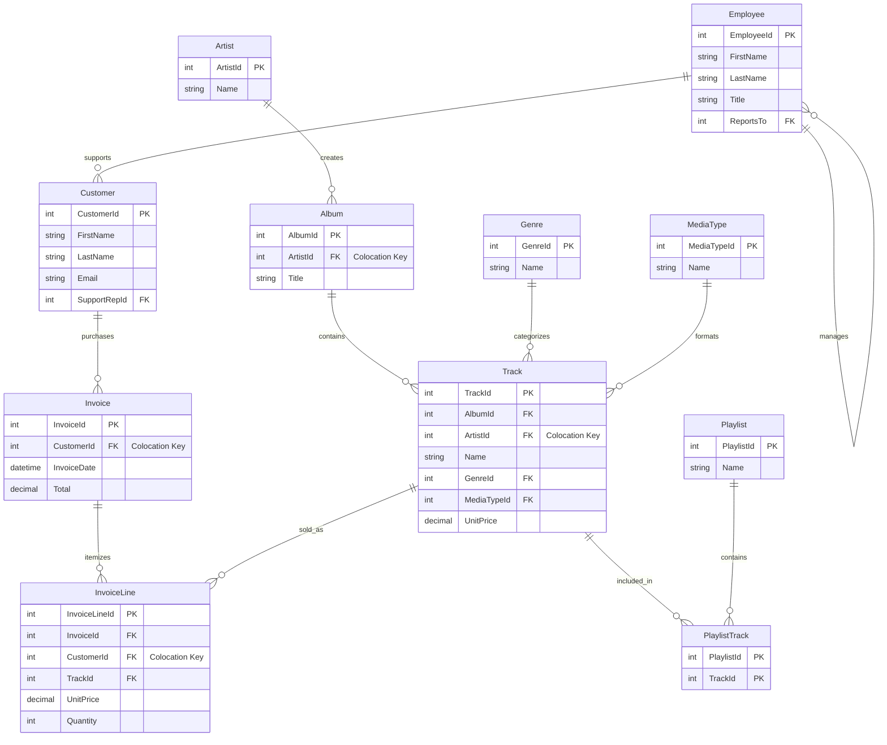

# Apache Ignite 3 Reference Applications

Reference applications demonstrating Apache Ignite 3 Java API usage patterns using a consistent music store sample dataset.

## Project Overview

This multi-module project provides practical, runnable examples for all major Apache Ignite 3 features, with support for both Maven and Gradle build systems:

- **Schema-as-Code** with annotations
- **Table API** for object-oriented data access
- **SQL API** for relational data operations
- **Transactions** and consistency patterns
- **Compute API** for distributed processing
- **Data Streaming** for high-throughput operations
- **Integration Patterns** with popular frameworks

## Build System Choice

This project supports **both Maven and Gradle** to accommodate different preferences and workflows:

- **Maven**: Traditional Java build tool with XML configuration
- **Gradle**: Modern build tool with Groovy DSL and included wrapper (no installation required)

**Choose based on your preference** - all examples work identically with either build system. The Gradle wrapper (`./gradlew`) eliminates installation requirements, while Maven may be more familiar to enterprise developers.

## Quick Start

### Prerequisites

- Java 17+
- **Build System** (choose one):
  - Maven 3.8+
  - Gradle (uses included wrapper - no installation required)
- Docker 20.10.0 or newer & Docker Compose 2.23.1 or newer

For Docker installation instructions, see the [Apache Ignite 3 Docker Installation Guide](https://ignite.apache.org/docs/ignite3/latest/installation/installing-using-docker).

Running Ignite in Docker is preferred but not required.

### 1. Start Ignite 3 Cluster

> [!WARNING]
> **Required First Step**: Start and initialize the 3-node Docker cluster before running any applications.

**Quick setup** (recommended):

```bash
cd 00-docker
./init-cluster.sh
```

**Alternative manual steps** (if needed):

```bash
cd 00-docker
# Note: Use docker-compose or docker compose as detected by your system
docker-compose up -d  # or: docker compose up -d
```

Initialize the cluster:

```bash
curl -s -X POST http://localhost:10300/management/v1/cluster/init \
-H "Content-Type: application/json" \
-d '{
  "metaStorageNodes": ["node1", "node2", "node3"],
  "cmgNodes": ["node1", "node2", "node3"],
  "clusterName": "ignite3-reference-cluster"
}'
```

Verify cluster is initialized and ready:

```bash
curl http://localhost:10300/management/v1/cluster/state
# {"cmgNodes":["node1","node2","node3"],"msNodes":["node1","node2","node3"],"igniteVersion":"3.0.0","clusterTag":{"clusterName":"ignite3-reference-cluster","clusterId":"b30643d3-34b0-4c2a-b8f7-e74c5f8ca316"}}
```

### 2. Setup Sample Data

**Start with complete initialization** (recommended for first-time users):

   **Maven:**

   ```bash
   cd 01-sample-data-setup
   mvn compile exec:java
   ```

   **Gradle:**

   ```bash
   ./gradlew setupData
   ```

**Or run with options**:

   **Maven:**

   ```bash
   # Reset existing schema and recreate
   mvn compile exec:java -Dexec.args="--reset"
   
   # Custom cluster address
   mvn compile exec:java -Dexec.args="192.168.1.100:10800"
   ```

   **Gradle:**

   ```bash
   # Reset existing schema and recreate
   ./gradlew setupData --args="--reset"
   
   # Load core dataset only
   ./gradlew setupData --args="--core"
   
   # Custom cluster address
   ./gradlew setupData --args="192.168.1.100:10800"
   
   # Combine options
   ./gradlew setupData --args="--reset --core"
   ```

### 3. Run Examples

## Quick Start Applications

| Module | Application | Description | Run Command |
|--------|-------------|-------------|-------------|
| 01-sample-data-setup | MusicStoreSetup | Initialize database schema and sample data | `./gradlew setupData` |
| 02-getting-started-app | HelloWorldApp | Basic CRUD operations introduction | `./gradlew helloWorld` |
| 02-getting-started-app | BasicSetupDemo | Related tables and transactions | `./gradlew basicSetup` |
| 02-getting-started-app | ConnectionExamples | Connection pattern examples | `./gradlew connectionExamples` |

## API Demonstrations

| Module | Application | Description | Run Command |
|--------|-------------|-------------|-------------|
| 03-schema-annotations-app | SchemaAPIDemo | Schema annotations and design patterns | `./gradlew schemaDemo` |
| 04-table-api-app | TableAPIDemo | Table API operations and patterns | `./gradlew tableDemo` |
| 05-sql-api-app | SQLAPIDemo | SQL API operations and analytics | `./gradlew sqlDemo` |
| 06-transactions-app | TransactionAPIDemo | Transaction patterns and ACID guarantees | `./gradlew transactionDemo` |
| 07-compute-api-app | ComputeAPIDemo | Compute API distributed processing | `./gradlew computeDemo` |
| 08-data-streaming-app | DataStreamingAPIDemo | Data streaming and bulk operations | `./gradlew streamingDemo` |
| 09-caching-patterns-app | CachingAPIDemo | Caching patterns and strategies | `./gradlew cachingDemo` |
| 10-file-streaming-app | FileStreamingAPIDemo | File streaming with backpressure | `./gradlew fileStreamingDemo` |
| 11-performance-optimization-app | PerformanceOptimizationAPIDemo | Performance optimization techniques | `./gradlew performanceDemo` |

## Convenience Commands

```bash
# Run all main demos in sequence (full tour)
./gradlew runAllDemos

# Get help with available examples
./gradlew listExamples
```

> **💡 Tip**: Each module contains multiple applications. The commands above run the main orchestrator for each module. See individual module README files for detailed application lists and specific examples.

**From individual subproject directories** (for specific examples):

```bash
cd 04-table-api-app
../gradlew runBasicTableOperations
../gradlew runRecordViewExamples
../gradlew runKeyValueExamples
```

### Project Structure

```text
ignite3-reference-apps/
├── 00-docker/                         # Docker cluster setup (start here!)
├── 01-sample-data-setup/              # Foundation module with sample data
├── 02-getting-started-app/            # QUICK START - just the key concepts
├── 03-schema-annotations-app/         # Schema-as-code examples
├── 04-table-api-app/                  # Object-oriented data access
├── 05-sql-api-app/                    # SQL operations and queries
├── 06-transactions-app/               # Transaction patterns
├── 07-compute-api-app/                # Distributed computing
├── 08-data-streaming-app/             # High-throughput data loading
├── 09-caching-patterns-app/           # Caching strategies
├── 10-file-streaming-app/             # File-based streaming with backpressure
└── 11-performance-optimization-app/   # Performance tuning and optimization
```

## Sample Dataset

All reference applications use a consistent **music store dataset** with 11 entities organized for distributed performance:



### Distribution Strategy

- **MusicStore Zone** (2 replicas): Primary business data colocated by ArtistId/CustomerId for join performance
- **MusicStoreReplicated Zone** (3 replicas): Reference/lookup data replicated for high availability

---

## Documentation

- [Apache Ignite 3 Documentation](https://ignite.apache.org/docs/ignite3/latest/)
- [Java API Reference](https://ignite.apache.org/docs/ignite3/latest/developers-guide/clients/java)
- [SQL Reference](https://ignite.apache.org/docs/3.0.0/sql-reference/ddl)

## Contributing

This is a learning-focused project. Contributions that improve clarity, add educational value, or demonstrate additional Ignite 3 patterns are welcome.

## License

Licensed under the Apache License 2.0 - see the [LICENSE](../LICENSE) file for details.
