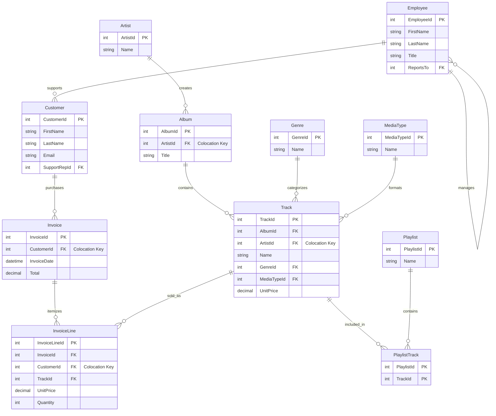

# Apache Ignite 3 Reference Applications

A collection of reference applications demonstrating Apache Ignite 3 Java API usage patterns using a consistent music store sample dataset.

## Project Overview

This multi-module Maven project provides practical, runnable examples for all major Apache Ignite 3 features:

- **Schema-as-Code** with annotations
- **Table API** for object-oriented data access
- **SQL API** for relational data operations
- **Transactions** and consistency patterns
- **Compute API** for distributed processing
- **Data Streaming** for high-throughput operations
- **Integration Patterns** with popular frameworks

## Quick Start

### Prerequisites

- Java 17+
- Maven 3.8+
- Docker 20.10.0 or newer & Docker Compose 2.23.1 or newer

> [!NOTE]
> For Docker installation instructions, see the [Apache Ignite 3 Docker Installation Guide](https://ignite.apache.org/docs/ignite3/latest/installation/installing-using-docker).
> Docker installation is preferred but not required.

### 1. Start Ignite 3 Cluster

**⚠️ Required First Step**: Start and initialize the 3-node Docker cluster before running any applications.

**Quick setup** (recommended):

```bash
cd 00-docker
./init-cluster.sh
```

**Manual setup**:

```bash
cd 00-docker
./init-cluster.sh
```

**Alternative manual steps** (if needed):

```bash
cd 00-docker
# Note: Use docker-compose or docker compose as detected by your system
docker-compose up -d  # or: docker compose up -d
```

Verify cluster is initialized and ready:

```bash
curl http://localhost:10300/management/v1/cluster/state
# {"cmgNodes":["node1","node2","node3"],"msNodes":["node1","node2","node3"],"igniteVersion":"3.0.0","clusterTag":{"clusterName":"ignite3-reference-cluster","clusterId":"b30643d3-34b0-4c2a-b8f7-e74c5f8ca316"}}
```

### 2. Setup Sample Data

1. **Start with complete initialization** (recommended for first-time users):

   ```bash
   cd 01-sample-data-setup
   mvn compile exec:java
   ```

2. **Or run with options**:

   ```bash
   # Include extended dataset
   mvn compile exec:java -Dexec.args="--extended"
   
   # Reset existing schema and recreate
   mvn compile exec:java -Dexec.args="--reset"
   
   # Custom cluster address
   mvn compile exec:java -Dexec.args="192.168.1.100:10800"
   ```

### Project Structure

```text
ignite3-reference-apps/
├── 00-docker/                      # Docker cluster setup (start here!)
├── 01-sample-data-setup/           # Foundation module with sample data
├── 02-getting-started-app/         # QUICK START - just the key concepts
├── 03-schema-annotations-app/      # Schema-as-code examples
├── 04-table-api-app/               # Object-oriented data access
├── 05-sql-api-app/                 # SQL operations and queries
├── 06-transactions-app/            # Transaction patterns
├── 07-compute-api-app/             # Distributed computing
├── 08-data-streaming-app/          # High-throughput data loading
├── 09-caching-patterns-app/        # Caching strategies
└── 10-file-streaming-app/          # File-based streaming with backpressure
```

## Sample Dataset

All reference applications use a consistent **music store dataset** with 11 entities organized for optimal distributed performance:



### Distribution Strategy

- **MusicStore Zone** (2 replicas): Primary business data colocated by ArtistId/CustomerId for optimal join performance
- **MusicStoreReplicated Zone** (3 replicas): Reference/lookup data replicated for high availability


## Reference Apps Overview

### 1. Sample Data Setup

Creates the foundation music store dataset with schema and sample data for all reference applications. Handles zone configuration, table creation, and transactional data loading using hierarchical music store model with colocation strategies.

**Key API concepts**: Schema-as-code, zone configuration, transactional loading, data distribution  
**Classes**: `MusicStoreSetup`, `SchemaUtils`, `DataLoader`, model POJOs  
**Primer section**: [Getting Started](../docs/01-foundation/02-getting-started.md)  
**App guide**: [`01-sample-data-setup/README.md`](01-sample-data-setup/README.md)

### 2. Getting Started

Introduces core Ignite 3 client patterns and basic data operations using simple music store scenarios. Establishes fundamental distributed database concepts through connection management, basic CRUD operations, and simple SQL queries.

**Key API concepts**: Client connections, basic CRUD, simple queries, distributed fundamentals  
**Classes**: `HelloWorldApp`, `ConnectionExamples`, `BasicSetupDemo`  
**Prerequisites**: Completed sample-data-setup  
**Primer section**: [Introduction and Architecture](../docs/01-foundation/01-introduction-and-architecture.md)  
**App guide**: [`02-getting-started-app/README.md`](02-getting-started-app/README.md)

### 3. Schema Annotations

Demonstrates schema-as-code using Java annotations to define tables, zones, and colocation strategies. Maps Java classes to distributed tables with optimal data placement for music streaming performance scenarios.

**Key API concepts**: Annotation-driven schema, POJO mapping, colocation, data placement  
**Classes**: `SchemaAPIDemo`, `BasicAnnotations`, `ColocationPatterns`, `SchemaValidation`  
**Primer section**: [Basic Annotations](../docs/02-schema-design/01-basic-annotations.md)  
**App guide**: [`03-schema-annotations-app/README.md`](03-schema-annotations-app/README.md)

### 4. Table API

Explores object-oriented data access through RecordView and KeyValueView APIs. Covers synchronous and asynchronous operations, bulk processing, and type-safe data access patterns using music store entities.

**Key API concepts**: RecordView, KeyValueView, async operations, bulk processing, type safety  
**Classes**: `TableAPIDemo`, `RecordViewExamples`, `KeyValueExamples`, `AsyncBasicOperations`  
**Primer section**: [Table API Operations](../docs/03-data-access-apis/01-table-api-operations.md)  
**App guide**: [`04-table-api-app/README.md`](04-table-api-app/README.md)

### 5. SQL API

Covers relational data access using SQL operations for complex queries and analytics. Includes DDL/DML operations, parameterized queries, and result set processing for music store analytics and reporting scenarios.

**Key API concepts**: SQL operations, DDL/DML, parameterized queries, result mapping, analytics  
**Classes**: `SQLAPIDemo`, `BasicSQLOperations`, `AdvancedSQLOperations`, `TransactionSQLOperations`  
**Primer section**: [SQL API Analytics](../docs/03-data-access-apis/02-sql-api-analytics.md)  
**App guide**: [`05-sql-api-app/README.md`](05-sql-api-app/README.md)

### 6. Transactions

Implements ACID transaction patterns for consistent data operations across distributed nodes. Covers explicit transaction management, isolation levels, and error handling patterns using music store business workflows.

**Key API concepts**: ACID transactions, isolation levels, explicit transactions, error handling, consistency  
**Classes**: `TransactionAPIDemo`, `BasicTransactions`, `AsyncTransactions`, `BatchTransactions`, `TransactionIsolation`  
**Primer section**: [Transaction Fundamentals](../docs/04-distributed-operations/01-transaction-fundamentals.md)  
**App guide**: [`06-transactions-app/README.md`](06-transactions-app/README.md)

### 7. Compute API

Demonstrates distributed processing using compute jobs that execute near data for optimal performance. Covers job deployment, data colocation benefits, and workflow orchestration using music analytics processing scenarios.

**Key API concepts**: Distributed compute, job deployment, data colocation, workflow orchestration  
**Classes**: `ComputeAPIDemo`, `BasicComputeOperations`, `AdvancedComputeOperations`, `ComputeJobWorkflows`  
**Primer section**: [Compute API Processing](../docs/04-distributed-operations/03-compute-api-processing.md)  
**App guide**: [`07-compute-api-app/README.md`](07-compute-api-app/README.md)

### 8. Data Streaming

Implements high-throughput data ingestion using the DataStreamer API with flow control and backpressure handling. Covers bulk data loading patterns and memory management for large-scale music event processing.

**Key API concepts**: DataStreamer, flow control, backpressure, bulk ingestion, memory management  
**Classes**: `DataStreamingAPIDemo`, `BasicDataStreamerDemo`, `BulkDataIngestion`, `BackpressureHandling`  
**Primer section**: [Data Streaming](../docs/05-performance-scalability/01-data-streaming.md)  
**App guide**: [`08-data-streaming-app/README.md`](08-data-streaming-app/README.md)

### 9. Caching Patterns

Explores caching strategies using Ignite 3 as a high-performance data layer. Implements cache-aside, write-through, and write-behind patterns for music streaming applications with external data source integration.

**Key API concepts**: Caching patterns, cache-aside, write-through, write-behind, external integration  
**Classes**: `CachingAPIDemo`, `CacheAsidePatterns`, `WriteThroughPatterns`, `WriteBehindPatterns`, `ExternalDataSource`  
**Primer section**: [Caching Strategies](../docs/05-performance-scalability/02-caching-strategies.md)  
**App guide**: [`09-caching-patterns-app/README.md`](09-caching-patterns-app/README.md)

### 10. File Streaming

Demonstrates file-based reactive streaming with end-to-end backpressure propagation from file I/O to cluster ingestion. Covers demand-driven CSV processing with performance monitoring and resource management for large-scale data file processing.

**Key API concepts**: Reactive streaming, backpressure propagation, file I/O, performance monitoring  
**Classes**: `FileStreamingAPIDemo`, `FileBackpressureStreaming`, `FileStreamingPublisher`, `StreamingMetrics`, `SampleDataGenerator`  
**Primer section**: [Data Streaming](../docs/05-performance-scalability/01-data-streaming.md)  
**App guide**: [`10-file-streaming-app/README.md`](10-file-streaming-app/README.md)

## Building and Running

### Build All Modules

```bash
mvn clean compile
```

### Run Specific Application

```bash
cd [module-name]
mvn compile exec:java
```

### Run with Custom Cluster Address

```bash
mvn compile exec:java -Dexec.args="192.168.1.100:10800"
```

## Configuration

### Default Settings

- **Cluster Addresses**: `127.0.0.1:10800`, `127.0.0.1:10801`, `127.0.0.1:10802` (all nodes recommended)
- **Connection Timeout**: 30 seconds
- **Zone Replicas**: 2 (MusicStore), 3 (MusicStoreReplicated)
- **Partitions**: 25 per zone

### Customization

Edit configuration in:

- `sample-data-setup/src/main/java/com/apache/ignite/examples/setup/config/`
- Individual module application properties

## Learning Path

**Recommended order for learning Ignite 3:**

1. **sample-data-setup** - Understanding the dataset and basic setup
2. **getting-started-app** - Basic operations and connections  
3. **schema-annotations-app** - Schema definition and table creation
4. **table-api-app** - Object-oriented data access
5. **sql-api-app** - SQL operations and queries
6. **transactions-app** - ACID transactions and consistency
7. **compute-api-app** - Distributed processing
8. **data-streaming-app** - High-throughput operations
9. **caching-patterns-app** - Caching strategies and patterns
10. **file-streaming-app** - File-based reactive streaming with backpressure

## Documentation

- [Apache Ignite 3 Documentation](https://ignite.apache.org/docs/ignite3/latest/)
- [Java API Reference](https://ignite.apache.org/docs/ignite3/latest/developers-guide/clients/java)
- [SQL Reference](https://ignite.apache.org/docs/3.0.0/sql-reference/ddl)

## Contributing

This is a learning-focused project. Contributions that improve clarity, add educational value, or demonstrate additional Ignite 3 patterns are welcome.

## License

Licensed under the Apache License 2.0 - see the [LICENSE](../LICENSE) file for details.
