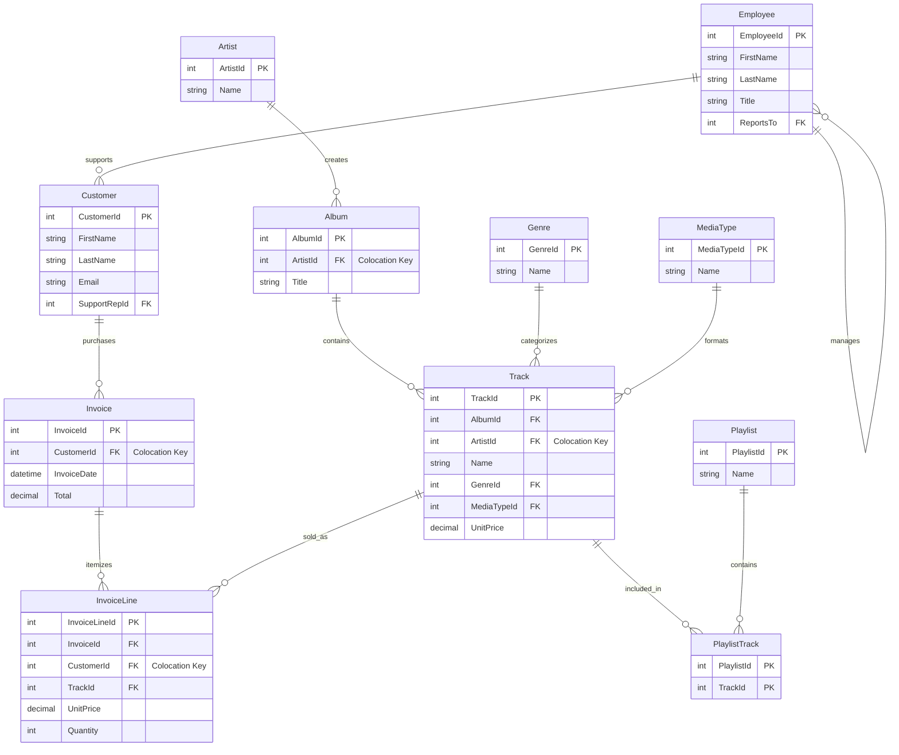

# Apache Ignite 3 Reference Applications

A collection of reference applications demonstrating Apache Ignite 3 Java API usage patterns using a consistent music store sample dataset.

## Project Overview

This multi-module Maven project provides practical, runnable examples for all major Apache Ignite 3 features:

- **Schema-as-Code** with annotations
- **Table API** for object-oriented data access
- **SQL API** for relational data operations
- **Transactions** and consistency patterns
- **Compute API** for distributed processing
- **Data Streaming** for high-throughput operations
- **Integration Patterns** with popular frameworks

## Quick Start

### Prerequisites

- Java 17+
- Maven 3.8+
- Docker 20.10.0 or newer & Docker Compose 2.23.1 or newer

For Docker installation instructions, see the [Apache Ignite 3 Docker Installation Guide](https://ignite.apache.org/docs/ignite3/latest/installation/installing-using-docker).

Running Ignite in Docker is preferred but not required.

### 1. Start Ignite 3 Cluster

> [!WARNING]
> **Required First Step**: Start and initialize the 3-node Docker cluster before running any applications.

**Quick setup** (recommended):

```bash
cd 00-docker
./init-cluster.sh
```

**Alternative manual steps** (if needed):

```bash
cd 00-docker
# Note: Use docker-compose or docker compose as detected by your system
docker-compose up -d  # or: docker compose up -d
```

Verify cluster is initialized and ready:

```bash
curl http://localhost:10300/management/v1/cluster/state
# {"cmgNodes":["node1","node2","node3"],"msNodes":["node1","node2","node3"],"igniteVersion":"3.0.0","clusterTag":{"clusterName":"ignite3-reference-cluster","clusterId":"b30643d3-34b0-4c2a-b8f7-e74c5f8ca316"}}
```

### 2. Setup Sample Data

1. **Start with complete initialization** (recommended for first-time users):

   ```bash
   cd 01-sample-data-setup
   mvn compile exec:java
   ```

2. **Or run with options**:

   ```bash
   # Include extended dataset
   mvn compile exec:java -Dexec.args="--extended"
   
   # Reset existing schema and recreate
   mvn compile exec:java -Dexec.args="--reset"
   
   # Custom cluster address
   mvn compile exec:java -Dexec.args="192.168.1.100:10800"
   ```

### Project Structure

```text
ignite3-reference-apps/
├── 00-docker/                      # Docker cluster setup (start here!)
├── 01-sample-data-setup/           # Foundation module with sample data
├── 02-getting-started-app/         # QUICK START - just the key concepts
├── 03-schema-annotations-app/      # Schema-as-code examples
├── 04-table-api-app/               # Object-oriented data access
├── 05-sql-api-app/                 # SQL operations and queries
├── 06-transactions-app/            # Transaction patterns
├── 07-compute-api-app/             # Distributed computing
├── 08-data-streaming-app/          # High-throughput data loading
├── 09-caching-patterns-app/        # Caching strategies
└── 10-file-streaming-app/          # File-based streaming with backpressure
```

## Sample Dataset

All reference applications use a consistent **music store dataset** with 11 entities organized for optimal distributed performance:



### Distribution Strategy

- **MusicStore Zone** (2 replicas): Primary business data colocated by ArtistId/CustomerId for optimal join performance
- **MusicStoreReplicated Zone** (3 replicas): Reference/lookup data replicated for high availability

## Learning Apache Ignite 3 Java API with reference apps

This series of reference applications builds your expertise progressively, from basic connections to advanced distributed processing patterns. Each app teaches specific concepts while building on previous knowledge.

**Recommended order for learning Ignite 3:**

1. **sample-data-setup** - Understanding the dataset and basic setup
2. **getting-started-app** - Basic operations and connections  
3. **schema-annotations-app** - Schema definition and table creation
4. **table-api-app** - Object-oriented data access
5. **sql-api-app** - SQL operations and queries
6. **transactions-app** - ACID transactions and consistency
7. **compute-api-app** - Distributed processing
8. **data-streaming-app** - High-throughput operations
9. **caching-patterns-app** - Caching strategies and patterns
10. **file-streaming-app** - Optional file-based reactive streaming with backpressure

### Sample Data Setup

**What you'll build**: A complete music store database with optimal data distribution

Create tables, zones, and load sample data for a music streaming platform. Learn how data placement affects performance by colocating related records (artists with their albums) on the same nodes. This foundation supports all subsequent learning exercises.

- **Setup zones**: Configure data distribution with replication policies
- **Create schema**: Use POJOs to define tables with proper indexing
- **Load data**: Insert 200+ artists, 500+ albums, and 3000+ tracks transactionally
- **Verify deployment**: Confirm data is distributed correctly across nodes

*Start here*: [`01-sample-data-setup`](01-sample-data-setup/) | [Getting Started Guide](../docs/01-foundation/02-getting-started.md)

### Getting Started

**What you'll build**: Your first Ignite 3 applications using Table and SQL APIs

Master the essential patterns every Ignite developer needs. Connect to clusters with partition awareness, perform basic CRUD operations, and run simple SQL queries. Learn the default zone pattern for rapid development.

- **Connect reliably**: Multi-node connections with automatic failover
- **Store objects**: Use POJOs with automatic schema creation
- **Query data**: Execute SQL on the same data model
- **Handle errors**: Production-ready error handling and resource management

*Prerequisites*: Sample data setup | *Builds toward*: Schema design patterns  
[`02-getting-started-app`](02-getting-started-app/) | [Introduction and Architecture](../docs/01-foundation/01-introduction-and-architecture.md)

### Schema Annotations  

**What you'll build**: Advanced data models with optimal distribution strategies

Move beyond basic tables to design schemas for distributed performance. Use annotations to control data placement, define relationships, and ensure queries execute efficiently. Learn colocation strategies that minimize network overhead.

- **Colocation design**: Keep related data on the same nodes
- **Zone configuration**: Separate reference data from transactional data
- **Validation patterns**: Ensure schema consistency across environments
- **Performance optimization**: Design for both storage and query efficiency

*Prerequisites*: Getting started | *Builds toward*: Object-oriented data access  
[`03-schema-annotations-app`](03-schema-annotations-app/) | [Basic Annotations](../docs/02-schema-design/01-basic-annotations.md)

### Table API

**What you'll build**: Type-safe, high-performance data access layer

Master object-oriented data access through RecordView and KeyValueView APIs. Learn when to use each approach, implement bulk operations, and use async patterns for maximum throughput. Compare with cache-like access patterns.

- **RecordView operations**: Complete object lifecycle with POJOs
- **KeyValueView patterns**: Cache-like access with explicit null handling
- **Async programming**: Non-blocking operations with CompletableFuture
- **Performance optimization**: Bulk operations and error handling

*Prerequisites*: Schema annotations | *Builds toward*: SQL analytics  
[`04-table-api-app`](04-table-api-app/) | [Table API Operations](../docs/03-data-access-apis/01-table-api-operations.md)

### SQL API

**What you'll build**: Analytics and reporting system using SQL

Implement complex queries, aggregations, and analytics using standard SQL. Learn when SQL excels over Table API, implement parameterized queries, and process large result sets efficiently. Build music streaming analytics.

- **Complex queries**: JOINs across multiple distributed tables  
- **Analytics functions**: COUNT, SUM, AVG with GROUP BY
- **Parameterized queries**: Safe, reusable query patterns
- **Result processing**: Efficient handling of large data sets

*Prerequisites*: Table API | *Builds toward*: Transactional workflows  
[`05-sql-api-app`](05-sql-api-app/) | [SQL API Analytics](../docs/03-data-access-apis/02-sql-api-analytics.md)

### Transactions

**What you'll build**: ACID workflows for business operations

Implement multi-table transactions for critical business workflows. Learn explicit transaction management, handle errors gracefully, and use async patterns for better performance. Build customer order processing workflows.

- **ACID guarantees**: Consistent updates across multiple tables and nodes
- **Error handling**: Rollback strategies and exception management  
- **Async transactions**: High-performance non-blocking patterns
- **Business workflows**: Invoice creation with line items

*Prerequisites*: SQL API | *Builds toward*: Distributed processing  
[`06-transactions-app`](06-transactions-app/) | [Transaction Fundamentals](../docs/04-distributed-operations/01-transaction-fundamentals.md)

### Compute API

**What you'll build**: Distributed analytics processing system

Execute code near your data for optimal performance. Learn job deployment, leverage data colocation, and orchestrate complex workflows. Build music recommendation analytics that processes data in-place.

- **Data colocation**: Execute jobs where data resides
- **Job deployment**: Distribute processing logic across cluster
- **Workflow orchestration**: Coordinate multi-step analytics pipelines
- **Performance patterns**: Minimize data movement and network overhead

*Prerequisites*: Transactions | *Builds toward*: High-throughput ingestion  
[`07-compute-api-app`](07-compute-api-app/) | [Compute API Processing](../docs/04-distributed-operations/03-compute-api-processing.md)

### Data Streaming

**What you'll build**: High-throughput event ingestion system

Handle millions of music streaming events efficiently using the DataStreamer API. Learn backpressure handling, optimize batch sizes, and implement flow control. Achieve 200K+ events per second throughput.

- **Reactive streaming**: Flow control with Java Flow API
- **Batch optimization**: Tune batch sizes for maximum throughput
- **Memory management**: Handle high-volume data without memory bloat
- **Error resilience**: Retry logic and graceful degradation

*Prerequisites*: Compute API | *Builds toward*: Caching strategies  
[`08-data-streaming-app`](08-data-streaming-app/) | [Data Streaming](../docs/05-performance-scalability/01-data-streaming.md)

### Caching Patterns

**What you'll build**: Multi-tier caching system with external data sources

Implement cache-aside, write-through, and write-behind patterns using Ignite 3 as a high-performance cache layer. Integrate with external databases and handle cache consistency challenges.

- **Cache-aside**: Lazy loading with application-controlled caching
- **Write-through**: Immediate consistency with external systems
- **Write-behind**: High-performance deferred persistence
- **Integration patterns**: Connect with external databases and APIs

*Prerequisites*: Data streaming | *Builds toward*: File processing  
[`09-caching-patterns-app`](09-caching-patterns-app/) | [Caching Strategies](../docs/05-performance-scalability/02-caching-strategies.md)

### File Streaming

**What you'll build**: File processing system with reactive backpressure

Process large CSV files using reactive streams with end-to-end backpressure propagation. Learn demand-driven I/O, implement performance monitoring, and handle memory pressure gracefully.

- **Reactive file I/O**: Demand-driven CSV processing
- **Backpressure propagation**: Flow control from file reading to cluster ingestion
- **Performance monitoring**: Real-time metrics and system health
- **Resource management**: Handle large files without memory exhaustion

*Prerequisites*: Caching patterns | *Completes*: Full API mastery  
[`10-file-streaming-app`](10-file-streaming-app/) | [Data Streaming](../docs/05-performance-scalability/01-data-streaming.md)

---

**Each app runs independently**: `cd [app-directory] && mvn compile exec:java`  
**Complete sequence**: Follow 1→10 for comprehensive Ignite 3 expertise

## Building and Running

### Build All Modules

```bash
mvn clean compile
```

### Run Specific Application

```bash
cd [module-name]
mvn compile exec:java
```

### Run with Custom Cluster Address

```bash
mvn compile exec:java -Dexec.args="192.168.1.100:10800"
```

## Configuration

### Default Settings

- **Cluster Addresses**: `127.0.0.1:10800`, `127.0.0.1:10801`, `127.0.0.1:10802` (all nodes recommended)
- **Connection Timeout**: 30 seconds
- **Zone Replicas**: 2 (MusicStore), 3 (MusicStoreReplicated)
- **Partitions**: 25 per zone

### Customization

Edit configuration in:

- `sample-data-setup/src/main/java/com/apache/ignite/examples/setup/config/`
- Individual module application properties

## Documentation

- [Apache Ignite 3 Documentation](https://ignite.apache.org/docs/ignite3/latest/)
- [Java API Reference](https://ignite.apache.org/docs/ignite3/latest/developers-guide/clients/java)
- [SQL Reference](https://ignite.apache.org/docs/3.0.0/sql-reference/ddl)

## Contributing

This is a learning-focused project. Contributions that improve clarity, add educational value, or demonstrate additional Ignite 3 patterns are welcome.

## License

Licensed under the Apache License 2.0 - see the [LICENSE](../LICENSE) file for details.
